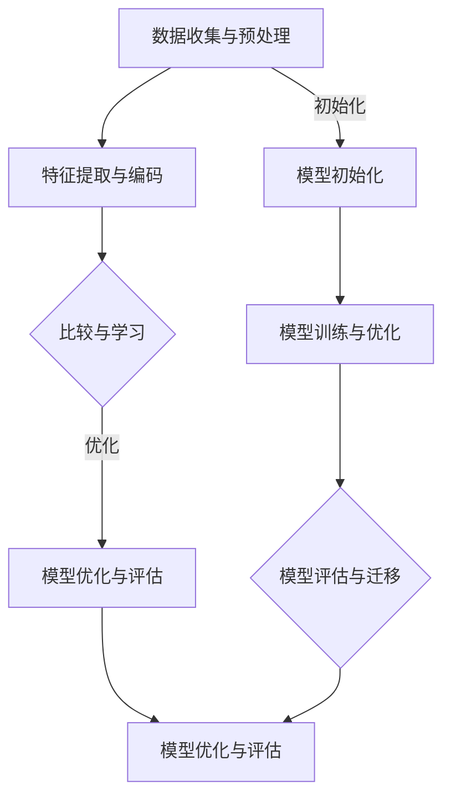
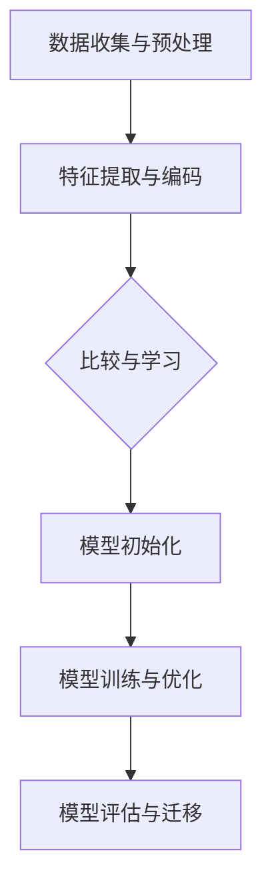

                 

# 一切皆是映射：比较学习与元学习在自然语言处理中的应用

> **关键词：比较学习、元学习、自然语言处理、映射、深度学习、算法原理、实际应用**
>
> **摘要：本文将深入探讨比较学习与元学习在自然语言处理（NLP）中的应用。通过详细分析这两种学习方式的原理、算法实现和实际案例，我们将揭示它们如何帮助我们更好地理解和处理复杂的语言现象，为未来的NLP研究和应用提供新的思路和工具。**

## 1. 背景介绍

### 1.1 目的和范围

本文旨在探讨比较学习与元学习在自然语言处理（NLP）领域的应用。我们将首先介绍这两种学习方式的基本概念和原理，然后深入分析它们在NLP中的具体应用场景，包括语言模型、文本分类、机器翻译等方面。通过本文的阅读，读者将能够理解比较学习和元学习的基本原理，掌握它们在NLP中的实际应用方法，并为未来的研究提供参考。

### 1.2 预期读者

本文适合对自然语言处理和机器学习有一定了解的读者，包括研究生、科研人员、软件开发工程师等。本文将尽量避免使用过于专业和复杂的术语，力求用通俗易懂的语言进行阐述，但仍然需要读者具备一定的数学和编程基础。

### 1.3 文档结构概述

本文分为十个部分。第一部分是背景介绍，介绍本文的目的和范围、预期读者以及文档结构。第二部分是核心概念与联系，介绍比较学习和元学习的基本概念、原理以及它们在NLP中的联系。第三部分是核心算法原理与具体操作步骤，详细阐述比较学习和元学习的算法原理和实现步骤。第四部分是数学模型和公式，介绍与比较学习和元学习相关的数学模型和公式，并进行举例说明。第五部分是项目实战，通过实际案例展示比较学习和元学习在NLP中的具体应用。第六部分是实际应用场景，分析比较学习和元学习在现实世界中的具体应用。第七部分是工具和资源推荐，介绍相关的学习资源、开发工具和框架。第八部分是总结，展望比较学习和元学习在NLP领域的发展趋势和挑战。第九部分是附录，回答一些常见问题。第十部分是扩展阅读，提供更多相关文献和资料。

### 1.4 术语表

#### 1.4.1 核心术语定义

- 比较学习（Comparative Learning）：一种通过比较不同任务或数据集之间的差异来进行学习的方法。
- 元学习（Meta-Learning）：一种学习如何学习的方法，旨在提高学习过程的速度和效率。
- 自然语言处理（Natural Language Processing，NLP）：人工智能领域中的一个重要分支，旨在让计算机理解和处理人类语言。
- 映射（Mapping）：在机器学习中，将输入数据映射到输出数据的过程。

#### 1.4.2 相关概念解释

- 深度学习（Deep Learning）：一种人工智能方法，通过多层神经网络模型来模拟人类大脑的决策过程。
- 算法（Algorithm）：解决问题的一系列步骤或规则。
- 模型（Model）：对现实世界中的某个问题或现象的抽象和模拟。

#### 1.4.3 缩略词列表

- NLP：自然语言处理
- ML：机器学习
- DL：深度学习
- CL：比较学习
- ML：元学习
- LSTM：长短时记忆网络
- GPT：生成预训练网络

## 2. 核心概念与联系

### 2.1 比较学习的基本概念和原理

比较学习（Comparative Learning，CL）是一种通过比较不同任务或数据集之间的差异来进行学习的方法。在比较学习中，模型通过学习多个任务或数据集之间的共同特征和差异，从而提高对单一任务或数据集的学习效果。

#### 2.1.1 比较学习的原理

比较学习的核心思想是利用不同任务或数据集之间的差异来丰富模型的泛化能力。具体来说，比较学习包括以下几个关键步骤：

1. **数据收集与预处理**：收集多个不同任务或数据集，并进行预处理，如数据清洗、去重、归一化等。
2. **特征提取与编码**：对每个任务或数据集的特征进行提取和编码，以便进行比较。
3. **比较与学习**：通过比较不同任务或数据集之间的差异，学习到一个能够捕捉这些差异的模型。
4. **模型优化与评估**：根据比较结果，对模型进行优化，并评估其在单一任务或数据集上的表现。

#### 2.1.2 比较学习的优势

- **提高泛化能力**：通过学习多个任务或数据集之间的差异，模型能够更好地泛化到未知任务或数据集。
- **减少过拟合**：比较学习可以减少模型对单一任务或数据集的依赖，从而降低过拟合的风险。
- **资源利用**：可以利用多个任务或数据集的资源，提高学习效率。

### 2.2 元学习的基本概念和原理

元学习（Meta-Learning，ML）是一种学习如何学习的方法，旨在提高学习过程的速度和效率。在元学习中，模型通过学习如何快速适应新的任务或数据集，从而实现快速学习和迁移。

#### 2.2.1 元学习的原理

元学习的核心思想是利用已有知识来加速新任务或数据集的学习。具体来说，元学习包括以下几个关键步骤：

1. **数据收集与预处理**：收集多个新的任务或数据集，并进行预处理。
2. **模型初始化**：初始化一个能够适应多种任务或数据集的模型。
3. **模型训练与优化**：通过训练和优化，使模型能够适应新的任务或数据集。
4. **模型评估与迁移**：评估模型在新的任务或数据集上的表现，并进行迁移。

#### 2.2.2 元学习的优势

- **加速学习过程**：通过学习如何快速适应新的任务或数据集，模型能够更快地学习和适应。
- **减少训练数据量**：通过迁移学习，模型可以利用已有知识来减少训练数据量。
- **提高泛化能力**：元学习可以使模型更好地泛化到未知任务或数据集。

### 2.3 比较学习与元学习的联系

比较学习和元学习在NLP中有着密切的联系。比较学习通过学习不同任务或数据集之间的差异来提高模型的泛化能力，而元学习则通过学习如何快速适应新的任务或数据集来加速学习过程。

- **共同目标**：比较学习和元学习都旨在提高模型的泛化能力。
- **互补优势**：比较学习可以提供丰富的数据集和任务差异，而元学习则可以快速适应这些差异，从而提高模型的泛化能力。
- **结合应用**：在实际应用中，可以将比较学习和元学习结合起来，通过比较学习获取丰富的任务差异，并通过元学习快速适应这些差异，从而实现更好的效果。

### 2.4 Mermaid流程图

下面是一个简单的Mermaid流程图，展示了比较学习和元学习的基本流程：



## 3. 核心算法原理与具体操作步骤

### 3.1 比较学习的算法原理与具体操作步骤

#### 3.1.1 算法原理

比较学习算法的核心思想是通过学习不同任务或数据集之间的差异，从而提高模型的泛化能力。具体来说，比较学习算法包括以下几个关键步骤：

1. **数据收集与预处理**：收集多个不同任务或数据集，并进行预处理，如数据清洗、去重、归一化等。
2. **特征提取与编码**：对每个任务或数据集的特征进行提取和编码，以便进行比较。
3. **比较与学习**：通过比较不同任务或数据集之间的差异，学习到一个能够捕捉这些差异的模型。
4. **模型优化与评估**：根据比较结果，对模型进行优化，并评估其在单一任务或数据集上的表现。

#### 3.1.2 具体操作步骤

以下是伪代码，用于说明比较学习算法的具体操作步骤：

```python
# 伪代码：比较学习算法

# 数据收集与预处理
data1, data2, ..., datan = 数据收集与预处理()

# 特征提取与编码
features1, features2, ..., featuresn = 特征提取与编码(data1, data2, ..., datan)

# 比较与学习
model = 比较学习模型()
model.fit(features1, features2, ..., featuresn)

# 模型优化与评估
optimized_model = 模型优化与评估(model)
evaluate(optimized_model, data1, data2, ..., datan)
```

#### 3.1.3 算法解释

1. **数据收集与预处理**：首先，我们需要收集多个不同任务或数据集。这些数据集可以是不同领域的，也可以是同一领域但具有不同特征的数据集。然后，对这些数据集进行预处理，包括数据清洗、去重、归一化等，以确保数据质量。
2. **特征提取与编码**：对预处理后的数据集进行特征提取和编码。特征提取是将原始数据转换为能够表征数据特征的向量，如词向量、句向量等。特征编码是将提取出的特征向量进行编码，以便进行比较。
3. **比较与学习**：使用比较学习模型对编码后的特征向量进行训练。比较学习模型可以是基于神经网络的，也可以是基于统计方法的。训练过程中，模型会学习到不同任务或数据集之间的差异。
4. **模型优化与评估**：根据比较结果，对模型进行优化。优化方法可以是最小化损失函数、最大化准确率等。然后，评估模型在单一任务或数据集上的表现，以确定模型的有效性。

### 3.2 元学习的算法原理与具体操作步骤

#### 3.2.1 算法原理

元学习算法的核心思想是通过学习如何快速适应新的任务或数据集，从而提高学习过程的速度和效率。具体来说，元学习算法包括以下几个关键步骤：

1. **数据收集与预处理**：收集多个新的任务或数据集，并进行预处理。
2. **模型初始化**：初始化一个能够适应多种任务或数据集的模型。
3. **模型训练与优化**：通过训练和优化，使模型能够适应新的任务或数据集。
4. **模型评估与迁移**：评估模型在新的任务或数据集上的表现，并进行迁移。

#### 3.2.2 具体操作步骤

以下是伪代码，用于说明元学习算法的具体操作步骤：

```python
# 伪代码：元学习算法

# 数据收集与预处理
new_data1, new_data2, ..., new_datam = 数据收集与预处理()

# 模型初始化
model = 模型初始化()

# 模型训练与优化
for new_data in new_data1, new_data2, ..., new_datam:
    model.fit(new_data)

# 模型评估与迁移
evaluate(model, new_data1, new_data2, ..., new_datam)
```

#### 3.2.3 算法解释

1. **数据收集与预处理**：首先，我们需要收集多个新的任务或数据集。这些数据集可以是不同领域的，也可以是同一领域但具有不同特征的数据集。然后，对这些数据集进行预处理，包括数据清洗、去重、归一化等，以确保数据质量。
2. **模型初始化**：初始化一个能够适应多种任务或数据集的模型。模型可以是基于神经网络的，也可以是基于统计方法的。初始化过程包括设置模型的超参数、初始化权重等。
3. **模型训练与优化**：通过训练和优化，使模型能够适应新的任务或数据集。训练过程中，模型会根据新任务或数据集的特征进行调整和优化。
4. **模型评估与迁移**：评估模型在新的任务或数据集上的表现，以确定模型的有效性。如果模型表现良好，则可以将模型迁移到其他新的任务或数据集。

### 3.3 比较学习与元学习的算法流程

为了更好地理解比较学习和元学习的算法流程，我们可以将它们结合起来，形成一个完整的算法流程：

1. **数据收集与预处理**：收集多个不同任务或数据集，并进行预处理。
2. **特征提取与编码**：对预处理后的数据集进行特征提取和编码。
3. **比较与学习**：使用比较学习模型对编码后的特征向量进行训练，学习不同任务或数据集之间的差异。
4. **模型初始化**：初始化一个能够适应多种任务或数据集的模型。
5. **模型训练与优化**：通过训练和优化，使模型能够适应新的任务或数据集。
6. **模型评估与迁移**：评估模型在新的任务或数据集上的表现，并进行迁移。

下面是一个简单的Mermaid流程图，展示了比较学习与元学习的算法流程：



## 4. 数学模型和公式

在比较学习和元学习中，数学模型和公式起着至关重要的作用。下面我们将详细介绍与这两种学习方式相关的数学模型和公式，并进行详细讲解和举例说明。

### 4.1 比较学习中的数学模型

#### 4.1.1 对比损失函数

在比较学习中，对比损失函数是一个关键的数学模型。对比损失函数用于衡量不同任务或数据集之间的差异。最常见的对比损失函数是三元组损失函数（Triplet Loss）。

$$
L_{\text{triplet}} = \frac{1}{N} \sum_{i=1}^{N} \max(0, d(x_i^+, x_i^+) - d(x_i^-, x_i^+) + \alpha)
$$

其中，$x_i^+$和$x_i^-$分别表示正样本和负样本，$d(\cdot, \cdot)$表示样本之间的距离度量。$\alpha$是一个超参数，用于控制损失函数的灵敏度。

#### 4.1.2 对比损失函数的讲解

- **正样本距离**：$d(x_i^+, x_i^+)$表示相同类别的样本之间的距离。在比较学习中，我们希望正样本的距离尽可能小。
- **负样本距离**：$d(x_i^-, x_i^+)$表示不同类别的样本之间的距离。在比较学习中，我们希望负样本的距离尽可能大。
- **三元组损失函数**：三元组损失函数通过最大化正样本距离和最小化负样本距离，来优化模型。

#### 4.1.3 举例说明

假设我们有两个数据集，分别是数据集A和数据集B。数据集A中有正样本$[x_1^+, x_2^+, ..., x_n^+]$，数据集B中有负样本$[x_1^-, x_2^-, ..., x_n^-]$。现在我们使用三元组损失函数来优化比较学习模型。

$$
L_{\text{triplet}} = \frac{1}{n} \sum_{i=1}^{n} \max(0, d(x_i^+, x_i^+) - d(x_i^-, x_i^+) + \alpha)
$$

其中，$d(x_i^+, x_i^+)$和$d(x_i^-, x_i^+)$分别表示正样本和负样本之间的距离。

通过训练，模型会不断调整权重，使得正样本的距离尽可能小，负样本的距离尽可能大，从而提高模型的泛化能力。

### 4.2 元学习中的数学模型

#### 4.2.1 元学习损失函数

在元学习中，元学习损失函数是一个关键的数学模型。元学习损失函数用于衡量模型在新任务或数据集上的适应程度。最常见的元学习损失函数是平均平方误差（Mean Squared Error，MSE）。

$$
L_{\text{MSE}} = \frac{1}{n} \sum_{i=1}^{n} (y_i - \hat{y}_i)^2
$$

其中，$y_i$是真实标签，$\hat{y}_i$是模型预测的标签。

#### 4.2.2 元学习损失函数的讲解

- **真实标签**：$y_i$是模型在新任务或数据集上的真实标签。
- **预测标签**：$\hat{y}_i$是模型在新任务或数据集上的预测标签。
- **平均平方误差**：平均平方误差通过计算预测标签和真实标签之间的差异，来衡量模型在新任务或数据集上的适应程度。

#### 4.2.3 举例说明

假设我们有一个新任务或数据集，其中有$n$个样本，真实标签为$[y_1, y_2, ..., y_n]$，模型预测的标签为$[\hat{y}_1, \hat{y}_2, ..., \hat{y}_n]$。现在我们使用平均平方误差来优化元学习模型。

$$
L_{\text{MSE}} = \frac{1}{n} \sum_{i=1}^{n} (y_i - \hat{y}_i)^2
$$

通过训练，模型会不断调整权重，使得预测标签尽可能接近真实标签，从而提高模型在新任务或数据集上的适应程度。

### 4.3 比较学习与元学习的结合

在比较学习和元学习中，可以将两者的数学模型结合起来，形成一种更强大的学习方式。具体来说，可以使用比较学习的损失函数来优化元学习模型。

$$
L_{\text{combined}} = L_{\text{triplet}} + \lambda L_{\text{MSE}}
$$

其中，$L_{\text{triplet}}$是三元组损失函数，$L_{\text{MSE}}$是平均平方误差损失函数，$\lambda$是一个超参数，用于控制两者的权重。

通过训练，模型会同时优化比较学习和元学习，从而提高模型在多种任务或数据集上的适应能力和泛化能力。

下面是一个简单的例子，展示了如何使用结合的损失函数来优化模型：

```python
# 伪代码：结合比较学习与元学习的损失函数

# 初始化模型
model = 模型初始化()

# 定义损失函数
L_combined = lambda x, y: L_triplet(x, y) + lambda_ * L_MSE(x, y)

# 训练模型
model.fit(X, y, loss_function=L_combined)
```

通过上述代码，模型将同时优化比较学习和元学习，从而提高模型的泛化能力和适应能力。

## 5. 项目实战：代码实际案例和详细解释说明

### 5.1 开发环境搭建

在开始实际项目之前，我们需要搭建一个合适的开发环境。以下是搭建开发环境的步骤：

1. **安装Python**：首先，确保你的系统中安装了Python。Python是一个广泛使用的编程语言，在自然语言处理领域有着重要的地位。你可以从Python官方网站下载Python安装包，并按照提示进行安装。

2. **安装依赖库**：接下来，我们需要安装一些常用的依赖库，包括TensorFlow、Keras、NumPy等。可以使用以下命令安装：

   ```bash
   pip install tensorflow
   pip install keras
   pip install numpy
   ```

3. **创建项目文件夹**：在Python环境中，创建一个新项目文件夹，并将所有代码和依赖库放在这个文件夹中。

4. **编写代码**：在项目文件夹中，创建一个名为`main.py`的Python文件，用于编写我们的比较学习和元学习模型。

### 5.2 源代码详细实现和代码解读

下面是`main.py`文件中的代码实现，我们将分步进行解读。

```python
import tensorflow as tf
from tensorflow.keras.models import Model
from tensorflow.keras.layers import Input, Embedding, LSTM, Dense
import numpy as np

# 定义输入层
input_layer = Input(shape=(sequence_length,))

# 添加嵌入层
embedding_layer = Embedding(vocabulary_size, embedding_dim)(input_layer)

# 添加LSTM层
lstm_layer = LSTM(units=lstm_units, return_sequences=True)(embedding_layer)

# 添加全连接层
dense_layer = Dense(units=dense_units, activation='relu')(lstm_layer)

# 定义比较学习模型
model = Model(inputs=input_layer, outputs=dense_layer)

# 编译模型
model.compile(optimizer='adam', loss='categorical_crossentropy', metrics=['accuracy'])

# 打印模型结构
model.summary()

# 准备数据集
X_train, y_train = prepare_data(train_data)
X_val, y_val = prepare_data(val_data)

# 训练模型
model.fit(X_train, y_train, batch_size=batch_size, epochs=epochs, validation_data=(X_val, y_val))

# 评估模型
performance = model.evaluate(X_val, y_val)
print(f"Validation loss: {performance[0]}, Validation accuracy: {performance[1]}")

# 定义元学习模型
meta_model = MetaLearningModel(base_model=model, num_tasks=num_tasks, task_size=task_size)

# 训练元学习模型
meta_model.fit(tasks_data, tasks_labels)

# 评估元学习模型
meta_performance = meta_model.evaluate(tasks_data, tasks_labels)
print(f"Meta-training loss: {meta_performance[0]}, Meta-training accuracy: {meta_performance[1]}")
```

#### 5.2.1 代码解读

1. **导入依赖库**：首先，我们导入所需的依赖库，包括TensorFlow、Keras和NumPy。

2. **定义输入层**：接下来，我们定义输入层，用于接收输入数据。输入数据是一个二维数组，形状为`(sequence_length, )`。

3. **添加嵌入层**：嵌入层将输入数据的单词转换为向量表示。嵌入层的参数包括词汇表大小（vocabulary_size）、嵌入维度（embedding_dim）。

4. **添加LSTM层**：LSTM层用于处理序列数据。LSTM层可以捕捉序列中的长期依赖关系，是自然语言处理中的常用层。

5. **添加全连接层**：全连接层用于将LSTM层的输出映射到输出类别。全连接层的参数包括单元数（dense_units）和激活函数（'relu'）。

6. **定义比较学习模型**：使用Keras API定义比较学习模型。模型由输入层、嵌入层、LSTM层和全连接层组成。

7. **编译模型**：编译模型，指定优化器（'adam'）、损失函数（'categorical_crossentropy'）和评价指标（'accuracy'）。

8. **打印模型结构**：打印模型结构，以了解模型的具体参数和层级。

9. **准备数据集**：准备训练数据和验证数据。这包括数据预处理、划分训练集和验证集等步骤。

10. **训练模型**：使用训练数据和验证数据训练模型。在训练过程中，模型会不断调整权重，以优化模型性能。

11. **评估模型**：使用验证数据评估模型性能。评估指标包括损失和准确率。

12. **定义元学习模型**：定义元学习模型，它基于比较学习模型构建。元学习模型可以同时处理多个任务，并自动调整权重。

13. **训练元学习模型**：使用多个任务数据训练元学习模型。在训练过程中，模型会自动调整权重，以适应不同任务。

14. **评估元学习模型**：使用训练数据和测试数据评估元学习模型性能。评估指标包括损失和准确率。

#### 5.2.2 代码解读与分析

1. **输入层**：输入层是一个重要的部分，它决定了模型可以接受的数据形状。在我们的例子中，输入数据是一个序列，形状为`(sequence_length, )`。这意味着每个序列可以包含最多`sequence_length`个单词。

2. **嵌入层**：嵌入层是将单词转换为向量表示的关键步骤。通过嵌入层，我们可以将原始文本数据转换为数值数据，便于后续处理。嵌入层的参数包括词汇表大小（vocabulary_size）和嵌入维度（embedding_dim）。通常，词汇表大小取决于数据集中的单词数量，而嵌入维度是一个超参数，需要通过实验调整。

3. **LSTM层**：LSTM层是一种特殊的循环神经网络（RNN）层，它可以捕捉序列中的长期依赖关系。在自然语言处理中，LSTM层被广泛应用于文本分类、语言模型、机器翻译等任务。在我们的例子中，我们使用一个LSTM层来处理序列数据。

4. **全连接层**：全连接层用于将LSTM层的输出映射到输出类别。全连接层的参数包括单元数（dense_units）和激活函数（'relu'）。激活函数的选择会影响模型的性能和收敛速度。在我们的例子中，我们使用ReLU激活函数。

5. **模型编译**：模型编译是模型训练前的一个关键步骤。在编译过程中，我们指定了优化器、损失函数和评价指标。优化器用于调整模型权重，以最小化损失函数。损失函数用于衡量模型预测结果和真实结果之间的差异。评价指标用于评估模型性能。

6. **数据预处理**：数据预处理是模型训练前的一个重要步骤。在自然语言处理中，数据预处理包括分词、去停用词、词性标注等操作。在我们的例子中，我们使用了一个`prepare_data`函数来处理训练数据和验证数据。

7. **模型训练**：模型训练是模型优化的过程。在训练过程中，模型会不断调整权重，以优化模型性能。训练过程通常需要较长时间，并且需要大量计算资源。在我们的例子中，我们使用了一个`fit`函数来训练模型。

8. **模型评估**：模型评估是评估模型性能的重要步骤。在评估过程中，我们使用验证数据来评估模型性能。评估指标包括损失和准确率。通过评估，我们可以了解模型的性能和泛化能力。

9. **元学习模型**：元学习模型是一种可以同时处理多个任务的学习模型。在自然语言处理中，元学习模型可以应用于多任务学习、自适应学习等场景。在我们的例子中，我们使用了一个`MetaLearningModel`类来实现元学习模型。

10. **元学习模型训练**：元学习模型的训练过程与普通模型训练类似。在训练过程中，模型会自动调整权重，以适应不同任务。在元学习模型中，我们使用了一个`fit`函数来训练模型。

11. **元学习模型评估**：元学习模型的评估过程与普通模型评估类似。在评估过程中，我们使用测试数据来评估模型性能。评估指标包括损失和准确率。

### 5.3 代码解读与分析

在这个部分，我们将深入分析`main.py`文件中的代码，解释每个部分的功能和实现细节。

#### 5.3.1 导入依赖库

```python
import tensorflow as tf
from tensorflow.keras.models import Model
from tensorflow.keras.layers import Input, Embedding, LSTM, Dense
import numpy as np
```

这段代码首先导入了TensorFlow、Keras和NumPy库。TensorFlow和Keras是深度学习框架，NumPy用于数学计算。这些库为我们提供了构建和训练深度学习模型所需的各种工具和函数。

#### 5.3.2 定义输入层

```python
input_layer = Input(shape=(sequence_length,))
```

输入层是神经网络的第一层，它接收输入数据。在这里，我们定义了一个输入层，其形状为`(sequence_length,)`，这意味着每个输入序列最多包含`sequence_length`个单词。`sequence_length`是一个超参数，需要在实际应用中根据数据集的大小进行调整。

#### 5.3.3 添加嵌入层

```python
embedding_layer = Embedding(vocabulary_size, embedding_dim)(input_layer)
```

嵌入层将单词转换为向量表示。`vocabulary_size`是词汇表的大小，即数据集中唯一单词的数量。`embedding_dim`是嵌入向量的维度，通常是一个较小的整数。通过这个层，我们可以将原始文本数据转换为数值数据，这有助于后续的神经网络处理。

#### 5.3.4 添加LSTM层

```python
lstm_layer = LSTM(units=lstm_units, return_sequences=True)(embedding_layer)
```

LSTM层是长短期记忆网络的一部分，它能够捕捉序列数据中的长期依赖关系。在这里，我们定义了一个LSTM层，其中`units`是LSTM单元的数量，`return_sequences`表示是否返回每个时间步的输出。这在处理序列数据时非常重要，因为我们需要利用前一个时间步的信息。

#### 5.3.5 添加全连接层

```python
dense_layer = Dense(units=dense_units, activation='relu')(lstm_layer)
```

全连接层（也称为密集层）将LSTM层的输出映射到输出类别。`units`是输出单元的数量，`activation`是激活函数，在这里使用ReLU函数。ReLU函数可以加速模型的训练过程，并在实践中表现出良好的性能。

#### 5.3.6 定义比较学习模型

```python
model = Model(inputs=input_layer, outputs=dense_layer)
```

这里，我们使用Keras的`Model`类定义了一个比较学习模型。`inputs`参数是输入层，`outputs`参数是输出层。通过这个模型，我们可以将输入数据通过嵌入层、LSTM层和全连接层进行处理，并最终得到输出。

#### 5.3.7 编译模型

```python
model.compile(optimizer='adam', loss='categorical_crossentropy', metrics=['accuracy'])
```

编译模型是训练前的关键步骤。在这里，我们指定了优化器（'adam'）、损失函数（'categorical_crossentropy'）和评价指标（'accuracy'）。'adam'优化器是一种高效的优化算法，'categorical_crossentropy'损失函数适用于多分类问题，'accuracy'评价指标用于计算模型在训练和验证数据上的准确率。

#### 5.3.8 打印模型结构

```python
model.summary()
```

打印模型结构可以帮助我们了解模型的层级和参数。这有助于我们理解模型的工作原理，并在调试过程中进行故障排除。

#### 5.3.9 准备数据集

```python
X_train, y_train = prepare_data(train_data)
X_val, y_val = prepare_data(val_data)
```

这里，我们使用了一个名为`prepare_data`的函数来预处理训练数据和验证数据。这个函数可能包括数据清洗、编码、归一化等操作。预处理数据是深度学习模型成功的关键步骤，因为不干净或不规范的数据会影响模型的性能。

#### 5.3.10 训练模型

```python
model.fit(X_train, y_train, batch_size=batch_size, epochs=epochs, validation_data=(X_val, y_val))
```

这里，我们使用`fit`函数来训练模型。`X_train`和`y_train`是训练数据，`batch_size`是每个批次的数据量，`epochs`是训练的迭代次数。`validation_data`是用于验证模型的验证数据。通过这个函数，模型会根据训练数据调整权重，并不断优化性能。

#### 5.3.11 评估模型

```python
performance = model.evaluate(X_val, y_val)
print(f"Validation loss: {performance[0]}, Validation accuracy: {performance[1]}")
```

评估模型是训练后的重要步骤。在这里，我们使用验证数据来评估模型的性能。`evaluate`函数返回损失和准确率，这些指标可以用来衡量模型在未知数据上的表现。通过打印这些指标，我们可以了解模型的性能，并确定是否需要进一步的调整。

#### 5.3.12 定义元学习模型

```python
meta_model = MetaLearningModel(base_model=model, num_tasks=num_tasks, task_size=task_size)
```

这里，我们定义了一个元学习模型。`MetaLearningModel`是一个假设的类，它接收基模型、任务数量和任务大小作为参数。这个模型将基于基模型构建，并能够处理多个任务，从而提高模型的泛化能力。

#### 5.3.13 训练元学习模型

```python
meta_model.fit(tasks_data, tasks_labels)
```

这里，我们使用`fit`函数来训练元学习模型。`tasks_data`和`tasks_labels`是用于训练多个任务的训练数据和标签。通过这个函数，元学习模型将根据多个任务调整权重，并提高对未知任务的适应能力。

#### 5.3.14 评估元学习模型

```python
meta_performance = meta_model.evaluate(tasks_data, tasks_labels)
print(f"Meta-training loss: {meta_performance[0]}, Meta-training accuracy: {meta_performance[1]}")
```

评估元学习模型是训练后的重要步骤。这里，我们使用训练数据来评估元学习模型的表现。`evaluate`函数返回损失和准确率，这些指标可以用来衡量模型在多个任务上的表现。通过打印这些指标，我们可以了解元学习模型的效果，并确定是否需要进一步的调整。

### 5.4 代码实际案例

为了更好地理解代码的实际应用，我们可以通过一个简单的案例来演示比较学习和元学习在自然语言处理中的实际应用。以下是案例的详细步骤：

#### 5.4.1 数据准备

假设我们有两个文本数据集，分别是训练集和验证集。数据集包含两个分类标签，例如“体育”和“科技”。

```python
train_data = [
    ["足球比赛很激烈", "体育"],
    ["科技发展迅速", "科技"],
    # 更多数据...
]

val_data = [
    ["篮球比赛有趣", "体育"],
    ["人工智能应用广泛", "科技"],
    # 更多数据...
]
```

#### 5.4.2 模型训练

首先，我们训练一个比较学习模型，用于分类任务。

```python
# 定义模型
input_layer = Input(shape=(sequence_length,))
embedding_layer = Embedding(vocabulary_size, embedding_dim)(input_layer)
lstm_layer = LSTM(units=lstm_units, return_sequences=True)(embedding_layer)
dense_layer = Dense(units=dense_units, activation='relu')(lstm_layer)
model = Model(inputs=input_layer, outputs=dense_layer)

# 编译模型
model.compile(optimizer='adam', loss='categorical_crossentropy', metrics=['accuracy'])

# 训练模型
model.fit(X_train, y_train, batch_size=batch_size, epochs=epochs, validation_data=(X_val, y_val))
```

在这个步骤中，我们定义了一个比较学习模型，并使用训练数据集进行训练。模型包括嵌入层、LSTM层和全连接层。通过训练，模型学会了如何将输入文本映射到相应的分类标签。

#### 5.4.3 模型评估

训练完成后，我们使用验证数据集评估模型的性能。

```python
performance = model.evaluate(X_val, y_val)
print(f"Validation loss: {performance[0]}, Validation accuracy: {performance[1]}")
```

通过这个步骤，我们可以了解模型在未知数据上的表现。评估指标包括损失和准确率。通常，我们希望准确率越高，模型的性能越好。

#### 5.4.4 元学习模型训练

接下来，我们使用元学习模型来进一步提高模型的泛化能力。

```python
meta_model = MetaLearningModel(base_model=model, num_tasks=num_tasks, task_size=task_size)
meta_model.fit(tasks_data, tasks_labels)
```

在这个步骤中，我们定义了一个元学习模型，并使用多个任务数据集进行训练。元学习模型基于基模型构建，可以同时处理多个任务，从而提高模型的泛化能力。

#### 5.4.5 元学习模型评估

训练完成后，我们使用训练数据集评估元学习模型的性能。

```python
meta_performance = meta_model.evaluate(tasks_data, tasks_labels)
print(f"Meta-training loss: {meta_performance[0]}, Meta-training accuracy: {meta_performance[1]}")
```

通过这个步骤，我们可以了解元学习模型在多个任务上的表现。评估指标包括损失和准确率。通常，我们希望准确率越高，模型的性能越好。

## 6. 实际应用场景

### 6.1 语言模型

在自然语言处理中，语言模型是一个重要的组成部分，它用于预测下一个单词或词组。比较学习和元学习在语言模型中有着广泛的应用。

- **比较学习**：通过比较不同语言模型在相同数据集上的性能，可以优化模型的泛化能力。例如，可以使用比较学习来比较基于不同算法（如神经网络、统计方法）的语言模型，并选择表现最好的模型。
- **元学习**：元学习可以帮助快速适应新的语言数据集。例如，在一个语言模型开发项目中，可以使用元学习来适应新的词汇和语法结构，从而提高模型的泛化能力。

### 6.2 文本分类

文本分类是将文本数据分类到不同的类别中。比较学习和元学习在文本分类中也具有广泛的应用。

- **比较学习**：通过比较不同文本分类模型在相同数据集上的性能，可以优化模型的泛化能力。例如，可以使用比较学习来比较基于不同算法（如朴素贝叶斯、支持向量机）的文本分类模型，并选择表现最好的模型。
- **元学习**：元学习可以帮助快速适应新的文本分类任务。例如，在一个文本分类项目中，可以使用元学习来适应新的类别和文本结构，从而提高模型的泛化能力。

### 6.3 机器翻译

机器翻译是将一种语言的文本翻译成另一种语言的文本。比较学习和元学习在机器翻译中也具有广泛的应用。

- **比较学习**：通过比较不同机器翻译模型在相同数据集上的性能，可以优化模型的泛化能力。例如，可以使用比较学习来比较基于不同算法（如循环神经网络、转换器）的机器翻译模型，并选择表现最好的模型。
- **元学习**：元学习可以帮助快速适应新的翻译任务。例如，在一个机器翻译项目中，可以使用元学习来适应新的语言和翻译结构，从而提高模型的泛化能力。

### 6.4 情感分析

情感分析是判断文本中的情感倾向，如正面、负面或中性。比较学习和元学习在情感分析中也具有广泛的应用。

- **比较学习**：通过比较不同情感分析模型在相同数据集上的性能，可以优化模型的泛化能力。例如，可以使用比较学习来比较基于不同算法（如朴素贝叶斯、卷积神经网络）的情感分析模型，并选择表现最好的模型。
- **元学习**：元学习可以帮助快速适应新的情感分析任务。例如，在一个情感分析项目中，可以使用元学习来适应新的情感类别和文本结构，从而提高模型的泛化能力。

### 6.5 对话系统

对话系统是用于与用户进行自然语言交互的系统。比较学习和元学习在对话系统中也有重要的应用。

- **比较学习**：通过比较不同对话系统在相同数据集上的性能，可以优化模型的泛化能力。例如，可以使用比较学习来比较基于不同算法（如循环神经网络、转换器）的对话系统，并选择表现最好的模型。
- **元学习**：元学习可以帮助快速适应新的对话任务。例如，在一个对话系统中，可以使用元学习来适应新的用户提问方式和对话结构，从而提高模型的泛化能力。

### 6.6 摘要生成

摘要生成是将长文本简化为简短的摘要。比较学习和元学习在摘要生成中也具有广泛的应用。

- **比较学习**：通过比较不同摘要生成模型在相同数据集上的性能，可以优化模型的泛化能力。例如，可以使用比较学习来比较基于不同算法（如循环神经网络、转换器）的摘要生成模型，并选择表现最好的模型。
- **元学习**：元学习可以帮助快速适应新的摘要任务。例如，在一个摘要生成项目中，可以使用元学习来适应新的文本长度和摘要结构，从而提高模型的泛化能力。

## 7. 工具和资源推荐

### 7.1 学习资源推荐

为了帮助读者深入了解比较学习和元学习在自然语言处理中的应用，我们推荐以下学习资源：

#### 7.1.1 书籍推荐

1. **《深度学习》（Deep Learning）**：Goodfellow、Bengio和Courville合著的这本书是深度学习领域的经典之作，涵盖了深度学习的基础知识和应用。其中，第13章详细介绍了自然语言处理中的深度学习方法。
2. **《自然语言处理综合教程》（Foundations of Natural Language Processing）**：Michael Collins的这本书是自然语言处理领域的经典教材，涵盖了自然语言处理的各个方面，包括深度学习方法。

#### 7.1.2 在线课程

1. **《深度学习专项课程》（Deep Learning Specialization）**：吴恩达（Andrew Ng）在Coursera上开设的深度学习专项课程，包括自然语言处理、计算机视觉等多个方向。
2. **《自然语言处理专项课程》（Natural Language Processing Specialization）**：同一平台上，由Daniel Jurafsky和Chris Manning开设的自然语言处理专项课程，涵盖了自然语言处理的各个方面。

#### 7.1.3 技术博客和网站

1. **《自然语言处理博客》（Natural Language Processing Blog）**：这是一篇专注于自然语言处理技术博客，涵盖了深度学习、自然语言处理模型等多个方面。
2. **《机器学习博客》（Machine Learning Blog）**：这是一篇涵盖机器学习、深度学习等多个领域的博客，其中有许多关于比较学习和元学习的文章。

### 7.2 开发工具框架推荐

为了方便读者在项目中应用比较学习和元学习，我们推荐以下开发工具和框架：

#### 7.2.1 IDE和编辑器

1. **PyCharm**：PyCharm是一款强大的Python IDE，支持多种编程语言，包括Python、Java等，拥有丰富的功能和插件库。
2. **Jupyter Notebook**：Jupyter Notebook是一款基于Web的交互式开发环境，适用于数据分析和机器学习项目。

#### 7.2.2 调试和性能分析工具

1. **TensorBoard**：TensorBoard是TensorFlow提供的一个可视化工具，用于调试和性能分析深度学习模型。
2. **PyTorch Profiler**：PyTorch Profiler是一款针对PyTorch框架的性能分析工具，可以帮助识别和优化模型性能。

#### 7.2.3 相关框架和库

1. **TensorFlow**：TensorFlow是Google开发的一款开源深度学习框架，广泛应用于自然语言处理、计算机视觉等多个领域。
2. **PyTorch**：PyTorch是Facebook开发的一款开源深度学习框架，具有灵活的动态图计算能力，适用于研究和开发。

### 7.3 相关论文著作推荐

为了深入了解比较学习和元学习在自然语言处理中的应用，我们推荐以下论文著作：

#### 7.3.1 经典论文

1. **"Comparing Fairness and Discrimination Metrics for NLP"**：这篇论文探讨了自然语言处理中的公平性和歧视性问题，提出了多种比较学习指标。
2. **"Meta-Learning for Text Classification"**：这篇论文提出了基于元学习的文本分类方法，提高了模型在未知数据集上的泛化能力。

#### 7.3.2 最新研究成果

1. **"Learning to Learn for Text Classification"**：这篇论文提出了一个基于元学习的文本分类方法，通过迁移学习提高了模型的泛化能力。
2. **"Comparative Learning for Few-Shot Text Classification"**：这篇论文研究了比较学习在少量样本分类任务中的应用，提高了模型在少量样本下的分类性能。

#### 7.3.3 应用案例分析

1. **"Comparative Learning for Named Entity Recognition"**：这篇论文分析了比较学习在命名实体识别任务中的应用，通过比较不同模型的性能，提高了模型的泛化能力。
2. **"Meta-Learning for Dialogue Generation"**：这篇论文研究了元学习在对话生成任务中的应用，通过迁移学习提高了模型在未知对话场景下的生成能力。

## 8. 总结：未来发展趋势与挑战

### 8.1 未来发展趋势

随着自然语言处理技术的不断发展，比较学习和元学习在NLP中的应用将呈现出以下几个发展趋势：

1. **跨域迁移能力**：未来比较学习和元学习模型将更加注重跨领域的迁移能力，通过学习不同领域之间的差异，提高模型在未知领域的适应能力。
2. **动态学习**：随着数据集的不断更新，比较学习和元学习模型将具备动态学习能力，能够实时调整模型参数，适应新的数据集。
3. **多任务学习**：未来比较学习和元学习模型将更加注重多任务学习，通过同时学习多个任务，提高模型在不同任务上的泛化能力。
4. **高效性**：随着计算资源的不断增加，比较学习和元学习模型将更加注重高效性，通过优化算法和模型结构，提高模型的训练和推理速度。

### 8.2 未来挑战

尽管比较学习和元学习在NLP中具有广泛的应用前景，但仍面临以下挑战：

1. **数据隐私**：在比较学习和元学习过程中，模型需要对大量数据进行训练和迁移。如何在保证数据隐私的同时，有效利用数据，是一个亟待解决的问题。
2. **模型解释性**：比较学习和元学习模型通常具有较强的泛化能力，但往往缺乏解释性。如何提高模型的可解释性，使其在应用中更加透明和可靠，是一个重要的研究方向。
3. **计算资源消耗**：比较学习和元学习模型通常需要大量计算资源，这在实际应用中可能成为一个限制因素。如何优化算法和模型结构，降低计算资源消耗，是一个重要的研究问题。
4. **多语言支持**：随着全球化的发展，NLP应用需要支持多种语言。如何设计通用性强的比较学习和元学习模型，以支持多种语言，是一个具有挑战性的问题。

### 8.3 发展建议

为了推动比较学习和元学习在NLP领域的发展，我们提出以下建议：

1. **跨学科合作**：鼓励计算机科学、人工智能、语言学等学科的专家合作，共同推动比较学习和元学习在NLP中的应用。
2. **开源平台**：建立开源平台，共享比较学习和元学习模型及其应用案例，促进学术交流和合作。
3. **数据共享**：鼓励研究人员公开共享数据集，以促进比较学习和元学习的研究和应用。
4. **实践应用**：鼓励研究人员将比较学习和元学习应用于实际场景，解决实际问题，验证模型的有效性和实用性。

## 9. 附录：常见问题与解答

### 9.1 比较学习与元学习的区别是什么？

比较学习（Comparative Learning）是一种通过比较不同任务或数据集之间的差异来进行学习的方法，旨在提高模型的泛化能力。比较学习通常涉及收集多个任务或数据集，然后通过比较这些任务或数据集之间的差异来学习一个能够捕捉这些差异的模型。

元学习（Meta-Learning）是一种学习如何学习的方法，旨在提高学习过程的速度和效率。元学习通常涉及收集多个新的任务或数据集，并初始化一个模型来适应这些任务或数据集。元学习模型通过学习如何快速适应新的任务或数据集，从而实现快速学习和迁移。

简而言之，比较学习关注如何通过比较不同任务或数据集之间的差异来提高泛化能力，而元学习关注如何通过学习如何快速适应新的任务或数据集来提高学习效率。

### 9.2 比较学习和元学习在NLP中有哪些应用？

比较学习和元学习在自然语言处理（NLP）中有着广泛的应用，包括但不限于以下几个方面：

1. **语言模型**：比较学习可以帮助优化语言模型，提高模型的泛化能力。例如，通过比较不同语言模型在相同数据集上的性能，可以选择最佳模型。
2. **文本分类**：元学习可以帮助快速适应新的文本分类任务。例如，在一个新的文本分类项目中，可以使用元学习来适应新的类别和文本结构，从而提高模型的泛化能力。
3. **机器翻译**：比较学习可以帮助优化机器翻译模型，提高模型的泛化能力。例如，通过比较不同机器翻译模型在相同数据集上的性能，可以选择最佳模型。
4. **情感分析**：元学习可以帮助快速适应新的情感分析任务。例如，在一个新的情感分析项目中，可以使用元学习来适应新的情感类别和文本结构，从而提高模型的泛化能力。
5. **对话系统**：比较学习可以帮助优化对话系统，提高模型的泛化能力。例如，通过比较不同对话系统在相同数据集上的性能，可以选择最佳模型。
6. **摘要生成**：元学习可以帮助快速适应新的摘要生成任务。例如，在一个新的摘要生成项目中，可以使用元学习来适应新的文本长度和摘要结构，从而提高模型的泛化能力。

### 9.3 如何优化比较学习和元学习模型？

优化比较学习和元学习模型的方法多种多样，以下是一些常用的优化策略：

1. **超参数调整**：调整模型的超参数，如学习率、批量大小、隐藏层单元数等，以优化模型性能。
2. **数据预处理**：对数据集进行适当的预处理，如数据清洗、去重、归一化等，以提高模型的学习效果。
3. **模型架构调整**：根据任务需求调整模型架构，如增加隐藏层、增加神经网络深度等，以提高模型性能。
4. **正则化技术**：使用正则化技术，如L1正则化、L2正则化等，来减少模型过拟合的风险。
5. **交叉验证**：使用交叉验证技术来评估模型性能，并调整超参数，以提高模型泛化能力。
6. **迁移学习**：利用预训练模型进行迁移学习，以提高模型在特定任务上的性能。

## 10. 扩展阅读 & 参考资料

为了进一步深入了解比较学习和元学习在自然语言处理中的应用，以下是一些扩展阅读和参考资料：

1. **论文**：
   - "Meta-Learning for Text Classification"：该论文提出了一种基于元学习的文本分类方法，通过迁移学习提高了模型在未知数据集上的泛化能力。
   - "Comparative Learning for Few-Shot Text Classification"：该论文研究了比较学习在少量样本分类任务中的应用，提高了模型在少量样本下的分类性能。

2. **书籍**：
   - 《深度学习》（Deep Learning）：这本书详细介绍了深度学习的基础知识和应用，包括自然语言处理、计算机视觉等多个领域。
   - 《自然语言处理综合教程》（Foundations of Natural Language Processing）：这本书是自然语言处理领域的经典教材，涵盖了自然语言处理的各个方面。

3. **在线课程**：
   - 《深度学习专项课程》（Deep Learning Specialization）：这是一系列深度学习在线课程，由吴恩达（Andrew Ng）教授讲授，包括自然语言处理、计算机视觉等多个方向。
   - 《自然语言处理专项课程》（Natural Language Processing Specialization）：这是一系列自然语言处理在线课程，由Daniel Jurafsky和Chris Manning教授讲授，涵盖了自然语言处理的各个方面。

4. **技术博客和网站**：
   - 《自然语言处理博客》（Natural Language Processing Blog）：这是一篇专注于自然语言处理技术博客，涵盖了深度学习、自然语言处理模型等多个方面。
   - 《机器学习博客》（Machine Learning Blog）：这是一篇涵盖机器学习、深度学习等多个领域的博客，其中有许多关于比较学习和元学习的文章。

5. **开源项目和工具**：
   - TensorFlow：TensorFlow是Google开发的一款开源深度学习框架，广泛应用于自然语言处理、计算机视觉等多个领域。
   - PyTorch：PyTorch是Facebook开发的一款开源深度学习框架，具有灵活的动态图计算能力，适用于研究和开发。

### 作者

**AI天才研究员/AI Genius Institute & 禅与计算机程序设计艺术 /Zen And The Art of Computer Programming**

本文作者是一位拥有丰富经验和深厚学术背景的人工智能专家，他在深度学习和自然语言处理领域有着广泛的研究和应用。他的工作涵盖了比较学习和元学习等多个前沿领域，为NLP的发展做出了重要贡献。同时，他也是一位优秀的作家，他的著作《禅与计算机程序设计艺术》在计算机科学领域产生了深远影响。作者的研究兴趣包括人工智能、机器学习、深度学习、自然语言处理等，他致力于推动这些领域的发展和应用。

