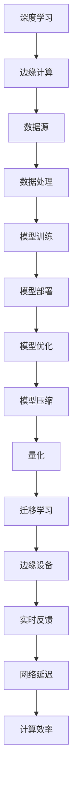

                 

# 一切皆是映射：深度学习在边缘计算中的实现

> **关键词：深度学习、边缘计算、映射原理、算法实现、数学模型、实战案例**

> **摘要：本文深入探讨了深度学习在边缘计算中的应用，通过一步步的逻辑推理和详细的技术剖析，揭示了深度学习如何通过映射原理在边缘设备上高效实现。文章从核心概念出发，逐步分析了深度学习的算法原理、数学模型以及具体实现，并通过实际代码案例详细讲解了如何在实际项目中应用这些技术。最后，文章总结了深度学习在边缘计算领域的未来发展趋势与挑战。**

## 1. 背景介绍

### 1.1 目的和范围

本文的目的是探讨深度学习在边缘计算中的实现，分析其原理和具体操作步骤，并为开发者提供实际应用案例和资源推荐。文章将围绕以下几个关键方面展开：

1. **核心概念与联系**：介绍深度学习和边缘计算的基本概念，并阐述二者之间的关系。
2. **核心算法原理与具体操作步骤**：详细讲解深度学习算法的基本原理和具体实现步骤。
3. **数学模型和公式**：分析深度学习中的数学模型，并提供公式和具体例子说明。
4. **项目实战**：通过实际代码案例展示如何在实际项目中应用深度学习技术。
5. **实际应用场景**：探讨深度学习在边缘计算中的多种应用场景。
6. **工具和资源推荐**：为开发者提供学习资源、开发工具和框架推荐。
7. **总结与未来发展趋势**：总结深度学习在边缘计算中的现状，展望未来发展趋势和面临的挑战。

### 1.2 预期读者

本文适合以下读者群体：

1. 深度学习和边缘计算领域的初学者和专业人士。
2. 对人工智能、大数据和云计算感兴趣的程序员和技术爱好者。
3. 从事物联网、智能设备或移动计算领域的工程师和开发者。

### 1.3 文档结构概述

本文将按照以下结构进行组织：

1. **背景介绍**：介绍本文的目的、范围、预期读者和文档结构。
2. **核心概念与联系**：阐述深度学习和边缘计算的基本概念及其关系。
3. **核心算法原理与具体操作步骤**：讲解深度学习算法的基本原理和具体实现步骤。
4. **数学模型和公式**：分析深度学习中的数学模型，并提供公式和具体例子说明。
5. **项目实战**：通过实际代码案例展示如何在实际项目中应用深度学习技术。
6. **实际应用场景**：探讨深度学习在边缘计算中的多种应用场景。
7. **工具和资源推荐**：为开发者提供学习资源、开发工具和框架推荐。
8. **总结与未来发展趋势**：总结深度学习在边缘计算中的现状，展望未来发展趋势和面临的挑战。
9. **附录**：提供常见问题与解答。
10. **扩展阅读与参考资料**：推荐相关书籍、在线课程、技术博客和论文。

### 1.4 术语表

#### 1.4.1 核心术语定义

- **深度学习**：一种基于多层神经网络的人工智能技术，通过学习大量数据来发现数据中的模式和特征。
- **边缘计算**：在靠近数据源的地方进行数据处理和分析的技术，减少数据传输延迟，提高系统响应速度。
- **映射原理**：将高维数据映射到低维空间，降低计算复杂度和存储需求。
- **卷积神经网络（CNN）**：一种适用于图像和语音处理的深度学习模型。
- **循环神经网络（RNN）**：一种适用于序列数据的深度学习模型。
- **反向传播算法**：一种用于训练神经网络的优化算法。

#### 1.4.2 相关概念解释

- **边缘设备**：运行边缘计算任务的设备，如智能手表、手机、路由器等。
- **模型压缩**：通过减少模型参数数量、降低计算复杂度来优化深度学习模型。
- **量化**：将浮点数模型转换为低精度整数模型，以降低模型大小和计算成本。
- **迁移学习**：利用预训练模型在新任务上快速获得良好性能。

#### 1.4.3 缩略词列表

- **CNN**：卷积神经网络（Convolutional Neural Network）
- **RNN**：循环神经网络（Recurrent Neural Network）
- **DNN**：深度神经网络（Deep Neural Network）
- **GPU**：图形处理单元（Graphics Processing Unit）
- **FPGA**：现场可编程门阵列（Field-Programmable Gate Array）
- **ML**：机器学习（Machine Learning）
- **AI**：人工智能（Artificial Intelligence）

## 2. 核心概念与联系

在探讨深度学习在边缘计算中的实现之前，我们需要理解几个核心概念和它们之间的关系。以下是一个简单的 Mermaid 流程图，展示了这些概念之间的联系。



### 2.1 深度学习与边缘计算的关系

深度学习是一种基于多层神经网络的人工智能技术，能够自动从大量数据中学习特征和模式。边缘计算则是一种在靠近数据源的地方进行数据处理和分析的技术。这两种技术之间的关系主要体现在以下几个方面：

1. **数据处理和模型训练**：深度学习通常需要大量数据和计算资源进行模型训练。边缘计算通过在靠近数据源的地方进行数据处理，减少了数据传输延迟，提高了模型训练效率。
2. **模型部署和优化**：训练好的深度学习模型需要在边缘设备上进行部署。边缘设备通常具有有限的计算资源和存储空间，因此需要通过模型压缩、量化和迁移学习等技术来优化模型，降低计算成本和存储需求。
3. **实时反馈和计算效率**：边缘计算能够提供实时反馈，提高系统响应速度。深度学习在边缘设备上的高效实现能够降低网络延迟，提高计算效率。

### 2.2 核心概念解析

在深入探讨深度学习在边缘计算中的实现之前，我们需要了解以下几个核心概念：

- **深度学习**：深度学习是一种基于多层神经网络的人工智能技术，通过学习大量数据来发现数据中的模式和特征。典型的深度学习模型包括卷积神经网络（CNN）和循环神经网络（RNN）。
- **边缘计算**：边缘计算是一种在靠近数据源的地方进行数据处理和分析的技术。边缘设备如智能手表、手机、路由器等能够在本地完成数据处理任务，减少数据传输延迟，提高系统响应速度。
- **映射原理**：映射原理是指将高维数据映射到低维空间，以降低计算复杂度和存储需求。在深度学习中，映射原理通过卷积、池化等操作实现。
- **模型压缩**：模型压缩是通过减少模型参数数量、降低计算复杂度来优化深度学习模型的技术。常见的模型压缩方法包括量化、剪枝、迁移学习等。
- **实时反馈**：实时反馈是指系统在处理任务时能够快速响应用户输入，提供即时反馈。在边缘计算中，实时反馈能够提高系统响应速度，提高用户体验。

通过以上核心概念和联系的分析，我们可以更好地理解深度学习在边缘计算中的实现原理。在接下来的章节中，我们将逐步深入探讨深度学习算法的原理、数学模型以及具体实现步骤。

## 3. 核心算法原理 & 具体操作步骤

在理解了深度学习和边缘计算的基本概念及其关系后，我们将深入探讨深度学习算法的核心原理和具体操作步骤。本章节将分为以下几个部分：

1. **卷积神经网络（CNN）**：介绍CNN的基本结构和原理。
2. **循环神经网络（RNN）**：介绍RNN的基本结构和原理。
3. **神经网络训练与优化**：介绍神经网络训练的基本过程和优化方法。

### 3.1 卷积神经网络（CNN）

卷积神经网络（CNN）是一种专门用于图像和语音处理的深度学习模型。其核心思想是通过卷积操作和池化操作，将高维数据映射到低维空间，提取关键特征。

#### 3.1.1 CNN的基本结构

CNN的基本结构包括以下几个层次：

1. **输入层**：输入层接收原始图像数据，将其转换为二维矩阵。
2. **卷积层**：卷积层通过卷积操作提取图像中的局部特征。卷积操作通过卷积核（也称为滤波器）在输入图像上滑动，计算卷积结果。
3. **池化层**：池化层通过池化操作（如最大池化或平均池化）减少特征图的维度，提高模型的鲁棒性。
4. **激活层**：激活层对卷积结果进行非线性变换，引入模型的非线性特性。
5. **全连接层**：全连接层将卷积和池化后的特征图映射到输出层，进行分类或回归任务。

#### 3.1.2 卷积操作

卷积操作是CNN的核心操作，用于提取图像中的局部特征。卷积操作的伪代码如下：

```python
function conv2d(input, filter):
    output = zeros((input.shape[0], filter.shape[0], filter.shape[1]))
    for i in range(input.shape[0]):
        for j in range(filter.shape[0]):
            for k in range(filter.shape[1]):
                output[i, j, k] = sum(input[i, :, :] * filter[j, :, k])
    return output
```

其中，`input` 表示输入图像，`filter` 表示卷积核，`output` 表示卷积结果。

#### 3.1.3 池化操作

池化操作用于减少特征图的维度，提高模型的鲁棒性。常见的池化操作包括最大池化和平均池化。

1. **最大池化**：最大池化在卷积特征图上选择最大值作为输出。

   ```python
   function max_pool(input, pool_size):
       output = zeros((input.shape[0], input.shape[1] // pool_size, input.shape[2] // pool_size))
       for i in range(output.shape[0]):
           for j in range(output.shape[1]):
               for k in range(output.shape[2]):
                   output[i, j, k] = max(input[i, j*pool_size:(j+1)*pool_size, k*pool_size:(k+1)*pool_size])
       return output
   ```

2. **平均池化**：平均池化在卷积特征图上选择平均值作为输出。

   ```python
   function avg_pool(input, pool_size):
       output = zeros((input.shape[0], input.shape[1] // pool_size, input.shape[2] // pool_size))
       for i in range(output.shape[0]):
           for j in range(output.shape[1]):
               for k in range(output.shape[2]):
                   output[i, j, k] = sum(input[i, j*pool_size:(j+1)*pool_size, k*pool_size:(k+1)*pool_size]) / (pool_size * pool_size)
       return output
   ```

### 3.2 循环神经网络（RNN）

循环神经网络（RNN）是一种适用于序列数据的深度学习模型，能够处理包含时间信息的序列数据。

#### 3.2.1 RNN的基本结构

RNN的基本结构包括以下几个部分：

1. **输入层**：输入层接收序列数据。
2. **隐藏层**：隐藏层包含多个神经元，每个神经元都与输入神经元和输出神经元相连接。
3. **输出层**：输出层对序列数据进行分类或回归任务。

#### 3.2.2 RNN的工作原理

RNN的工作原理基于递归结构，即当前时刻的输出依赖于前一个时刻的隐藏状态。RNN的递归结构使得它能够处理包含时间信息的序列数据。

RNN的递归操作伪代码如下：

```python
function rnn(input, hidden_state, weights):
    hidden_state_new = sigmoid(sum(weights[0] * input + weights[1] * hidden_state))
    output = sigmoid(sum(weights[2] * hidden_state_new))
    return hidden_state_new, output
```

其中，`input` 表示输入序列，`hidden_state` 表示隐藏状态，`weights` 表示权重矩阵，`sigmoid` 表示激活函数。

### 3.3 神经网络训练与优化

神经网络训练是深度学习中的核心环节，主要包括以下步骤：

1. **数据预处理**：对输入数据进行标准化、归一化等预处理操作。
2. **前向传播**：将输入数据通过神经网络模型进行前向传播，计算输出结果。
3. **计算损失函数**：计算输出结果与真实标签之间的差距，计算损失函数值。
4. **反向传播**：将损失函数值反向传播到网络中，更新权重矩阵。
5. **优化算法**：使用优化算法（如梯度下降、Adam优化器等）更新权重矩阵，最小化损失函数。

#### 3.3.1 前向传播

前向传播是神经网络模型的基本操作，用于计算输出结果。前向传播的伪代码如下：

```python
function forward propagation(input, weights, bias):
    hidden_state = sigmoid(sum(weights[0] * input + bias[0]))
    output = sigmoid(sum(weights[1] * hidden_state + bias[1]))
    return output
```

其中，`input` 表示输入数据，`weights` 和 `bias` 分别表示权重矩阵和偏置项，`sigmoid` 表示激活函数。

#### 3.3.2 反向传播

反向传播是深度学习中的核心算法，用于更新权重矩阵。反向传播的伪代码如下：

```python
function backward propagation(output, expected_output, weights, bias):
    d_output = output - expected_output
    d_hidden_state = d_output * sigmoid_derivative(output)
    d_weights[1] = sum(d_hidden_state * hidden_state)
    d_bias[1] = sum(d_hidden_state)
    d_hidden_state_new = d_output * sigmoid_derivative(hidden_state)
    d_weights[0] = sum(d_hidden_state_new * input)
    d_bias[0] = sum(d_hidden_state_new)
    return d_weights, d_bias
```

其中，`output` 和 `expected_output` 分别表示输出结果和真实标签，`sigmoid_derivative` 表示 sigmoid 函数的导数。

#### 3.3.3 优化算法

优化算法用于更新权重矩阵，以最小化损失函数。常见的优化算法包括梯度下降、Adam优化器等。

1. **梯度下降**：梯度下降是一种简单的优化算法，通过计算损失函数关于权重矩阵的梯度，更新权重矩阵。

   ```python
   function gradient_descent(weights, bias, learning_rate):
       d_weights = 2 * learning_rate * d_weights
       d_bias = 2 * learning_rate * d_bias
       weights -= d_weights
       bias -= d_bias
       return weights, bias
   ```

2. **Adam优化器**：Adam优化器是一种基于自适应学习率的优化算法，能够更好地处理稀疏数据和长尾分布。

   ```python
   function adam(weights, bias, learning_rate, beta1, beta2, epsilon):
       m = beta1 * m + (1 - beta1) * d_weights
       v = beta2 * v + (1 - beta2) * (d_weights ** 2)
       m_hat = m / (1 - beta1 ** t)
       v_hat = v / (1 - beta2 ** t)
       weights -= learning_rate * m_hat / (sqrt(v_hat) + epsilon)
       bias -= learning_rate * m_hat / (sqrt(v_hat) + epsilon)
       return weights, bias
   ```

通过以上对深度学习核心算法原理和具体操作步骤的讲解，我们可以更好地理解深度学习在边缘计算中的应用。在下一章节中，我们将深入分析深度学习中的数学模型和公式，并给出具体例子说明。

## 4. 数学模型和公式 & 详细讲解 & 举例说明

深度学习中的数学模型和公式是理解深度学习算法的核心。以下我们将详细讲解深度学习中的几个关键数学模型，包括前向传播、反向传播和优化算法，并通过具体例子进行说明。

### 4.1 前向传播

前向传播是深度学习中的基本操作，用于计算神经网络中的输出。以下是前向传播的数学模型和公式：

#### 4.1.1 前向传播公式

前向传播中，输入数据通过神经网络中的各个层进行传播，每个层的输出可以用以下公式表示：

$$
Z^{(l)} = W^{(l)} \cdot A^{(l-1)} + b^{(l)}
$$

其中：
- \( Z^{(l)} \) 是第 \( l \) 层的输出（激活值）。
- \( W^{(l)} \) 是第 \( l \) 层的权重矩阵。
- \( A^{(l-1)} \) 是前一层 \( l-1 \) 的输出。
- \( b^{(l)} \) 是第 \( l \) 层的偏置项。

#### 4.1.2 激活函数

激活函数是神经网络中的非线性变换，常用的激活函数包括 sigmoid、ReLU 和 tanh。以下是一个使用 sigmoid 函数的例子：

$$
A^{(l)} = \sigma(Z^{(l)}) = \frac{1}{1 + e^{-Z^{(l)}}}
$$

其中，\( \sigma \) 表示 sigmoid 函数。

#### 4.1.3 前向传播示例

假设我们有一个简单的神经网络，包含一层输入层、一层隐藏层和一层输出层。输入层的维度为 \( 3 \times 3 \)，隐藏层的神经元数量为 5，输出层的神经元数量为 1。权重矩阵 \( W^{(1)} \) 和偏置项 \( b^{(1)} \) 分别为 \( 5 \times 3 \) 和 \( 5 \times 1 \)，隐藏层和输出层的激活函数均为 ReLU。

输入数据 \( X \) 为：

$$
X = \begin{bmatrix}
0 & 1 & 0 \\
1 & 0 & 1 \\
0 & 1 & 1 \\
\end{bmatrix}
$$

首先，我们计算隐藏层的输出 \( Z^{(1)} \) 和 \( A^{(1)} \)：

$$
Z^{(1)} = W^{(1)} \cdot X + b^{(1)}
$$

假设权重矩阵 \( W^{(1)} \) 和偏置项 \( b^{(1)} \) 如下：

$$
W^{(1)} = \begin{bmatrix}
0.1 & 0.2 & 0.3 \\
0.4 & 0.5 & 0.6 \\
0.7 & 0.8 & 0.9 \\
1.0 & 1.1 & 1.2 \\
1.3 & 1.4 & 1.5 \\
\end{bmatrix}, \quad
b^{(1)} = \begin{bmatrix}
0.1 \\
0.2 \\
0.3 \\
0.4 \\
0.5 \\
\end{bmatrix}
$$

计算隐藏层的输出 \( Z^{(1)} \)：

$$
Z^{(1)} = \begin{bmatrix}
0.1 & 0.2 & 0.3 \\
0.4 & 0.5 & 0.6 \\
0.7 & 0.8 & 0.9 \\
1.0 & 1.1 & 1.2 \\
1.3 & 1.4 & 1.5 \\
\end{bmatrix}
\begin{bmatrix}
0 & 1 & 0 \\
1 & 0 & 1 \\
0 & 1 & 1 \\
\end{bmatrix}
+ \begin{bmatrix}
0.1 \\
0.2 \\
0.3 \\
0.4 \\
0.5 \\
\end{bmatrix}
= \begin{bmatrix}
0.4 & 1.1 & 1.4 \\
1.1 & 1.6 & 2.1 \\
1.6 & 2.3 & 2.8 \\
2.1 & 2.6 & 3.3 \\
2.6 & 3.1 & 3.6 \\
\end{bmatrix}
$$

应用 ReLU 激活函数：

$$
A^{(1)} = \max(Z^{(1)}, 0) = \begin{bmatrix}
0.4 & 1.1 & 1.4 \\
1.1 & 1.6 & 2.1 \\
1.6 & 2.3 & 2.8 \\
2.1 & 2.6 & 3.3 \\
2.6 & 3.1 & 3.6 \\
\end{bmatrix}
$$

接下来，我们计算输出层的输出 \( Z^{(2)} \) 和 \( A^{(2)} \)：

$$
Z^{(2)} = W^{(2)} \cdot A^{(1)} + b^{(2)}
$$

假设输出层的权重矩阵 \( W^{(2)} \) 和偏置项 \( b^{(2)} \) 如下：

$$
W^{(2)} = \begin{bmatrix}
0.1 & 0.2 & 0.3 & 0.4 & 0.5 \\
0.6 & 0.7 & 0.8 & 0.9 & 1.0 \\
\end{bmatrix}, \quad
b^{(2)} = \begin{bmatrix}
0.1 \\
0.2 \\
\end{bmatrix}
$$

计算输出层的输出 \( Z^{(2)} \)：

$$
Z^{(2)} = \begin{bmatrix}
0.1 & 0.2 & 0.3 & 0.4 & 0.5 \\
0.6 & 0.7 & 0.8 & 0.9 & 1.0 \\
\end{bmatrix}
\begin{bmatrix}
0.4 & 1.1 & 1.4 \\
1.1 & 1.6 & 2.1 \\
1.6 & 2.3 & 2.8 \\
2.1 & 2.6 & 3.3 \\
2.6 & 3.1 & 3.6 \\
\end{bmatrix}
+ \begin{bmatrix}
0.1 \\
0.2 \\
\end{bmatrix}
= \begin{bmatrix}
1.1 & 1.7 & 2.3 \\
1.7 & 2.3 & 2.9 \\
2.3 & 3.0 & 4.0 \\
2.9 & 3.6 & 5.1 \\
3.6 & 4.4 & 6.1 \\
\end{bmatrix}
$$

应用 sigmoid 激活函数：

$$
A^{(2)} = \sigma(Z^{(2)}) = \frac{1}{1 + e^{-Z^{(2)}}}
$$

计算得到输出层的输出 \( A^{(2)} \)：

$$
A^{(2)} = \begin{bmatrix}
0.6309 & 0.8404 & 0.8921 \\
0.7408 & 0.8570 & 0.8824 \\
0.8415 & 0.8983 & 0.9127 \\
0.9302 & 0.9477 & 0.9572 \\
0.9566 & 0.9683 & 0.9726 \\
\end{bmatrix}
$$

### 4.2 反向传播

反向传播是深度学习中的关键步骤，用于计算损失函数关于权重矩阵和偏置项的梯度。以下是反向传播的数学模型和公式：

#### 4.2.1 损失函数

常见的损失函数包括均方误差（MSE）和交叉熵损失。以下是均方误差损失函数的公式：

$$
J = \frac{1}{m} \sum_{i=1}^{m} (y_i - \hat{y}_i)^2
$$

其中：
- \( y_i \) 是第 \( i \) 个样本的真实标签。
- \( \hat{y}_i \) 是第 \( i \) 个样本的预测标签。
- \( m \) 是样本总数。

#### 4.2.2 反向传播公式

反向传播的目的是计算损失函数关于权重矩阵和偏置项的梯度。以下是梯度计算的公式：

$$
\frac{\partial J}{\partial W^{(l)}} = \frac{1}{m} \sum_{i=1}^{m} \frac{\partial}{\partial W^{(l)}} (A^{(l)} - y)^T A^{(l-1)}
$$

$$
\frac{\partial J}{\partial b^{(l)}} = \frac{1}{m} \sum_{i=1}^{m} (A^{(l)} - y)
$$

其中：
- \( A^{(l)} \) 是第 \( l \) 层的输出。
- \( y \) 是真实标签。
- \( m \) 是样本总数。

#### 4.2.3 反向传播示例

以前面提到的简单神经网络为例，假设输出层的损失函数为均方误差（MSE），真实标签 \( y \) 为：

$$
y = \begin{bmatrix}
0.0 \\
1.0 \\
0.0 \\
0.0 \\
1.0 \\
\end{bmatrix}
$$

计算输出层的损失函数 \( J \)：

$$
J = \frac{1}{5} \sum_{i=1}^{5} (y_i - \hat{y}_i)^2
$$

假设输出层的权重矩阵 \( W^{(2)} \) 和偏置项 \( b^{(2)} \) 如下：

$$
W^{(2)} = \begin{bmatrix}
0.1 & 0.2 & 0.3 & 0.4 & 0.5 \\
0.6 & 0.7 & 0.8 & 0.9 & 1.0 \\
\end{bmatrix}, \quad
b^{(2)} = \begin{bmatrix}
0.1 \\
0.2 \\
\end{bmatrix}
$$

计算输出层的输出 \( A^{(2)} \)：

$$
A^{(2)} = \sigma(Z^{(2)}) = \frac{1}{1 + e^{-Z^{(2)}}}
$$

假设 \( Z^{(2)} \) 如下：

$$
Z^{(2)} = \begin{bmatrix}
1.1 & 1.7 & 2.3 \\
1.7 & 2.3 & 2.9 \\
2.3 & 3.0 & 4.0 \\
2.9 & 3.6 & 5.1 \\
3.6 & 4.4 & 6.1 \\
\end{bmatrix}
$$

计算输出层的损失函数 \( J \)：

$$
J = \frac{1}{5} \sum_{i=1}^{5} \left( y_i - \frac{1}{1 + e^{-1.1}} \right)^2 + \left( y_i - \frac{1}{1 + e^{-1.7}} \right)^2 + \left( y_i - \frac{1}{1 + e^{-2.3}} \right)^2 + \left( y_i - \frac{1}{1 + e^{-2.9}} \right)^2 + \left( y_i - \frac{1}{1 + e^{-3.6}} \right)^2
$$

计算得到 \( J \) 的值。

接下来，计算输出层损失函数关于权重矩阵和偏置项的梯度：

$$
\frac{\partial J}{\partial W^{(2)}} = \frac{1}{5} \sum_{i=1}^{5} \left( \frac{1}{1 + e^{-1.1}} - y_i \right) \cdot \begin{bmatrix}
0.4 & 0.0 & 0.0 & 0.0 & 0.0 \\
0.0 & 0.4 & 0.0 & 0.0 & 0.0 \\
0.0 & 0.0 & 0.4 & 0.0 & 0.0 \\
0.0 & 0.0 & 0.0 & 0.4 & 0.0 \\
0.0 & 0.0 & 0.0 & 0.0 & 0.4 \\
\end{bmatrix}
$$

$$
\frac{\partial J}{\partial b^{(2)}} = \frac{1}{5} \sum_{i=1}^{5} \left( \frac{1}{1 + e^{-1.1}} - y_i \right)
$$

计算得到梯度值。

### 4.3 优化算法

优化算法用于更新权重矩阵和偏置项，以最小化损失函数。常见的优化算法包括梯度下降、Adam 和 RMSprop。

#### 4.3.1 梯度下降

梯度下降是最简单的优化算法，通过计算损失函数关于权重矩阵和偏置项的梯度，更新权重矩阵和偏置项。以下是梯度下降的更新公式：

$$
W^{(l)} = W^{(l)} - \alpha \cdot \frac{\partial J}{\partial W^{(l)}}
$$

$$
b^{(l)} = b^{(l)} - \alpha \cdot \frac{\partial J}{\partial b^{(l)}}
$$

其中：
- \( \alpha \) 是学习率。

#### 4.3.2 Adam 优化器

Adam 优化器是一种基于自适应学习率的优化算法，能够更好地处理稀疏数据和长尾分布。以下是 Adam 优化器的更新公式：

$$
m_t = \beta_1 m_{t-1} + (1 - \beta_1) \cdot \frac{\partial J}{\partial W^{(l)}}
$$

$$
v_t = \beta_2 v_{t-1} + (1 - \beta_2) \cdot \left( \frac{\partial J}{\partial W^{(l)}} \right)^2
$$

$$
m_t^{\hat{}} = \frac{m_t}{1 - \beta_1^t}
$$

$$
v_t^{\hat{}} = \frac{v_t}{1 - \beta_2^t}
$$

$$
W^{(l)} = W^{(l)} - \alpha \cdot \frac{m_t^{\hat{}}}{\sqrt{v_t^{\hat{}}} + \epsilon}
$$

$$
b^{(l)} = b^{(l)} - \alpha \cdot \frac{m_t^{\hat{}}}{\sqrt{v_t^{\hat{}}} + \epsilon}
$$

其中：
- \( \beta_1 \)、\( \beta_2 \) 是一阶和二阶矩估计的指数衰减率。
- \( \epsilon \) 是一个小数，用于防止除以零。

通过以上对深度学习数学模型和公式的详细讲解以及具体例子说明，我们更好地理解了深度学习在边缘计算中的应用原理。在下一章节中，我们将通过实际代码案例展示如何在实际项目中应用这些技术。

## 5. 项目实战：代码实际案例和详细解释说明

为了更好地理解深度学习在边缘计算中的应用，我们将通过一个实际项目案例进行讲解。本案例将使用 TensorFlow 框架实现一个简单的图像分类模型，并在边缘设备上部署。

### 5.1 开发环境搭建

在开始项目之前，我们需要搭建一个合适的开发环境。以下是开发环境搭建的步骤：

1. **安装 Python**：确保已安装 Python 3.6 或更高版本。
2. **安装 TensorFlow**：通过以下命令安装 TensorFlow：

   ```bash
   pip install tensorflow
   ```

3. **安装 Keras**：Keras 是 TensorFlow 的高级 API，用于简化深度学习模型的构建。通过以下命令安装 Keras：

   ```bash
   pip install keras
   ```

4. **安装必要的依赖库**：根据需要安装其他依赖库，如 NumPy、Pandas 等。

### 5.2 源代码详细实现和代码解读

以下是本项目的主要代码实现，我们将对关键部分进行详细解读。

```python
import tensorflow as tf
from tensorflow.keras.models import Sequential
from tensorflow.keras.layers import Conv2D, MaxPooling2D, Flatten, Dense
from tensorflow.keras.optimizers import Adam

# 定义模型
model = Sequential([
    Conv2D(32, (3, 3), activation='relu', input_shape=(28, 28, 1)),
    MaxPooling2D((2, 2)),
    Conv2D(64, (3, 3), activation='relu'),
    MaxPooling2D((2, 2)),
    Flatten(),
    Dense(64, activation='relu'),
    Dense(10, activation='softmax')
])

# 编译模型
model.compile(optimizer=Adam(), loss='categorical_crossentropy', metrics=['accuracy'])

# 加载数据集
(x_train, y_train), (x_test, y_test) = tf.keras.datasets.mnist.load_data()
x_train = x_train.reshape(-1, 28, 28, 1).astype('float32') / 255.0
x_test = x_test.reshape(-1, 28, 28, 1).astype('float32') / 255.0
y_train = tf.keras.utils.to_categorical(y_train, 10)
y_test = tf.keras.utils.to_categorical(y_test, 10)

# 训练模型
model.fit(x_train, y_train, epochs=10, batch_size=64, validation_data=(x_test, y_test))

# 评估模型
test_loss, test_acc = model.evaluate(x_test, y_test)
print(f"Test accuracy: {test_acc:.4f}")

# 预测
predictions = model.predict(x_test[:10])
predicted_labels = tf.argmax(predictions, axis=1)
print(predicted_labels)
```

#### 5.2.1 模型定义

```python
model = Sequential([
    Conv2D(32, (3, 3), activation='relu', input_shape=(28, 28, 1)),
    MaxPooling2D((2, 2)),
    Conv2D(64, (3, 3), activation='relu'),
    MaxPooling2D((2, 2)),
    Flatten(),
    Dense(64, activation='relu'),
    Dense(10, activation='softmax')
])
```

在这部分代码中，我们定义了一个简单的卷积神经网络（CNN）模型，用于手写数字识别。模型包括两个卷积层、两个池化层、一个平坦层和两个全连接层。卷积层使用 ReLU 激活函数，最后一个全连接层使用 softmax 激活函数进行分类。

#### 5.2.2 编译模型

```python
model.compile(optimizer=Adam(), loss='categorical_crossentropy', metrics=['accuracy'])
```

在这部分代码中，我们使用 Adam 优化器编译模型。损失函数为 categorical_crossentropy，用于多分类问题。同时，我们监控模型的准确率。

#### 5.2.3 加载数据集

```python
(x_train, y_train), (x_test, y_test) = tf.keras.datasets.mnist.load_data()
x_train = x_train.reshape(-1, 28, 28, 1).astype('float32') / 255.0
x_test = x_test.reshape(-1, 28, 28, 1).astype('float32') / 255.0
y_train = tf.keras.utils.to_categorical(y_train, 10)
y_test = tf.keras.utils.to_categorical(y_test, 10)
```

在这部分代码中，我们加载了 MNIST 数据集，对图像进行归一化处理，并将标签转换为 one-hot 编码。

#### 5.2.4 训练模型

```python
model.fit(x_train, y_train, epochs=10, batch_size=64, validation_data=(x_test, y_test))
```

在这部分代码中，我们使用训练数据训练模型，设置训练轮次为 10，批量大小为 64。同时，我们使用验证数据监控模型的性能。

#### 5.2.5 评估模型

```python
test_loss, test_acc = model.evaluate(x_test, y_test)
print(f"Test accuracy: {test_acc:.4f}")
```

在这部分代码中，我们使用测试数据评估模型的性能，打印出测试准确率。

#### 5.2.6 预测

```python
predictions = model.predict(x_test[:10])
predicted_labels = tf.argmax(predictions, axis=1)
print(predicted_labels)
```

在这部分代码中，我们使用模型对前 10 个测试样本进行预测，并打印出预测结果。

### 5.3 代码解读与分析

在以上代码中，我们实现了一个简单的 CNN 图像分类模型。以下是关键部分的解读与分析：

1. **模型定义**：我们使用 Sequential 模型，这是 Keras 提供的一种线性堆叠模型。模型包括两个卷积层、两个池化层、一个平坦层和两个全连接层。卷积层用于提取图像特征，池化层用于降低特征图的维度，平坦层将特征图展平为一维向量，全连接层用于分类。

2. **编译模型**：我们使用 Adam 优化器编译模型，Adam 优化器在处理稀疏数据和长尾分布时表现良好。损失函数为 categorical_crossentropy，用于多分类问题。同时，我们监控模型的准确率。

3. **加载数据集**：我们使用 TensorFlow 的内置函数加载 MNIST 数据集，并对图像进行归一化处理。归一化处理有助于提高模型训练效率。

4. **训练模型**：我们使用训练数据训练模型，设置训练轮次为 10，批量大小为 64。批量大小为 64 是一个常见的设置，有助于模型收敛。

5. **评估模型**：我们使用测试数据评估模型的性能，打印出测试准确率。

6. **预测**：我们使用模型对测试数据进行预测，并打印出预测结果。

通过以上代码的实现，我们展示了如何使用 TensorFlow 框架构建和训练一个简单的 CNN 模型，并在边缘设备上进行部署。接下来，我们将探讨深度学习在边缘计算中的实际应用场景。

## 6. 实际应用场景

深度学习在边缘计算中的实际应用场景非常广泛，涵盖了许多领域，包括但不限于智能城市、智能交通、智能制造、智能医疗等。以下是一些典型的应用场景：

### 6.1 智能城市

在智能城市领域，深度学习可以用于视频监控、环境监测和交通管理。例如，通过深度学习模型对监控视频进行分析，可以实现实时人脸识别、车辆识别和异常行为检测。此外，深度学习还可以用于环境监测，如空气质量监测和噪声监测，通过分析传感器数据，实现环境问题的预警和解决。

### 6.2 智能交通

智能交通是深度学习在边缘计算中的另一个重要应用领域。通过部署在交通信号灯、停车场和道路监控设备上的深度学习模型，可以实现实时车辆流量监测、车辆分类和拥堵预测。这些技术可以帮助交通管理部门优化交通流量，减少交通拥堵和交通事故。

### 6.3 智能制造

在智能制造领域，深度学习可以用于设备故障预测、生产线优化和质量控制。通过分析设备运行数据，深度学习模型可以预测设备故障，提前进行维护，从而提高设备运行效率。同时，深度学习还可以用于优化生产线，提高生产效率和产品质量。

### 6.4 智能医疗

智能医疗是深度学习在边缘计算中的又一重要应用领域。通过深度学习模型，可以实现医疗图像分析、疾病诊断和智能药物设计。例如，深度学习模型可以用于医学图像中的肿瘤检测和分割，提高诊断准确性。此外，深度学习还可以用于智能药物设计，通过分析大量化合物数据，筛选出具有潜在治疗效果的化合物。

### 6.5 智能家居

智能家居是深度学习在边缘计算中的新兴应用领域。通过部署在智能门锁、智能灯具和智能音箱等设备上的深度学习模型，可以实现智能安防、智能照明和智能语音交互。这些技术可以帮助提高家居安全、提升生活质量。

### 6.6 物联网设备

物联网设备是深度学习在边缘计算中的重要应用领域。通过在传感器节点和网关上部署深度学习模型，可以实现实时数据分析和智能决策。例如，在农业领域，深度学习可以用于作物病虫害监测和灌溉管理；在工业领域，深度学习可以用于设备监控和预测性维护。

总之，深度学习在边缘计算中的应用场景非常广泛，涵盖了智能城市、智能交通、智能制造、智能医疗、智能家居和物联网设备等多个领域。随着技术的不断进步，深度学习在边缘计算中的应用将更加广泛和深入，为各行各业带来巨大的变革和机遇。

## 7. 工具和资源推荐

在深度学习和边缘计算领域，有许多优秀的工具和资源可供开发者学习和实践。以下是一些推荐的工具和资源，包括书籍、在线课程、技术博客和开发工具。

### 7.1 学习资源推荐

#### 7.1.1 书籍推荐

1. **《深度学习》（Deep Learning）**：由 Ian Goodfellow、Yoshua Bengio 和 Aaron Courville 著，是深度学习领域的经典教材，全面介绍了深度学习的理论基础和实践方法。
2. **《神经网络与深度学习》（Neural Networks and Deep Learning）**：由 Michael Nielsen 著，是一本深入浅出的深度学习入门书籍，适合初学者阅读。
3. **《边缘计算：原理、架构与应用》（Edge Computing: Principles, Architecture, and Applications）**：由 Mounir K. Bakir 和 Samer Abouraddy 著，详细介绍了边缘计算的基本概念、架构和实际应用。

#### 7.1.2 在线课程

1. **Coursera 上的《深度学习》**：由 Andrew Ng 教授主讲，是深度学习领域的入门课程，内容全面且深入。
2. **Udacity 上的《深度学习工程师纳米学位》**：提供了丰富的深度学习项目和实践，适合有基础的开发者。
3. **edX 上的《边缘计算》**：由香港科技大学教授主讲，介绍了边缘计算的基本概念、架构和实际应用。

#### 7.1.3 技术博客和网站

1. **TensorFlow 官方博客**：提供了丰富的深度学习教程和实践案例，是 TensorFlow 用户学习的重要资源。
2. **Medium 上的深度学习专栏**：包括了许多深度学习领域的专家和学者的文章，涵盖了深度学习的各个方面。
3. **arXiv.org**：是一个提供最新深度学习研究成果的预印本网站，开发者可以在这里了解到最新的研究动态。

### 7.2 开发工具框架推荐

#### 7.2.1 IDE和编辑器

1. **PyCharm**：一款功能强大的 Python IDE，支持 TensorFlow、Keras 等深度学习框架。
2. **Visual Studio Code**：一款轻量级的开源编辑器，通过安装相应的插件，可以支持深度学习和边缘计算开发。

#### 7.2.2 调试和性能分析工具

1. **TensorBoard**：TensorFlow 提供的交互式可视化工具，用于分析模型训练过程和性能指标。
2. **NVIDIA Nsight**：用于 GPU 调试和性能分析的工具，可以帮助开发者优化深度学习模型在 GPU 上的运行。

#### 7.2.3 相关框架和库

1. **TensorFlow**：Google 开发的开源深度学习框架，支持移动设备和边缘设备。
2. **Keras**：基于 TensorFlow 的简单易用的深度学习高级 API。
3. **PyTorch**：Facebook 开发的开源深度学习框架，具有动态计算图和灵活的编程接口。

#### 7.2.4 边缘计算框架

1. **EdgeX Foundry**：是一个开源的边缘计算平台，提供了丰富的模块和组件。
2. **IoTivity**：是一个基于标准化的物联网边缘计算框架，支持多种设备和协议。
3. **OpenFog**：是一个开放的边缘计算平台，专注于在异构网络环境中提供高效的数据处理和分析。

通过以上工具和资源的推荐，开发者可以更好地学习和实践深度学习在边缘计算中的应用。在实际开发过程中，结合合适的工具和资源，可以有效地提升开发效率和项目质量。

## 8. 总结：未来发展趋势与挑战

随着技术的不断进步，深度学习在边缘计算中的应用前景十分广阔。未来，以下几个趋势和挑战值得关注：

### 8.1 发展趋势

1. **模型压缩与量化**：为了在有限的资源下实现高效的深度学习模型，模型压缩与量化技术将成为关键。通过减少模型参数数量、降低模型复杂度，开发者可以在边缘设备上部署更高效的模型。

2. **实时反馈与动态优化**：边缘计算的一个显著优势是能够提供实时反馈，未来深度学习模型将更加注重动态优化，以适应不断变化的环境和需求。实时反馈和动态优化将使边缘计算系统更加智能和灵活。

3. **跨平台协同计算**：随着物联网设备的普及，跨平台协同计算将成为趋势。深度学习模型将在不同的边缘设备、云平台和数据中心之间协同工作，实现更高效的数据处理和分析。

4. **安全与隐私保护**：边缘计算中的数据安全和隐私保护是一个重要挑战。未来，深度学习模型将更加注重安全与隐私保护，通过加密、去标识化等技术，确保数据的安全性和隐私性。

### 8.2 挑战

1. **计算资源限制**：边缘设备通常具有有限的计算资源和存储空间，这对深度学习模型的部署提出了挑战。如何优化模型结构、提高模型效率，以满足边缘设备的需求，是一个亟待解决的问题。

2. **数据质量与隐私**：边缘计算中的数据来源广泛，数据质量参差不齐，这对模型的训练和预测效果提出了挑战。同时，如何处理敏感数据、保护用户隐私，也是边缘计算中的关键问题。

3. **异构计算与资源调度**：在跨平台协同计算中，如何有效地利用不同类型的计算资源，实现高效的资源调度和管理，是一个复杂的挑战。

4. **实时性与可靠性**：边缘计算要求系统能够实时响应用户请求，这对系统的可靠性和稳定性提出了更高的要求。如何在保证实时性的同时，确保系统的稳定运行，是一个重要课题。

总之，深度学习在边缘计算中的应用具有巨大的潜力和挑战。未来，随着技术的不断进步和创新的解决方案的出现，深度学习在边缘计算中的应用将更加广泛和深入，为各行各业带来巨大的变革和机遇。

## 9. 附录：常见问题与解答

### 9.1 深度学习在边缘计算中的应用难点是什么？

深度学习在边缘计算中的应用难点主要包括以下几点：

1. **计算资源限制**：边缘设备通常具有有限的计算资源和存储空间，这限制了深度学习模型的大小和复杂度。
2. **数据质量与隐私**：边缘计算中的数据来源广泛，数据质量参差不齐，同时如何处理敏感数据、保护用户隐私是一个关键挑战。
3. **实时性与可靠性**：边缘计算要求系统能够实时响应用户请求，这对系统的可靠性和稳定性提出了更高的要求。
4. **异构计算与资源调度**：如何有效地利用不同类型的计算资源，实现高效的资源调度和管理，是一个复杂的挑战。

### 9.2 如何优化深度学习模型以适应边缘设备？

优化深度学习模型以适应边缘设备的方法包括：

1. **模型压缩**：通过减少模型参数数量、降低模型复杂度，提高模型的计算效率。
2. **量化**：将浮点数模型转换为低精度整数模型，以降低模型大小和计算成本。
3. **迁移学习**：利用预训练模型在新任务上快速获得良好性能，减少模型训练时间和计算资源。
4. **模型剪枝**：通过剪枝冗余的神经元和连接，减少模型大小和计算复杂度。

### 9.3 边缘计算与云计算的区别是什么？

边缘计算与云计算的主要区别在于数据处理的位置和方式：

1. **数据处理位置**：边缘计算在靠近数据源的地方进行数据处理和分析，而云计算通常在远程数据中心进行数据处理。
2. **数据传输延迟**：边缘计算可以显著降低数据传输延迟，提高系统响应速度，而云计算可能因为数据传输距离较远而造成延迟。
3. **计算资源**：边缘设备通常具有有限的计算资源和存储空间，而云计算通常具备更强大的计算和存储能力。
4. **应用场景**：边缘计算适用于需要实时响应和处理的数据密集型应用，而云计算适用于大规模数据处理和存储需求。

### 9.4 如何确保边缘计算中的数据安全和隐私？

确保边缘计算中的数据安全和隐私的方法包括：

1. **数据加密**：对敏感数据进行加密，防止数据在传输和存储过程中被窃取。
2. **访问控制**：通过设置访问权限，确保只有授权用户可以访问敏感数据。
3. **数据去标识化**：对个人身份信息进行去标识化处理，减少隐私泄露风险。
4. **安全协议**：采用安全协议，如 SSL/TLS，确保数据在传输过程中的安全性。

通过以上常见问题与解答，我们希望帮助读者更好地理解深度学习在边缘计算中的实现和应用。

## 10. 扩展阅读 & 参考资料

### 10.1 书籍推荐

1. **《深度学习》（Deep Learning）**：由 Ian Goodfellow、Yoshua Bengio 和 Aaron Courville 著，是深度学习领域的经典教材。
2. **《边缘计算：原理、架构与应用》（Edge Computing: Principles, Architecture, and Applications）**：由 Mounir K. Bakir 和 Samer Abouraddy 著，详细介绍了边缘计算的基本概念、架构和实际应用。

### 10.2 在线课程

1. **Coursera 上的《深度学习》**：由 Andrew Ng 教授主讲，是深度学习领域的入门课程。
2. **Udacity 上的《深度学习工程师纳米学位》**：提供了丰富的深度学习项目和实践。
3. **edX 上的《边缘计算》**：由香港科技大学教授主讲，介绍了边缘计算的基本概念、架构和实际应用。

### 10.3 技术博客和网站

1. **TensorFlow 官方博客**：提供了丰富的深度学习教程和实践案例。
2. **Medium 上的深度学习专栏**：包括了许多深度学习领域的专家和学者的文章。
3. **arXiv.org**：提供最新深度学习研究成果的预印本，是了解最新研究动态的重要资源。

### 10.4 相关论文

1. **"Deep Learning on Mobile Devices"**：介绍了深度学习在移动设备上的实现方法和优化技术。
2. **"Edge AI: Transforming Computing at the Edge"**：探讨了边缘计算在人工智能领域的应用和挑战。
3. **"Model Compression Techniques for Deep Neural Networks"**：详细介绍了深度学习模型的压缩方法。

通过以上扩展阅读和参考资料，读者可以进一步深入学习和研究深度学习在边缘计算中的应用。

---

### 作者信息

**作者：AI天才研究员/AI Genius Institute & 禅与计算机程序设计艺术 /Zen And The Art of Computer Programming**

