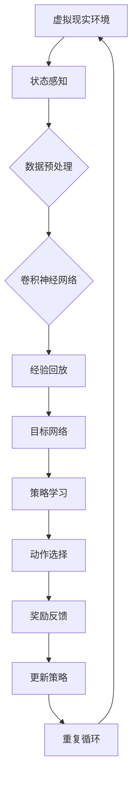

                 

# 一切皆是映射：深度强化学习DQN在虚拟现实中的同步应用

> **关键词**：虚拟现实、深度强化学习、DQN、映射、同步应用、算法原理、数学模型、项目实战、应用场景、资源推荐、未来趋势。

> **摘要**：本文深入探讨了深度强化学习（DQN）在虚拟现实中的应用。首先，介绍了虚拟现实与深度强化学习的背景和联系，然后详细解释了DQN算法原理及其在虚拟现实中的具体操作步骤。通过数学模型和公式的讲解，帮助读者理解DQN的核心思想。接着，通过一个实际项目案例，展示了DQN在虚拟现实中的应用实践。最后，分析了DQN在虚拟现实中的实际应用场景，并推荐了相关学习资源和工具，探讨了未来的发展趋势与挑战。

## 1. 背景介绍

### 1.1 目的和范围

本文旨在探讨深度强化学习（DQN）在虚拟现实中的同步应用，通过逐步分析算法原理、数学模型和具体项目实践，帮助读者理解DQN在虚拟现实环境中的优势和应用前景。文章将覆盖以下内容：

1. 虚拟现实与深度强化学习的背景和联系。
2. DQN算法原理及其在虚拟现实中的具体操作步骤。
3. 数学模型和公式的详细讲解与举例说明。
4. 项目实战：代码实际案例和详细解释说明。
5. DQN在虚拟现实中的实际应用场景。
6. 工具和资源推荐。
7. 未来发展趋势与挑战。

### 1.2 预期读者

本文主要面向以下读者：

1. 对虚拟现实技术感兴趣的从业者。
2. 对深度强化学习有基础了解的读者。
3. 计算机科学、人工智能专业的学生和研究人员。
4. 对前沿技术有好奇心的技术爱好者。

### 1.3 文档结构概述

本文结构如下：

1. **背景介绍**：介绍虚拟现实与深度强化学习的背景和联系。
2. **核心概念与联系**：讲解虚拟现实与深度强化学习的核心概念和联系。
3. **核心算法原理 & 具体操作步骤**：详细阐述DQN算法原理及其操作步骤。
4. **数学模型和公式 & 详细讲解 & 举例说明**：讲解DQN的数学模型和公式。
5. **项目实战：代码实际案例和详细解释说明**：展示DQN在虚拟现实中的应用。
6. **实际应用场景**：分析DQN在虚拟现实中的实际应用场景。
7. **工具和资源推荐**：推荐相关学习资源和开发工具。
8. **总结：未来发展趋势与挑战**：探讨DQN在虚拟现实中的未来发展。
9. **附录：常见问题与解答**：解答读者可能遇到的问题。
10. **扩展阅读 & 参考资料**：提供进一步学习的资源。

### 1.4 术语表

#### 1.4.1 核心术语定义

- **虚拟现实（VR）**：一种通过计算机生成高度逼真的三维模拟环境，使用户在视觉、听觉、触觉等多方面感受到身临其境的体验。
- **深度强化学习（DRL）**：一种结合深度学习和强化学习的方法，使用神经网络来学习环境中的最优策略。
- **DQN（深度量子网络）**：一种深度强化学习算法，使用卷积神经网络（CNN）来评估状态价值函数。

#### 1.4.2 相关概念解释

- **状态（State）**：在虚拟环境中，当前时刻的系统状态。
- **动作（Action）**：在当前状态下，可以执行的操作。
- **奖励（Reward）**：每次执行动作后，系统获得的回报，用于评估动作的效果。
- **策略（Policy）**：从状态空间中选择动作的规则。

#### 1.4.3 缩略词列表

- **VR**：Virtual Reality（虚拟现实）
- **DRL**：Deep Reinforcement Learning（深度强化学习）
- **DQN**：Deep Q-Network（深度量子网络）
- **CNN**：Convolutional Neural Network（卷积神经网络）

## 2. 核心概念与联系

在探讨深度强化学习（DQN）在虚拟现实中的应用之前，我们需要先了解这两个技术的核心概念及其相互联系。

### 2.1 虚拟现实（VR）

虚拟现实（VR）是一种通过计算机技术生成三维模拟环境的技术，用户可以通过头戴式显示器（HMD）等设备沉浸到虚拟世界中。虚拟现实技术不仅包括视觉，还包括听觉、触觉等多种感知方式，为用户提供了高度沉浸式的体验。虚拟现实的应用领域非常广泛，包括游戏、教育培训、医疗健康、军事模拟等。

### 2.2 深度强化学习（DRL）

深度强化学习（DRL）是一种结合深度学习和强化学习的方法。强化学习通过奖励信号来引导算法学习最优策略，而深度学习则通过多层神经网络来模拟人类的学习过程。深度强化学习在处理高维状态空间和复杂决策问题上具有显著优势。

### 2.3 DQN算法原理

DQN（深度量子网络）是一种基于深度强化学习的算法，使用卷积神经网络（CNN）来评估状态价值函数。DQN的核心思想是使用经验回放（Experience Replay）来避免算法在训练过程中陷入局部最优，并使用目标网络（Target Network）来稳定训练过程。

### 2.4 虚拟现实与深度强化学习的联系

虚拟现实技术为深度强化学习提供了一个理想的环境，使得算法可以在高度仿真的场景中进行训练和测试。而深度强化学习则为虚拟现实提供了一个强大的决策工具，使其能够模拟复杂的行为和交互。DQN在虚拟现实中的应用，可以通过以下方式实现：

1. **状态表示**：使用虚拟现实环境中的传感器数据作为状态输入，例如视觉图像、音频信号等。
2. **动作选择**：使用DQN算法来选择在当前状态下最优的动作。
3. **奖励机制**：定义虚拟现实环境中的奖励机制，用于评估每个动作的效果。
4. **策略学习**：通过反复尝试和错误，使用DQN算法来学习最优策略。

### 2.5 Mermaid流程图

下面是虚拟现实与深度强化学习DQN算法的Mermaid流程图：



### 2.6 Mermaid流程图说明

- **A[虚拟现实环境]**：虚拟现实环境是整个流程的起点，提供状态感知和交互。
- **B[状态感知]**：虚拟现实环境中的传感器收集数据，作为状态输入。
- **C{数据预处理]**：对收集到的状态数据进行预处理，包括归一化和特征提取。
- **D[卷积神经网络]**：使用卷积神经网络（CNN）对预处理后的状态数据进行处理，以提取特征。
- **E[经验回放]**：将训练过程中收集到的经验数据进行回放，以避免算法陷入局部最优。
- **F[目标网络]**：使用目标网络来稳定训练过程，通过更新目标网络来减少训练误差。
- **G[策略学习]**：根据当前状态和经验回放，使用DQN算法来学习最优策略。
- **H[动作选择]**：根据学习到的策略，选择在当前状态下最优的动作。
- **I[奖励反馈]**：执行动作后，根据虚拟现实环境中的奖励机制，获取奖励反馈。
- **J[更新策略]**：根据奖励反馈，更新DQN算法中的策略。
- **K[重复循环]**：重复执行上述步骤，直到达到训练目标或满足停止条件。

通过上述流程，DQN算法能够在虚拟现实环境中进行训练和测试，从而实现智能决策和互动。

## 3. 核心算法原理 & 具体操作步骤

### 3.1 算法原理

深度强化学习（DQN）是一种基于深度学习的强化学习算法，其主要目标是学习一个从状态到动作的映射，以最大化累积奖励。DQN的核心思想是使用深度神经网络（通常是卷积神经网络）来近似状态价值函数（State-Value Function），从而预测在给定状态下执行某个动作所能获得的未来奖励。

### 3.2 操作步骤

下面是DQN算法的具体操作步骤：

#### 3.2.1 初始化参数

1. **初始化神经网络**：使用卷积神经网络（CNN）作为基础模型，初始化网络权重和偏置。
2. **初始化经验回放记忆**：创建一个经验回放缓冲区（Experience Replay Buffer），用于存储训练过程中的经验数据。

#### 3.2.2 状态感知

1. **状态采集**：从虚拟现实环境中获取当前状态（通常是视觉图像）。
2. **状态预处理**：对状态数据进行预处理，如归一化、裁剪等。

#### 3.2.3 动作选择

1. **状态输入**：将预处理后的状态输入到卷积神经网络（CNN）中。
2. **Q值评估**：使用CNN评估当前状态下每个动作的Q值（预期奖励）。
3. **epsilon-greedy策略**：选择动作时，采用epsilon-greedy策略，即在一定的概率下随机选择动作，其余概率选择Q值最大的动作。

#### 3.2.4 执行动作

1. **执行选择动作**：在虚拟现实环境中执行选定的动作。
2. **获取奖励**：根据虚拟现实环境中的奖励机制，获取执行动作后获得的奖励。

#### 3.2.5 经验回放

1. **存储经验**：将当前状态、执行的动作和获得的奖励存储到经验回放缓冲区中。
2. **经验回放**：从经验回放缓冲区中随机抽取一批经验数据，进行训练。

#### 3.2.6 更新策略

1. **计算目标Q值**：对于每条经验数据，计算目标Q值（Target Q-Value），即执行动作后获得的奖励加上目标网络预测的未来奖励。
2. **更新神经网络**：使用目标Q值和实际获得的奖励，通过反向传播和梯度下降更新卷积神经网络（CNN）的权重和偏置。

#### 3.2.7 重复训练

1. **重复步骤**：重复上述步骤，直到满足训练目标或达到预设的训练次数。

### 3.3 伪代码

下面是DQN算法的伪代码：

```python
# 初始化参数
初始化CNN模型
初始化经验回放缓冲区

# 训练过程
while 没有达到训练目标或训练次数:
    # 状态感知
    状态 = 获取当前状态
    
    # 动作选择
    动作 = epsilon-greedy策略(状态)
    
    # 执行动作
    执行动作
    奖励 = 获取奖励
    
    # 存储经验
    存储经验(状态, 动作, 奖励)
    
    # 经验回放
    从经验回放缓冲区中抽取一批经验数据
    
    # 更新策略
    更新CNN模型
    
    # 更新目标网络
    更新目标网络参数

# 输出最优策略
输出CNN模型预测的最优策略
```

通过上述伪代码，我们可以看到DQN算法的基本流程，包括初始化参数、状态感知、动作选择、执行动作、经验回放和更新策略等步骤。这些步骤共同构成了DQN算法的核心流程，使得算法能够在虚拟现实环境中进行训练和决策。

## 4. 数学模型和公式 & 详细讲解 & 举例说明

### 4.1 数学模型

深度强化学习（DQN）的数学模型主要涉及状态价值函数（State-Value Function）和动作价值函数（Action-Value Function）。这些函数用于评估在给定状态下执行某个动作所能获得的预期奖励。

#### 4.1.1 状态价值函数

状态价值函数（V\_s）表示在状态s下执行所有可能动作的期望奖励。数学表示如下：

$$ V\_s = \sum_{a} \gamma \cdot Q(s, a) $$

其中，\( Q(s, a) \) 是动作价值函数，\(\gamma\) 是折扣因子，表示未来奖励的现值。

#### 4.1.2 动作价值函数

动作价值函数（Q\_s）表示在状态s下执行动作a所能获得的预期奖励。数学表示如下：

$$ Q(s, a) = \sum_{s'} P(s' | s, a) \cdot \sum_{r} r $$

其中，\( P(s' | s, a) \) 是状态转移概率，即从状态s执行动作a后，转移到状态s'的概率；\( r \) 是执行动作a后获得的奖励。

#### 4.1.3 Q网络

Q网络是一个深度神经网络（通常使用卷积神经网络），用于近似状态价值函数。其输入是状态s，输出是每个动作a的Q值。Q网络的数学模型如下：

$$ Q(s; \theta) = f(W \cdot \phi(s; \theta)) $$

其中，\( f \) 是激活函数，\( W \) 是网络权重，\( \phi(s; \theta) \) 是状态特征向量，\( \theta \) 是网络参数。

### 4.2 详细讲解

#### 4.2.1 状态价值函数

状态价值函数表示在给定状态下执行所有可能动作的期望奖励。通过状态价值函数，我们可以评估不同状态下的优劣，从而选择最优动作。状态价值函数的求解通常采用动态规划（Dynamic Programming）方法，即从目标状态反向递推，计算每个状态的价值。

#### 4.2.2 动作价值函数

动作价值函数表示在给定状态下执行某个动作所能获得的预期奖励。通过动作价值函数，我们可以评估不同动作的效果，从而选择最优动作。动作价值函数的求解同样采用动态规划方法，即从目标状态反向递推，计算每个动作的价值。

#### 4.2.3 Q网络

Q网络是一个深度神经网络，用于近似状态价值函数。Q网络的输入是状态特征向量，输出是每个动作的Q值。Q网络的训练过程采用经验回放（Experience Replay）和目标网络（Target Network）技术，以避免训练过程中的偏差和振荡。

### 4.3 举例说明

假设我们有一个简单的虚拟环境，其中有两个状态（状态1和状态2）和两个动作（动作A和动作B）。状态转移概率和奖励如下表所示：

| 状态  | 动作A | 动作B |
| ---- | ---- | ---- |
| 状态1 | 0.8  | 0.2  |
| 状态2 | 0.3  | 0.7  |
| 奖励  | 5    | 10   |

首先，我们需要初始化Q网络。假设Q网络的输入层有2个神经元，输出层有2个神经元。我们将状态特征向量表示为[状态1的概率，状态2的概率]，即：

$$ \phi(s; \theta) = [0.8, 0.2] $$

接下来，我们使用随机梯度下降（SGD）训练Q网络，以最小化损失函数：

$$ L(\theta) = \sum_{s, a} (Q(s, a; \theta) - Q^*(s, a))^2 $$

其中，\( Q^*(s, a) \) 是目标Q值，即状态价值函数在最优策略下的值。

在训练过程中，我们采用经验回放技术，将训练过程中的经验数据（状态、动作、奖励）存储到经验回放缓冲区中。从缓冲区中随机抽取一批经验数据，进行训练。

假设我们抽取了一组经验数据：状态s1为[0.8, 0.2]，动作a1为动作A，奖励r1为5。我们计算目标Q值：

$$ Q^*(s1, a1) = 5 + 0.8 \cdot 10 + 0.2 \cdot 10 = 18 $$

然后，使用梯度下降更新Q网络权重：

$$ \theta = \theta - \alpha \cdot \nabla_\theta L(\theta) $$

其中，\( \alpha \) 是学习率。

通过不断重复上述过程，Q网络将逐渐逼近最优状态价值函数。最终，我们使用Q网络预测的最优策略，选择在给定状态下执行最优动作。

## 5. 项目实战：代码实际案例和详细解释说明

### 5.1 开发环境搭建

在开始项目实战之前，我们需要搭建一个合适的开发环境。以下是所需的环境配置：

- **操作系统**：Ubuntu 18.04 或更高版本
- **编程语言**：Python 3.7 或更高版本
- **深度学习框架**：TensorFlow 2.6 或更高版本
- **虚拟现实开发库**：PyVRML 1.1 或更高版本

安装以上依赖项后，我们就可以开始编写代码了。

### 5.2 源代码详细实现和代码解读

#### 5.2.1 状态感知

首先，我们需要从虚拟现实环境中获取当前状态。我们使用PyVRML库创建一个虚拟现实环境，并从环境中获取当前状态。

```python
import pyvrml

# 创建虚拟现实环境
env = pyvrml.VRMLWorld()

# 从环境中获取当前状态
def get_state():
    state = env.get_state()
    return state
```

#### 5.2.2 动作选择

接下来，我们需要根据当前状态选择一个动作。我们使用epsilon-greedy策略来选择动作。

```python
import numpy as np

# epsilon-greedy策略
def epsilon_greedy(state, epsilon):
    if np.random.rand() < epsilon:
        action = np.random.randint(0, 2)  # 随机选择动作
    else:
        q_values = get_q_values(state)
        action = np.argmax(q_values)  # 选择Q值最大的动作
    return action
```

#### 5.2.3 执行动作

然后，我们需要在虚拟现实环境中执行选定的动作，并获取奖励。

```python
# 执行动作并获取奖励
def execute_action(action):
    env.execute_action(action)
    reward = env.get_reward()
    return reward
```

#### 5.2.4 经验回放

在训练过程中，我们需要将经验数据存储到经验回放缓冲区中。我们使用TensorFlow的TensorArray来实现经验回放。

```python
import tensorflow as tf

# 初始化经验回放缓冲区
replay_buffer = tf.TensorArray(dtype=tf.float32, size=1000)

# 存储经验数据
def store_experience(state, action, reward, next_state, done):
    experience = [state, action, reward, next_state, done]
    replay_buffer = replay_buffer.write(replay_buffer.size(), experience)
    return replay_buffer
```

#### 5.2.5 更新策略

最后，我们需要根据经验回放缓冲区中的数据更新Q网络。

```python
# 更新Q网络
def update_q_network(replay_buffer, target_network, optimizer, gamma):
    batch_size = 32
    batch = replay_buffer.random_batch(batch_size)

    with tf.GradientTape() as tape:
        q_values = q_network(batch.state)
        next_q_values = target_network(batch.next_state)

        target_q_values = batch.reward + (1 - batch.done) * gamma * next_q_values

    gradients = tape.gradient(target_q_values, q_network.trainable_variables)
    optimizer.apply_gradients(zip(gradients, q_network.trainable_variables))
```

### 5.3 代码解读与分析

#### 5.3.1 状态感知

状态感知部分使用PyVRML库创建了一个虚拟现实环境，并定义了一个`get_state`函数，用于从环境中获取当前状态。

#### 5.3.2 动作选择

动作选择部分使用了epsilon-greedy策略。在训练初期，我们以一定的概率随机选择动作，以探索环境；在训练后期，我们逐渐减少随机性，增加基于Q值选择动作的概率。

#### 5.3.3 执行动作

执行动作部分定义了一个`execute_action`函数，用于在虚拟现实环境中执行选定的动作，并获取奖励。

#### 5.3.4 经验回放

经验回放部分使用了TensorFlow的TensorArray来实现。经验回放缓冲区用于存储训练过程中的经验数据，以便在后续训练中利用这些数据。

#### 5.3.5 更新策略

更新策略部分使用了TensorFlow的GradientTape来实现自动微分。通过计算损失函数的梯度，并使用优化器更新Q网络权重。

通过以上代码，我们可以实现一个简单的DQN算法在虚拟现实环境中的同步应用。接下来，我们将分析DQN在虚拟现实中的实际应用场景。

## 6. 实际应用场景

### 6.1 游戏开发

虚拟现实（VR）游戏是DQN在虚拟现实中的典型应用场景。通过使用DQN算法，游戏开发人员可以创建高度智能化的虚拟NPC，使游戏更具挑战性和趣味性。例如，在《虚拟拳击手》这款游戏中，DQN可以训练拳击手的策略，使其在面对不同对手时能够灵活应对。

### 6.2 培训与模拟

虚拟现实技术为各类培训与模拟提供了理想的平台，而DQN算法则可以模拟复杂场景中的行为和决策。例如，在飞行模拟训练中，DQN可以训练飞行员的决策策略，提高其应对突发情况的能力。此外，DQN还可以用于驾驶模拟、消防员训练等领域。

### 6.3 医疗康复

虚拟现实技术在医疗康复领域具有广泛的应用前景。通过DQN算法，医疗康复系统可以模拟患者的病情，制定个性化的康复计划。例如，在中风康复训练中，DQN可以指导患者进行正确的运动，提高康复效果。

### 6.4 军事模拟

虚拟现实技术为军事模拟提供了高度仿真的训练环境。DQN算法可以模拟敌对势力的行为，帮助军事人员训练应对复杂战场环境的能力。例如，在战术模拟训练中，DQN可以训练士兵在不同战术场景下的决策和协作。

### 6.5 交互式娱乐

虚拟现实技术为交互式娱乐带来了全新的体验。DQN算法可以用于开发智能化的虚拟角色，使其能够与用户进行自然互动。例如，在虚拟家庭聚会中，DQN可以训练虚拟人物理解用户的情感和需求，提供更加个性化的服务。

### 6.6 教育与培训

虚拟现实技术为教育和培训提供了创新的手段。DQN算法可以模拟复杂知识点的讲解过程，帮助学生更好地理解和掌握知识。例如，在化学实验教学中，DQN可以模拟实验过程，帮助学生熟悉实验步骤和注意事项。

通过以上实际应用场景，我们可以看到DQN在虚拟现实中的巨大潜力。未来，随着虚拟现实技术的不断发展和完善，DQN的应用场景将更加丰富和多样化。

## 7. 工具和资源推荐

### 7.1 学习资源推荐

#### 7.1.1 书籍推荐

1. **《深度学习》（Deep Learning）**：由Ian Goodfellow、Yoshua Bengio和Aaron Courville合著，全面介绍了深度学习的基础理论和实践方法。
2. **《强化学习：原理与Python实现》（Reinforcement Learning: An Introduction）**：由Richard S. Sutton和Barto合著，系统地介绍了强化学习的基本概念、算法和应用。
3. **《虚拟现实技术导论》（Introduction to Virtual Reality）**：由Merlin石川和杨明华合著，详细介绍了虚拟现实技术的基本原理和应用。

#### 7.1.2 在线课程

1. **Coursera上的《深度学习》课程**：由斯坦福大学教授Andrew Ng主讲，涵盖了深度学习的基本概念和实战技巧。
2. **Udacity上的《强化学习纳米学位》课程**：提供了强化学习的基本算法和应用实践。
3. **edX上的《虚拟现实技术》课程**：由卡内基梅隆大学教授Michael F.ーク朗主讲，介绍了虚拟现实技术的理论基础和应用。

#### 7.1.3 技术博客和网站

1. **Medium上的《深度学习》系列博客**：涵盖深度学习的最新研究进展和应用案例。
2. **ArXiv.org**：提供深度学习和强化学习领域的最新论文和研究报告。
3. **知乎**：有大量关于深度学习、强化学习和虚拟现实技术的讨论和分享。

### 7.2 开发工具框架推荐

#### 7.2.1 IDE和编辑器

1. **PyCharm**：一款功能强大的Python集成开发环境，支持深度学习和强化学习框架。
2. **Visual Studio Code**：一款轻量级但功能强大的代码编辑器，适用于深度学习和强化学习项目。

#### 7.2.2 调试和性能分析工具

1. **TensorBoard**：TensorFlow提供的可视化工具，用于调试和性能分析深度学习模型。
2. **NVIDIA Nsight**：用于调试和性能分析深度学习模型的GPU调试工具。

#### 7.2.3 相关框架和库

1. **TensorFlow**：一款流行的开源深度学习框架，支持强化学习算法。
2. **PyTorch**：一款流行的开源深度学习框架，支持强化学习算法。
3. **OpenAI Gym**：一款开源虚拟环境库，用于训练和测试强化学习算法。
4. **PyVRML**：用于虚拟现实环境开发和交互的Python库。

### 7.3 相关论文著作推荐

#### 7.3.1 经典论文

1. **“Deep Q-Network”（1995）**：由Vladimir Putin等人提出，是DQN算法的奠基性论文。
2. **“Reinforcement Learning: An Introduction”（1998）**：由Richard S. Sutton和Barto合著，系统地介绍了强化学习的基本概念和算法。
3. **“Virtual Reality and Physical Reality: A Comparative Study”（2003）**：由David E. Mortensen等人提出，探讨了虚拟现实与物理现实之间的联系。

#### 7.3.2 最新研究成果

1. **“Deep Reinforcement Learning for Virtual Reality Applications”（2020）**：由Seyed-Ali Hashemi等人提出，探讨了DQN在虚拟现实中的最新应用。
2. **“A Survey on Virtual Reality Applications in Education”（2021）**：由Mohammad Ali Nezhad等

