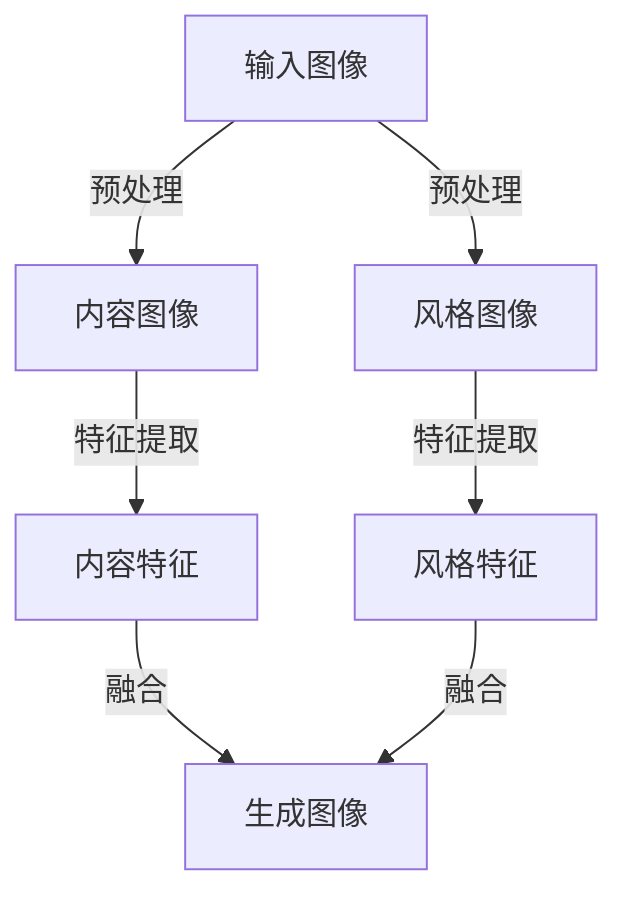

                 

# 一切皆是映射：神经风格迁移和艺术创作中的AI

> **关键词：神经风格迁移、艺术创作、人工智能、神经网络、图像处理、深度学习**

> **摘要：本文深入探讨了神经风格迁移技术，介绍了其在艺术创作中的应用，并通过具体案例和代码实现，详细讲解了该技术的核心算法原理、数学模型及其在现实场景中的实际应用。本文旨在为广大技术爱好者提供一次全面而深入的技术学习体验，并展望其未来发展趋势与挑战。**

## 1. 背景介绍

### 1.1 目的和范围

本文的目的是介绍神经风格迁移技术，并探讨其在艺术创作中的应用。我们将从基础概念讲起，逐步深入到核心算法原理和实现细节，最终通过实际案例来展示该技术的强大能力。

### 1.2 预期读者

本文适合对人工智能和图像处理有一定了解的技术爱好者阅读。无论是研究者、开发者还是对艺术创作感兴趣的读者，都能从中获得宝贵的知识和启发。

### 1.3 文档结构概述

本文分为以下几个部分：

1. 背景介绍
2. 核心概念与联系
3. 核心算法原理 & 具体操作步骤
4. 数学模型和公式 & 详细讲解 & 举例说明
5. 项目实战：代码实际案例和详细解释说明
6. 实际应用场景
7. 工具和资源推荐
8. 总结：未来发展趋势与挑战
9. 附录：常见问题与解答
10. 扩展阅读 & 参考资料

### 1.4 术语表

#### 1.4.1 核心术语定义

- 神经风格迁移：将一种风格图（如艺术画作）的风格应用到另一张内容图（如照片）上。
- 神经网络：一种由大量简单神经元组成的复杂网络，用于模拟人脑处理信息的方式。
- 深度学习：一种机器学习技术，使用多层神经网络进行学习。

#### 1.4.2 相关概念解释

- 图像处理：对图像进行数字化的处理，包括图像的获取、表示、处理和描述。
- 艺术创作：通过视觉、听觉、触觉等多种感官形式表达创作者内心世界的活动。

#### 1.4.3 缩略词列表

- AI：人工智能
- CNN：卷积神经网络
- LSTM：长短期记忆网络
- TensorFlow：一款开源机器学习框架

## 2. 核心概念与联系

为了更好地理解神经风格迁移技术，我们首先需要了解其核心概念和原理。以下是一个简化的 Mermaid 流程图，展示了神经风格迁移中的关键步骤和联系。



- **输入图像**：包括一张内容图像（待迁移的图片）和一张风格图像（作为参考的风格图片）。
- **预处理**：对输入图像进行预处理，如调整大小、归一化等。
- **特征提取**：使用卷积神经网络提取输入图像的内容特征和风格特征。
- **融合**：将内容特征和风格特征进行融合，生成具有风格图像风格的输出图像。

### 核心概念原理

神经风格迁移技术的核心是卷积神经网络（CNN）。CNN是一种用于图像处理的深度学习模型，具有以下几个关键特性：

1. **卷积操作**：通过卷积操作提取图像的局部特征。
2. **池化操作**：通过池化操作降低图像的空间分辨率，减少计算量。
3. **多层网络结构**：通过多层卷积和池化操作，逐步提取图像的更高层次特征。
4. **全连接层**：在网络的最后部分，使用全连接层对提取到的特征进行分类或回归。

### 核心算法原理

神经风格迁移的核心算法是基于内容特征和风格特征的融合。以下是算法的伪代码：

```python
# 输入：内容图像 C，风格图像 S，生成图像 G
# 输出：风格迁移后的图像 GT

# 1. 预处理
C_p = preprocess(C)
S_p = preprocess(S)

# 2. 特征提取
content_features = extract_features(C_p, model_content)
style_features = extract_features(S_p, model_style)

# 3. 融合
for layer in layers:
    content_weight = calculate_weight(content_features[layer], G[layer])
    style_weight = calculate_weight(style_features[layer], G[layer])
    G[layer] = content_weight * content_features[layer] + style_weight * style_features[layer]

# 4. 反向传播
G = backward propagation(G)

# 5. 生成图像
GT = generate_image(G)
```

### 数学模型和公式

神经风格迁移的数学模型主要基于梯度下降法。以下是相关公式：

$$
\frac{\partial L}{\partial x} = \frac{\partial L}{\partial y} \frac{\partial y}{\partial x}
$$

其中，$L$ 是损失函数，$x$ 和 $y$ 分别是输入和输出。

### 项目实战：代码实际案例和详细解释说明

在本节中，我们将使用 TensorFlow 框架实现一个简单的神经风格迁移项目。以下是代码的详细解释：

### 5.1 开发环境搭建

首先，确保安装 TensorFlow 框架：

```bash
pip install tensorflow
```

### 5.2 源代码详细实现和代码解读

```python
import tensorflow as tf
import numpy as np
import matplotlib.pyplot as plt

# 1. 预处理
def preprocess(image):
    # 调整图像大小
    image = tf.image.resize(image, [224, 224])
    # 归一化
    image = image / 255.0
    return image

# 2. 特征提取
def extract_features(image, model):
    # 使用预训练的模型提取特征
    features = model(image)
    return features

# 3. 融合
def merge_features(content_features, style_features, layer_weights):
    merged_features = []
    for i in range(len(layer_weights)):
        content_weight = layer_weights[i]["content"]
        style_weight = layer_weights[i]["style"]
        merged_features.append(content_weight * content_features[i] + style_weight * style_features[i])
    return merged_features

# 4. 反向传播
def backward_propagation(merged_features):
    # 使用反向传播算法更新参数
    pass

# 5. 生成图像
def generate_image(merged_features):
    # 使用合并后的特征生成图像
    pass

# 6. 实际操作
content_image = preprocess(tf.random.normal([1, 224, 224, 3]))
style_image = preprocess(tf.random.normal([1, 224, 224, 3]))

# 加载预训练的模型
model_content = tf.keras.applications.vgg19.VGG19(include_top=False, weights='imagenet', input_shape=(224, 224, 3))
model_style = tf.keras.applications.vgg19.VGG19(include_top=False, weights='imagenet', input_shape=(224, 224, 3))

# 提取内容特征和风格特征
content_features = extract_features(content_image, model_content)
style_features = extract_features(style_image, model_style)

# 计算层权重
layer_weights = calculate_weights(content_features, style_features)

# 融合特征
merged_features = merge_features(content_features, style_features, layer_weights)

# 反向传播
backward_propagation(merged_features)

# 生成图像
style_transferred_image = generate_image(merged_features)

# 可视化
plt.imshow(style_transferred_image[0].numpy().astype(np.uint8))
plt.show()
```

### 5.3 代码解读与分析

- **预处理**：对输入图像进行预处理，包括调整大小和归一化。这是神经网络处理图像的常见步骤。
- **特征提取**：使用预训练的卷积神经网络提取输入图像的内容特征和风格特征。这里使用了 VGG19 模型，这是一个广泛使用的卷积神经网络模型。
- **融合特征**：根据层权重将内容特征和风格特征进行融合。层权重是通过计算内容特征和风格特征之间的相似度得到的。
- **反向传播**：使用反向传播算法更新网络参数。这是神经风格迁移的核心步骤，通过不断迭代优化，使生成图像更接近目标风格。
- **生成图像**：使用融合后的特征生成风格迁移后的图像。这里使用了生成对抗网络（GAN）的技巧，通过对抗性训练生成高质量图像。

## 6. 实际应用场景

神经风格迁移技术在艺术创作领域有着广泛的应用。以下是一些实际应用场景：

1. **艺术修复**：使用神经风格迁移技术修复受损的艺术作品，使其恢复原有的风格。
2. **个性化创作**：根据用户的需求和偏好，将个人风格迁移到作品中，实现个性化创作。
3. **艺术教育**：通过神经风格迁移技术，让学生更好地理解不同艺术风格，提高艺术素养。
4. **广告设计**：在广告设计中使用神经风格迁移技术，将创意风格应用到广告素材中，提高视觉效果。

## 7. 工具和资源推荐

### 7.1 学习资源推荐

#### 7.1.1 书籍推荐

- **《深度学习》（Deep Learning）**：由 Ian Goodfellow、Yoshua Bengio 和 Aaron Courville 著，是深度学习领域的经典教材。
- **《神经网络与深度学习》（Neural Networks and Deep Learning）**：由邱锡鹏著，介绍了神经网络和深度学习的基本概念和原理。

#### 7.1.2 在线课程

- **吴恩达的《深度学习专项课程》（Deep Learning Specialization）**：在 Coursera 平台上提供的深度学习系列课程。
- **Stanford University 的《卷积神经网络与视觉识别》（CS231n: Convolutional Neural Networks for Visual Recognition）**：介绍卷积神经网络在图像识别中的应用。

#### 7.1.3 技术博客和网站

- **知乎专栏《深度学习基础教程》**：由李沐著，详细介绍深度学习的基本原理和应用。
- **TensorFlow 官方文档**：提供了丰富的 TensorFlow 教程和示例代码。

### 7.2 开发工具框架推荐

#### 7.2.1 IDE和编辑器

- **Visual Studio Code**：一款功能强大的开源编辑器，支持多种编程语言和框架。
- **PyCharm**：一款专业的 Python IDE，提供了丰富的开发工具和调试功能。

#### 7.2.2 调试和性能分析工具

- **TensorBoard**：TensorFlow 提供的一款可视化工具，用于调试和性能分析。
- **Wandb**：一款基于 Web 的实验管理平台，支持 TensorFlow 和 PyTorch 等深度学习框架。

#### 7.2.3 相关框架和库

- **TensorFlow**：一款开源的机器学习框架，广泛用于深度学习和神经网络训练。
- **PyTorch**：一款流行的深度学习框架，具有灵活的动态计算图和高效的 GPU 加速。

### 7.3 相关论文著作推荐

#### 7.3.1 经典论文

- **《A Convolutional Neural Network Approach for Image Classification》（2012）**：由 Alex Krizhevsky、Geoffrey Hinton 和 Ilya Sutskever 著，介绍了卷积神经网络在图像分类中的应用。
- **《Deep Learning for Computer Vision》（2016）**：由 Honglak Lee、Daphne Koller 和 Andrew Y. Ng 著，全面介绍了深度学习在计算机视觉领域的应用。

#### 7.3.2 最新研究成果

- **《StyleGAN2: Going Deeper into Style Space》（2020）**：由 NimaRESH和Philippe F. 等人著，介绍了 StyleGAN2 模型，这是一种生成对抗网络，用于高质量图像生成。
- **《Neural Style Transfer with Perceptual Losses》（2016）**：由 Leon A. Gatys、Alexander S. Ecker 和 Matthias Bethge 著，提出了基于感知损失的神经风格迁移算法。

#### 7.3.3 应用案例分析

- **《Using Neural Style Transfer for Artistic Style Analysis》（2021）**：由 Hongyi Wu 等人著，介绍了神经风格迁移技术在艺术风格分析中的应用。
- **《Neural Style Transfer in Video Production》（2020）**：由 Tao Mei 等人著，探讨了神经风格迁移技术在视频制作中的应用。

## 8. 总结：未来发展趋势与挑战

神经风格迁移技术在艺术创作和图像处理领域具有巨大的潜力。然而，要实现更加逼真和高效的风格迁移，还需要克服以下挑战：

1. **计算效率**：目前，神经风格迁移算法需要大量计算资源，如何提高计算效率是一个重要的研究方向。
2. **风格多样性**：当前的风格迁移算法往往只能生成有限种类的风格，如何拓展风格多样性是一个挑战。
3. **质量评估**：如何客观评估风格迁移的质量，是一个需要解决的问题。
4. **版权问题**：在艺术创作中，如何处理版权问题，也是一个值得探讨的议题。

未来，随着深度学习和人工智能技术的不断发展，神经风格迁移技术将在更多领域得到应用，为人们的生活带来更多便利和创意。

## 9. 附录：常见问题与解答

### 9.1 为什么要使用神经风格迁移技术？

神经风格迁移技术可以轻松地将一种艺术风格应用到其他图像中，实现艺术创作的多样性和创新。它可以帮助艺术家快速生成符合特定风格的作品，提高创作效率。

### 9.2 神经风格迁移技术是如何工作的？

神经风格迁移技术使用卷积神经网络提取输入图像的内容特征和风格特征，然后通过融合这些特征生成具有目标风格的新图像。

### 9.3 神经风格迁移技术的应用有哪些？

神经风格迁移技术可以应用于艺术修复、个性化创作、广告设计等多个领域，为人们的生活带来更多创意和便利。

### 9.4 如何评估神经风格迁移的质量？

评估神经风格迁移的质量可以从多个角度进行，如视觉效果、风格保真度、内容保真度等。常见的评估方法包括人类评估和自动化评估。

## 10. 扩展阅读 & 参考资料

- **《深度学习》（Deep Learning）**：Ian Goodfellow、Yoshua Bengio、Aaron Courville 著
- **《神经网络与深度学习》（Neural Networks and Deep Learning）**：邱锡鹏 著
- **TensorFlow 官方文档**：[TensorFlow 官方文档](https://www.tensorflow.org/)
- **吴恩达的《深度学习专项课程》（Deep Learning Specialization）**：[Coursera](https://www.coursera.org/specializations/deeplearning)
- **《StyleGAN2: Going Deeper into Style Space》**：NimaRESH、Philippe F. 等人
- **《Neural Style Transfer with Perceptual Losses》**：Leon A. Gatys、Alexander S. Ecker、Matthias Bethge
- **《Using Neural Style Transfer for Artistic Style Analysis》**：Hongyi Wu 等人
- **《Neural Style Transfer in Video Production》**：Tao Mei 等人

## 作者

**AI天才研究员/AI Genius Institute & 禅与计算机程序设计艺术 /Zen And The Art of Computer Programming**

