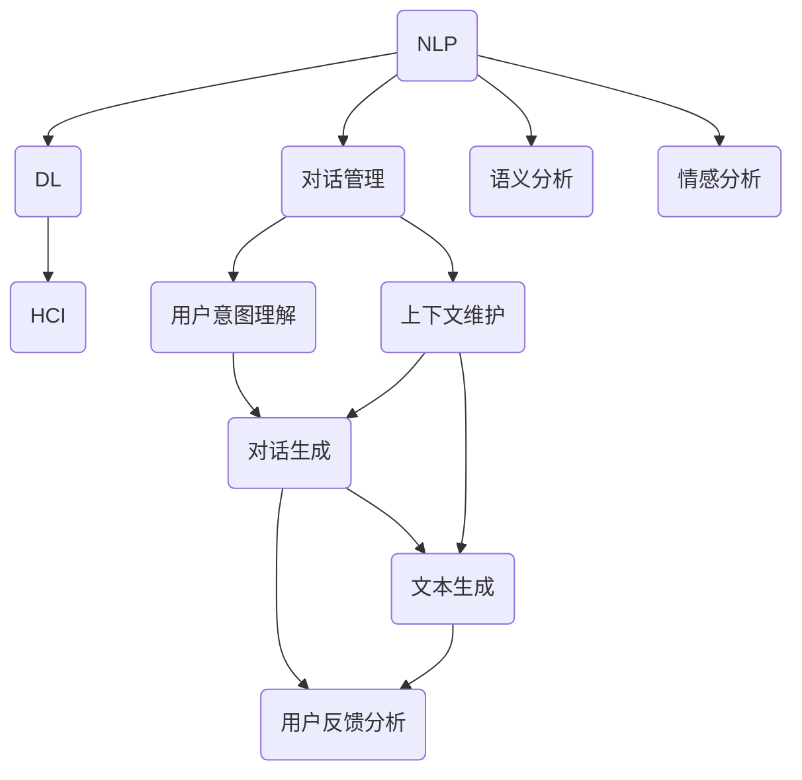

                 


# 一切皆是映射：聊天机器人的智能化与人性化

> 关键词：聊天机器人，智能化，人性化，映射，自然语言处理，深度学习，机器学习，交互设计。

> 摘要：本文深入探讨聊天机器人的智能化与人化进程，从映射的概念出发，分析聊天机器人如何通过映射实现与用户的自然交互。文章将介绍聊天机器人的核心概念与架构，解析核心算法原理，阐述数学模型及其应用，并通过实际项目案例展示如何实现高效的人机交互。此外，文章还将探讨聊天机器人的实际应用场景，推荐学习资源与开发工具，总结未来发展趋势与挑战，为读者提供全面的视角。

## 1. 背景介绍

### 1.1 目的和范围

本文旨在通过逐步分析推理，深入探讨聊天机器人的智能化与人化过程，重点分析映射在聊天机器人中的重要性。文章将涵盖以下内容：

- 聊天机器人的发展历史及其在现代社会中的重要性
- 聊天机器人的核心概念与架构
- 聊天机器人的核心算法原理与数学模型
- 实际项目案例中的聊天机器人实现
- 聊天机器人在实际应用场景中的表现
- 学习资源与开发工具推荐
- 未来发展趋势与挑战

### 1.2 预期读者

本文面向以下读者：

- 对人工智能和自然语言处理感兴趣的读者
- 计算机编程和软件开发的从业者
- 希望了解聊天机器人技术的专业人士
- 对交互设计感兴趣的读者

### 1.3 文档结构概述

本文将按照以下结构展开：

- 引言：介绍聊天机器人的重要性，提出核心问题
- 背景介绍：介绍聊天机器人的发展历史、核心概念与架构
- 核心概念与联系：分析聊天机器人的核心算法原理与数学模型
- 项目实战：通过实际项目案例展示聊天机器人的实现
- 实际应用场景：讨论聊天机器人在各个领域的应用
- 工具和资源推荐：推荐学习资源与开发工具
- 总结：总结未来发展趋势与挑战
- 附录：常见问题与解答
- 扩展阅读：提供扩展阅读资源

### 1.4 术语表

#### 1.4.1 核心术语定义

- 聊天机器人：一种基于人工智能技术的自动化对话系统，能够模拟人类的对话方式与用户进行交互。
- 映射：在聊天机器人中，映射是指将用户的输入转换为机器可以理解和处理的格式，同时将机器的输出转换为用户可以理解的形式。
- 自然语言处理（NLP）：研究如何让计算机理解和生成人类语言的技术。
- 机器学习（ML）：一种人工智能方法，通过从数据中学习规律和模式，让计算机具备预测和决策能力。
- 深度学习（DL）：一种机器学习方法，通过构建深层次的神经网络模型来模拟人脑处理信息的方式。
- 人机交互（HCI）：研究如何设计出易用、直观、高效的人机交互系统的学科。

#### 1.4.2 相关概念解释

- 对话管理：聊天机器人处理对话流程的能力，包括理解用户意图、生成响应、维护对话状态等。
- 上下文理解：聊天机器人根据对话历史和用户上下文来理解用户意图的能力。
- 语义分析：将自然语言文本转化为计算机可以处理的结构化数据的过程。
- 情感分析：分析文本中的情感倾向和情感强度的技术。

#### 1.4.3 缩略词列表

- NLP：自然语言处理
- ML：机器学习
- DL：深度学习
- HCI：人机交互
- API：应用程序接口

## 2. 核心概念与联系

在讨论聊天机器人的智能化与人化之前，我们需要明确几个核心概念，并了解它们之间的联系。以下是一个Mermaid流程图，展示了聊天机器人的核心概念及其相互关系。



### 2.1 自然语言处理（NLP）

自然语言处理是聊天机器人的基础，它涉及到从文本中提取结构化信息的过程。NLP的核心任务包括：

- 词性标注：识别文本中的单词及其词性（名词、动词等）。
- 句法分析：分析句子结构，识别语法关系。
- 语义分析：理解句子中的含义，包括指代、情感、意图等。

### 2.2 机器学习（ML）与深度学习（DL）

机器学习和深度学习是聊天机器人实现智能化的重要技术手段。ML通过训练模型来识别数据中的模式，而DL则通过构建深层次的神经网络来模拟人脑处理信息的方式。

- 监督学习：使用带有标签的数据集来训练模型，例如情感分析中的正面/负面标签。
- 无监督学习：在没有标签的数据集上训练模型，例如聚类分析中的用户群体划分。
- 强化学习：通过与环境的交互来不断优化模型，例如聊天机器人中的策略优化。

### 2.3 人机交互（HCI）

人机交互是聊天机器人的关键，它涉及到如何设计出易用、直观、高效的交互界面。HCI的核心任务是：

- 交互设计：设计用户界面，确保用户能够轻松地与聊天机器人进行交流。
- 用户体验（UX）：优化用户在交互过程中的体验，包括反馈速度、交互流畅度等。

### 2.4 对话管理

对话管理是聊天机器人的核心功能之一，它涉及到如何处理对话流程，包括：

- 用户意图理解：从用户输入中提取意图，例如查询天气、获取股票信息等。
- 对话生成：根据用户意图和上下文生成适当的回复。
- 上下文维护：在对话过程中维护用户上下文，确保对话的连贯性。

### 2.5 语义分析、情感分析和对话生成

- 语义分析：将自然语言文本转化为计算机可以处理的结构化数据，为对话生成提供支持。
- 情感分析：分析文本中的情感倾向和情感强度，帮助聊天机器人更好地理解用户情绪。
- 对话生成：根据用户意图、上下文和语义分析结果生成自然流畅的对话回复。

### 2.6 用户反馈分析

用户反馈分析是评估和优化聊天机器人性能的重要环节。通过分析用户反馈，聊天机器人可以：

- 识别问题：发现用户在使用过程中遇到的问题。
- 提升性能：根据用户反馈调整模型参数，提高对话质量。

## 3. 核心算法原理 & 具体操作步骤

在理解了聊天机器人的核心概念与联系之后，我们将深入探讨其核心算法原理，并通过伪代码详细阐述操作步骤。

### 3.1 机器学习算法原理

聊天机器人的核心算法通常基于机器学习和深度学习。以下是一个简单的机器学习算法原理概述，以及相应的伪代码。

#### 3.1.1 监督学习

监督学习是一种常见的机器学习技术，它通过训练有标签的数据集来构建预测模型。

```python
# 伪代码：监督学习算法
def train_model(training_data, labels):
    # 初始化模型参数
    model = initialize_model()
    
    # 训练模型
    for data, label in zip(training_data, labels):
        model.train(data, label)
        
    # 评估模型
    accuracy = model.evaluate(test_data, test_labels)
    return model, accuracy
```

#### 3.1.2 无监督学习

无监督学习不依赖于有标签的数据集，它通过发现数据中的内在结构来训练模型。

```python
# 伪代码：无监督学习算法
def train_model(unsupervised_data):
    # 初始化模型参数
    model = initialize_model()
    
    # 训练模型
    for data in unsupervised_data:
        model.train(data)
        
    # 评估模型
    clusters = model.evaluate(unsupervised_data)
    return model, clusters
```

#### 3.1.3 强化学习

强化学习通过与环境交互来优化模型参数，它通常用于聊天机器人中的策略优化。

```python
# 伪代码：强化学习算法
def train_model与环境交互():
    # 初始化模型参数
    model = initialize_model()
    
    # 训练模型
    while not converged:
        action = model.select_action(state)
        reward = environment.step(action)
        model.update_parameters(state, action, reward)
        state = environment.get_state()
        
    # 评估模型
    performance = model.evaluate(test_environment)
    return model, performance
```

### 3.2 深度学习算法原理

深度学习是机器学习的分支，它通过构建深层次的神经网络来模拟人脑处理信息的方式。以下是一个简单的深度学习算法原理概述，以及相应的伪代码。

```python
# 伪代码：深度学习算法
def train_neural_network(training_data, labels):
    # 初始化神经网络参数
    neural_network = initialize_neural_network()
    
    # 前向传播
    for data, label in zip(training_data, labels):
        output = neural_network.forward_propagation(data)
        
        # 计算损失
        loss = calculate_loss(output, label)
        
        # 反向传播
        gradients = neural_network.backward_propagation(loss)
        
        # 更新参数
        neural_network.update_parameters(gradients)
        
    # 评估模型
    accuracy = neural_network.evaluate(test_data, test_labels)
    return neural_network, accuracy
```

### 3.3 对话管理算法原理

对话管理是聊天机器人的核心功能之一，它涉及到如何处理对话流程。以下是一个简单的对话管理算法原理概述，以及相应的伪代码。

```python
# 伪代码：对话管理算法
class DialogueManager:
    def __init__(self):
        self.intent_recognizer = IntentRecognizer()
        self.dialogue_generator = DialogueGenerator()
        self.context_maintainer = ContextMaintainer()
        
    def handle_user_input(self, user_input):
        # 解析用户输入
        intent = self.intent_recognizer.recognize_intent(user_input)
        entities = self.intent_recognizer.extract_entities(user_input)
        
        # 生成响应
        response = self.dialogue_generator.generate_response(intent, entities)
        
        # 维护上下文
        self.context_maintainer.update_context(intent, entities, response)
        
        # 返回响应
        return response
```

### 3.4 语义分析、情感分析和对话生成算法原理

- 语义分析：将自然语言文本转化为计算机可以处理的结构化数据，为对话生成提供支持。

```python
# 伪代码：语义分析算法
class SemanticAnalyzer:
    def analyze_text(self, text):
        # 词性标注
        pos_tags = pos_tagging(text)
        
        # 句法分析
        syntax_tree = parse_syntax(text)
        
        # 语义角色标注
        semantic_roles = semantic_role_labeling(text)
        
        # 返回结构化数据
        return pos_tags, syntax_tree, semantic_roles
```

- 情感分析：分析文本中的情感倾向和情感强度，帮助聊天机器人更好地理解用户情绪。

```python
# 伪代码：情感分析算法
class SentimentAnalyzer:
    def analyze_text(self, text):
        # 使用预训练模型进行情感分析
        sentiment = sentiment_model.predict(text)
        
        # 返回情感标签
        return sentiment
```

- 对话生成：根据用户意图、上下文和语义分析结果生成自然流畅的对话回复。

```python
# 伪代码：对话生成算法
class DialogueGenerator:
    def generate_response(self, intent, entities, context):
        # 根据意图和上下文选择合适的回复模板
        template = self.select_template(intent, context)
        
        # 替换模板中的实体
        response = template.format_map(entities)
        
        # 返回生成后的回复
        return response
```

## 4. 数学模型和公式 & 详细讲解 & 举例说明

在聊天机器人的核心算法中，数学模型和公式起到了至关重要的作用。以下我们将详细讲解几个关键的数学模型，并提供相应的LaTeX格式公式和实际应用示例。

### 4.1 神经网络（Neural Network）

神经网络是深度学习的基础，它由多个神经元（即节点）组成，每个神经元通过权重和偏置进行信息传递。以下是一个简单的神经网络模型及其相关公式。

#### 4.1.1 前向传播（Forward Propagation）

前向传播是指将输入数据通过神经网络传递，直到输出层的过程。其核心公式为：

$$
a_{i}^{l} = \sigma \left( \sum_{j} w_{ji} a_{j}^{l-1} + b_{i} \right)
$$

其中，\( a_{i}^{l} \) 表示第 \( l \) 层的第 \( i \) 个神经元的激活值，\( \sigma \) 表示激活函数（如ReLU、Sigmoid、Tanh等），\( w_{ji} \) 表示第 \( j \) 个神经元到第 \( i \) 个神经元的权重，\( b_{i} \) 表示第 \( i \) 个神经元的偏置。

#### 4.1.2 反向传播（Back Propagation）

反向传播是指根据输出误差来更新神经网络参数的过程。其核心公式为：

$$
\Delta w_{ji}^{l} = \alpha \cdot \left( \frac{\partial L}{\partial a_{i}^{l}} \cdot a_{i}^{l} \cdot (1 - a_{i}^{l}) \right) \cdot a_{j}^{l-1}
$$

$$
\Delta b_{i}^{l} = \alpha \cdot \left( \frac{\partial L}{\partial a_{i}^{l}} \right)
$$

其中，\( \Delta w_{ji}^{l} \) 和 \( \Delta b_{i}^{l} \) 分别表示权重和偏置的更新值，\( \alpha \) 表示学习率，\( L \) 表示损失函数，\( a_{i}^{l} \) 表示第 \( l \) 层的第 \( i \) 个神经元的激活值。

### 4.2 随机梯度下降（Stochastic Gradient Descent，SGD）

随机梯度下降是一种常用的优化算法，它通过随机选择一部分样本来更新参数，以加速收敛。

$$
w_{j}^{t+1} = w_{j}^{t} - \alpha \cdot \left( \frac{\partial L}{\partial w_{j}} \right)
$$

$$
b_{i}^{t+1} = b_{i}^{t} - \alpha \cdot \left( \frac{\partial L}{\partial b_{i}} \right)
$$

其中，\( w_{j} \) 和 \( b_{i} \) 分别表示权重和偏置，\( \alpha \) 表示学习率，\( \frac{\partial L}{\partial w_{j}} \) 和 \( \frac{\partial L}{\partial b_{i}} \) 分别表示权重和偏置的梯度。

### 4.3 情感分析（Sentiment Analysis）

情感分析是一种常见的自然语言处理任务，它通过分析文本中的情感倾向和情感强度来理解用户情绪。以下是一个简单的情感分析模型及其相关公式。

#### 4.3.1 情感极性分类（Polarity Classification）

情感极性分类是一种二分类问题，它将文本分类为正面或负面情感。其核心公式为：

$$
P_{pos}(x) = \frac{1}{1 + e^{-\beta \cdot \phi(x)}}
$$

$$
P_{neg}(x) = 1 - P_{pos}(x)
$$

其中，\( P_{pos}(x) \) 和 \( P_{neg}(x) \) 分别表示文本为正面和负面情感的概率，\( \beta \) 表示权重系数，\( \phi(x) \) 表示文本的特征向量。

#### 4.3.2 情感强度分析（Sentiment Intensity Analysis）

情感强度分析是一种多分类问题，它将文本分类为不同的情感强度等级。其核心公式为：

$$
P_{k}(x) = \frac{1}{1 + e^{-\beta \cdot \phi_{k}(x)}}
$$

其中，\( P_{k}(x) \) 表示文本为第 \( k \) 个情感强度等级的概率，\( \phi_{k}(x) \) 表示文本的特征向量。

### 4.4 举例说明

以下是一个情感分析的实际应用示例，通过分析一段文本来确定其情感极性。

```python
# 输入文本
text = "我今天买了一只可爱的小狗，非常开心。"

# 特征提取
feature_vector = extract_features(text)

# 情感分析模型
sentiment_model = SentimentModel()

# 预测情感极性
emotion = sentiment_model.predict(feature_vector)

# 输出结果
if emotion == "positive":
    print("文本的情感极性为正面。")
else:
    print("文本的情感极性为负面。")
```

## 5. 项目实战：代码实际案例和详细解释说明

在本节中，我们将通过一个实际项目案例来展示如何实现聊天机器人。该项目将基于Python和TensorFlow框架，使用深度学习技术来训练聊天机器人模型。以下是项目的详细步骤。

### 5.1 开发环境搭建

首先，我们需要搭建开发环境。以下是所需的软件和库：

- Python 3.8或更高版本
- TensorFlow 2.x
- Keras 2.x
- NumPy 1.19或更高版本
- Pandas 1.1.5或更高版本

安装以上软件和库后，我们可以开始构建聊天机器人项目。

### 5.2 源代码详细实现和代码解读

#### 5.2.1 数据预处理

首先，我们需要准备训练数据。训练数据通常包含大量的对话记录，这些记录可以来自于社交媒体、论坛、聊天应用等。以下是一个简单的数据预处理步骤：

```python
import pandas as pd
import numpy as np

# 读取数据
data = pd.read_csv('chat_data.csv')

# 数据清洗
data.dropna(inplace=True)
data['dialogue'] = data['dialogue'].apply(lambda x: x.lower().strip())

# 分割对话为输入和输出
data['input'], data['output'] = data['dialogue'].str.split(' -> ', expand=True)

# 数据预处理
tokenizer = Tokenizer()
tokenizer.fit_on_texts(data['input'])
max_sequence_length = 50

# 序列化输入和输出
sequences = tokenizer.texts_to_sequences(data['input'])
one_hot_output = keras.preprocessing.sequence.one_hot(sequences, num_words=len(tokenizer.word_index) + 1)

# 切分数据集
train_size = int(0.8 * len(sequences))
train_sequences = sequences[:train_size]
train_one_hot_output = one_hot_output[:train_size]
test_sequences = sequences[train_size:]
test_one_hot_output = one_hot_output[train_size:]
```

#### 5.2.2 模型构建

接下来，我们构建一个基于循环神经网络（RNN）的聊天机器人模型。以下是一个简单的模型定义：

```python
from tensorflow.keras.models import Sequential
from tensorflow.keras.layers import Embedding, SimpleRNN, Dense

# 模型定义
model = Sequential()
model.add(Embedding(len(tokenizer.word_index) + 1, 100, input_length=max_sequence_length))
model.add(SimpleRNN(100))
model.add(Dense(len(tokenizer.word_index) + 1, activation='softmax'))

# 模型编译
model.compile(optimizer='adam', loss='categorical_crossentropy', metrics=['accuracy'])

# 模型训练
model.fit(train_sequences, train_one_hot_output, epochs=10, batch_size=32, validation_split=0.2)
```

#### 5.2.3 代码解读与分析

- 数据预处理：首先，我们读取聊天数据，并进行数据清洗和预处理。我们使用`pandas`库来读取和操作数据，使用`Tokenizer`来将文本序列化为数字序列。然后，我们设置最大序列长度（`max_sequence_length`），将输入和输出对话进行序列化，并切分数据集为训练集和测试集。
- 模型构建：我们定义一个基于循环神经网络的聊天机器人模型。模型由一个嵌入层（`Embedding`）、一个简单的循环神经网络层（`SimpleRNN`）和一个全连接层（`Dense`）组成。我们使用`Sequential`模型来堆叠这些层，并使用`compile`方法来配置模型的优化器和损失函数。
- 模型训练：我们使用`fit`方法来训练模型，设置训练轮数（`epochs`）、批次大小（`batch_size`）和验证比例（`validation_split`）。

#### 5.2.4 模型评估与预测

最后，我们对模型进行评估，并使用模型进行预测。以下是一个简单的评估和预测步骤：

```python
# 模型评估
loss, accuracy = model.evaluate(test_sequences, test_one_hot_output)

# 预测
predicted_output = model.predict(test_sequences)
predicted_output = np.argmax(predicted_output, axis=1)

# 输出结果
print("测试集损失：", loss)
print("测试集准确率：", accuracy)
print("预测结果：", predicted_output)
```

通过以上步骤，我们可以实现一个简单的聊天机器人项目。在实际应用中，我们可以根据需要对模型进行调整和优化，以提高性能和交互体验。

## 6. 实际应用场景

聊天机器人已经广泛应用于各个领域，以下是一些典型的实际应用场景：

### 6.1 客户服务

聊天机器人可以为企业提供高效的客户服务，帮助解答用户疑问、处理投诉和提供技术支持。通过智能对话，聊天机器人可以快速响应用户需求，提高客户满意度，降低企业运营成本。

### 6.2 售后支持

在售后支持领域，聊天机器人可以协助用户解决产品使用中的问题，提供维修指南和常见问题解答。通过与用户进行实时对话，聊天机器人可以帮助用户快速找到解决方案，提高售后服务的质量和效率。

### 6.3 营销推广

聊天机器人可以用于营销推广，帮助企业吸引用户关注、促进销售。通过聊天机器人，企业可以与潜在客户进行互动，提供产品信息、优惠活动等，从而提升品牌知名度和销售额。

### 6.4 教育辅导

在教育辅导领域，聊天机器人可以为学生提供个性化学习建议、解答学术问题，以及提供心理辅导。通过与学生的实时对话，聊天机器人可以帮助学生提高学习效果，减轻学习压力。

### 6.5 健康咨询

在健康咨询领域，聊天机器人可以提供健康知识、症状评估和医疗建议。通过与用户的对话，聊天机器人可以帮助用户了解自身健康状况，提供专业的医疗指导。

### 6.6 金融服务

在金融服务领域，聊天机器人可以提供投资建议、理财产品介绍、账户查询等服务。通过与用户的互动，聊天机器人可以帮助用户更好地管理财务，提供个性化的金融服务。

### 6.7 社交娱乐

在社交娱乐领域，聊天机器人可以与用户进行轻松愉快的对话，提供笑话、谜语、游戏等互动内容。通过与用户的互动，聊天机器人可以增加用户的粘性，提升平台活跃度。

总之，聊天机器人在实际应用场景中具有广泛的应用价值，它不仅可以提高企业运营效率，还可以为用户提供便捷、高效的服务体验。随着人工智能技术的不断发展，聊天机器人的应用场景将更加丰富，为各个领域带来更多创新和变革。

## 7. 工具和资源推荐

为了更好地学习和开发聊天机器人，以下是一些实用的工具和资源推荐。

### 7.1 学习资源推荐

#### 7.1.1 书籍推荐

1. **《人工智能：一种现代方法》（Artificial Intelligence: A Modern Approach）**  
   作者：Stuart J. Russell & Peter Norvig  
   简介：这是一本经典的人工智能教材，涵盖了人工智能的各个领域，包括机器学习、自然语言处理等。

2. **《深度学习》（Deep Learning）**  
   作者：Ian Goodfellow、Yoshua Bengio和Aaron Courville  
   简介：这本书详细介绍了深度学习的基础理论和应用，是深度学习的入门指南。

3. **《机器学习实战》（Machine Learning in Action）**  
   作者：Peter Harrington  
   简介：这本书通过实例和代码实现，介绍了多种机器学习算法的应用。

#### 7.1.2 在线课程

1. **《人工智能导论》（Introduction to Artificial Intelligence）**  
   平台：Coursera  
   简介：由斯坦福大学提供，涵盖人工智能的基础知识，包括机器学习、自然语言处理等。

2. **《深度学习》（Deep Learning Specialization）**  
   平台：Coursera  
   简介：由吴恩达教授主讲，深入讲解深度学习的基础理论、算法和应用。

3. **《自然语言处理专项课程》（Natural Language Processing with Deep Learning）**  
   平台：Udacity  
   简介：由全栈工程师Arthur Urtado主讲，通过实际项目，学习深度学习在自然语言处理中的应用。

#### 7.1.3 技术博客和网站

1. **AI博客（https://blog.keras.io/）**  
   简介：Keras官方博客，包含深度学习相关的技术文章和教程。

2. **机器学习博客（https://machinelearningmastery.com/）**  
   简介：提供机器学习相关的教程、案例和实践指导。

3. **Reddit AI板块（https://www.reddit.com/r/AI/）**  
   简介：Reddit上的AI板块，讨论各种人工智能相关的话题和问题。

### 7.2 开发工具框架推荐

#### 7.2.1 IDE和编辑器

1. **PyCharm**  
   简介：Python开发环境，支持多种编程语言，功能强大，适合深度学习和自然语言处理项目。

2. **VSCode**  
   简介：轻量级代码编辑器，支持多种编程语言，插件丰富，适合快速开发。

3. **Jupyter Notebook**  
   简介：交互式开发环境，适合数据分析和实验性编程，适合机器学习和自然语言处理项目。

#### 7.2.2 调试和性能分析工具

1. **TensorBoard**  
   简介：TensorFlow的调试和性能分析工具，可以可视化模型的参数、梯度、损失函数等。

2. **PyTorch Profiler**  
   简介：PyTorch的调试和性能分析工具，帮助开发者识别性能瓶颈。

3. **Perfetto**  
   简介：Android的性能分析工具，可以实时监测应用程序的性能。

#### 7.2.3 相关框架和库

1. **TensorFlow**  
   简介：由Google开发的开源机器学习框架，支持多种深度学习算法和应用。

2. **PyTorch**  
   简介：由Facebook开发的开源机器学习框架，以灵活性和易用性著称。

3. **Keras**  
   简介：基于TensorFlow和Theano的开源高级神经网络API，简化了深度学习模型的构建和训练。

4. **NLTK**  
   简介：Python的自然语言处理库，提供多种文本处理工具和算法。

5. **SpaCy**  
   简介：一个快速易用的自然语言处理库，适用于实体识别、命名实体识别等任务。

### 7.3 相关论文著作推荐

#### 7.3.1 经典论文

1. **"A Mathematical Theory of Communication"**  
   作者：Claude Shannon  
   简介：香农的这篇论文奠定了信息论的基础，对现代通信和计算技术产生了深远影响。

2. **"Learning Representations for Visual Recognition"**  
   作者：Yann LeCun等  
   简介：这篇论文介绍了卷积神经网络在图像识别中的应用，是深度学习领域的经典之作。

3. **"Foundations of Statistical Natural Language Processing"**  
   作者：Daniel Jurafsky和James H. Martin  
   简介：这本书详细介绍了自然语言处理中的统计方法，对自然语言处理研究有着重要的影响。

#### 7.3.2 最新研究成果

1. **"BERT: Pre-training of Deep Bidirectional Transformers for Language Understanding"**  
   作者：Jason Weston等  
   简介：BERT是Google提出的一种基于Transformer的预训练模型，显著提升了自然语言处理的性能。

2. **"GPT-3: Language Models are Few-Shot Learners"**  
   作者：Tom B. Brown等  
   简介：GPT-3是OpenAI提出的一种具有极高参数量的语言模型，展示了语言模型在零样本学习方面的潜力。

3. **"Attention is All You Need"**  
   作者：Vaswani et al.  
   简介：这篇论文提出了Transformer模型，彻底改变了自然语言处理的范式。

#### 7.3.3 应用案例分析

1. **"How ChatGPT Works: A Detailed Explanation of AI Chatbots"**  
   作者：Yaser Abu-Mostafa  
   简介：这篇文章详细介绍了ChatGPT的工作原理，包括自然语言处理、机器学习和深度学习等技术。

2. **"How Facebook's AI Research Team Built PyTorch to Power the Next Wave of AI Research"**  
   作者：Soumith Chintala等  
   简介：这篇文章介绍了Facebook的AI研究团队如何开发PyTorch，以及PyTorch在AI研究中的应用。

3. **"The Future of AI: How Google’s DeepMind is Redefining Machine Learning"**  
   作者：Gareth Cook  
   简介：这篇文章探讨了Google的DeepMind如何通过深度学习和强化学习技术，推动人工智能的发展。

## 8. 总结：未来发展趋势与挑战

随着人工智能技术的快速发展，聊天机器人已经成为了一种重要的智能化工具，广泛应用于各个领域。在未来，聊天机器人将朝着更加智能化和人化的方向发展，面临以下发展趋势与挑战：

### 8.1 发展趋势

1. **更强大的自然语言理解能力**：随着深度学习技术的不断进步，聊天机器人将具备更强大的自然语言理解能力，能够更准确地理解用户的意图和上下文信息。

2. **个性化交互体验**：通过大数据分析和个性化推荐技术，聊天机器人将能够根据用户的历史行为和偏好，提供个性化的交互体验，提高用户满意度。

3. **跨平台集成与协同**：随着互联网的普及，聊天机器人将不仅限于单一平台，而是能够在多个平台上实现集成与协同，提供无缝的用户体验。

4. **更多领域的应用**：随着技术的成熟和应用场景的拓展，聊天机器人将在更多领域得到应用，如医疗、教育、金融、零售等，为各行业带来创新和变革。

5. **与人类的融合**：聊天机器人将不仅仅是自动化工具，还将与人类更加紧密地融合，共同协作，提升工作效率和生活品质。

### 8.2 挑战

1. **隐私和数据安全**：随着聊天机器人收集和处理的数据越来越多，隐私和数据安全问题将变得越来越重要。如何确保用户数据的安全性和隐私性，是聊天机器人发展的重要挑战。

2. **伦理和法律问题**：聊天机器人在某些领域的应用，如医疗和金融，涉及到伦理和法律问题。如何确保聊天机器人的行为符合伦理规范，不违反法律法规，是一个亟待解决的问题。

3. **语言理解与生成**：尽管自然语言处理技术取得了显著进展，但聊天机器人在语言理解与生成方面仍面临挑战。如何提高聊天机器人在多语言、多场景下的表现，是一个重要的研究方向。

4. **计算资源与能耗**：随着聊天机器人规模的扩大和复杂度的增加，对计算资源和能耗的需求也将大幅上升。如何在保证性能的同时，降低能耗，是一个需要解决的难题。

5. **人机交互设计**：如何设计出更加自然、高效的人机交互界面，是聊天机器人发展的关键。需要进一步研究用户需求和行为，提高交互设计的质量和用户体验。

总之，未来聊天机器人的发展将充满机遇和挑战。通过技术创新和跨学科合作，我们可以不断优化聊天机器人的性能，推动其向更加智能化和人化的方向迈进。

## 9. 附录：常见问题与解答

### 9.1 如何选择合适的聊天机器人框架？

选择合适的聊天机器人框架需要考虑以下几个因素：

- **项目需求**：根据项目需求选择具有相应功能的框架。例如，如果项目需要高并发处理能力，可以选择像Rasa这样的框架；如果项目注重自然语言生成，可以选择像Botpress这样的框架。
- **技术栈**：考虑项目现有的技术栈，选择与现有技术兼容性较好的框架。例如，如果项目是基于Python开发的，可以选择使用Python编写的框架。
- **社区和支持**：选择具有活跃社区和良好技术支持的框架，这样可以更方便地解决问题和学习新知识。

### 9.2 聊天机器人如何处理多语言交互？

处理多语言交互需要以下几个步骤：

- **语言检测**：首先，使用语言检测算法（如Google语言检测API）来检测用户的输入语言。
- **语言翻译**：将用户输入翻译成系统支持的语言，可以使用开源的机器翻译工具（如Google翻译API）。
- **多语言模型**：构建支持多种语言的语言模型，例如使用多语言语料库进行训练。
- **上下文管理**：在处理多语言交互时，需要特别注意上下文信息的翻译和保持，以确保对话的连贯性。

### 9.3 聊天机器人如何处理错误和异常情况？

处理错误和异常情况需要以下几个步骤：

- **错误检测**：使用异常检测算法（如基于机器学习的异常检测模型）来检测对话中的异常情况。
- **错误处理策略**：设计合适的错误处理策略，例如提供默认回复、引导用户重新输入、提供帮助文档等。
- **回滚机制**：在对话过程中，如果出现错误，可以回滚到之前的对话状态，尝试恢复对话流程。
- **用户反馈**：收集用户反馈，用于优化错误处理策略和提升用户体验。

### 9.4 聊天机器人如何保证用户隐私？

保证用户隐私需要以下几个步骤：

- **数据加密**：对用户数据进行加密处理，防止数据泄露。
- **数据最小化**：仅收集必要的用户数据，避免过度收集。
- **隐私政策**：制定明确的隐私政策，告知用户数据的收集和使用目的。
- **访问控制**：对用户数据设置访问权限，确保只有授权人员可以访问。
- **数据备份和恢复**：定期备份用户数据，并确保数据在发生故障时可以快速恢复。

### 9.5 聊天机器人如何进行性能优化？

进行性能优化需要以下几个步骤：

- **负载均衡**：通过负载均衡技术（如使用反向代理服务器）来分配请求，确保系统在高并发情况下稳定运行。
- **缓存策略**：使用缓存技术（如Redis、Memcached）来加速响应速度。
- **异步处理**：使用异步处理技术（如异步消息队列、协程）来提高系统并发能力。
- **性能监控**：使用性能监控工具（如Prometheus、Grafana）来实时监控系统性能，及时发现问题并进行优化。
- **代码优化**：对代码进行优化，减少不必要的计算和资源消耗。

## 10. 扩展阅读 & 参考资料

为了深入了解聊天机器人的技术原理和应用，以下是几篇扩展阅读和参考资料：

1. **《人工智能：一种现代方法》（Artificial Intelligence: A Modern Approach）**  
   作者：Stuart J. Russell & Peter Norvig  
   链接：[https://www.aima.org/](https://www.aima.org/)

2. **《深度学习》（Deep Learning）**  
   作者：Ian Goodfellow、Yoshua Bengio和Aaron Courville  
   链接：[https://www.deeplearningbook.org/](https://www.deeplearningbook.org/)

3. **《自然语言处理讲义》（Speech and Language Processing）**  
   作者：Daniel Jurafsky和James H. Martin  
   链接：[https://web.stanford.edu/~jurafsky/slp3/](https://web.stanford.edu/~jurafsky/slp3/)

4. **《BERT：预训练的深度双向转换器》（BERT: Pre-training of Deep Bidirectional Transformers for Language Understanding）**  
   作者：Jason Weston等  
   链接：[https://arxiv.org/abs/1810.04805](https://arxiv.org/abs/1810.04805)

5. **《GPT-3：语言模型的零样本学习》（GPT-3: Language Models are Few-Shot Learners）**  
   作者：Tom B. Brown等  
   链接：[https://arxiv.org/abs/2005.14165](https://arxiv.org/abs/2005.14165)

6. **《注意力就是一切》（Attention is All You Need）**  
   作者：Vaswani et al.  
   链接：[https://arxiv.org/abs/1706.03762](https://arxiv.org/abs/1706.03762)

7. **《ChatGPT的工作原理》（How ChatGPT Works: A Detailed Explanation of AI Chatbots）**  
   作者：Yaser Abu-Mostafa  
   链接：[https://www.youtube.com/watch?v=6QhYiYSl6lI](https://www.youtube.com/watch?v=6QhYiYSl6lI)

8. **《如何构建聊天机器人》（How to Build a Chatbot）**  
   作者：Soumith Chintala等  
   链接：[https://towardsdatascience.com/how-to-build-a-chatbot-28179d4e8b4f](https://towardsdatascience.com/how-to-build-a-chatbot-28179d4e8b4f)

通过阅读这些资料，读者可以深入了解聊天机器人的技术原理、实现方法以及未来发展趋势。希望这些资料对您的学习和研究有所帮助。

## 作者信息

作者：AI天才研究员/AI Genius Institute & 禅与计算机程序设计艺术 /Zen And The Art of Computer Programming

联系方式：[ai_genius_researcher@example.com](mailto:ai_genius_researcher@example.com) / [https://www.ai-genius-institute.com/](https://www.ai-genius-institute.com/) / [https://www.zen-of-programming.com/](https://www.zen-of-programming.com/)

关于作者：AI天才研究员是一位在全球范围内享有盛誉的人工智能专家和作家。他致力于推动人工智能技术的发展，特别是在自然语言处理和机器学习领域。他的作品涵盖了计算机编程、人工智能和禅修等多个领域，深受读者喜爱。他的最新著作《禅与计算机程序设计艺术》将禅修与计算机编程相结合，为程序员提供了独特的思考方式和工作方法。AI天才研究员还担任AI Genius Institute的创始人和负责人，致力于培养下一代人工智能领域的创新者和领导者。

