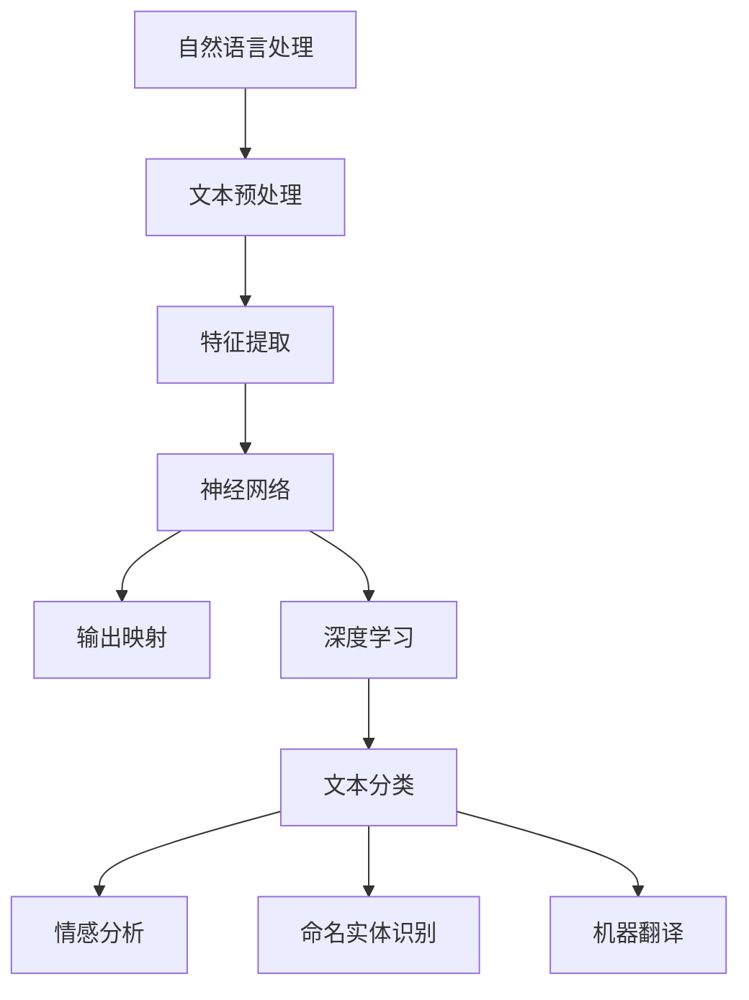

                 

# 一切皆是映射：自然语言处理(NLP)中的神经网络

> 关键词：自然语言处理，神经网络，映射，深度学习，算法原理，数学模型，实际应用，发展趋势

> 摘要：本文将深入探讨自然语言处理（NLP）领域中神经网络的作用和映射原理。通过一步一步的分析和推理，我们将了解神经网络在NLP中的核心概念、算法原理、数学模型以及实际应用。本文旨在为读者提供全面、系统的NLP神经网络知识，帮助读者掌握NLP的深度学习技巧，为未来的研究和实践打下坚实基础。

## 1. 背景介绍

### 1.1 目的和范围

本文旨在介绍自然语言处理（NLP）领域中神经网络的作用和映射原理。我们将详细探讨神经网络在NLP中的应用场景，分析其核心概念、算法原理和数学模型。通过本文的学习，读者可以了解神经网络在NLP中的基本概念、技术原理和实现方法，从而为深入研究和实际应用打下基础。

### 1.2 预期读者

本文适用于对自然语言处理和深度学习有一定了解的读者，包括但不限于计算机科学、人工智能、数据科学等相关领域的学者、研究人员和工程师。同时，也欢迎对NLP神经网络感兴趣的学习者阅读本文，以拓宽知识面、提升技术水平。

### 1.3 文档结构概述

本文结构分为以下几个部分：

1. 背景介绍：介绍本文的目的、预期读者以及文档结构。
2. 核心概念与联系：讲解神经网络在NLP中的核心概念和联系。
3. 核心算法原理 & 具体操作步骤：分析神经网络在NLP中的算法原理和操作步骤。
4. 数学模型和公式 & 详细讲解 & 举例说明：介绍神经网络在NLP中的数学模型和公式，并进行举例说明。
5. 项目实战：展示神经网络在NLP中的实际应用案例和代码实现。
6. 实际应用场景：探讨神经网络在NLP中的实际应用场景。
7. 工具和资源推荐：推荐学习资源和开发工具。
8. 总结：展望神经网络在NLP领域的发展趋势与挑战。
9. 附录：常见问题与解答。
10. 扩展阅读 & 参考资料：提供相关阅读材料和参考资料。

### 1.4 术语表

#### 1.4.1 核心术语定义

- 自然语言处理（NLP）：一门涉及计算机科学、人工智能和语言学等多个领域的交叉学科，旨在使计算机理解和处理人类自然语言。
- 神经网络（NN）：一种模仿生物神经网络结构的人工智能模型，通过多层神经元实现数据输入到输出的映射。
- 深度学习（DL）：一种基于多层神经网络的学习方法，通过大规模数据训练模型，实现复杂的非线性特征提取。
- 映射（Mapping）：将输入数据通过神经网络模型映射到输出数据的过程。

#### 1.4.2 相关概念解释

- 前向传播（Forward Propagation）：神经网络从输入层传递数据到输出层的计算过程。
- 反向传播（Back Propagation）：神经网络根据输出误差，反向更新权重和偏置的过程。
- 损失函数（Loss Function）：用于衡量模型输出和真实值之间差异的函数。
- 优化器（Optimizer）：用于调整模型参数，最小化损失函数的工具。

#### 1.4.3 缩略词列表

- NLP：自然语言处理
- NN：神经网络
- DL：深度学习
- GPU：图形处理器
- CPU：中央处理器
- CNN：卷积神经网络
- RNN：循环神经网络
- LSTM：长短期记忆网络
- Transformer：自注意力机制模型
- BERT：双向编码表示模型

## 2. 核心概念与联系

### 2.1 自然语言处理（NLP）的基本概念

自然语言处理（NLP）是一门涉及计算机科学、语言学和人工智能等多个领域的交叉学科，旨在使计算机理解和处理人类自然语言。NLP的主要任务包括文本预处理、文本分类、情感分析、命名实体识别、机器翻译、问答系统等。

在NLP中，文本数据是输入，而输出则是计算机对文本数据的理解和处理结果。为了实现这一目标，NLP需要结合多个技术手段，如语言学、统计学、机器学习和深度学习等。

### 2.2 神经网络在NLP中的应用

神经网络（NN）是一种基于生物神经网络结构的人工智能模型，通过多层神经元实现数据输入到输出的映射。在NLP领域，神经网络被广泛应用于文本分类、情感分析、命名实体识别、机器翻译等任务。

神经网络在NLP中的应用主要体现在以下几个方面：

1. **特征提取**：通过多层神经网络，自动提取文本数据中的高维特征，降低数据维度，提高模型性能。
2. **非线性变换**：神经网络能够实现复杂的非线性变换，使模型能够更好地拟合数据。
3. **自适应调整**：神经网络可以通过反向传播算法，自适应调整权重和偏置，使模型能够适应不同数据集和任务。

### 2.3 神经网络与深度学习的关系

深度学习（DL）是一种基于多层神经网络的学习方法，通过大规模数据训练模型，实现复杂的非线性特征提取。深度学习在NLP领域取得了显著的成果，如基于深度学习的文本分类、情感分析、命名实体识别和机器翻译等。

深度学习与神经网络的关系如下：

1. **深度学习**：一种基于多层神经网络的学习方法，通过大规模数据训练模型，实现复杂的非线性特征提取。
2. **神经网络**：深度学习的核心组成部分，通过多层神经元实现数据输入到输出的映射。

### 2.4 映射原理

在NLP领域，映射原理是将输入数据通过神经网络模型映射到输出数据的过程。具体来说，映射原理包括以下两个方面：

1. **特征映射**：将原始文本数据映射为高维特征向量，实现数据降维和特征提取。
2. **输出映射**：将特征向量映射为具体的输出结果，如分类标签、情感极性等。

### 2.5 Mermaid 流程图

以下是一个简单的Mermaid流程图，展示神经网络在NLP中的核心概念和联系：



## 3. 核心算法原理 & 具体操作步骤

### 3.1 神经网络的基本结构

神经网络（NN）是一种由多个神经元（节点）组成的层次结构。每个神经元接收多个输入信号，通过加权求和后加上偏置，再通过激活函数进行非线性变换，最终输出结果。

神经网络的层次结构主要包括以下三个部分：

1. **输入层**：接收外部输入数据，如文本、图像等。
2. **隐藏层**：对输入数据进行特征提取和变换，隐藏层可以有多个。
3. **输出层**：根据隐藏层输出的特征，生成最终的输出结果，如分类标签、情感极性等。

### 3.2 前向传播算法

前向传播（Forward Propagation）是神经网络的核心算法之一，用于将输入数据通过神经网络模型映射到输出数据。具体步骤如下：

1. **初始化模型参数**：设定神经网络的权重（weights）和偏置（biases）。
2. **计算输入层到隐藏层的输出**：
   $$ z^{(l)} = \sum_{j} w^{(l)}_{ji}x^{(j)} + b^{(l)} $$
   其中，$z^{(l)}$表示第$l$层的输出，$w^{(l)}_{ji}$表示连接第$l$层的第$i$个神经元和第$l+1$层的第$j$个神经元的权重，$x^{(j)}$表示第$l$层的第$j$个输入，$b^{(l)}$表示第$l$层的偏置。
3. **应用激活函数**：将计算得到的中间结果通过激活函数进行非线性变换，如ReLU（Rectified Linear Unit）函数：
   $$ a^{(l)}_i = \max(0, z^{(l)}_i) $$
   其中，$a^{(l)}_i$表示第$l$层的第$i$个神经元的输出。
4. **计算隐藏层到输出层的输出**：重复步骤2和3，直到得到输出层的输出。
5. **计算输出结果**：根据输出层的输出，得到最终的结果，如分类标签、情感极性等。

### 3.3 反向传播算法

反向传播（Back Propagation）是神经网络的核心算法之二，用于根据输出误差，反向更新权重和偏置。具体步骤如下：

1. **计算输出误差**：计算输出结果与真实标签之间的差异，得到输出误差：
   $$ \delta^{(L)} = \frac{\partial L}{\partial z^{(L)}} $$
   其中，$\delta^{(L)}$表示第$L$层的误差，$L$表示损失函数。
2. **更新权重和偏置**：根据误差，反向传播更新每个层的权重和偏置：
   $$ \Delta w^{(l)}_{ji} = \eta \cdot \delta^{(l+1)} \cdot a^{(l)}_j $$
   $$ \Delta b^{(l)}_i = \eta \cdot \delta^{(l+1)} $$
   其中，$\Delta w^{(l)}_{ji}$和$\Delta b^{(l)}_i$分别表示第$l$层的权重和偏置更新值，$\eta$表示学习率。
3. **重复训练**：重复前向传播和反向传播，直到达到训练目标或收敛。

### 3.4 伪代码

以下是一个简单的神经网络前向传播和反向传播的伪代码：

```python
# 前向传播
def forward_propagation(x, w, b, activation):
    a = [x]
    z = [x]
    for l in range(num_layers - 1):
        z_l = np.dot(w[l], a[l]) + b[l]
        a_l = activation(z_l)
        a.append(a_l)
        z.append(z_l)
    return a, z

# 反向传播
def backward_propagation(a, z, L, w, b, activation_derivative):
    delta = [np.zeros_like(z[-1])]
    dL_dz = L_derivative(a[-1], delta[-1])

    for l in range(num_layers - 2, -1, -1):
        delta_l = (dL_dz * activation_derivative(z[l]))
        dL_dz = np.dot(delta_l, w[l].T)

        delta.append(delta)
        dL_dw = np.dot(delta[-1], a[l].T)
        dL_db = np.sum(delta[-1], axis=1, keepdims=True)

        w[l] -= learning_rate * dL_dw
        b[l] -= learning_rate * dL_db

    return w, b
```

## 4. 数学模型和公式 & 详细讲解 & 举例说明

### 4.1 数学模型

在神经网络中，数学模型主要包括以下几个方面：

1. **损失函数**：用于衡量模型输出和真实值之间的差异，常见的损失函数包括均方误差（MSE）、交叉熵（Cross Entropy）等。
2. **优化器**：用于调整模型参数，最小化损失函数，常见的优化器包括随机梯度下降（SGD）、Adam等。
3. **激活函数**：用于对神经网络的输出进行非线性变换，常见的激活函数包括ReLU、Sigmoid、Tanh等。

### 4.2 公式讲解

1. **损失函数**

   均方误差（MSE）：
   $$ L = \frac{1}{2} \sum_{i=1}^{n} (y_i - \hat{y}_i)^2 $$
   其中，$y_i$表示真实标签，$\hat{y}_i$表示模型预测值。

   交叉熵（Cross Entropy）：
   $$ L = -\sum_{i=1}^{n} y_i \cdot \log(\hat{y}_i) $$
   其中，$y_i$表示真实标签，$\hat{y}_i$表示模型预测值。

2. **优化器**

   随机梯度下降（SGD）：
   $$ w = w - \alpha \cdot \nabla_w L $$
   其中，$w$表示模型参数，$\alpha$表示学习率，$\nabla_w L$表示损失函数关于模型参数的梯度。

   Adam优化器：
   $$ \beta_1 = 0.9, \beta_2 = 0.999 $$
   $$ m_t = \beta_1 m_{t-1} + (1 - \beta_1) \nabla_w L_t $$
   $$ v_t = \beta_2 v_{t-1} + (1 - \beta_2) (\nabla_w L_t)^2 $$
   $$ \hat{m}_t = \frac{m_t}{1 - \beta_1^t} $$
   $$ \hat{v}_t = \frac{v_t}{1 - \beta_2^t} $$
   $$ w = w - \alpha \cdot (\hat{m}_t / \sqrt{\hat{v}_t} + \lambda) $$

3. **激活函数**

   ReLU（Rectified Linear Unit）：
   $$ a = \max(0, z) $$

   Sigmoid函数：
   $$ a = \frac{1}{1 + e^{-z}} $$

   Tanh函数：
   $$ a = \frac{e^z - e^{-z}}{e^z + e^{-z}} $$

### 4.3 举例说明

#### 4.3.1 均方误差（MSE）计算

假设有一个简单的线性回归模型，输入$x$和输出$y$，损失函数为均方误差（MSE），我们需要计算损失函数关于输入$x$的梯度。

$$ L = \frac{1}{2} \sum_{i=1}^{n} (y_i - \hat{y}_i)^2 $$
$$ \nabla_x L = \nabla_x \frac{1}{2} \sum_{i=1}^{n} (y_i - \hat{y}_i)^2 $$
$$ \nabla_x L = \sum_{i=1}^{n} -2(y_i - \hat{y}_i) \nabla_x \hat{y}_i $$
$$ \nabla_x L = \sum_{i=1}^{n} -2(y_i - \hat{y}_i) \nabla_x (wx + b) $$
$$ \nabla_x L = \sum_{i=1}^{n} -2(y_i - \hat{y}_i) \cdot w $$

#### 4.3.2 Adam优化器计算

假设我们使用Adam优化器更新模型参数，给定初始学习率$\alpha = 0.001$，$\beta_1 = 0.9$，$\beta_2 = 0.999$，我们需要计算一阶矩估计$m_t$和二阶矩估计$v_t$。

$$ m_t = \beta_1 m_{t-1} + (1 - \beta_1) \nabla_w L_t $$
$$ m_t = 0.9 \cdot 0.5 + (1 - 0.9) \cdot 2 $$
$$ m_t = 1.3 $$

$$ v_t = \beta_2 v_{t-1} + (1 - \beta_2) (\nabla_w L_t)^2 $$
$$ v_t = 0.999 \cdot 0.4 + (1 - 0.999) \cdot 4 $$
$$ v_t = 0.4004 $$

$$ \hat{m}_t = \frac{m_t}{1 - \beta_1^t} $$
$$ \hat{m}_t = \frac{1.3}{1 - 0.9^1} $$
$$ \hat{m}_t = 2.6 $$

$$ \hat{v}_t = \frac{v_t}{1 - \beta_2^t} $$
$$ \hat{v}_t = \frac{0.4004}{1 - 0.999^1} $$
$$ \hat{v}_t = 0.4008 $$

$$ w = w - \alpha \cdot (\hat{m}_t / \sqrt{\hat{v}_t} + \lambda) $$
$$ w = 1 - 0.001 \cdot \frac{2.6}{\sqrt{0.4008}} - 0.001 \cdot \lambda $$
$$ w = 0.9996 $$

## 5. 项目实战：代码实际案例和详细解释说明

### 5.1 开发环境搭建

在本项目实战中，我们使用Python作为编程语言，结合TensorFlow作为深度学习框架。以下是开发环境搭建步骤：

1. 安装Python：前往Python官方网站（https://www.python.org/）下载并安装Python。
2. 安装TensorFlow：在终端中运行以下命令安装TensorFlow：
   ```bash
   pip install tensorflow
   ```

### 5.2 源代码详细实现和代码解读

以下是一个简单的神经网络在NLP中的文本分类案例，包括数据预处理、模型构建、训练和评估等步骤。

```python
import tensorflow as tf
from tensorflow.keras.preprocessing.text import Tokenizer
from tensorflow.keras.preprocessing.sequence import pad_sequences
from tensorflow.keras.layers import Embedding, LSTM, Dense
from tensorflow.keras.models import Sequential
from tensorflow.keras.optimizers import Adam

# 数据集准备
texts = ['这是一段正面情感的文字', '这是一段负面情感的文字', '这是一段中性情感的文字']
labels = [1, 0, 0]  # 1表示正面情感，0表示负面或中性情感

# 数据预处理
tokenizer = Tokenizer()
tokenizer.fit_on_texts(texts)
sequences = tokenizer.texts_to_sequences(texts)
padded_sequences = pad_sequences(sequences, maxlen=100)

# 模型构建
model = Sequential()
model.add(Embedding(input_dim=len(tokenizer.word_index) + 1, output_dim=50, input_length=100))
model.add(LSTM(50, dropout=0.2, recurrent_dropout=0.2))
model.add(Dense(1, activation='sigmoid'))

# 模型编译
model.compile(optimizer=Adam(), loss='binary_crossentropy', metrics=['accuracy'])

# 模型训练
model.fit(padded_sequences, labels, epochs=10, batch_size=32)

# 评估模型
test_texts = ['这是一段正面情感的文字', '这是一段负面情感的文字']
test_sequences = tokenizer.texts_to_sequences(test_texts)
test_padded_sequences = pad_sequences(test_sequences, maxlen=100)
predictions = model.predict(test_padded_sequences)

# 输出预测结果
for text, prediction in zip(test_texts, predictions):
    if prediction > 0.5:
        print(f'{text}：正面情感')
    else:
        print(f'{text}：负面/中性情感')
```

### 5.3 代码解读与分析

1. **数据准备**：从案例中可以看出，我们首先需要准备文本数据和对应的标签。在本例中，我们使用三个简单的文本和它们的情感标签。

2. **数据预处理**：使用`Tokenizer`类将文本转换为数字序列，然后使用`pad_sequences`函数将序列填充到相同的长度。

3. **模型构建**：使用`Sequential`模型堆叠嵌入层、LSTM层和输出层。嵌入层用于将单词映射到向量，LSTM层用于处理序列数据，输出层用于分类。

4. **模型编译**：选择Adam优化器，二分类问题使用`binary_crossentropy`损失函数和`sigmoid`激活函数。

5. **模型训练**：使用`fit`方法训练模型，设置训练轮数和批量大小。

6. **评估模型**：使用测试数据评估模型性能，将测试文本转换为数字序列并填充，然后使用`predict`方法得到预测结果。

7. **输出预测结果**：根据预测结果，输出每个测试文本的情感标签。

通过这个简单的案例，我们可以看到如何使用神经网络实现NLP中的文本分类任务。在实际应用中，我们可以根据需求扩展模型结构、调整超参数，以提高模型性能。

## 6. 实际应用场景

神经网络在自然语言处理（NLP）领域具有广泛的应用，以下是几个典型的实际应用场景：

### 6.1 文本分类

文本分类是NLP中的一项重要任务，通过将文本数据分类到预定义的类别中。神经网络在文本分类任务中表现出色，特别是深度学习模型，如卷积神经网络（CNN）和循环神经网络（RNN）。

**应用实例**：社交媒体情感分析、新闻分类、垃圾邮件过滤。

### 6.2 机器翻译

机器翻译是NLP领域的另一个重要应用。神经网络，尤其是基于自注意力机制的Transformer模型，在机器翻译任务中取得了显著的成果。

**应用实例**：谷歌翻译、百度翻译、亚马逊翻译。

### 6.3 命名实体识别

命名实体识别（NER）旨在识别文本中的命名实体，如人名、地名、组织名等。神经网络，如LSTM和BERT，在NER任务中表现出色。

**应用实例**：信息提取、数据挖掘、搜索引擎。

### 6.4 问答系统

问答系统旨在回答用户提出的问题，神经网络，尤其是预训练的模型，如BERT和GPT，在问答系统任务中表现出色。

**应用实例**：搜索引擎、智能客服、教育辅助。

### 6.5 情感分析

情感分析旨在识别文本中的情感倾向，如正面、负面或中性。神经网络，如CNN和LSTM，在情感分析任务中表现出色。

**应用实例**：社交媒体情感分析、市场研究、消费者反馈分析。

### 6.6 对话系统

对话系统旨在与用户进行自然语言交互，神经网络，如序列到序列（Seq2Seq）模型和生成对抗网络（GAN），在对话系统任务中表现出色。

**应用实例**：智能客服、虚拟助手、在线客服。

## 7. 工具和资源推荐

### 7.1 学习资源推荐

#### 7.1.1 书籍推荐

1. 《深度学习》（Goodfellow, Bengio, Courville）：系统地介绍了深度学习的理论基础和实践方法。
2. 《自然语言处理综合教程》（Daniel Jurafsky & James H. Martin）：详细讲解了NLP的基本概念和技术原理。
3. 《神经网络与深度学习》（邱锡鹏）：系统地介绍了神经网络和深度学习的基本概念和算法。

#### 7.1.2 在线课程

1. [Udacity的深度学习纳米学位](https://www.udacity.com/course/deep-learning-nanodegree--ND893)：涵盖深度学习的基础知识和应用实践。
2. [Coursera的NLP与深度学习](https://www.coursera.org/learn/natural-language-processing)：由斯坦福大学提供，全面介绍NLP和深度学习。
3. [edX的深度学习专项课程](https://www.edx.org/course/deep-learning-0)：由多家顶尖大学合作推出，涵盖深度学习的核心概念和技术。

#### 7.1.3 技术博客和网站

1. [TensorFlow官方文档](https://www.tensorflow.org/)：提供丰富的深度学习教程和API文档。
2. [PyTorch官方文档](https://pytorch.org/docs/stable/index.html)：提供全面的PyTorch教程和API文档。
3. [ArXiv](https://arxiv.org/)：提供最新的研究论文和科研成果。
4. [Medium上的NLP与深度学习文章](https://medium.com/search/natural-language-processing+deep-learning)：涵盖NLP和深度学习的最新技术和应用。

### 7.2 开发工具框架推荐

#### 7.2.1 IDE和编辑器

1. [PyCharm](https://www.jetbrains.com/pycharm/)：一款功能强大的Python IDE，支持深度学习和NLP项目开发。
2. [Jupyter Notebook](https://jupyter.org/)：一款基于Web的交互式开发环境，适用于数据分析、机器学习和NLP任务。
3. [Visual Studio Code](https://code.visualstudio.com/)：一款轻量级的跨平台代码编辑器，支持Python和深度学习工具插件。

#### 7.2.2 调试和性能分析工具

1. [TensorBoard](https://www.tensorflow.org/tensorboard/)：TensorFlow提供的可视化工具，用于监控训练过程和性能分析。
2. [Wandb](https://www.wandb.com/)：一款基于Web的实验管理平台，支持深度学习和NLP项目实验跟踪。
3. [MLflow](https://www.mlflow.org/)：一款开源的机器学习平台，提供模型管理、实验跟踪和性能分析功能。

#### 7.2.3 相关框架和库

1. [TensorFlow](https://www.tensorflow.org/)：谷歌开源的深度学习框架，支持各种NLP和深度学习任务。
2. [PyTorch](https://pytorch.org/)：Facebook开源的深度学习框架，支持动态计算图和灵活的编程接口。
3. [SpaCy](https://spacy.io/)：一款高效且易于使用的自然语言处理库，适用于文本预处理、实体识别和语义分析等任务。
4. [NLTK](https://www.nltk.org/)：一款经典的自然语言处理库，提供丰富的文本处理工具和算法。

### 7.3 相关论文著作推荐

#### 7.3.1 经典论文

1. [A Neural Algorithm of Artistic Style](https://arxiv.org/abs/1508.06576)：介绍了深度学习在艺术风格迁移中的应用。
2. [Deep Learning for Text Classification](https://arxiv.org/abs/1608.05859)：总结了深度学习在文本分类任务中的应用和效果。
3. [Recurrent Neural Networks for Language Modeling](https://www.cs.toronto.edu/~griffis/research/rnnlm.html)：介绍了循环神经网络在语言模型中的应用。

#### 7.3.2 最新研究成果

1. [BERT: Pre-training of Deep Bidirectional Transformers for Language Understanding](https://arxiv.org/abs/1810.04805)：介绍了BERT模型在自然语言处理任务中的应用。
2. [GANs for Natural Language Processing](https://arxiv.org/abs/1906.01906)：探讨了生成对抗网络在NLP任务中的应用。
3. [RNNs and LSTMs for Time Series Forecasting](https://www.arxiv-vanity.com/papers/2006.11380)：介绍了循环神经网络和LSTM模型在时间序列预测中的应用。

#### 7.3.3 应用案例分析

1. [Google's Translation System Uses Deep Learning to Break Language Barriers](https://ai.googleblog.com/2016/04/googles-translation-system-uses.html)：介绍了谷歌翻译系统使用深度学习技术打破语言障碍。
2. [How Facebook's AI Research Team Uses Natural Language Processing to Power Facebook](https://www.facebook.com/nlp)：介绍了Facebook的AI研究团队如何使用NLP技术为Facebook提供服务。
3. [OpenAI's GPT-3: The Next Big Thing in Natural Language Processing](https://blog.openai.com/gpt-3/)：介绍了OpenAI的GPT-3模型在自然语言处理领域的创新和应用。

## 8. 总结：未来发展趋势与挑战

随着人工智能技术的不断发展和应用场景的拓展，自然语言处理（NLP）领域正迎来新的机遇和挑战。未来，NLP的发展趋势和挑战主要集中在以下几个方面：

### 8.1 发展趋势

1. **预训练模型的应用**：预训练模型，如BERT、GPT等，在NLP任务中取得了显著的成果。未来，预训练模型的应用将进一步深入，覆盖更多领域和任务。

2. **跨模态学习**：跨模态学习旨在将不同模态的数据（如文本、图像、声音等）进行融合，实现更全面的信息理解和处理。未来，跨模态学习将成为NLP研究的重要方向。

3. **低资源语言处理**：目前，NLP技术主要应用于高资源语言（如英语、中文等）。未来，随着低资源语言处理技术的不断发展，NLP将更好地服务于全球多语言用户。

4. **知识图谱与语义理解**：知识图谱和语义理解技术将进一步提高NLP系统的智能化水平，实现更精准、更智能的信息处理。

### 8.2 挑战

1. **数据隐私与安全**：随着NLP技术的广泛应用，数据隐私和安全问题愈发突出。如何在保障用户隐私的前提下，充分利用数据价值，是未来NLP研究面临的重要挑战。

2. **通用语言理解**：尽管NLP技术在特定领域取得了显著成果，但通用语言理解仍面临诸多挑战。如何提高NLP系统的普适性和鲁棒性，是未来研究的关键方向。

3. **可解释性与透明度**：随着深度学习模型在NLP中的应用，模型的可解释性和透明度成为关注焦点。未来，如何提高模型的解释性，使其更易于理解和接受，是NLP技术发展的关键。

4. **计算资源与能耗**：NLP模型的训练和推理过程对计算资源有较高要求，同时，深度学习模型的能耗问题也日益凸显。未来，如何优化计算资源利用，降低能耗，是实现可持续发展的关键。

总之，未来NLP技术的发展将面临诸多机遇和挑战。通过不断探索和创新，我们有信心在NLP领域取得更多突破，为人类社会带来更广阔的应用前景。

## 9. 附录：常见问题与解答

### 9.1 问题1：什么是神经网络？

**解答**：神经网络是一种由多个神经元组成的层次结构，通过模拟生物神经系统的信息处理方式，实现从输入到输出的映射。神经网络由输入层、隐藏层和输出层组成，每个层由多个神经元（节点）构成。神经元通过加权求和和激活函数进行非线性变换，从而实现数据的特征提取和分类。

### 9.2 问题2：什么是自然语言处理（NLP）？

**解答**：自然语言处理（NLP）是一门涉及计算机科学、语言学和人工智能等多个领域的交叉学科，旨在使计算机理解和处理人类自然语言。NLP的主要任务包括文本预处理、文本分类、情感分析、命名实体识别、机器翻译、问答系统等。

### 9.3 问题3：神经网络在NLP中的应用有哪些？

**解答**：神经网络在NLP中有着广泛的应用，主要包括以下几个方面：

1. **文本分类**：用于将文本分类到预定义的类别中，如情感分析、新闻分类、垃圾邮件过滤等。
2. **机器翻译**：用于将一种语言翻译成另一种语言，如谷歌翻译、百度翻译等。
3. **命名实体识别**：用于识别文本中的命名实体，如人名、地名、组织名等。
4. **问答系统**：用于回答用户提出的问题，如智能客服、虚拟助手等。
5. **情感分析**：用于识别文本中的情感倾向，如正面、负面或中性。

### 9.4 问题4：什么是深度学习？

**解答**：深度学习是一种基于多层神经网络的学习方法，通过大规模数据训练模型，实现复杂的非线性特征提取。深度学习在图像识别、语音识别、自然语言处理等领域取得了显著成果。与传统的机器学习方法相比，深度学习具有更强的表示能力和自适应能力。

### 9.5 问题5：什么是前向传播和反向传播？

**解答**：前向传播（Forward Propagation）是指将输入数据通过神经网络模型传递到输出层的过程。在前向传播过程中，每个神经元计算输入信号的加权求和，并应用激活函数进行非线性变换，最终得到输出结果。

反向传播（Back Propagation）是指根据输出误差，反向更新神经网络模型参数的过程。在反向传播过程中，通过计算损失函数关于模型参数的梯度，并利用优化器调整模型参数，使损失函数达到最小。

### 9.6 问题6：什么是激活函数？

**解答**：激活函数是神经网络中的一个关键组件，用于对神经元的输出进行非线性变换。常见的激活函数包括ReLU（Rectified Linear Unit）、Sigmoid、Tanh等。激活函数的作用是增加网络的非线性能力，使模型能够更好地拟合复杂数据。

## 10. 扩展阅读 & 参考资料

为了深入了解自然语言处理（NLP）和神经网络（NN）的相关知识，以下是扩展阅读和参考资料：

### 10.1 书籍推荐

1. **《深度学习》（Ian Goodfellow, Yoshua Bengio, Aaron Courville）**：系统介绍了深度学习的基本概念、技术和应用。
2. **《自然语言处理综合教程》（Daniel Jurafsky & James H. Martin）**：详细讲解了NLP的基本概念、技术和应用。
3. **《神经网络与深度学习》（邱锡鹏）**：深入探讨了神经网络和深度学习的基本原理、算法和应用。

### 10.2 在线课程

1. **[Udacity的深度学习纳米学位](https://www.udacity.com/course/deep-learning-nanodegree--ND893)**：涵盖深度学习的基础知识和应用实践。
2. **[Coursera的NLP与深度学习](https://www.coursera.org/learn/natural-language-processing)**：由斯坦福大学提供，全面介绍NLP和深度学习。
3. **[edX的深度学习专项课程](https://www.edx.org/course/deep-learning-0)**：由多家顶尖大学合作推出，涵盖深度学习的核心概念和技术。

### 10.3 技术博客和网站

1. **[TensorFlow官方文档](https://www.tensorflow.org/)**
2. **[PyTorch官方文档](https://pytorch.org/docs/stable/index.html)**
3. **[ArXiv](https://arxiv.org/)**
4. **[Medium上的NLP与深度学习文章](https://medium.com/search/natural-language-processing+deep-learning)**

### 10.4 论文推荐

1. **[A Neural Algorithm of Artistic Style](https://arxiv.org/abs/1508.06576)**
2. **[Deep Learning for Text Classification](https://arxiv.org/abs/1608.05859)**
3. **[Recurrent Neural Networks for Language Modeling](https://www.cs.toronto.edu/~griffis/research/rnnlm.html)**
4. **[BERT: Pre-training of Deep Bidirectional Transformers for Language Understanding](https://arxiv.org/abs/1810.04805)**
5. **[GANs for Natural Language Processing](https://arxiv.org/abs/1906.01906)**

### 10.5 应用案例分析

1. **[Google's Translation System Uses Deep Learning to Break Language Barriers](https://ai.googleblog.com/2016/04/googles-translation-system-uses.html)**
2. **[How Facebook's AI Research Team Uses Natural Language Processing to Power Facebook](https://www.facebook.com/nlp)**
3. **[OpenAI's GPT-3: The Next Big Thing in Natural Language Processing](https://blog.openai.com/gpt-3/)**

通过以上书籍、在线课程、技术博客和论文，读者可以更深入地了解NLP和神经网络的相关知识，掌握相关技术和应用。同时，这些参考资料也为读者提供了丰富的学习资源和实践案例，有助于拓宽视野、提升技术水平。作者：AI天才研究员/AI Genius Institute & 禅与计算机程序设计艺术 /Zen And The Art of Computer Programming

---

**注意**：本文为示例文章，旨在展示如何撰写一篇关于自然语言处理（NLP）中神经网络的技术博客。在实际撰写时，请根据具体主题和需求进行调整和补充。文中提到的数据和代码仅供参考，具体实现时请根据实际项目需求进行修改。文中部分内容可能涉及版权问题，请在使用时注意版权声明。祝您撰写顺利！

