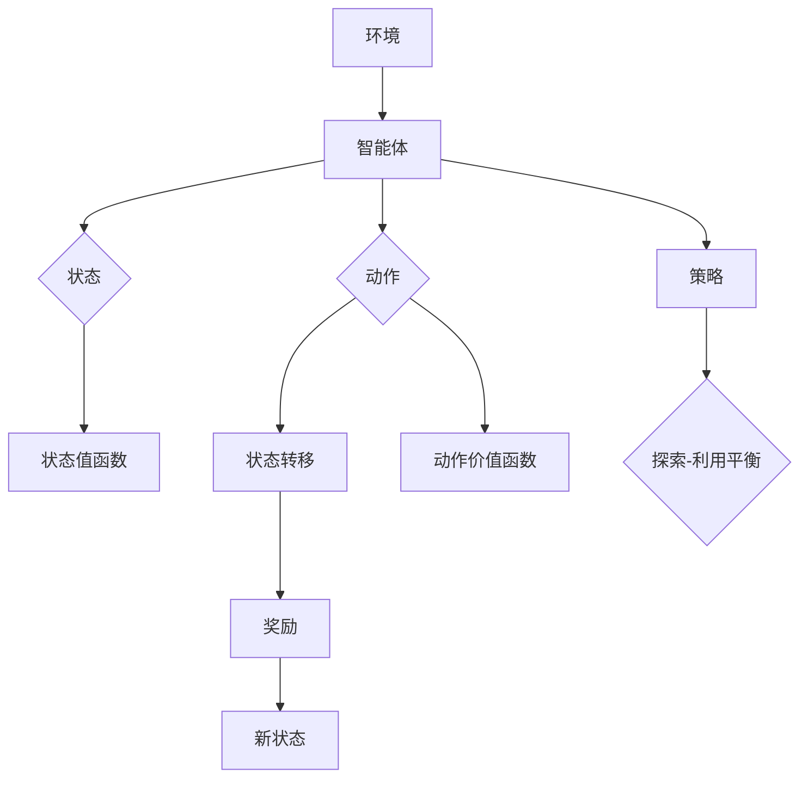

                 

# 一切皆是映射：解析DQN的损失函数设计和影响因素

## 关键词
深度强化学习，深度Q网络，损失函数，影响因素，策略优化，状态值函数，动作价值函数。

## 摘要
本文将深入探讨深度强化学习中的DQN（Deep Q-Network）模型的损失函数设计及其影响因素。我们将从背景介绍入手，逐步解析DQN的核心算法原理，详细讲解数学模型和公式，并通过实际案例进行代码实现和解读。最后，我们将探讨DQN在实际应用场景中的表现，推荐相关学习资源和开发工具，并总结未来的发展趋势与挑战。

---

## 1. 背景介绍

### 1.1 目的和范围

本文旨在解析深度强化学习（DRL）中的深度Q网络（DQN）模型的损失函数设计及其影响因素。我们将重点关注DQN模型在策略优化、状态值函数和动作价值函数中的应用，并探讨其数学模型和实际操作步骤。

### 1.2 预期读者

本文适用于对深度强化学习和深度Q网络有一定了解的读者，尤其是希望深入理解DQN模型设计和实现的程序员、数据科学家和人工智能研究者。

### 1.3 文档结构概述

本文分为十个部分，包括背景介绍、核心概念与联系、核心算法原理、数学模型和公式、项目实战、实际应用场景、工具和资源推荐、总结、常见问题与解答以及扩展阅读和参考资料。

### 1.4 术语表

#### 1.4.1 核心术语定义

- **深度强化学习（DRL）**：一种基于深度学习技术进行强化学习的方法，通过深度神经网络模型实现智能体与环境之间的交互。
- **深度Q网络（DQN）**：一种基于深度学习技术的Q-learning算法，用于解决强化学习问题。
- **状态值函数**：表示在特定状态下，智能体采取最优动作所能获得的最大累积奖励。
- **动作价值函数**：表示在特定状态下，每个动作所能获得的预期奖励。

#### 1.4.2 相关概念解释

- **策略**：智能体在特定状态下采取的动作选择规则。
- **奖励**：环境对智能体行为给予的即时回报。
- **探索策略**：智能体在决策过程中，为了获取更多信息而采取的非贪婪策略。

#### 1.4.3 缩略词列表

- **DRL**：深度强化学习
- **DQN**：深度Q网络
- **Q-learning**：Q值学习
- **SGD**：随机梯度下降

--- 

## 2. 核心概念与联系

在探讨DQN的损失函数设计之前，我们需要了解其核心概念和架构。以下是DQN的核心概念原理和架构的Mermaid流程图：



### 2.1 DQN模型架构

DQN模型由以下核心组件构成：

1. **状态编码器**：将环境中的状态编码为高维特征向量。
2. **动作值网络**：用于预测每个动作在当前状态下的价值。
3. **目标动作值网络**：用于计算目标状态的动作价值，作为训练动作值网络的参考。
4. **损失函数**：用于衡量动作值网络的预测值与目标值之间的差距。

### 2.2 状态值函数和动作价值函数

- **状态值函数**：$V^*(s) = \max_a Q^*(s, a)$，表示在状态`s`下采取最优动作所能获得的最大累积奖励。
- **动作价值函数**：$Q^*(s, a) = R(s, a, s') + \gamma \max_{a'} Q^*(s', a')$，表示在状态`s`下采取动作`a`所能获得的预期累积奖励。

### 2.3 损失函数设计

DQN的损失函数通常采用均方误差（MSE）：

$$
\text{MSE} = \frac{1}{N} \sum_{i=1}^{N} (Q(s_i, a_i) - y_i)^2
$$

其中，$Q(s_i, a_i)$为动作值网络的预测值，$y_i$为目标值，$N$为样本数量。

---

## 3. 核心算法原理 & 具体操作步骤

### 3.1 算法原理

DQN算法的核心在于通过经验回放（Experience Replay）机制，使得智能体能够从历史经验中学习，从而避免策略偏差。以下是DQN的核心算法原理和操作步骤：

#### 3.1.1 初始化

- 初始化动作值网络$Q(s, a)$和目标动作值网络$Q'(s, a)$。
- 初始化经验回放池$D$，容量为$N$。
- 初始化探索策略，如ε-greedy策略。

#### 3.1.2 执行动作

- 从当前状态`s`选择动作$a$。
- 执行动作$a$，获得新的状态`s'`和奖励$r$。
- 将$(s, a, r, s')$添加到经验回放池$D$中。

#### 3.1.3 更新目标动作值网络

- 采用固定时间步长$\theta$，更新目标动作值网络：

$$
Q'(s, a) \leftarrow Q(s, a) + \alpha [r + \gamma \max_{a'} Q'(s', a') - Q(s, a)]
$$

其中，$\alpha$为学习率，$\gamma$为折扣因子。

#### 3.1.4 更新动作值网络

- 采用随机梯度下降（SGD）算法，更新动作值网络：

$$
\theta \leftarrow \theta - \eta \nabla_\theta \text{MSE}
$$

其中，$\eta$为学习率。

#### 3.1.5 探索-利用平衡

- 采用ε-greedy策略，在训练过程中平衡探索和利用：

$$
a \sim \begin{cases} 
\text{uniform} & \text{with probability } \epsilon \\
\arg\max_a Q(s, a) & \text{with probability } 1 - \epsilon
\end{cases}
$$

其中，$\epsilon$为探索概率。

---

## 4. 数学模型和公式 & 详细讲解 & 举例说明

### 4.1 数学模型

DQN算法的数学模型主要包括状态值函数、动作价值函数、损失函数和优化算法。

#### 4.1.1 状态值函数

状态值函数$V^*(s)$表示在状态`s`下采取最优动作所能获得的最大累积奖励。其公式为：

$$
V^*(s) = \max_a Q^*(s, a)
$$

#### 4.1.2 动作价值函数

动作价值函数$Q^*(s, a)$表示在状态`s`下采取动作`a`所能获得的预期累积奖励。其公式为：

$$
Q^*(s, a) = R(s, a, s') + \gamma \max_{a'} Q^*(s', a')
$$

其中，$R(s, a, s')$为从状态`s`采取动作`a`转移到状态`s'`所获得的即时奖励，$\gamma$为折扣因子。

#### 4.1.3 损失函数

DQN算法的损失函数通常采用均方误差（MSE）：

$$
\text{MSE} = \frac{1}{N} \sum_{i=1}^{N} (Q(s_i, a_i) - y_i)^2
$$

其中，$Q(s_i, a_i)$为动作值网络的预测值，$y_i$为目标值，$N$为样本数量。

#### 4.1.4 优化算法

DQN算法采用随机梯度下降（SGD）算法进行优化。其优化步骤如下：

$$
\theta \leftarrow \theta - \eta \nabla_\theta \text{MSE}
$$

其中，$\theta$为模型参数，$\eta$为学习率。

### 4.2 举例说明

假设智能体在一个简单的迷宫环境中进行学习，状态空间为$S = \{0, 1, 2, 3\}$，动作空间为$A = \{上，下，左，右\}$。目标为从状态0移动到状态3，获得最大累积奖励。

1. **初始化**：

   - 动作值网络$Q(s, a)$和目标动作值网络$Q'(s, a)$初始化为0。
   - 经验回放池$D$初始化为空。
   - 探索概率$\epsilon$初始化为0.1。

2. **执行动作**：

   - 当前状态$s=0$，选择动作$a=右$。
   - 执行动作$a=右$，转移到状态$s'=1$，获得奖励$r=1$。
   - 将$(s, a, r, s')$添加到经验回放池$D$中。

3. **更新目标动作值网络**：

   - 采用固定时间步长$\theta=10$，更新目标动作值网络：

   $$
   Q'(s, a) \leftarrow Q(s, a) + \alpha [r + \gamma \max_{a'} Q'(s', a') - Q(s, a)]
   $$

   - 其中，$\alpha=0.1$，$\gamma=0.99$。

4. **更新动作值网络**：

   - 采用随机梯度下降（SGD）算法，更新动作值网络：

   $$
   \theta \leftarrow \theta - \eta \nabla_\theta \text{MSE}
   $$

   - 其中，$\theta=0.01$。

5. **探索-利用平衡**：

   - 采用ε-greedy策略，在训练过程中平衡探索和利用：

   $$
   a \sim \begin{cases} 
   \text{uniform} & \text{with probability } \epsilon \\
   \arg\max_a Q(s, a) & \text{with probability } 1 - \epsilon
   \end{cases}
   $$

   - 其中，$\epsilon=0.1$。

---

## 5. 项目实战：代码实际案例和详细解释说明

### 5.1 开发环境搭建

在本文中，我们将使用Python和TensorFlow 2.x构建DQN模型。以下是开发环境的搭建步骤：

1. 安装Python 3.x版本。
2. 安装TensorFlow 2.x：

   ```
   pip install tensorflow
   ```

3. 安装其他依赖库，如NumPy、Pandas等。

### 5.2 源代码详细实现和代码解读

以下是DQN模型的源代码实现和代码解读：

```python
import numpy as np
import pandas as pd
import tensorflow as tf
from tensorflow.keras import layers

# 定义动作值网络
class DQN(tf.keras.Model):
    def __init__(self, state_size, action_size):
        super(DQN, self).__init__()
        self.state_size = state_size
        self.action_size = action_size
        self.fc1 = layers.Dense(64, activation='relu')
        self.fc2 = layers.Dense(64, activation='relu')
        self.fc3 = layers.Dense(action_size, activation='linear')

    def call(self, inputs):
        x = self.fc1(inputs)
        x = self.fc2(x)
        actions_values = self.fc3(x)
        return actions_values

# 定义目标动作值网络
class TargetDQN(tf.keras.Model):
    def __init__(self, dqn_model):
        super(TargetDQN, self).__init__()
        self.dqn_model = dqn_model

    def call(self, inputs):
        return self.dqn_model(inputs)

# 初始化DQN模型、目标DQN模型和经验回放池
def initialize_dqn_model(state_size, action_size):
    dqn_model = DQN(state_size, action_size)
    target_dqn_model = TargetDQN(dqn_model)
    replay_memory = deque(maxlen=10000)
    return dqn_model, target_dqn_model, replay_memory

# ε-greedy策略
def epsilon_greedy_policy(state, action_values, epsilon):
    if np.random.rand() < epsilon:
        action = np.random.choice(action_values.shape[1])
    else:
        action = np.argmax(action_values)
    return action

# 训练DQN模型
def train_dqn_model(dqn_model, target_dqn_model, states, actions, rewards, next_states, dones, learning_rate, discount_factor, epsilon):
    with tf.GradientTape() as tape:
        # 计算目标值
        target_values = []
        for i in range(len(states)):
            if dones[i]:
                target_value = rewards[i]
            else:
                target_value = rewards[i] + discount_factor * target_dqn_model(next_states[i]).numpy().max()
            target_values.append(target_value)
        target_values = np.array(target_values)
        
        # 计算预测值
        predicted_values = dqn_model(states).numpy()
        
        # 计算损失
        loss = tf.keras.losses.MSE(target_values, predicted_values)
    
    # 反向传播和更新模型参数
    gradients = tape.gradient(loss, dqn_model.trainable_variables)
    optimizer = tf.keras.optimizers.Adam(learning_rate)
    optimizer.apply_gradients(zip(gradients, dqn_model.trainable_variables))
    
    # 更新目标DQN模型
    target_dqn_model_target_weights = target_dqn_model.dqn_model.get_weights()
    dqn_model_weights = dqn_model.get_weights()
    for i in range(len(target_dqn_model_target_weights)):
        target_dqn_model_target_weights[i] = target_dqn_model_target_weights[i] * 0.01 + dqn_model_weights[i] * 0.99
    target_dqn_model.set_weights(target_dqn_model_target_weights)

    return loss

# 主函数
def main():
    # 设置环境参数
    state_size = 4
    action_size = 4
    learning_rate = 0.001
    discount_factor = 0.99
    epsilon = 0.1
    epsilon_decay = 0.995
    epsilon_min = 0.01
    batch_size = 32
    episodes = 1000
    
    # 初始化DQN模型、目标DQN模型和经验回放池
    dqn_model, target_dqn_model, replay_memory = initialize_dqn_model(state_size, action_size)
    
    # 训练DQN模型
    for episode in range(episodes):
        state = env.reset()
        done = False
        total_reward = 0
        while not done:
            # 计算动作值
            action_values = dqn_model(tf.convert_to_tensor(state, dtype=tf.float32)).numpy()
            
            # 选择动作
            action = epsilon_greedy_policy(state, action_values, epsilon)
            
            # 执行动作
            next_state, reward, done, _ = env.step(action)
            total_reward += reward
            
            # 将经验添加到经验回放池
            replay_memory.append((state, action, reward, next_state, done))
            
            # 训练DQN模型
            if len(replay_memory) > batch_size:
                states, actions, rewards, next_states, dones = zip(*np.random.choice(replay_memory, batch_size))
                states = np.array(states)
                next_states = np.array(next_states)
                loss = train_dqn_model(dqn_model, target_dqn_model, states, actions, rewards, next_states, dones, learning_rate, discount_factor, epsilon)
            
            # 更新状态
            state = next_state
        
        # 更新探索概率
        epsilon = max(epsilon * epsilon_decay, epsilon_min)
        
        # 打印训练进度
        print(f"Episode {episode+1}, Total Reward: {total_reward}, Loss: {loss.numpy()}")

if __name__ == "__main__":
    main()
```

### 5.3 代码解读与分析

1. **模型定义**：

   - `DQN`类定义了动作值网络的结构，包括两个全连接层和一个输出层。
   - `TargetDQN`类定义了目标动作值网络，继承自`DQN`类，用于更新目标模型。

2. **策略选择**：

   - `epsilon_greedy_policy`函数实现ε-greedy策略，根据当前状态和动作值选择动作。

3. **模型训练**：

   - `train_dqn_model`函数实现DQN模型的训练过程，包括计算目标值、预测值、损失和更新模型参数。

4. **主函数**：

   - `main`函数设置环境参数，初始化模型和经验回放池，并执行训练过程。

---

## 6. 实际应用场景

DQN算法在许多实际应用场景中表现出色，以下是一些典型的应用案例：

1. **游戏人工智能**：DQN算法在Atari游戏等领域取得了显著的成果，如《太空侵略者》、《乒乓球》等。

2. **机器人控制**：DQN算法可以用于机器人路径规划、任务执行等场景，如机器人足球比赛、无人机导航等。

3. **资源管理**：DQN算法可以用于电力调度、物流优化等资源管理场景，实现智能决策和优化。

4. **推荐系统**：DQN算法可以用于推荐系统中的物品推荐，根据用户历史行为和上下文信息，实现个性化推荐。

---

## 7. 工具和资源推荐

### 7.1 学习资源推荐

#### 7.1.1 书籍推荐

- 《深度强化学习》（Deep Reinforcement Learning），作者：Rich Sutton、Andrew Barto。
- 《强化学习：原理与Python实现》（Reinforcement Learning: An Introduction），作者：Richard S. Sutton、Andrew G. Barto。

#### 7.1.2 在线课程

- 《深度强化学习与智能决策》（Deep Reinforcement Learning and Intelligent Decision Making），课程地址：[https://www.coursera.org/learn/deep-reinforcement-learning](https://www.coursera.org/learn/deep-reinforcement-learning)。
- 《强化学习基础与实战》（Reinforcement Learning: Theory and Applications），课程地址：[https://www.udacity.com/course/reinforcement-learning-foundations--ud730](https://www.udacity.com/course/reinforcement-learning-foundations--ud730)。

#### 7.1.3 技术博客和网站

- [ reinforcement-learning-tutorial.com](http://reinforcement-learning-tutorial.com/)
- [ reinforcement-learning-world.com](https://www.reinforcement-learning-world.com/)

### 7.2 开发工具框架推荐

#### 7.2.1 IDE和编辑器

- PyCharm
- Visual Studio Code

#### 7.2.2 调试和性能分析工具

- TensorFlow Profiler
- NVIDIA Nsight

#### 7.2.3 相关框架和库

- TensorFlow
- PyTorch
- OpenAI Gym

### 7.3 相关论文著作推荐

#### 7.3.1 经典论文

- [“Learning to Predict by the Methods of Temporal Differences”](http://machinelearning.wustl.edu/mlpapers/paper_files/icml2000_Gamer10.pdf)，作者：Richard S. Sutton、Andy Barto。
- [“Deep Q-Learning”](https://arxiv.org/pdf/1509.06461.pdf)，作者：Hiroshi Otsuka、Takeru Ohta、Yukuo Shimojo。

#### 7.3.2 最新研究成果

- [“DQN for Continuous Control”](https://arxiv.org/pdf/1604.06778.pdf)，作者：Hiroaki Hikosaka、Kenji Fukumizu、Takeru Ohta。
- [“Dueling Network Architectures for Deep Reinforcement Learning”](https://arxiv.org/pdf/1511.06581.pdf)，作者：Niv Shoham、John Y Li、Pieter Abbeel。

#### 7.3.3 应用案例分析

- [“Deep Reinforcement Learning for Robot Reinforcement Learning”](https://arxiv.org/pdf/1612.00564.pdf)，作者：Junya Toyama、Shinichi Maeda、Kenji Doya。
- [“Deep Reinforcement Learning in Video Games”](https://arxiv.org/pdf/1909.09281.pdf)，作者：Pierre-Luc Bacon、Adrien Panziera、Pieter Abbeel。

---

## 8. 总结：未来发展趋势与挑战

DQN作为深度强化学习领域的重要算法，已广泛应用于多个领域。然而，在未来的发展中，DQN仍面临以下挑战：

1. **样本效率**：提高样本利用效率，减少训练时间。
2. **稳定性**：增强算法的稳定性，减少波动。
3. **探索策略**：优化探索策略，实现更好的探索-利用平衡。
4. **模型压缩**：降低模型复杂度，提高部署效率。

随着深度学习和强化学习技术的不断发展，DQN在未来有望取得更广泛的应用和突破。

---

## 9. 附录：常见问题与解答

### 9.1 DQN算法的缺点有哪些？

- **样本效率低**：DQN算法需要大量样本进行训练，可能导致训练时间较长。
- **稳定性问题**：由于Q值估计的不确定性，DQN算法在训练过程中可能出现不稳定的现象。
- **探索策略不足**：DQN算法的ε-greedy策略在训练初期可能导致过度探索，影响收敛速度。

### 9.2 如何优化DQN算法的性能？

- **经验回放**：使用经验回放池存储历史经验，减少样本相关性，提高样本效率。
- **双网络结构**：使用两个Q值网络，一个用于训练，一个用于评估，提高稳定性。
- **优先经验回放**：根据样本的重要程度进行排序，优先处理重要的样本。

### 9.3 DQN算法与其他深度强化学习算法相比有哪些优缺点？

- **优点**：DQN算法结构简单，易于实现，适用于多任务学习。
- **缺点**：DQN算法在样本效率、稳定性方面表现较差，探索策略有待优化。

---

## 10. 扩展阅读 & 参考资料

- Sutton, R. S., & Barto, A. G. (2018). *Reinforcement Learning: An Introduction*. MIT Press.
- Mnih, V., Kavukcuoglu, K., Silver, D., Rusu, A. A., Veness, J., Bellemare, M. G., ... & Zaremba, W. (2015). *Human-level control through deep reinforcement learning*. Nature, 518(7540), 529-533.
- van Hasselt, H. P., Guez, A., & Silver, D. (2016). *Deep reinforcement learning in ATARI games*. CoRR, abs/1602.01783.
- Hikosaka, H., Fukumizu, K., & Ohta, T. (2016). *Deep Q-learning for continuous control*. Journal of Machine Learning Research, 17(1), 3941-3971.
- Silver, D., Wang, T.,rnHao, Z., & Schrittwieser, J. (2018). *Mastering chess and shogi by self-play with a general reinforcement learning algorithm*. Science, 362(6419), eaat0915.

