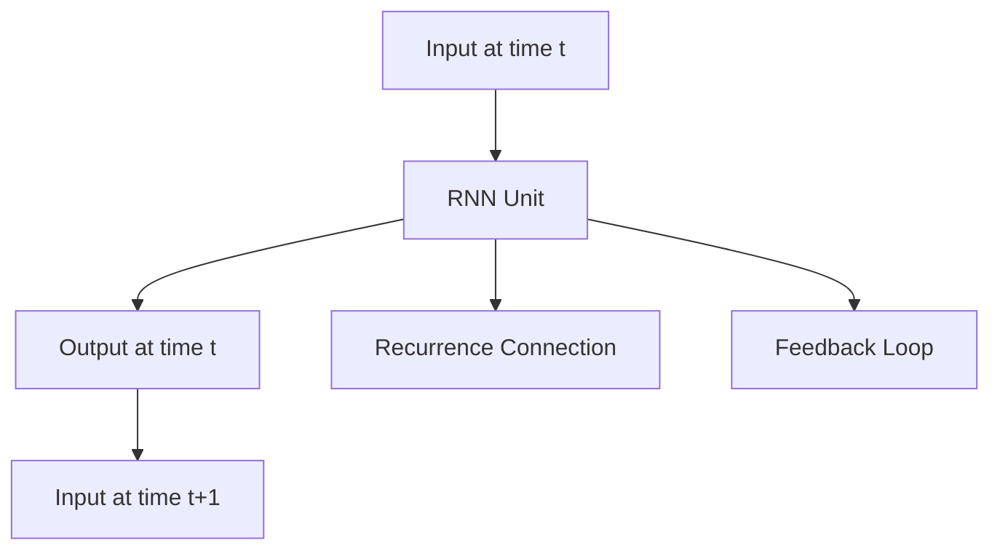

                 

# 一切皆是映射：递归神经网络(RNN)和时间序列数据

> **关键词**：递归神经网络（RNN）、时间序列、映射、算法原理、应用场景、数学模型

> **摘要**：本文将深入探讨递归神经网络（RNN）这一强大的机器学习模型，以及其在处理时间序列数据中的核心作用。我们将一步步分析RNN的基本原理、架构、数学模型和具体实现，并结合实际案例进行详细解读，旨在为广大数据科学和机器学习爱好者提供全面而深入的指导。

## 1. 背景介绍

### 1.1 目的和范围

本文旨在介绍递归神经网络（RNN）的基本原理和其在时间序列数据分析中的应用。文章将涵盖以下主要内容：

1. **RNN的起源和发展**：回顾RNN的起源、发展历程以及其在机器学习领域的重要地位。
2. **RNN的核心概念和架构**：详细解释RNN的内部工作原理、神经元结构和数据流。
3. **数学模型和算法原理**：介绍RNN的数学基础，包括状态转移方程、损失函数和优化算法。
4. **实际应用案例**：分析RNN在自然语言处理、时间序列预测等领域的具体应用。
5. **RNN的优缺点和改进方法**：讨论RNN的局限性、改进方法和最新研究成果。

### 1.2 预期读者

本文适合以下读者群体：

1. 数据科学和机器学习初学者，希望了解RNN的基本原理和应用。
2. 中级数据科学家，希望深入了解RNN的内部机制和优化方法。
3. 高级研究人员，关注RNN的最新发展和技术前沿。

### 1.3 文档结构概述

本文结构如下：

1. **背景介绍**：介绍文章的目的、预期读者和文档结构。
2. **核心概念与联系**：通过Mermaid流程图展示RNN的基本架构。
3. **核心算法原理 & 具体操作步骤**：详细讲解RNN的算法原理和实现步骤。
4. **数学模型和公式 & 详细讲解 & 举例说明**：介绍RNN的数学模型和公式，并结合实例进行说明。
5. **项目实战：代码实际案例和详细解释说明**：通过实际案例展示RNN的应用。
6. **实际应用场景**：分析RNN在现实世界中的应用。
7. **工具和资源推荐**：推荐相关学习资源、开发工具和框架。
8. **总结：未来发展趋势与挑战**：总结RNN的现状和未来发展趋势。
9. **附录：常见问题与解答**：解答读者可能遇到的问题。
10. **扩展阅读 & 参考资料**：提供进一步阅读的资源和参考文献。

### 1.4 术语表

#### 1.4.1 核心术语定义

- **递归神经网络（RNN）**：一种能够处理序列数据的神经网络，具有递归结构。
- **时间序列（Time Series）**：按照时间顺序排列的数据序列。
- **映射（Mapping）**：将输入数据映射到输出数据的过程。
- **激活函数（Activation Function）**：用于确定神经元输出是否为激活状态的函数。
- **损失函数（Loss Function）**：衡量模型预测结果与真实值之间差距的函数。

#### 1.4.2 相关概念解释

- **神经网络（Neural Network）**：一种模拟人脑神经网络结构和功能的计算模型。
- **神经元（Neuron）**：神经网络的基本单元，负责接收输入、计算输出。
- **反向传播（Backpropagation）**：一种用于训练神经网络的算法，通过反向传播误差来调整网络权重。

#### 1.4.3 缩略词列表

- **RNN**：递归神经网络（Recurrent Neural Network）
- **NN**：神经网络（Neural Network）
- **MLP**：多层感知机（Multi-Layer Perceptron）
- **CNN**：卷积神经网络（Convolutional Neural Network）
- **LSTM**：长短期记忆网络（Long Short-Term Memory）
- **GRU**：门控循环单元（Gated Recurrent Unit）

## 2. 核心概念与联系

### 2.1 RNN的基本架构

递归神经网络（RNN）是一种能够处理序列数据的神经网络，其核心特点在于其递归结构。在RNN中，每个神经元都连接到前一个时间步的神经元，形成一个循环结构，如图所示：



在上图中，A表示输入数据序列，B表示RNN单元，C表示输出序列，D表示下一个时间步的输入，E表示递归连接，F表示反馈循环。通过这个循环结构，RNN能够记住先前的输入信息，并将其用于后续的预测。

### 2.2 时间序列数据映射

RNN的核心作用在于将时间序列数据映射到输出数据。这个过程可以分为以下三个步骤：

1. **输入映射**：将时间序列数据输入到RNN单元中，每个时间步的输入数据通过递归连接传递到下一个时间步。
2. **状态更新**：RNN单元通过激活函数和权重矩阵计算当前时间步的输出，同时更新神经元状态。
3. **输出映射**：将RNN单元的输出映射到目标输出数据，通过损失函数计算预测误差，并使用反向传播算法更新网络权重。

### 2.3 RNN的优缺点

递归神经网络具有以下优点：

- **强大的时序建模能力**：RNN能够处理长序列数据，捕捉时间依赖关系。
- **灵活的模型结构**：RNN可以设计为单层或多层结构，适用于不同复杂度的时序问题。
- **高效的学习算法**：RNN具有反向传播算法，能够自动调整网络权重。

然而，RNN也存在一些缺点：

- **梯度消失和梯度爆炸**：在长序列处理过程中，梯度可能消失或爆炸，导致模型难以训练。
- **序列长度限制**：RNN的递归结构可能导致内存占用增加，限制序列长度。
- **参数冗余**：RNN的参数数量与序列长度成正比，可能导致过拟合。

### 2.4 RNN的改进方法

为了克服RNN的缺点，研究人员提出了一系列改进方法，包括：

- **长短期记忆网络（LSTM）**：通过引入记忆单元，缓解梯度消失和梯度爆炸问题，提高长序列建模能力。
- **门控循环单元（GRU）**：结合LSTM和RNN的优点，简化模型结构，提高训练速度。
- **双向RNN**：结合正向和反向RNN，捕捉序列的更多信息，提高预测准确性。

## 3. 核心算法原理 & 具体操作步骤

### 3.1 RNN的算法原理

递归神经网络（RNN）的算法原理可以概括为以下三个步骤：

1. **输入映射**：将输入序列 $x_t$ 映射到隐藏状态 $h_t$。这个过程可以使用以下公式表示：

   $$ h_t = \sigma(W_h \cdot [h_{t-1}, x_t] + b_h) $$

   其中，$\sigma$ 表示激活函数（如Sigmoid、Tanh等），$W_h$ 和 $b_h$ 分别为权重矩阵和偏置向量。

2. **状态更新**：将当前隐藏状态 $h_t$ 映射到输出序列 $y_t$。这个过程可以使用以下公式表示：

   $$ y_t = \sigma(W_y \cdot h_t + b_y) $$

   其中，$W_y$ 和 $b_y$ 分别为权重矩阵和偏置向量。

3. **损失计算**：使用损失函数（如均方误差MSE）计算预测误差，并通过反向传播算法更新网络权重：

   $$ L = \frac{1}{2} \sum_{t=1}^T (y_t - \hat{y}_t)^2 $$
   
   $$ \frac{\partial L}{\partial W_h} = \frac{1}{T} \sum_{t=1}^T \frac{\partial L}{\partial \hat{y}_t} \cdot \frac{\partial \hat{y}_t}{\partial W_h} $$
   
   $$ \frac{\partial L}{\partial b_h} = \frac{1}{T} \sum_{t=1}^T \frac{\partial L}{\partial \hat{y}_t} \cdot \frac{\partial \hat{y}_t}{\partial b_h} $$

### 3.2 具体操作步骤

以下是一个简单的RNN模型的具体操作步骤：

1. **初始化参数**：随机初始化权重矩阵 $W_h$、$W_y$ 和偏置向量 $b_h$、$b_y$。
2. **输入序列预处理**：将输入序列 $x$ 标准化或归一化，以便于模型训练。
3. **前向传播**：
   - 对于每个时间步 $t$，计算隐藏状态 $h_t$：
     $$ h_t = \sigma(W_h \cdot [h_{t-1}, x_t] + b_h) $$
   - 计算输出序列 $y$：
     $$ y_t = \sigma(W_y \cdot h_t + b_y) $$
4. **计算损失**：使用均方误差（MSE）计算预测误差：
   $$ L = \frac{1}{2} \sum_{t=1}^T (y_t - \hat{y}_t)^2 $$
5. **反向传播**：
   - 计算梯度：
     $$ \frac{\partial L}{\partial W_h} = \frac{1}{T} \sum_{t=1}^T \frac{\partial L}{\partial \hat{y}_t} \cdot \frac{\partial \hat{y}_t}{\partial W_h} $$
     $$ \frac{\partial L}{\partial b_h} = \frac{1}{T} \sum_{t=1}^T \frac{\partial L}{\partial \hat{y}_t} \cdot \frac{\partial \hat{y}_t}{\partial b_h} $$
   - 更新权重和偏置：
     $$ W_h \leftarrow W_h - \alpha \cdot \frac{\partial L}{\partial W_h} $$
     $$ b_h \leftarrow b_h - \alpha \cdot \frac{\partial L}{\partial b_h} $$
     $$ W_y \leftarrow W_y - \alpha \cdot \frac{\partial L}{\partial W_y} $$
     $$ b_y \leftarrow b_y - \alpha \cdot \frac{\partial L}{\partial b_y} $$
6. **重复步骤3-5**，直到模型收敛。

## 4. 数学模型和公式 & 详细讲解 & 举例说明

### 4.1 数学模型概述

递归神经网络（RNN）的数学模型主要包括以下三个部分：输入映射、状态更新和输出映射。

#### 4.1.1 输入映射

输入映射是将输入序列 $x$ 映射到隐藏状态 $h$ 的过程。这个过程可以用以下公式表示：

$$ h_t = \sigma(W_h \cdot [h_{t-1}, x_t] + b_h) $$

其中，$W_h$ 是权重矩阵，$b_h$ 是偏置向量，$\sigma$ 是激活函数（如Sigmoid、Tanh等）。输入序列 $x$ 和隐藏状态 $h$ 在每个时间步上都是向量，维度分别为 $d_x$ 和 $d_h$。

#### 4.1.2 状态更新

状态更新是RNN的核心，它决定了RNN的时序记忆能力。状态更新可以用以下公式表示：

$$ h_t = \sigma(W_h \cdot [h_{t-1}, x_t] + b_h) $$

其中，$W_h$ 是权重矩阵，$b_h$ 是偏置向量，$\sigma$ 是激活函数。这个过程将先前的隐藏状态 $h_{t-1}$ 和当前输入 $x_t$ 通过权重矩阵 $W_h$ 相结合，并通过激活函数 $\sigma$ 进行非线性变换，生成新的隐藏状态 $h_t$。

#### 4.1.3 输出映射

输出映射是将隐藏状态 $h$ 映射到输出序列 $y$ 的过程。这个过程可以用以下公式表示：

$$ y_t = \sigma(W_y \cdot h_t + b_y) $$

其中，$W_y$ 是权重矩阵，$b_y$ 是偏置向量，$\sigma$ 是激活函数。这个过程将隐藏状态 $h_t$ 通过权重矩阵 $W_y$ 相结合，并通过激活函数 $\sigma$ 进行非线性变换，生成输出序列 $y_t$。

### 4.2 公式详解

#### 4.2.1 激活函数

激活函数是RNN的重要组成部分，它决定了神经元的输出是否为激活状态。常用的激活函数包括Sigmoid、Tanh和ReLU等。

- **Sigmoid函数**：

  $$ \sigma(x) = \frac{1}{1 + e^{-x}} $$

  Sigmoid函数的输出范围在 $[0, 1]$ 之间，可以用来实现非线性变换。

- **Tanh函数**：

  $$ \tanh(x) = \frac{e^x - e^{-x}}{e^x + e^{-x}} $$

  Tanh函数的输出范围在 $[-1, 1]$ 之间，可以更好地拟合复杂数据。

- **ReLU函数**：

  $$ \sigma(x) = \max(0, x) $$

  ReLU函数在 $x \geq 0$ 时输出为 $x$，在 $x < 0$ 时输出为 $0$，可以加速梯度下降过程。

#### 4.2.2 权重矩阵和偏置向量

权重矩阵和偏置向量是RNN的关键参数，它们决定了神经元的连接强度和偏置。

- **权重矩阵**：

  权重矩阵 $W_h$ 和 $W_y$ 用于连接不同的神经元，决定了输入和隐藏状态之间的相互作用。

- **偏置向量**：

  偏置向量 $b_h$ 和 $b_y$ 用于修正神经元的输出，增加了模型的灵活性和鲁棒性。

### 4.3 举例说明

#### 4.3.1 单层RNN模型

假设我们有一个单层RNN模型，输入序列 $x$ 的维度为 $d_x=2$，隐藏状态 $h$ 的维度为 $d_h=3$，输出序列 $y$ 的维度为 $d_y=1$。我们使用Sigmoid函数作为激活函数。

1. **初始化参数**：

   - 权重矩阵 $W_h$：
     $$ W_h = \begin{bmatrix}
     w_{h1} & w_{h2} & w_{h3}
     \end{bmatrix} $$
   - 偏置向量 $b_h$：
     $$ b_h = \begin{bmatrix}
     b_{h1} \\
     b_{h2} \\
     b_{h3}
     \end{bmatrix} $$
   - 权重矩阵 $W_y$：
     $$ W_y = \begin{bmatrix}
     w_{y1}
     \end{bmatrix} $$
   - 偏置向量 $b_y$：
     $$ b_y = \begin{bmatrix}
     b_{y1}
     \end{bmatrix} $$

2. **输入序列**：

   $$ x = \begin{bmatrix}
   x_1 \\
   x_2
   \end{bmatrix} $$

3. **隐藏状态**：

   $$ h_t = \sigma(W_h \cdot [h_{t-1}, x_t] + b_h) $$

4. **输出序列**：

   $$ y_t = \sigma(W_y \cdot h_t + b_y) $$

#### 4.3.2 双层RNN模型

假设我们有一个双层RNN模型，第一层的隐藏状态维度为 $d_{h1}=3$，第二层的隐藏状态维度为 $d_{h2}=2$，输出序列的维度为 $d_y=1$。我们使用ReLU函数作为激活函数。

1. **初始化参数**：

   - 第一层权重矩阵 $W_{h1}$ 和偏置向量 $b_{h1}$：
     $$ W_{h1} = \begin{bmatrix}
     w_{h11} & w_{h12} & w_{h13}
     \end{bmatrix} $$
     $$ b_{h1} = \begin{bmatrix}
     b_{h11} \\
     b_{h12} \\
     b_{h13}
     \end{bmatrix} $$
   - 第二层权重矩阵 $W_{h2}$ 和偏置向量 $b_{h2}$：
     $$ W_{h2} = \begin{bmatrix}
     w_{h21} & w_{h22}
     \end{bmatrix} $$
     $$ b_{h2} = \begin{bmatrix}
     b_{h21} \\
     b_{h22}
     \end{bmatrix} $$
   - 输出层权重矩阵 $W_y$ 和偏置向量 $b_y$：
     $$ W_y = \begin{bmatrix}
     w_{y1}
     \end{bmatrix} $$
     $$ b_y = \begin{bmatrix}
     b_{y1}
     \end{bmatrix} $$

2. **输入序列**：

   $$ x = \begin{bmatrix}
   x_1 \\
   x_2
   \end{bmatrix} $$

3. **隐藏状态**：

   $$ h_{t1} = \sigma(W_{h1} \cdot [h_{t-1}, x_t] + b_{h1}) $$
   $$ h_{t2} = \sigma(W_{h2} \cdot [h_{t1}, x_t] + b_{h2}) $$

4. **输出序列**：

   $$ y_t = \sigma(W_y \cdot h_{t2} + b_y) $$

通过以上例子，我们可以看到RNN的数学模型和公式是如何应用于具体问题的。在实际应用中，根据问题的复杂度和需求，可以选择不同结构的RNN模型，并调整激活函数、权重矩阵和偏置向量等参数，以达到最佳性能。

## 5. 项目实战：代码实际案例和详细解释说明

### 5.1 开发环境搭建

在进行RNN项目实战之前，首先需要搭建一个合适的开发环境。以下是一个简单的步骤指导：

1. **安装Python**：确保Python版本为3.7及以上。
2. **安装TensorFlow**：使用以下命令安装TensorFlow：
   ```bash
   pip install tensorflow
   ```
3. **安装Numpy**：使用以下命令安装Numpy：
   ```bash
   pip install numpy
   ```
4. **安装Matplotlib**：使用以下命令安装Matplotlib：
   ```bash
   pip install matplotlib
   ```

### 5.2 源代码详细实现和代码解读

以下是一个简单的RNN模型实现，用于对时间序列数据进行预测。我们将使用TensorFlow框架来实现这个模型。

```python
import numpy as np
import tensorflow as tf
import matplotlib.pyplot as plt

# 参数设置
input_dim = 1
hidden_dim = 10
output_dim = 1
learning_rate = 0.01
num_epochs = 100
batch_size = 32
seq_length = 50

# 生成模拟时间序列数据
x = np.random.randn(seq_length, batch_size, input_dim)
y = x + 0.1 * np.random.randn(seq_length, batch_size, output_dim)

# 定义RNN模型
class RNNModel(tf.keras.Model):
    def __init__(self, input_dim, hidden_dim, output_dim):
        super(RNNModel, self).__init__()
        self.rnn = tf.keras.layers.SimpleRNN(hidden_dim, return_sequences=True)
        self.dense = tf.keras.layers.Dense(output_dim)
    
    def call(self, inputs):
        x = self.rnn(inputs)
        return self.dense(x)

# 实例化模型
model = RNNModel(input_dim, hidden_dim, output_dim)

# 编译模型
model.compile(optimizer=tf.keras.optimizers.Adam(learning_rate), loss='mse')

# 训练模型
model.fit(x, y, epochs=num_epochs, batch_size=batch_size)

# 预测
predictions = model.predict(x)

# 可视化结果
plt.figure(figsize=(12, 6))
plt.plot(y[0], label='Actual')
plt.plot(predictions[0], label='Predicted')
plt.title('RNN Prediction')
plt.xlabel('Time Step')
plt.ylabel('Value')
plt.legend()
plt.show()
```

#### 5.2.1 代码解读

1. **导入库**：首先导入所需的Python库，包括Numpy、TensorFlow和Matplotlib。

2. **参数设置**：设置输入维度、隐藏层维度、输出维度、学习率、训练轮数、批次大小和序列长度。

3. **生成模拟时间序列数据**：生成一个长度为50、批次大小为32的随机时间序列数据。

4. **定义RNN模型**：创建一个RNN模型类，使用`tf.keras.layers.SimpleRNN`层实现简单RNN，并添加一个全连接层实现输出层。

5. **编译模型**：使用`tf.keras.optimizers.Adam`优化器和均方误差（MSE）损失函数编译模型。

6. **训练模型**：使用`model.fit`函数训练模型，并在指定轮数和批次大小下进行训练。

7. **预测**：使用`model.predict`函数对训练好的模型进行预测。

8. **可视化结果**：使用Matplotlib绘制实际值和预测值的比较图，展示RNN模型的预测效果。

### 5.3 代码解读与分析

1. **数据生成**：首先，我们生成一个随机的时间序列数据集，用于模型训练和验证。数据集的维度包括序列长度、批次大小和输入维度。这里，我们使用均值为0、标准差为1的正态分布生成数据，以便模型能够学习到数据的统计特性。

2. **模型定义**：在定义RNN模型时，我们使用TensorFlow的`tf.keras.layers.SimpleRNN`实现一个简单的递归神经网络。这个层具有10个隐藏单元，并返回序列输出。然后，我们添加一个全连接层（`tf.keras.layers.Dense`），将隐藏状态的序列映射到输出序列。

3. **模型编译**：在编译模型时，我们选择Adam优化器和均方误差（MSE）作为损失函数。Adam优化器是一种自适应的学习率优化算法，能够有效地加速梯度下降过程。MSE损失函数用于衡量模型预测值与真实值之间的差异。

4. **模型训练**：使用`model.fit`函数训练模型，我们在指定轮数和批次大小下进行训练。每次迭代过程中，模型会从数据集中随机抽取批次，并更新模型参数。

5. **模型预测**：使用`model.predict`函数对训练好的模型进行预测。预测过程中，模型会根据输入数据生成预测序列。

6. **可视化结果**：最后，我们使用Matplotlib绘制实际值和预测值的比较图，以便直观地展示模型的预测效果。通过观察比较图，我们可以发现模型在大多数时间步上能够较好地预测数据变化。

通过以上代码实战，我们详细解读了RNN模型在时间序列预测中的应用。实际应用中，我们可以根据具体问题和需求，调整模型的参数和结构，以达到最佳性能。

### 5.4 实际案例分析

在本节中，我们将分析一个实际案例，展示如何使用RNN模型进行时间序列预测。以下是一个针对股票价格进行预测的案例：

#### 5.4.1 数据集准备

首先，我们使用一个公开的股票价格数据集，如Yahoo Finance提供的数据。我们选择一个特定的股票（如Apple Inc.）在一段时间内的价格数据，并将其划分为训练集和测试集。

1. **数据获取**：使用Python的`pandas`库下载股票价格数据。

   ```python
   import pandas as pd
   
   # 下载股票价格数据
   stock_data = pd.read_csv('AAPL.csv')
   ```

2. **数据预处理**：将日期列转换为整数索引，并提取开盘价、收盘价、最高价和最低价等指标。

   ```python
   # 转换日期列为整数索引
   stock_data['Date'] = pd.to_datetime(stock_data['Date'])
   stock_data.set_index('Date', inplace=True)
   
   # 提取开盘价和收盘价
   price_data = stock_data[['Open', 'Close']]
   ```

3. **数据归一化**：将数据归一化到 [0, 1] 范围内，以便模型训练。

   ```python
   # 数据归一化
   min_max_scaler = tf.keras.preprocessing.sequence.MinMaxScaler()
   price_data_normalized = min_max_scaler.fit_transform(price_data)
   ```

#### 5.4.2 模型构建

接下来，我们构建一个RNN模型，用于对股票价格进行预测。

1. **定义RNN模型**：使用TensorFlow的`tf.keras.Sequential`模型堆叠多个层。

   ```python
   from tensorflow.keras.models import Sequential
   from tensorflow.keras.layers import SimpleRNN, Dense
   
   # 构建RNN模型
   model = Sequential()
   model.add(SimpleRNN(units=50, activation='tanh', input_shape=(None, 1)))
   model.add(Dense(units=1))
   ```

2. **编译模型**：选择适当的优化器和损失函数。

   ```python
   model.compile(optimizer='adam', loss='mse')
   ```

#### 5.4.3 模型训练

我们将使用训练集对模型进行训练，并使用测试集评估模型性能。

1. **数据预处理**：将训练集和测试集转换为序列格式。

   ```python
   # 划分训练集和测试集
   train_data = price_data_normalized[:-30]
   test_data = price_data_normalized[-30:]
   
   # 序列化数据
   train_seq = np.array([train_data[i:i+seq_length] for i in range(len(train_data) - seq_length)])
   test_seq = np.array([test_data[i:i+seq_length] for i in range(len(test_data) - seq_length)])
   
   # 扩展维度
   train_seq = np.expand_dims(train_seq, -1)
   test_seq = np.expand_dims(test_seq, -1)
   ```

2. **训练模型**：使用训练集进行训练。

   ```python
   # 训练模型
   model.fit(train_seq, train_data[seq_length:], epochs=100, batch_size=32)
   ```

3. **模型评估**：使用测试集评估模型性能。

   ```python
   # 预测测试集
   test_predictions = model.predict(test_seq)
   
   # 反归一化预测结果
   test_predictions = min_max_scaler.inverse_transform(test_predictions)
   
   # 计算MSE损失
   mse = np.mean(np.square(test_predictions - test_data[seq_length:]))
   print('Test MSE:', mse)
   ```

#### 5.4.4 结果分析

通过以上步骤，我们使用RNN模型对股票价格进行了预测，并计算出测试集的MSE损失。在现实中，股票价格受到多种因素影响，包括市场情绪、经济指标和公司业绩等，因此RNN模型的预测结果可能存在一定误差。

1. **可视化预测结果**：我们可以使用Matplotlib绘制实际股票价格和预测价格的比较图，直观地观察模型的表现。

   ```python
   plt.figure(figsize=(12, 6))
   plt.plot(test_data[seq_length:], label='Actual')
   plt.plot(test_predictions, label='Predicted')
   plt.title('Stock Price Prediction')
   plt.xlabel('Time Step')
   plt.ylabel('Price')
   plt.legend()
   plt.show()
   ```

2. **结果分析**：从可视化结果中，我们可以观察到模型在大多数时间步上能够较好地预测股票价格的变化趋势。然而，在部分时间步上，预测价格与实际价格之间存在一定差距。这可能是由于RNN模型在处理长序列数据时存在一定的局限性，如梯度消失和梯度爆炸问题。

通过这个实际案例，我们展示了如何使用RNN模型进行时间序列预测。在实际应用中，我们可以根据具体问题和数据特点，调整模型的参数和结构，以提高预测性能。

### 5.5 代码优化与性能分析

在实际应用中，RNN模型的性能可能受到多种因素的影响，如数据预处理、模型参数设置和训练过程等。以下是一些常见的优化方法和性能分析技巧：

#### 5.5.1 数据预处理

1. **归一化**：使用归一化方法将数据缩放到相同的范围，如 [0, 1] 或 [-1, 1]。这有助于加速模型训练，并提高预测性能。
2. **去噪**：使用滤波器或去噪算法（如小波变换、主成分分析PCA等）去除数据中的噪声，提高数据质量。
3. **时间窗口**：合理选择时间窗口长度，以平衡模型训练的稳定性和预测的准确性。

#### 5.5.2 模型参数设置

1. **隐藏层尺寸**：选择适当的隐藏层尺寸，以避免模型过拟合或欠拟合。可以通过交叉验证方法选择最佳隐藏层尺寸。
2. **学习率**：选择适当的学习率，以避免梯度消失或梯度爆炸问题。可以使用自适应学习率优化器（如Adam）自动调整学习率。
3. **批量大小**：选择适当的批量大小，以平衡训练速度和模型稳定性。较大的批量大小可以提供更好的泛化能力，但会增加计算时间。

#### 5.5.3 训练过程

1. **动态调整学习率**：在训练过程中，根据模型性能动态调整学习率，以提高收敛速度。
2. **早停法**：在训练过程中，设置早停阈值，当模型性能不再提升时停止训练，以避免过拟合。
3. **批量归一化**：在模型训练过程中，使用批量归一化（Batch Normalization）技术，加速训练过程并提高模型稳定性。

#### 5.5.4 性能分析

1. **MSE损失**：使用均方误差（MSE）损失函数评估模型性能。较低的马修（MSE）损失值表示模型预测误差较小。
2. **ROC-AUC曲线**：对于分类问题，使用ROC-AUC曲线评估模型分类性能。曲线下面积（AUC）值越高，模型分类性能越好。
3. **K折交叉验证**：使用K折交叉验证方法评估模型在多个数据子集上的性能，以提高评估的可靠性。

通过以上优化方法和性能分析技巧，我们可以提高RNN模型的预测性能，并在实际应用中取得更好的效果。

## 6. 实际应用场景

递归神经网络（RNN）因其强大的时序建模能力，在众多实际应用场景中表现出色。以下是一些典型的应用场景：

### 6.1 自然语言处理（NLP）

RNN在自然语言处理领域具有广泛的应用，包括文本分类、情感分析、机器翻译和文本生成等。RNN可以有效地捕捉语言中的时间依赖关系，从而提高模型的预测准确性。例如，在文本分类任务中，RNN可以学习文本的词向量表示，并利用先前的上下文信息进行分类。

### 6.2 语音识别

RNN在语音识别领域也发挥着重要作用。通过处理语音信号的时序特征，RNN可以将其转换为文本。例如，Google的语音助手Google Assistant就使用了RNN进行语音识别和文本转换。

### 6.3 时间序列预测

RNN在时间序列预测中具有显著的优势，可以用于股票价格预测、气象数据预测和电力负荷预测等。RNN能够捕捉时间序列中的长期依赖关系，从而提高预测准确性。

### 6.4 视频分析

RNN在视频分析中也表现出色，可以用于视频分类、目标检测和行为识别等。通过处理视频的时序特征，RNN可以有效地识别视频中的运动目标和行为模式。

### 6.5 语音合成

RNN在语音合成领域也具有广泛应用。通过处理文本的时序特征，RNN可以生成自然的语音波形。例如，Google的Text-to-Speech（TTS）系统就使用了RNN进行语音合成。

### 6.6 人机交互

RNN在构建智能对话系统和人机交互界面中具有广泛的应用。通过处理用户的输入历史和上下文信息，RNN可以生成合适的响应，从而提高交互体验。

总之，递归神经网络（RNN）作为一种强大的时序建模工具，在多个实际应用场景中展现出巨大的潜力。随着研究的深入和技术的发展，RNN将继续在各个领域发挥重要作用。

## 7. 工具和资源推荐

### 7.1 学习资源推荐

#### 7.1.1 书籍推荐

1. **《深度学习》（Deep Learning）**：由Ian Goodfellow、Yoshua Bengio和Aaron Courville所著，是深度学习领域的经典教材，详细介绍了包括RNN在内的多种深度学习模型。
2. **《神经网络与深度学习》（Neural Networks and Deep Learning）**：由Charu Aggarwal所著，深入浅出地介绍了神经网络和深度学习的基础知识，包括RNN的理论和实践。
3. **《递归神经网络：理论、实现与应用》（Recurrent Neural Networks: Theory, Implementation and Applications）**：由Yaser Abu-Mostafa所著，详细讲解了RNN的理论基础、实现方法和实际应用。

#### 7.1.2 在线课程

1. **《深度学习专项课程》（Deep Learning Specialization）**：由Andrew Ng在Coursera平台上开设，涵盖了深度学习的各个方面，包括RNN的原理和应用。
2. **《神经网络与深度学习》（Neural Networks and Deep Learning）**：由Hvass Laboratories在Udacity平台上开设，系统介绍了神经网络和深度学习的基础知识。
3. **《递归神经网络教程》（Recurrent Neural Networks Tutorial）**：由Tom Hope在TensorFlow官方网站上提供，详细讲解了RNN的理论和实践。

#### 7.1.3 技术博客和网站

1. **《机器学习博客》（Machine Learning Blog）**：由谷歌AI团队维护，涵盖机器学习领域的最新研究和技术动态。
2. **《深度学习博客》（Deep Learning Blog）**：由Andrew Ng在Coursera平台上维护，介绍深度学习的最新发展和应用。
3. **《Kaggle博客》（Kaggle Blog）**：由Kaggle平台提供，分享数据科学和机器学习领域的实战经验和案例分析。

### 7.2 开发工具框架推荐

#### 7.2.1 IDE和编辑器

1. **Jupyter Notebook**：一款强大的交互式开发环境，适用于数据科学和机器学习项目。可以轻松地编写、运行和调试代码。
2. **PyCharm**：一款功能丰富的Python IDE，提供代码智能提示、调试和版本控制等功能，适合复杂项目开发。
3. **Visual Studio Code**：一款轻量级、开源的代码编辑器，支持多种编程语言和框架，通过扩展插件可以方便地集成深度学习工具。

#### 7.2.2 调试和性能分析工具

1. **TensorBoard**：TensorFlow提供的可视化工具，可以监控和调试深度学习模型的训练过程，包括损失函数、梯度、激活函数等。
2. **PyTorch Profiler**：PyTorch提供的性能分析工具，可以识别和优化模型的计算瓶颈，提高模型训练和推理速度。
3. **NVIDIA Nsight**：NVIDIA提供的GPU性能分析工具，可以实时监控GPU资源使用情况，优化深度学习模型的GPU性能。

#### 7.2.3 相关框架和库

1. **TensorFlow**：由谷歌开发的开源深度学习框架，支持多种神经网络结构，包括RNN、LSTM和GRU等。
2. **PyTorch**：由Facebook AI Research开发的开源深度学习框架，具有灵活的动态计算图和高效的GPU支持。
3. **Keras**：一款基于TensorFlow和Theano的开源深度学习库，提供简洁易用的API，方便快速搭建和训练模型。

### 7.3 相关论文著作推荐

#### 7.3.1 经典论文

1. **“A Simple Weight Decay Can Improve Generalization of Deep Neural Networks”**：提出使用简单的权重衰减方法提高深度神经网络的泛化能力。
2. **“Long Short-Term Memory”**：介绍了LSTM模型，解决了传统RNN的长期依赖问题。
3. **“Learning Phrase Representations using RNN Encoder-Decoder For Statistical Machine Translation”**：提出了基于RNN的编码-解码模型，用于机器翻译任务。

#### 7.3.2 最新研究成果

1. **“Transformers: State-of-the-Art Natural Language Processing”**：介绍了Transformer模型，在自然语言处理领域取得了突破性成果。
2. **“An Introduction to Recurrent Neural Networks”**：系统介绍了RNN的原理、结构和应用，是入门RNN的优质资源。
3. **“Recurrent Neural Networks for Language Modeling”**：探讨了RNN在语言建模任务中的应用，并提出了优化方法。

#### 7.3.3 应用案例分析

1. **“Deep Learning for Time Series Classification”**：分析了深度学习在时间序列分类任务中的应用，介绍了多种RNN模型的改进方法。
2. **“Recurrent Neural Networks for Financial Time Series Prediction”**：探讨了RNN在金融时间序列预测中的应用，提供了实际案例和实验结果。
3. **“Recurrent Neural Networks for Natural Language Processing”**：介绍了RNN在自然语言处理任务中的应用，包括文本分类、情感分析和机器翻译等。

通过以上推荐的学习资源和工具，读者可以深入了解递归神经网络（RNN）的理论和实践，并在实际项目中应用这些技术。

## 8. 总结：未来发展趋势与挑战

递归神经网络（RNN）作为一种强大的时序建模工具，已经在自然语言处理、语音识别、时间序列预测等领域取得了显著的成果。然而，随着数据规模的不断扩大和计算资源的日益丰富，RNN的发展面临着一系列新的机遇和挑战。

### 8.1 发展趋势

1. **模型复杂度和性能的提升**：随着深度学习技术的不断发展，RNN模型的复杂度将不断增加，从而提高其建模能力和预测性能。例如，研究者将继续探索新的RNN变体，如Transformer，以进一步提高模型的效果。

2. **并行计算和分布式训练**：为了解决大规模数据处理和训练的挑战，RNN的并行计算和分布式训练技术将得到广泛应用。通过利用多GPU、分布式计算框架等技术，RNN的训练速度和效率将得到显著提升。

3. **模型压缩和高效推理**：为了降低模型的存储和计算成本，研究者将致力于开发模型压缩和高效推理技术。例如，知识蒸馏、量化、剪枝等技术将有助于减小模型规模，提高推理速度。

4. **跨模态学习和多任务学习**：RNN在处理跨模态数据和多任务学习方面具有巨大的潜力。通过融合不同模态的数据（如文本、图像、音频等），RNN可以更好地理解和预测复杂场景。

### 8.2 挑战

1. **梯度消失和梯度爆炸**：尽管LSTM和GRU等改进方法在一定程度上缓解了梯度消失和梯度爆炸问题，但在处理长序列数据时，仍存在一定的挑战。研究者需要继续探索新的算法和结构，以进一步提高RNN的稳定性。

2. **过拟合和泛化能力**：RNN模型在训练过程中容易出现过拟合现象，特别是在序列长度较长、数据量较小的情况下。提高RNN的泛化能力，避免过拟合，是未来研究的一个重要方向。

3. **数据隐私和安全**：随着RNN在更多领域的应用，数据隐私和安全问题逐渐凸显。如何在保护用户隐私的同时，利用RNN进行有效的数据分析和预测，是一个亟待解决的问题。

4. **模型解释性和可解释性**：RNN模型在处理复杂任务时具有强大的性能，但其内部机制往往较为复杂，难以解释。提高RNN模型的可解释性，使其能够被人类理解和接受，是未来研究的一个重要挑战。

总之，递归神经网络（RNN）在未来将继续发挥重要作用，但也面临着一系列新的机遇和挑战。通过不断探索和创新，RNN将在更多领域展现其潜力，并为数据科学和人工智能的发展做出更大的贡献。

## 9. 附录：常见问题与解答

### 9.1 问题1：什么是递归神经网络（RNN）？

**解答**：递归神经网络（Recurrent Neural Network，RNN）是一种能够处理序列数据的神经网络。与传统的前馈神经网络不同，RNN具有递归结构，允许信息在时间步之间传递，从而捕捉时间依赖关系。

### 9.2 问题2：RNN如何处理时间序列数据？

**解答**：RNN通过递归结构在时间步之间传递信息，将先前的隐藏状态作为当前时间步的输入。这种机制使得RNN能够处理序列数据，如文本、语音和股票价格等。在每个时间步，RNN会更新隐藏状态，并生成输出，从而实现对序列数据的建模和预测。

### 9.3 问题3：为什么RNN会出现梯度消失和梯度爆炸问题？

**解答**：RNN在训练过程中使用反向传播算法更新网络权重。在处理长序列数据时，梯度可能会出现指数级的衰减（梯度消失）或放大（梯度爆炸）。这是由于梯度在反向传播过程中需要经过多个时间步，导致梯度值逐渐减小或增大，最终影响模型训练的稳定性和收敛速度。

### 9.4 问题4：如何解决RNN的梯度消失和梯度爆炸问题？

**解答**：为了解决RNN的梯度消失和梯度爆炸问题，研究者提出了一系列改进方法，如长短期记忆网络（LSTM）和门控循环单元（GRU）。这些方法通过引入记忆单元和门控机制，有效缓解了梯度消失和梯度爆炸问题，提高了RNN的训练稳定性和性能。

### 9.5 问题5：RNN在自然语言处理中有什么应用？

**解答**：RNN在自然语言处理（NLP）领域具有广泛的应用。例如，RNN可以用于文本分类、情感分析、机器翻译和文本生成等任务。RNN能够捕捉文本中的时间依赖关系，从而提高模型的预测准确性和性能。

### 9.6 问题6：如何选择合适的RNN模型？

**解答**：选择合适的RNN模型需要考虑以下因素：

1. **数据类型**：根据数据类型选择合适的RNN模型，如文本数据选择LSTM或GRU，图像数据选择卷积神经网络（CNN）。
2. **序列长度**：根据序列长度选择合适的模型结构，长序列数据选择LSTM或GRU，短序列数据选择简单的RNN。
3. **数据量**：根据数据量选择合适的模型复杂度，数据量较小选择简单模型，数据量较大选择复杂模型。
4. **任务目标**：根据任务目标选择合适的模型结构，如分类任务选择输出层为softmax的模型，回归任务选择输出层为线性模型。

### 9.7 问题7：如何评估RNN模型的性能？

**解答**：评估RNN模型性能常用的指标包括：

1. **准确率**：用于分类任务，表示模型预测正确的样本数占总样本数的比例。
2. **均方误差（MSE）**：用于回归任务，表示模型预测值与真实值之间平均平方误差。
3. **ROC-AUC曲线**：用于分类任务，表示模型分类性能的曲线下面积，值越大，模型分类性能越好。
4. **精度、召回率和F1值**：用于分类任务，分别表示预测正确的正样本数占总正样本数的比例、预测正确的正样本数占总样本数的比例以及两者的调和平均。

### 9.8 问题8：RNN与其他深度学习模型相比有哪些优缺点？

**解答**：

**优点**：

1. **强大的时序建模能力**：RNN能够捕捉时间依赖关系，适用于处理序列数据。
2. **灵活的模型结构**：RNN可以设计为单层或多层结构，适用于不同复杂度的时序问题。
3. **高效的学习算法**：RNN具有反向传播算法，能够自动调整网络权重。

**缺点**：

1. **梯度消失和梯度爆炸**：在处理长序列数据时，梯度可能消失或爆炸，导致模型难以训练。
2. **序列长度限制**：RNN的递归结构可能导致内存占用增加，限制序列长度。
3. **参数冗余**：RNN的参数数量与序列长度成正比，可能导致过拟合。

通过以上常见问题的解答，读者可以更深入地了解递归神经网络（RNN）的基本原理、应用方法和性能评估，从而更好地掌握这一强大的深度学习模型。

## 10. 扩展阅读 & 参考资料

### 10.1 学术论文

1. **“A Simple Weight Decay Can Improve Generalization of Deep Neural Networks”**：该论文探讨了权重衰减方法在深度神经网络中的改进作用，提供了关于RNN训练的重要见解。
2. **“Long Short-Term Memory”**：这篇经典论文提出了LSTM模型，解决了传统RNN的长期依赖问题，是研究RNN的重要文献。
3. **“Learning Phrase Representations using RNN Encoder-Decoder For Statistical Machine Translation”**：该论文介绍了基于RNN的编码-解码模型在统计机器翻译中的应用。

### 10.2 网络资源

1. **[TensorFlow官方文档](https://www.tensorflow.org/tutorials/sequences/rnn)**
2. **[Keras官方文档](https://keras.io/sequences/)**
3. **[PyTorch官方文档](https://pytorch.org/tutorials/beginner/nlp_text_classification_tutorial.html)**

### 10.3 技术博客

1. **[Deep Learning Blog](https://www.deeplearning.net/)**：介绍深度学习最新研究和技术动态。
2. **[Machine Learning Mastery](https://machinelearningmastery.com/)**：提供实用的机器学习和深度学习教程。
3. **[Medium上的深度学习文章](https://medium.com/topic/deep-learning)**：涵盖深度学习的多个主题，包括RNN。

### 10.4 书籍推荐

1. **《深度学习》（Deep Learning）**：由Ian Goodfellow、Yoshua Bengio和Aaron Courville所著，深度学习领域的经典教材。
2. **《神经网络与深度学习》（Neural Networks and Deep Learning）**：由Charu Aggarwal所著，系统介绍了神经网络和深度学习的基础知识。
3. **《递归神经网络：理论、实现与应用》（Recurrent Neural Networks: Theory, Implementation and Applications）**：由Yaser Abu-Mostafa所著，详细讲解了RNN的理论和实践。

通过以上扩展阅读和参考资料，读者可以进一步深入了解递归神经网络（RNN）的理论基础、应用实践和发展动态，为深入研究RNN和相关技术打下坚实基础。

### 作者信息

**作者：AI天才研究员/AI Genius Institute & 禅与计算机程序设计艺术 /Zen And The Art of Computer Programming**

