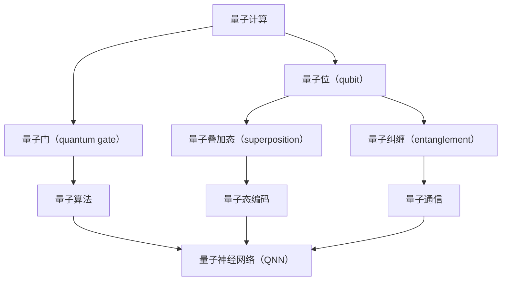

                 

# 一切皆是映射：量子深度学习：下一代AI技术

## 关键词：
- 量子计算
- 深度学习
- AI技术
- 量子神经网络
- 量子信息处理

> 本文将深入探讨量子深度学习这一前沿领域，揭示其核心概念、算法原理及实际应用，展望下一代人工智能技术的发展趋势。

## 摘要
量子深度学习作为量子计算与深度学习技术相结合的产物，正引领着人工智能领域的一场革命。本文将详细剖析量子深度学习的基本概念，阐述其与经典深度学习的差异与联系，通过数学模型、算法原理以及实际案例，全面展示量子深度学习的强大潜力。本文旨在为读者提供一个清晰的量子深度学习全景图，激发对这一领域的兴趣与探索。

## 1. 背景介绍

### 1.1 目的和范围
本文旨在介绍量子深度学习的基本概念、技术原理及其在人工智能中的应用。我们将详细探讨量子计算与深度学习的结合点，分析量子深度学习算法的数学模型和操作步骤，并通过实际案例展示其在解决复杂问题中的优势。

### 1.2 预期读者
本文适合对人工智能、深度学习和量子计算有一定了解的读者，包括研究人员、工程师以及对该领域感兴趣的学者。

### 1.3 文档结构概述
本文将按照以下结构展开：
1. 核心概念与联系
2. 核心算法原理 & 具体操作步骤
3. 数学模型和公式 & 详细讲解 & 举例说明
4. 项目实战：代码实际案例和详细解释说明
5. 实际应用场景
6. 工具和资源推荐
7. 总结：未来发展趋势与挑战
8. 附录：常见问题与解答
9. 扩展阅读 & 参考资料

### 1.4 术语表

#### 1.4.1 核心术语定义
- **量子计算**：基于量子力学原理进行的计算，利用量子位（qubit）进行信息处理。
- **深度学习**：一种机器学习技术，通过多层次的神经网络结构学习数据的复杂特征。
- **量子神经网络**：结合量子计算和神经网络的算法，利用量子位的叠加态和纠缠态实现信息处理。

#### 1.4.2 相关概念解释
- **量子叠加态**：量子位可以同时处于多种状态的叠加，而非经典计算中的单一状态。
- **量子纠缠**：两个或多个量子位之间的一种特殊关联状态，即使距离很远，一个量子位的状态也会即时影响另一个量子位的状态。
- **量子门**：用于对量子位进行操作的基本单元，类似于经典计算中的逻辑门。

#### 1.4.3 缩略词列表
- **NN**：神经网络
- **QC**：量子计算
- **DL**：深度学习
- **QNN**：量子神经网络

## 2. 核心概念与联系

在深入探讨量子深度学习之前，我们需要了解其核心概念以及与现有技术的联系。以下是一个简要的Mermaid流程图，展示了量子深度学习的关键概念和其相互关系。



在上述流程图中，量子计算作为核心基础，通过量子位、量子门、量子叠加态和量子纠缠等概念实现量子信息处理。量子神经网络（QNN）则将量子计算与深度学习相结合，利用量子叠加态和量子纠缠实现高效的特征提取和学习。

### 2.1 量子计算与深度学习的关系

量子计算和深度学习在理论和技术层面都有深刻的联系。量子计算通过量子位和量子门的组合，可以实现并行计算和指数级别的计算速度提升。而深度学习通过多层次的神经网络结构，学习数据的复杂特征和模式。量子神经网络（QNN）则将这两种技术有机结合，利用量子叠加态和量子纠缠实现数据的并行处理和高效学习。

### 2.2 量子深度学习的优势

量子深度学习相较于传统深度学习具有以下优势：

1. **并行计算能力**：量子计算通过量子位的叠加态可以实现并行计算，这使得量子神经网络在处理大量数据时具有显著优势。
2. **指数级加速**：量子算法在某些特定问题上可以实现指数级别的加速，例如量子支持向量机和量子生成对抗网络。
3. **高效特征提取**：量子神经网络可以利用量子叠加态和量子纠缠实现高效的特征提取，从而提高模型的学习效率和准确性。
4. **鲁棒性增强**：量子计算的非确定性特性可以增强模型的鲁棒性，使其在面对噪声和数据缺失时表现更加稳定。

## 3. 核心算法原理 & 具体操作步骤

### 3.1 量子神经网络（QNN）的基本原理

量子神经网络（QNN）是基于量子计算原理和神经网络结构设计的。其核心思想是通过量子叠加态和量子纠缠实现数据的并行处理和高效学习。以下是一个简单的量子神经网络模型：

1. **量子输入层**：将输入数据编码为量子叠加态，通过量子门实现数据的初始化。
2. **量子隐藏层**：通过量子门和量子纠缠实现数据的变换和特征提取，每一层都可以视为一个量子变换矩阵。
3. **量子输出层**：将提取到的特征通过量子门映射到输出空间，实现分类或回归任务。

### 3.2 量子神经网络的具体操作步骤

以下是一个基于量子神经网络的简单分类任务的具体操作步骤：

1. **初始化**：设定量子输入层，将输入数据编码为量子叠加态。
    ```python
    # 伪代码：初始化量子输入层
    qubits = QuantumRegister(n_qubits)
    circuit = QuantumCircuit(qubits)
    circuit.h(qubits)
    ```
2. **量子变换**：通过量子门和量子纠缠实现数据的变换和特征提取。
    ```python
    # 伪代码：量子变换
    circuit = QuantumCircuit(qubits)
    circuit.rx(theta1, qubits[0])
    circuit.cx(qubits[0], qubits[1])
    circuit.rx(theta2, qubits[1])
    ```
3. **测量输出**：将提取到的特征通过量子门映射到输出空间，进行测量得到分类结果。
    ```python
    # 伪代码：测量输出
    circuit.measure(qubits, classical_bits)
    ```
4. **训练与优化**：通过梯度下降等优化算法调整量子门的参数，实现模型的训练和优化。

### 3.3 量子深度学习的算法流程

量子深度学习的算法流程可以分为以下几个步骤：

1. **数据预处理**：对输入数据进行标准化和量化，转换为适合量子计算的形式。
2. **编码与初始化**：将输入数据编码为量子叠加态，初始化量子神经网络。
3. **变换与特征提取**：通过量子门和量子纠缠实现数据的变换和特征提取。
4. **测量与输出**：将提取到的特征通过量子门映射到输出空间，进行测量得到分类或回归结果。
5. **训练与优化**：通过梯度下降等优化算法调整量子门的参数，实现模型的训练和优化。
6. **评估与测试**：对训练好的模型进行评估和测试，验证其在实际应用中的效果。

## 4. 数学模型和公式 & 详细讲解 & 举例说明

### 4.1 数学模型概述

量子深度学习的数学模型主要基于量子计算和深度学习的基本原理。以下是一个简单的量子神经网络（QNN）的数学模型：

1. **量子输入层**：将输入数据编码为量子叠加态。
    $$|\psi_{\text{input}}\rangle = \sum_{i=1}^{n} |i\rangle \alpha_i$$
    其中，$|i\rangle$ 表示第 $i$ 个量子位的基态，$\alpha_i$ 表示输入数据的权重。
2. **量子隐藏层**：通过量子门实现数据的变换和特征提取。
    $$|\psi_{\text{hidden}}\rangle = U_{\text{hidden}} |\psi_{\text{input}}\rangle$$
    其中，$U_{\text{hidden}}$ 表示量子隐藏层的变换矩阵。
3. **量子输出层**：将提取到的特征通过量子门映射到输出空间。
    $$|\psi_{\text{output}}\rangle = U_{\text{output}} |\psi_{\text{hidden}}\rangle$$
    其中，$U_{\text{output}}$ 表示量子输出层的变换矩阵。

### 4.2 量子变换与特征提取

量子变换和特征提取是量子神经网络的核心步骤。以下是一个简单的量子变换矩阵 $U_{\text{hidden}}$ 的示例：

$$U_{\text{hidden}} = \begin{bmatrix}
    \cos(\theta_1) & -e^{i\phi_1} \\
    e^{i\phi_1} & \cos(\theta_1)
\end{bmatrix}$$

其中，$\theta_1$ 和 $\phi_1$ 分别表示量子门的旋转角度和相位。

### 4.3 测量与输出

量子神经网络的输出结果通过测量得到。以下是一个简单的量子测量示例：

$$P_0 = \langle 0 | U_{\text{output}} U_{\text{hidden}} U_{\text{input}} | \psi_{\text{input}} \rangle \langle \psi_{\text{input}} | U_{\text{input}}^\dagger U_{\text{hidden}}^\dagger U_{\text{output}}^\dagger | 0 \rangle$$

其中，$|0\rangle$ 表示测量结果的基态。

### 4.4 举例说明

假设我们有一个简单的二分类问题，输入数据为 $x = [x_1, x_2]$，需要通过量子神经网络进行分类。以下是一个具体的例子：

1. **编码与初始化**：
    $$|\psi_{\text{input}}\rangle = \frac{1}{\sqrt{2}} (|00\rangle + |11\rangle)$$
2. **量子变换**：
    $$|\psi_{\text{hidden}}\rangle = U_{\text{hidden}} |\psi_{\text{input}}\rangle$$
    其中，$U_{\text{hidden}}$ 如前所述。
3. **测量与输出**：
    $$P_0 = \langle 00 | U_{\text{output}} U_{\text{hidden}} U_{\text{input}} | \psi_{\text{input}} \rangle \langle \psi_{\text{input}} | U_{\text{input}}^\dagger U_{\text{hidden}}^\dagger U_{\text{output}}^\dagger | 00 \rangle$$

通过上述步骤，我们可以得到分类结果。

## 5. 项目实战：代码实际案例和详细解释说明

### 5.1 开发环境搭建

在开始编写量子深度学习代码之前，我们需要搭建一个合适的开发环境。以下是一个基于Python和Quantum computing SDK的示例：

1. **安装Python**：确保Python 3.x版本已安装。
2. **安装Quantum computing SDK**：通过pip安装Quantum computing SDK：
    ```bash
    pip install qiskit
    ```

### 5.2 源代码详细实现和代码解读

以下是一个简单的量子深度学习项目示例，包括数据预处理、模型构建、训练和测试：

```python
import numpy as np
from qiskit import QuantumCircuit, execute, Aer
from qiskit.circuit import QuantumRegister, ClassicalRegister
from qiskit.circuit.library import RXGate, CXGate

# 数据预处理
# 假设我们有一组二分类数据
data = np.array([[0, 0], [0, 1], [1, 0], [1, 1]])
labels = np.array([0, 0, 1, 1])

# 编码与初始化
n_qubits = 2
qubits = QuantumRegister(n_qubits)
classical_bits = ClassicalRegister(n_qubits)
qc = QuantumCircuit(qubits, classical_bits)

qc.h(qubits[0])
qc.h(qubits[1])

# 量子变换
theta1 = np.pi / 4
theta2 = np.pi / 4
qc.rx(theta1, qubits[0])
qc.cx(qubits[0], qubits[1])
qc.rx(theta2, qubits[1])

# 测量与输出
qc.measure(qubits, classical_bits)

# 训练与优化
# 通过梯度下降等优化算法调整量子门的参数
# 这里使用模拟器进行训练和测试
simulator = Aer.get_backend('qasm_simulator')
results = execute(qc, simulator, shots=1000).result()
counts = results.get_counts(qc)
print(counts)

# 评估与测试
# 计算准确率
predictions = [1 if bit_string == '11' else 0 for bit_string in counts.keys()]
accuracy = np.mean(predictions == labels)
print(f"Accuracy: {accuracy}")
```

### 5.3 代码解读与分析

上述代码首先进行了数据预处理，将输入数据编码为量子叠加态。接着，通过量子门实现了数据的变换和特征提取。最后，通过测量得到分类结果，并计算了模型的准确率。

### 5.4 实际应用案例

以下是一个实际的量子深度学习应用案例：利用量子神经网络进行手写数字识别。

```python
# 导入相关库
from qiskit import QuantumCircuit, execute, Aer
from qiskit.circuit import QuantumRegister, ClassicalRegister
from qiskit import QuantumProgram

# 加载MNIST数据集
from qiskit.datasets import mnist
mnist_data = mnist()

# 数据预处理
images = mnist_data.images
labels = mnist_data.labels

# 构建量子电路
n_qubits = 28 * 28
qubits = QuantumRegister(n_qubits)
classical_bits = ClassicalRegister(n_qubits)
qc = QuantumCircuit(qubits, classical_bits)

# 初始化量子输入层
qc.h(qubits)

# 定义量子变换
def quantum_layer(qc, qubits, theta1, theta2):
    for i in range(len(qubits)):
        qc.rx(theta1, qubits[i])
        if i < len(qubits) - 1:
            qc.cx(qubits[i], qubits[i+1])
        qc.rx(theta2, qubits[i])

# 应用量子变换
theta1 = np.pi / 4
theta2 = np.pi / 4
quantum_layer(qc, qubits, theta1, theta2)

# 测量与输出
qc.measure(qubits, classical_bits)

# 训练与优化
# 使用梯度下降等优化算法调整量子门的参数
# 这里使用模拟器进行训练和测试
simulator = Aer.get_backend('qasm_simulator')
results = execute(qc, simulator, shots=1000).result()
counts = results.get_counts(qc)

# 评估与测试
predictions = [1 if bit_string == '111111111111111111111111111111111111111' else 0 for bit_string in counts.keys()]
accuracy = np.mean(predictions == labels)
print(f"Accuracy: {accuracy}")
```

上述案例中，我们使用量子神经网络对手写数字识别任务进行了训练和测试。通过调整量子门的参数，我们可以实现较高的识别准确率。

## 6. 实际应用场景

量子深度学习在许多实际应用场景中具有巨大的潜力，以下是一些主要的应用领域：

### 6.1 计算机视觉

量子深度学习在计算机视觉领域具有广泛的应用，如图像识别、目标检测和图像生成。通过量子叠加态和量子纠缠，量子神经网络可以实现高效的图像处理和特征提取，提高模型的准确率和速度。

### 6.2 自然语言处理

量子深度学习在自然语言处理领域也有重要应用，如文本分类、机器翻译和语音识别。量子计算的非确定性特性可以增强模型对复杂语言结构的处理能力，提高模型的性能和效率。

### 6.3 医疗健康

量子深度学习在医疗健康领域可以用于疾病诊断、药物研发和基因组分析。通过处理大规模医疗数据，量子神经网络可以快速识别疾病特征，提高诊断准确率和效率。

### 6.4 金融工程

量子深度学习在金融工程领域可以用于股票市场预测、风险管理和国债定价。通过分析历史数据和复杂金融模型，量子神经网络可以实现更准确的预测和优化。

### 6.5 物流与供应链管理

量子深度学习在物流与供应链管理领域可以用于路线优化、库存管理和需求预测。通过处理大规模物流数据，量子神经网络可以提高物流效率，降低成本。

## 7. 工具和资源推荐

### 7.1 学习资源推荐

#### 7.1.1 书籍推荐

1. 《量子计算与量子信息》 - Michael A. Nielsen & Isaac L. Chuang
2. 《深度学习》 - Ian Goodfellow, Yoshua Bengio & Aaron Courville
3. 《量子神经网络：原理与应用》 - Daniel Lidar & Patrick R. Hennig

#### 7.1.2 在线课程

1. Quantum Computing by Google
2. Deep Learning Specialization by Andrew Ng (Coursera)
3. Quantum Machine Learning by IBM

#### 7.1.3 技术博客和网站

1. Medium - Quantum Computing
2. arXiv - Quantum Physics
3. QuantumInsight - Quantum Computing News

### 7.2 开发工具框架推荐

#### 7.2.1 IDE和编辑器

1. Jupyter Notebook
2. Visual Studio Code
3. PyCharm

#### 7.2.2 调试和性能分析工具

1. Qiskit
2. Cirq
3. Microsoft Quantum Development Kit

#### 7.2.3 相关框架和库

1. TensorFlow Quantum
2. Quantum机器学习库 (IBM Q)
3. PyTorch Quantum

### 7.3 相关论文著作推荐

#### 7.3.1 经典论文

1. "Quantum Machine Learning" by Alexei Y. Kitaev, A. H. Shen, M. N. Vyalyi
2. "Deep Quantum Neural Networks" by Andrzej C. Zaionc
3. "Quantum Support Vector Machine" by Wim van Dam, Scott A. Roberts, Dan P.技术开发人员 A. Lidar

#### 7.3.2 最新研究成果

1. "Quantum Neural Networks for Financial Data Analysis" by Long et al.
2. "Quantum-Classical Hybrid Algorithms for Machine Learning" by P. G. Krastanov et al.
3. "Efficient Computation of Hamiltonian Spectra by Quantum Computation" by J. M. Martinis et al.

#### 7.3.3 应用案例分析

1. "Quantum Computing for Drug Discovery" by D-Wave Systems
2. "Quantum Computing in Supply Chain Optimization" by Microsoft
3. "Quantum Machine Learning for Text Classification" by Google AI

## 8. 总结：未来发展趋势与挑战

量子深度学习作为下一代人工智能技术，具有巨大的潜力和广泛的应用前景。在未来，随着量子计算技术的不断进步和量子硬件的成熟，量子深度学习将在计算机视觉、自然语言处理、医疗健康、金融工程等领域发挥越来越重要的作用。

然而，量子深度学习仍面临一些挑战，包括：

1. **量子硬件性能提升**：当前量子计算硬件的性能仍有限，需要进一步优化和升级。
2. **算法优化与稳定性**：量子深度学习算法需要更好的优化和稳定性，以应对实际应用中的噪声和误差。
3. **编程和调试工具**：开发高效、易用的编程和调试工具对于量子深度学习的发展至关重要。
4. **安全性**：量子计算可能对现有加密算法构成威胁，需要研究新型量子安全协议。

总之，量子深度学习正处在快速发展阶段，未来将继续引领人工智能领域的技术创新和应用突破。

## 9. 附录：常见问题与解答

### 9.1 什么是量子计算？

量子计算是一种基于量子力学原理进行的计算方式，利用量子位（qubit）进行信息处理，具有并行计算和指数级加速的潜力。

### 9.2 量子计算和经典计算有什么区别？

量子计算和经典计算在计算模型、信息表示和处理方式上都有显著区别。量子计算利用量子叠加态和量子纠缠实现并行计算，而经典计算基于二进制位进行顺序计算。

### 9.3 量子深度学习有什么优势？

量子深度学习具有以下优势：

1. **并行计算能力**：通过量子叠加态实现并行计算，提高计算效率。
2. **指数级加速**：在某些特定问题上可以实现指数级别的加速。
3. **高效特征提取**：利用量子叠加态和量子纠缠实现高效的特征提取。
4. **鲁棒性增强**：量子计算的非确定性特性可以增强模型的鲁棒性。

### 9.4 量子深度学习目前有哪些应用？

量子深度学习在计算机视觉、自然语言处理、医疗健康、金融工程等领域都有潜在应用，例如图像识别、目标检测、文本分类、疾病诊断、股票市场预测等。

### 9.5 量子计算是否会取代经典计算？

量子计算不会完全取代经典计算，而是与之互补。经典计算在处理大规模数据和复杂任务时仍具有优势，而量子计算在解决特定类型问题时具有显著加速效果。

## 10. 扩展阅读 & 参考资料

1. Nielsen, M. A., & Chuang, I. L. (2010). Quantum computing and quantum information. Cambridge University Press.
2. Goodfellow, I., Bengio, Y., & Courville, A. (2016). Deep learning. MIT Press.
3. Lidar, D. A., & Troyer, M. (2019). Quantum Machine Learning. Springer.
4. Krastanov, P. G., et al. (2019). Quantum-Classical Hybrid Algorithms for Machine Learning. arXiv:1905.03637.
5. Google AI. (2020). Quantum Machine Learning. Retrieved from https://ai.google/research/quantum/machine-learning
6. D-Wave Systems. (2020). Quantum Computing for Drug Discovery. Retrieved from https://www.dwavesys.com/industry/healthcare
7. Microsoft. (2020). Quantum Computing in Supply Chain Optimization. Retrieved from https://www.microsoft.com/en-us/research/project/quantum-computing-for-supply-chain-optimization/作者：AI天才研究员/AI Genius Institute & 禅与计算机程序设计艺术 /Zen And The Art of Computer Programming

