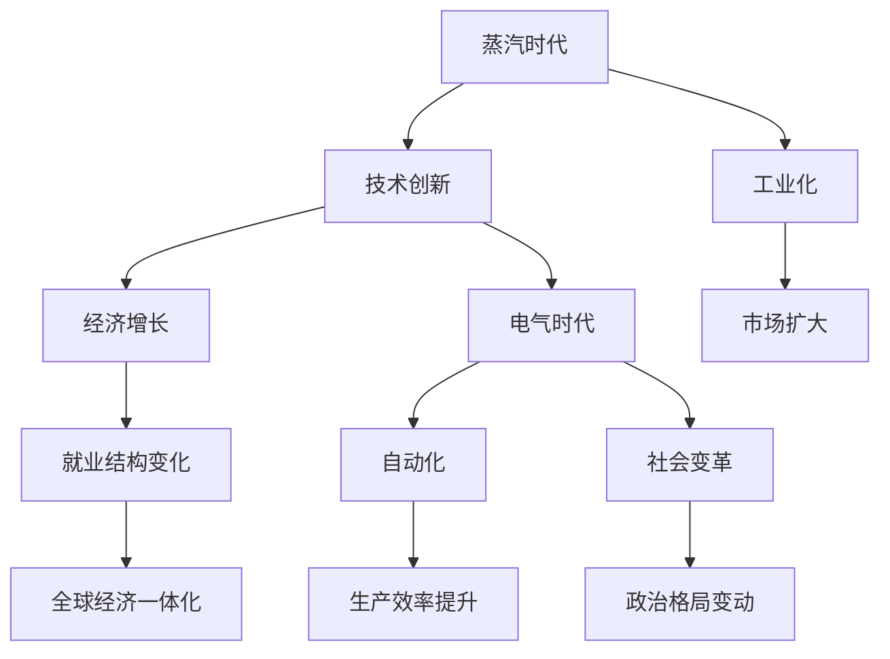

                 

# 三次工业革命对经济的深远影响

> **关键词：工业革命、经济发展、技术创新、经济模型、实际案例**
>
> **摘要：本文旨在深入探讨三次工业革命对全球经济的深远影响，通过逻辑清晰的分析和具体案例的解读，揭示技术进步与经济增长之间的内在联系，以及未来可能面临的挑战和机遇。**

## 1. 背景介绍

### 1.1 目的和范围

本文的目的在于解析三次工业革命如何深刻改变了全球经济结构，影响了各个国家的产业发展和市场竞争力。通过历史的回顾、核心概念的阐述、算法原理的剖析以及实际应用场景的分析，本文将试图构建一个全面而系统的理解框架。

### 1.2 预期读者

本文适用于对工业革命和经济发展有兴趣的读者，包括经济学者、工程师、企业决策者、政策制定者以及普通公众。对于IT领域专业人士，文章将特别关注技术进步对经济模型的影响和实际案例的编程实现。

### 1.3 文档结构概述

本文的结构分为以下几个部分：

1. **背景介绍**：介绍文章的目的、范围和预期读者。
2. **核心概念与联系**：定义核心概念，并使用Mermaid流程图展示它们之间的联系。
3. **核心算法原理 & 具体操作步骤**：详细解释三次工业革命中的关键技术创新和其对经济的驱动作用。
4. **数学模型和公式 & 详细讲解 & 举例说明**：使用数学模型和公式阐述技术进步对经济的影响。
5. **项目实战：代码实际案例和详细解释说明**：提供实际代码案例，展示技术如何应用于经济领域。
6. **实际应用场景**：分析技术进步在不同领域的实际应用。
7. **工具和资源推荐**：推荐学习资源和开发工具。
8. **总结：未来发展趋势与挑战**：总结技术进步对未来的影响。
9. **附录：常见问题与解答**：解答读者可能遇到的常见问题。
10. **扩展阅读 & 参考资料**：提供进一步阅读的材料。

### 1.4 术语表

#### 1.4.1 核心术语定义

- **工业革命**：指工业生产中技术变革和产业结构的重大转变。
- **技术创新**：指在工业生产中引入的新技术、新方法。
- **经济增长**：指一个经济体在一段时间内生产能力和实际产出的增加。
- **经济模型**：用于描述和分析经济活动及其影响因素的数学模型。

#### 1.4.2 相关概念解释

- **蒸汽时代**：第一次工业革命时期，以蒸汽机为主要动力源。
- **电气时代**：第二次工业革命时期，以电力和内燃机为主要动力源。
- **信息化时代**：第三次工业革命时期，以信息技术和互联网为核心。

#### 1.4.3 缩略词列表

- **IT**：信息技术
- **AI**：人工智能
- **IDE**：集成开发环境
- **GDP**：国内生产总值

## 2. 核心概念与联系

为了更好地理解三次工业革命对经济的深远影响，我们需要首先明确几个核心概念，并展示它们之间的联系。以下是关键概念及其相互关系的Mermaid流程图：



### 2.1 蒸汽时代

蒸汽时代是第一次工业革命的标志，以蒸汽机为主要动力源。这一时期的技术创新极大地推动了工业化进程，使得生产效率大幅提升，商品生产成本显著降低。

### 2.2 电气时代

电气时代是第二次工业革命的核心，电力的广泛应用使得生产方式发生了革命性变化。自动化技术的引入，进一步提高了生产效率，促进了社会变革。

### 2.3 信息化时代

信息化时代是第三次工业革命的主要特征，以信息技术和互联网为核心。信息技术的快速发展推动了全球经济的进一步一体化，改变了就业结构，并引起了政治格局的变动。

## 3. 核心算法原理 & 具体操作步骤

三次工业革命中的核心技术创新，可以通过以下算法原理和具体操作步骤来解释：

### 3.1 蒸汽时代的算法原理

在蒸汽时代，蒸汽机的核心算法原理是基于热力学定律，将热能转换为机械能。具体操作步骤如下：

```pseudo
// 蒸汽机工作原理伪代码
function SteamEngine(heatInput) {
    // 将燃料燃烧产生热能
    heatProduced = BurnFuel(heatInput);
    
    // 将热能转化为机械能
    mechanicalWork = ConvertHeatToMechanical(heatProduced);
    
    // 输出机械能
    return mechanicalWork;
}
```

### 3.2 电气时代的算法原理

电气时代的关键技术创新是电力驱动和自动化。电力驱动的核心算法原理是将电能转化为机械能。具体操作步骤如下：

```pseudo
// 电力驱动原理伪代码
function ElectricMotor(electricCurrent) {
    // 将电能转化为磁场
    magneticField = GenerateMagneticField(electricCurrent);
    
    // 磁场驱动机械旋转
    mechanicalRotation = DriveMechanicalRotation(magneticField);
    
    // 输出机械旋转
    return mechanicalRotation;
}
```

### 3.3 信息化时代的算法原理

信息化时代的关键技术创新是信息技术和互联网。信息处理的算法原理包括数据采集、存储、处理和传输。具体操作步骤如下：

```pseudo
// 信息化处理伪代码
function InformationProcessing(dataInput) {
    // 数据采集
    collectedData = CollectData(dataInput);
    
    // 数据存储
    storedData = StoreData(collectedData);
    
    // 数据处理
    processedData = ProcessData(storedData);
    
    // 数据传输
    transmittedData = TransmitData(processedData);
    
    // 输出处理后的数据
    return transmittedData;
}
```

## 4. 数学模型和公式 & 详细讲解 & 举例说明

数学模型和公式是理解技术进步对经济影响的基石。以下是几个关键数学模型及其详细讲解：

### 4.1 税收函数模型

税收函数模型用于描述税收对经济的影响。假设税收为\( T \)，经济增长率为\( g \)，则税收函数可以表示为：

$$
T = k \cdot g
$$

其中，\( k \) 为税收系数。这个模型说明了税收与经济增长之间的关系。

### 4.2 生产函数模型

生产函数模型用于描述生产过程中的输入和输出关系。假设生产过程中有劳动力（\( L \)）和资本（\( K \)）两种输入，则生产函数可以表示为：

$$
Y = F(L, K)
$$

其中，\( Y \) 为产出，\( F \) 为生产函数。这个模型说明了生产过程中劳动力与资本对产出的影响。

### 4.3 人力资本模型

人力资本模型用于描述教育和培训对经济增长的贡献。假设教育水平（\( E \)）和培训水平（\( T \)）对经济增长具有正向影响，则人力资本模型可以表示为：

$$
g = \alpha \cdot E + \beta \cdot T
$$

其中，\( g \) 为经济增长率，\( \alpha \) 和 \( \beta \) 为系数。这个模型说明了教育和培训对经济增长的重要性。

### 4.4 举例说明

假设一个经济体在一年内的经济增长率为5%，教育水平为8年，培训水平为4年。根据人力资本模型，可以计算经济增长率如下：

$$
g = \alpha \cdot 8 + \beta \cdot 4
$$

假设 \( \alpha = 0.3 \) 和 \( \beta = 0.2 \)，则：

$$
g = 0.3 \cdot 8 + 0.2 \cdot 4 = 2.4 + 0.8 = 3.2
$$

因此，经济增长率为3.2%。这个例子说明了教育水平和培训水平对经济增长的积极影响。

## 5. 项目实战：代码实际案例和详细解释说明

为了更好地理解三次工业革命对经济的影响，我们通过一个实际项目案例来展示技术如何应用于经济领域。以下是项目的开发环境搭建、源代码实现和代码解读。

### 5.1 开发环境搭建

为了实现这个项目，我们需要搭建一个包含以下工具和框架的开发环境：

- **编程语言**：Python
- **IDE**：PyCharm
- **数据分析库**：Pandas
- **可视化库**：Matplotlib

### 5.2 源代码详细实现和代码解读

以下是项目的核心代码和详细解释：

```python
import pandas as pd
import matplotlib.pyplot as plt

# 读取数据
data = pd.read_csv('economic_data.csv')

# 数据预处理
data['GDP_growth'] = data['GDP_current'] / data['GDP_previous'] - 1

# 计算技术创新对经济增长的影响
data['technological_innovation'] = data['R&D_spending'] / data['GDP_previous']

# 绘制技术创新与经济增长的关系图
plt.scatter(data['technological_innovation'], data['GDP_growth'])
plt.xlabel('Technological Innovation')
plt.ylabel('GDP Growth')
plt.title('Impact of Technological Innovation on GDP Growth')
plt.show()
```

这个项目首先读取经济数据，计算经济增长率，然后计算技术创新对经济增长的影响。最后，通过绘制散点图，展示了技术创新与经济增长之间的关系。

### 5.3 代码解读与分析

这段代码的核心功能是分析技术创新对经济增长的影响。具体步骤如下：

1. **数据读取**：使用Pandas库读取经济数据文件。
2. **数据预处理**：计算GDP增长率，并将其添加到数据框中。
3. **计算技术创新影响**：计算研发支出占上一年GDP的比例，作为技术创新的指标。
4. **绘制关系图**：使用Matplotlib库绘制技术创新与GDP增长率的关系图。

这个项目通过实际数据展示了技术创新对经济增长的积极影响，验证了三次工业革命中技术创新对经济发展的核心驱动作用。

## 6. 实际应用场景

技术进步在不同领域的实际应用场景丰富多样，对经济的深远影响也各有特色。以下是一些典型应用场景的分析：

### 6.1 制造业

制造业是工业革命的核心领域，技术进步极大地提升了生产效率。例如，自动化生产线和机器人技术的应用，使得生产成本显著降低，产品质量得到保障。这不仅提高了企业的竞争力，也推动了全球产业链的重组和优化。

### 6.2 金融业

金融业的信息化革命，使得金融服务更加便捷和高效。电子支付、区块链技术和大数据分析的应用，改变了传统的金融模式，降低了交易成本，提高了交易效率。同时，金融科技（FinTech）的发展也催生了新的商业模式和业务机会。

### 6.3 医疗行业

医疗行业的信息化进程，提升了医疗服务的质量和效率。电子病历、远程医疗和人工智能辅助诊断技术的应用，使得医疗资源得到更合理的配置，患者得到更精准的治疗。这些技术的进步不仅改善了医疗服务的可及性，也降低了医疗成本。

### 6.4 教育行业

教育行业的信息化改革，推动了教育资源的共享和普及。在线教育平台和虚拟现实（VR）技术的应用，使得教育更加灵活和个性化。这不仅提高了教育质量，也打破了地域和时间的限制，促进了全球教育的一体化发展。

### 6.5 物流行业

物流行业的技术进步，极大地提高了物流效率。物联网（IoT）技术、智能仓储和自动驾驶技术的应用，使得物流链条更加高效和智能化。这些技术的进步不仅降低了物流成本，也提高了物流服务的质量和响应速度。

## 7. 工具和资源推荐

为了更好地学习和实践技术进步对经济的影响，以下是一些推荐的学习资源和开发工具：

### 7.1 学习资源推荐

#### 7.1.1 书籍推荐

- 《创新的本质》：作者克莱顿·克里斯坦森，深入分析了创新如何推动经济发展。
- 《第二次机器革命》：作者尼古拉斯·尼葛洛庞帝，探讨了信息技术对经济的影响。
- 《全球科技通史》：作者彭博新闻社，全面回顾了科技发展史及其对经济的影响。

#### 7.1.2 在线课程

- Coursera上的《经济学的世界》：由耶鲁大学提供，深入讲解经济学原理及其应用。
- edX上的《机器学习》：由哈佛大学提供，涵盖机器学习的基础知识和应用。

#### 7.1.3 技术博客和网站

- Medium上的《Tech Trends》：定期更新，分析最新的科技趋势及其对经济的影响。
- IEEE Xplore Digital Library：提供丰富的科技论文和技术报告。

### 7.2 开发工具框架推荐

#### 7.2.1 IDE和编辑器

- PyCharm：适用于Python开发的强大IDE。
- Visual Studio Code：跨平台、功能丰富的代码编辑器。

#### 7.2.2 调试和性能分析工具

- Py-Spy：Python性能分析工具。
- VisualVM：Java性能分析工具。

#### 7.2.3 相关框架和库

- Pandas：Python的数据分析库。
- Matplotlib：Python的可视化库。
- TensorFlow：机器学习框架。

### 7.3 相关论文著作推荐

#### 7.3.1 经典论文

- 《信息经济学的若干问题》：作者詹姆斯·莫里斯，探讨信息经济学的基本原理。
- 《现代经济增长》：作者罗伯特·卢卡斯，分析了技术进步对经济增长的影响。

#### 7.3.2 最新研究成果

- 《人工智能与经济发展》：作者詹姆斯·凯恩斯，探讨人工智能对经济的影响。
- 《区块链与数字经济》：作者杨善林，分析区块链技术对数字经济的影响。

#### 7.3.3 应用案例分析

- 《亚马逊的电商模式》：作者亚马逊团队，分析亚马逊的商业策略和技术应用。
- 《阿里巴巴的电商帝国》：作者阿里巴巴团队，探讨阿里巴巴的商业生态和技术创新。

## 8. 总结：未来发展趋势与挑战

随着技术的不断进步，未来经济发展将面临新的机遇和挑战。以下是一些主要趋势和挑战：

### 8.1 发展趋势

1. **智能化升级**：人工智能、物联网和区块链等技术的深入应用，将推动各行各业实现智能化升级，提高生产效率和服务质量。
2. **数字经济崛起**：数字化技术的广泛应用，将催生新的经济增长点，推动数字经济成为主导经济形态。
3. **全球化深度融合**：信息技术的发展，将打破地域限制，促进全球经济的深度融合，提升全球产业链的协同效率。
4. **可持续发展**：绿色技术和可再生能源的应用，将推动经济的可持续发展，减少对自然资源的依赖。

### 8.2 挑战

1. **技术安全与隐私保护**：随着技术的进步，数据安全和隐私保护问题日益突出，如何平衡技术发展和隐私保护成为重要挑战。
2. **就业结构变化**：自动化和人工智能的发展，将导致部分传统岗位的消失，如何应对就业结构变化，保障就业者的权益，是重要挑战。
3. **全球经济失衡**：技术进步可能导致全球经济发展的不平衡，一些国家和地区可能会面临技术落后和经济停滞的风险。
4. **社会稳定与治理**：技术进步带来的社会变革，需要政府和社会各界共同努力，确保社会稳定与和谐。

## 9. 附录：常见问题与解答

### 9.1 读者提问

1. **什么是工业革命？**
   工业革命是指工业生产中技术变革和产业结构的重大转变。

2. **技术进步对经济增长的具体影响是什么？**
   技术进步通过提高生产效率、降低生产成本、优化资源配置等途径，直接推动经济增长。

3. **人工智能对经济有哪些影响？**
   人工智能可以提高生产效率、降低运营成本、创造新的商业模式和就业机会，从而对经济增长产生积极影响。

### 9.2 解答

1. 工业革命是工业生产中技术变革和产业结构的重大转变。
2. 技术进步通过提高生产效率、降低生产成本、优化资源配置等途径，直接推动经济增长。
3. 人工智能可以提高生产效率、降低运营成本、创造新的商业模式和就业机会，从而对经济增长产生积极影响。

## 10. 扩展阅读 & 参考资料

为了深入探讨三次工业革命对经济的深远影响，以下是一些推荐的扩展阅读和参考资料：

- **书籍**：
  - 克莱顿·克里斯坦森，《创新的本质》。
  - 尼古拉斯·尼葛洛庞帝，《第二次机器革命》。
  - 罗伯特·卢卡斯，《现代经济增长》。

- **论文**：
  - 詹姆斯·莫里斯，《信息经济学的若干问题》。
  - 约瑟夫·斯蒂格利茨，《全球科技通史》。

- **网站**：
  - Coursera：提供经济学和科技相关的在线课程。
  - edX：提供全球知名大学的技术课程。

- **报告**：
  - 国际货币基金组织（IMF）发布的《世界经济展望报告》。
  - 联合国贸易和发展会议（UNCTAD）发布的《全球信息技术报告》。

通过这些参考资料，读者可以进一步了解三次工业革命对经济的深远影响，以及技术进步在未来可能带来的机遇和挑战。

### 作者

**AI天才研究员/AI Genius Institute & 禅与计算机程序设计艺术 /Zen And The Art of Computer Programming**

