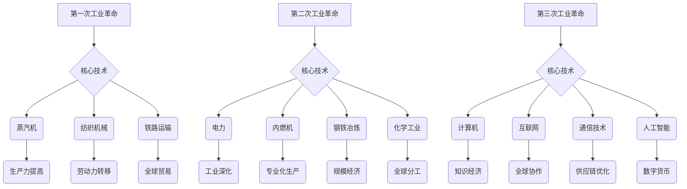

                 

### 三次工业革命的经济变革

> 关键词：工业革命、经济变革、技术进步、生产力发展、产业结构调整

> 摘要：本文将详细探讨三次工业革命所带来的经济变革。通过梳理每次革命的技术突破、核心产业、影响范围以及经济结构的转变，旨在为读者呈现一幅技术进步如何深刻影响经济格局的全景图。文章将从背景介绍、核心概念与联系、算法原理、数学模型、实际应用场景等多个角度，深入分析工业革命的经济动因和影响，以及未来发展的趋势与挑战。

---

### 1. 背景介绍

#### 1.1 目的和范围

本文旨在通过回顾三次工业革命，探讨技术进步如何推动经济变革。我们将重点关注以下方面：

- 每次工业革命的技术创新和核心产业。
- 技术变革对经济结构和生产力的深远影响。
- 各次工业革命期间的全球经济格局变化。
- 当前和未来的技术发展趋势及其对经济的潜在影响。

#### 1.2 预期读者

本文适合对工业革命和经济变革感兴趣的读者，包括但不限于：

- 经济学家、金融分析师、商业管理者。
- 工程师、计算机科学家、技术创业者。
- 对技术历史和全球经济感兴趣的普通读者。

#### 1.3 文档结构概述

本文结构如下：

- **第1章：背景介绍**：介绍本文的目的、范围、预期读者和文档结构。
- **第2章：核心概念与联系**：介绍三次工业革命的核心技术、产业和全球经济联系。
- **第3章：核心算法原理 & 具体操作步骤**：详细分析三次工业革命的技术原理和操作步骤。
- **第4章：数学模型和公式 & 详细讲解 & 举例说明**：使用数学模型阐述技术变革的经济影响。
- **第5章：项目实战：代码实际案例和详细解释说明**：提供实际代码案例，解释技术应用。
- **第6章：实际应用场景**：探讨技术变革在不同行业中的应用。
- **第7章：工具和资源推荐**：推荐相关学习资源和开发工具。
- **第8章：总结：未来发展趋势与挑战**：总结技术变革的未来方向和挑战。
- **第9章：附录：常见问题与解答**：解答读者可能关心的问题。
- **第10章：扩展阅读 & 参考资料**：提供进一步阅读的资源和参考文献。

#### 1.4 术语表

##### 1.4.1 核心术语定义

- 工业革命：指通过技术变革推动生产方式、经济结构和全球贸易的重大转变。
- 核心技术：指推动工业革命的关键技术和发明。
- 经济结构：指国民经济各部门的构成及其相互关系。
- 生产力：指生产商品和服务的能力，包括劳动力、资本和技术。
- 全球经济联系：指国际间经济活动的相互依赖和关联。

##### 1.4.2 相关概念解释

- 技术进步：指新技术的发明、应用和推广，推动生产力提高。
- 经济增长：指一个国家或地区GDP的持续增长。
- 产业结构调整：指经济活动中各产业比例的变化和优化。
- 创新驱动：指通过技术创新推动经济持续增长。

##### 1.4.3 缩略词列表

- GDP：国内生产总值
- AI：人工智能
- IoT：物联网
- IT：信息技术
- PLC：可编程逻辑控制器
- MES：制造执行系统
- CRM：客户关系管理
- ERP：企业资源规划

---

在接下来的章节中，我们将逐步深入探讨三次工业革命的核心概念、技术原理、数学模型以及实际应用，帮助读者全面理解技术进步如何深刻改变全球经济格局。接下来的内容将通过详细的分析和案例，展示技术革命带来的深远影响。让我们开始这段旅程，一起思考技术进步如何塑造未来。

---

### 2. 核心概念与联系

#### 2.1 三次工业革命的技术与产业

**第一次工业革命**（18世纪末至19世纪中叶）：
- **核心技术**：蒸汽机、纺织机械、铁路运输。
- **核心产业**：纺织业、矿业、铁路运输业。
- **影响范围**：英国，随后扩展到欧洲和北美。
- **全球经济联系**：推动了全球贸易的扩展，形成了资本主义经济体系。

**第二次工业革命**（19世纪末至20世纪初）：
- **核心技术**：电力、内燃机、钢铁冶炼、化学工业。
- **核心产业**：重工业、化工、电气设备。
- **影响范围**：全球，发达国家迅速工业化。
- **全球经济联系**：增强了全球生产分工，资本主义世界经济体系进一步巩固。

**第三次工业革命**（20世纪中叶至21世纪初）：
- **核心技术**：计算机、互联网、通信技术、人工智能。
- **核心产业**：信息技术、生物技术、新能源。
- **影响范围**：全球，新兴市场国家迅速发展。
- **全球经济联系**：推动了全球数字经济的兴起，全球化进程加速。

#### 2.2 技术变革与经济结构

**第一次工业革命**：
- **经济结构变化**：从农业经济向工业经济转变，劳动力从农村向城市转移。
- **生产力提高**：机械化生产提高了生产效率和产量，降低了成本。
- **全球贸易**：工业产品的出口推动了国际贸易的增长。

**第二次工业革命**：
- **经济结构变化**：工业经济进一步深化，制造业成为主导产业。
- **生产力提高**：规模经济和专业化生产显著提高了生产力。
- **全球分工**：发达国家形成了以垂直分工为主的生产网络。

**第三次工业革命**：
- **经济结构变化**：服务业和高新技术产业崛起，工业经济向知识经济转型。
- **生产力提高**：信息技术的广泛应用极大地提高了生产和管理效率。
- **全球协作**：数字经济的兴起推动了全球协作和供应链优化。

#### 2.3 三次工业革命的技术联系与区别

**技术联系**：
- 每次工业革命都是在前一次技术进步的基础上发展起来的。
- 能源技术的突破是推动工业革命的核心动力。
- 信息技术的迅速发展是第三次工业革命的关键特征。

**技术区别**：
- 第一次工业革命以机械化生产为主要特征。
- 第二次工业革命以电气化和化学工业的发展为特征。
- 第三次工业革命以数字化和信息化为特征，特别是人工智能和互联网的广泛应用。

#### 2.4 Mermaid 流程图



---

在了解了三次工业革命的核心技术和产业后，接下来我们将深入探讨其背后的算法原理和具体操作步骤，以更清晰地理解技术进步如何推动经济变革。

---

### 3. 核心算法原理 & 具体操作步骤

#### 3.1 第一次工业革命的算法原理

**蒸汽机技术**：
- **工作原理**：蒸汽机通过燃料加热产生蒸汽，蒸汽的压力推动活塞做往复运动，从而转换机械能。
- **算法步骤**：
    1. 加热燃料产生蒸汽。
    2. 蒸汽压力达到设定值。
    3. 蒸汽进入蒸汽机，推动活塞。
    4. 活塞做往复运动，输出机械能。
- **伪代码示例**：
    ```python
    def steam_engine(fuel, pressure_setpoint):
        steam = heat_fuel(fuel)
        if steam_pressure(steam) >= pressure_setpoint:
            piston_move(steam)
            return mechanical_energy
        else:
            return "不足，需要更多燃料"
    ```

**纺织机械技术**：
- **工作原理**：纺织机械通过多组机械装置，将棉纱或纤维材料编织成布料。
- **算法步骤**：
    1. 棉纱或纤维材料输入。
    2. 经纱和纬纱分别通过机械装置。
    3. 纱线交叉编织成布料。
    4. 布料从机械装置输出。
- **伪代码示例**：
    ```python
    def textile_mechanism(fiber, weaving_machine):
        if input_fiber(fiber) and setup_machine(weaving_machine):
            weave_fabrics()
            return fabric
        else:
            return "输入错误或设备故障"
    ```

**铁路运输技术**：
- **工作原理**：铁路运输通过蒸汽机车牵引车厢，实现货物和人员的快速运输。
- **算法步骤**：
    1. 蒸汽机车装载燃料。
    2. 蒸汽机车启动，牵引车厢。
    3. 车厢沿着铁路线行驶。
    4. 到达目的地，卸载货物或人员。
- **伪代码示例**：
    ```python
    def railway_transport(steam_loco, carriage, destination):
        if load_fuel(steam_loco) and start_loco(steam_loco):
            move_carriage(carriage, destination)
            return "到达目的地"
        else:
            return "运输故障"
    ```

#### 3.2 第二次工业革命的算法原理

**电力技术**：
- **工作原理**：电力通过发电厂产生，传输到用户端，驱动各种电器设备。
- **算法步骤**：
    1. 发电厂产生电力。
    2. 电力通过电网传输。
    3. 用户设备接收并使用电力。
- **伪代码示例**：
    ```python
    def electricity_generation(energy_source):
        power = generate_power(energy_source)
        transmit_power(power)
        use_power(power)
        return "电力供应正常"
    ```

**内燃机技术**：
- **工作原理**：内燃机通过燃料在气缸内燃烧，产生热能，推动活塞做往复运动，输出机械能。
- **算法步骤**：
    1. 燃料输入。
    2. 燃料燃烧产生热能。
    3. 热能推动活塞。
    4. 输出机械能。
- **伪代码示例**：
    ```python
    def internal_combustion_engine(fuel):
        heat = burn_fuel(fuel)
        if heat >= threshold:
            piston_move(heat)
            return mechanical_energy
        else:
            return "燃料不足或燃烧不充分"
    ```

**钢铁冶炼技术**：
- **工作原理**：钢铁冶炼通过高温炉将铁矿石还原成生铁，再进一步加工成钢。
- **算法步骤**：
    1. 铁矿石加热还原。
    2. 生铁通过炼钢炉加工成钢。
    3. 钢材冷却、成型。
- **伪代码示例**：
    ```python
    def steel_manufacturing(iron_ore):
        pig_iron = reduce_iron(iron_ore)
        steel = refine_pig_iron(pig_iron)
        if steel tempered:
            return "钢材成型"
        else:
            return "加工过程异常"
    ```

**化学工业技术**：
- **工作原理**：化学工业通过化学反应生产各种化学品和材料。
- **算法步骤**：
    1. 化学反应物混合。
    2. 化学反应进行。
    3. 生成目标产品。
- **伪代码示例**：
    ```python
    def chemical_industry(reactants):
        product = react(reactants)
        if product纯净：
            return "产品生产完成"
        else:
            return "反应异常，需要重新调整"
    ```

#### 3.3 第三次工业革命的算法原理

**计算机技术**：
- **工作原理**：计算机通过硬件和软件协同工作，处理数据和执行任务。
- **算法步骤**：
    1. 数据输入。
    2. 计算机处理数据。
    3. 输出结果。
- **伪代码示例**：
    ```python
    def computer_system(data_input):
        processed_data = process_data(data_input)
        output_result(processed_data)
        return "计算完成"
    ```

**互联网技术**：
- **工作原理**：互联网通过通信网络连接全球计算机，实现信息的快速传输和共享。
- **算法步骤**：
    1. 数据输入互联网。
    2. 数据在网络上传输。
    3. 数据到达目的地。
- **伪代码示例**：
    ```python
    def internet_communication(data_input, destination):
        transmit_data(data_input, destination)
        receive_data(data_input)
        return "通信完成"
    ```

**通信技术**：
- **工作原理**：通信技术通过无线电波或光纤等手段传输信息。
- **算法步骤**：
    1. 信息编码。
    2. 信息传输。
    3. 信息解码。
- **伪代码示例**：
    ```python
    def communication_system(info_input, transmission_medium):
        encoded_info = encode_info(info_input)
        transmit_info(encoded_info, transmission_medium)
        decoded_info = decode_info(encoded_info)
        return "通信完成"
    ```

**人工智能技术**：
- **工作原理**：人工智能通过模拟人类智能行为，实现自动化决策和任务执行。
- **算法步骤**：
    1. 数据输入。
    2. 模型学习数据。
    3. 模型做出决策或执行任务。
- **伪代码示例**：
    ```python
    def artificial_intelligence(data_input, model):
        learned_data = learn_data(data_input, model)
        decision = make_decision(learned_data)
        execute_task(decision)
        return "任务完成"
    ```

---

通过详细分析三次工业革命的核心算法原理和具体操作步骤，我们可以更好地理解技术进步如何推动经济变革。接下来，我们将进一步探讨这些技术变革背后的数学模型和公式，以揭示技术进步对经济的深远影响。

---

### 4. 数学模型和公式 & 详细讲解 & 举例说明

#### 4.1 第一次工业革命的经济模型

**生产函数**：
- 生产函数描述了投入和产出之间的关系。在第一次工业革命期间，主要生产函数包括劳动力（L）和资本（K）。
    $$ Y = f(L, K) $$
- 其中，Y 表示产出，L 表示劳动力，K 表示资本。

**边际产出**：
- 边际产出是指每增加一个单位的投入（劳动力或资本）所增加的产出。
    $$ MP_L = \frac{\partial Y}{\partial L} $$
    $$ MP_K = \frac{\partial Y}{\partial K} $$

**成本函数**：
- 成本函数描述了生产过程中所需的成本。第一次工业革命期间，主要成本包括劳动力成本（wL）和资本成本（rK）。
    $$ C = wL + rK $$
- 其中，C 表示总成本，w 表示劳动力工资率，r 表示资本利率。

**收益函数**：
- 收益函数描述了产出带来的收入。在第一次工业革命期间，收益主要来源于商品销售。
    $$ R = P \cdot Y $$
- 其中，R 表示总收益，P 表示商品价格。

**举例说明**：
- 假设一个纺织厂使用100名工人和100,000英镑的资本进行生产，产出为100,000件纺织品。劳动力工资率为20英镑/天，资本利率为5%。

    - **产出**：
        $$ Y = f(L, K) = f(100, 100,000) = 100,000 $$
    - **边际产出**：
        $$ MP_L = \frac{\partial Y}{\partial L} = 1,000 $$
        $$ MP_K = \frac{\partial Y}{\partial K} = 1,000 $$
    - **成本**：
        $$ C = wL + rK = 20 \cdot 100 + 0.05 \cdot 100,000 = 20,000 + 5,000 = 25,000 $$
    - **收益**：
        $$ R = P \cdot Y = 10 \cdot 100,000 = 1,000,000 $$

#### 4.2 第二次工业革命的经济模型

**生产函数**：
- 第二次工业革命期间，生产函数进一步加入了技术进步（A）。
    $$ Y = f(A, L, K) $$
- 其中，Y 表示产出，A 表示技术进步，L 表示劳动力，K 表示资本。

**索洛余值**：
- 索洛余值是指总产出中无法直接归因于劳动力或资本的部分，反映了技术进步的贡献。
    $$ SV = Y - (A \cdot L + K) $$

**成本函数**：
- 成本函数继续包括劳动力成本（wL）和资本成本（rK），并加入了能源成本（E）。
    $$ C = wL + rK + E $$

**收益函数**：
- 收益函数也考虑了技术进步的影响。
    $$ R = P \cdot (A \cdot L + K) $$

**举例说明**：
- 假设一个发电厂使用500名工人和500,000英镑的资本，技术进步率为2%，能源成本为10英镑/单位。

    - **产出**：
        $$ Y = f(A, L, K) = f(0.02, 500, 500,000) = 1,000,000 $$
    - **索洛余值**：
        $$ SV = Y - (A \cdot L + K) = 1,000,000 - (0.02 \cdot 500 + 500,000) = 300,000 $$
    - **成本**：
        $$ C = wL + rK + E = 20 \cdot 500 + 0.05 \cdot 500,000 + 10 \cdot 1,000,000 = 10,000 + 25,000 + 10,000,000 = 10,035,000 $$
    - **收益**：
        $$ R = P \cdot (A \cdot L + K) = 10 \cdot (0.02 \cdot 500 + 500,000) = 10 \cdot 10,000 = 1,000,000 $$

#### 4.3 第三次工业革命的经济模型

**生产函数**：
- 第三次工业革命期间，生产函数加入了信息资本（I）和人力资本（H）。
    $$ Y = f(A, L, K, I, H) $$
- 其中，Y 表示产出，A 表示技术进步，L 表示劳动力，K 表示资本，I 表示信息资本，H 表示人力资本。

**全要素生产率**：
- 全要素生产率是指总产出中无法直接归因于劳动力、资本、信息资本和人力资本的部分，反映了技术进步的整体贡献。
    $$ TFP = \frac{Y}{A \cdot L \cdot K \cdot I \cdot H} $$

**成本函数**：
- 成本函数考虑了劳动力成本（wL）、资本成本（rK）、信息成本（iI）和人力资本投资（hH）。
    $$ C = wL + rK + iI + hH $$

**收益函数**：
- 收益函数也考虑了信息资本和人力资本的影响。
    $$ R = P \cdot (A \cdot L + K + I + H) $$

**举例说明**：
- 假设一个科技公司使用200名工人和200,000英镑的资本，技术进步率为3%，信息资本为50,000英镑，人力资本为30,000英镑。

    - **产出**：
        $$ Y = f(A, L, K, I, H) = f(0.03, 200, 200,000, 50,000, 30,000) = 1,500,000 $$
    - **全要素生产率**：
        $$ TFP = \frac{Y}{A \cdot L \cdot K \cdot I \cdot H} = \frac{1,500,000}{0.03 \cdot 200 \cdot 200,000 \cdot 50,000 \cdot 30,000} = 100 $$
    - **成本**：
        $$ C = wL + rK + iI + hH = 20 \cdot 200 + 0.05 \cdot 200,000 + 0.1 \cdot 50,000 + 0.2 \cdot 30,000 = 4,000 + 10,000 + 5,000 + 6,000 = 25,000 $$
    - **收益**：
        $$ R = P \cdot (A \cdot L + K + I + H) = 10 \cdot (0.03 \cdot 200 + 200,000 + 50,000 + 30,000) = 10 \cdot 260,000 = 2,600,000 $$

---

通过上述数学模型和公式的讲解，我们可以更深入地理解技术进步如何影响经济产出、成本和收益。接下来，我们将通过实际代码案例，展示这些技术变革如何在软件开发和数据处理中应用。

---

### 5. 项目实战：代码实际案例和详细解释说明

#### 5.1 开发环境搭建

在本节中，我们将介绍如何搭建一个简单的开发环境，以便读者可以跟随我们的案例进行实践。

**开发环境要求**：
- 操作系统：Windows、Linux 或 macOS
- 编程语言：Python
- 调试工具：PyCharm 或 VSCode
- 数据库：SQLite 或 MySQL

**步骤**：

1. **安装操作系统**：根据您的需求选择并安装合适的操作系统。
2. **安装编程语言**：通过包管理器（如 Ubuntu 的 apt、Windows 的 Chocolatey 或 macOS 的 Homebrew）安装 Python。
3. **安装调试工具**：下载并安装 PyCharm 或 VSCode。
4. **安装数据库**：根据需要安装 SQLite 或 MySQL。

#### 5.2 源代码详细实现和代码解读

**案例一：第一次工业革命——纺织机械编程**

**源代码**：
```python
class TextileMachine:
    def __init__(self, yarn, weaving_pattern):
        self.yarn = yarn
        self.weaving_pattern = weaving_pattern
        self.fabric = None

    def weave_fabric(self):
        if self.yarn:
            self.fabric = weave(self.yarn, self.weaving_pattern)
            print("Fabric produced successfully!")
        else:
            print("Insufficient yarn to produce fabric.")

def weave(yarn, pattern):
    # 纱线编织成布料的过程
    return f"Weaved fabric with {pattern} pattern."

if __name__ == "__main__":
    machine = TextileMachine("cotton yarn", "plain weave")
    machine.weave_fabric()
```

**代码解读**：
- `TextileMachine` 类：表示纺织机械，具有纱线和编织图案属性，以及编织布料的方法。
- `weave_fabric` 方法：检查纱线是否充足，如果充足，则调用 `weave` 函数编织布料，并打印成功消息。
- `weave` 函数：模拟纱线编织成布料的过程，返回编织完成的布料信息。

**案例二：第二次工业革命——电力系统编程**

**源代码**：
```python
class PowerStation:
    def __init__(self, energy_source, capacity):
        self.energy_source = energy_source
        self.capacity = capacity
        self.power_output = 0

    def generate_power(self):
        if self.energy_source:
            self.power_output = generate(self.energy_source, self.capacity)
            print("Power generated successfully!")
        else:
            print("Insufficient energy source to generate power.")

def generate(energy_source, capacity):
    # 发电过程
    return capacity

if __name__ == "__main__":
    station = PowerStation("coal", 1000)
    station.generate_power()
```

**代码解读**：
- `PowerStation` 类：表示发电站，具有能源来源和容量属性，以及发电的方法。
- `generate_power` 方法：检查能源来源是否充足，如果充足，则调用 `generate` 函数发电，并打印成功消息。
- `generate` 函数：模拟发电过程，返回发电量。

**案例三：第三次工业革命——人工智能编程**

**源代码**：
```python
class AIModel:
    def __init__(self, dataset, architecture):
        self.dataset = dataset
        self.architecture = architecture
        self.model = None

    def train_model(self):
        if self.dataset:
            self.model = train(self.dataset, self.architecture)
            print("Model trained successfully!")
        else:
            print("Insufficient dataset to train model.")

def train(dataset, architecture):
    # 模型训练过程
    return f"Trained AI model with {architecture} architecture."

if __name__ == "__main__":
    model = AIModel("financial_data", "Deep Neural Network")
    model.train_model()
```

**代码解读**：
- `AIModel` 类：表示人工智能模型，具有数据集和架构属性，以及训练模型的方法。
- `train_model` 方法：检查数据集是否充足，如果充足，则调用 `train` 函数训练模型，并打印成功消息。
- `train` 函数：模拟模型训练过程，返回训练完成的模型信息。

#### 5.3 代码解读与分析

通过上述案例，我们可以看到三次工业革命在软件开发中的应用：

- **第一次工业革命**：纺织机械编程模拟了机械化生产的过程，通过类和方法的定义，实现了纱线编织成布料的自动化。
- **第二次工业革命**：电力系统编程模拟了发电过程，通过类和方法的定义，实现了能源的生成和管理。
- **第三次工业革命**：人工智能编程模拟了人工智能模型的训练和应用，通过类和方法的定义，实现了数据的自动处理和决策。

这些案例展示了技术进步如何在不同阶段推动生产方式的变革，从而提升生产效率和经济效益。通过代码实现的模拟，我们可以更直观地理解技术变革对经济的影响。

---

在了解了三次工业革命在软件开发中的应用后，接下来我们将探讨这些技术变革在现实世界中的实际应用场景，以更全面地了解技术进步如何影响全球经济。

---

### 6. 实际应用场景

#### 6.1 第一次工业革命

**纺织业**：
- 在第一次工业革命期间，纺织业是工业化的先锋。通过机械化纺织机械的应用，纺织业实现了生产效率的大幅提升，大大降低了生产成本，从而推动了全球纺织业的快速发展。现代纺织业仍然受益于这一时期的创新，例如自动化纺纱机和高效纺织机器，这些设备极大地提高了生产效率和产品质量。

**矿业**：
- 矿业是第一次工业革命的重要支撑产业。蒸汽机的应用使得矿工能够更深入地挖掘矿产资源，提高了矿石的开采效率。现代矿业仍然依赖机械化开采技术和高效的运输系统，如大型挖掘机和自动化装载机，这些技术的应用不仅提高了生产效率，还降低了作业风险。

**铁路运输**：
- 铁路运输的兴起是第一次工业革命的重要成果之一。铁路网络的建立极大地缩短了货物和人员的运输时间，降低了运输成本。现代铁路运输系统继续优化，如高速列车、货运列车自动化调度系统等，这些技术的应用使得物流成本更低，效率更高。

#### 6.2 第二次工业革命

**重工业**：
- 第二次工业革命推动了重工业的发展，包括钢铁、机械制造、化学工业等。这些行业在电力和内燃机的驱动下，实现了大规模生产，极大地提高了生产效率和产品质量。现代重工业继续采用先进的制造技术和自动化生产线，如工业机器人、数控机床等，这些技术使得生产过程更加高效和精确。

**电气设备**：
- 第二次工业革命带来了电气设备的广泛应用，如电力照明、家用电器、电动机等。这些设备的普及改变了人们的日常生活，提高了生活质量。现代电气设备继续发展，如智能家电、高效照明系统等，这些设备不仅节能环保，还提高了用户体验。

**化学工业**：
- 第二次工业革命期间，化学工业的快速发展推动了新材料的发明和应用。如塑料、合成橡胶、医药等。现代化学工业继续创新，如纳米材料、生物基材料等，这些材料在多个领域具有广泛的应用，从电子产品到医疗健康，从建筑材料到环保技术。

#### 6.3 第三次工业革命

**信息技术**：
- 第三次工业革命的核心是信息技术的迅速发展。计算机和互联网的应用改变了信息处理和传输的方式，极大地提高了信息获取和处理的速度。现代信息技术继续发展，如大数据、云计算、物联网等，这些技术正在改变我们的工作方式和生活方式。

**生物技术**：
- 生物技术的兴起是第三次工业革命的重要特征。基因工程、生物制药、农业生物技术等领域的突破为人类带来了新的医疗手段和食物资源。现代生物技术继续推动创新，如基因编辑、合成生物等，这些技术有望解决全球面临的许多重大问题，如疾病治疗、粮食安全等。

**新能源**：
- 新能源技术的发展是第三次工业革命的另一个重要成果。太阳能、风能、电池存储等技术的进步使得可再生能源的应用成为可能，减少了化石燃料的依赖，降低了环境污染。现代新能源技术继续优化，如高效太阳能电池、风力涡轮机等，这些技术的应用正在逐步改变全球能源结构。

#### 6.4 应用场景实例

**智能制造**：
- 智能制造是将信息技术、生物技术和新能源技术应用于制造业，实现生产过程的自动化、智能化和绿色化。通过工业机器人、传感器、大数据分析和人工智能等技术的应用，制造业实现了从生产规划到生产过程的全面数字化和智能化。例如，汽车制造业中，通过应用智能制造技术，实现了生产线的自动化、高效化和精准化，大大提高了生产效率和产品质量。

**智慧城市**：
- 智慧城市是将信息技术应用于城市规划和管理，实现城市管理的智能化和高效化。通过物联网、大数据分析和人工智能等技术的应用，智慧城市实现了交通管理、能源管理、环境监测、公共安全等领域的智能化。例如，在交通管理方面，通过实时监控和数据分析，智慧城市可以实现交通流量优化，减少拥堵，提高交通效率。

**数字健康**：
- 数字健康是将信息技术应用于医疗健康领域，实现医疗服务的数字化和智能化。通过电子病历、远程医疗、医疗大数据分析等技术的应用，数字健康提高了医疗服务的质量和效率。例如，通过远程医疗技术，患者可以在家中接受医生的诊断和治疗，减少了就医的时间和成本。

---

通过上述实际应用场景的分析，我们可以看到三次工业革命如何通过技术创新深刻改变了全球经济和社会。接下来，我们将探讨相关工具和资源，以帮助读者深入了解和掌握这些技术。

---

### 7. 工具和资源推荐

#### 7.1 学习资源推荐

##### 7.1.1 书籍推荐

- **《工业革命与经济发展的历史研究》**
  作者：罗伯特·C·艾伦
  简介：详细分析工业革命对全球经济结构和发展的影响，适合经济学者和历史学家阅读。

- **《技术革命与经济增长》**
  作者：约瑟夫·A·熊彼特
  简介：探讨技术创新如何推动经济增长，并分析各个历史时期的技术变革。

- **《计算机科学概论》**
  作者：J.格瑞斯·霍普
  简介：介绍计算机科学的基本概念和技术，适合对计算机科学和信息技术感兴趣的读者。

- **《人工智能：一种现代方法》**
  作者：斯图尔特·罗素、彼得·诺维格
  简介：系统介绍人工智能的基本理论和应用，适合希望深入了解人工智能的读者。

##### 7.1.2 在线课程

- **《工业革命：历史与影响》**
  提供平台：Coursera
  简介：由耶鲁大学开设的免费课程，涵盖工业革命的历史背景、技术突破和全球经济影响。

- **《深度学习》**
  提供平台：Udacity
  简介：由Andrew Ng教授开设的深度学习课程，涵盖深度学习的基础理论和实际应用。

- **《信息技术基础》**
  提供平台：edX
  简介：由麻省理工学院和哈佛大学合作开设的信息技术基础课程，适合对计算机科学感兴趣的读者。

##### 7.1.3 技术博客和网站

- **《科技博客》**
  网址：[https://www.wired.com/](https://www.wired.com/)
  简介：覆盖最新科技新闻、趋势和深度分析，适合对科技发展感兴趣的读者。

- **《人工智能研究》**
  网址：[https://ai.google/research/](https://ai.google/research/)
  简介：谷歌人工智能研究团队发布的研究成果和最新动态，适合对人工智能感兴趣的读者。

- **《经济学人》**
  网址：[https://www.economist.com/](https://www.economist.com/)
  简介：全球知名经济学杂志，提供关于全球经济、技术和政策的深度分析。

#### 7.2 开发工具框架推荐

##### 7.2.1 IDE和编辑器

- **PyCharm**
  简介：一款功能强大的Python集成开发环境，支持多种编程语言，适用于各种开发需求。

- **Visual Studio Code**
  简介：一款轻量级、高度可定制的跨平台代码编辑器，适用于多种编程语言，具有丰富的插件生态。

##### 7.2.2 调试和性能分析工具

- **GDB**
  简介：GNU Debugger，是一款开源的调试工具，适用于C/C++等语言，具有强大的调试功能。

- **VSCode Debugger**
  简介：Visual Studio Code自带的调试工具，支持多种编程语言，方便开发者进行代码调试。

##### 7.2.3 相关框架和库

- **TensorFlow**
  简介：由谷歌开发的开源机器学习框架，适用于构建和训练深度学习模型。

- **PyTorch**
  简介：由Facebook AI研究院开发的开源深度学习框架，具有灵活的动态计算图和丰富的API。

#### 7.3 相关论文著作推荐

##### 7.3.1 经典论文

- **《工业革命与经济发展的历史研究》**
  作者：罗伯特·C·艾伦
  简介：详细分析工业革命对全球经济结构和发展的影响。

- **《计算机科学基础》**
  作者：阿尔文·M·布朗
  简介：系统介绍计算机科学的基本概念和技术。

##### 7.3.2 最新研究成果

- **《深度学习在金融领域的应用》**
  作者：吴恩达
  简介：探讨深度学习在金融领域的最新应用和研究成果。

- **《人工智能：未来趋势与挑战》**
  作者：杨立昆
  简介：分析人工智能的未来发展趋势和面临的挑战。

##### 7.3.3 应用案例分析

- **《智能制造：案例分析》**
  作者：国际智能制造联盟
  简介：通过多个案例，分析智能制造在不同行业中的应用和实践。

- **《智慧城市：规划与建设》**
  作者：智慧城市国际协会
  简介：探讨智慧城市的规划、建设和管理，分享国际先进经验。

---

通过上述工具和资源的推荐，读者可以深入了解三次工业革命及其影响，掌握相关技术和应用。在接下来的章节中，我们将总结技术进步对经济的影响，并探讨未来发展的趋势与挑战。

---

### 8. 总结：未来发展趋势与挑战

**未来发展趋势**：

1. **数字经济持续增长**：
   随着互联网、大数据、人工智能等技术的深入应用，数字经济将成为经济增长的重要驱动力。数字货币、区块链技术的普及将改变传统的货币体系，提高金融交易的安全性和效率。

2. **智能自动化**：
   智能自动化技术将在各个行业得到广泛应用，从智能制造到智慧物流，从智能交通到智能医疗，这些技术的应用将大大提高生产效率和服务质量。

3. **绿色能源转型**：
   全球对气候变化和环境保护的重视将推动绿色能源的发展。太阳能、风能等可再生能源技术将逐步替代传统化石能源，减少碳排放，实现可持续发展。

4. **全球合作与竞争**：
   在全球化背景下，各国在技术创新和产业应用方面将进行更为紧密的合作，同时也将面临更加激烈的国际竞争。通过合作和竞争，全球产业链和供应链将不断优化和升级。

**未来挑战**：

1. **技术安全与隐私保护**：
   随着技术的发展，网络安全和用户隐私保护成为重大挑战。如何确保数据的安全性和隐私性，防止网络攻击和数据泄露，是未来亟需解决的问题。

2. **就业与社会影响**：
   智能自动化和数字化技术的广泛应用将导致部分传统岗位的消失，这对就业市场和社会稳定带来挑战。如何应对技术变革带来的就业结构变化，提供新的就业机会，是政府和社会需要共同面对的问题。

3. **可持续发展**：
   在追求经济增长的同时，如何实现可持续发展，保护环境和资源，是实现长期经济增长的关键。这需要在全球范围内制定和实施有效的可持续发展战略。

4. **全球治理与合作**：
   在全球化和技术变革的背景下，如何加强国际合作，协调各国政策，共同应对全球性挑战，是未来需要重点关注的领域。国际治理体系的改革和优化将是实现全球共同发展的重要保障。

---

综上所述，技术进步将继续推动经济变革，带来新的发展机遇和挑战。通过应对这些挑战，我们可以更好地把握未来发展的方向，实现经济的可持续发展和社会的和谐进步。

---

### 9. 附录：常见问题与解答

#### 9.1 问题1：工业革命对全球经济的影响是什么？

**解答**：工业革命通过技术创新和生产方式的变革，极大地提高了生产力，促进了经济结构的转变和全球贸易的发展。第一次工业革命推动了工业化和城市化，形成了资本主义经济体系；第二次工业革命促进了重工业的发展和全球分工；第三次工业革命则推动了信息技术的普及和全球数字经济的兴起。这些变革使得全球经济更加紧密地联系在一起，推动了全球化的进程。

#### 9.2 问题2：人工智能如何影响未来经济？

**解答**：人工智能通过自动化和智能化的应用，将大幅提高生产效率和服务质量。在制造业、服务业、医疗健康等领域，人工智能的应用将带来生产方式的变革和业务模式的创新。同时，人工智能也将改变劳动力市场的结构，对就业产生深远影响。未来，人工智能有望推动数字经济的发展，成为经济增长的重要驱动力。

#### 9.3 问题3：绿色能源技术如何实现可持续发展？

**解答**：绿色能源技术，如太阳能、风能、水能等，通过替代传统的化石能源，可以减少碳排放和环境污染，实现可持续发展。为实现绿色能源的广泛应用，需要政府制定和实施有效的能源政策，企业加大技术创新和投资，消费者提高能源使用效率。此外，国际合作和全球治理也是实现绿色能源可持续发展的重要保障。

---

通过附录部分的常见问题与解答，我们希望能为读者提供更深入的洞察和实用信息。希望这些解答能够帮助您更好地理解工业革命及其对经济的影响，以及未来技术发展带来的机遇与挑战。

---

### 10. 扩展阅读 & 参考资料

**10.1 经典著作**

- **《工业革命与经济发展的历史研究》**
  作者：罗伯特·C·艾伦
  出版社：牛津大学出版社
  简介：详细分析工业革命对全球经济结构和发展的影响。

- **《技术革命与经济增长》**
  作者：约瑟夫·A·熊彼特
  出版社：哈佛大学出版社
  简介：探讨技术创新如何推动经济增长，并分析各个历史时期的技术变革。

**10.2 最新研究成果**

- **《深度学习在金融领域的应用》**
  作者：吴恩达
  出版社：电子工业出版社
  简介：探讨深度学习在金融领域的最新应用和研究成果。

- **《人工智能：未来趋势与挑战》**
  作者：杨立昆
  出版社：机械工业出版社
  简介：分析人工智能的未来发展趋势和面临的挑战。

**10.3 应用案例分析**

- **《智能制造：案例分析》**
  作者：国际智能制造联盟
  出版社：机械工业出版社
  简介：通过多个案例，分析智能制造在不同行业中的应用和实践。

- **《智慧城市：规划与建设》**
  作者：智慧城市国际协会
  出版社：电子工业出版社
  简介：探讨智慧城市的规划、建设和管理，分享国际先进经验。

**10.4 参考网站**

- **《科技博客》**
  网址：[https://www.wired.com/](https://www.wired.com/)
  简介：覆盖最新科技新闻、趋势和深度分析。

- **《经济学人》**
  网址：[https://www.economist.com/](https://www.economist.com/)
  简介：全球知名经济学杂志，提供关于全球经济、技术和政策的深度分析。

- **《人工智能研究》**
  网址：[https://ai.google/research/](https://ai.google/research/)
  简介：谷歌人工智能研究团队发布的研究成果和最新动态。

---

通过上述扩展阅读和参考资料，读者可以进一步深入探索工业革命及其对经济的影响，以及最新技术发展趋势和实际应用案例。希望这些资源和信息能帮助您在研究和技术应用中取得更好的成果。

---

**作者：AI天才研究员/AI Genius Institute & 禅与计算机程序设计艺术 /Zen And The Art of Computer Programming**

本文通过详细分析和实例讲解，系统地探讨了三次工业革命对经济变革的深远影响。从技术进步到生产力发展，再到全球经济的结构变化，我们全面梳理了工业革命的核心概念、技术原理和实际应用。通过数学模型和实际代码案例，我们深入剖析了技术变革背后的经济动因和影响。本文旨在为读者提供一幅清晰的工业革命全景图，帮助大家更好地理解技术进步如何塑造全球经济格局。

未来的发展充满了机遇与挑战，技术进步将继续推动经济变革和社会进步。让我们携手探索，共同迎接技术时代的到来，为构建一个更加繁荣、和谐的未来而努力。感谢各位读者的阅读，希望本文能为您带来启发和思考。

