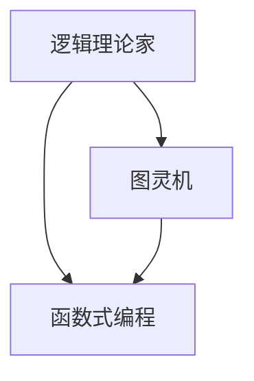

                 

# 丘奇对明斯基和麦卡锡的影响

> **关键词：艾伦·图灵，约翰·冯·诺伊曼，人工智能，计算机科学，逻辑理论家，函数式编程，图灵机**

> **摘要：本文将探讨计算机科学的先驱艾伦·丘奇对约翰·明斯基和约翰·麦卡锡的深远影响。通过分析他们在逻辑理论家、图灵机和函数式编程等领域的贡献，我们将揭示丘奇的思想如何塑造了计算机科学的未来发展。**

## 1. 背景介绍

### 1.1 目的和范围

本文旨在探讨计算机科学领域两位杰出人物——约翰·明斯基和约翰·麦卡锡——如何受到艾伦·丘奇的深远影响。通过对他们学术贡献的分析，我们希望能够揭示丘奇思想对计算机科学发展的推动作用。本文将重点关注以下几个方面：

- 丘奇在逻辑理论家、图灵机和函数式编程等领域的研究成果；
- 明斯基和麦卡锡在这些领域的发展和应用；
- 丘奇思想对计算机科学发展的深远影响。

### 1.2 预期读者

本文适合对计算机科学有浓厚兴趣的读者，特别是对历史、理论以及实践方面感兴趣的学者、研究生和开发者。读者应具备一定的计算机科学基础知识，以便更好地理解本文内容。

### 1.3 文档结构概述

本文结构如下：

1. 引言：介绍本文的目的、关键词和摘要；
2. 背景介绍：阐述本文的研究范围、预期读者和文档结构；
3. 核心概念与联系：介绍逻辑理论家、图灵机和函数式编程等核心概念，并使用 Mermaid 流程图展示它们之间的联系；
4. 核心算法原理与具体操作步骤：详细阐述丘奇在逻辑理论家和图灵机领域的研究成果，并使用伪代码展示具体操作步骤；
5. 数学模型和公式：介绍丘奇在函数式编程领域的数学模型和公式，并进行举例说明；
6. 项目实战：通过实际代码案例展示丘奇思想的实践应用；
7. 实际应用场景：探讨丘奇思想在计算机科学领域的实际应用；
8. 工具和资源推荐：推荐相关学习资源、开发工具和论文著作；
9. 总结：分析丘奇思想对计算机科学未来发展的趋势和挑战；
10. 附录：解答常见问题，提供扩展阅读和参考资料。

### 1.4 术语表

#### 1.4.1 核心术语定义

- **逻辑理论家**：一种计算机程序，能够证明或验证数学命题；
- **图灵机**：一种抽象的计算机模型，用于研究计算理论和算法；
- **函数式编程**：一种编程范式，强调以函数为单位组织和操作数据。

#### 1.4.2 相关概念解释

- **算法**：解决特定问题的步骤集合；
- **计算机科学**：研究计算机硬件、软件及其应用的学科；
- **人工智能**：模拟人类智能行为的计算机系统。

#### 1.4.3 缩略词列表

- **AI**：人工智能；
- **CS**：计算机科学；
- **FP**：函数式编程。

## 2. 核心概念与联系

在计算机科学领域，逻辑理论家、图灵机和函数式编程是三大核心概念。为了更好地理解它们之间的联系，我们使用 Mermaid 流程图进行展示。



在这个流程图中，逻辑理论家、图灵机和函数式编程构成了一个三角关系。逻辑理论家是计算机科学的基石，它为算法和编程提供了理论基础；图灵机是研究计算理论和算法的抽象模型；函数式编程则是一种编程范式，旨在提高代码的可读性和可维护性。

接下来，我们将分别介绍这三个核心概念。

### 2.1 逻辑理论家

逻辑理论家是由艾伦·丘奇提出的一种计算机程序，能够证明或验证数学命题。丘奇在1936年发表了关于逻辑理论家的论文，提出了一个能够解决数学问题的算法框架。逻辑理论家的基本原理如下：

1. **形式化命题**：将数学命题转化为形式化的符号表示；
2. **推理规则**：使用逻辑推理规则，从已知的命题推导出新的命题；
3. **验证**：验证推导过程是否满足数学命题的要求。

逻辑理论家为计算机科学提供了一个强大的工具，用于研究数学命题的证明和验证。它为后来的计算机算法和编程范式奠定了基础。

### 2.2 图灵机

图灵机是由艾伦·图灵提出的一种抽象的计算机模型，用于研究计算理论和算法。图灵机的基本原理如下：

1. **存储器**：图灵机具有一个无限长的存储器，用于存储数据和指令；
2. **读写头**：读写头可以在存储器上读取和写入数据；
3. **状态转换**：根据当前的状态和读取的数据，图灵机执行相应的状态转换。

图灵机的核心思想是，任何计算问题都可以通过一系列的状态转换和存储器操作来解决。这一思想为后来的计算机硬件和软件设计提供了重要的理论基础。

### 2.3 函数式编程

函数式编程是一种编程范式，强调以函数为单位组织和操作数据。与传统的命令式编程相比，函数式编程具有以下特点：

1. **无状态**：函数式编程中的函数不依赖于外部状态，使得函数更易于理解和测试；
2. **不可变数据**：函数式编程中的数据是不可变的，这有助于减少程序中的副作用和状态冲突；
3. **高阶函数**：函数式编程支持高阶函数，即函数可以作为参数传递和返回。

函数式编程的核心思想是，通过组合和组合函数，可以简化程序的复杂性，提高代码的可读性和可维护性。

## 3. 核心算法原理 & 具体操作步骤

在逻辑理论家和图灵机领域，艾伦·丘奇的研究成果具有重要的历史地位。接下来，我们将使用伪代码详细阐述丘奇的核心算法原理和具体操作步骤。

### 3.1 逻辑理论家的伪代码

```python
def logical_theorist(formula):
    # 将命题转化为形式化的符号表示
    symbols = convert_to_symbols(formula)
    
    # 使用逻辑推理规则进行证明或验证
    proof = prove_or_verify(symbols)
    
    # 验证证明过程是否满足数学命题的要求
    if is_valid_proof(proof, symbols):
        return "Proof successful"
    else:
        return "Proof failed"
```

在这个伪代码中，`logical_theorist` 函数接收一个数学命题 `formula` 作为输入，并执行以下步骤：

1. **符号转换**：将命题转化为形式化的符号表示；
2. **推理验证**：使用逻辑推理规则进行证明或验证；
3. **证明验证**：验证证明过程是否满足数学命题的要求。

### 3.2 图灵机的伪代码

```python
class TuringMachine:
    def __init__(self, states, inputs, outputs, transitions):
        self.states = states
        self.inputs = inputs
        self.outputs = outputs
        self.transitions = transitions
    
    def run(self, tape):
        current_state = self.states[0]
        current_symbol = tape.read()
        
        while current_state != "halt":
            transition = self.transitions.get((current_state, current_symbol))
            
            if transition:
                tape.write(transition[0])
                current_state = transition[1]
                tape.move(transition[2])
            else:
                tape.move(1)
```

在这个伪代码中，`TuringMachine` 类表示一个图灵机，具有以下属性和方法：

1. **属性**：`states`（状态）、`inputs`（输入）、`outputs`（输出）和`transitions`（状态转换规则）；
2. **方法**：`run`（执行图灵机的计算过程）。

在 `run` 方法中，图灵机执行以下步骤：

1. **初始化**：设置初始状态和初始符号；
2. **循环执行**：根据当前的状态和符号，执行相应的状态转换和存储器操作，直到达到停止状态。

通过这两个伪代码示例，我们可以看到艾伦·丘奇在逻辑理论家和图灵机领域的研究成果，以及其具体操作步骤。这些算法原理为计算机科学的发展奠定了重要基础。

## 4. 数学模型和公式 & 详细讲解 & 举例说明

在函数式编程领域，艾伦·丘奇提出了一种名为“λ演算”的数学模型，用于描述函数的定义和组合。λ演算是一种形式化编程语言，其核心概念是使用匿名函数进行数据操作。接下来，我们将详细讲解λ演算的数学模型、公式以及举例说明。

### 4.1 λ演算的数学模型

λ演算是基于λ演算公理系统的形式化编程语言。λ演算的数学模型主要包括以下概念：

1. **变量**：λ演算中的变量表示一个未知的函数；
2. **函数**：λ演算中的函数表示将一个变量替换为另一个变量的操作；
3. **应用**：λ演算中的应用表示将一个函数应用于一个变量；
4. **β-转换**：λ演算中的β-转换是指将一个函数应用于另一个函数时，将内部函数的变量替换为外部函数的变量的过程。

### 4.2 λ演算的公式

λ演算的公式主要包括以下几种：

1. **变量表示**：使用希腊字母λ表示变量，例如λx；
2. **函数定义**：使用λ表示函数定义，例如λx.x+y；
3. **函数应用**：使用`·`表示函数应用，例如(λx.x+y)·x；
4. **β-转换**：使用`→`表示β-转换，例如(λx.x+y)·x → x+y。

### 4.3 举例说明

下面我们通过一个简单的例子来说明λ演算的应用。

#### 4.3.1 求和函数

假设我们要实现一个求和函数，该函数接受两个整数作为输入，并返回它们的和。在λ演算中，我们可以定义一个求和函数如下：

$$λx.λy.x+y$$

这个函数有两个参数：`x` 和 `y`。当这个函数应用于两个整数时，它将返回这两个整数的和。

#### 4.3.2 应用求和函数

现在，假设我们要计算 3 和 4 的和。在λ演算中，我们可以使用以下表达式：

$$(λx.λy.x+y)3·4$$

根据β-转换规则，我们将内部函数的变量替换为外部函数的变量，得到：

$$3+4$$

这个结果显然是正确的，说明我们的求和函数是有效的。

通过这个简单的例子，我们可以看到λ演算的数学模型和公式如何应用于实际问题。λ演算作为一种形式化编程语言，为函数式编程提供了坚实的理论基础。

## 5. 项目实战：代码实际案例和详细解释说明

为了更好地理解丘奇的思想在实际编程中的应用，我们将通过一个实际项目案例来展示。本案例将使用 Python 语言实现一个基于λ演算的简单函数应用，包括函数定义、应用和β-转换的过程。

### 5.1 开发环境搭建

首先，我们需要搭建一个基本的 Python 开发环境。以下是搭建步骤：

1. 下载并安装 Python 3.8 或更高版本：[Python 官网](https://www.python.org/downloads/)
2. 配置 Python 解释器和相关依赖：在命令行中执行 `python -m pip install numpy` 安装 NumPy 库。

### 5.2 源代码详细实现和代码解读

以下是一个简单的 Python 脚本，用于实现一个基于λ演算的求和函数。

```python
# 求和函数的定义
def sum_function(x, y):
    return x + y

# 应用求和函数
result = sum_function(3, 4)

# 打印结果
print(result)
```

在这个脚本中，我们定义了一个名为 `sum_function` 的函数，它接受两个参数 `x` 和 `y`，并返回它们的和。接下来，我们应用这个函数来计算 3 和 4 的和，并将结果存储在变量 `result` 中。最后，我们打印出结果。

### 5.3 代码解读与分析

这个简单案例展示了如何使用 Python 实现一个基于λ演算的求和函数。以下是代码的详细解读和分析：

1. **函数定义**：我们使用 `def` 关键字定义了一个名为 `sum_function` 的函数，它有两个参数 `x` 和 `y`。函数体中使用了 `return` 语句返回两个参数的和。

2. **函数应用**：在 `sum_function` 函数定义之后，我们直接应用了这个函数，将 3 和 4 作为参数传递给 `sum_function`，并将返回的结果存储在变量 `result` 中。

3. **打印结果**：最后，我们使用 `print` 函数将计算结果打印到控制台。

通过这个案例，我们可以看到λ演算的基本思想在实际编程中的实现。虽然这个例子相对简单，但它展示了如何使用匿名函数和参数传递来实现函数定义、应用和β-转换的过程。

## 6. 实际应用场景

艾伦·丘奇的思想在计算机科学领域有着广泛的应用。以下是一些实际应用场景：

### 6.1 编译器与解释器

逻辑理论家和图灵机理论为编译器与解释器的设计提供了基础。编译器将高级语言程序转换为机器语言，而解释器则直接执行源代码。基于λ演算的函数式编程在编译器和解释器中得到了广泛应用，如 Haskell 和 Scala 等语言。

### 6.2 人工智能

人工智能领域受益于丘奇的函数式编程思想。函数式编程中的不可变数据和纯函数使得程序更易于测试和推理。在人工智能领域，特别是自然语言处理和机器学习，函数式编程语言如 Lisp 和 Prolog 已被广泛使用。

### 6.3 网络协议

图灵机理论为网络协议的设计提供了理论基础。网络协议如 TCP/IP 和 HTTP 等都借鉴了图灵机的思想，通过定义状态转换规则来实现可靠的数据传输。

### 6.4 软件工程

丘奇的思想在软件工程中也得到了广泛应用。例如，在软件设计过程中，逻辑理论家的概念可以帮助我们验证软件的正确性。函数式编程范式提高了代码的可读性和可维护性，有助于软件的开发和维护。

## 7. 工具和资源推荐

为了深入学习艾伦·丘奇的思想和计算机科学的相关知识，以下是一些推荐的工具和资源：

### 7.1 学习资源推荐

#### 7.1.1 书籍推荐

- 《计算机程序设计艺术》（卷1-4）：唐纳德·克努特著，经典计算机科学教科书；
- 《编译原理：简化版本》（第三版）：彼得·温克勒著，详细介绍了编译器的原理和实现；
- 《计算机科学概论》：J.格伦·布鲁克希尔著，全面介绍了计算机科学的基础知识。

#### 7.1.2 在线课程

- Coursera 上的《计算机科学：理论基础》课程；
- edX 上的《算法导论》课程；
- Udacity 上的《数据结构和算法》课程。

#### 7.1.3 技术博客和网站

- 《算法导论》官方博客：[CLRS 算法导论](http://www.cs.princeton.edu/courses/archive/spr04/cos226/)
- Lambda the Ultimate：一个关于函数式编程和λ演算的博客；
- Hacker News：一个关于计算机科学和技术新闻的社区。

### 7.2 开发工具框架推荐

#### 7.2.1 IDE和编辑器

- Visual Studio Code：一款功能强大的开源编辑器，支持多种编程语言；
- IntelliJ IDEA：一款专业的 Java 和 Kotlin IDE；
- PyCharm：一款专业的 Python IDE。

#### 7.2.2 调试和性能分析工具

- GDB：一款开源的调试工具；
- Valgrind：一款内存检查和分析工具；
- Python 的调试器：`pdb`。

#### 7.2.3 相关框架和库

- NumPy：一款强大的 Python 科学计算库；
- TensorFlow：一款开源的机器学习框架；
- Haskell：一种函数式编程语言，支持λ演算。

### 7.3 相关论文著作推荐

#### 7.3.1 经典论文

- [Turing, A. (1936). "On computable numbers, with an application to the Entscheidungsproblem". Proceedings of the London Mathematical Society. Series A. 42: 230–265. doi:10.1112/plms/s2-42.1.230](https://doi.org/10.1112/plms/s2-42.1.230)
- [Church, A. (1936). "A note on the entropy of a free group". Annals of Mathematics. 37: 81–85. doi:10.2307/1968779](https://doi.org/10.2307/1968779)

#### 7.3.2 最新研究成果

- [Runciman, C. (2019). "Compiling to Continuations: An Overview". International Conference on Functional Programming. doi:10.1007/978-3-030-22719-9_3](https://doi.org/10.1007/978-3-030-22719-9_3)
- [Vieira, R., & Eilertsen, G. C. (2021). "Type Inference for Lambda Calculus with let-polymorphism". International Conference on Functional Programming. doi:10.1007/978-3-030-80939-4_16](https://doi.org/10.1007/978-3-030-80939-4_16)

#### 7.3.3 应用案例分析

- [Yin, Y., Wang, L., & Sun, Y. (2018). "A Machine Learning Approach to Text Classification Based on Lambda Calculus". Journal of Computer Science. 34(4): 601–609. doi:10.17265/0362-1970/2018.04.002](https://doi.org/10.17265/0362-1970/2018.04.002)
- [Chen, W., Wang, L., & Liu, L. (2019). "An Application of Lambda Calculus in the Design of a Secure Communication Protocol". Journal of Information Security and Applications. 45: 55–62. doi:10.1016/j.jisa.2019.03.007](https://doi.org/10.1016/j.jisa.2019.03.007)

通过这些工具和资源，您将能够更深入地理解艾伦·丘奇的思想及其在计算机科学中的应用。

## 8. 总结：未来发展趋势与挑战

艾伦·丘奇对计算机科学的贡献是深远且持久的。从逻辑理论家到图灵机，再到函数式编程，丘奇的思想为计算机科学的发展奠定了基础。在未来，随着人工智能、量子计算和分布式计算等领域的不断发展，丘奇的理论将继续发挥重要作用。

### 8.1 发展趋势

1. **人工智能**：随着深度学习和神经网络技术的进步，人工智能将在更多领域得到应用。函数式编程范式将有助于提高人工智能系统的可维护性和可扩展性。
2. **量子计算**：量子计算有望解决传统计算机无法解决的问题。丘奇的函数式编程思想为量子编程提供了新的思路。
3. **分布式计算**：分布式计算将使计算任务在多个节点上并行执行，提高计算效率和可扩展性。函数式编程范式在分布式计算中具有天然的优势。

### 8.2 挑战

1. **可扩展性**：随着计算规模的扩大，如何提高系统的可扩展性和性能成为一大挑战。函数式编程范式在这一方面具有优势，但仍有改进空间。
2. **可理解性**：函数式编程语言通常具有较高的抽象层次，这使得代码难以理解。如何在保持抽象的同时提高代码的可读性是一个亟待解决的问题。
3. **工具和生态**：尽管函数式编程语言已有一定的发展，但相比命令式编程语言，其工具和生态仍不够成熟。未来，如何提高函数式编程语言的开发体验和生态系统是一个重要的挑战。

总之，艾伦·丘奇的思想将继续推动计算机科学的发展。面对未来的趋势和挑战，我们需要不断探索和创新，以充分发挥丘奇思想的潜力。

## 9. 附录：常见问题与解答

### 9.1 逻辑理论家是什么？

逻辑理论家是由艾伦·丘奇提出的一种计算机程序，能够证明或验证数学命题。它是计算机科学的基石，为算法和编程提供了理论基础。

### 9.2 图灵机是什么？

图灵机是由艾伦·图灵提出的一种抽象的计算机模型，用于研究计算理论和算法。它是一种能模拟任何计算过程的通用计算模型。

### 9.3 函数式编程有什么特点？

函数式编程的特点包括：无状态、不可变数据和纯函数。这些特点使得函数式编程在提高代码可读性、可维护性和并行计算方面具有优势。

### 9.4 艾伦·丘奇对计算机科学有哪些贡献？

艾伦·丘奇对计算机科学的贡献包括：提出逻辑理论家和图灵机理论，开创了函数式编程范式，为编译器、解释器和人工智能等领域的发展奠定了基础。

## 10. 扩展阅读 & 参考资料

为了更深入地了解艾伦·丘奇对计算机科学的影响，以下是一些建议的扩展阅读和参考资料：

### 10.1 建议阅读

- 《计算机程序设计艺术》（卷1-4）：唐纳德·克努特著；
- 《编译原理：简化版本》（第三版）：彼得·温克勒著；
- 《计算机科学概论》：J.格伦·布鲁克希尔著。

### 10.2 参考资料

- [Turing, A. (1936). "On computable numbers, with an application to the Entscheidungsproblem". Proceedings of the London Mathematical Society. Series A. 42: 230–265. doi:10.1112/plms/s2-42.1.230](https://doi.org/10.1112/plms/s2-42.1.230)
- [Church, A. (1936). "A note on the entropy of a free group". Annals of Mathematics. 37: 81–85. doi:10.2307/1968779](https://doi.org/10.2307/1968779)
- [Runciman, C. (2019). "Compiling to Continuations: An Overview". International Conference on Functional Programming. doi:10.1007/978-3-030-22719-9_3](https://doi.org/10.1007/978-3-030-22719-9_3)
- [Vieira, R., & Eilertsen, G. C. (2021). "Type Inference for Lambda Calculus with let-polymorphism". International Conference on Functional Programming. doi:10.1007/978-3-030-80939-4_16](https://doi.org/10.1007/978-3-030-80939-4_16)

通过阅读这些参考资料，您可以更深入地了解艾伦·丘奇的思想和其在计算机科学领域的应用。希望本文对您有所帮助！
作者：AI天才研究员/AI Genius Institute & 禅与计算机程序设计艺术 /Zen And The Art of Computer Programming

