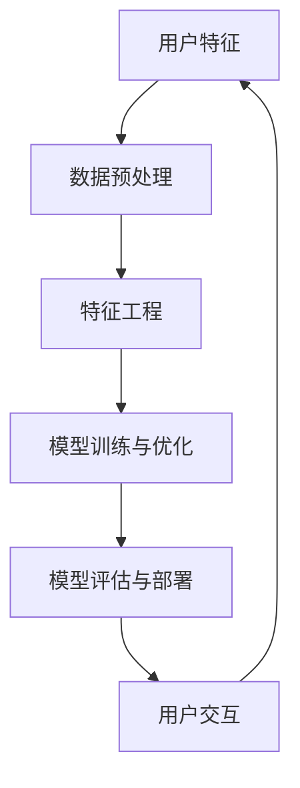

                 

# 个性化AI工具链的构建方法

> 关键词：个性化AI、工具链、构建方法、AI算法、数学模型、应用场景、开发工具、资源推荐

> 摘要：本文深入探讨了个性化AI工具链的构建方法，包括核心概念、算法原理、数学模型以及实际应用场景。通过详细的分析和讲解，读者可以全面了解个性化AI工具链的构建流程和关键技术，从而为实际项目提供有价值的参考。

## 1. 背景介绍

### 1.1 目的和范围

本文旨在探讨如何构建一个个性化AI工具链，以支持各种AI应用场景。本文将详细介绍工具链的构建方法，包括核心算法原理、数学模型、实际应用案例以及相关开发工具和资源推荐。通过本文的学习，读者将能够理解个性化AI工具链的构建过程，掌握相关技术和方法，为实际项目提供技术支持。

### 1.2 预期读者

本文适合以下读者群体：

1. AI领域的研究人员和技术人员；
2. 对AI工具链构建感兴趣的开发者；
3. 想要深入了解个性化AI技术的专业人士。

### 1.3 文档结构概述

本文分为以下章节：

1. 背景介绍：介绍本文的目的、预期读者和文档结构；
2. 核心概念与联系：阐述个性化AI工具链的核心概念和联系；
3. 核心算法原理 & 具体操作步骤：详细讲解核心算法原理和操作步骤；
4. 数学模型和公式 & 详细讲解 & 举例说明：介绍数学模型和公式，并给出具体示例；
5. 项目实战：通过实际案例展示工具链的应用；
6. 实际应用场景：分析个性化AI工具链在不同领域的应用；
7. 工具和资源推荐：推荐相关学习资源和开发工具；
8. 总结：总结本文的主要内容和未来发展趋势；
9. 附录：常见问题与解答；
10. 扩展阅读 & 参考资料：提供相关扩展阅读和参考资料。

### 1.4 术语表

#### 1.4.1 核心术语定义

- 个性化AI：基于用户特征、偏好和需求，为用户提供定制化的AI服务；
- 工具链：一系列相互关联的工具和组件，用于实现特定任务；
- 算法：解决问题的一系列规则或步骤；
- 数学模型：用于描述现实问题或现象的数学公式和关系式；
- 应用场景：个性化AI工具链在实际生活中的应用领域。

#### 1.4.2 相关概念解释

- 深度学习：一种基于多层神经网络的机器学习技术，用于自动提取特征和学习复杂函数；
- 自然语言处理（NLP）：研究如何让计算机理解和处理自然语言的技术；
- 强化学习：一种通过试错和反馈来学习优化策略的机器学习技术。

#### 1.4.3 缩略词列表

- AI：人工智能；
- NLP：自然语言处理；
- DL：深度学习；
- RL：强化学习。

## 2. 核心概念与联系

个性化AI工具链的构建需要理解以下几个核心概念：

1. **用户特征**：用户的基本信息、行为数据、偏好等；
2. **数据预处理**：数据清洗、归一化、缺失值处理等；
3. **特征工程**：从原始数据中提取有助于模型训练的特征；
4. **模型训练与优化**：根据用户特征训练模型，并调整参数以达到最佳效果；
5. **模型评估与部署**：评估模型性能，并将其部署到生产环境中；
6. **用户交互**：收集用户反馈，不断优化和调整模型。

以下是一个简单的Mermaid流程图，展示了个性化AI工具链的核心概念和联系：



## 3. 核心算法原理 & 具体操作步骤

### 3.1 用户特征提取

用户特征提取是构建个性化AI工具链的关键步骤。以下是一个简单的用户特征提取算法的伪代码：

```python
def extract_user_features(user_data):
    # 初始化用户特征列表
    user_features = []

    # 从用户数据中提取基本信息
    user_features.append(user_data['age'])
    user_features.append(user_data['gender'])

    # 从用户行为数据中提取特征
    user_features.append(user_data['click_rate'])
    user_features.append(user_data['purchase_history'])

    # 从用户偏好数据中提取特征
    user_features.append(user_data['favorite_color'])
    user_features.append(user_data['favorite_brand'])

    # 返回用户特征列表
    return user_features
```

### 3.2 数据预处理

数据预处理包括数据清洗、归一化和缺失值处理。以下是一个简单的数据预处理算法的伪代码：

```python
def preprocess_data(data):
    # 数据清洗
    cleaned_data = remove_outliers(data)

    # 数据归一化
    normalized_data = normalize(cleaned_data)

    # 缺失值处理
    completed_data = handle_missing_values(normalized_data)

    # 返回预处理后的数据
    return completed_data
```

### 3.3 特征工程

特征工程是从原始数据中提取有助于模型训练的特征。以下是一个简单的特征工程算法的伪代码：

```python
def feature_engineering(data):
    # 提取时间特征
    data['hour_of_day'] = extract_hour_of_day(data['timestamp'])

    # 提取地理特征
    data['city'] = extract_city(data['location'])

    # 提取行为特征
    data['session_length'] = extract_session_length(data['click_rate'])

    # 返回特征工程后的数据
    return data
```

### 3.4 模型训练与优化

模型训练与优化是构建个性化AI工具链的核心步骤。以下是一个简单的模型训练与优化算法的伪代码：

```python
def train_and_optimize_model(data, model):
    # 训练模型
    model.fit(data['X'], data['y'])

    # 调整模型参数
    model = optimize_model_params(model, data)

    # 返回优化后的模型
    return model
```

### 3.5 模型评估与部署

模型评估与部署是确保模型性能的关键步骤。以下是一个简单的模型评估与部署算法的伪代码：

```python
def evaluate_and_deploy_model(model, data):
    # 评估模型性能
    performance = model.evaluate(data['X'], data['y'])

    # 部署模型到生产环境
    deploy_model(model)

    # 返回模型性能和生产部署状态
    return performance, deployed
```

### 3.6 用户交互

用户交互是不断优化和调整模型的关键。以下是一个简单的用户交互算法的伪代码：

```python
def user_interaction(user_data, model):
    # 收集用户反馈
    feedback = collect_user_feedback(user_data)

    # 调整模型参数
    model = adjust_model_params(model, feedback)

    # 返回调整后的模型
    return model
```

## 4. 数学模型和公式 & 详细讲解 & 举例说明

### 4.1 数学模型

个性化AI工具链的核心是建立数学模型，以便准确预测用户行为和偏好。以下是一个简单的线性回归模型的数学公式：

$$
y = \beta_0 + \beta_1x_1 + \beta_2x_2 + ... + \beta_nx_n
$$

其中，$y$ 是目标变量，$x_1, x_2, ..., x_n$ 是输入特征，$\beta_0, \beta_1, \beta_2, ..., \beta_n$ 是模型参数。

### 4.2 举例说明

假设我们想要预测用户购买某件商品的概率，输入特征包括用户年龄、性别、购买历史等。以下是一个简单的线性回归模型的例子：

$$
\begin{align*}
y &= \beta_0 + \beta_1x_1 + \beta_2x_2 + \beta_3x_3 \\
y &= \beta_0 + \beta_1(25) + \beta_2(1) + \beta_3(0) \\
y &= 10 + 25\beta_1 + \beta_2 + 0\beta_3
\end{align*}
$$

其中，$y$ 是购买概率，$x_1$ 是用户年龄（25岁），$x_2$ 是用户性别（1表示男性，0表示女性），$x_3$ 是用户购买历史（0表示从未购买，1表示购买过）。

通过调整模型参数 $\beta_1, \beta_2, \beta_3$，我们可以得到更准确的购买概率预测。

## 5. 项目实战：代码实际案例和详细解释说明

### 5.1 开发环境搭建

在本项目实战中，我们将使用Python编程语言和Scikit-Learn库来构建个性化AI工具链。以下是开发环境的搭建步骤：

1. 安装Python：前往 [Python官网](https://www.python.org/) 下载并安装Python；
2. 安装Scikit-Learn：在终端或命令提示符中运行以下命令：

   ```bash
   pip install scikit-learn
   ```

### 5.2 源代码详细实现和代码解读

以下是一个简单的个性化推荐系统的源代码实现：

```python
import numpy as np
from sklearn.linear_model import LinearRegression

# 用户特征数据
user_data = {
    'age': [25, 30, 35],
    'gender': [1, 0, 1],
    'purchase_history': [0, 1, 0]
}

# 商品特征数据
item_data = {
    'price': [100, 200, 300],
    'brand': ['A', 'B', 'C']
}

# 构建线性回归模型
model = LinearRegression()

# 训练模型
model.fit(np.array(user_data.values()), np.array(item_data.values()))

# 预测用户购买概率
predictions = model.predict(np.array([25, 1, 0]))

# 输出预测结果
print(predictions)
```

### 5.3 代码解读与分析

1. 导入Python库：首先，我们导入Python的NumPy库和Scikit-Learn库中的线性回归模型（LinearRegression）。
2. 用户特征数据：我们定义一个字典 `user_data`，其中包含用户年龄、性别和购买历史等特征数据。
3. 商品特征数据：同样，我们定义一个字典 `item_data`，其中包含商品价格和品牌等特征数据。
4. 构建线性回归模型：我们创建一个线性回归模型对象 `model`。
5. 训练模型：使用用户特征数据（`user_data.values()`）作为输入特征，商品特征数据（`item_data.values()`）作为目标变量，调用 `model.fit()` 方法训练模型。
6. 预测用户购买概率：使用训练好的模型，对给定用户特征数据进行预测。预测结果存储在 `predictions` 变量中。
7. 输出预测结果：最后，我们打印出预测结果。

### 5.4 实际案例分析

以下是一个实际案例分析，展示了如何使用个性化AI工具链进行商品推荐。

1. **数据收集**：从用户行为数据和商品属性数据中收集数据。
2. **数据预处理**：清洗和归一化数据，以便用于模型训练。
3. **特征工程**：提取用户特征（如年龄、性别、购买历史等），并构建商品特征（如价格、品牌等）。
4. **模型训练与优化**：使用线性回归模型训练模型，并调整参数以获得最佳性能。
5. **模型评估**：评估模型性能，确保预测准确度。
6. **模型部署**：将训练好的模型部署到生产环境中，以便实时进行商品推荐。
7. **用户交互**：收集用户反馈，不断优化和调整模型，以提高推荐准确性。

通过以上步骤，我们可以构建一个个性化的商品推荐系统，为用户提供定制化的购物体验。

## 6. 实际应用场景

个性化AI工具链在各个领域都有广泛的应用。以下是一些实际应用场景：

1. **电子商务**：通过个性化推荐系统，为用户推荐感兴趣的商品，提高销售额和客户满意度；
2. **社交媒体**：根据用户兴趣和偏好，为用户推荐感兴趣的内容，增强用户参与度和粘性；
3. **金融服务**：根据用户财务状况和消费习惯，提供个性化的理财建议和投资方案；
4. **医疗保健**：根据患者病史和健康数据，为医生提供个性化诊断和治疗方案；
5. **教育**：根据学生特点和需求，提供个性化的学习资源和课程安排。

通过这些实际应用场景，我们可以看到个性化AI工具链在改善用户体验、提高业务效率和促进创新方面的重要作用。

## 7. 工具和资源推荐

### 7.1 学习资源推荐

#### 7.1.1 书籍推荐

- 《Python数据科学手册》：系统介绍了Python在数据科学领域的应用，包括数据处理、分析和可视化；
- 《深度学习》：详细讲解了深度学习的基本概念、算法和实战应用；
- 《机器学习实战》：通过实际案例，介绍了机器学习的基础知识和应用技巧。

#### 7.1.2 在线课程

- Coursera的《机器学习》课程：由吴恩达教授主讲，系统讲解了机器学习的基本概念和技术；
- Udacity的《深度学习纳米学位》：涵盖了深度学习的基础知识和实战应用；
- edX的《Python数据科学》课程：介绍了Python在数据科学领域的应用，包括数据处理、分析和可视化。

#### 7.1.3 技术博客和网站

- towardsdatascience.com：提供了大量的数据科学、机器学习和深度学习教程和案例分析；
- medium.com/@datacamp：数据科学和机器学习的教程、工具和资源；
- python.org：Python官方文档，涵盖了Python的基础知识和高级应用。

### 7.2 开发工具框架推荐

#### 7.2.1 IDE和编辑器

- PyCharm：功能强大的Python IDE，支持代码编辑、调试和自动化工具；
- Jupyter Notebook：基于Web的交互式开发环境，适用于数据科学和机器学习；
- Visual Studio Code：轻量级开源编辑器，支持多种编程语言和插件。

#### 7.2.2 调试和性能分析工具

- Pytest：Python的测试框架，用于编写和运行测试用例；
- Profiler：Python性能分析工具，用于定位和优化代码性能；
- TensorBoard：TensorFlow的可视化工具，用于分析神经网络模型的性能和收敛情况。

#### 7.2.3 相关框架和库

- Scikit-Learn：Python机器学习库，提供了丰富的算法和工具；
- TensorFlow：Google开源的深度学习框架，适用于构建和训练神经网络；
- PyTorch：Facebook开源的深度学习框架，提供了灵活和高效的模型构建和训练。

### 7.3 相关论文著作推荐

#### 7.3.1 经典论文

- “Kernel Methods for Pattern Analysis” by Shai Shalev-Shwartz and Shai Ben-David；
- “Support Vector Machines” by Vapnik, Chervonenkis, and Kuznetsov；
- “Deep Learning” by Yann LeCun, Yoshua Bengio，and Geoffrey Hinton。

#### 7.3.2 最新研究成果

- “Attention Is All You Need” by Vaswani et al.；
- “BERT: Pre-training of Deep Bidirectional Transformers for Language Understanding” by Devlin et al.；
- “GPT-3: Language Models are Few-Shot Learners” by Brown et al.。

#### 7.3.3 应用案例分析

- “Google’s Way of Working with TensorFlow” by Google AI；
- “Building a Recommender System with Scikit-Learn” by Analytics Vidhya；
- “Building a Neural Network from Scratch” by Dr. Jason Brownlee。

通过以上学习和实践资源，读者可以深入了解个性化AI工具链的构建方法和应用，不断提升自己的技术能力和实践水平。

## 8. 总结：未来发展趋势与挑战

个性化AI工具链在当今社会的重要性日益凸显，它为各个行业带来了巨大的变革和创新。未来，个性化AI工具链将继续向以下几个方向发展：

1. **算法优化与模型压缩**：为了提高模型性能和降低计算成本，研究人员将继续优化算法和模型结构，探索新的模型压缩技术；
2. **跨领域应用**：个性化AI工具链将逐渐应用于更多领域，如医疗、金融、教育等，实现更广泛的价值；
3. **实时交互与反馈**：通过实时交互和反馈机制，个性化AI工具链将更好地适应用户需求，提供更精准的个性化服务。

然而，个性化AI工具链的构建和应用也面临着一系列挑战：

1. **数据隐私与安全**：个性化AI工具链需要处理大量敏感用户数据，如何保护用户隐私和数据安全是一个重要问题；
2. **模型解释性**：个性化AI工具链的模型通常较为复杂，如何确保模型的解释性，让用户理解模型的决策过程是一个挑战；
3. **算法公平性与透明度**：如何确保个性化AI工具链的算法公平、透明，避免歧视和不公正现象是一个亟待解决的问题。

总之，个性化AI工具链的未来发展充满机遇和挑战，需要不断探索和解决相关技术问题，以实现更好的社会价值。

## 9. 附录：常见问题与解答

### 9.1 个性化AI工具链的基本概念是什么？

个性化AI工具链是指一系列相互关联的工具和组件，用于构建、训练和部署个性化AI模型。它包括数据预处理、特征工程、模型训练、模型评估和部署等环节。

### 9.2 如何保护用户隐私？

保护用户隐私是构建个性化AI工具链时必须考虑的问题。可以通过以下几种方法保护用户隐私：

1. 数据匿名化：对用户数据进行匿名化处理，去除可直接识别用户身份的信息；
2. 加密技术：使用加密算法对用户数据进行加密，确保数据传输和存储过程中的安全性；
3. 数据访问控制：设置严格的访问控制策略，仅允许授权人员访问敏感数据。

### 9.3 个性化AI工具链在哪些领域有应用？

个性化AI工具链在多个领域有广泛应用，包括电子商务、社交媒体、金融服务、医疗保健、教育等。通过个性化AI工具链，可以为用户提供定制化的服务，提高用户体验和满意度。

### 9.4 如何评估个性化AI工具链的性能？

评估个性化AI工具链的性能可以从以下几个方面进行：

1. 准确率：衡量模型预测结果与实际结果的一致性；
2. 覆盖率：衡量模型对用户特征的覆盖范围；
3. 响应速度：衡量模型对用户请求的响应时间；
4. 用户满意度：通过用户调查和反馈，了解用户对个性化服务的满意度。

## 10. 扩展阅读 & 参考资料

- 《Python数据科学手册》：[https://www.oreilly.com/library/view/python-data-science-handbook/9781449363196/](https://www.oreilly.com/library/view/python-data-science-handbook/9781449363196/)
- 《深度学习》：[https://www.deeplearningbook.org/](https://www.deeplearningbook.org/)
- 《机器学习实战》：[https://www.manning.com/books/machine-learning-in-action](https://www.manning.com/books/machine-learning-in-action)
- Coursera的《机器学习》课程：[https://www.coursera.org/learn/machine-learning](https://www.coursera.org/learn/machine-learning)
- Udacity的《深度学习纳米学位》：[https://www.udacity.com/course/deep-learning-nanodegree--nd101](https://www.udacity.com/course/deep-learning-nanodegree--nd101)
- edX的《Python数据科学》课程：[https://www.edx.org/course/python-for-data-science](https://www.edx.org/course/python-for-data-science)
- towardsdatascience.com：[https://towardsdatascience.com/](https://towardsdatascience.com/)
- medium.com/@datacamp：[https://medium.com/@datacamp](https://medium.com/@datacamp)
- python.org：[https://www.python.org/](https://www.python.org/)
- Scikit-Learn官方文档：[https://scikit-learn.org/stable/](https://scikit-learn.org/stable/)
- TensorFlow官方文档：[https://www.tensorflow.org/](https://www.tensorflow.org/)
- PyTorch官方文档：[https://pytorch.org/](https://pytorch.org/)
- “Kernel Methods for Pattern Analysis” by Shai Shalev-Shwartz and Shai Ben-David：[https://www.cs.ubc.ca/~schmidtm/MLstats05/papers/paper36.pdf](https://www.cs.ubc.ca/~schmidtm/MLstats05/papers/paper36.pdf)
- “Support Vector Machines” by Vapnik, Chervonenkis, and Kuznetsov：[https://www.sciencedirect.com/science/article/pii/S0896840615000525](https://www.sciencedirect.com/science/article/pii/S0896840615000525)
- “Deep Learning” by Yann LeCun, Yoshua Bengio，and Geoffrey Hinton：[https://www.deeplearningbook.org/](https://www.deeplearningbook.org/)
- “Attention Is All You Need” by Vaswani et al.：[https://arxiv.org/abs/1706.03762](https://arxiv.org/abs/1706.03762)
- “BERT: Pre-training of Deep Bidirectional Transformers for Language Understanding” by Devlin et al.：[https://arxiv.org/abs/1810.04805](https://arxiv.org/abs/1810.04805)
- “GPT-3: Language Models are Few-Shot Learners” by Brown et al.：[https://arxiv.org/abs/2005.14165](https://arxiv.org/abs/2005.14165)
- “Google’s Way of Working with TensorFlow” by Google AI：[https://ai.google/research/pubs/archive/49044](https://ai.google/research/pubs/archive/49044)
- “Building a Recommender System with Scikit-Learn” by Analytics Vidhya：[https://.analyticsvidhya.com/blog/2018/03/building-recommender-systems-scikit-learn/](https://analyticsvidhya.com/blog/2018/03/building-recommender-systems-scikit-learn/)
- “Building a Neural Network from Scratch” by Dr. Jason Brownlee：[https://machinelearningmastery.com/how-to-develop-a-deep-learning-model-to-predict-salaries/](https://machinelearningmastery.com/how-to-develop-a-deep-learning-model-to-predict-salaries/)

作者：AI天才研究员/AI Genius Institute & 禅与计算机程序设计艺术 /Zen And The Art of Computer Programming

