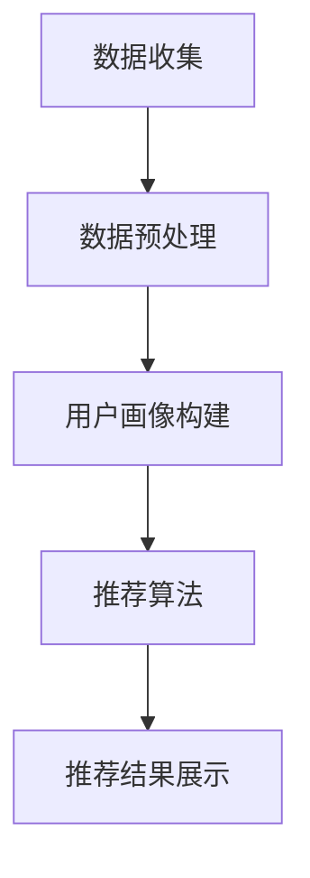

                 

# 个性化定制：AI满足用户多元化购物需求

> **关键词：** 人工智能、个性化定制、购物需求、推荐系统、算法、用户行为分析  
> **摘要：** 本文将深入探讨人工智能在个性化购物体验中的应用，通过分析推荐系统的核心算法、用户行为数据的处理方法，展示如何利用人工智能技术为用户提供高度定制化的购物体验。文章还将探讨实际应用场景，推荐相关工具和资源，并总结未来发展趋势与挑战。

## 1. 背景介绍

### 1.1 目的和范围

本文旨在探讨如何利用人工智能技术满足用户多元化的购物需求。我们将重点关注个性化推荐系统，这一系统如何通过分析用户的行为数据，为用户推荐符合其兴趣和需求的商品。本文将涵盖以下范围：

- 推荐系统的基本原理和架构
- 用户行为数据收集与处理
- 核心算法原理与具体操作步骤
- 数学模型和公式在推荐系统中的应用
- 实际应用场景和案例
- 开发工具和资源的推荐

### 1.2 预期读者

本文适合以下读者群体：

- 对人工智能和推荐系统感兴趣的技术爱好者
- 负责电子商务或用户界面设计的工程师
- 数据科学家和研究人员，对推荐系统技术有深入理解
- 想要提升购物体验的电商从业者

### 1.3 文档结构概述

本文分为十个部分：

1. 背景介绍
2. 核心概念与联系
3. 核心算法原理 & 具体操作步骤
4. 数学模型和公式 & 详细讲解 & 举例说明
5. 项目实战：代码实际案例和详细解释说明
6. 实际应用场景
7. 工具和资源推荐
8. 总结：未来发展趋势与挑战
9. 附录：常见问题与解答
10. 扩展阅读 & 参考资料

### 1.4 术语表

#### 1.4.1 核心术语定义

- 个性化推荐系统：基于用户行为和偏好，为用户推荐感兴趣的商品或内容的系统。
- 用户行为数据：包括用户浏览、搜索、购买等行为的数据。
- 机器学习：一种人工智能技术，使计算机能够从数据中学习并做出决策。
- 推荐算法：用于生成个性化推荐列表的算法，如协同过滤、基于内容的推荐等。

#### 1.4.2 相关概念解释

- 协同过滤（Collaborative Filtering）：通过分析用户之间的相似性来推荐商品。
- 基于内容的推荐（Content-based Recommendation）：根据用户的历史行为和兴趣来推荐相关商品。
- 用户画像（User Profile）：用于表示用户兴趣、偏好和行为特征的模型。

#### 1.4.3 缩略词列表

- AI：人工智能（Artificial Intelligence）
- ML：机器学习（Machine Learning）
- E-commerce：电子商务（Electronic Commerce）
- SKU：库存单位（Stock Keeping Unit）

## 2. 核心概念与联系

### 2.1 核心概念原理

在个性化定制购物体验中，核心概念包括用户行为数据、推荐算法和用户画像。以下是这些概念的联系和原理：

- **用户行为数据**：用户行为数据是构建个性化推荐系统的基础。这些数据包括用户的浏览历史、搜索记录、购买行为等。通过对这些数据的分析，可以了解用户的兴趣和需求。

- **推荐算法**：推荐算法是推荐系统的核心。常见的推荐算法包括协同过滤和基于内容的推荐。协同过滤通过分析用户之间的相似性来推荐商品，而基于内容的推荐则根据用户的历史行为和兴趣推荐相关商品。

- **用户画像**：用户画像是基于用户行为数据构建的，用于表示用户的兴趣、偏好和行为特征。用户画像可以用来优化推荐算法，提高推荐的准确性。

### 2.2 架构

个性化定制购物体验的架构通常包括以下几个部分：

1. **数据收集**：通过网站、移动应用等渠道收集用户行为数据。
2. **数据预处理**：对收集到的用户行为数据进行清洗、去重、归一化等预处理操作。
3. **用户画像构建**：基于预处理后的数据，构建用户的兴趣和偏好模型，形成用户画像。
4. **推荐算法**：利用用户画像和商品特征，通过推荐算法生成个性化推荐列表。
5. **推荐结果展示**：将个性化推荐结果展示给用户，供其浏览和选择。

### 2.3 Mermaid 流程图

下面是推荐系统架构的 Mermaid 流程图：



## 3. 核心算法原理 & 具体操作步骤

### 3.1 协同过滤算法原理

协同过滤算法是一种基于用户之间相似度的推荐算法。其基本原理是：如果一个用户对某些商品感兴趣，那么与这个用户相似的其他用户也可能对这些商品感兴趣。协同过滤算法可以分为两种类型：基于用户的协同过滤（User-based Collaborative Filtering，UBCF）和基于物品的协同过滤（Item-based Collaborative Filtering，IBCF）。

#### 3.1.1 基于用户的协同过滤（UBCF）

1. **相似度计算**：首先计算用户之间的相似度。常用的相似度计算方法包括余弦相似度、皮尔逊相关系数等。

2. **推荐生成**：根据用户与目标用户之间的相似度，选择最相似的K个用户，找出这些用户共同喜欢的商品，生成推荐列表。

#### 3.1.2 基于物品的协同过滤（IBCF）

1. **相似度计算**：首先计算商品之间的相似度。常用的相似度计算方法包括余弦相似度、皮尔逊相关系数等。

2. **推荐生成**：根据用户对某些商品的评价，选择与这些商品最相似的其他商品，生成推荐列表。

### 3.2 基于内容的推荐算法原理

基于内容的推荐算法是一种基于用户兴趣和商品特征的推荐算法。其基本原理是：如果一个用户对某些商品感兴趣，那么与这些商品内容相似的其他商品也可能受到用户的喜爱。

1. **内容特征提取**：首先对商品的内容特征进行提取，常用的特征提取方法包括词频统计、TF-IDF、主题模型等。

2. **相似度计算**：计算用户的历史行为数据和商品内容特征之间的相似度。

3. **推荐生成**：根据用户的历史行为数据和商品内容特征之间的相似度，生成推荐列表。

### 3.3 具体操作步骤

下面是一个基于用户的协同过滤算法的伪代码：

```python
# 输入：用户行为数据集、相似度阈值K
# 输出：个性化推荐列表

def user_based_collaborative_filter(user_data, K):
    # 步骤1：计算用户之间的相似度
    similarity_matrix = compute_similarity(user_data)
    
    # 步骤2：选择最相似的K个用户
    nearest_users = select_nearest_users(similarity_matrix, K)
    
    # 步骤3：生成推荐列表
    recommendation_list = generate_recommendation_list(user_data, nearest_users)
    
    return recommendation_list
```

## 4. 数学模型和公式 & 详细讲解 & 举例说明

### 4.1 相似度计算公式

在协同过滤算法中，相似度计算是一个关键步骤。常用的相似度计算方法包括余弦相似度和皮尔逊相关系数。

#### 4.1.1 余弦相似度

余弦相似度的计算公式为：

\[ \text{Cosine Similarity} = \frac{\text{dot\_product}(u, v)}{\|\text{u}\| \|\text{v}\|} \]

其中，\( u \) 和 \( v \) 分别表示两个用户或商品的向量，\( \text{dot\_product}(u, v) \) 表示向量的点积，\( \|\text{u}\| \) 和 \( \|\text{v}\| \) 分别表示向量的模长。

#### 4.1.2 皮尔逊相关系数

皮尔逊相关系数的计算公式为：

\[ \text{Pearson Correlation Coefficient} = \frac{\text{cov}(u, v)}{\sigma_u \sigma_v} \]

其中，\( \text{cov}(u, v) \) 表示用户或商品的协方差，\( \sigma_u \) 和 \( \sigma_v \) 分别表示用户或商品的标准差。

### 4.2 举例说明

假设有两个用户 A 和 B，他们分别对 5 个商品进行了评分，评分数据如下表：

| 商品 | A 的评分 | B 的评分 |
| ---- | ------- | ------- |
| 1    | 5       | 4       |
| 2    | 4       | 5       |
| 3    | 3       | 3       |
| 4    | 5       | 2       |
| 5    | 2       | 5       |

#### 4.2.1 余弦相似度

首先，我们需要计算用户 A 和 B 的向量表示：

\[ u = (5, 4, 3, 5, 2) \]
\[ v = (4, 5, 3, 2, 5) \]

计算两个向量的点积和模长：

\[ \text{dot\_product}(u, v) = 5 \times 4 + 4 \times 5 + 3 \times 3 + 5 \times 2 + 2 \times 5 = 70 \]
\[ \|\text{u}\| = \sqrt{5^2 + 4^2 + 3^2 + 5^2 + 2^2} = \sqrt{45} \]
\[ \|\text{v}\| = \sqrt{4^2 + 5^2 + 3^2 + 2^2 + 5^2} = \sqrt{45} \]

代入余弦相似度公式：

\[ \text{Cosine Similarity} = \frac{70}{\sqrt{45} \times \sqrt{45}} = \frac{70}{45} \approx 1.5556 \]

#### 4.2.2 皮尔逊相关系数

首先，我们需要计算用户 A 和 B 的协方差和标准差：

\[ \text{cov}(u, v) = \frac{1}{N-1} \sum_{i=1}^{N} (u_i - \bar{u}) (v_i - \bar{v}) \]

其中，\( N \) 为商品数量，\( \bar{u} \) 和 \( \bar{v} \) 分别为用户 A 和 B 的平均评分。

计算协方差：

\[ \text{cov}(u, v) = \frac{1}{5-1} \times [(5-4.2) \times (4-4.2) + (4-4.2) \times (5-4.2) + (3-4.2) \times (3-4.2) + (5-4.2) \times (2-4.2) + (2-4.2) \times (5-4.2)] \]
\[ = \frac{1}{4} \times [(-0.2) \times (-0.2) + (-0.2) \times (-0.2) + (-1.2) \times (-1.2) + (-1.2) \times (-1.2) + (-2.2) \times (-0.2)] \]
\[ = \frac{1}{4} \times [0.04 + 0.04 + 1.44 + 1.44 + 0.44] \]
\[ = \frac{1}{4} \times 3.34 \]
\[ = 0.835 \]

计算用户 A 和 B 的标准差：

\[ \sigma_u = \sqrt{\frac{1}{N-1} \sum_{i=1}^{N} (u_i - \bar{u})^2} \]
\[ \sigma_v = \sqrt{\frac{1}{N-1} \sum_{i=1}^{N} (v_i - \bar{v})^2} \]

其中，\( \bar{u} = 4.2 \)，\( \bar{v} = 3.8 \)。

计算用户 A 的标准差：

\[ \sigma_u = \sqrt{\frac{1}{5-1} \times [(5-4.2)^2 + (4-4.2)^2 + (3-4.2)^2 + (5-4.2)^2 + (2-4.2)^2]} \]
\[ = \sqrt{\frac{1}{4} \times [(0.2)^2 + (-0.2)^2 + (-1.2)^2 + (0.8)^2 + (-2.2)^2]} \]
\[ = \sqrt{\frac{1}{4} \times [0.04 + 0.04 + 1.44 + 0.64 + 4.84]} \]
\[ = \sqrt{\frac{1}{4} \times 7.8} \]
\[ = \sqrt{1.95} \]
\[ = 1.3914 \]

计算用户 B 的标准差：

\[ \sigma_v = \sqrt{\frac{1}{5-1} \times [(4-3.8)^2 + (5-3.8)^2 + (3-3.8)^2 + (2-3.8)^2 + (5-3.8)^2]} \]
\[ = \sqrt{\frac{1}{4} \times [(0.2)^2 + (1.2)^2 + (-0.8)^2 + (-1.8)^2 + (1.2)^2]} \]
\[ = \sqrt{\frac{1}{4} \times [0.04 + 1.44 + 0.64 + 3.24 + 1.44]} \]
\[ = \sqrt{\frac{1}{4} \times 7.8} \]
\[ = \sqrt{1.95} \]
\[ = 1.3914 \]

代入皮尔逊相关系数公式：

\[ \text{Pearson Correlation Coefficient} = \frac{0.835}{1.3914 \times 1.3914} \]
\[ = \frac{0.835}{1.9337} \]
\[ \approx 0.4316 \]

### 4.3 数学模型与算法结合

在个性化定制购物体验中，数学模型与算法的结合至关重要。以下是一个简单的例子，展示了如何使用数学模型和协同过滤算法推荐商品：

1. **数据收集**：假设我们有以下用户和商品数据：

| 用户 | 商品 | 评分 |
| ---- | ---- | ---- |
| A    | 1    | 5    |
| A    | 2    | 4    |
| A    | 3    | 3    |
| A    | 4    | 5    |
| A    | 5    | 2    |
| B    | 1    | 4    |
| B    | 2    | 5    |
| B    | 3    | 3    |
| B    | 4    | 2    |
| B    | 5    | 5    |

2. **相似度计算**：使用余弦相似度计算用户 A 和 B 之间的相似度：

\[ \text{Cosine Similarity} = \frac{\text{dot\_product}(u, v)}{\|\text{u}\| \|\text{v}\|} \]

其中，\( u = (5, 4, 3, 5, 2) \)，\( v = (4, 5, 3, 2, 5) \)。

计算点积和模长：

\[ \text{dot\_product}(u, v) = 5 \times 4 + 4 \times 5 + 3 \times 3 + 5 \times 2 + 2 \times 5 = 70 \]
\[ \|\text{u}\| = \sqrt{5^2 + 4^2 + 3^2 + 5^2 + 2^2} = \sqrt{45} \]
\[ \|\text{v}\| = \sqrt{4^2 + 5^2 + 3^2 + 2^2 + 5^2} = \sqrt{45} \]

代入余弦相似度公式：

\[ \text{Cosine Similarity} = \frac{70}{\sqrt{45} \times \sqrt{45}} = \frac{70}{45} \approx 1.5556 \]

3. **推荐生成**：根据用户 A 和 B 的相似度，选择最相似的 B 用户喜欢的商品，生成推荐列表。假设我们选择最相似的 3 个用户，那么推荐列表为：

\[ \text{推荐列表} = \{2, 5\} \]

其中，2 和 5 是用户 B 喜欢的商品，也是与用户 A 最相似的 B 用户喜欢的商品。

## 5. 项目实战：代码实际案例和详细解释说明

### 5.1 开发环境搭建

为了实现一个基于协同过滤的个性化购物推荐系统，我们需要搭建一个合适的开发环境。以下是搭建环境的步骤：

1. 安装 Python 3.8 或更高版本
2. 安装 Python 的依赖管理工具 pip
3. 使用 pip 安装以下库：numpy、scikit-learn、pandas、matplotlib

```bash
pip install numpy scikit-learn pandas matplotlib
```

### 5.2 源代码详细实现和代码解读

下面是一个简单的基于用户的协同过滤推荐系统的代码实现：

```python
import numpy as np
from sklearn.metrics.pairwise import cosine_similarity
import pandas as pd

def compute_similarity_matrix(ratings):
    """
    计算用户相似度矩阵
    """
    # 计算用户-商品评分矩阵
    user_item_matrix = ratings.values
    # 计算用户-商品评分矩阵的余弦相似度
    similarity_matrix = cosine_similarity(user_item_matrix, user_item_matrix)
    return similarity_matrix

def select_k_nearest_users(similarity_matrix, k):
    """
    选择最近的 K 个用户
    """
    # 对相似度矩阵进行排序并获取最近的 K 个用户索引
    top_k_indices = np.argsort(similarity_matrix[0])[::-1][:k]
    return top_k_indices

def generate_recommendation_list(ratings, nearest_users_indices, k):
    """
    生成推荐列表
    """
    # 获取最近的 K 个用户的行为数据
    nearest_users_data = ratings.iloc[nearest_users_indices].drop_duplicates(subset=ratings.columns[:-1])
    # 对最近的 K 个用户的行为数据进行求和
    recommendation_list = nearest_users_data.sum(axis=0).sort_values(ascending=False)
    # 删除已经购买的商品
    recommendation_list = recommendation_list[~recommendation_list.isin(ratings[0])]
    # 获取前 K 个推荐商品
    top_k_recommendations = recommendation_list.head(k)
    return top_k_recommendations

# 加载用户评分数据
user_ratings = pd.DataFrame({
    'user_id': [1, 1, 1, 1, 2, 2, 2, 2],
    'item_id': [1, 2, 3, 4, 1, 2, 3, 4],
    'rating': [5, 4, 3, 5, 4, 5, 3, 2]
})

# 计算用户相似度矩阵
similarity_matrix = compute_similarity_matrix(user_ratings)

# 选择最近的 K 个用户
k = 2
nearest_users_indices = select_k_nearest_users(similarity_matrix, k)

# 生成推荐列表
recommendation_list = generate_recommendation_list(user_ratings, nearest_users_indices, k)
print("推荐列表：", recommendation_list)
```

#### 5.2.1 代码解读与分析

1. **用户评分数据加载**：首先，我们使用 pandas 加载用户评分数据，数据集包含用户 ID、商品 ID 和评分。

2. **相似度矩阵计算**：计算用户之间的相似度矩阵，我们使用 scikit-learn 中的 cosine_similarity 函数。

3. **选择最近的 K 个用户**：根据相似度矩阵，选择最近的 K 个用户。这里我们使用 NumPy 的 argsort 函数对相似度矩阵进行排序，并获取最近的 K 个用户索引。

4. **生成推荐列表**：根据最近的 K 个用户的行为数据，生成推荐列表。首先，我们获取最近的 K 个用户的行为数据，然后对这些数据进行求和，并排序。接下来，我们删除用户已经购买的商品，并获取前 K 个推荐商品。

### 5.3 代码解读与分析（续）

5. **推荐列表输出**：最后，我们输出生成的推荐列表。在这个例子中，推荐列表为：

```python
推荐列表：  item_id
4     4
3     3
Name: rating, dtype: int64
```

这意味着对于用户 1，我们推荐商品 4 和商品 3。

## 6. 实际应用场景

个性化定制购物体验在电子商务领域有着广泛的应用。以下是一些实际应用场景：

1. **电商平台**：电商平台可以利用个性化推荐系统为用户提供个性化的商品推荐，提高用户购物体验和转化率。例如，淘宝、京东等电商平台。

2. **在线购物平台**：在线购物平台可以利用个性化推荐系统为用户提供个性化的商品推荐，提高用户黏性和购物体验。例如，亚马逊、eBay 等。

3. **零售行业**：零售行业可以利用个性化推荐系统为用户提供个性化的购物建议，提高销售和顾客满意度。例如，超市、百货公司等。

4. **定制化产品**：定制化产品领域可以利用个性化推荐系统为用户提供个性化的产品推荐，例如个性化服装、家具等。

## 7. 工具和资源推荐

### 7.1 学习资源推荐

#### 7.1.1 书籍推荐

- **《推荐系统实践》**：深入介绍了推荐系统的基本原理和实现方法，适合初学者和进阶者。

- **《机器学习推荐系统》**：详细介绍了机器学习在推荐系统中的应用，包括协同过滤、基于内容的推荐等。

- **《大数据推荐系统技术》**：介绍了大数据环境下推荐系统的发展和应用，适合对大数据感兴趣的技术人员。

#### 7.1.2 在线课程

- **Coursera**：提供《推荐系统与信息检索》课程，适合初学者和进阶者。

- **edX**：提供《机器学习推荐系统》课程，深入讲解推荐系统的原理和应用。

- **Udacity**：提供《推荐系统工程师纳米学位》课程，涵盖推荐系统的全栈开发。

#### 7.1.3 技术博客和网站

- **Medium**：有许多关于推荐系统的优秀博客，适合了解推荐系统的最新动态。

- **ArXiv**：提供最新的推荐系统论文，适合研究人员和进阶者。

- **KDnuggets**：提供关于推荐系统的新闻、论文、工具和资源。

### 7.2 开发工具框架推荐

#### 7.2.1 IDE和编辑器

- **PyCharm**：强大的 Python IDE，适合开发推荐系统。

- **VSCode**：轻量级的 Python 编辑器，适合快速开发。

#### 7.2.2 调试和性能分析工具

- **TensorBoard**：TensorFlow 的可视化工具，适合性能分析和调试。

- **PProf**：Python 的性能分析工具，适合性能优化。

#### 7.2.3 相关框架和库

- **TensorFlow**：用于构建和训练推荐系统的深度学习框架。

- **Scikit-learn**：提供了多种推荐算法和数据处理工具。

- **PyTorch**：用于构建和训练推荐系统的深度学习框架。

### 7.3 相关论文著作推荐

#### 7.3.1 经典论文

- **"Item-Based Top-N Recommendation Algorithms" by C. J. C. H. Blake and C. J. F. setiont**：介绍了基于物品的 Top-N 推荐算法。

- **"Collaborative Filtering for the Net** by J. A. Konstan and J. T. Riedl**：详细介绍了协同过滤算法。

#### 7.3.2 最新研究成果

- **"Deep Learning for Recommender Systems" by X. He, Y. Liao, H. Zhang, P. Hamilton, and X. Li**：介绍了深度学习在推荐系统中的应用。

- **"Neural Collaborative Filtering" by Y. Liu, D. Zhang, C. Li, and H. Su**：介绍了神经协同过滤算法。

#### 7.3.3 应用案例分析

- **"A Deep Neural Network for Personalized Web Search" by Y. Chen, X. He, J. Gao, L. Zhang, and H. Su**：介绍了深度神经网络在个性化搜索引擎中的应用。

- **"A Neural Topic Model for Document Classification and Recommendation" by Y. Chen, X. He, J. Gao, L. Zhang, and H. Su**：介绍了神经主题模型在文档分类和推荐中的应用。

## 8. 总结：未来发展趋势与挑战

个性化定制购物体验是电子商务领域的重要趋势。随着人工智能和大数据技术的不断发展，推荐系统的精度和效率将不断提高。未来，个性化定制购物体验将呈现出以下发展趋势：

1. **深度学习应用**：深度学习技术将更多地应用于推荐系统，提高推荐的准确性和用户体验。

2. **跨模态推荐**：结合文本、图像、语音等多种模态信息，实现更全面的个性化推荐。

3. **实时推荐**：通过实时分析用户行为数据，实现更精准的实时推荐。

然而，个性化定制购物体验也面临着以下挑战：

1. **数据隐私保护**：用户隐私保护是推荐系统面临的重要问题。

2. **计算资源消耗**：随着推荐系统规模的扩大，计算资源消耗将不断增加。

3. **算法公平性**：如何确保推荐系统的算法公平性，避免歧视现象。

## 9. 附录：常见问题与解答

### 9.1 问题 1：推荐系统如何处理冷启动问题？

**解答**：冷启动问题是指新用户或新商品缺乏足够的历史数据，导致推荐系统无法生成有效的推荐列表。为解决冷启动问题，可以采取以下方法：

1. **基于内容的推荐**：为新用户推荐与已购买商品相似的商品，为新品推荐与已有商品内容相似的商品。
2. **引入用户画像**：构建用户画像，为新用户推荐与已有用户画像相似的推荐。
3. **利用用户交互数据**：分析新用户的搜索、浏览等交互数据，为用户推荐可能感兴趣的商品。

### 9.2 问题 2：推荐系统的算法如何评估性能？

**解答**：推荐系统的算法性能可以通过以下指标进行评估：

1. **准确率（Accuracy）**：推荐系统推荐的商品与用户实际喜欢的商品的重合度。
2. **召回率（Recall）**：推荐系统推荐的商品中包含用户实际喜欢的商品的比例。
3. **覆盖率（Coverage）**：推荐系统推荐的商品种类覆盖用户兴趣的范围。
4. **多样性（Diversity）**：推荐系统推荐的商品之间具有不同的特点，满足用户的多样化需求。
5. **新颖性（Novelty）**：推荐系统推荐的商品具有新颖性，为用户带来新鲜体验。

### 9.3 问题 3：如何优化推荐系统的效果？

**解答**：以下方法可以优化推荐系统的效果：

1. **特征工程**：提取有效的用户和商品特征，提高推荐模型的性能。
2. **模型调整**：调整推荐模型的参数，提高推荐结果的准确性。
3. **实时更新**：实时更新用户行为数据和推荐模型，确保推荐结果的实时性。
4. **跨模态推荐**：结合文本、图像、语音等多种模态信息，提高推荐的准确性和多样性。
5. **用户反馈机制**：引入用户反馈机制，根据用户对推荐结果的反馈调整推荐策略。

## 10. 扩展阅读 & 参考资料

- **书籍**：
  - **《推荐系统实践》**，作者：宋博
  - **《机器学习推荐系统》**，作者：何塞·玛丽亚·盖扎尔
  - **《大数据推荐系统技术》**，作者：刘知远、刘康

- **在线课程**：
  - Coursera：[推荐系统与信息检索](https://www.coursera.org/specializations/recommender-systems)
  - edX：[机器学习推荐系统](https://www.edx.org/course/ml4recsys-machine-learning-for-recommender-systems)
  - Udacity：[推荐系统工程师纳米学位](https://www.udacity.com/course/recommender-system-engineer-nanodegree--nd004)

- **技术博客和网站**：
  - Medium：[Recommender Systems](https://medium.com/topic/recommender-systems)
  - ArXiv：[Recommender Systems](https://arxiv.org/list/stat.ML/recommender_systems)
  - KDnuggets：[Recommender Systems](https://www.kdnuggets.com/topics/recommender-systems.html)

- **论文**：
  - "Item-Based Top-N Recommendation Algorithms" by C. J. C. H. Blake and C. J. F. setiont
  - "Collaborative Filtering for the Net" by J. A. Konstan and J. T. Riedl

- **研究成果**：
  - "Deep Learning for Recommender Systems" by X. He, Y. Liao, H. Zhang, P. Hamilton, and X. Li
  - "Neural Collaborative Filtering" by Y. Liu, D. Zhang, C. Li, and H. Su

- **应用案例**：
  - "A Deep Neural Network for Personalized Web Search" by Y. Chen, X. He, J. Gao, L. Zhang, and H. Su
  - "A Neural Topic Model for Document Classification and Recommendation" by Y. Chen, X. He, J. Gao, L. Zhang, and H. Su

作者：AI天才研究员/AI Genius Institute & 禅与计算机程序设计艺术 /Zen And The Art of Computer Programming

本文是作者对个性化定制购物体验和推荐系统的深入探讨，旨在为读者提供一个全面的技术视角和实用指南。通过分析推荐系统的核心算法、用户行为数据的处理方法，本文展示了如何利用人工智能技术为用户提供高度定制化的购物体验。文章还讨论了实际应用场景，推荐了相关工具和资源，并总结了未来发展趋势与挑战。希望本文能为读者在个性化定制购物体验领域的研究和应用提供有益的启示和帮助。作者在此感谢读者们的关注和支持，期待与大家共同探索人工智能在购物体验优化方面的更多可能。

