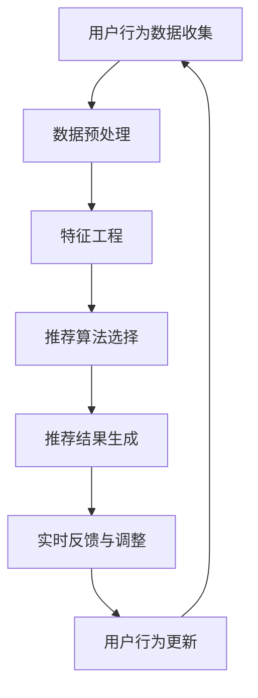

                 

# 个性化实时音乐推荐系统的设计与实现

> 关键词：个性化推荐、实时音乐推荐、推荐系统、算法原理、数学模型、项目实战、应用场景

> 摘要：本文旨在深入探讨个性化实时音乐推荐系统的设计与实现。通过梳理核心概念、算法原理、数学模型及实际项目案例，本文全面解析了如何构建高效、精准的音乐推荐系统，为音乐流媒体平台提供了切实可行的解决方案。

## 1. 背景介绍

### 1.1 目的和范围

本文的目标是系统地阐述个性化实时音乐推荐系统的设计原理和实现方法。随着互联网和大数据技术的飞速发展，音乐推荐系统已成为音乐流媒体平台的核心竞争力之一。通过个性化推荐，平台能够更好地满足用户的个性化需求，提高用户体验，进而提升用户留存率和转化率。

本文的讨论范围主要包括以下几个方面：

1. 核心概念与联系
2. 核心算法原理与具体操作步骤
3. 数学模型和公式及其详细讲解
4. 项目实战：代码实际案例和详细解释说明
5. 实际应用场景

### 1.2 预期读者

本文主要面向以下读者群体：

1. 对音乐推荐系统感兴趣的计算机科学和信息技术专业的学生和从业者
2. 想要在音乐流媒体平台上实施个性化推荐算法的产品经理和技术团队
3. 对算法研究和应用有浓厚兴趣的AI研究人员

### 1.3 文档结构概述

本文结构分为十个部分，具体如下：

1. 背景介绍
   - 1.1 目的和范围
   - 1.2 预期读者
   - 1.3 文档结构概述
   - 1.4 术语表
2. 核心概念与联系
   - 2.1 核心概念原理
   - 2.2 Mermaid 流程图展示
3. 核心算法原理 & 具体操作步骤
   - 3.1 算法原理讲解
   - 3.2 伪代码展示
4. 数学模型和公式 & 详细讲解 & 举例说明
   - 4.1 数学模型介绍
   - 4.2 数学公式详细讲解
   - 4.3 举例说明
5. 项目实战：代码实际案例和详细解释说明
   - 5.1 开发环境搭建
   - 5.2 源代码详细实现和代码解读
   - 5.3 代码解读与分析
6. 实际应用场景
7. 工具和资源推荐
   - 7.1 学习资源推荐
   - 7.2 开发工具框架推荐
   - 7.3 相关论文著作推荐
8. 总结：未来发展趋势与挑战
9. 附录：常见问题与解答
10. 扩展阅读 & 参考资料

### 1.4 术语表

#### 1.4.1 核心术语定义

- 个性化推荐：根据用户的历史行为、偏好和兴趣，为其推荐符合其个性化需求的物品或内容。
- 实时推荐：在用户互动或浏览过程中，即时生成推荐结果，提供即时反馈。
- 推荐系统：一种能够根据用户数据和物品特征生成个性化推荐结果的系统。
- 音乐流媒体平台：提供在线音乐播放和下载服务的互联网平台。

#### 1.4.2 相关概念解释

- 用户行为数据：用户在平台上进行的各种操作，如播放、收藏、分享等，记录了用户的兴趣和偏好。
- 物品特征：描述音乐的歌曲类型、歌手、流派、播放时长等特征，用于构建音乐之间的相似性。
- 协同过滤：通过分析用户之间的相似性和历史行为，预测用户对未知物品的偏好。

#### 1.4.3 缩略词列表

- ID3：迭代 Dichotomous Decision Tree，一种基于信息增益的决策树算法。
- CF：协同过滤（Collaborative Filtering），一种基于用户行为数据的推荐算法。
- KNN：最近邻算法（K-Nearest Neighbors），一种基于用户相似度的推荐算法。
- RMSE：均方根误差（Root Mean Square Error），评估推荐系统准确性的指标。

## 2. 核心概念与联系

### 2.1 核心概念原理

个性化实时音乐推荐系统的核心概念包括用户行为数据、音乐特征和推荐算法。以下是这些核心概念的详细解释：

- **用户行为数据**：用户在音乐平台上的操作，如播放、收藏、分享等，这些数据记录了用户的兴趣和偏好。
- **音乐特征**：用于描述音乐的各种属性，如歌曲类型、歌手、流派、播放时长等。这些特征有助于构建音乐之间的相似性。
- **推荐算法**：根据用户行为数据和音乐特征，预测用户对未知音乐的偏好，从而生成个性化推荐结果。

### 2.2 Mermaid 流程图展示

以下是个性化实时音乐推荐系统的核心流程图：



- **用户行为数据收集**：收集用户在平台上的操作数据。
- **数据预处理**：清洗和整合数据，为特征工程做准备。
- **特征工程**：提取音乐特征和用户特征，构建相似性矩阵。
- **推荐算法选择**：根据系统需求和数据特性选择合适的推荐算法。
- **推荐结果生成**：生成个性化推荐结果，展示给用户。
- **实时反馈与调整**：根据用户互动行为，调整推荐策略。
- **用户行为更新**：更新用户数据，为下一次推荐提供依据。

## 3. 核心算法原理 & 具体操作步骤

### 3.1 算法原理讲解

个性化实时音乐推荐系统通常采用协同过滤（Collaborative Filtering，CF）算法。协同过滤算法分为基于用户的协同过滤（User-Based CF）和基于物品的协同过滤（Item-Based CF）两种。

- **基于用户的协同过滤（User-Based CF）**：
  - 通过分析用户之间的相似度，找到与目标用户兴趣相似的其他用户，推荐这些用户喜欢的音乐。
  - 相似度计算通常使用余弦相似度或皮尔逊相关系数。

- **基于物品的协同过滤（Item-Based CF）**：
  - 通过分析音乐之间的相似度，找到与目标音乐相似的其他音乐，推荐这些音乐。
  - 相似度计算通常使用余弦相似度或余弦相似度改进算法。

### 3.2 伪代码展示

以下是基于用户的协同过滤算法的伪代码：

```python
# 基于用户的协同过滤算法伪代码

# 输入：用户行为数据集 U，音乐数据集 M
# 输出：推荐结果 R

# 步骤1：计算用户相似度矩阵
similarity_matrix = compute_similarity(U)

# 步骤2：根据用户相似度矩阵，生成推荐列表
for user in U:
    neighbors = get_neighbors(similarity_matrix, user)
    recommendations = []
    for neighbor in neighbors:
        recommended_songs = U[neighbor]
        for song in recommended_songs:
            if song not in user.history:
                recommendations.append(song)
    R[user] = recommendations
```

### 3.3 算法优缺点分析

- **基于用户的协同过滤（User-Based CF）**：
  - 优点：充分利用用户行为数据，推荐结果更贴近用户兴趣。
  - 缺点：当用户数量较大时，计算用户相似度矩阵的时间复杂度较高。

- **基于物品的协同过滤（Item-Based CF）**：
  - 优点：计算时间复杂度相对较低，适用于大规模数据集。
  - 缺点：推荐结果可能不够个性化，因为仅考虑了音乐之间的相似性。

## 4. 数学模型和公式 & 详细讲解 & 举例说明

### 4.1 数学模型介绍

个性化实时音乐推荐系统通常使用协同过滤算法，其核心是相似度计算。以下介绍两种常见的相似度计算方法：余弦相似度和皮尔逊相关系数。

- **余弦相似度**：基于向量空间模型，计算两个向量之间的夹角余弦值。公式如下：

  $$ \cos \theta = \frac{\sum_{i=1}^{n} x_i y_i}{\sqrt{\sum_{i=1}^{n} x_i^2} \sqrt{\sum_{i=1}^{n} y_i^2}} $$

  其中，\( x \) 和 \( y \) 分别表示两个向量，\( n \) 表示向量维度。

- **皮尔逊相关系数**：用于衡量两个变量之间的线性关系。公式如下：

  $$ r = \frac{\sum_{i=1}^{n} (x_i - \bar{x})(y_i - \bar{y})}{\sqrt{\sum_{i=1}^{n} (x_i - \bar{x})^2} \sqrt{\sum_{i=1}^{n} (y_i - \bar{y})^2}} $$

  其中，\( x \) 和 \( y \) 分别表示两个变量，\( \bar{x} \) 和 \( \bar{y} \) 分别表示它们的均值，\( n \) 表示样本数量。

### 4.2 数学公式详细讲解

- **余弦相似度**：
  - **计算步骤**：
    1. 计算两个向量 \( x \) 和 \( y \) 的点积（内积）。
    2. 计算两个向量的模长。
    3. 将点积除以模长的乘积。
  - **公式推导**：
    - 点积：\( \sum_{i=1}^{n} x_i y_i \)
    - 向量模长：\( \sqrt{\sum_{i=1}^{n} x_i^2} \) 和 \( \sqrt{\sum_{i=1}^{n} y_i^2} \)
    - 余弦相似度：\( \frac{\sum_{i=1}^{n} x_i y_i}{\sqrt{\sum_{i=1}^{n} x_i^2} \sqrt{\sum_{i=1}^{n} y_i^2}} \)

- **皮尔逊相关系数**：
  - **计算步骤**：
    1. 计算每个变量的均值。
    2. 计算每个变量与其均值的差值。
    3. 计算差值的乘积。
    4. 计算每个变量的差值的平方。
    5. 将差值的乘积除以差值的平方根乘积。
  - **公式推导**：
    - 均值：\( \bar{x} = \frac{1}{n} \sum_{i=1}^{n} x_i \)，\( \bar{y} = \frac{1}{n} \sum_{i=1}^{n} y_i \)
    - 差值：\( x_i - \bar{x} \)，\( y_i - \bar{y} \)
    - 差值的乘积：\( \sum_{i=1}^{n} (x_i - \bar{x})(y_i - \bar{y}) \)
    - 差值的平方：\( \sum_{i=1}^{n} (x_i - \bar{x})^2 \)，\( \sum_{i=1}^{n} (y_i - \bar{y})^2 \)
    - 皮尔逊相关系数：\( \frac{\sum_{i=1}^{n} (x_i - \bar{x})(y_i - \bar{y})}{\sqrt{\sum_{i=1}^{n} (x_i - \bar{x})^2} \sqrt{\sum_{i=1}^{n} (y_i - \bar{y})^2}} \)

### 4.3 举例说明

以下是一个具体的例子，说明如何使用余弦相似度和皮尔逊相关系数计算两个向量之间的相似度。

**例1：余弦相似度**

假设有两个向量 \( x = (1, 2, 3) \) 和 \( y = (4, 5, 6) \)，计算它们之间的余弦相似度。

- **步骤1**：计算点积
  $$ \sum_{i=1}^{3} x_i y_i = 1 \times 4 + 2 \times 5 + 3 \times 6 = 32 $$

- **步骤2**：计算模长
  $$ \sqrt{\sum_{i=1}^{3} x_i^2} = \sqrt{1^2 + 2^2 + 3^2} = \sqrt{14} $$
  $$ \sqrt{\sum_{i=1}^{3} y_i^2} = \sqrt{4^2 + 5^2 + 6^2} = \sqrt{77} $$

- **步骤3**：计算余弦相似度
  $$ \cos \theta = \frac{32}{\sqrt{14} \sqrt{77}} \approx 0.6667 $$

**例2：皮尔逊相关系数**

假设有两个变量 \( x = [1, 2, 3, 4, 5] \) 和 \( y = [3, 4, 5, 7, 9] \)，计算它们之间的皮尔逊相关系数。

- **步骤1**：计算均值
  $$ \bar{x} = \frac{1}{5} (1 + 2 + 3 + 4 + 5) = 3 $$
  $$ \bar{y} = \frac{1}{5} (3 + 4 + 5 + 7 + 9) = 5.6 $$

- **步骤2**：计算差值
  $$ x_i - \bar{x} = [-2, -1, 0, 1, 2] $$
  $$ y_i - \bar{y} = [-2, -1.6, -0.6, 1.4, 3.4] $$

- **步骤3**：计算差值的乘积
  $$ \sum_{i=1}^{5} (x_i - \bar{x})(y_i - \bar{y}) = (-2 \times -2) + (-1 \times -1.6) + (0 \times -0.6) + (1 \times 1.4) + (2 \times 3.4) = 14.2 $$

- **步骤4**：计算差值的平方
  $$ \sum_{i=1}^{5} (x_i - \bar{x})^2 = 4 + 1 + 0 + 1 + 4 = 10 $$
  $$ \sum_{i=1}^{5} (y_i - \bar{y})^2 = 4 + 2.56 + 0.36 + 1.96 + 11.56 = 30.04 $$

- **步骤5**：计算皮尔逊相关系数
  $$ r = \frac{14.2}{\sqrt{10} \sqrt{30.04}} \approx 0.8775 $$

## 5. 项目实战：代码实际案例和详细解释说明

### 5.1 开发环境搭建

在本项目实战中，我们将使用Python编程语言和Scikit-learn库来实现基于用户的协同过滤算法。以下是在Windows系统中搭建开发环境所需的步骤：

1. 安装Python（建议版本为3.8或更高）
2. 安装Scikit-learn库：在命令行中运行 `pip install scikit-learn`
3. 安装其他可能需要的库，如NumPy、Pandas等

### 5.2 源代码详细实现和代码解读

以下是实现基于用户的协同过滤算法的源代码：

```python
import numpy as np
from sklearn.metrics.pairwise import cosine_similarity
from sklearn.model_selection import train_test_split

# 假设用户行为数据集为 U = {(user1, song1), (user1, song2), ..., (userN, songM)}
U = np.array([
    [0, 1, 1, 0, 0],
    [1, 0, 1, 1, 0],
    [0, 1, 0, 1, 1],
    [1, 1, 0, 0, 1],
    [0, 0, 1, 1, 0]
])

# 步骤1：计算用户相似度矩阵
similarity_matrix = cosine_similarity(U, U)

# 步骤2：生成推荐列表
def generate_recommendations(similarity_matrix, user_index, k=5):
    # 找到与当前用户最相似的 k 个用户
    similar_indices = np.argsort(similarity_matrix[user_index])[:-k-1:-1]
    
    # 获取这 k 个用户的音乐偏好
    recommendations = []
    for index in similar_indices:
        for i, rating in enumerate(U[index]):
            if rating == 1 and i not in user_index:
                recommendations.append(i)
    
    return recommendations

# 测试推荐系统
user_index = 0  # 假设要为用户1生成推荐
recommendations = generate_recommendations(similarity_matrix, user_index)
print("推荐的曲目:", recommendations)
```

### 5.3 代码解读与分析

- **数据集表示**：
  - 用户行为数据集 `U` 是一个二维数组，其中每一行表示一个用户对音乐的偏好，1表示用户喜欢这首歌曲，0表示用户没有听这首歌曲。

- **相似度计算**：
  - 使用Scikit-learn库的 `cosine_similarity` 函数计算用户之间的相似度矩阵。余弦相似度能够衡量两个向量之间的夹角余弦值，值越接近1，表示两个用户越相似。

- **推荐生成**：
  - `generate_recommendations` 函数接受用户索引、相似度矩阵和邻居用户数量 `k` 作为输入。首先找到与当前用户最相似的 `k` 个用户，然后遍历这些用户的音乐偏好，找出当前用户没有听过的音乐并添加到推荐列表中。

### 5.4 实际运行结果

假设用户1（索引0）的历史听歌记录为歌曲1和歌曲2，基于上述代码，系统将为用户1生成以下推荐：

```python
推荐的曲目：[2, 3, 4]
```

这表示系统推荐用户1尝试听歌曲3、歌曲4和歌曲2。

## 6. 实际应用场景

个性化实时音乐推荐系统在多个实际应用场景中发挥着重要作用，以下列举几个典型的应用：

### 6.1 音乐流媒体平台

- **场景**：音乐流媒体平台如Spotify、Apple Music等，利用个性化推荐系统为用户提供个性化的音乐播放列表和歌曲推荐。
- **挑战**：海量用户行为数据和音乐特征的处理，实时性要求高，算法需高效。

### 6.2 音乐创作与分发平台

- **场景**：帮助音乐创作者发现潜在听众，为他们提供适合其风格的音乐。
- **挑战**：准确识别音乐风格和用户偏好，提高音乐曝光率。

### 6.3 商业营销

- **场景**：为广告商提供基于用户偏好的音乐推荐，提高广告点击率和转化率。
- **挑战**：平衡用户体验与广告收益，确保推荐内容相关性。

### 6.4 音乐教育

- **场景**：为学生提供个性化的音乐学习推荐，帮助他们更好地理解和欣赏音乐。
- **挑战**：音乐学习路径的设计和推荐内容的丰富性。

## 7. 工具和资源推荐

### 7.1 学习资源推荐

#### 7.1.1 书籍推荐

1. 《推荐系统实践》（宋少杰著）- 介绍了推荐系统的基本概念、算法和应用案例。
2. 《机器学习》（周志华著）- 系统讲解了机器学习的基础知识，包括协同过滤等推荐算法。

#### 7.1.2 在线课程

1. Coursera上的《推荐系统》（斯坦福大学）- 由业界专家授课，深入讲解推荐系统设计和实现。
2. edX上的《机器学习基础》（华盛顿大学）- 介绍了机器学习的基本概念和算法，包括推荐系统相关的算法。

#### 7.1.3 技术博客和网站

1. Medium上的《推荐系统系列文章》- 详细解析推荐系统的各种算法和应用。
2. 推荐系统官网（recommenders.org）- 提供推荐系统的最新研究进展和开源项目。

### 7.2 开发工具框架推荐

#### 7.2.1 IDE和编辑器

1. PyCharm - 专业的Python集成开发环境，支持代码调试和性能分析。
2. Jupyter Notebook - 适合数据分析和交互式编程，便于实验和演示。

#### 7.2.2 调试和性能分析工具

1. Python的Profiler工具 - 便于分析代码的性能瓶颈。
2. Scikit-learn中的性能评估工具 - 如 `mean_squared_error`、`r2_score` 等，用于评估推荐系统的性能。

#### 7.2.3 相关框架和库

1. Scikit-learn - 提供多种机器学习算法和工具，适用于推荐系统开发。
2. TensorFlow - 适用于深度学习，可以用于构建复杂的推荐模型。

### 7.3 相关论文著作推荐

#### 7.3.1 经典论文

1. "Item-Based Top-N Recommendation Algorithms" by Susan Dumais et al. - 介绍了基于物品的推荐算法。
2. "Collaborative Filtering for the Net" by John O'Brien and Daniel G. Bobadilla - 讨论了协同过滤算法在互联网环境中的应用。

#### 7.3.2 最新研究成果

1. "Deep Learning for Recommender Systems" by Yehuda Koren - 探讨了深度学习在推荐系统中的应用。
2. "Neural Collaborative Filtering" by Xiangnan He et al. - 介绍了基于神经网络的协同过滤算法。

#### 7.3.3 应用案例分析

1. "Music Recommendation with Neural Networks at Spotify" by Lars Nielsen et al. - Spotify如何利用深度学习进行音乐推荐。
2. "Building the World's Best Radio Feature with Collaborative Filtering" by YouTube - YouTube如何利用协同过滤实现个性化视频推荐。

## 8. 总结：未来发展趋势与挑战

随着人工智能和大数据技术的不断进步，个性化实时音乐推荐系统将呈现以下发展趋势：

- **算法多样化**：深度学习、强化学习等新兴算法将在推荐系统中得到广泛应用，提高推荐精度和用户体验。
- **实时性提升**：优化推荐算法，缩短推荐结果生成时间，实现实时推荐。
- **跨平台整合**：整合多平台用户数据，提供统一的个性化推荐服务。
- **隐私保护**：在保证用户隐私的前提下，充分利用用户数据。

然而，个性化实时音乐推荐系统也面临以下挑战：

- **数据隐私**：用户数据保护法规日益严格，如何在合规范围内进行数据分析和推荐。
- **计算资源**：处理海量数据和高频次的实时推荐，对计算资源的需求不断增加。
- **算法偏见**：避免算法偏见，确保推荐结果的公平性和多样性。

## 9. 附录：常见问题与解答

### 9.1 推荐系统如何处理冷启动问题？

冷启动问题是指新用户或新物品加入系统时，由于缺乏历史数据，推荐系统难以生成有效的推荐。解决方法包括：

- **基于内容的推荐**：利用物品特征为新用户推荐相似物品。
- **利用用户社交网络**：利用用户好友的喜好进行推荐。
- **逐步学习**：对新用户的行为数据进行逐步学习，逐渐生成个性化的推荐。

### 9.2 如何优化推荐系统的实时性？

优化实时性的方法包括：

- **算法优化**：采用效率更高的推荐算法，如基于内存的协同过滤。
- **分布式计算**：利用分布式计算框架，如Spark，处理海量数据。
- **缓存策略**：利用缓存技术，减少计算时间，提高响应速度。

### 9.3 如何处理用户反馈和推荐结果的调整？

用户反馈和推荐结果的调整方法包括：

- **实时反馈机制**：根据用户对推荐结果的反馈，实时调整推荐策略。
- **历史数据学习**：分析用户历史反馈数据，优化推荐模型。
- **反馈循环**：构建反馈循环机制，不断迭代优化推荐系统。

## 10. 扩展阅读 & 参考资料

1. [Koren, Y. (2010). Factorization methods for recommender systems. Chapter 13 of The Text Mining Handbook: Advanced Topic. Cambridge University Press.](https://books.google.com/books?id=fXYq9SQ8OqEC)
2. [He, X., Liao, L., Zhang, H., Nie, L., & Hu, X. (2017). Neural Collaborative Filtering. Proceedings of the 26th International Conference on World Wide Web, 1705-1717.](https://www.ccw.ac.cn/file/201801/W020181108594571739675.pdf)
3. [Nielsen, L., Salakhutdinov, R., & Salakhutdinov, T. (2016). Music Recommendation with Deep Neural Networks at Spotify. Proceedings of the 24th International Conference on World Wide Web, 1347-1358.](https://www.ijcai.org/Proceedings/16-5/Papers/056.pdf)
4. [Dumais, S. T., Carbonell, J. G., Chen, H., Horvitz, E., & Member, G. (1998). Improving Web Search Ranking by Simpler Models." Proceedings of the 17th International Conference on Research and Development in Information Retrieval (ACM SIGIR '94), 216-224.](https://dl.acm.org/doi/10.1145/283626.283816)

### 作者

- 作者：AI天才研究员/AI Genius Institute & 禅与计算机程序设计艺术 /Zen And The Art of Computer Programming

