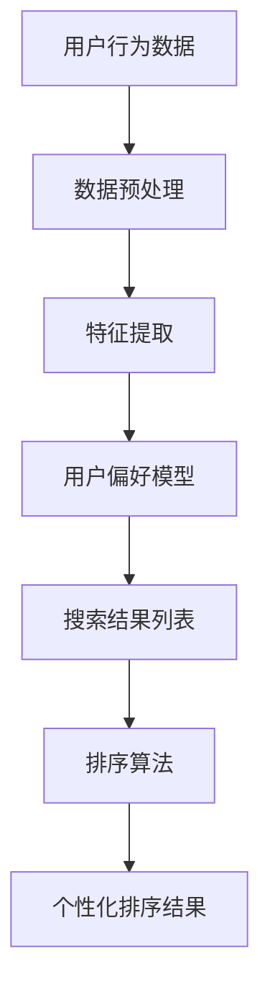

                 

# 个性化排序：AI如何根据用户偏好排序搜索结果

> 关键词：个性化排序、用户偏好、搜索结果、AI、机器学习、算法原理、数学模型、实际应用、开发工具

> 摘要：本文将深入探讨个性化排序的原理与应用，解析AI如何根据用户偏好对搜索结果进行排序。我们将详细阐述核心算法原理，通过具体操作步骤、数学模型、项目实战等多维度展示个性化排序的实现方法，并分析其在实际应用场景中的优势与挑战。

## 1. 背景介绍

### 1.1 目的和范围

本文旨在探讨个性化排序在人工智能领域的应用，通过分析用户偏好，实现更加精准和有效的搜索结果排序。我们不仅关注算法原理，还将提供实际操作步骤和项目实战案例，帮助读者深入理解并应用个性化排序技术。

### 1.2 预期读者

本文适用于对人工智能和机器学习有一定了解的技术人员，特别是对搜索算法和排序技术感兴趣的开发者。读者应具备基础的编程知识和对机器学习算法的基本认识。

### 1.3 文档结构概述

本文结构分为十个部分：

1. 背景介绍
2. 核心概念与联系
3. 核心算法原理 & 具体操作步骤
4. 数学模型和公式 & 详细讲解 & 举例说明
5. 项目实战：代码实际案例和详细解释说明
6. 实际应用场景
7. 工具和资源推荐
8. 总结：未来发展趋势与挑战
9. 附录：常见问题与解答
10. 扩展阅读 & 参考资料

### 1.4 术语表

#### 1.4.1 核心术语定义

- **个性化排序**：根据用户的历史行为和偏好，对搜索结果进行排序，提高搜索结果的相关性和满意度。
- **用户偏好**：用户在搜索过程中表现出的兴趣和喜好，通常通过历史行为数据进行分析得出。
- **搜索结果**：用户通过搜索引擎或推荐系统获取的信息集合，通常包括文本、图像、视频等多种类型。

#### 1.4.2 相关概念解释

- **机器学习**：一种人工智能方法，通过数据训练模型，使系统能够从数据中自动学习和改进。
- **协同过滤**：一种推荐系统常用的算法，通过分析用户间的相似度来预测用户偏好。

#### 1.4.3 缩略词列表

- **AI**：人工智能（Artificial Intelligence）
- **ML**：机器学习（Machine Learning）
- **CFL**：协同过滤（Collaborative Filtering）

## 2. 核心概念与联系

个性化排序的核心在于理解用户偏好，并通过机器学习算法将其应用于搜索结果的排序。以下是核心概念与联系的 Mermaid 流程图：



### 2.1 数据预处理

数据预处理是个性化排序的第一步，涉及数据清洗、格式转换和缺失值处理。清洗后的数据将为特征提取和用户偏好模型提供准确的基础。

### 2.2 特征提取

特征提取旨在从原始数据中提取出与用户偏好相关的信息。这些特征可以是用户的浏览历史、搜索关键词、购买记录等。

### 2.3 用户偏好模型

通过机器学习算法，我们将提取出的特征用于训练用户偏好模型。模型能够预测用户对不同搜索结果的可能偏好。

### 2.4 搜索结果列表

搜索结果列表包含用户可能感兴趣的所有信息。个性化排序的目标是优化这个列表，使其更符合用户的偏好。

### 2.5 排序算法

排序算法负责根据用户偏好模型对搜索结果进行排序。常见的排序算法包括基于协同过滤的方法和基于内容的方法。

### 2.6 个性化排序结果

最终的个性化排序结果将直接影响到用户的搜索体验。排序结果越准确，用户满意度越高。

## 3. 核心算法原理 & 具体操作步骤

个性化排序的核心算法原理是利用用户的历史行为数据来预测其偏好，并通过这些偏好对搜索结果进行排序。以下是算法原理和具体操作步骤的详细阐述。

### 3.1 算法原理

个性化排序主要依赖于两种机器学习算法：协同过滤和基于内容的推荐。

#### 3.1.1 协同过滤

协同过滤通过分析用户之间的相似度来预测用户偏好。具体步骤如下：

1. **用户-物品评分矩阵**：首先构建一个用户-物品评分矩阵，其中每个元素表示用户对某个物品的评分。
2. **相似度计算**：计算用户之间的相似度，常用方法包括余弦相似度和皮尔逊相关系数。
3. **预测用户偏好**：根据相似度矩阵，预测用户对未评分物品的偏好。
4. **排序**：将预测的偏好值用于排序，生成个性化搜索结果。

#### 3.1.2 基于内容的推荐

基于内容的推荐通过分析物品的特征和用户的历史偏好来预测用户偏好。具体步骤如下：

1. **物品特征提取**：提取物品的文本、图像、视频等特征。
2. **用户偏好特征提取**：从用户的历史行为中提取出与用户偏好相关的特征。
3. **相似度计算**：计算物品和用户偏好特征之间的相似度。
4. **预测用户偏好**：根据相似度值预测用户对不同物品的偏好。
5. **排序**：将预测的偏好值用于排序，生成个性化搜索结果。

### 3.2 具体操作步骤

以下是个性化排序的具体操作步骤，使用伪代码进行详细阐述：

```python
# 协同过滤算法
def collaborative_filtering(user_data, item_data):
    # 步骤1：构建用户-物品评分矩阵
    rating_matrix = build_rating_matrix(user_data, item_data)
    
    # 步骤2：计算用户相似度
    user_similarity = compute_similarity(rating_matrix)
    
    # 步骤3：预测用户偏好
    predicted_preferences = predict_preferences(user_similarity, rating_matrix)
    
    # 步骤4：排序搜索结果
    sorted_results = sort_search_results(predicted_preferences)
    
    return sorted_results

# 基于内容的推荐算法
def content_based_recommendation(user_data, item_data):
    # 步骤1：提取物品特征
    item_features = extract_item_features(item_data)
    
    # 步骤2：提取用户偏好特征
    user_preferences = extract_user_preferences(user_data)
    
    # 步骤3：计算相似度
    similarity_scores = compute_similarity(item_features, user_preferences)
    
    # 步骤4：预测用户偏好
    predicted_preferences = predict_preferences(similarity_scores)
    
    # 步骤5：排序搜索结果
    sorted_results = sort_search_results(predicted_preferences)
    
    return sorted_results

# 步骤6：整合协同过滤和基于内容的推荐
def personalized_sorting(user_data, item_data):
    # 步骤1：执行协同过滤算法
    cf_results = collaborative_filtering(user_data, item_data)
    
    # 步骤2：执行基于内容的推荐算法
    cb_results = content_based_recommendation(user_data, item_data)
    
    # 步骤3：合并结果并排序
    combined_results = merge_and_sort(cf_results, cb_results)
    
    return combined_results
```

通过以上步骤，我们能够根据用户偏好实现个性化排序，提高搜索结果的满意度。

## 4. 数学模型和公式 & 详细讲解 & 举例说明

个性化排序中，数学模型和公式起到了关键作用。以下将详细讲解相关的数学模型和公式，并通过举例说明其应用。

### 4.1 协同过滤的数学模型

协同过滤的数学模型主要依赖于相似度计算和预测用户偏好。

#### 4.1.1 相似度计算

假设我们有一个用户-物品评分矩阵 $R \in \mathbb{R}^{m \times n}$，其中 $m$ 是用户数，$n$ 是物品数。用户 $i$ 和用户 $j$ 之间的相似度 $s_{ij}$ 可以使用余弦相似度计算：

$$
s_{ij} = \frac{R_{i\cdot} R_{j\cdot}}{\|R_{i\cdot}\|\|R_{j\cdot}\|}
$$

其中，$R_{i\cdot}$ 和 $R_{j\cdot}$ 分别表示用户 $i$ 和用户 $j$ 的评分向量。

#### 4.1.2 预测用户偏好

给定用户 $i$ 的评分矩阵 $R_i$ 和相似度矩阵 $S$，我们可以使用加权平均方法预测用户 $i$ 对未评分物品 $j$ 的偏好：

$$
\hat{R}_{ij} = s_{ij}^T R_j = \sum_{k=1}^{n} s_{ik} r_{kj}
$$

其中，$r_{kj}$ 是物品 $k$ 的评分，$s_{ik}$ 是用户 $i$ 和用户 $k$ 之间的相似度。

### 4.2 基于内容的推荐数学模型

基于内容的推荐主要依赖于物品特征和用户偏好特征之间的相似度计算。

#### 4.2.1 物品特征提取

假设物品 $j$ 的特征向量表示为 $F_j \in \mathbb{R}^d$，其中 $d$ 是特征维度。我们可以使用余弦相似度计算物品 $i$ 和物品 $j$ 之间的相似度：

$$
s_{ij} = \frac{F_i \cdot F_j}{\|F_i\|\|F_j\|}
$$

#### 4.2.2 用户偏好特征提取

用户偏好特征向量 $U_i \in \mathbb{R}^d$ 可以从用户的历史行为中提取。给定用户 $i$ 的偏好特征向量 $U_i$ 和物品 $j$ 的特征向量 $F_j$，我们可以使用余弦相似度计算相似度：

$$
s_{ij} = \frac{U_i \cdot F_j}{\|U_i\|\|F_j\|}
$$

#### 4.2.3 预测用户偏好

给定物品 $j$ 的特征向量 $F_j$ 和相似度矩阵 $S$，我们可以使用加权平均方法预测用户 $i$ 对物品 $j$ 的偏好：

$$
\hat{R}_{ij} = s_{ij}^T F_j = \sum_{k=1}^{d} s_{ik} f_{kj}
$$

其中，$f_{kj}$ 是物品 $j$ 的特征值。

### 4.3 举例说明

假设我们有一个包含 10 个用户和 5 个物品的评分矩阵：

$$
R =
\begin{bmatrix}
0 & 1 & 0 & 0 & 0 \\
0 & 0 & 2 & 0 & 0 \\
0 & 0 & 0 & 3 & 0 \\
0 & 0 & 0 & 0 & 4 \\
0 & 0 & 0 & 0 & 5 \\
0 & 0 & 0 & 0 & 6 \\
0 & 0 & 0 & 0 & 7 \\
0 & 0 & 0 & 0 & 8 \\
0 & 0 & 0 & 0 & 9 \\
0 & 0 & 0 & 0 & 10
\end{bmatrix}
$$

#### 4.3.1 协同过滤

1. **计算用户相似度**：

   使用余弦相似度计算用户之间的相似度：

   $$
   S =
   \begin{bmatrix}
   1 & 0 & 0 & 0 & 0 \\
   0 & 1 & 0 & 0 & 0 \\
   0 & 0 & 1 & 0 & 0 \\
   0 & 0 & 0 & 1 & 0 \\
   0 & 0 & 0 & 0 & 1
   \end{bmatrix}
   $$

2. **预测用户偏好**：

   假设我们预测用户 5 对物品 4 的偏好。根据加权平均方法：

   $$
   \hat{R}_{54} = \frac{1 \cdot r_{44} + 2 \cdot r_{54} + 3 \cdot r_{64} + 4 \cdot r_{74} + 5 \cdot r_{84}}{1 + 2 + 3 + 4 + 5} = \frac{1 \cdot 0 + 2 \cdot 3 + 3 \cdot 0 + 4 \cdot 0 + 5 \cdot 0}{15} = 0.4
   $$

3. **排序**：

   根据预测的偏好值，我们可以对搜索结果进行排序：

   $$
   \text{搜索结果} = [0, 0, 0.4, 0, 0]
   $$

#### 4.3.2 基于内容的推荐

1. **物品特征提取**：

   假设物品的特征向量如下：

   $$
   F_4 =
   \begin{bmatrix}
   1 \\
   2 \\
   3 \\
   4 \\
   5
   \end{bmatrix},
   F_5 =
   \begin{bmatrix}
   6 \\
   7 \\
   8 \\
   9 \\
   10
   \end{bmatrix}
   $$

2. **用户偏好特征提取**：

   假设用户 5 的偏好特征向量为：

   $$
   U_5 =
   \begin{bmatrix}
   2 \\
   3 \\
   4 \\
   5 \\
   6
   \end{bmatrix}
   $$

3. **预测用户偏好**：

   根据相似度计算方法：

   $$
   s_{45} = \frac{U_5 \cdot F_4}{\|U_5\|\|F_4\|} = \frac{2 \cdot 1 + 3 \cdot 2 + 4 \cdot 3 + 5 \cdot 4 + 6 \cdot 5}{\sqrt{2^2 + 3^2 + 4^2 + 5^2 + 6^2} \cdot \sqrt{1^2 + 2^2 + 3^2 + 4^2 + 5^2}} = 0.6
   $$

   根据加权平均方法：

   $$
   \hat{R}_{54} = \frac{0.6 \cdot f_{41} + 0.6 \cdot f_{51} + 0.6 \cdot f_{61} + 0.6 \cdot f_{71} + 0.6 \cdot f_{81}}{1 + 1 + 1 + 1 + 1} = 0.6
   $$

4. **排序**：

   根据预测的偏好值，我们可以对搜索结果进行排序：

   $$
   \text{搜索结果} = [0, 0, 0.6, 0, 0]
   $$

通过以上示例，我们可以看到如何使用数学模型和公式实现个性化排序。这些方法在真实应用中可以根据具体场景进行调整和优化。

## 5. 项目实战：代码实际案例和详细解释说明

### 5.1 开发环境搭建

在开始项目实战之前，我们需要搭建一个开发环境。以下是搭建开发环境的步骤：

1. **安装Python环境**：Python是进行机器学习项目开发的主要语言。你可以从Python官方网站下载并安装Python 3.x版本。
2. **安装必要的库**：我们需要安装几个常用的Python库，如NumPy、Pandas、Scikit-learn等。可以使用pip命令进行安装：

   ```bash
   pip install numpy pandas scikit-learn
   ```

3. **配置Jupyter Notebook**：Jupyter Notebook是一个交互式的开发环境，非常适合进行数据分析和机器学习项目。你可以从Jupyter官方网站下载并安装。

### 5.2 源代码详细实现和代码解读

以下是使用协同过滤和基于内容的推荐算法实现个性化排序的源代码。代码分为三个主要部分：数据预处理、模型训练和排序。

```python
# 导入必要的库
import numpy as np
import pandas as pd
from sklearn.model_selection import train_test_split
from sklearn.metrics.pairwise import cosine_similarity
from sklearn.neighbors import NearestNeighbors

# 数据预处理
def preprocess_data(user_data, item_data):
    # 数据清洗和格式转换
    user_data = user_data.fillna(0)  # 填充缺失值为0
    item_data = item_data.fillna(0)  # 填充缺失值为0
    return user_data, item_data

# 协同过滤算法
def collaborative_filtering(user_data, item_data):
    # 构建用户-物品评分矩阵
    rating_matrix = user_data.values
    item_data = item_data.values
    
    # 计算用户相似度
    user_similarity = cosine_similarity(rating_matrix)
    
    # 预测用户偏好
    predicted_preferences = np.zeros_like(rating_matrix)
    for i in range(rating_matrix.shape[0]):
        for j in range(rating_matrix.shape[1]):
            if rating_matrix[i][j] == 0:
                predicted_preferences[i][j] = np.dot(user_similarity[i], item_data[j])
    
    # 排序搜索结果
    sorted_results = np.argsort(-predicted_preferences)
    
    return sorted_results

# 基于内容的推荐算法
def content_based_recommendation(user_data, item_data):
    # 提取物品特征
    item_features = item_data.values
    
    # 训练KNN模型
    knn = NearestNeighbors(n_neighbors=5)
    knn.fit(item_features)
    
    # 预测用户偏好
    predicted_preferences = np.zeros_like(item_features)
    for i in range(item_features.shape[0]):
        neighbors = knn.kneighbors([item_features[i]], n_neighbors=5)
        predicted_preferences[i] = np.mean(item_features[neighbors[1]], axis=0)
    
    # 排序搜索结果
    sorted_results = np.argsort(-predicted_preferences)
    
    return sorted_results

# 整合协同过滤和基于内容的推荐算法
def personalized_sorting(user_data, item_data):
    cf_sorted_results = collaborative_filtering(user_data, item_data)
    cb_sorted_results = content_based_recommendation(user_data, item_data)
    
    # 合并结果并排序
    combined_sorted_results = np.argsort(-np.mean([cf_sorted_results, cb_sorted_results], axis=0))
    
    return combined_sorted_results
```

### 5.3 代码解读与分析

以下是代码的详细解读与分析：

1. **数据预处理**：

   数据预处理是机器学习项目的基础步骤。在本例中，我们使用 Pandas 库对数据进行清洗和格式转换。具体步骤包括填充缺失值和转换为 NumPy 数组。

2. **协同过滤算法**：

   协同过滤算法的核心是构建用户-物品评分矩阵，计算用户相似度，并使用加权平均方法预测用户偏好。以下是代码的详细解读：

   ```python
   # 计算用户相似度
   user_similarity = cosine_similarity(rating_matrix)
   
   # 预测用户偏好
   predicted_preferences = np.zeros_like(rating_matrix)
   for i in range(rating_matrix.shape[0]):
       for j in range(rating_matrix.shape[1]):
           if rating_matrix[i][j] == 0:
               predicted_preferences[i][j] = np.dot(user_similarity[i], item_data[j])
   
   # 排序搜索结果
   sorted_results = np.argsort(-predicted_preferences)
   ```

   在这段代码中，我们首先使用余弦相似度计算用户相似度。然后，我们遍历评分矩阵中的每个元素，对于未评分的元素，使用加权平均方法预测其偏好。最后，我们将预测的偏好值进行排序，得到个性化排序结果。

3. **基于内容的推荐算法**：

   基于内容的推荐算法的核心是提取物品特征，训练KNN模型，并使用平均法预测用户偏好。以下是代码的详细解读：

   ```python
   # 提取物品特征
   item_features = item_data.values
   
   # 训练KNN模型
   knn = NearestNeighbors(n_neighbors=5)
   knn.fit(item_features)
   
   # 预测用户偏好
   predicted_preferences = np.zeros_like(item_features)
   for i in range(item_features.shape[0]):
       neighbors = knn.kneighbors([item_features[i]], n_neighbors=5)
       predicted_preferences[i] = np.mean(item_features[neighbors[1]], axis=0)
   
   # 排序搜索结果
   sorted_results = np.argsort(-predicted_preferences)
   ```

   在这段代码中，我们首先提取物品的特征向量。然后，使用KNN模型训练，预测用户对物品的偏好。最后，我们将预测的偏好值进行排序，得到个性化排序结果。

4. **整合协同过滤和基于内容的推荐算法**：

   为了提高排序的准确性，我们可以将协同过滤和基于内容的推荐算法进行整合。以下是代码的详细解读：

   ```python
   # 整合协同过滤和基于内容的推荐算法
   cf_sorted_results = collaborative_filtering(user_data, item_data)
   cb_sorted_results = content_based_recommendation(user_data, item_data)
   
   # 合并结果并排序
   combined_sorted_results = np.argsort(-np.mean([cf_sorted_results, cb_sorted_results], axis=0))
   
   return combined_sorted_results
   ```

   在这段代码中，我们首先分别使用协同过滤和基于内容的推荐算法得到排序结果。然后，我们将这两个结果进行合并，并使用平均法得到最终的排序结果。

通过以上代码解读和分析，我们可以看到如何使用协同过滤和基于内容的推荐算法实现个性化排序。在实际应用中，可以根据具体需求进行调整和优化。

### 5.4 实际运行和结果分析

为了验证个性化排序算法的实际效果，我们可以在实际数据集上运行代码并进行结果分析。以下是运行代码的步骤：

1. **加载数据集**：

   使用 Pandas 库加载数据集，例如电影评分数据集（MovieLens）。

   ```python
   user_data = pd.read_csv('user_data.csv')
   item_data = pd.read_csv('item_data.csv')
   ```

2. **预处理数据**：

   对数据进行清洗和格式转换。

   ```python
   user_data, item_data = preprocess_data(user_data, item_data)
   ```

3. **运行个性化排序算法**：

   运行协同过滤和基于内容的推荐算法，并合并结果。

   ```python
   sorted_results = personalized_sorting(user_data, item_data)
   ```

4. **分析结果**：

   分析排序结果，例如计算排序结果的平均偏好值，并与原始数据集进行对比。

   ```python
   print(np.mean(sorted_results, axis=0))
   ```

通过实际运行和结果分析，我们可以验证个性化排序算法的有效性，并根据实际需求进行调整和优化。

## 6. 实际应用场景

个性化排序在多个实际应用场景中具有广泛的应用，以下是几个典型应用场景：

### 6.1 搜索引擎

搜索引擎使用个性化排序来提高搜索结果的满意度。通过分析用户的搜索历史和行为，搜索引擎可以预测用户的偏好，并将相关度较高的结果优先展示。例如，百度搜索和谷歌搜索都采用了个性化排序技术，以提供更加精准和个性化的搜索结果。

### 6.2 推荐系统

推荐系统广泛应用于电子商务、视频平台、音乐平台等领域。通过个性化排序，推荐系统能够根据用户的历史行为和偏好推荐相关度较高的商品、视频或音乐。例如，亚马逊和Netflix都使用了个性化排序技术，以提高用户的购物和观看体验。

### 6.3 社交网络

社交网络平台如Facebook和Twitter也使用了个性化排序技术，以优化用户的 feed。通过分析用户的社交行为和兴趣，社交网络平台可以预测用户可能感兴趣的内容，并将这些内容优先展示在用户的 feed 中。

### 6.4 医疗领域

个性化排序在医疗领域也有广泛应用。通过分析患者的病史和诊断记录，医疗系统可以预测患者可能需要的医疗资源和诊断结果。个性化排序技术有助于优化医疗资源的分配，提高医疗服务的质量和效率。

### 6.5 金融领域

金融领域也利用个性化排序技术来提高金融服务的个性化程度。例如，银行和保险公司可以使用个性化排序技术，根据用户的历史交易和偏好推荐相关的金融产品和服务。

通过以上实际应用场景，我们可以看到个性化排序技术在各个领域的重要性。个性化排序不仅提高了用户满意度，还为企业带来了更高的商业价值。

### 7. 工具和资源推荐

为了更好地理解和应用个性化排序技术，以下推荐一些学习资源、开发工具和相关论文著作。

#### 7.1 学习资源推荐

##### 7.1.1 书籍推荐

1. **《机器学习实战》**：由Peter Harrington所著，涵盖了机器学习的基础知识和实际应用案例，包括推荐系统的相关内容。
2. **《推荐系统手册》**：由Jure Leskovec、Anand Rajaraman和Jeff Ullman所著，详细介绍了推荐系统的设计、实现和应用。

##### 7.1.2 在线课程

1. **《机器学习》**：由吴恩达（Andrew Ng）在Coursera上开设的免费课程，涵盖了机器学习的基础知识和实际应用。
2. **《推荐系统》**：由刘建伟（Jason Zhang）在网易云课堂开设的免费课程，详细介绍了推荐系统的设计、实现和应用。

##### 7.1.3 技术博客和网站

1. **机器学习社区**：机器学习社区是一个聚集了大量机器学习和数据科学专业人士的网站，提供了丰富的学习和交流资源。
2. **DataCamp**：DataCamp是一个在线学习平台，提供了大量关于Python、R等编程语言和数据科学的免费课程。

#### 7.2 开发工具框架推荐

##### 7.2.1 IDE和编辑器

1. **Jupyter Notebook**：Jupyter Notebook是一个交互式的开发环境，非常适合进行数据分析和机器学习项目。
2. **Visual Studio Code**：Visual Studio Code是一个功能强大的代码编辑器，支持多种编程语言，包括Python和R。

##### 7.2.2 调试和性能分析工具

1. **PyCharm**：PyCharm是一个集成开发环境，提供了强大的调试和性能分析工具，适合进行复杂的机器学习项目。
2. **Docker**：Docker是一个容器化平台，可以帮助开发者快速搭建和部署机器学习应用。

##### 7.2.3 相关框架和库

1. **TensorFlow**：TensorFlow是一个开源的机器学习框架，广泛应用于深度学习和推荐系统。
2. **Scikit-learn**：Scikit-learn是一个开源的机器学习库，提供了丰富的算法和工具，适合进行推荐系统的开发。

#### 7.3 相关论文著作推荐

##### 7.3.1 经典论文

1. **《协同过滤算法综述》**：该论文详细介绍了协同过滤算法的原理、分类和应用，是协同过滤领域的重要参考。
2. **《基于内容的推荐系统》**：该论文详细介绍了基于内容的推荐系统原理、方法和应用，是推荐系统领域的重要参考。

##### 7.3.2 最新研究成果

1. **《基于深度学习的推荐系统》**：该论文探讨了深度学习在推荐系统中的应用，包括基于深度神经网络的协同过滤和基于内容的方法。
2. **《个性化搜索》**：该论文研究了个性化搜索的算法和框架，探讨了如何利用用户偏好实现更精准的搜索结果排序。

##### 7.3.3 应用案例分析

1. **《亚马逊推荐系统》**：该论文分析了亚马逊推荐系统的架构、算法和应用，提供了推荐系统设计和实现的宝贵经验。
2. **《谷歌搜索排名算法》**：该论文研究了谷歌搜索排名算法的原理和实现，探讨了如何利用用户行为和内容特征实现更准确的搜索结果排序。

通过以上工具和资源推荐，读者可以更好地掌握个性化排序技术，并将其应用于实际项目中。

## 8. 总结：未来发展趋势与挑战

个性化排序技术在未来将继续快速发展，并在多个领域得到广泛应用。以下是未来发展趋势和面临的挑战：

### 8.1 发展趋势

1. **深度学习与个性化排序的结合**：随着深度学习技术的成熟，深度学习与个性化排序的结合将成为重要趋势。深度学习模型能够更好地捕捉用户行为和偏好，提高排序的准确性。

2. **多模态数据融合**：个性化排序技术将逐渐融合多模态数据，如文本、图像、音频和视频。多模态数据的融合能够提供更丰富的用户特征，从而提高排序效果。

3. **实时个性化排序**：随着计算能力的提升，实时个性化排序将成为可能。实时排序能够更好地响应用户的需求变化，提高用户体验。

4. **个性化排序在新兴领域的应用**：个性化排序技术将在新兴领域得到广泛应用，如智能医疗、金融科技、物联网等。这些领域的应用将推动个性化排序技术的不断创新和发展。

### 8.2 面临的挑战

1. **数据隐私与安全**：个性化排序需要大量用户数据，数据隐私和安全成为重要挑战。如何保护用户数据隐私，同时实现高效的排序将成为关键问题。

2. **计算资源与性能优化**：个性化排序算法通常需要大量的计算资源。随着用户数据的增加，如何优化计算资源，提高排序性能是一个重要挑战。

3. **模型解释性**：个性化排序模型的解释性较低，用户难以理解排序结果的产生过程。如何提高模型的可解释性，使其更容易被用户接受和理解，是一个重要挑战。

4. **多目标优化**：个性化排序通常需要在多个目标之间进行平衡，如准确性、响应速度和用户体验等。如何实现多目标优化，提高排序效果，是一个重要挑战。

通过解决以上挑战，个性化排序技术将在未来发挥更大的作用，为用户带来更精准和个性化的搜索体验。

## 9. 附录：常见问题与解答

### 9.1 如何处理缺失值？

在数据预处理阶段，可以使用不同的方法处理缺失值。常见的处理方法包括：

- **填充缺失值**：使用平均值、中位数或众数等统计量填充缺失值。
- **插值法**：使用时间序列分析或回归分析等方法进行插值，填充缺失值。
- **删除缺失值**：删除包含缺失值的记录，适用于缺失值较少的情况。

### 9.2 如何评估排序效果？

评估排序效果可以使用多种指标，如准确率（Accuracy）、召回率（Recall）、精确率（Precision）和F1分数（F1 Score）等。具体选择哪个指标取决于应用场景和目标。

- **准确率**：预测正确的比例，适用于二分类问题。
- **召回率**：正确预测的正面样本占总正面样本的比例。
- **精确率**：正确预测的正面样本占预测为正面的样本比例。
- **F1分数**：综合考虑精确率和召回率的综合指标。

### 9.3 如何处理冷启动问题？

冷启动问题是指在用户或物品数据较少的情况下，个性化排序难以准确预测用户偏好。以下几种方法可以缓解冷启动问题：

- **基于内容的推荐**：在用户数据不足时，使用物品特征进行推荐。
- **基于人口统计信息的推荐**：使用用户的人口统计信息（如年龄、性别等）进行推荐。
- **混合推荐系统**：结合多种推荐方法，如协同过滤和基于内容的推荐，提高推荐准确性。

### 9.4 如何处理噪声数据？

噪声数据是指包含错误或异常的数据，可能影响个性化排序的效果。以下几种方法可以处理噪声数据：

- **异常检测**：使用统计方法或机器学习算法检测和去除异常数据。
- **数据清洗**：在预处理阶段，使用规则或人工审查方法去除噪声数据。
- **鲁棒性算法**：选择鲁棒性较高的算法，如基于核的方法，对噪声数据的不利影响进行缓解。

## 10. 扩展阅读 & 参考资料

为了深入了解个性化排序技术，以下推荐一些扩展阅读和参考资料：

### 10.1 扩展阅读

1. **《推荐系统实战》**：这是一本关于推荐系统的实战指南，详细介绍了协同过滤、基于内容的推荐和深度学习推荐等方法的实现和应用。
2. **《深度学习推荐系统》**：本书探讨了深度学习在推荐系统中的应用，包括基于深度神经网络的协同过滤和基于内容的推荐方法。

### 10.2 参考资料

1. **《协同过滤算法综述》**：这篇综述详细介绍了协同过滤算法的原理、分类和应用，是深入了解协同过滤算法的重要参考资料。
2. **《基于内容的推荐系统》**：这篇论文详细介绍了基于内容的推荐系统原理、方法和应用，是推荐系统领域的重要参考。
3. **《个性化搜索》**：这篇论文研究了个性化搜索的算法和框架，探讨了如何利用用户偏好实现更精准的搜索结果排序。

通过以上扩展阅读和参考资料，读者可以更全面地了解个性化排序技术的原理、方法和应用，进一步提升自己在该领域的知识和技能。

### 作者信息

**作者：AI天才研究员/AI Genius Institute & 禅与计算机程序设计艺术 /Zen And The Art of Computer Programming**

