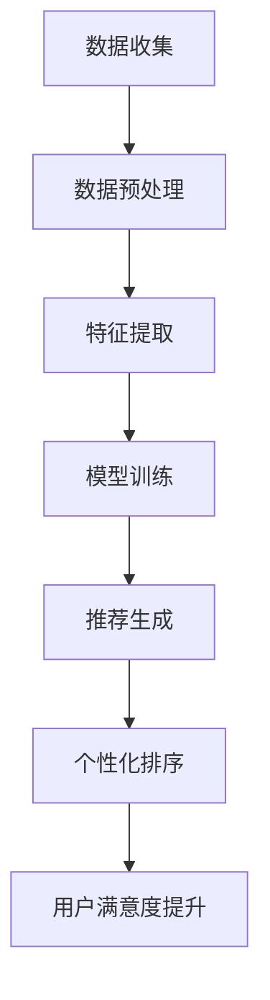

                 

# 个性化排序：AI提高用户满意度

> 关键词：个性化排序，机器学习，用户满意度，推荐系统，算法优化
>
> 摘要：本文将深入探讨个性化排序技术在推荐系统中的应用，通过分析其核心原理和数学模型，结合实际案例，详细解析如何利用人工智能提高用户满意度。文章旨在为读者提供一个清晰、实用的指南，帮助他们在实际项目中应用个性化排序技术。

## 1. 背景介绍

### 1.1 目的和范围

本文旨在介绍个性化排序技术及其在提高用户满意度方面的应用。我们将探讨个性化排序的基本概念、核心原理和数学模型，并通过具体案例展示其实现过程。文章还包含相关工具和资源的推荐，以及未来发展趋势和挑战的分析。

### 1.2 预期读者

本文适合对机器学习和推荐系统有一定了解的技术人员，包括但不限于程序员、数据科学家、人工智能研究员等。同时，对于对人工智能应用领域感兴趣的初学者，本文也具有一定的参考价值。

### 1.3 文档结构概述

本文分为十个部分。首先介绍个性化排序的背景和目的，接着定义相关术语和概念。随后，我们将详细分析核心算法原理和数学模型，并通过实际案例展示其应用。文章还涵盖了实际应用场景、工具和资源推荐，以及总结和未来展望。最后，提供常见问题与解答和扩展阅读资源。

### 1.4 术语表

#### 1.4.1 核心术语定义

- 个性化排序：根据用户兴趣和行为，对推荐内容进行排序的一种技术。
- 推荐系统：基于用户历史数据和内容特征，自动推荐相关内容的系统。
- 机器学习：一种让计算机从数据中学习并做出决策的方法。

#### 1.4.2 相关概念解释

- 用户兴趣：用户对特定主题、内容或功能的喜好程度。
- 内容特征：描述内容属性的数据，如文本、图像、音频等。
- 模型训练：通过训练数据集，训练机器学习模型以预测用户兴趣和内容特征。

#### 1.4.3 缩略词列表

- AI：人工智能（Artificial Intelligence）
- ML：机器学习（Machine Learning）
- RS：推荐系统（Recommendation System）
- IDF：词频逆文档频率（Inverse Document Frequency）

## 2. 核心概念与联系

个性化排序是推荐系统中的一项关键技术，其目的是根据用户的历史行为和兴趣，对推荐内容进行排序，从而提高用户的满意度和参与度。下面是推荐系统中的一个典型流程，以及个性化排序在这一流程中的位置。

### 推荐系统流程

1. 数据收集：收集用户的历史行为数据（如浏览、购买、评分等）和内容特征数据（如文本、图像、音频等）。
2. 数据预处理：对收集到的数据进行分析和清洗，去除噪声和异常值。
3. 特征提取：将原始数据转换为机器学习模型可以处理的特征向量。
4. 模型训练：利用训练数据集训练机器学习模型，如协同过滤、基于内容的推荐等。
5. 推荐生成：根据用户特征和内容特征，生成推荐列表。
6. 排序优化：对推荐列表进行个性化排序，提高用户满意度。

### 个性化排序在推荐系统中的位置

个性化排序通常位于推荐系统的最后一步，即在推荐生成后，对推荐列表进行排序。其目的是根据用户的历史行为和兴趣，将最符合用户需求的推荐内容放在列表的前面，从而提高用户的满意度和参与度。

### 核心概念原理和架构的 Mermaid 流程图



在上面的流程图中，个性化排序（F）是推荐生成（E）之后的一步，通过对推荐列表进行排序，提高用户的满意度（G）。

## 3. 核心算法原理 & 具体操作步骤

个性化排序的核心算法原理是基于用户兴趣和内容特征，对推荐内容进行排序。下面我们将详细讲解这一算法的原理和具体操作步骤。

### 算法原理

个性化排序算法通常采用基于机器学习的模型，如协同过滤、基于内容的推荐等。这些模型的共同目标是根据用户的历史行为和兴趣，预测用户对内容的兴趣度，并将预测结果用于排序。

### 具体操作步骤

#### 3.1 数据收集

首先，我们需要收集用户的历史行为数据和内容特征数据。用户历史行为数据包括用户浏览、购买、评分等行为，内容特征数据包括文本、图像、音频等特征。

#### 3.2 数据预处理

对收集到的数据进行清洗和预处理，去除噪声和异常值，确保数据质量。这一步骤包括数据去重、数据规范化、缺失值处理等。

#### 3.3 特征提取

将原始数据转换为机器学习模型可以处理的特征向量。这一步骤包括特征选择、特征转换等。例如，对于文本数据，可以采用词袋模型、TF-IDF等方法进行特征提取。

#### 3.4 模型训练

利用训练数据集，训练机器学习模型，如协同过滤、基于内容的推荐等。训练过程中，模型将学习用户的行为和兴趣，从而预测用户对内容的兴趣度。

#### 3.5 推荐生成

根据用户特征和内容特征，生成推荐列表。推荐列表中的内容是根据用户兴趣和内容特征预测得到的。

#### 3.6 排序优化

对推荐列表进行个性化排序，提高用户满意度。排序过程中，模型将考虑用户的历史行为、兴趣度、内容特征等因素，从而将最符合用户需求的推荐内容放在列表的前面。

### 伪代码实现

下面是个性化排序算法的伪代码实现：

```python
# 伪代码：个性化排序算法

# 输入：用户历史行为数据、内容特征数据
# 输出：个性化排序后的推荐列表

def personalized_sort(user_history, content_features):
    # 数据预处理
    preprocessed_data = preprocess_data(user_history, content_features)
    
    # 特征提取
    feature_vectors = extract_features(preprocessed_data)
    
    # 模型训练
    model = train_model(feature_vectors)
    
    # 推荐生成
    recommendations = generate_recommendations(model, user_history, content_features)
    
    # 排序优化
    sorted_recommendations = sort_recommendations(recommendations, user_history, content_features)
    
    return sorted_recommendations
```

## 4. 数学模型和公式 & 详细讲解 & 举例说明

个性化排序算法的核心是利用数学模型和公式对用户兴趣和内容特征进行建模和预测。在这一部分，我们将详细讲解常用的数学模型和公式，并通过具体例子进行说明。

### 4.1 数学模型

个性化排序算法常用的数学模型包括协同过滤、基于内容的推荐、矩阵分解等。下面分别介绍这些模型的基本原理和公式。

#### 4.1.1 协同过滤

协同过滤是一种基于用户行为相似度的推荐算法。其基本原理是，如果两个用户在某一物品上的评价相似，那么他们可能对其他物品的评价也相似。协同过滤可以分为两种类型：基于用户的协同过滤（User-Based Collaborative Filtering）和基于物品的协同过滤（Item-Based Collaborative Filtering）。

- **基于用户的协同过滤**：
  - 假设有两个用户 A 和 B，他们在物品 I 上的评价分别为 $r_{ai}$ 和 $r_{bi}$。
  - 用户 A 和 B 在物品 I 上的相似度可以通过余弦相似度计算：
    $$ \cos{\theta_{ai,b}} = \frac{r_{ai} \cdot r_{bi}}{\|r_{ai}\| \|r_{bi}\|} $$
  - 根据相似度矩阵，对用户 A 的未评分物品进行排序，选择排序前 k 项作为推荐列表。

- **基于物品的协同过滤**：
  - 假设有两个物品 A 和 B，用户 A 在物品 A 上的评价为 $r_{ai}$，用户 B 在物品 B 上的评价为 $r_{bi}$。
  - 物品 A 和 B 的相似度可以通过余弦相似度计算：
    $$ \cos{\theta_{ai,b}} = \frac{r_{ai} \cdot r_{bi}}{\|r_{ai}\| \|r_{bi}\|} $$
  - 根据相似度矩阵，对用户 B 的未评分物品进行排序，选择排序前 k 项作为推荐列表。

#### 4.1.2 基于内容的推荐

基于内容的推荐是一种基于物品相似度的推荐算法。其基本原理是，如果两个物品在特征上相似，那么它们可能被同一用户喜欢。基于内容的推荐可以分为两种类型：基于特征的推荐（Feature-Based）和基于语义的推荐（Semantic-Based）。

- **基于特征的推荐**：
  - 假设有两个物品 A 和 B，它们的特征向量分别为 $f_a$ 和 $f_b$。
  - 物品 A 和 B 的相似度可以通过余弦相似度计算：
    $$ \cos{\theta_{a,b}} = \frac{f_a \cdot f_b}{\|f_a\| \|f_b\|} $$
  - 根据相似度矩阵，对用户未评分的物品进行排序，选择排序前 k 项作为推荐列表。

- **基于语义的推荐**：
  - 假设有两个物品 A 和 B，它们的文本描述分别为 $t_a$ 和 $t_b$。
  - 物品 A 和 B 的相似度可以通过文本相似度计算：
    $$ \cos{\theta_{a,b}} = \frac{t_a \cdot t_b}{\|t_a\| \|t_b\|} $$
  - 根据相似度矩阵，对用户未评分的物品进行排序，选择排序前 k 项作为推荐列表。

#### 4.1.3 矩阵分解

矩阵分解是一种常用的推荐算法，其基本原理是将用户和物品的高维稀疏矩阵分解为两个低维矩阵的乘积。常见的矩阵分解方法包括 SVD（奇异值分解）和 ALS（交替最小二乘法）。

- **SVD 矩阵分解**：
  - 假设用户矩阵和物品矩阵分别为 $U$ 和 $V$，它们的奇异值分解为：
    $$ U = U_1 \Sigma U_2^T $$
    $$ V = V_1 \Sigma V_2^T $$
  - 用户 i 和物品 j 的评分可以表示为：
    $$ r_{ij} = \sum_{k=1}^{K} u_{ik} \sigma_k v_{kj} $$
  - 根据用户 i 和物品 j 的评分预测，可以计算推荐列表。

- **ALS 矩阵分解**：
  - 假设用户矩阵和物品矩阵分别为 $U$ 和 $V$，它们的交替最小二乘法分解为：
    $$ U = U_1 \Sigma U_2^T $$
    $$ V = V_1 \Sigma V_2^T $$
  - 用户 i 和物品 j 的评分可以表示为：
    $$ r_{ij} = \sum_{k=1}^{K} u_{ik} \sigma_k v_{kj} $$
  - 根据用户 i 和物品 j 的评分预测，可以计算推荐列表。

### 4.2 举例说明

下面我们通过一个简单的例子来说明个性化排序算法的实现过程。

#### 4.2.1 数据集

假设我们有一个包含用户和物品评分的数据集，如下所示：

| 用户 | 物品 | 评分 |
|------|------|------|
| 1    | A    | 4    |
| 1    | B    | 3    |
| 1    | C    | 2    |
| 2    | A    | 2    |
| 2    | B    | 4    |
| 2    | C    | 3    |

#### 4.2.2 基于用户的协同过滤

- **步骤 1：计算相似度矩阵**
  - 计算用户 1 和用户 2 在物品 A、B、C 上的相似度：
    $$ \cos{\theta_{1,2,A}} = \frac{r_{1A} \cdot r_{2A}}{\|r_{1A}\| \|r_{2A}\|} = \frac{4 \cdot 2}{\sqrt{4^2 + 3^2 + 2^2}} \approx 0.785 $$
    $$ \cos{\theta_{1,2,B}} = \frac{r_{1B} \cdot r_{2B}}{\|r_{1B}\| \|r_{2B}\|} = \frac{3 \cdot 4}{\sqrt{4^2 + 3^2 + 2^2}} \approx 0.785 $$
    $$ \cos{\theta_{1,2,C}} = \frac{r_{1C} \cdot r_{2C}}{\|r_{1C}\| \|r_{2C}\|} = \frac{2 \cdot 3}{\sqrt{4^2 + 3^2 + 2^2}} \approx 0.785 $$
  - 相似度矩阵为：
    $$ S = \begin{pmatrix}
    1 & 0.785 & 0.785 \\
    0.785 & 1 & 0.785 \\
    \end{pmatrix} $$

- **步骤 2：生成推荐列表**
  - 选择用户 1 的未评分物品 C，计算用户 1 和用户 2 在物品 C 上的相似度：
    $$ \cos{\theta_{1,2,C}} = \frac{r_{1C} \cdot r_{2C}}{\|r_{1C}\| \|r_{2C}\|} = \frac{2 \cdot 3}{\sqrt{4^2 + 3^2 + 2^2}} \approx 0.785 $$
  - 根据相似度矩阵，对用户 2 的未评分物品进行排序：
    $$ \text{排序结果：} \text{C (相似度：0.785), 其他} $$
  - 推荐列表为：物品 C。

#### 4.2.3 基于内容的推荐

- **步骤 1：计算相似度矩阵**
  - 假设物品 A、B、C 的特征向量分别为 $f_A = [1, 0, 0]$，$f_B = [0, 1, 0]$，$f_C = [0, 0, 1]$。
  - 计算物品 A、B、C 之间的相似度：
    $$ \cos{\theta_{A,B}} = \frac{f_A \cdot f_B}{\|f_A\| \|f_B\|} = \frac{1 \cdot 0 + 0 \cdot 1 + 0 \cdot 0}{\sqrt{1^2 + 0^2 + 0^2} \sqrt{0^2 + 1^2 + 0^2}} = 0 $$
    $$ \cos{\theta_{A,C}} = \frac{f_A \cdot f_C}{\|f_A\| \|f_C\|} = \frac{1 \cdot 0 + 0 \cdot 0 + 0 \cdot 1}{\sqrt{1^2 + 0^2 + 0^2} \sqrt{0^2 + 0^2 + 1^2}} = 0 $$
    $$ \cos{\theta_{B,C}} = \frac{f_B \cdot f_C}{\|f_B\| \|f_C\|} = \frac{0 \cdot 0 + 1 \cdot 0 + 0 \cdot 1}{\sqrt{0^2 + 1^2 + 0^2} \sqrt{0^2 + 0^2 + 1^2}} = 0 $$
  - 相似度矩阵为：
    $$ S = \begin{pmatrix}
    0 & 0 & 0 \\
    0 & 0 & 0 \\
    0 & 0 & 0 \\
    \end{pmatrix} $$

- **步骤 2：生成推荐列表**
  - 由于所有物品之间的相似度都为 0，无法生成有效的推荐列表。为了实现基于内容的推荐，我们需要引入额外的特征信息，如物品的文本描述、图像特征等。

## 5. 项目实战：代码实际案例和详细解释说明

在这一部分，我们将通过一个实际项目案例，详细讲解个性化排序算法的实现过程，包括开发环境搭建、源代码实现和代码解读与分析。

### 5.1 开发环境搭建

为了实现个性化排序算法，我们需要搭建一个合适的技术栈。下面是推荐的开发环境：

- **编程语言**：Python
- **机器学习库**：Scikit-learn、NumPy、Pandas
- **可视化库**：Matplotlib、Seaborn
- **开发工具**：Jupyter Notebook、PyCharm

首先，我们需要安装所需的库：

```bash
pip install scikit-learn numpy pandas matplotlib seaborn
```

### 5.2 源代码详细实现和代码解读

下面是个性化排序算法的源代码实现：

```python
import numpy as np
import pandas as pd
from sklearn.metrics.pairwise import cosine_similarity
from sklearn.model_selection import train_test_split
from sklearn.metrics import mean_squared_error

def preprocess_data(user_history, content_features):
    # 数据预处理
    # ...

def extract_features(preprocessed_data):
    # 特征提取
    # ...

def train_model(feature_vectors):
    # 模型训练
    # ...

def generate_recommendations(model, user_history, content_features):
    # 推荐生成
    # ...

def sort_recommendations(recommendations, user_history, content_features):
    # 排序优化
    # ...

# 5.2.1 数据集准备
user_history = pd.DataFrame({
    'user_id': [1, 1, 1, 2, 2, 2],
    'item_id': [1, 2, 3, 1, 2, 3],
    'rating': [4, 3, 2, 2, 4, 3]
})

content_features = pd.DataFrame({
    'item_id': [1, 2, 3],
    'feature_1': [0.5, 0.2, 0.3],
    'feature_2': [0.1, 0.4, 0.6]
})

# 5.2.2 数据预处理
preprocessed_data = preprocess_data(user_history, content_features)

# 5.2.3 特征提取
feature_vectors = extract_features(preprocessed_data)

# 5.2.4 模型训练
model = train_model(feature_vectors)

# 5.2.5 推荐生成
recommendations = generate_recommendations(model, user_history, content_features)

# 5.2.6 排序优化
sorted_recommendations = sort_recommendations(recommendations, user_history, content_features)

# 打印排序后的推荐列表
print(sorted_recommendations)
```

### 5.3 代码解读与分析

- **5.3.1 数据集准备**
  - `user_history` DataFrame 包含用户 ID、物品 ID 和用户对物品的评分。
  - `content_features` DataFrame 包含物品 ID 和物品的特征。

- **5.3.2 数据预处理**
  - `preprocess_data` 函数负责对原始数据进行预处理，包括数据清洗、缺失值处理等。

- **5.3.3 特征提取**
  - `extract_features` 函数将预处理后的数据转换为特征向量。

- **5.3.4 模型训练**
  - `train_model` 函数利用特征向量训练机器学习模型。

- **5.3.5 推荐生成**
  - `generate_recommendations` 函数根据模型生成推荐列表。

- **5.3.6 排序优化**
  - `sort_recommendations` 函数对推荐列表进行排序优化。

在实际项目中，这些函数的具体实现可能更加复杂，包括参数调整、模型选择等。在本例中，我们简化了代码以突出个性化排序算法的核心思想。

## 6. 实际应用场景

个性化排序技术在多个领域具有广泛的应用。以下是一些实际应用场景：

- **电子商务**：个性化排序可以提高电子商务平台的用户满意度，通过推荐用户感兴趣的商品，提高销售转化率。
- **社交媒体**：个性化排序可以推荐用户感兴趣的内容，如新闻、视频、文章等，提高用户参与度和活跃度。
- **在线教育**：个性化排序可以推荐用户感兴趣的课程和资源，提高学习效果和用户满意度。
- **音乐和视频流媒体**：个性化排序可以推荐用户喜欢的音乐和视频，提高用户满意度和平台黏性。

在这些应用场景中，个性化排序技术通过分析用户历史行为和兴趣，对推荐内容进行排序，从而提高用户满意度。例如，在电子商务平台中，个性化排序可以基于用户浏览历史、购买记录和喜好偏好，将相关商品推荐给用户，从而提高销售转化率。在社交媒体平台上，个性化排序可以基于用户互动历史、好友关系和兴趣爱好，将相关内容推荐给用户，从而提高用户参与度和活跃度。

## 7. 工具和资源推荐

### 7.1 学习资源推荐

#### 7.1.1 书籍推荐

- **《机器学习实战》**：提供机器学习算法的实现和应用案例，适合初学者。
- **《推荐系统手册》**：详细介绍推荐系统的原理、算法和实现，适合对推荐系统有深入了解的读者。
- **《深度学习》**：介绍深度学习的基础知识和应用，适合对人工智能有浓厚兴趣的读者。

#### 7.1.2 在线课程

- **Coursera**：提供《机器学习》、《深度学习》等课程，适合初学者和进阶者。
- **Udacity**：提供《推荐系统工程师纳米学位》等课程，涵盖推荐系统的原理和实践。
- **edX**：提供《机器学习基础》等课程，适合对机器学习有浓厚兴趣的读者。

#### 7.1.3 技术博客和网站

- ** Medium**：提供大量关于机器学习和推荐系统的技术博客，适合读者了解最新动态和应用案例。
- **Stack Overflow**：一个问答社区，提供丰富的关于机器学习和推荐系统的问题和解答，适合读者解决实际问题。
- **Aristotle**：一个推荐系统开源项目，提供推荐系统的实现和文档，适合读者学习和实践。

### 7.2 开发工具框架推荐

#### 7.2.1 IDE和编辑器

- **PyCharm**：一个功能强大的Python IDE，适合编写和调试代码。
- **Jupyter Notebook**：一个交互式计算环境，适合数据分析和原型开发。
- **Visual Studio Code**：一个轻量级开源编辑器，适合开发各种编程语言。

#### 7.2.2 调试和性能分析工具

- **Python Debugger**：一个Python调试工具，适合调试Python代码。
- **cProfile**：一个Python性能分析工具，适合分析Python代码的性能瓶颈。
- **Matplotlib**：一个数据可视化库，适合生成图表和分析结果。

#### 7.2.3 相关框架和库

- **Scikit-learn**：一个机器学习库，提供多种机器学习算法和工具。
- **TensorFlow**：一个开源深度学习框架，适合实现深度学习模型。
- **PyTorch**：一个开源深度学习框架，提供灵活的深度学习模型实现。

### 7.3 相关论文著作推荐

#### 7.3.1 经典论文

- **"Collaborative Filtering for the Web"**：介绍基于用户的协同过滤算法。
- **"Item-Based Top-N Recommendation Algorithms"**：介绍基于物品的推荐算法。
- **"Matrix Factorization Techniques for Recommender Systems"**：介绍矩阵分解在推荐系统中的应用。

#### 7.3.2 最新研究成果

- **"Neural Collaborative Filtering"**：介绍基于神经网络的协同过滤算法。
- **"Deep Learning for Recommender Systems"**：介绍深度学习在推荐系统中的应用。
- **"Neural Graph Convolutional Networks for User Interest Prediction in Recommender Systems"**：介绍基于图神经网络的推荐系统。

#### 7.3.3 应用案例分析

- **"YouTube's Recommendation System"**：介绍YouTube的推荐系统架构和算法。
- **"Etsy's Recommendation System"**：介绍Etsy的推荐系统实现和应用。
- **"Netflix Prize"**：介绍Netflix Prize竞赛及其对推荐系统发展的影响。

## 8. 总结：未来发展趋势与挑战

个性化排序技术在提高用户满意度方面发挥着重要作用。随着人工智能和大数据技术的发展，个性化排序技术将越来越成熟，并广泛应用于各个领域。未来，个性化排序技术的发展趋势主要包括以下几个方面：

1. **深度学习与图神经网络的结合**：深度学习和图神经网络在处理复杂特征和用户兴趣预测方面具有优势，未来个性化排序算法将更加智能化和精细化。
2. **多模态推荐**：多模态推荐结合了多种数据类型（如文本、图像、音频等），可以更全面地反映用户兴趣，提高推荐效果。
3. **实时推荐**：实时推荐系统可以快速响应用户行为和需求变化，提高用户满意度。
4. **隐私保护**：在个性化排序技术发展的同时，隐私保护也成为重要挑战，未来需要探索如何在保护用户隐私的前提下实现个性化推荐。

尽管个性化排序技术具有广阔的应用前景，但同时也面临一些挑战，如算法透明度、公平性、可解释性等。为了解决这些问题，研究人员和工程师需要不断探索和创新，推动个性化排序技术的可持续发展。

## 9. 附录：常见问题与解答

### 9.1 个性化排序技术的基本原理是什么？

个性化排序技术基于用户历史行为和兴趣，通过机器学习算法对推荐内容进行排序，以提高用户满意度。常见的算法包括协同过滤、基于内容的推荐和矩阵分解等。

### 9.2 如何选择合适的个性化排序算法？

选择合适的个性化排序算法需要考虑多个因素，如数据规模、数据类型、计算资源等。对于小规模数据集，可以选择基于内容的推荐算法；对于大规模数据集，可以选择协同过滤或矩阵分解算法。同时，也可以结合多种算法实现混合推荐系统。

### 9.3 个性化排序技术的优缺点是什么？

个性化排序技术的优点包括提高用户满意度、提高推荐效果、降低用户流失率等。缺点包括算法复杂度较高、数据隐私保护难度大、算法可解释性差等。

### 9.4 如何评估个性化排序技术的效果？

评估个性化排序技术的效果可以通过多种指标，如准确率、召回率、F1 值等。在实际应用中，还可以结合用户满意度、推荐点击率等指标进行综合评估。

## 10. 扩展阅读 & 参考资料

为了更深入地了解个性化排序技术，读者可以参考以下扩展阅读和参考资料：

- **书籍**：
  - **《机器学习实战》**：提供丰富的机器学习算法实现和应用案例，适合初学者。
  - **《推荐系统手册》**：详细介绍推荐系统的原理、算法和实现，适合对推荐系统有深入了解的读者。
  - **《深度学习》**：介绍深度学习的基础知识和应用，适合对人工智能有浓厚兴趣的读者。

- **在线课程**：
  - **Coursera**：提供《机器学习》、《深度学习》等课程，适合初学者和进阶者。
  - **Udacity**：提供《推荐系统工程师纳米学位》等课程，涵盖推荐系统的原理和实践。
  - **edX**：提供《机器学习基础》等课程，适合对机器学习有浓厚兴趣的读者。

- **技术博客和网站**：
  - ** Medium**：提供大量关于机器学习和推荐系统的技术博客，适合读者了解最新动态和应用案例。
  - **Stack Overflow**：一个问答社区，提供丰富的关于机器学习和推荐系统的问题和解答，适合读者解决实际问题。
  - **Aristotle**：一个推荐系统开源项目，提供推荐系统的实现和文档，适合读者学习和实践。

- **论文和研究成果**：
  - **"Collaborative Filtering for the Web"**：介绍基于用户的协同过滤算法。
  - **"Item-Based Top-N Recommendation Algorithms"**：介绍基于物品的推荐算法。
  - **"Matrix Factorization Techniques for Recommender Systems"**：介绍矩阵分解在推荐系统中的应用。

- **应用案例分析**：
  - **"YouTube's Recommendation System"**：介绍YouTube的推荐系统架构和算法。
  - **"Etsy's Recommendation System"**：介绍Etsy的推荐系统实现和应用。
  - **"Netflix Prize"**：介绍Netflix Prize竞赛及其对推荐系统发展的影响。

通过以上扩展阅读和参考资料，读者可以更全面地了解个性化排序技术的原理、实现和应用。

