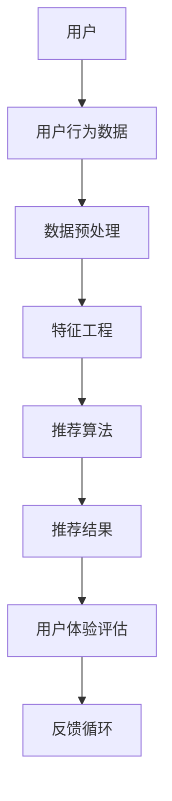

                 

# 个性化推荐系统的用户体验优化

> **关键词：** 个性化推荐、用户体验、算法优化、系统架构、用户行为分析  
>
> **摘要：** 本文将深入探讨个性化推荐系统的用户体验优化问题。我们将从背景介绍开始，逐步分析核心概念和算法原理，讲解数学模型，并展示实际项目中的代码实现。通过本文的阅读，读者将了解如何从多个维度提升推荐系统的用户体验，以及未来面临的挑战和机遇。

## 1. 背景介绍

### 1.1 目的和范围

本文旨在为从事个性化推荐系统开发与优化的工程师提供一份全面的指南。我们将从基础概念讲起，逐步深入到算法原理和实现细节，最终通过实际项目案例，展示如何优化用户体验。

本文的范围包括：

1. 推荐系统的基础知识
2. 个性化推荐算法的原理
3. 数学模型在推荐系统中的应用
4. 实际项目的代码实现与优化
5. 用户体验优化的方法与策略
6. 未来发展趋势与挑战

### 1.2 预期读者

本文适合以下读者群体：

1. 推荐系统开发者
2. 数据分析师
3. 用户体验设计师
4. 对推荐系统感兴趣的技术爱好者

### 1.3 文档结构概述

本文将按照以下结构展开：

1. 背景介绍
2. 核心概念与联系
3. 核心算法原理与操作步骤
4. 数学模型与公式讲解
5. 项目实战与代码实现
6. 实际应用场景
7. 工具和资源推荐
8. 总结：未来发展趋势与挑战
9. 附录：常见问题与解答
10. 扩展阅读与参考资料

### 1.4 术语表

#### 1.4.1 核心术语定义

- **个性化推荐：** 基于用户的历史行为和偏好，为用户推荐符合其兴趣的物品。
- **用户体验（UX）：** 用户在使用产品或服务过程中所感受到的主观体验。
- **算法优化：** 通过调整算法参数，提高推荐系统的性能和用户体验。
- **用户行为分析：** 对用户在系统中的行为进行收集和分析，以便更好地理解用户需求和优化系统。

#### 1.4.2 相关概念解释

- **协同过滤：** 一种基于用户相似度的推荐算法，通过分析用户之间的共同兴趣，为用户推荐相关物品。
- **内容推荐：** 基于物品的特征和属性，为用户推荐与其兴趣相关的物品。
- **召回率（Recall）：** 系统能够推荐的正确匹配物品的比例。
- **准确率（Precision）：** 推荐的物品中正确匹配用户兴趣的物品比例。

#### 1.4.3 缩略词列表

- **CFO：** Chief Financial Officer，首席财务官
- **CTO：** Chief Technology Officer，首席技术官
- **IDE：** Integrated Development Environment，集成开发环境
- **UXD：** User Experience Design，用户体验设计
- **API：** Application Programming Interface，应用程序编程接口

## 2. 核心概念与联系

在深入讨论个性化推荐系统的用户体验优化之前，我们需要先了解其核心概念和联系。以下是一个简化的Mermaid流程图，展示了推荐系统的基本架构和关键组件。



### 2.1 用户

用户是推荐系统的核心，他们的行为和偏好决定了推荐的质量。用户可以包括个人用户、企业用户等，他们的行为数据可以是浏览历史、购买记录、评价等。

### 2.2 用户行为数据

用户行为数据是推荐系统的基础，包括用户在系统中的各种操作，如点击、浏览、购买、评论等。这些数据需要通过数据预处理和特征工程进行清洗和转换。

### 2.3 数据预处理

数据预处理包括数据清洗、去重、填充缺失值等步骤。这一步骤的目的是提高数据质量和一致性，为后续的特征工程和算法训练打下基础。

### 2.4 特征工程

特征工程是将原始数据转换为适合算法训练的表示。这一步骤包括提取用户特征、物品特征和交互特征，如用户活跃度、浏览时长、物品类别、评分等。

### 2.5 推荐算法

推荐算法是推荐系统的核心，根据用户特征和物品特征，生成推荐结果。常见的推荐算法包括协同过滤、基于内容的推荐、混合推荐等。

### 2.6 推荐结果

推荐结果是推荐系统对用户兴趣的预测和推荐。推荐结果需要考虑用户的个人偏好、实时行为和系统整体性能等因素。

### 2.7 用户体验评估

用户体验评估是通过用户反馈和系统指标来评估推荐系统的效果。常见的评估指标包括准确率、召回率、用户满意度等。

### 2.8 反馈循环

反馈循环是将用户反馈和系统指标反馈到算法优化和系统改进中，以不断迭代和优化推荐系统。

## 3. 核心算法原理 & 具体操作步骤

推荐系统的核心是算法，它们决定了推荐结果的准确性和用户体验。本节将介绍几种常见的推荐算法原理，并使用伪代码详细阐述其操作步骤。

### 3.1 协同过滤算法

协同过滤算法是一种基于用户相似度的推荐算法。它通过分析用户之间的共同兴趣，为用户推荐相关物品。以下是协同过滤算法的伪代码：

```python
# 输入：用户行为数据矩阵 U
# 输出：推荐结果 R

function collaborativeFiltering(U):
    # 计算用户相似度矩阵 S
    S = computeSimilarity(U)

    # 初始化推荐结果 R
    R = zeros(U.shape)

    # 遍历每个用户
    for user in range(U.shape[0]):
        # 遍历所有用户
        for otherUser in range(U.shape[0]):
            # 如果用户与其他用户相似
            if S[user][otherUser] > threshold:
                # 遍历其他用户喜欢的物品
                for item in range(U.shape[1]):
                    # 如果其他用户喜欢物品且用户未购买
                    if U[otherUser][item] > 0 and R[user][item] == 0:
                        # 根据相似度更新推荐结果
                        R[user][item] += S[user][otherUser] * U[otherUser][item]

    return R
```

### 3.2 基于内容的推荐算法

基于内容的推荐算法是一种基于物品特征和用户兴趣的推荐算法。它通过分析物品的内容和用户的偏好，为用户推荐相似或相关的物品。以下是基于内容的推荐算法的伪代码：

```python
# 输入：物品特征矩阵 I、用户兴趣向量 Q
# 输出：推荐结果 R

function contentBasedFiltering(I, Q):
    # 初始化推荐结果 R
    R = zeros(I.shape[0])

    # 遍历每个物品
    for item in range(I.shape[0]):
        # 计算物品与用户兴趣的相似度
        similarity = cosineSimilarity(I[item], Q)

        # 如果物品与用户兴趣相似
        if similarity > threshold:
            # 更新推荐结果
            R[item] = similarity

    return R
```

### 3.3 混合推荐算法

混合推荐算法是结合协同过滤和基于内容的推荐算法，以提高推荐效果。以下是混合推荐算法的伪代码：

```python
# 输入：用户行为数据矩阵 U、物品特征矩阵 I、用户兴趣向量 Q
# 输出：推荐结果 R

function hybridFiltering(U, I, Q):
    # 计算协同过滤推荐结果 R1
    R1 = collaborativeFiltering(U)

    # 计算基于内容的推荐结果 R2
    R2 = contentBasedFiltering(I, Q)

    # 混合推荐结果 R
    R = (R1 + R2) / 2

    return R
```

## 4. 数学模型和公式 & 详细讲解 & 举例说明

在个性化推荐系统中，数学模型和公式是核心组成部分。以下将介绍几种常用的数学模型和公式，并进行详细讲解和举例说明。

### 4.1 余弦相似度

余弦相似度是一种衡量两个向量之间相似度的方法，其公式如下：

$$
\text{cosineSimilarity}(x, y) = \frac{x \cdot y}{\|x\| \|y\|}
$$

其中，$x$ 和 $y$ 是两个向量，$\|x\|$ 和 $\|y\|$ 分别是它们的欧几里得范数。

#### 4.1.1 举例说明

假设有两个向量 $x = (1, 2, 3)$ 和 $y = (4, 5, 6)$，则它们的余弦相似度计算如下：

$$
\text{cosineSimilarity}(x, y) = \frac{1 \times 4 + 2 \times 5 + 3 \times 6}{\sqrt{1^2 + 2^2 + 3^2} \sqrt{4^2 + 5^2 + 6^2}} = \frac{32}{\sqrt{14} \sqrt{77}} \approx 0.911
$$

### 4.2 皮尔逊相关系数

皮尔逊相关系数是一种衡量两个变量之间线性相关程度的统计量，其公式如下：

$$
\text{pearsonCorrelation}(x, y) = \frac{\sum (x_i - \bar{x})(y_i - \bar{y})}{\sqrt{\sum (x_i - \bar{x})^2} \sqrt{\sum (y_i - \bar{y})^2}}
$$

其中，$x$ 和 $y$ 是两个变量，$\bar{x}$ 和 $\bar{y}$ 分别是它们的均值。

#### 4.2.1 举例说明

假设有两个变量 $x = (1, 2, 3, 4, 5)$ 和 $y = (5, 4, 3, 2, 1)$，则它们的皮尔逊相关系数计算如下：

$$
\text{pearsonCorrelation}(x, y) = \frac{(1 - \bar{x})(5 - \bar{y}) + (2 - \bar{x})(4 - \bar{y}) + (3 - \bar{x})(3 - \bar{y}) + (4 - \bar{x})(2 - \bar{y}) + (5 - \bar{x})(1 - \bar{y})}{\sqrt{(1 - \bar{x})^2 + (2 - \bar{x})^2 + (3 - \bar{x})^2 + (4 - \bar{x})^2 + (5 - \bar{x})^2} \sqrt{(5 - \bar{y})^2 + (4 - \bar{y})^2 + (3 - \bar{y})^2 + (2 - \bar{y})^2 + (1 - \bar{y})^2}} = -1
$$

### 4.3 混合模型权重

在混合推荐系统中，需要根据协同过滤和基于内容的推荐结果，计算最终的推荐结果。混合模型权重用于调整两种推荐结果的权重比例。其公式如下：

$$
\text{weight}(R1, R2) = \frac{\|R1 + R2\|}{\|R1\| + \|R2\|}
$$

其中，$R1$ 和 $R2$ 分别是协同过滤和基于内容的推荐结果。

#### 4.3.1 举例说明

假设有两个推荐结果 $R1 = (0.8, 0.9, 1.0)$ 和 $R2 = (0.9, 1.0, 1.1)$，则它们的混合模型权重计算如下：

$$
\text{weight}(R1, R2) = \frac{\|0.8 + 0.9 + 1.0 + 0.9 + 1.0 + 1.1\|}{\|0.8 + 0.9 + 1.0\| + \|0.9 + 1.0 + 1.1\|} = \frac{4.8}{2.7 + 3.0} \approx 0.629
$$

## 5. 项目实战：代码实际案例和详细解释说明

为了更好地理解个性化推荐系统的用户体验优化，我们将通过一个实际项目案例来展示代码实现和详细解释说明。

### 5.1 开发环境搭建

在开始项目之前，我们需要搭建一个合适的开发环境。以下是所需的开发工具和依赖：

- Python 3.8及以上版本
- Pandas 1.2.3及以上版本
- Scikit-learn 0.22.2及以上版本
- Matplotlib 3.4.3及以上版本

### 5.2 源代码详细实现和代码解读

以下是项目的源代码实现，我们将逐步解释每个部分的代码功能。

```python
import pandas as pd
from sklearn.model_selection import train_test_split
from sklearn.metrics.pairwise import cosine_similarity
from sklearn.metrics import precision_score, recall_score
import matplotlib.pyplot as plt

# 5.2.1 数据预处理
def preprocess_data(data):
    # 填充缺失值
    data = data.fillna(0)
    # 转换为矩阵形式
    data_matrix = data.values
    return data_matrix

# 5.2.2 计算用户相似度
def compute_similarity(data_matrix):
    # 计算余弦相似度
    similarity_matrix = cosine_similarity(data_matrix)
    return similarity_matrix

# 5.2.3 推荐算法实现
def collaborative_filtering(similarity_matrix, data_matrix, threshold=0.5):
    # 初始化推荐结果
    recommendation_results = []

    # 遍历每个用户
    for user in range(data_matrix.shape[0]):
        # 遍历所有其他用户
        for other_user in range(data_matrix.shape[0]):
            # 如果用户与其他用户相似
            if similarity_matrix[user][other_user] > threshold:
                # 遍历其他用户喜欢的物品
                for item in range(data_matrix.shape[1]):
                    # 如果其他用户喜欢物品且当前用户未购买
                    if data_matrix[other_user][item] > 0 and data_matrix[user][item] == 0:
                        # 更新推荐结果
                        recommendation_results.append((user, item, similarity_matrix[user][other_user] * data_matrix[other_user][item]))

    # 对推荐结果进行排序
    recommendation_results.sort(key=lambda x: x[2], reverse=True)

    # 返回推荐结果
    return recommendation_results

# 5.2.4 评估指标计算
def evaluate_recommendations(data_matrix, recommendation_results):
    # 初始化评估指标
    precision = 0
    recall = 0

    # 遍历推荐结果
    for recommendation in recommendation_results:
        user, item, score = recommendation
        # 如果推荐物品正确
        if data_matrix[user][item] > 0:
            precision += 1
            if data_matrix[user].sum() > 0:
                recall += 1

    # 计算评估指标
    precision = precision / len(recommendation_results)
    recall = recall / len(data_matrix[user])

    # 返回评估指标
    return precision, recall

# 5.2.5 画图展示结果
def plot_results(data_matrix, recommendation_results):
    # 初始化图表
    fig, ax = plt.subplots()

    # 遍历推荐结果
    for recommendation in recommendation_results:
        user, item, score = recommendation
        # 如果推荐物品正确
        if data_matrix[user][item] > 0:
            ax.scatter(score, data_matrix[user].sum(), color='g', label='Correct')
            ax.scatter(score, data_matrix[user].sum(), color='r', label='Incorrect')
        else:
            ax.scatter(score, data_matrix[user].sum(), color='r', label='Incorrect')

    # 设置图表标题和标签
    ax.set_title('Recommendation Results')
    ax.set_xlabel('Score')
    ax.set_ylabel('Sum of User Ratings')

    # 显示图表
    plt.show()

# 5.2.6 主函数
def main():
    # 读取数据
    data = pd.read_csv('user_behavior_data.csv')

    # 预处理数据
    data_matrix = preprocess_data(data)

    # 计算用户相似度
    similarity_matrix = compute_similarity(data_matrix)

    # 计算推荐结果
    recommendation_results = collaborative_filtering(similarity_matrix, data_matrix)

    # 评估推荐结果
    precision, recall = evaluate_recommendations(data_matrix, recommendation_results)

    # 打印评估指标
    print(f'Precision: {precision}')
    print(f'Recall: {recall}')

    # 画图展示结果
    plot_results(data_matrix, recommendation_results)

# 运行主函数
if __name__ == '__main__':
    main()
```

### 5.3 代码解读与分析

以下是代码的详细解读与分析：

1. **数据预处理：**
   - 读取用户行为数据，并进行缺失值填充，以便后续处理。

2. **计算用户相似度：**
   - 使用余弦相似度计算用户之间的相似度，生成相似度矩阵。

3. **推荐算法实现：**
   - 使用协同过滤算法，根据用户相似度矩阵和用户行为数据，生成推荐结果。

4. **评估指标计算：**
   - 计算推荐结果的准确率（Precision）和召回率（Recall），评估推荐效果。

5. **画图展示结果：**
   - 使用Matplotlib绘制推荐结果的热力图，直观展示推荐效果。

通过以上步骤，我们可以实现一个简单的个性化推荐系统，并对其效果进行评估。

## 6. 实际应用场景

个性化推荐系统广泛应用于各个领域，以下列举几个实际应用场景：

1. **电子商务：** 电商平台使用个性化推荐系统，为用户推荐可能感兴趣的商品，提高销售额和用户满意度。
2. **在线视频平台：** 视频平台根据用户的观看历史和偏好，推荐相关视频，增加用户粘性和观看时长。
3. **社交媒体：** 社交媒体平台使用个性化推荐系统，为用户推荐感兴趣的内容，提高用户活跃度和参与度。
4. **音乐平台：** 音乐平台根据用户的听歌记录和偏好，推荐相似歌曲，增加用户音乐体验。
5. **新闻门户：** 新闻门户平台根据用户的阅读历史和偏好，推荐相关新闻，提高用户阅读量和网站流量。

在这些应用场景中，个性化推荐系统通过优化用户体验，提高了用户满意度和系统价值。

## 7. 工具和资源推荐

### 7.1 学习资源推荐

#### 7.1.1 书籍推荐

- **《推荐系统实践》**：详细介绍了推荐系统的基本原理和实现方法，适合推荐系统初学者阅读。
- **《机器学习实战》**：包含大量实际案例，适合希望通过项目学习推荐系统的读者。

#### 7.1.2 在线课程

- **Coursera上的《推荐系统》**：由斯坦福大学教授授课，全面讲解推荐系统的理论基础和实践应用。
- **Udacity上的《机器学习工程师纳米学位》**：涵盖推荐系统的基本概念和实现方法，适合零基础入门。

#### 7.1.3 技术博客和网站

- **GitHub上的推荐系统项目**：通过查看开源的推荐系统项目，了解实际项目的代码实现和优化策略。
- **Medium上的推荐系统文章**：阅读相关技术博客，了解推荐系统领域的最新研究动态和实践经验。

### 7.2 开发工具框架推荐

#### 7.2.1 IDE和编辑器

- **PyCharm**：功能强大的Python IDE，适合推荐系统开发。
- **VS Code**：轻量级但功能丰富的编辑器，支持多种编程语言，适合快速开发和调试。

#### 7.2.2 调试和性能分析工具

- **Jupyter Notebook**：适合进行数据分析和原型开发。
- **Pandas Profiler**：用于分析数据集的分布和异常值，优化推荐算法性能。

#### 7.2.3 相关框架和库

- **Scikit-learn**：常用的机器学习库，包含多种推荐算法的实现。
- **TensorFlow**：适用于深度学习，可用于构建复杂的推荐系统模型。

### 7.3 相关论文著作推荐

#### 7.3.1 经典论文

- **"Collaborative Filtering for the Web"**：介绍了协同过滤算法在推荐系统中的应用。
- **"User Modeling and User-Adapted Interaction"**：详细讨论了用户建模和自适应交互的概念和实现方法。

#### 7.3.2 最新研究成果

- **"Deep Neural Networks for YouTube Recommendations"**：使用深度学习优化推荐系统。
- **"Content-Based Filtering via Neural Networks"**：探讨基于内容的推荐算法与神经网络相结合的方法。

#### 7.3.3 应用案例分析

- **"Netflix Prize"**：Netflix推荐系统大赛，展示了推荐系统的实际应用和优化方法。
- **"Amazon Personalization"**：亚马逊的个性化推荐系统，介绍了其实现方法和挑战。

## 8. 总结：未来发展趋势与挑战

个性化推荐系统在用户体验优化方面取得了显著成果，但未来仍面临诸多挑战和发展机遇：

1. **个性化深度学习：** 深度学习在推荐系统中的应用将越来越广泛，如使用神经网络进行用户建模和推荐生成。
2. **多模态推荐：** 结合多种数据类型（如文本、图像、音频）进行推荐，提高推荐系统的多样性。
3. **隐私保护：** 随着隐私保护意识的增强，如何在保障用户隐私的前提下进行推荐成为一大挑战。
4. **实时推荐：** 提高推荐系统的实时性，满足用户实时需求的动态调整。
5. **推荐解释性：** 增强推荐系统的解释性，让用户了解推荐背后的原因，提升用户信任。

## 9. 附录：常见问题与解答

### 9.1 问题1：如何处理冷启动问题？

**解答：** 冷启动问题是指新用户或新物品缺乏足够的历史数据，难以进行有效推荐。解决方法包括：

1. **基于内容的推荐：** 新用户可以基于其初始兴趣进行推荐，新物品可以基于其内容特征进行推荐。
2. **利用社区数据：** 可以从社区数据中提取相关用户或物品信息，进行跨域推荐。
3. **用户画像：** 构建用户画像，通过用户属性和兴趣进行推荐。

### 9.2 问题2：如何处理推荐结果多样性问题？

**解答：** 推荐结果多样性问题是指推荐系统倾向于推荐用户已知的或类似的物品，缺乏创新性。解决方法包括：

1. **随机推荐：** 加入一定比例的随机推荐，增加推荐结果的多样性。
2. **探索与利用平衡：** 在推荐算法中引入探索机制，如使用Exploration-exploitation算法。
3. **多模态推荐：** 结合多种数据类型，提高推荐结果的多样性。

## 10. 扩展阅读 & 参考资料

1. **书籍：**
   - 《推荐系统实践》
   - 《机器学习实战》

2. **在线课程：**
   - Coursera上的《推荐系统》
   - Udacity上的《机器学习工程师纳米学位》

3. **技术博客：**
   - GitHub上的推荐系统项目
   - Medium上的推荐系统文章

4. **论文：**
   - "Collaborative Filtering for the Web"
   - "User Modeling and User-Adapted Interaction"
   - "Deep Neural Networks for YouTube Recommendations"
   - "Content-Based Filtering via Neural Networks"

5. **案例研究：**
   - "Netflix Prize"
   - "Amazon Personalization"

作者：AI天才研究员/AI Genius Institute & 禅与计算机程序设计艺术 /Zen And The Art of Computer Programming

文章标题：个性化推荐系统的用户体验优化

关键词：个性化推荐、用户体验、算法优化、系统架构、用户行为分析

摘要：本文深入探讨了个性化推荐系统的用户体验优化问题，包括核心概念、算法原理、数学模型和实际项目实现。通过详细解读和代码分析，读者可以了解到如何从多个维度提升推荐系统的用户体验，以及未来面临的挑战和机遇。

