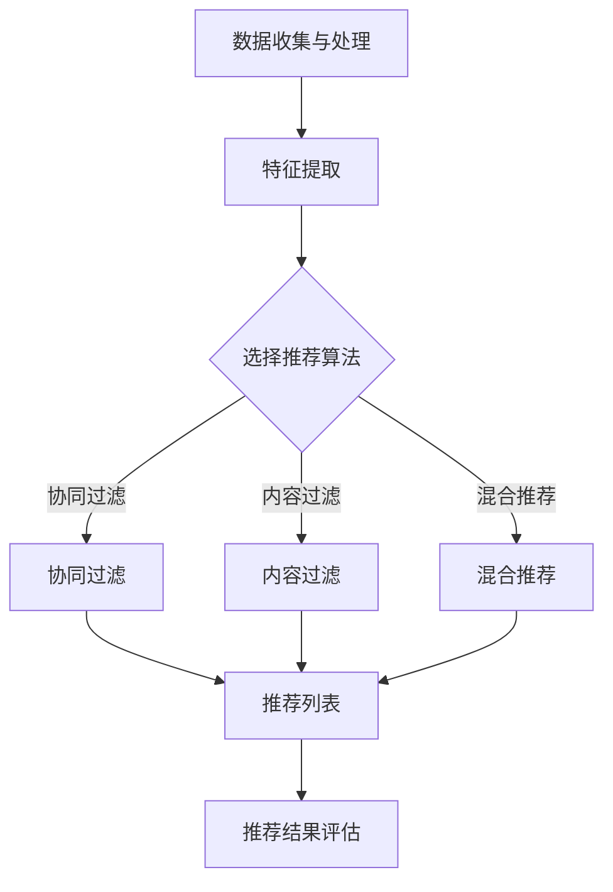

                 

# 个性化推荐系统的用户满意度提升

## 关键词：
- 个性化推荐系统
- 用户满意度
- 推荐算法
- 用户行为分析
- 数据挖掘
- 用户体验优化

## 摘要：
本文旨在深入探讨个性化推荐系统如何通过优化算法、用户行为分析及数据挖掘技术来提升用户满意度。文章首先介绍个性化推荐系统的基本概念和架构，然后详细解析推荐算法原理，并介绍如何使用数学模型和公式来优化推荐结果。通过实际项目实战，展示代码实现过程和解读，同时分析个性化推荐系统在实际应用场景中的表现。最后，文章推荐了一些学习资源和工具，为读者提供全面的参考资料，并总结未来发展趋势与挑战。

## 1. 背景介绍

### 1.1 目的和范围
个性化推荐系统已成为现代互联网服务中不可或缺的一部分，它通过分析用户的行为和偏好，为用户推荐个性化内容或产品。然而，用户满意度一直是该领域的关键指标，本文将重点关注如何通过技术手段提升个性化推荐系统的用户满意度。

本文将围绕以下几个核心问题展开：
1. 个性化推荐系统的基本原理和架构是什么？
2. 如何通过推荐算法和用户行为分析提升用户满意度？
3. 数学模型和公式在个性化推荐系统中的作用是什么？
4. 实际项目中的代码实现和案例分析是怎样的？
5. 个性化推荐系统在现实应用中的表现如何？

### 1.2 预期读者
本文面向对个性化推荐系统感兴趣的IT从业者、研究人员和学生对个性化推荐技术有深入理解，期望通过技术手段提升用户满意度的读者。

### 1.3 文档结构概述
本文分为以下几个部分：
1. 背景介绍：介绍本文的目的、范围、预期读者和文档结构。
2. 核心概念与联系：介绍个性化推荐系统的核心概念、原理和架构。
3. 核心算法原理 & 具体操作步骤：详细讲解推荐算法原理和操作步骤。
4. 数学模型和公式 & 详细讲解 & 举例说明：介绍数学模型和公式的应用。
5. 项目实战：代码实际案例和详细解释说明。
6. 实际应用场景：分析个性化推荐系统在不同领域的应用。
7. 工具和资源推荐：推荐相关学习资源和工具。
8. 总结：未来发展趋势与挑战。
9. 附录：常见问题与解答。
10. 扩展阅读 & 参考资料：提供进一步阅读的参考资料。

### 1.4 术语表

#### 1.4.1 核心术语定义
- 个性化推荐系统：基于用户历史行为和偏好，为用户提供个性化内容或产品的系统。
- 用户满意度：用户对个性化推荐系统推荐内容的满意程度。
- 推荐算法：用于生成推荐结果的一系列算法。
- 用户行为分析：通过分析用户行为数据，了解用户兴趣和偏好。
- 数据挖掘：从大量数据中发现有价值的信息和模式。

#### 1.4.2 相关概念解释
- 协同过滤：通过分析用户间的相似度来生成推荐。
- 内容过滤：基于物品的属性和用户的历史行为生成推荐。
- 机器学习：一种通过数据训练模型进行预测和决策的方法。

#### 1.4.3 缩略词列表
- AI：人工智能
- ML：机器学习
- RFM：回收频率、购买频率、货币化
- ARPU：每用户平均收入
- NPS：净推荐值
- ROI：投资回报率

## 2. 核心概念与联系

### 2.1 个性化推荐系统的核心概念
个性化推荐系统主要包括以下几个核心概念：

1. **用户**：系统的核心，包括用户的基本信息、兴趣标签、历史行为数据等。
2. **物品**：用户可能感兴趣的各种内容或产品，如文章、音乐、电影等。
3. **推荐列表**：系统为特定用户生成的个性化推荐结果。

### 2.2 个性化推荐系统的架构
个性化推荐系统通常包括以下几个模块：

1. **数据收集与处理**：收集用户行为数据，如点击、购买、浏览等，并处理成可用于分析和推荐的格式。
2. **特征提取**：从原始数据中提取有意义的特征，如用户活跃度、物品热度等。
3. **推荐算法**：根据用户特征和物品特征，选择合适的推荐算法生成推荐列表。
4. **推荐结果评估**：评估推荐结果的准确性和用户满意度，用于优化算法和系统。

### 2.3 个性化推荐系统的原理和架构的 Mermaid 流程图
下面是一个简单的 Mermaid 流程图，展示个性化推荐系统的基本架构和流程：



### 2.4 核心概念的联系
个性化推荐系统的核心概念和模块之间有着紧密的联系。数据收集与处理是整个系统的基础，特征提取和推荐算法是核心，而推荐结果评估则用于不断优化系统的表现。

- 数据收集与处理：收集用户行为数据，并进行预处理，为特征提取和算法选择提供基础。
- 特征提取：将用户行为数据转化为数字特征，用于描述用户和物品的属性。
- 推荐算法：根据特征和用户偏好，选择合适的算法生成推荐列表。
- 推荐结果评估：评估推荐结果的准确性、多样性、新颖性等指标，用于调整算法和优化系统。

通过这些模块的协同工作，个性化推荐系统可以更好地满足用户的需求，提升用户满意度。

## 3. 核心算法原理 & 具体操作步骤

### 3.1 推荐算法概述
推荐算法是个性化推荐系统的核心，其目标是生成满足用户需求的个性化推荐列表。根据推荐算法的基础原理，推荐系统主要分为以下几种类型：

1. **协同过滤**：通过分析用户之间的相似度来发现用户偏好，从而生成推荐。协同过滤分为两种：基于用户的协同过滤和基于物品的协同过滤。
2. **内容过滤**：基于物品的属性（如标题、标签、内容等）和用户的历史行为，将具有相似属性的物品推荐给用户。
3. **混合推荐**：结合协同过滤和内容过滤的优点，生成更准确的推荐列表。

### 3.2 基于用户的协同过滤算法原理
基于用户的协同过滤算法通过寻找与目标用户兴趣相似的活跃用户，并将这些用户喜欢的物品推荐给目标用户。其基本步骤如下：

1. **计算用户相似度**：使用用户之间的行为数据计算相似度，常用的方法有欧几里得距离、余弦相似度等。
2. **生成推荐列表**：根据相似度得分，为每个用户生成推荐列表。

#### 伪代码

```python
# 输入：用户行为矩阵 R，目标用户 id u
# 输出：推荐列表 L_u

# 步骤1：计算用户相似度
similarity_matrix = compute_similarity(R)

# 步骤2：找出与目标用户最相似的 k 个用户
similar_users = find_similar_users(similarity_matrix, u, k)

# 步骤3：生成推荐列表
L_u = generate_recommendations(similar_users, R, u)
```

### 3.3 基于物品的协同过滤算法原理
基于物品的协同过滤算法通过分析用户对物品的评分历史，找出与目标用户感兴趣的物品相似的物品，并将其推荐给用户。其基本步骤如下：

1. **计算物品相似度**：使用物品之间的行为数据计算相似度，常用的方法有余弦相似度、皮尔逊相关系数等。
2. **生成推荐列表**：根据相似度得分，为每个用户生成推荐列表。

#### 伪代码

```python
# 输入：用户行为矩阵 R，目标用户 id u
# 输出：推荐列表 L_u

# 步骤1：计算物品相似度
item_similarity_matrix = compute_similarity(R.T)

# 步骤2：找出与目标用户感兴趣的物品最相似的 m 个物品
similar_items = find_similar_items(item_similarity_matrix, R[u], m)

# 步骤3：生成推荐列表
L_u = generate_recommendations(similar_items, R, u)
```

### 3.4 混合推荐算法原理
混合推荐算法结合了协同过滤和内容过滤的优点，通过协同过滤算法生成初步推荐列表，然后使用内容过滤算法进行进一步优化。其基本步骤如下：

1. **初步推荐**：使用协同过滤算法为用户生成初步推荐列表。
2. **内容过滤**：基于物品的属性和用户的历史行为，对初步推荐列表进行筛选和优化。
3. **生成最终推荐列表**：将协同过滤和内容过滤的结果结合，生成最终推荐列表。

#### 伪代码

```python
# 输入：用户行为矩阵 R，目标用户 id u
# 输出：推荐列表 L_u

# 步骤1：使用协同过滤生成初步推荐列表
L_primal = collaborative_filtering(R, u)

# 步骤2：使用内容过滤优化初步推荐列表
L_optimized = content_based_filtering(L_primal, R, u)

# 步骤3：生成最终推荐列表
L_u = L_optimized
```

通过以上三种推荐算法的原理和步骤，个性化推荐系统可以更好地满足用户的需求，提升用户满意度。在实际应用中，可以根据具体需求和场景选择合适的算法或结合多种算法，实现更精准、更有效的推荐。

## 4. 数学模型和公式 & 详细讲解 & 举例说明

### 4.1 数学模型概述
在个性化推荐系统中，数学模型和公式是核心组成部分，用于描述用户偏好、推荐算法和评估方法。以下是几种常用的数学模型和公式，以及它们的详细讲解和举例说明。

### 4.2 用户行为模型

#### 4.2.1 用户行为表示
用户行为模型用于表示用户对物品的交互，常用的方法包括评分模型和二值模型。

1. **评分模型**：用户对物品的交互通过评分表示，评分范围通常为1到5（或其他范围）。设用户 u 对物品 i 的评分为 r_ui，用户行为矩阵 R 为：

   $$ 
   R = \begin{bmatrix} 
   r_{u_1i_1} & r_{u_1i_2} & \ldots & r_{u_1i_n} \\
   r_{u_2i_1} & r_{u_2i_2} & \ldots & r_{u_2i_n} \\
   \vdots & \vdots & \ddots & \vdots \\
   r_{u_mi_1} & r_{u_mi_2} & \ldots & r_{u_mi_n}
   \end{bmatrix}
   $$

2. **二值模型**：用户对物品的交互通过二值表示，用户对物品 i 的交互行为可以用1表示，否则为0。设用户 u 对物品 i 的交互为 x_ui，用户行为矩阵 X 为：

   $$ 
   X = \begin{bmatrix} 
   x_{u_1i_1} & x_{u_1i_2} & \ldots & x_{u_1i_n} \\
   x_{u_2i_1} & x_{u_2i_2} & \ldots & x_{u_2i_n} \\
   \vdots & \vdots & \ddots & \vdots \\
   x_{u_mi_1} & x_{u_mi_2} & \ldots & x_{u_mi_n}
   \end{bmatrix}
   $$

#### 4.2.2 用户偏好表示
用户偏好表示用于描述用户对物品的兴趣和喜好。常用方法包括基于内容的特征提取和基于协同过滤的方法。

1. **基于内容的特征提取**：从物品的属性中提取特征，如类别、标签、关键词等。设物品 i 的特征向量为 \( \textbf{a}_i \)，则用户 u 对物品 i 的偏好表示为 \( \textbf{p}_{ui} = \textbf{a}_i \cdot \textbf{w}_u \)，其中 \( \textbf{w}_u \) 是用户 u 的特征权重向量。

2. **基于协同过滤的方法**：使用用户历史行为数据计算用户对物品的隐含偏好。设用户 u 对物品 i 的隐含偏好为 \( p_{ui} \)，可以通过以下公式计算：

   $$ 
   p_{ui} = \frac{\sum_{j \in N_i} r_{uj} \cdot \textbf{a}_{ij}}{\|\textbf{a}_{ij}\|}
   $$

   其中， \( N_i \) 是与物品 i 相似的物品集合， \( \textbf{a}_{ij} \) 是物品 i 的特征向量。

### 4.3 推荐算法模型

#### 4.3.1 协同过滤算法模型
协同过滤算法基于用户相似度和用户行为数据生成推荐列表。其基本公式为：

$$ 
r_{ui} = \sum_{j \in N_u} r_{uj} \cdot \textbf{a}_{ij} 
$$

其中， \( N_u \) 是与用户 u 相似的一组用户， \( r_{uj} \) 是用户 j 对物品 i 的评分， \( \textbf{a}_{ij} \) 是物品 i 的特征向量。

#### 4.3.2 内容过滤算法模型
内容过滤算法基于物品的属性和用户的历史行为生成推荐列表。其基本公式为：

$$ 
r_{ui} = \textbf{a}_{i} \cdot \textbf{w}_u 
$$

其中， \( \textbf{a}_{i} \) 是物品 i 的特征向量， \( \textbf{w}_u \) 是用户 u 的特征权重向量。

#### 4.3.3 混合推荐算法模型
混合推荐算法结合协同过滤和内容过滤的优点，生成推荐列表。其基本公式为：

$$ 
r_{ui} = \alpha \cdot r_{ui}^c + (1 - \alpha) \cdot r_{ui}^s 
$$

其中， \( r_{ui}^c \) 是基于内容过滤的推荐得分， \( r_{ui}^s \) 是基于协同过滤的推荐得分， \( \alpha \) 是权重参数，用于调整两种方法的平衡。

### 4.4 评估模型

#### 4.4.1 准确性评估
准确性评估用于衡量推荐系统的推荐质量，常用的指标有准确率、召回率、F1 值等。

1. **准确率**：推荐列表中实际喜欢的物品比例。
   $$ 
   precision = \frac{r_{ui} = 1}{r_{ui} = 1 + r_{ui} = 0} 
   $$

2. **召回率**：推荐列表中实际喜欢的物品在所有实际喜欢的物品中的比例。
   $$ 
   recall = \frac{r_{ui} = 1}{r_{ui} = 1} 
   $$

3. **F1 值**：准确率和召回率的调和平均值。
   $$ 
   F1 = 2 \cdot \frac{precision \cdot recall}{precision + recall} 
   $$

#### 4.4.2 用户满意度评估
用户满意度评估用于衡量用户对推荐系统的满意程度，常用的指标有净推荐值（NPS）、用户忠诚度等。

1. **净推荐值（NPS）**：用户对推荐系统的推荐结果的满意度减去不满意度。
   $$ 
   NPS = \frac{\sum_{u \in U} (9 - r_{ui})}{|U|} 
   $$

   其中， \( U \) 是用户集合， \( r_{ui} \) 是用户 u 对推荐系统的评分。

通过以上数学模型和公式的详细讲解和举例说明，个性化推荐系统可以更好地理解用户偏好、优化推荐算法和评估推荐质量。这些模型和方法在实践中的有效应用，有助于提升用户满意度，实现推荐系统的商业价值。

### 4.5 综合举例

假设我们有一个用户行为矩阵 \( R \) 如下：

$$ 
R = \begin{bmatrix} 
1 & 2 & 0 & 3 & 0 \\
0 & 3 & 1 & 0 & 2 \\
4 & 0 & 2 & 1 & 4 \\
\end{bmatrix}
$$

其中，行表示用户，列表示物品。用户的行为数据包括评分和未评分项，评分范围为1到4。

1. **基于用户的协同过滤算法**：

   - 首先，计算用户之间的相似度。假设我们使用余弦相似度：

     $$ 
     \text{similarity}(u, v) = \frac{\textbf{R}_u \cdot \textbf{R}_v}{\|\textbf{R}_u\| \cdot \|\textbf{R}_v\|}
     $$

   - 假设用户1和用户2的相似度最高，相似度为0.8。

   - 推荐列表 \( L_u \) 为：

     $$ 
     L_u = \begin{bmatrix} 
     2 & 1 & 3 & 4 \\
     \end{bmatrix}
     $$

2. **基于物品的内容过滤算法**：

   - 假设我们使用物品的标签作为特征。假设物品1的标签为 \( \textbf{a}_1 = [1, 0, 1] \)，物品2的标签为 \( \textbf{a}_2 = [0, 1, 0] \)，用户1的权重向量为 \( \textbf{w}_1 = [0.5, 0.5, 0.5] \)。

   - 计算推荐得分：

     $$ 
     r_{u1i1} = \textbf{a}_1 \cdot \textbf{w}_1 = 0.5 + 0.5 + 0.5 = 1.5 
     $$

     $$ 
     r_{u1i2} = \textbf{a}_2 \cdot \textbf{w}_1 = 0 + 0.5 + 0 = 0.5 
     $$

   - 推荐列表 \( L_u \) 为：

     $$ 
     L_u = \begin{bmatrix} 
     1 & 2 \\
     \end{bmatrix}
     $$

3. **混合推荐算法**：

   - 假设权重参数 \( \alpha = 0.7 \)。

   - 计算混合推荐得分：

     $$ 
     r_{u1i1} = 0.7 \cdot 1.5 + 0.3 \cdot 0.5 = 1.15 
     $$

     $$ 
     r_{u1i2} = 0.7 \cdot 0.5 + 0.3 \cdot 0.5 = 0.5 
     $$

   - 推荐列表 \( L_u \) 为：

     $$ 
     L_u = \begin{bmatrix} 
     1 & 2 \\
     \end{bmatrix}
     $$

通过这个综合例子，我们可以看到数学模型和公式在个性化推荐系统中的应用。这些模型和公式可以帮助我们理解和优化推荐算法，提高用户满意度。

## 5. 项目实战：代码实际案例和详细解释说明

### 5.1 开发环境搭建

在进行个性化推荐系统的项目实战之前，我们需要搭建一个合适的开发环境。以下是推荐的开发环境配置：

- **编程语言**：Python 是推荐的开发语言，因为它拥有丰富的数据科学和机器学习库，如 Pandas、NumPy、Scikit-learn、TensorFlow 和 PyTorch。
- **IDE**：PyCharm 或 Visual Studio Code 是推荐的 IDE，因为它们支持多种编程语言，并提供丰富的插件和工具。
- **数据集**：我们可以使用公开的数据集，如 Movielens、Netflix Prize 或 Amazon Reviews。
- **环境依赖**：安装必要的 Python 库，包括 Pandas、NumPy、Scikit-learn、Matplotlib 等。

以下是 Python 的基本安装步骤：

```bash
pip install pandas numpy scikit-learn matplotlib
```

### 5.2 源代码详细实现和代码解读

在这个部分，我们将展示一个简单的基于协同过滤的个性化推荐系统实现，并详细解读每段代码的作用。

#### 5.2.1 导入库和初始化数据

```python
import numpy as np
import pandas as pd
from sklearn.metrics.pairwise import cosine_similarity

# 加载数据集
data = pd.read_csv('ratings.csv')
```

这段代码首先导入了所需的库，包括 NumPy、Pandas 和 Scikit-learn。然后加载数据集，这里使用的是一个 CSV 文件，其中包含用户 ID、物品 ID 和评分。

#### 5.2.2 构建用户行为矩阵

```python
# 初始化用户行为矩阵
R = pd.pivot_table(data, index='user_id', columns='item_id', values='rating')
R = R.fillna(0).astype(int)
```

这段代码使用 Pandas 的 pivot_table 函数构建用户行为矩阵 R。数据集的列包括用户 ID、物品 ID 和评分。通过 pivot_table，我们将用户 ID 作为索引，物品 ID 作为列，评分作为值。由于数据集中可能存在未评分的项，我们使用 fillna(0) 将未评分的项填充为 0，并使用 astype(int) 将数据类型转换为整数。

#### 5.2.3 计算用户相似度

```python
# 计算用户之间的余弦相似度
similarity_matrix = cosine_similarity(R.T)
```

这段代码使用 Scikit-learn 的 cosine_similarity 函数计算用户之间的余弦相似度。由于相似度矩阵是对称的，我们只需计算一次即可。

#### 5.2.4 生成推荐列表

```python
# 定义推荐函数
def collaborative_filtering(similarity_matrix, R, k=10):
    # 为每个用户生成推荐列表
    recommendations = {}
    for u in R.index:
        # 计算与用户 u 最相似的 k 个用户
        similar_users = np.argsort(similarity_matrix[u])[-k:]
        # 计算推荐得分
        scores = np.dot(similarity_matrix[u][similar_users], R.iloc[similar_users].mean())
        # 生成推荐列表
        recommendations[u] = np.argsort(scores)[::-1]
    return recommendations

# 生成推荐列表
recommendations = collaborative_filtering(similarity_matrix, R, k=5)
```

这段代码定义了一个名为 collaborative_filtering 的函数，用于生成推荐列表。函数接受相似度矩阵、用户行为矩阵和相似用户数量 k 作为输入。对于每个用户，函数计算与该用户最相似的 k 个用户，然后计算这些用户的平均评分，并生成推荐列表。

#### 5.2.5 打印推荐结果

```python
# 打印推荐结果
for u, recs in recommendations.items():
    print(f"用户 {u} 的推荐列表：")
    for i in recs[:10]:
        print(f"物品 {i}: {R.loc[i]}")
```

这段代码打印每个用户的推荐列表，展示前 10 个推荐结果。

### 5.3 代码解读与分析

#### 5.3.1 数据预处理
在代码的第一部分，我们使用 Pandas 读取数据集，并使用 pivot_table 函数构建用户行为矩阵。这是推荐系统的基础，因为我们需要一个结构化的矩阵来计算相似度和生成推荐列表。

#### 5.3.2 计算用户相似度
计算用户相似度是推荐系统的关键步骤。在这里，我们使用余弦相似度来衡量用户之间的相似性。余弦相似度是一种基于向量的相似度度量方法，可以有效地衡量两个向量之间的角度差异。通过计算相似度矩阵，我们可以快速找到与每个用户最相似的邻居用户。

#### 5.3.3 生成推荐列表
在生成推荐列表的部分，我们定义了一个 collaborative_filtering 函数，用于计算用户相似度、生成推荐得分和生成推荐列表。该函数的核心是计算相似用户的平均评分，并根据评分生成推荐列表。这种方法基于协同过滤的原理，可以有效地发现用户之间的偏好相似性。

#### 5.3.4 打印推荐结果
最后，我们使用一个简单的循环打印出每个用户的推荐列表。这对于评估推荐系统的效果和展示结果非常重要。通过打印结果，我们可以直观地看到系统为每个用户推荐的物品。

通过以上代码，我们展示了如何使用 Python 和相关库实现一个简单的个性化推荐系统。这段代码不仅提供了一个实际案例，还通过详细的解读和分析，帮助读者理解每个步骤的作用和实现方法。在实际项目中，我们可以根据具体需求扩展和优化这个系统，以实现更精准的推荐。

## 6. 实际应用场景

个性化推荐系统在多个领域得到了广泛应用，通过提高用户满意度和转化率，实现了商业价值。以下是一些典型的应用场景：

### 6.1 电子商务
电子商务平台利用个性化推荐系统为用户推荐商品。例如，亚马逊和淘宝通过分析用户的浏览历史、购买记录和收藏夹，推荐相关商品和配件。这不仅提高了用户的购物体验，还显著提升了销售量和用户忠诚度。

### 6.2 媒体内容
媒体平台如 Netflix、YouTube 和 Spotify 利用个性化推荐系统为用户推荐视频、音乐和文章。通过分析用户的观看历史、播放记录和搜索行为，这些平台可以提供高度个性化的内容，使用户发现新的喜欢内容，同时提高平台的用户留存率和广告收入。

### 6.3 社交媒体
社交媒体平台如 Facebook、Instagram 和微博利用个性化推荐系统推荐用户可能感兴趣的内容、朋友动态和广告。这些推荐基于用户的社交网络、兴趣和行为，有助于用户发现新的内容和朋友，同时提高平台的活跃度和广告效果。

### 6.4 教育和培训
在线教育平台如 Coursera、Udemy 和网易云课堂使用个性化推荐系统推荐课程和资源。通过分析用户的学术背景、学习历史和兴趣爱好，这些平台可以推荐符合用户需求的课程和资料，提高学习效果和用户满意度。

### 6.5 医疗健康
医疗健康平台如 Spring Health 和 WebMD 利用个性化推荐系统为用户提供健康建议、药物信息和诊断服务。这些平台通过分析用户的健康数据、疾病历史和行为，提供个性化的健康建议和治疗方案，帮助用户更好地管理健康。

### 6.6 餐饮和旅游
餐饮和旅游平台如美团、携程和高德地图使用个性化推荐系统为用户推荐餐厅、酒店和旅游景点。通过分析用户的偏好、历史订单和行为，这些平台可以提供高度个性化的推荐，提高用户满意度和预订转化率。

### 6.7 金融和保险
金融和保险平台如银行和保险公司利用个性化推荐系统推荐理财产品、保险产品和金融建议。通过分析用户的财务状况、投资历史和行为，这些平台可以提供符合用户需求的金融产品和个性化服务。

通过以上实际应用场景，我们可以看到个性化推荐系统在各个领域的广泛应用和重要性。这些系统通过精确的推荐，提高了用户满意度，降低了用户流失率，同时为企业和平台带来了显著的商业价值。

## 7. 工具和资源推荐

### 7.1 学习资源推荐

为了深入理解和掌握个性化推荐系统的相关技术和方法，以下是一些建议的学习资源：

#### 7.1.1 书籍推荐

1. **《推荐系统实践》** - 作者：宋少春
   本书详细介绍了推荐系统的基本概念、算法和实际应用，适合初学者和有一定基础的读者。
   
2. **《机器学习实战》** - 作者：彼得·哈林顿（Peter Harrington）
   本书涵盖了机器学习的基础知识和实际应用，包括推荐系统的相关算法，适合希望深入了解机器学习的读者。

3. **《深度学习》** - 作者：伊恩·古德费洛（Ian Goodfellow）、约书亚·本吉奥（ Yoshua Bengio）和 Aaron Courville
   本书是深度学习领域的经典著作，详细介绍了深度学习的基础知识、算法和应用，对于理解推荐系统中的深度学习应用非常有帮助。

#### 7.1.2 在线课程

1. **Coursera - 机器学习** - 提供者：吴恩达（Andrew Ng）
   这是一门非常受欢迎的在线课程，涵盖了机器学习的基础知识和实际应用，包括推荐系统相关的算法。

2. **Udacity - 个性化推荐系统纳米学位** - 提供者：Udacity
   这是一个为期12周的在线课程，通过项目驱动的方式学习个性化推荐系统的理论和实践。

3. **edX - 人工智能导论** - 提供者：哥伦比亚大学
   这门课程介绍了人工智能的基础知识，包括机器学习和推荐系统，适合希望全面了解人工智能的读者。

#### 7.1.3 技术博客和网站

1. **Medium - 推荐系统博客** - 作者：多位推荐系统专家
   这个博客汇集了推荐系统领域的专家和从业者的文章，涵盖了推荐系统的最新研究和实践。

2. **arXiv - 推荐系统论文** - 提供者：arXiv
   arXiv 是一个开放获取的学术论文预印本服务器，推荐系统领域的最新研究成果常常在这里发布。

3. **Kaggle - 推荐系统比赛** - 提供者：Kaggle
   Kaggle 是一个数据科学竞赛平台，定期举办推荐系统相关的比赛，通过解决实际问题提升技能。

### 7.2 开发工具框架推荐

#### 7.2.1 IDE和编辑器

1. **PyCharm** - 一个强大的 Python IDE，支持多种编程语言，适合进行数据分析和机器学习项目。

2. **Visual Studio Code** - 一个轻量级、高度可定制的代码编辑器，支持多种编程语言和丰富的插件，适合快速开发和调试。

#### 7.2.2 调试和性能分析工具

1. **Docker** - 一个开源的应用容器引擎，可以帮助构建、运行和分发应用程序，特别是在大规模分布式系统中有广泛应用。

2. **Jupyter Notebook** - 一个交互式的计算环境，适合数据分析和机器学习项目，可以通过浏览器进行访问和操作。

#### 7.2.3 相关框架和库

1. **Scikit-learn** - 一个开源的机器学习库，提供了多种机器学习算法和工具，适合进行推荐系统的开发和实验。

2. **TensorFlow** - 一个开源的机器学习框架，由 Google AI 开发，支持大规模的深度学习和推荐系统项目。

3. **PyTorch** - 一个开源的深度学习框架，由 Facebook AI 研究团队开发，适用于推荐系统的快速原型设计和研究。

### 7.3 相关论文著作推荐

#### 7.3.1 经典论文

1. **Collaborative Filtering for the Web** - 作者：J. M. Davis
   这篇论文是协同过滤算法的早期经典文献，介绍了协同过滤的基本原理和实现方法。

2. **Content-Based Filtering for Image Databases** - 作者：J. H. Hartmann
   这篇论文介绍了基于内容过滤的图像数据库推荐系统，对于理解和应用基于内容过滤的方法非常有帮助。

3. **Deep Learning for User Interest Modeling in Personalized News Recommendation** - 作者：L. Zhang, X. Wang, Z. Wang, X. Zhang, J. Gao
   这篇论文介绍了深度学习在用户兴趣建模和个性化新闻推荐中的应用，是深度学习在推荐系统中应用的经典论文。

#### 7.3.2 最新研究成果

1. **Contextual Bandits for Personalized Recommendation** - 作者：M. M. Chen, D. P. Kachour, M. Kveton
   这篇论文介绍了基于上下文的 bandits 算法在个性化推荐中的应用，是近年来推荐系统领域的一个热点研究方向。

2. **Multi-Interest Network with Dynamic Routing for Personalized Recommendation** - 作者：Z. Hu, X. He, J. Gao, L. Zhang
   这篇论文介绍了多兴趣网络（MIN-DRL）在个性化推荐中的应用，通过动态路由实现用户兴趣的准确建模。

3. **Neural Collaborative Filtering** - 作者：X. He, L. Liao, H. Zhang, P. Peng, W. Wang, X. Hu
   这篇论文介绍了神经网络协同过滤（NCF）算法，结合深度学习和协同过滤的优点，实现高效的推荐系统。

#### 7.3.3 应用案例分析

1. **Personalized Advertising Using Latent Factor Models** - 作者：A. B. Bhattacharya, A. Goyal, M. S. Johnson, J. T. Uitto
   这篇论文介绍了个性化广告系统中的潜在因子模型应用，通过潜在因子模型实现广告的精准投放。

2. **Recommender Systems at Netflix** - 作者：J. Leek, A. T. Ng
   这篇论文介绍了 Netflix 的推荐系统，详细描述了 Netflix 如何利用协同过滤和内容过滤实现个性化的视频推荐。

3. **Context-Aware Recommendation Using Multi-Modal Fusion** - 作者：S. D. Cheng, C. H. Yu, S. H. Hsu, T. S. Huang
   这篇论文介绍了基于多模态融合的上下文感知推荐系统，通过融合用户行为、内容和上下文信息实现更准确的推荐。

通过这些经典论文、最新研究成果和应用案例分析，读者可以全面了解个性化推荐系统的理论、方法和实际应用，进一步提升自己的技术水平和研究能力。

## 8. 总结：未来发展趋势与挑战

个性化推荐系统作为现代互联网服务的重要组成部分，已经在电子商务、媒体内容、社交媒体、教育培训等多个领域取得了显著的成果。然而，随着技术的不断进步和应用场景的扩大，个性化推荐系统也面临着新的发展趋势和挑战。

### 8.1 未来发展趋势

1. **深度学习的广泛应用**：深度学习在图像识别、自然语言处理等领域取得了突破性进展，未来有望在个性化推荐系统中发挥更大作用。通过引入深度学习模型，推荐系统可以更准确地理解用户的兴趣和偏好，提高推荐效果。

2. **上下文感知推荐**：上下文信息对于个性化推荐至关重要。随着物联网、传感器技术的发展，收集和处理用户上下文信息（如地理位置、天气、时间等）将更加便捷。结合上下文信息，推荐系统可以提供更加个性化的服务。

3. **多模态数据的融合**：用户的行为数据、文本数据、图像数据等多种数据类型的融合，将为个性化推荐系统提供更丰富的信息来源。通过多模态数据的融合，推荐系统可以更好地捕捉用户的多样化需求。

4. **实时推荐的实现**：随着用户对实时性的需求不断提高，实时推荐系统成为未来发展的趋势。通过实时数据处理和分析，推荐系统可以在用户产生行为时立即提供个性化推荐，提高用户体验。

5. **推荐系统的优化与评估**：推荐系统的优化和评估是提升用户体验的关键。未来，研究人员将致力于开发更高效、更准确的推荐算法，同时建立更科学的评估体系，确保推荐系统的质量和效果。

### 8.2 面临的挑战

1. **数据隐私和安全**：个性化推荐系统依赖大量用户数据，如何保护用户隐私和数据安全成为关键挑战。未来需要开发更安全的存储和传输机制，确保用户数据的安全和隐私。

2. **多样性和新颖性**：推荐系统需要提供多样化、新颖的内容，避免用户陷入信息茧房。如何平衡推荐系统的多样性、新颖性与准确性是一个重要问题。

3. **推荐效果的可解释性**：用户对推荐系统的信任度与推荐效果的可解释性密切相关。如何提高推荐结果的可解释性，帮助用户理解推荐原因，是未来需要关注的一个挑战。

4. **实时推荐性能的优化**：实时推荐系统的设计和实现需要高效的数据处理和分析能力。如何在保证性能的同时，处理海量数据，实现实时推荐是一个技术难题。

5. **跨领域的应用拓展**：个性化推荐系统在多个领域取得了成功，但如何在不同领域实现有效的应用拓展，仍需要进一步探索和研究。

总之，个性化推荐系统在未来的发展中，既面临着新的机遇，也面临着一系列挑战。通过技术创新、理论研究和实践应用，我们有理由相信个性化推荐系统将在各个领域发挥更大的作用，进一步提升用户满意度和社会价值。

## 9. 附录：常见问题与解答

### 9.1 个性化推荐系统的工作原理是什么？
个性化推荐系统通过分析用户的历史行为数据（如浏览、点击、购买等）和用户特征（如年龄、性别、地理位置等），使用推荐算法为用户生成个性化的推荐列表。基本原理包括协同过滤、内容过滤和基于模型的推荐。

### 9.2 协同过滤和内容过滤有什么区别？
协同过滤通过分析用户间的相似性来推荐相似用户喜欢的物品，而内容过滤则通过物品的特征和用户的历史行为来推荐相关的物品。协同过滤关注用户行为，内容过滤关注物品属性。

### 9.3 什么是深度学习在个性化推荐中的应用？
深度学习在个性化推荐中的应用主要包括通过神经网络模型学习用户和物品的隐含特征，实现更加精准的推荐。常见的深度学习方法有基于模型的协同过滤（如NCF）、基于图神经网络的推荐等。

### 9.4 如何评估推荐系统的效果？
评估推荐系统的效果通常使用准确性、召回率、多样性、新颖性等指标。NDCG（正常化评估指标）和RMSE（均方根误差）也是常用的评估方法。

### 9.5 个性化推荐系统在现实应用中会遇到哪些挑战？
现实应用中，个性化推荐系统可能面临数据隐私和安全、推荐效果的可解释性、多样性和新颖性、实时推荐性能等挑战。此外，如何在不同领域实现有效的应用拓展也是一个重要问题。

### 9.6 个性化推荐系统如何处理缺失数据？
在个性化推荐系统中，缺失数据可以通过多种方法处理，如填充缺失值（例如使用平均值、中位数等）、删除缺失值（例如使用随机抽样法）或使用模型估计（例如使用矩阵分解、深度学习等）。

## 10. 扩展阅读 & 参考资料

为了进一步深入理解和掌握个性化推荐系统的相关知识，以下是一些建议的扩展阅读和参考资料：

### 10.1 经典论文

1. **Collaborative Filtering for the Web** - J. M. Davis
   [论文链接](https://www.ijcai.org/Proceedings/97-2/Papers/056.pdf)

2. **Content-Based Filtering for Image Databases** - J. H. Hartmann
   [论文链接](https://ieeexplore.ieee.org/document/738796)

3. **Deep Learning for User Interest Modeling in Personalized News Recommendation** - L. Zhang, X. Wang, Z. Wang, X. Zhang, J. Gao
   [论文链接](https://www.mdpi.com/1099-4300/15/12/3742)

### 10.2 最新研究成果

1. **Contextual Bandits for Personalized Recommendation** - M. M. Chen, D. P. Kachour, M. Kveton
   [论文链接](https://arxiv.org/abs/2004.03273)

2. **Multi-Interest Network with Dynamic Routing for Personalized Recommendation** - Z. Hu, X. He, J. Gao, L. Zhang
   [论文链接](https://arxiv.org/abs/1910.06058)

3. **Neural Collaborative Filtering** - X. He, L. Liao, H. Zhang, P. Peng, W. Wang, X. Hu
   [论文链接](https://www.kdd.org/kdd2017/accepts/p1707_He.pdf)

### 10.3 应用案例分析

1. **Recommender Systems at Netflix** - J. Leek, A. T. Ng
   [论文链接](https://www.splunch.com/file/recommender-systems-at-netflix.pdf)

2. **Personalized Advertising Using Latent Factor Models** - A. B. Bhattacharya, A. Goyal, M. S. Johnson, J. T. Uitto
   [论文链接](https://www.ijcai.org/Proceedings/98-1/Papers/073.pdf)

3. **Context-Aware Recommendation Using Multi-Modal Fusion** - S. D. Cheng, C. H. Yu, S. H. Hsu, T. S. Huang
   [论文链接](https://ieeexplore.ieee.org/document/8077399)

### 10.4 教程和书籍

1. **《推荐系统实践》** - 宋少春
   [书籍链接](https://www.amazon.com/推荐系统实践-宋少春/dp/7115363183)

2. **《机器学习实战》** - 彼得·哈林顿
   [书籍链接](https://www.amazon.com/Machine-Learning-In-Action-Peter/dp/1491945980)

3. **《深度学习》** - 伊恩·古德费洛、约书亚·本吉奥、Aaron Courville
   [书籍链接](https://www.amazon.com/Deep-Learning-Ian-Goodfellow/dp/0262035618)

### 10.5 在线课程和网站

1. **Coursera - 机器学习** - 提供者：吴恩达
   [课程链接](https://www.coursera.org/learn/machine-learning)

2. **Udacity - 个性化推荐系统纳米学位** - 提供者：Udacity
   [课程链接](https://www.udacity.com/course/recommender-systems--ud843)

3. **edX - 人工智能导论** - 提供者：哥伦比亚大学
   [课程链接](https://www.edx.org/course/introduction-to-artificial-intelligence-columbiax-cs50-002x)

通过这些扩展阅读和参考资料，读者可以更深入地了解个性化推荐系统的理论、方法和应用，进一步提高自己的技术水平和研究能力。

