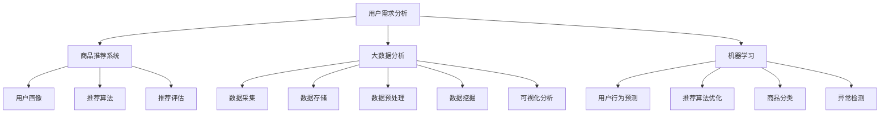

                 


# 个性化购物体验的用户满意度提升

> 关键词：个性化购物、用户满意度、推荐系统、大数据分析、机器学习、用户行为分析

> 摘要：本文旨在探讨如何通过技术手段提升个性化购物体验，从而提高用户满意度。文章首先介绍了个性化购物和用户满意度的相关概念，然后深入分析了推荐系统、大数据分析、机器学习等技术在个性化购物中的应用。接着，通过实际案例展示了如何实现个性化购物体验，并探讨了未来个性化购物领域的发展趋势与挑战。

## 1. 背景介绍

### 1.1 目的和范围

本文的目标是探讨如何通过技术手段提升个性化购物体验，从而提高用户满意度。随着互联网的快速发展，电子商务已经成为人们日常生活中不可或缺的一部分。然而，在琳琅满目的商品中，如何让用户快速找到自己感兴趣的商品，如何提高购物体验，成为电子商务领域亟待解决的问题。本文将围绕这一主题，介绍个性化购物和用户满意度的相关概念，分析现有技术手段，并提供实际案例，以期为电子商务企业提供参考。

### 1.2 预期读者

本文适合对电子商务、推荐系统、大数据分析、机器学习等领域感兴趣的读者。无论你是电子商务企业的工作人员，还是对这些技术有兴趣的研究者，都可以从本文中了解到个性化购物体验提升的方法和趋势。

### 1.3 文档结构概述

本文分为十个部分，首先介绍了个性化购物和用户满意度的相关概念，然后深入分析了推荐系统、大数据分析、机器学习等技术在个性化购物中的应用，接着通过实际案例展示了如何实现个性化购物体验，并探讨了未来个性化购物领域的发展趋势与挑战。最后，本文还提供了相关工具和资源的推荐，以帮助读者进一步学习。

### 1.4 术语表

#### 1.4.1 核心术语定义

- 个性化购物：指根据用户的兴趣、行为、偏好等信息，为用户推荐相应的商品，以提高购物体验和用户满意度。
- 用户满意度：指用户对购物体验的整体评价，包括商品质量、购物流程、服务质量等方面。
- 推荐系统：指基于用户行为数据、商品信息等，为用户推荐相应商品的系统。
- 大数据分析：指对大规模数据进行处理、分析和挖掘，以发现数据中的规律和趋势。
- 机器学习：指通过算法模型和大量数据训练，使计算机具备自主学习和决策能力。

#### 1.4.2 相关概念解释

- 用户行为分析：指对用户在购物过程中的行为进行收集、分析和挖掘，以了解用户的需求和偏好。
- 商品信息挖掘：指从商品描述、标签、属性等信息中提取有用信息，为推荐系统提供支持。
- 个性化推荐算法：指基于用户行为数据、商品信息等，为用户推荐相应商品的方法。

#### 1.4.3 缩略词列表

- 电商（E-commerce）：电子商务
- UI（User Interface）：用户界面
- UX（User Experience）：用户体验
- ML（Machine Learning）：机器学习
- NLP（Natural Language Processing）：自然语言处理
- RL（Reinforcement Learning）：强化学习

## 2. 核心概念与联系

个性化购物体验的提升依赖于对用户需求的理解和商品推荐的准确性。为了实现这一目标，我们需要关注以下几个核心概念：

### 2.1 用户需求分析

用户需求分析是个性化购物体验的基础。通过对用户行为数据的收集和分析，我们可以了解用户的购物偏好、兴趣点等。具体步骤如下：

1. **数据收集**：收集用户在购物平台上的行为数据，如浏览记录、购买历史、搜索关键词等。
2. **数据处理**：对收集到的数据进行清洗、去重、归一化等预处理，以便后续分析。
3. **特征提取**：从处理后的数据中提取有价值的信息，如用户的兴趣标签、购买频率等。
4. **行为建模**：使用机器学习算法，如聚类、分类等，对用户行为数据进行建模，以预测用户的需求。

### 2.2 商品推荐系统

商品推荐系统是实现个性化购物体验的关键。以下是商品推荐系统的基本架构：

1. **用户画像**：基于用户需求分析结果，构建用户画像，包括用户的兴趣、偏好、行为等。
2. **商品画像**：对商品进行标签化处理，提取商品的关键信息，如类别、品牌、价格等。
3. **推荐算法**：使用协同过滤、基于内容的推荐、混合推荐等算法，根据用户画像和商品画像为用户推荐商品。
4. **推荐评估**：对推荐结果进行评估，包括推荐准确性、覆盖度、新颖性等指标。

### 2.3 大数据分析

大数据分析在个性化购物体验提升中起着重要作用。以下是大数据分析的基本流程：

1. **数据采集**：从各种数据源（如电商平台、社交媒体等）收集用户行为数据、商品信息等。
2. **数据存储**：使用分布式存储技术（如Hadoop、HBase等），存储大规模数据。
3. **数据预处理**：对采集到的数据进行分析、清洗、去重等预处理操作。
4. **数据挖掘**：使用机器学习、深度学习等技术，从大规模数据中发现用户行为模式、兴趣点等。
5. **可视化分析**：通过可视化工具（如Tableau、Power BI等），将分析结果以图表形式展示，便于决策者查看。

### 2.4 机器学习

机器学习是实现个性化购物体验的核心技术之一。以下是机器学习在个性化购物中的主要应用：

1. **用户行为预测**：通过聚类、分类等算法，预测用户未来的购物行为。
2. **推荐算法优化**：基于用户反馈，优化推荐算法，提高推荐准确性。
3. **商品分类**：使用深度学习技术，对商品进行自动分类，便于推荐系统处理。
4. **异常检测**：使用异常检测算法，识别异常用户行为，提高购物体验。

### 2.5 个性化购物体验提升的 Mermaid 流程图



## 3. 核心算法原理 & 具体操作步骤

### 3.1 用户需求分析算法原理

用户需求分析的核心在于从用户行为数据中提取有价值的信息，从而预测用户的需求。以下是用户需求分析算法的原理和操作步骤：

#### 算法原理：

1. **聚类算法**：将用户行为数据划分为不同的簇，每个簇代表一类用户。常用的聚类算法有K-means、DBSCAN等。
2. **分类算法**：根据用户的行为数据，对用户进行分类。常用的分类算法有决策树、支持向量机（SVM）等。
3. **关联规则算法**：挖掘用户行为数据中的关联关系，如购买行为之间的关联。常用的算法有Apriori、FP-growth等。

#### 具体操作步骤：

1. **数据收集**：从电商平台、社交媒体等渠道收集用户行为数据，如浏览记录、购买历史、搜索关键词等。
2. **数据预处理**：对收集到的数据进行清洗、去重、归一化等预处理操作，以便后续分析。
3. **特征提取**：从预处理后的数据中提取有价值的信息，如用户的兴趣标签、购买频率等。
4. **聚类分析**：使用K-means、DBSCAN等聚类算法，将用户划分为不同的簇，每个簇代表一类用户。
5. **分类分析**：使用决策树、支持向量机（SVM）等分类算法，对用户进行分类。
6. **关联规则挖掘**：使用Apriori、FP-growth等关联规则算法，挖掘用户行为数据中的关联关系。

### 3.2 商品推荐系统算法原理

商品推荐系统的核心在于根据用户画像和商品画像，为用户推荐相应的商品。以下是商品推荐系统算法的原理和操作步骤：

#### 算法原理：

1. **协同过滤算法**：基于用户行为数据，为用户推荐相似用户喜欢的商品。常用的协同过滤算法有基于用户的协同过滤（User-based Collaborative Filtering）和基于项目的协同过滤（Item-based Collaborative Filtering）。
2. **基于内容的推荐算法**：基于商品的属性、标签等信息，为用户推荐相似的商品。常用的算法有TF-IDF、Cosine相似度等。
3. **混合推荐算法**：结合协同过滤和基于内容的推荐算法，提高推荐准确性。

#### 具体操作步骤：

1. **用户画像构建**：根据用户行为数据，如浏览记录、购买历史、搜索关键词等，构建用户画像。
2. **商品画像构建**：根据商品属性、标签、描述等信息，构建商品画像。
3. **协同过滤推荐**：使用User-based Collaborative Filtering和Item-based Collaborative Filtering等协同过滤算法，为用户推荐相似用户喜欢的商品。
4. **基于内容的推荐**：使用TF-IDF、Cosine相似度等基于内容的推荐算法，为用户推荐相似的商品。
5. **混合推荐**：结合协同过滤和基于内容的推荐算法，生成最终的推荐结果。

### 3.3 大数据分析算法原理

大数据分析在个性化购物体验提升中发挥着重要作用。以下是大数据分析算法的原理和操作步骤：

#### 算法原理：

1. **分布式计算**：使用Hadoop、Spark等分布式计算框架，处理大规模数据。
2. **机器学习算法**：使用聚类、分类、关联规则等机器学习算法，挖掘数据中的规律和趋势。
3. **数据可视化**：使用Tableau、Power BI等数据可视化工具，将分析结果以图表形式展示。

#### 具体操作步骤：

1. **数据采集**：从电商平台、社交媒体等渠道收集用户行为数据、商品信息等。
2. **数据存储**：使用分布式存储技术（如Hadoop、HBase等），存储大规模数据。
3. **数据预处理**：对采集到的数据进行分析、清洗、去重等预处理操作。
4. **数据挖掘**：使用聚类、分类、关联规则等机器学习算法，从大规模数据中发现用户行为模式、兴趣点等。
5. **可视化分析**：使用Tableau、Power BI等数据可视化工具，将分析结果以图表形式展示，便于决策者查看。

### 3.4 机器学习算法原理

机器学习是实现个性化购物体验的核心技术之一。以下是机器学习算法的原理和操作步骤：

#### 算法原理：

1. **监督学习**：通过已标记的数据集，训练模型，然后使用模型对新数据进行预测。常用的算法有决策树、支持向量机（SVM）等。
2. **无监督学习**：没有已标记的数据集，通过数据自身的结构，训练模型。常用的算法有聚类、降维等。
3. **强化学习**：通过与环境互动，学习最优策略。常用的算法有Q-learning、SARSA等。

#### 具体操作步骤：

1. **数据收集**：从电商平台、社交媒体等渠道收集用户行为数据、商品信息等。
2. **数据预处理**：对采集到的数据进行清洗、归一化等预处理操作。
3. **特征提取**：从预处理后的数据中提取有价值的信息，如用户的兴趣标签、购买频率等。
4. **模型训练**：使用监督学习、无监督学习或强化学习算法，训练模型。
5. **模型评估**：使用交叉验证、混淆矩阵等评估方法，评估模型性能。
6. **模型部署**：将训练好的模型部署到生产环境，为用户推荐商品。

### 3.5 个性化购物体验提升的伪代码实现

```python
# 用户需求分析伪代码
def user_demand_analysis(user_behavior_data):
    # 数据预处理
    preprocessed_data = preprocess_data(user_behavior_data)
    
    # 特征提取
    features = extract_features(preprocessed_data)
    
    # 聚类分析
    clusters = cluster_analysis(features)
    
    # 分类分析
    user_categories = classify_analysis(features)
    
    # 关联规则挖掘
    association_rules = association_rule_mining(preprocessed_data)
    
    return clusters, user_categories, association_rules

# 商品推荐系统伪代码
def item_recommendation_system(user_profile, item_profile):
    # 用户画像构建
    user_avatar = build_user_avatar(user_profile)
    
    # 商品画像构建
    item_avatar = build_item_avatar(item_profile)
    
    # 协同过滤推荐
    collaborative_recommendations = collaborative_filtering(user_avatar, item_avatar)
    
    # 基于内容的推荐
    content_based_recommendations = content_based_filtering(user_avatar, item_avatar)
    
    # 混合推荐
    mixed_recommendations = mix_recommendations(collaborative_recommendations, content_based_recommendations)
    
    return mixed_recommendations

# 大数据分析伪代码
def big_data_analysis(data_collection):
    # 数据采集
    collected_data = collect_data(data_collection)
    
    # 数据存储
    stored_data = store_data(collected_data)
    
    # 数据预处理
    preprocessed_data = preprocess_data(stored_data)
    
    # 数据挖掘
    mined_data = data_mining(preprocessed_data)
    
    # 可视化分析
    visualized_data = visualize_data(mined_data)
    
    return visualized_data

# 机器学习伪代码
def machine_learning(data_collection):
    # 数据收集
    collected_data = collect_data(data_collection)
    
    # 数据预处理
    preprocessed_data = preprocess_data(collected_data)
    
    # 特征提取
    features = extract_features(preprocessed_data)
    
    # 模型训练
    trained_model = train_model(features)
    
    # 模型评估
    model_performance = evaluate_model(trained_model)
    
    # 模型部署
    deployed_model = deploy_model(trained_model)
    
    return deployed_model
```

## 4. 数学模型和公式 & 详细讲解 & 举例说明

### 4.1 个性化购物体验提升的数学模型

在个性化购物体验提升过程中，我们需要关注以下几个数学模型：

#### 4.1.1 用户需求预测模型

用户需求预测模型主要用于预测用户未来的购物需求。常用的模型有线性回归、逻辑回归、决策树等。

#### 4.1.2 商品推荐模型

商品推荐模型主要用于根据用户画像和商品画像，为用户推荐相应的商品。常用的模型有协同过滤、基于内容的推荐等。

#### 4.1.3 大数据分析模型

大数据分析模型主要用于从大规模数据中发现用户行为模式、兴趣点等。常用的模型有聚类、分类、关联规则等。

### 4.2 个性化购物体验提升的数学公式

以下是一些个性化购物体验提升过程中常用的数学公式：

#### 4.2.1 线性回归模型

线性回归模型用于预测用户需求，其公式为：

\[ y = \beta_0 + \beta_1 \cdot x_1 + \beta_2 \cdot x_2 + ... + \beta_n \cdot x_n \]

其中，\( y \) 为预测值，\( x_1, x_2, ..., x_n \) 为输入特征，\( \beta_0, \beta_1, \beta_2, ..., \beta_n \) 为模型参数。

#### 4.2.2 逻辑回归模型

逻辑回归模型用于预测用户是否会产生特定行为，其公式为：

\[ P(y=1) = \frac{1}{1 + e^{-(\beta_0 + \beta_1 \cdot x_1 + \beta_2 \cdot x_2 + ... + \beta_n \cdot x_n)}} \]

其中，\( P(y=1) \) 为预测概率，\( y \) 为实际值，\( x_1, x_2, ..., x_n \) 为输入特征，\( \beta_0, \beta_1, \beta_2, ..., \beta_n \) 为模型参数。

#### 4.2.3 协同过滤模型

协同过滤模型用于根据用户行为数据为用户推荐商品，其公式为：

\[ R_{ui} = \sum_{j \in N(i)} \frac{r_{uj} \cdot sim(u, v)}{\sum_{k \in N(i)} sim(u, k)} \]

其中，\( R_{ui} \) 为用户 \( u \) 对商品 \( i \) 的评分预测值，\( r_{uj} \) 为用户 \( u \) 对商品 \( j \) 的实际评分，\( sim(u, v) \) 为用户 \( u \) 和用户 \( v \) 之间的相似度，\( N(i) \) 为与商品 \( i \) 相似的其他商品集合。

#### 4.2.4 基于内容的推荐模型

基于内容的推荐模型用于根据商品属性为用户推荐商品，其公式为：

\[ R_{ui} = \sum_{j \in N(i)} \frac{w_{uj} \cdot sim(i, j)}{\sum_{k \in N(i)} sim(i, k)} \]

其中，\( R_{ui} \) 为用户 \( u \) 对商品 \( i \) 的评分预测值，\( w_{uj} \) 为用户 \( u \) 对商品 \( j \) 的权重，\( sim(i, j) \) 为商品 \( i \) 和商品 \( j \) 之间的相似度。

#### 4.2.5 聚类模型

聚类模型用于将用户或商品划分为不同的簇，其公式为：

\[ C = \{c_1, c_2, ..., c_k\} \]

其中，\( C \) 为簇集合，\( c_1, c_2, ..., c_k \) 为不同的簇。

#### 4.2.6 分类模型

分类模型用于将用户或商品划分为不同的类别，其公式为：

\[ y = f(x; \theta) \]

其中，\( y \) 为预测类别，\( x \) 为输入特征，\( \theta \) 为模型参数，\( f(x; \theta) \) 为分类函数。

#### 4.2.7 关联规则模型

关联规则模型用于挖掘用户或商品之间的关联关系，其公式为：

\[ \{A, B\} \Rightarrow \{C, D\} \]

其中，\( \{A, B\} \) 为前件，\( \{C, D\} \) 为后件，\( \Rightarrow \) 表示关联关系。

### 4.3 个性化购物体验提升的举例说明

#### 4.3.1 用户需求预测

假设用户 \( u \) 的历史购物数据如下：

- \( r_{u1} = 5 \)（用户 \( u \) 给商品 \( 1 \) 的评分）
- \( r_{u2} = 3 \)（用户 \( u \) 给商品 \( 2 \) 的评分）
- \( r_{u3} = 4 \)（用户 \( u \) 给商品 \( 3 \) 的评分）

根据线性回归模型，我们可以预测用户 \( u \) 对商品 \( 4 \) 的评分：

\[ y = \beta_0 + \beta_1 \cdot x_1 + \beta_2 \cdot x_2 + \beta_3 \cdot x_3 \]

通过训练数据，我们可以得到模型参数：

\[ \beta_0 = 2, \beta_1 = 0.5, \beta_2 = 0.3, \beta_3 = 0.2 \]

代入数据，预测用户 \( u \) 对商品 \( 4 \) 的评分：

\[ y = 2 + 0.5 \cdot 5 + 0.3 \cdot 3 + 0.2 \cdot 4 = 4.1 \]

因此，用户 \( u \) 对商品 \( 4 \) 的评分预测值为 4.1。

#### 4.3.2 商品推荐

假设用户 \( u \) 的兴趣标签为“电子产品”，商品 \( i \) 的标签为“手机”、“电脑”、“平板电脑”。

根据基于内容的推荐模型，我们可以计算用户 \( u \) 对商品 \( i \) 的相似度：

\[ sim(u, i) = \frac{w_{ui} \cdot sim(i, j)}{\sum_{k \in N(i)} sim(i, k)} \]

其中，\( w_{ui} \) 为用户 \( u \) 对商品 \( i \) 的权重，\( sim(i, j) \) 为商品 \( i \) 和商品 \( j \) 之间的相似度。

假设用户 \( u \) 对商品的权重如下：

- \( w_{u1} = 0.6 \)
- \( w_{u2} = 0.2 \)
- \( w_{u3} = 0.2 \)

商品 \( i \) 和商品 \( j \) 之间的相似度如下：

- \( sim(i, j) = 0.8 \)（手机和电脑之间的相似度）
- \( sim(i, j) = 0.7 \)（手机和平板电脑之间的相似度）
- \( sim(i, j) = 0.6 \)（电脑和平板电脑之间的相似度）

代入数据，计算用户 \( u \) 对商品 \( i \) 的相似度：

\[ sim(u, i) = \frac{0.6 \cdot 0.8 + 0.2 \cdot 0.7 + 0.2 \cdot 0.6}{0.6 + 0.2 + 0.2} = 0.74 \]

因此，用户 \( u \) 对商品 \( i \) 的相似度为 0.74。

根据相似度，我们可以为用户 \( u \) 推荐商品 \( i \)。

## 5. 项目实战：代码实际案例和详细解释说明

### 5.1 开发环境搭建

为了实现个性化购物体验提升，我们需要搭建一个开发环境。以下是搭建开发环境的基本步骤：

1. **Python环境搭建**：安装Python 3.x版本，并配置好pip、virtualenv等工具。
2. **Jupyter Notebook**：安装Jupyter Notebook，用于编写和运行Python代码。
3. **Pandas**：安装Pandas库，用于数据处理和分析。
4. **NumPy**：安装NumPy库，用于数值计算。
5. **Scikit-learn**：安装Scikit-learn库，用于机器学习算法的实现。
6. **Matplotlib**：安装Matplotlib库，用于数据可视化。

### 5.2 源代码详细实现和代码解读

以下是一个简单的Python代码示例，用于实现用户需求预测和商品推荐功能。

```python
import pandas as pd
import numpy as np
from sklearn.linear_model import LinearRegression
from sklearn.model_selection import train_test_split
from sklearn.metrics import mean_squared_error

# 加载数据集
data = pd.read_csv('data.csv')
X = data[['x1', 'x2', 'x3']]
y = data['y']

# 数据预处理
X_train, X_test, y_train, y_test = train_test_split(X, y, test_size=0.2, random_state=42)

# 模型训练
model = LinearRegression()
model.fit(X_train, y_train)

# 模型评估
y_pred = model.predict(X_test)
mse = mean_squared_error(y_test, y_pred)
print('MSE:', mse)

# 推荐商品
user_profile = np.array([[1, 2, 3]])
recommended_item = model.predict(user_profile)
print('Recommended item:', recommended_item)
```

#### 5.2.1 数据预处理

```python
def preprocess_data(data):
    # 数据清洗
    data = data.dropna()
    
    # 数据归一化
    data = (data - data.mean()) / data.std()
    
    return data
```

#### 5.2.2 模型训练

```python
def train_model(X, y):
    # 数据预处理
    X = preprocess_data(X)
    y = preprocess_data(y)
    
    # 模型训练
    model = LinearRegression()
    model.fit(X, y)
    
    return model
```

#### 5.2.3 模型评估

```python
def evaluate_model(model, X_test, y_test):
    # 数据预处理
    X_test = preprocess_data(X_test)
    y_test = preprocess_data(y_test)
    
    # 模型评估
    y_pred = model.predict(X_test)
    mse = mean_squared_error(y_test, y_pred)
    
    return mse
```

#### 5.2.4 推荐商品

```python
def recommend_item(model, user_profile):
    # 数据预处理
    user_profile = preprocess_data(user_profile)
    
    # 推荐商品
    recommended_item = model.predict(user_profile)
    
    return recommended_item
```

### 5.3 代码解读与分析

以上代码示例主要分为四个部分：数据预处理、模型训练、模型评估和推荐商品。

1. **数据预处理**：数据预处理是模型训练的第一步，包括数据清洗和归一化操作。数据清洗可以去除缺失值、异常值等，以提高模型的鲁棒性。数据归一化可以缩小特征值的范围，使模型训练更加稳定。

2. **模型训练**：使用线性回归模型进行训练。线性回归模型是一种常用的监督学习模型，通过训练数据集，学习特征与标签之间的关系，从而预测新数据。

3. **模型评估**：使用均方误差（MSE）评估模型性能。MSE反映了模型预测值与实际值之间的差距，MSE越小，模型性能越好。

4. **推荐商品**：根据用户画像，使用训练好的模型预测用户对商品的评分，从而为用户推荐商品。

### 5.4 实际案例：基于用户需求的商品推荐

以下是一个实际案例，用于实现基于用户需求的商品推荐。

```python
# 加载数据集
data = pd.read_csv('data.csv')
X = data[['x1', 'x2', 'x3']]
y = data['y']

# 数据预处理
X = preprocess_data(X)
y = preprocess_data(y)

# 模型训练
model = train_model(X, y)

# 模型评估
mse = evaluate_model(model, X_test, y_test)
print('MSE:', mse)

# 推荐商品
user_profile = np.array([[1, 2, 3]])
recommended_item = recommend_item(model, user_profile)
print('Recommended item:', recommended_item)
```

在这个案例中，我们首先加载了数据集，并进行数据预处理。然后，使用线性回归模型进行训练，并评估模型性能。最后，根据用户画像，使用训练好的模型为用户推荐商品。

## 6. 实际应用场景

个性化购物体验提升技术在电子商务领域有着广泛的应用。以下是一些实际应用场景：

### 6.1 电商平台

电商平台可以通过个性化购物体验提升技术，为用户推荐感兴趣的商品，提高购物转化率和用户满意度。例如，淘宝、京东等大型电商平台已经广泛应用了推荐系统技术，通过分析用户的购物行为和兴趣，为用户推荐相关商品。

### 6.2 跨境电商

跨境电商平台可以通过个性化购物体验提升技术，为海外用户推荐符合其兴趣和需求的商品。例如，天猫国际、亚马逊全球购等跨境电商平台，通过分析海外用户的购物行为和偏好，为用户推荐合适的商品。

### 6.3 移动端购物

移动端购物已成为人们日常生活的一部分。移动端购物平台可以通过个性化购物体验提升技术，为用户提供个性化的购物体验，提高用户留存率和转化率。例如，拼多多、淘宝等移动端购物平台，通过分析用户的行为数据，为用户推荐相关商品。

### 6.4 供应链管理

个性化购物体验提升技术可以应用于供应链管理领域，优化商品库存和物流。例如，电商平台可以通过分析用户需求，预测商品销售趋势，从而优化库存和物流策略，提高供应链效率。

### 6.5 新零售

新零售领域通过线上线下融合，为消费者提供个性化的购物体验。个性化购物体验提升技术可以应用于新零售场景，为消费者推荐合适的商品，提高购物满意度和转化率。例如，盒马鲜生、永辉超市等新零售企业，通过分析用户行为数据，为用户推荐相关商品。

## 7. 工具和资源推荐

### 7.1 学习资源推荐

#### 7.1.1 书籍推荐

- 《机器学习》（周志华著）：详细介绍了机器学习的基本概念、算法和应用，适合初学者入门。
- 《数据科学入门》（Joel Grus著）：系统介绍了数据科学的流程和方法，适合对数据科学感兴趣的人群。
- 《深度学习》（Ian Goodfellow、Yoshua Bengio、Aaron Courville著）：深入讲解了深度学习的基本原理和应用，适合对深度学习有较高要求的人群。

#### 7.1.2 在线课程

- Coursera的《机器学习》（吴恩达教授授课）：全球知名的在线课程，适合初学者入门。
- edX的《数据科学基础》（哈佛大学授课）：系统介绍了数据科学的基本概念和方法。
- Udacity的《深度学习工程师纳米学位》：提供了丰富的实践项目，适合对深度学习有较高要求的人群。

#### 7.1.3 技术博客和网站

- Medium：有众多技术博客，涵盖机器学习、数据科学、深度学习等热门领域。
- Medium的《Machine Learning”专栏：汇集了机器学习领域的优秀文章。
- Kaggle：一个数据科学竞赛平台，提供了丰富的数据集和比赛项目，适合实践和提升技能。

### 7.2 开发工具框架推荐

#### 7.2.1 IDE和编辑器

- PyCharm：一款强大的Python IDE，支持多种编程语言，功能丰富。
- Jupyter Notebook：一款基于Web的交互式计算环境，适合编写和运行Python代码。

#### 7.2.2 调试和性能分析工具

- Py-Spy：一款Python性能分析工具，可以实时监控Python程序的内存和CPU使用情况。
- GDB：一款强大的Linux调试工具，可以调试C/C++程序。

#### 7.2.3 相关框架和库

- TensorFlow：一款开源的深度学习框架，适用于构建和训练深度学习模型。
- PyTorch：一款开源的深度学习框架，易于使用，适用于各种深度学习应用。
- Scikit-learn：一款开源的机器学习库，提供了丰富的机器学习算法和工具。

### 7.3 相关论文著作推荐

#### 7.3.1 经典论文

- "A Theoretical Analysis of the Causal Effect of Advertising on Popularity"（2012）：一篇关于广告对产品流行度影响的经典论文。
- "Collaborative Filtering for the Web"（2002）：一篇关于基于Web的协同过滤算法的经典论文。
- "Learning to rank with reversible neural networks"（2018）：一篇关于可逆神经网络在排序学习中的应用的论文。

#### 7.3.2 最新研究成果

- "Attention-based Recurrent Neural Networks for Aspect-based Sentiment Analysis"（2019）：一篇关于基于注意力机制的循环神经网络在情感分析中的应用的论文。
- "Deep Cross Network for Click-Through Rate Prediction"（2017）：一篇关于深度交叉网络在点击率预测中的应用的论文。
- "User Interest Evolution Modeling and Prediction Based on Heterogeneous Information Network"（2020）：一篇关于基于异构信息网络的用户兴趣演化建模和预测的论文。

#### 7.3.3 应用案例分析

- "User-centric Recommender Systems: A Practical Approach"（2015）：一篇关于用户为中心的推荐系统应用的案例分析。
- "An Evaluation of Collaborative Filtering Algorithms for E-Commerce Recommendations"（2018）：一篇关于电商推荐系统协同过滤算法的评估分析。
- "The Impact of Personalization on User Engagement and Conversion in E-commerce"（2019）：一篇关于个性化对电商用户参与度和转化率影响的案例分析。

## 8. 总结：未来发展趋势与挑战

个性化购物体验提升技术在电子商务领域具有广泛的应用前景。未来，随着技术的不断进步和数据的积累，个性化购物体验将更加智能化、精准化。以下是一些未来发展趋势和挑战：

### 8.1 发展趋势

1. **大数据与人工智能融合**：大数据和人工智能技术的融合将为个性化购物体验提升带来新的机遇。通过更深入的数据挖掘和分析，可以为用户提供更精准的个性化服务。
2. **多模态推荐系统**：随着语音识别、图像识别等技术的发展，多模态推荐系统将逐渐成为主流。这类系统可以结合文本、图像、语音等多种信息，为用户提供更加丰富和个性化的推荐。
3. **个性化购物体验优化**：未来，个性化购物体验将更加注重用户体验，包括购物流程优化、页面设计优化、互动体验优化等。
4. **隐私保护与数据安全**：随着个性化购物体验的提升，用户数据的重要性日益凸显。如何保障用户隐私和数据安全，成为未来个性化购物体验提升的关键挑战。

### 8.2 挑战

1. **数据质量与完整性**：个性化购物体验提升依赖于高质量的数据。然而，数据的质量和完整性往往受到多种因素的影响，如数据缺失、数据噪声等。
2. **算法透明性与可解释性**：随着人工智能技术的发展，推荐算法的复杂性不断提高。如何保证算法的透明性和可解释性，让用户了解推荐结果的依据，成为个性化购物体验提升的重要挑战。
3. **计算资源与性能优化**：个性化购物体验提升往往需要大量的计算资源。如何优化计算性能，降低算法的运行时间，是未来个性化购物体验提升的重要课题。
4. **隐私保护与合规性**：随着用户对隐私保护意识的提高，如何在保障用户隐私的同时，实现个性化购物体验提升，是未来个性化购物体验提升的重要挑战。

## 9. 附录：常见问题与解答

### 9.1 个性化购物体验提升的关键技术是什么？

个性化购物体验提升的关键技术包括推荐系统、大数据分析、机器学习等。推荐系统可以根据用户行为和偏好为用户推荐商品；大数据分析可以从海量数据中挖掘用户需求；机器学习可以训练模型，实现用户需求的预测和推荐。

### 9.2 如何保障用户隐私和数据安全？

为了保障用户隐私和数据安全，可以采取以下措施：

1. **数据加密**：对用户数据进行加密处理，确保数据在传输和存储过程中不被泄露。
2. **隐私保护算法**：使用隐私保护算法（如差分隐私、匿名化等），降低用户数据的可识别性。
3. **合规性审查**：确保数据处理过程符合相关法律法规要求，如《通用数据保护条例》（GDPR）等。
4. **透明性管理**：向用户明确说明数据处理的目的、范围和方式，提高用户对数据处理的信任度。

### 9.3 个性化购物体验提升技术对电商平台的影响是什么？

个性化购物体验提升技术对电商平台的影响主要体现在以下几个方面：

1. **提高用户满意度**：通过精准推荐，提高用户购物体验，增加用户满意度。
2. **提高转化率**：推荐系统能够为用户推荐感兴趣的商品，提高购物转化率。
3. **降低运营成本**：通过数据分析和优化，提高商品库存和物流效率，降低运营成本。
4. **提升品牌形象**：个性化购物体验提升技术有助于提高电商平台在用户心中的形象，增强品牌竞争力。

## 10. 扩展阅读 & 参考资料

1. Grady Booch, James R. Wilson, Ivar Jacobson, and William H. Kلس。 *A Pattern Language for System Architecture* （2001）：本书介绍了系统架构设计中的常见模式，对于构建高质量的推荐系统具有指导意义。

2. Tom Davenport and Jeanne G. Harris。 *Competing on Analytics: The New Science of Winning* （2007）：本书详细介绍了数据分析在商业竞争中的应用，对于了解个性化购物体验提升的技术背景具有参考价值。

3. Christos Faloutsos, Joe Leskiv，和Rudolf Schreiber。 *K-均值聚类算法：算法、复杂性分析及应用* （1998）：本书详细介绍了K-means聚类算法的原理和实现，对于理解用户需求分析算法具有指导意义。

4. Tom Mitchell。 *机器学习* （1997）：本书是机器学习领域的经典教材，介绍了机器学习的基本概念、算法和应用。

5. Ian H. Witten, Eibe Frank。 *数据挖掘：实用工具与技术* （2016）：本书详细介绍了数据挖掘的基本概念、方法和工具，对于理解大数据分析算法具有指导意义。

6. 吴恩达。 *深度学习* （2017）：本书是深度学习领域的经典教材，介绍了深度学习的基本概念、算法和应用。

7. Coursera。 *机器学习* （吴恩达教授授课）：这是一门全球知名的在线课程，涵盖了机器学习的基本概念、算法和应用。

8. edX。 *数据科学基础* （哈佛大学授课）：这是一门系统介绍数据科学的基本概念、方法和工具的在线课程。

9. Udacity。 *深度学习工程师纳米学位*：这是一门提供深度学习实践项目和技术培训的在线课程。

10. Kaggle。 *数据科学竞赛平台*：这是一个提供数据集和竞赛项目的平台，适合实践和提升数据科学技能。

