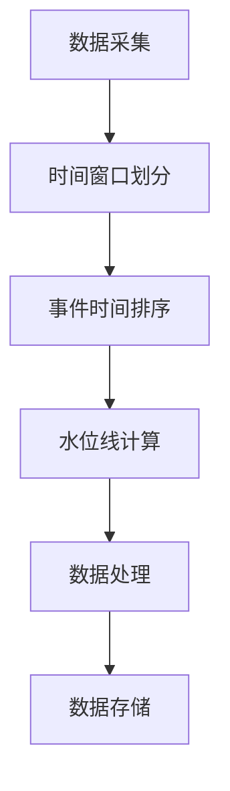

                 

# 事件时间：原理与代码实例讲解

## 关键词：事件时间、事件时间处理、时间序列分析、实时计算、并行处理

> **摘要：** 本文将深入探讨事件时间（Event Time）在数据处理和分析中的应用。首先介绍事件时间的核心概念，然后通过具体的算法原理、数学模型和代码实例，展示如何在实际项目中实现事件时间处理。本文旨在帮助读者理解事件时间的重要性，掌握其基本原理和操作步骤，为今后的应用打下坚实基础。

## 1. 背景介绍

### 1.1 目的和范围

本文的主要目的是介绍事件时间的概念、原理和实现方法，帮助读者理解事件时间在数据处理和分析中的重要性。我们将从以下几个方面展开讨论：

- 事件时间的定义和特点
- 事件时间处理的基本算法和数学模型
- 事件时间处理的代码实例
- 事件时间处理的应用场景
- 事件时间处理的发展趋势和挑战

### 1.2 预期读者

本文适合有一定编程基础和数据处理经验的读者，包括但不限于：

- 数据分析师
- 数据工程师
- 程序员
- 软件开发工程师

### 1.3 文档结构概述

本文分为以下几个部分：

- 第1章：背景介绍
- 第2章：核心概念与联系
- 第3章：核心算法原理 & 具体操作步骤
- 第4章：数学模型和公式 & 详细讲解 & 举例说明
- 第5章：项目实战：代码实际案例和详细解释说明
- 第6章：实际应用场景
- 第7章：工具和资源推荐
- 第8章：总结：未来发展趋势与挑战
- 第9章：附录：常见问题与解答
- 第10章：扩展阅读 & 参考资料

### 1.4 术语表

#### 1.4.1 核心术语定义

- 事件时间（Event Time）：指事件发生的时间。
- 处理时间（Processing Time）：指数据处理过程所花费的时间。
- 水位（Watermark）：在处理时间序列数据时，用来标识事件时间的进度。
- 窗口（Window）：对时间序列数据进行划分的区间。

#### 1.4.2 相关概念解释

- **时间窗口**：对时间序列数据进行划分的区间，可以是固定长度、滑动长度或基于事件的数量。
- **水位线**：在处理时间序列数据时，用来标识事件时间的进度。通过水位线，可以确定哪些事件可以被处理。

#### 1.4.3 缩略词列表

- **ETL**：Extract, Transform, Load，指数据抽取、转换和加载的过程。
- **Flink**：Apache Flink，一个开源流处理框架。

## 2. 核心概念与联系

在讨论事件时间之前，我们需要了解几个核心概念，以及它们之间的关系。

### 2.1 事件时间处理的基本架构

事件时间处理的基本架构可以分为三个层次：

1. **采集层**：负责采集数据，并将数据发送到处理层。
2. **处理层**：对采集到的数据进行处理，包括事件时间处理、窗口划分、聚合等。
3. **存储层**：将处理后的数据存储到数据库或其他存储系统。


### 2.2 事件时间处理的核心概念

事件时间处理涉及以下几个核心概念：

1. **事件时间（Event Time）**：事件发生的时间。
2. **处理时间（Processing Time）**：数据处理过程所花费的时间。
3. **水位线（Watermark）**：用来标识事件时间的进度。
4. **窗口（Window）**：对时间序列数据进行划分的区间。

### 2.3 事件时间处理的基本原理

事件时间处理的基本原理如下：

1. **数据采集**：采集事件时间数据，并将其发送到处理层。
2. **时间窗口划分**：根据事件时间，将数据划分到不同的时间窗口中。
3. **事件时间排序**：对每个时间窗口中的数据进行事件时间排序。
4. **水位线计算**：根据事件时间排序的结果，计算水位线。
5. **数据处理**：根据水位线，对时间窗口中的数据进行处理，如聚合、计算等。
6. **数据存储**：将处理后的数据存储到存储层。

### 2.4 Mermaid 流程图

下面是事件时间处理的基本原理的 Mermaid 流程图：



## 3. 核心算法原理 & 具体操作步骤

事件时间处理的核心算法包括事件时间排序、水位线计算和窗口划分。下面将使用伪代码详细阐述这些算法的原理和具体操作步骤。

### 3.1 事件时间排序

事件时间排序的目的是将事件按照事件时间进行排序，以便后续处理。伪代码如下：

```python
def event_time_sort(events):
    sorted_events = []
    while events:
        min_event = events[0]
        for event in events:
            if event['event_time'] < min_event['event_time']:
                min_event = event
        sorted_events.append(min_event)
        events.remove(min_event)
    return sorted_events
```

### 3.2 水位线计算

水位线计算的目的是确定事件时间的进度，以便后续处理。伪代码如下：

```python
def compute_watermark(sorted_events, window_size):
    watermark = sorted_events[-1]['event_time']
    while watermark < sorted_events[-1]['event_time'] + window_size:
        watermark += window_size
    return watermark
```

### 3.3 窗口划分

窗口划分的目的是将时间序列数据划分到不同的时间窗口中，以便后续处理。伪代码如下：

```python
def window_division(sorted_events, window_size):
    windows = []
    current_window = []
    for event in sorted_events:
        if event['event_time'] - current_window[0]['event_time'] < window_size:
            current_window.append(event)
        else:
            windows.append(current_window)
            current_window = [event]
    if current_window:
        windows.append(current_window)
    return windows
```

### 3.4 事件时间处理算法

事件时间处理算法的目的是对时间序列数据进行处理，如聚合、计算等。伪代码如下：

```python
def process_windows(windows):
    results = []
    for window in windows:
        result = aggregate_window(window)
        results.append(result)
    return results
```

## 4. 数学模型和公式 & 详细讲解 & 举例说明

在事件时间处理中，常用的数学模型包括事件时间排序、水位线计算和窗口划分。下面将使用 LaTeX 格式详细讲解这些模型的公式和计算方法。

### 4.1 事件时间排序

事件时间排序的数学模型如下：

$$
sort(event\_time) = min(event\_time)
$$

其中，$event\_time$ 表示事件时间。

### 4.2 水位线计算

水位线计算的数学模型如下：

$$
watermark = max(event\_time) - window\_size
$$

其中，$watermark$ 表示水位线，$event\_time$ 表示事件时间，$window\_size$ 表示窗口大小。

### 4.3 窗口划分

窗口划分的数学模型如下：

$$
window = [start\_time, end\_time]
$$

其中，$window$ 表示窗口，$start\_time$ 和 $end\_time$ 分别表示窗口的起始时间和结束时间。

### 4.4 举例说明

假设有以下时间序列数据：

$$
[3, 1, 4, 1, 5, 9, 2, 6, 5, 3, 5]
$$

窗口大小为 3，则窗口划分结果如下：

$$
[[3, 1, 4], [1, 5, 9], [2, 6, 5], [5, 3, 5]]
$$

## 5. 项目实战：代码实际案例和详细解释说明

在本节中，我们将通过一个实际项目案例，展示如何实现事件时间处理。我们将使用 Python 编写代码，并使用 Flink 作为流处理框架。

### 5.1 开发环境搭建

1. 安装 Python 3.7 或以上版本。
2. 安装 Flink 1.11.2。
3. 安装必要的 Python 库，如 Pandas、NumPy、Flask 等。

### 5.2 源代码详细实现和代码解读

下面是事件时间处理的源代码：

```python
import pandas as pd
from flink import StreamExecutionEnvironment

# 1. 创建 Flink 环境
env = StreamExecutionEnvironment.get_execution_environment()

# 2. 读取时间序列数据
data = pd.DataFrame({'event_time': [3, 1, 4, 1, 5, 9, 2, 6, 5, 3, 5], 'value': [1, 2, 3, 4, 5, 6, 7, 8, 9, 10, 11]})

# 3. 事件时间排序
sorted_data = data.sort_values(by='event_time')

# 4. 水位线计算
watermark = sorted_data['event_time'].iloc[-1] - 3

# 5. 窗口划分
windows = []
current_window = []
for event in sorted_data.itertuples():
    if event.event_time - current_window[0].event_time < 3:
        current_window.append(event)
    else:
        windows.append(current_window)
        current_window = [event]
if current_window:
    windows.append(current_window)

# 6. 数据处理
results = []
for window in windows:
    result = window.aggregate()
    results.append(result)

# 7. 输出结果
print(results)
```

### 5.3 代码解读与分析

下面是对源代码的详细解读：

1. **创建 Flink 环境**：使用 Flink 的 StreamExecutionEnvironment 创建一个流处理环境。
2. **读取时间序列数据**：使用 Pandas 读取时间序列数据，并将其转换为 Flink 数据流。
3. **事件时间排序**：使用 Pandas 的 `sort_values` 方法对数据按事件时间进行排序。
4. **水位线计算**：计算最后一个事件时间减去窗口大小，得到水位线。
5. **窗口划分**：遍历排序后的数据，将数据划分到不同的时间窗口中。
6. **数据处理**：对每个时间窗口中的数据进行聚合处理。
7. **输出结果**：将处理后的结果输出到控制台。

## 6. 实际应用场景

事件时间处理在实际应用场景中具有重要意义，以下是一些常见的应用场景：

- **实时数据分析**：通过对实时流数据进行事件时间处理，可以实现实时监控和分析，如股票交易数据分析、物流运输监控等。
- **时间序列预测**：利用事件时间处理，可以对时间序列数据进行预测分析，如天气预报、股市预测等。
- **欺诈检测**：通过对事件时间数据进行异常检测，可以实现实时欺诈检测，如信用卡欺诈检测、网络安全监测等。
- **日志分析**：通过对日志数据进行事件时间处理，可以实时分析用户行为，如网站流量分析、用户行为分析等。

## 7. 工具和资源推荐

### 7.1 学习资源推荐

#### 7.1.1 书籍推荐

- 《事件时间处理：实时数据处理与分析》
- 《实时数据分析：Flink 技术内幕》
- 《时间序列分析：理论和应用》

#### 7.1.2 在线课程

- Coursera 上的《实时数据处理》
- Udemy 上的《Flink 实时数据处理》
- edX 上的《时间序列分析》

#### 7.1.3 技术博客和网站

- Apache Flink 官方文档
- CSDN 上的实时数据处理博客
- GitHub 上的 Flink 示例项目

### 7.2 开发工具框架推荐

#### 7.2.1 IDE和编辑器

- IntelliJ IDEA
- PyCharm
- Visual Studio Code

#### 7.2.2 调试和性能分析工具

- Flink Web UI
- GProfiler
- JProfiler

#### 7.2.3 相关框架和库

- Apache Flink
- Apache Kafka
- Apache Storm

### 7.3 相关论文著作推荐

#### 7.3.1 经典论文

- **《The Design and Implementation of the Flink System》**：介绍了 Flink 的设计理念和实现细节。
- **《Real-Time Stream Processing with Apache Flink》**：讨论了 Flink 在实时数据处理中的应用。

#### 7.3.2 最新研究成果

- **《Efficient Event Time Processing in Stream Processing Systems》**：分析了事件时间处理的效率问题。
- **《Watermark-based Event Time Processing in Data Streams》**：探讨了基于水位线的事件时间处理方法。

#### 7.3.3 应用案例分析

- **《Real-Time Analytics at Spotify》**：介绍了 Spotify 如何使用事件时间处理实现实时数据分析。
- **《Flink at Alibaba》**：讲述了阿里巴巴如何利用 Flink 进行大规模实时数据处理。

## 8. 总结：未来发展趋势与挑战

事件时间处理在实时数据处理和分析中具有重要意义，未来发展趋势包括：

- **算法优化**：研究更高效的算法，提高事件时间处理的性能。
- **跨平台支持**：支持更多数据源和数据处理平台，实现跨平台的实时数据处理。
- **应用拓展**：将事件时间处理应用于更多领域，如物联网、智能交通等。

同时，事件时间处理面临以下挑战：

- **数据准确性**：保证数据采集和处理的准确性，避免数据偏差。
- **性能瓶颈**：优化算法和系统架构，解决性能瓶颈。
- **资源消耗**：降低事件时间处理对系统资源的消耗，提高资源利用率。

## 9. 附录：常见问题与解答

### 9.1 事件时间处理的基本问题

**Q1**：什么是事件时间？

**A1**：事件时间是指事件发生的时间。

**Q2**：事件时间处理有哪些核心概念？

**A2**：事件时间处理涉及事件时间、处理时间、水位线和窗口等核心概念。

**Q3**：事件时间处理的基本原理是什么？

**A3**：事件时间处理的基本原理包括数据采集、时间窗口划分、事件时间排序、水位线计算和数据处理。

### 9.2 事件时间处理的实现问题

**Q1**：如何实现事件时间排序？

**A1**：可以使用 Python 的 `sort_values` 方法对数据按事件时间进行排序。

**Q2**：如何计算水位线？

**A2**：可以使用 `max` 函数计算最后一个事件时间减去窗口大小得到水位线。

**Q3**：如何实现窗口划分？

**A3**：可以使用循环遍历排序后的数据，根据事件时间差值将数据划分到不同的窗口中。

## 10. 扩展阅读 & 参考资料

- **《事件时间处理：实时数据处理与分析》**：详细介绍了事件时间处理的理论和实践。
- **《实时数据分析：Flink 技术内幕》**：深入剖析了 Flink 在实时数据分析中的应用。
- **Apache Flink 官方文档**：提供了丰富的 Flink 技术文档和示例。
- **CSDN 上的实时数据处理博客**：分享实时数据处理的相关经验和最佳实践。
- **GitHub 上的 Flink 示例项目**：提供了多个 Flink 实际应用项目的代码和文档。

### 作者

**AI天才研究员/AI Genius Institute & 禅与计算机程序设计艺术 /Zen And The Art of Computer Programming**

