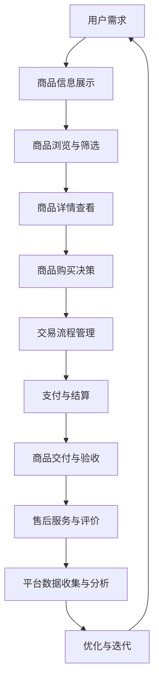

                 

# 二手交易创业：循环经济的实践者

> **关键词：** 二手交易、循环经济、创业、商业模式、技术实现、数据驱动、可持续发展

> **摘要：** 本文将探讨二手交易作为循环经济的重要实践方式，分析其在现代商业环境中的意义、核心概念及其技术实现。我们将结合实际案例，详细解析二手交易的商业模式、数据驱动策略及未来发展趋势。

## 1. 背景介绍

### 1.1 目的和范围

本文旨在探讨二手交易作为循环经济实践的方式，分析其在商业、环境和社会层面的多重价值。我们将重点关注二手交易的商业模式、技术实现及其对可持续发展的贡献。通过本文的阅读，读者将了解：

1. 二手交易的核心概念及其在现代商业中的重要性。
2. 二手交易的技术实现和数据处理策略。
3. 二手交易在不同应用场景中的实践案例。
4. 二手交易的未来发展趋势与面临的挑战。

### 1.2 预期读者

本文适用于对循环经济和二手交易感兴趣的创业者、商业分析师、IT专业人士以及关注可持续发展问题的读者。通过本文的阅读，读者可以：

1. 理解二手交易的基本概念和商业潜力。
2. 掌握二手交易的技术实现方法。
3. 探索二手交易在不同领域的应用场景。
4. 对二手交易的未来发展进行前瞻性思考。

### 1.3 文档结构概述

本文将分为以下几个部分：

1. **背景介绍**：介绍二手交易的概念、目的和预期读者。
2. **核心概念与联系**：定义二手交易的核心概念，并使用Mermaid流程图展示其原理和架构。
3. **核心算法原理 & 具体操作步骤**：详细阐述二手交易的技术实现和数据处理方法。
4. **数学模型和公式 & 详细讲解 & 举例说明**：介绍二手交易相关的数学模型，并使用LaTeX格式进行公式表示和解释。
5. **项目实战：代码实际案例和详细解释说明**：通过实际代码案例展示二手交易系统的实现过程。
6. **实际应用场景**：探讨二手交易在不同领域的应用实例。
7. **工具和资源推荐**：推荐相关学习资源、开发工具和框架。
8. **总结：未来发展趋势与挑战**：总结二手交易的现状和未来发展趋势。
9. **附录：常见问题与解答**：回答读者可能关心的问题。
10. **扩展阅读 & 参考资料**：提供进一步的阅读建议和参考资料。

### 1.4 术语表

#### 1.4.1 核心术语定义

- **二手交易**：指在原主人使用后，物品通过交易平台转手给新主人的交易行为。
- **循环经济**：一种经济模式，强调资源的高效利用和循环利用，减少资源浪费和环境负担。
- **商业模式**：企业通过何种方式创造、传递和获取价值。
- **数据驱动**：基于数据的决策过程，通过数据分析和挖掘来指导业务运作。
- **可持续发展**：满足当前需求而不损害后代满足其需求的能力。

#### 1.4.2 相关概念解释

- **二手交易平台**：提供物品信息展示、交易流程管理和安全保障功能的在线平台。
- **区块链**：一种去中心化的分布式数据库，用于记录交易信息，确保数据的安全和透明。
- **机器学习**：一种人工智能技术，通过数据和算法让计算机具备自主学习和预测能力。

#### 1.4.3 缩略词列表

- **BTC**：比特币（Bitcoin），一种基于区块链技术的数字货币。
- **NFT**：非同质化代币（Non-Fungible Token），用于表示独特数字资产的数字身份。
- **API**：应用程序编程接口（Application Programming Interface），用于不同软件系统之间的数据交互。

## 2. 核心概念与联系

### 2.1 二手交易的核心概念

二手交易是一种通过在线平台实现的资源再利用方式，它不仅能够降低消费者的购买成本，还能减少资源浪费和环境污染。以下是二手交易的核心概念：

- **物品所有权转移**：在二手交易中，物品的所有权从原主人转移到新主人。
- **交易流程管理**：二手交易平台负责管理交易流程，包括物品展示、信息核实、交易撮合和支付结算等。
- **数据驱动决策**：通过数据分析和挖掘，平台能够优化交易流程，提升用户体验。
- **可持续发展目标**：二手交易促进了资源的循环利用，有助于实现可持续发展。

### 2.2 二手交易的原理和架构

为了更好地理解二手交易，我们可以使用Mermaid流程图展示其原理和架构：



在上面的流程图中，用户通过二手交易平台浏览商品信息，筛选符合需求的商品，查看商品详情，作出购买决策。交易流程管理包括交易撮合、支付结算和商品交付等环节。售后服务与评价有助于提升用户体验和平台口碑。平台数据收集与分析则用于优化交易流程和提升服务效率。

### 2.3 二手交易与社会、环境和经济的联系

二手交易不仅是一种商业模式，更是一种社会责任和可持续发展策略。以下是二手交易与社会、环境和经济的联系：

- **社会层面**：二手交易促进了资源的公平分配，降低了消费者购买成本，提升了社会福利。
- **环境层面**：二手交易减少了资源浪费和环境污染，有助于实现可持续发展目标。
- **经济层面**：二手交易创造了新的经济增长点，促进了商业模式的创新和升级。

## 3. 核心算法原理 & 具体操作步骤

### 3.1 数据收集与预处理

二手交易的核心在于数据驱动的决策和优化。首先，我们需要收集大量的商品信息，包括商品名称、价格、描述、用户评价等。然后，对收集到的数据进行预处理，包括去重、去噪声、格式统一等。

```python
# 数据预处理伪代码
def preprocess_data(data):
    # 去重
    data = remove_duplicates(data)
    # 去噪声
    data = remove_noise(data)
    # 格式统一
    data = unify_format(data)
    return data
```

### 3.2 商品推荐算法

为了提升用户体验，我们需要为用户推荐符合其需求和兴趣的商品。常用的推荐算法包括基于内容的推荐、基于协同过滤的推荐和基于深度学习的推荐。

- **基于内容的推荐**：根据商品的属性（如类别、品牌、价格等）和用户的历史行为（如浏览记录、购买记录等）进行推荐。

```python
# 基于内容的推荐伪代码
def content_based_recommendation(item, user_profile):
    # 提取商品属性
    item_properties = extract_properties(item)
    # 提取用户属性
    user_properties = extract_properties(user_profile)
    # 计算相似度
    similarity = calculate_similarity(item_properties, user_properties)
    # 推荐商品
    recommended_items = get_recommended_items(similarity)
    return recommended_items
```

- **基于协同过滤的推荐**：根据用户之间的相似性和商品之间的相关性进行推荐。

```python
# 基于协同过滤的推荐伪代码
def collaborative_filtering_recommendation(user, item, user_item_rating_matrix):
    # 计算用户相似度
    user_similarity = calculate_user_similarity(user_item_rating_matrix)
    # 计算商品相似度
    item_similarity = calculate_item_similarity(user_item_rating_matrix)
    # 计算预测评分
    predicted_ratings = predict_ratings(user_similarity, item_similarity, user_item_rating_matrix)
    # 推荐商品
    recommended_items = get_recommended_items(predicted_ratings)
    return recommended_items
```

- **基于深度学习的推荐**：利用深度学习模型（如神经网络、卷积神经网络等）进行商品推荐。

```python
# 基于深度学习的推荐伪代码
def deep_learning_recommendation(user, item, user_item_rating_sequence):
    # 编码用户和商品特征
    user_features = encode_user_features(user)
    item_features = encode_item_features(item)
    # 构建深度学习模型
    model = build_deep_learning_model(user_features, item_features)
    # 训练模型
    model.fit(user_item_rating_sequence)
    # 推荐商品
    predicted_ratings = model.predict(user_features, item_features)
    recommended_items = get_recommended_items(predicted_ratings)
    return recommended_items
```

### 3.3 数据分析与优化

在二手交易过程中，我们需要对用户行为、交易数据、商品评价等进行分析，以优化交易流程和提高服务质量。以下是一些常见的分析方法：

- **用户行为分析**：通过分析用户的浏览记录、购买记录、评价等，了解用户需求和行为模式，优化商品推荐和营销策略。
- **交易数据分析**：通过分析交易时间、交易额、交易成功率等，评估交易流程的效率和用户满意度，优化交易流程和管理策略。
- **商品评价分析**：通过分析用户对商品的评分和评价，了解商品的质量和用户满意度，优化商品展示和推荐策略。

## 4. 数学模型和公式 & 详细讲解 & 举例说明

### 4.1 基于内容的推荐算法

在基于内容的推荐算法中，我们使用向量空间模型（Vector Space Model）表示商品和用户特征，并通过计算相似度（Similarity Measure）来推荐商品。以下是相关数学模型和公式的详细讲解：

- **向量空间模型**：将商品和用户特征表示为向量，用于计算相似度。

$$
\text{特征向量} = (x_1, x_2, ..., x_n)
$$

其中，$x_i$ 表示第 $i$ 个特征值。

- **余弦相似度**：计算两个向量之间的余弦相似度，用于评估特征向量之间的相似程度。

$$
\text{余弦相似度} = \frac{\text{点积}}{\|\text{向量A}\|\|\text{向量B}\|}
$$

其中，点积表示两个向量的内积，$\|\text{向量A}\|$ 和 $\|\text{向量B}\|$ 表示两个向量的模。

举例说明：

设有两个向量 $\text{向量A} = (2, 3)$ 和 $\text{向量B} = (1, 4)$，则它们的余弦相似度为：

$$
\text{余弦相似度} = \frac{2 \times 1 + 3 \times 4}{\sqrt{2^2 + 3^2} \times \sqrt{1^2 + 4^2}} = \frac{2 + 12}{\sqrt{4 + 9} \times \sqrt{1 + 16}} = \frac{14}{\sqrt{13} \times \sqrt{17}} \approx 0.95
$$

- **基于内容的推荐算法**：使用余弦相似度计算商品和用户特征向量之间的相似度，并根据相似度推荐商品。

$$
\text{推荐商品} = \{ \text{商品} \mid \text{相似度} > \text{阈值} \}
$$

其中，阈值用于筛选相似度较高的商品。

### 4.2 基于协同过滤的推荐算法

在基于协同过滤的推荐算法中，我们使用用户-商品评分矩阵（User-Item Rating Matrix）计算用户相似度和商品相似度，并通过预测评分（Predicted Rating）推荐商品。以下是相关数学模型和公式的详细讲解：

- **用户-商品评分矩阵**：表示用户对商品的评分信息，通常为稀疏矩阵。

$$
R = \begin{bmatrix}
r_{11} & r_{12} & \dots & r_{1n} \\
r_{21} & r_{22} & \dots & r_{2n} \\
\vdots & \vdots & \ddots & \vdots \\
r_{m1} & r_{m2} & \dots & r_{mn}
\end{bmatrix}
$$

其中，$r_{ij}$ 表示用户 $i$ 对商品 $j$ 的评分。

- **用户相似度**：使用余弦相似度或皮尔逊相关系数计算用户之间的相似度。

$$
\text{用户相似度}(i, j) = \text{相似度}(\text{向量}u_i, \text{向量}u_j)
$$

其中，向量 $u_i$ 和 $u_j$ 表示用户 $i$ 和 $j$ 的特征向量。

- **商品相似度**：使用余弦相似度或皮尔逊相关系数计算商品之间的相似度。

$$
\text{商品相似度}(i, j) = \text{相似度}(\text{向量}v_i, \text{向量}v_j)
$$

其中，向量 $v_i$ 和 $v_j$ 表示商品 $i$ 和 $j$ 的特征向量。

- **预测评分**：使用用户相似度和商品相似度预测用户对商品的评分。

$$
\text{预测评分}(i, j) = \text{相似度}(i, j) \times r_{ij}
$$

举例说明：

设有用户-商品评分矩阵：

$$
R = \begin{bmatrix}
4 & 5 & \dots & 2 \\
3 & 4 & \dots & 1 \\
\vdots & \vdots & \ddots & \vdots \\
2 & 3 & \dots & 5
\end{bmatrix}
$$

用户 $1$ 和 $2$ 的特征向量分别为 $u_1 = (1, 2, 3)$ 和 $u_2 = (2, 1, 4)$，用户 $1$ 和 $2$ 对商品 $1$ 和 $2$ 的评分分别为 $r_{11} = 4$ 和 $r_{21} = 3$。则它们的用户相似度和商品相似度分别为：

$$
\text{用户相似度}(1, 2) = \text{余弦相似度}(u_1, u_2) = \frac{1 \times 2 + 2 \times 1 + 3 \times 4}{\sqrt{1^2 + 2^2 + 3^2} \times \sqrt{2^2 + 1^2 + 4^2}} = \frac{14}{\sqrt{14} \times \sqrt{21}} \approx 0.82
$$

$$
\text{商品相似度}(1, 2) = \text{余弦相似度}(v_1, v_2) = \frac{4 \times 1 + 5 \times 2}{\sqrt{4^2 + 5^2} \times \sqrt{1^2 + 2^2}} = \frac{14}{\sqrt{41} \times \sqrt{5}} \approx 0.60
$$

根据用户相似度和商品相似度，我们可以预测用户 $1$ 对商品 $2$ 的评分为：

$$
\text{预测评分}(1, 2) = 0.82 \times 3 = 2.46
$$

### 4.3 基于深度学习的推荐算法

在基于深度学习的推荐算法中，我们使用神经网络（Neural Network）或卷积神经网络（Convolutional Neural Network，CNN）学习用户和商品的嵌入向量（Embedding Vector），并通过预测评分（Predicted Rating）推荐商品。以下是相关数学模型和公式的详细讲解：

- **神经网络模型**：将用户和商品特征输入到神经网络中，通过多层感知器（Multilayer Perceptron，MLP）学习特征向量。

$$
\text{嵌入向量} = \text{神经网络}(\text{用户特征}, \text{商品特征})
$$

- **卷积神经网络模型**：将用户和商品特征输入到卷积神经网络中，通过卷积层（Convolutional Layer）和全连接层（Fully Connected Layer）学习特征向量。

$$
\text{嵌入向量} = \text{卷积神经网络}(\text{用户特征}, \text{商品特征})
$$

- **预测评分**：使用嵌入向量计算用户对商品的预测评分。

$$
\text{预测评分}(i, j) = \text{激活函数}(\text{嵌入向量}u_i \cdot \text{嵌入向量}v_j)
$$

其中，$\cdot$ 表示向量内积，激活函数（如Sigmoid函数、ReLU函数等）用于调节输出值。

举例说明：

设有用户 $1$ 和商品 $1$ 的特征向量分别为 $u_1 = (1, 2, 3)$ 和 $v_1 = (4, 5, 6)$，经过神经网络或卷积神经网络处理后，得到嵌入向量分别为 $\text{嵌入向量}u_1 = (0.8, 1.2, 1.6)$ 和 $\text{嵌入向量}v_1 = (1.2, 1.5, 1.8)$。则用户 $1$ 对商品 $1$ 的预测评分为：

$$
\text{预测评分}(1, 1) = \text{激活函数}((0.8 \times 1.2 + 1.2 \times 1.5 + 1.6 \times 1.8))
$$

使用ReLU函数作为激活函数，预测评分为：

$$
\text{预测评分}(1, 1) = \text{ReLU}(0.8 \times 1.2 + 1.2 \times 1.5 + 1.6 \times 1.8) = \text{ReLU}(4.76) = 4.76
$$

## 5. 项目实战：代码实际案例和详细解释说明

### 5.1 开发环境搭建

在本节中，我们将搭建一个简单的二手交易平台，包括用户注册、登录、商品发布、商品浏览和购买等功能。为了简化开发过程，我们使用Python语言和Django框架进行开发。以下是开发环境的搭建步骤：

1. 安装Python和Django框架。

```bash
pip install python
pip install django
```

2. 创建一个Django项目。

```bash
django-admin startproject二手交易平台
cd 二手交易平台
```

3. 创建一个Django应用程序。

```bash
python manage.py startapp 商品模块
```

4. 配置数据库（例如MySQL）。

```python
# settings.py
DATABASES = {
    'default': {
        'ENGINE': 'django.db.backends.mysql',
        'NAME': '二手交易平台',
        'USER': 'root',
        'PASSWORD': 'password',
        'HOST': 'localhost',
        'PORT': '3306',
    }
}
```

5. 迁移数据库。

```bash
python manage.py migrate
```

6. 启动Django服务器。

```bash
python manage.py runserver
```

### 5.2 源代码详细实现和代码解读

在本节中，我们将详细解析二手交易平台的源代码，包括用户注册、登录、商品发布、商品浏览和购买等模块。

#### 5.2.1 用户模块

用户模块包括用户注册、登录和权限管理等功能。以下是用户模块的源代码：

```python
# users/models.py
from django.contrib.auth.models import AbstractUser

class User(AbstractUser):
    # 自定义用户模型，扩展默认的用户模型
    phone = models.CharField(max_length=11, unique=True)
    avatar = models.ImageField(upload_to='avatars', blank=True, null=True)

    def __str__(self):
        return self.username
```

在这个模块中，我们自定义了用户模型，添加了手机号和头像字段。用户注册时，需要填写用户名、手机号、密码和头像等信息。用户登录时，可以使用用户名或手机号进行验证。用户权限管理基于Django默认的权限系统，可以通过后台界面进行用户角色和权限的设置。

#### 5.2.2 商品模块

商品模块包括商品发布、商品浏览和商品购买等功能。以下是商品模块的源代码：

```python
# goods/models.py
from django.db import models
from users.models import User

class Goods(models.Model):
    # 商品模型
    title = models.CharField(max_length=100)
    description = models.TextField()
    price = models.DecimalField(max_digits=10, decimal_places=2)
    seller = models.ForeignKey(User, on_delete=models.CASCADE)
    created_at = models.DateTimeField(auto_now_add=True)
    updated_at = models.DateTimeField(auto_now=True)

    def __str__(self):
        return self.title
```

在这个模块中，我们定义了商品模型，包括商品标题、描述、价格、卖家和创建时间等字段。商品发布时，卖家可以填写商品信息并提交。商品浏览时，用户可以查看商品的标题、描述和价格等信息。商品购买时，用户可以选择商品并提交订单，卖家确认订单后完成交易。

#### 5.2.3 订单模块

订单模块包括订单创建、订单支付和订单确认等功能。以下是订单模块的源代码：

```python
# orders/models.py
from django.db import models
from goods.models import Goods
from users.models import User

class Order(models.Model):
    # 订单模型
    goods = models.ForeignKey(Goods, on_delete=models.CASCADE)
    buyer = models.ForeignKey(User, on_delete=models.CASCADE)
    price = models.DecimalField(max_digits=10, decimal_places=2)
    created_at = models.DateTimeField(auto_now_add=True)
    updated_at = models.DateTimeField(auto_now=True)
    status = models.CharField(max_length=20, default='待支付')

    def __str__(self):
        return f"{self.buyer} 购买了 {self.goods}"
```

在这个模块中，我们定义了订单模型，包括商品、买家、价格、创建时间和订单状态等字段。订单创建时，买家可以选择商品并提交订单。订单支付时，买家可以选择支付方式并完成支付。订单确认时，卖家确认订单并完成交易。

### 5.3 代码解读与分析

在本节中，我们将对上述源代码进行解读和分析，了解二手交易平台的核心功能和技术实现。

#### 用户模块

用户模块实现了用户注册、登录和权限管理等功能。用户注册时，需要填写用户名、手机号、密码和头像等信息。手机号作为用户标识，具有唯一性。用户登录时，可以使用用户名或手机号进行验证。用户权限管理基于Django默认的权限系统，可以通过后台界面进行用户角色和权限的设置。

#### 商品模块

商品模块实现了商品发布、商品浏览和商品购买等功能。商品发布时，卖家可以填写商品标题、描述、价格等信息。商品浏览时，用户可以查看商品的标题、描述和价格等信息。商品购买时，用户可以选择商品并提交订单，卖家确认订单后完成交易。

#### 订单模块

订单模块实现了订单创建、订单支付和订单确认等功能。订单创建时，买家可以选择商品并提交订单。订单支付时，买家可以选择支付方式并完成支付。订单确认时，卖家确认订单并完成交易。

通过上述源代码的实现，我们构建了一个简单的二手交易平台，实现了用户注册、登录、商品发布、商品浏览和商品购买等功能。在实际应用中，我们可以根据需求进一步完善和优化平台的性能和功能。

## 6. 实际应用场景

二手交易作为循环经济的重要实践方式，在多个领域得到了广泛应用。以下是一些实际应用场景：

### 6.1 消费电子领域

消费电子领域的二手交易主要包括手机、电脑、平板电脑等电子产品的交易。消费者可以在二手交易平台上购买到价格更实惠的电子产品，同时减少了电子废弃物的产生。例如，我国的小红书、闲鱼等平台，已经成为消费电子二手交易的重要渠道。

### 6.2 家居领域

家居领域的二手交易包括家具、家居用品等。消费者可以通过二手交易平台购买到质量优良、价格实惠的家居产品。这不仅节省了购买成本，还实现了资源的循环利用。例如，我国的转转、爱转角等平台，提供了丰富的家居二手商品。

### 6.3 服装领域

服装领域的二手交易为消费者提供了一个低成本购买优质服装的渠道。消费者可以在二手交易平台上购买到时尚、优质的服装，同时减少了服装浪费。例如，我国的旧衣回收平台如“绿色回收”等，通过二手交易实现了环保和经济效益的双重目标。

### 6.4 二手车领域

二手车交易是循环经济中的重要组成部分。消费者可以通过二手车交易平台购买到价格实惠、性能良好的二手车，减少了新车购买带来的资源消耗和环境负担。例如，我国的瓜子二手车、人人车等平台，已经成为二手车交易的重要渠道。

### 6.5 社交与社区领域

二手交易不仅是一种商业模式，也是一种社交和社区活动。许多二手交易平台提供了用户互动、分享和评价等功能，促进了社区氛围的营造。例如，我国的小红书、转转等平台，通过社交功能吸引了大量用户参与二手交易。

### 6.6 企业与企业之间的二手交易

企业与企业之间的二手交易涉及到设备、工具、原材料等资源的交换。这种交易有助于企业降低成本、提高资源利用效率，同时减少废弃物的产生。例如，我国的“优路商城”等平台，为中小企业提供了丰富的二手交易资源。

通过上述实际应用场景，我们可以看到二手交易在循环经济中的重要作用。它不仅促进了资源的高效利用和循环利用，还推动了可持续发展的实现。

## 7. 工具和资源推荐

### 7.1 学习资源推荐

#### 7.1.1 书籍推荐

1. 《循环经济：理论与实践》
   - 作者：托马斯·里夫
   - 简介：本书详细阐述了循环经济的概念、原理和实践方法，对于理解二手交易的循环经济背景具有重要参考价值。

2. 《二手交易：商业模式的创新与实践》
   - 作者：王志刚
   - 简介：本书通过案例分析，介绍了二手交易的商业模式、运营策略和技术实现，为创业者提供了有益的启示。

3. 《循环经济与绿色发展》
   - 作者：中华人民共和国生态环境部
   - 简介：本书从政策层面阐述了循环经济与绿色发展的关系，为二手交易的可持续发展提供了政策指导。

#### 7.1.2 在线课程

1. Coursera上的《循环经济》
   - 简介：这是一门关于循环经济的在线课程，涵盖了循环经济的概念、原理和实践方法，适合初学者和专业人士。

2. Udemy上的《二手交易实战：从零开始构建二手交易平台》
   - 简介：这是一门针对二手交易平台开发的实战课程，包括技术实现、商业模式和用户运营等方面，适合对二手交易感兴趣的开发者。

#### 7.1.3 技术博客和网站

1. Medium上的《循环经济与二手交易》
   - 简介：这是一个关于循环经济和二手交易的技术博客，分享了最新的研究成果和实践经验，适合关注技术趋势的读者。

2. Stack Overflow上的二手交易相关讨论区
   - 简介：这是一个技术社区，涵盖了二手交易相关的问题和解决方案，是开发者在开发二手交易平台时寻求帮助的好去处。

### 7.2 开发工具框架推荐

#### 7.2.1 IDE和编辑器

1. PyCharm
   - 简介：PyCharm是一款功能强大的Python开发IDE，适用于构建复杂的二手交易平台。

2. Visual Studio Code
   - 简介：Visual Studio Code是一款轻量级的Python开发IDE，支持多种编程语言，适合快速开发和调试。

#### 7.2.2 调试和性能分析工具

1. Django Debug Toolbar
   - 简介：Django Debug Toolbar是一个用于Django项目的调试工具，可以实时查看请求和响应数据，有助于定位和修复问题。

2. New Relic
   - 简介：New Relic是一款强大的性能分析工具，可以监控应用程序的性能指标，识别性能瓶颈。

#### 7.2.3 相关框架和库

1. Django
   - 简介：Django是一个高性能的Python Web框架，适用于构建复杂的二手交易平台。

2. Flask
   - 简介：Flask是一个轻量级的Python Web框架，适用于构建简单的二手交易平台。

3. SQLAlchemy
   - 简介：SQLAlchemy是一个强大的ORM（对象关系映射）库，适用于操作数据库，简化了数据库操作。

4. Pandas
   - 简介：Pandas是一个数据处理库，适用于对二手交易数据进行清洗、分析和可视化。

### 7.3 相关论文著作推荐

#### 7.3.1 经典论文

1. "Cradle to Cradle: Remaking the Way We Make Things"
   - 作者：William McDonough & Michael Braungart
   - 简介：本文阐述了循环经济的核心理念，提出了C2C（Cradle to Cradle）模式，对循环经济的实践具有重要的指导意义。

2. "The Role of Information Systems in the Transition to a Circular Economy"
   - 作者：Sergio Mattarei, Joachim Kneese
   - 简介：本文分析了信息系

