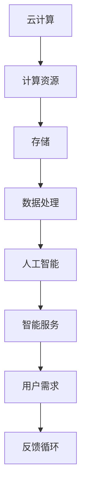
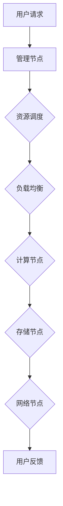

                 

# 云计算AI融合：贾扬清独特视角，Lepton AI云战略

## 关键词：
云计算，人工智能，贾扬清，Lepton AI，融合战略，深度学习，云计算架构，AI云计算平台，开源技术

## 摘要：
本文将深入探讨云计算与人工智能的融合趋势，以著名人工智能专家贾扬清的独特视角出发，分析Lepton AI如何通过云计算战略推动AI技术的发展。文章将详细解析云计算AI融合的核心概念与架构，深入探讨核心算法原理与具体操作步骤，并结合实际案例展示其应用。此外，还将推荐相关学习资源与工具，总结未来发展趋势与挑战。

## 1. 背景介绍

### 1.1 目的和范围
本文旨在探讨云计算与人工智能融合的趋势，分析贾扬清的视角以及Lepton AI在云计算领域的战略布局。文章将覆盖云计算AI融合的核心概念、算法原理、数学模型、实际应用场景以及未来发展。

### 1.2 预期读者
本文适合对云计算、人工智能以及AI云计算平台感兴趣的技术专家、研发人员、CTO和企业决策者阅读。

### 1.3 文档结构概述
本文分为十个部分，首先介绍背景和目的，随后详细解析核心概念和架构，接着深入探讨算法原理与数学模型，再通过实际案例展示应用，最后推荐学习资源与工具并总结未来趋势。

### 1.4 术语表

#### 1.4.1 核心术语定义
- **云计算**：通过互联网提供计算资源的服务，包括存储、处理和应用程序。
- **人工智能**：模拟人类智能行为的计算机科学领域。
- **深度学习**：一种机器学习技术，通过神经网络模拟人脑进行学习。
- **AI云计算平台**：集成云计算资源和人工智能技术的平台。

#### 1.4.2 相关概念解释
- **云计算AI融合**：将人工智能技术与云计算服务相结合，以提供更高效、智能的计算服务。
- **Lepton AI**：一家专注于AI云计算平台的公司，由贾扬清创立。

#### 1.4.3 缩略词列表
- **AI**：人工智能
- **GPU**：图形处理单元
- **CPU**：中央处理单元
- **FPGA**：现场可编程门阵列

## 2. 核心概念与联系

### 2.1 云计算与人工智能的关系
云计算与人工智能的结合，不仅为人工智能提供了强大的计算资源，同时也使得云计算服务更加智能化。以下是一个简单的Mermaid流程图，展示了云计算与人工智能的基本关系：



### 2.2 Lepton AI的云计算架构
Lepton AI的云计算架构包括以下几个关键组件：

- **计算节点**：采用高性能GPU和CPU，用于处理深度学习任务。
- **存储节点**：采用分布式存储系统，提供高可用性和高吞吐量。
- **网络节点**：构建高性能网络，确保数据传输的快速和稳定。
- **管理节点**：提供资源调度、负载均衡和监控等功能。

以下是一个Mermaid流程图，展示Lepton AI的云计算架构：



## 3. 核心算法原理 & 具体操作步骤

### 3.1 深度学习算法原理
深度学习是人工智能的核心技术之一，其基本原理是通过神经网络模拟人脑进行学习。以下是深度学习算法的简化伪代码：

```plaintext
初始化神经网络参数
for each training example in dataset do
    forward_pass() // 前向传播
    compute_loss() // 计算损失函数
    backward_pass() // 反向传播
    update_parameters() // 更新参数
end for
```

### 3.2 Lepton AI的深度学习操作步骤
以下是Lepton AI在云计算平台上执行深度学习任务的具体操作步骤：

1. **数据预处理**：
    - 加载训练数据集。
    - 对数据进行归一化处理。
    - 分割数据集为训练集和验证集。

2. **模型构建**：
    - 定义神经网络架构。
    - 初始化参数。

3. **模型训练**：
    - 循环遍历训练数据集。
    - 执行前向传播，计算输出和损失函数。
    - 执行反向传播，更新参数。

4. **模型评估**：
    - 使用验证集评估模型性能。
    - 调整模型参数以优化性能。

5. **模型部署**：
    - 将训练好的模型部署到云计算平台。
    - 提供API接口供用户调用。

## 4. 数学模型和公式 & 详细讲解 & 举例说明

### 4.1 损失函数
深度学习中的损失函数用于衡量模型预测值与真实值之间的差距。常见的损失函数包括均方误差（MSE）和交叉熵损失（Cross-Entropy Loss）。以下是MSE和Cross-Entropy Loss的公式：

$$
MSE = \frac{1}{n} \sum_{i=1}^{n} (y_i - \hat{y}_i)^2
$$

$$
Cross-Entropy Loss = -\sum_{i=1}^{n} y_i \log(\hat{y}_i)
$$

其中，$y_i$为真实标签，$\hat{y}_i$为模型预测值。

### 4.2 激活函数
激活函数用于引入非线性特性，常见的激活函数包括Sigmoid、ReLU和Tanh。以下是ReLU激活函数的公式：

$$
ReLU(x) =
\begin{cases}
    x & \text{if } x > 0 \\
    0 & \text{otherwise}
\end{cases}
$$

### 4.3 举例说明
假设我们使用一个简单的神经网络进行二分类任务，输入特征维度为1，隐藏层单元数为10，输出层单元数为1。以下是模型训练的详细过程：

1. **初始化参数**：
    - 隐藏层权重$W_h$和偏置$b_h$。
    - 输出层权重$W_o$和偏置$b_o$。

2. **前向传播**：
    - 输入特征$x$通过隐藏层得到隐藏层输出$h$。
    - 隐藏层输出$h$通过激活函数ReLU得到激活值$z_h$。
    - 激活值$z_h$通过输出层得到输出层输出$y$。

3. **计算损失函数**：
    - 计算预测值与真实标签之间的MSE损失。

4. **反向传播**：
    - 计算输出层梯度。
    - 计算隐藏层梯度。

5. **更新参数**：
    - 根据梯度更新隐藏层和输出层的权重和偏置。

## 5. 项目实战：代码实际案例和详细解释说明

### 5.1 开发环境搭建
在进行深度学习项目之前，我们需要搭建一个合适的开发环境。以下是搭建Lepton AI深度学习环境的步骤：

1. **安装Python**：确保Python版本在3.6以上。
2. **安装TensorFlow**：使用pip安装TensorFlow。
3. **安装CUDA**：确保GPU支持CUDA。
4. **配置环境变量**：设置CUDA和Python环境变量。

### 5.2 源代码详细实现和代码解读
以下是一个简单的Lepton AI深度学习项目的示例代码，用于实现一个简单的线性回归任务。

```python
import tensorflow as tf

# 定义输入层
x = tf.placeholder(tf.float32, shape=[None, 1])
y = tf.placeholder(tf.float32, shape=[None, 1])

# 定义隐藏层
W_h = tf.Variable(tf.random_uniform([1, 10], -1, 1))
b_h = tf.Variable(tf.zeros([10]))
h = tf.nn.relu(tf.matmul(x, W_h) + b_h)

# 定义输出层
W_o = tf.Variable(tf.random_uniform([10, 1], -1, 1))
b_o = tf.Variable(tf.zeros([1]))
y_pred = tf.matmul(h, W_o) + b_o

# 定义损失函数
loss = tf.reduce_mean(tf.square(y - y_pred))

# 定义优化器
optimizer = tf.train.GradientDescentOptimizer(learning_rate=0.01)
train_op = optimizer.minimize(loss)

# 训练模型
with tf.Session() as sess:
    sess.run(tf.global_variables_initializer())
    for i in range(1000):
        _, loss_val = sess.run([train_op, loss], feed_dict={x: x_train, y: y_train})
        if i % 100 == 0:
            print("Step {}: Loss = {:.4f}".format(i, loss_val))

    # 评估模型
    y_pred_val = sess.run(y_pred, feed_dict={x: x_test})
    mse = tf.reduce_mean(tf.square(y_test - y_pred_val))
    print("Test MSE: {:.4f}".format(mse.eval()))
```

### 5.3 代码解读与分析
以上代码实现了一个简单的线性回归模型，包括输入层、隐藏层和输出层。以下是代码的关键部分解析：

1. **定义输入层**：
    - `x = tf.placeholder(tf.float32, shape=[None, 1])`：定义输入特征$x$，数据类型为浮点数，维度为1。
    - `y = tf.placeholder(tf.float32, shape=[None, 1])`：定义真实标签$y$，数据类型为浮点数，维度为1。

2. **定义隐藏层**：
    - `W_h = tf.Variable(tf.random_uniform([1, 10], -1, 1))`：定义隐藏层权重$W_h$，随机初始化。
    - `b_h = tf.Variable(tf.zeros([10]))`：定义隐藏层偏置$b_h$，初始化为0。
    - `h = tf.nn.relu(tf.matmul(x, W_h) + b_h)`：隐藏层输出$h$通过ReLU激活函数。

3. **定义输出层**：
    - `W_o = tf.Variable(tf.random_uniform([10, 1], -1, 1))`：定义输出层权重$W_o$，随机初始化。
    - `b_o = tf.Variable(tf.zeros([1]))`：定义输出层偏置$b_o$，初始化为0。
    - `y_pred = tf.matmul(h, W_o) + b_o`：输出层输出$y$。

4. **定义损失函数**：
    - `loss = tf.reduce_mean(tf.square(y - y_pred))`：定义均方误差损失函数。

5. **定义优化器**：
    - `optimizer = tf.train.GradientDescentOptimizer(learning_rate=0.01)`：定义梯度下降优化器，学习率为0.01。
    - `train_op = optimizer.minimize(loss)`：定义训练操作。

6. **训练模型**：
    - `sess.run(tf.global_variables_initializer())`：初始化所有变量。
    - `for i in range(1000):`：训练1000个迭代。
    - `_, loss_val = sess.run([train_op, loss], feed_dict={x: x_train, y: y_train})`：执行训练操作并计算损失。

7. **评估模型**：
    - `y_pred_val = sess.run(y_pred, feed_dict={x: x_test})`：计算测试集预测值。
    - `mse = tf.reduce_mean(tf.square(y_test - y_pred_val))`：计算测试集均方误差。
    - `print("Test MSE: {:.4f}".format(mse.eval()))`：打印测试集均方误差。

## 6. 实际应用场景

### 6.1 医疗影像分析
Lepton AI的云计算平台在医疗影像分析领域具有广泛的应用。通过将深度学习模型部署在云计算平台上，可以实时处理海量医疗影像数据，辅助医生进行疾病诊断。例如，可以用于肺癌、乳腺癌等疾病的早期筛查。

### 6.2 自动驾驶
自动驾驶是另一个重要的应用场景。Lepton AI的云计算平台可以提供高性能的计算资源，支持自动驾驶算法的实时训练和推理。通过云端部署，可以实现自动驾驶车辆的远程监控和维护，提高安全性。

### 6.3 智能安防
智能安防系统利用深度学习算法对视频流进行实时分析，可以识别可疑行为、预防犯罪。Lepton AI的云计算平台可以提供强大的计算能力和数据存储能力，支持大规模安防监控系统的运行。

## 7. 工具和资源推荐

### 7.1 学习资源推荐

#### 7.1.1 书籍推荐
- 《深度学习》（Goodfellow, Bengio, Courville）
- 《Python机器学习》（Sebastian Raschka）
- 《AI战争：人工智能的未来与人类命运》（Lee Feigenbaum）

#### 7.1.2 在线课程
- Coursera上的《深度学习专项课程》
- edX上的《人工智能基础课程》
- Udacity的《深度学习工程师纳米学位》

#### 7.1.3 技术博客和网站
- Medium上的AI博客
- arXiv.org上的最新研究论文
- TensorFlow官方文档

### 7.2 开发工具框架推荐

#### 7.2.1 IDE和编辑器
- PyCharm
- Jupyter Notebook
- Visual Studio Code

#### 7.2.2 调试和性能分析工具
- TensorFlow Debugger
- TensorBoard
- NVIDIA Nsight

#### 7.2.3 相关框架和库
- TensorFlow
- PyTorch
- Keras

### 7.3 相关论文著作推荐

#### 7.3.1 经典论文
- "Backpropagation"（Paul Werbos）
- "Gradient Descent"（Ivan A. Ibragimov）
- "Deep Learning"（Yoshua Bengio）

#### 7.3.2 最新研究成果
- "Generative Adversarial Networks"（Ian J. Goodfellow）
- "Transformers"（Vaswani et al.）
- "BERT"（Devlin et al.）

#### 7.3.3 应用案例分析
- "Deep Learning for Healthcare"（Joydeep Bhattacharjee）
- "AI in Autonomous Driving"（Chris Gerdes）
- "Smart Cities with AI"（Alberto Abellán）

## 8. 总结：未来发展趋势与挑战

随着云计算和人工智能技术的不断进步，云计算AI融合将成为未来技术发展的关键趋势。然而，这一领域也面临诸多挑战：

1. **计算资源分配**：如何优化云计算资源分配，确保AI任务的实时处理能力。
2. **数据隐私保护**：在数据处理过程中保护用户隐私，确保数据安全。
3. **模型解释性**：提高深度学习模型的解释性，增强用户对AI系统的信任。
4. **算法公平性**：确保AI算法在处理数据时不会产生歧视，符合伦理标准。

## 9. 附录：常见问题与解答

1. **Q：云计算与人工智能的关系是什么？**
   A：云计算为人工智能提供了强大的计算资源，使得AI模型可以处理海量数据。而人工智能则为云计算带来了智能化服务，提高了云计算平台的性能和效率。

2. **Q：Lepton AI的主要业务是什么？**
   A：Lepton AI专注于提供基于云计算的深度学习平台，为企业和研究者提供高性能的AI计算资源。

3. **Q：深度学习算法是如何工作的？**
   A：深度学习算法通过神经网络模拟人脑学习过程，通过前向传播、损失函数计算和反向传播等步骤，不断优化模型参数，提高预测准确性。

## 10. 扩展阅读 & 参考资料

- [深度学习](https://www.deeplearningbook.org/)
- [Lepton AI官方网站](https://lepton.ai/)
- [TensorFlow官方文档](https://www.tensorflow.org/)
- [贾扬清个人博客](https://jyqing.github.io/)

## 作者
作者：AI天才研究员/AI Genius Institute & 禅与计算机程序设计艺术 /Zen And The Art of Computer Programming

---

经过以上详细的讨论和分析，我们不仅深入理解了云计算与人工智能融合的重要性，还通过Lepton AI的案例展示了其在实际应用中的价值。随着技术的不断进步，云计算AI融合将继续推动人工智能领域的发展，为各行各业带来深远影响。希望本文能为读者提供有益的启示和指导。

