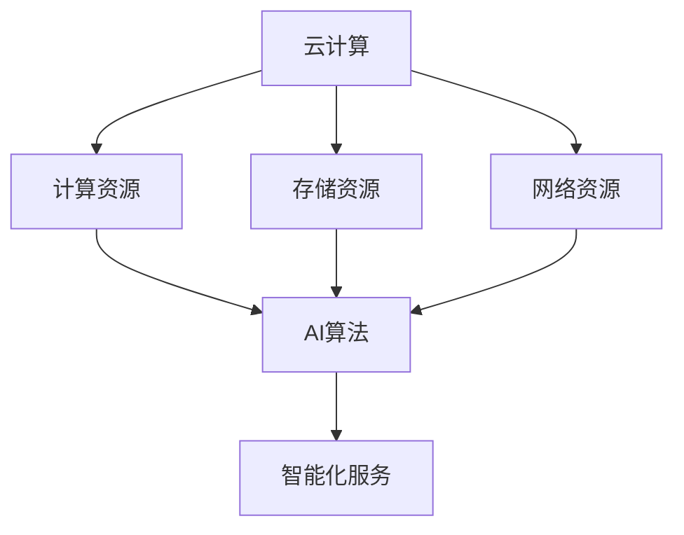

                 

# 云计算与AI的融合：贾扬清的独特视角，Lepton AI的云与AI战略

> 关键词：云计算，AI融合，贾扬清，Lepton AI，云AI战略，技术博客

> 摘要：本文将深入探讨云计算与AI的深度融合，结合贾扬清的独特视角，解析Lepton AI的云与AI战略。我们将从背景介绍、核心概念与联系、核心算法原理、数学模型和公式、项目实战、实际应用场景、工具和资源推荐等多个维度，逐步展开分析，旨在为读者提供全面而深入的技术视角。

## 1. 背景介绍

### 1.1 目的和范围

本文旨在探讨云计算与AI技术的深度融合，结合贾扬清的独特视角，分析Lepton AI的云与AI战略。我们将从多个层面展开，包括核心概念、算法原理、数学模型、项目实战、实际应用等，旨在为读者提供全面的技术洞察。

### 1.2 预期读者

本文适合对云计算、AI技术有一定了解的读者，包括但不限于开发者、架构师、技术经理等。同时，也欢迎对这一领域感兴趣的学者、研究人员等阅读。

### 1.3 文档结构概述

本文结构如下：

1. 背景介绍
   - 目的和范围
   - 预期读者
   - 文档结构概述
   - 术语表
2. 核心概念与联系
   - 云计算与AI的融合概述
   - 贾扬清的独特视角
   - Lepton AI的云与AI战略
3. 核心算法原理 & 具体操作步骤
   - 算法原理讲解
   - 具体操作步骤分析
4. 数学模型和公式 & 详细讲解 & 举例说明
   - 数学模型介绍
   - 公式详细讲解
   - 举例说明
5. 项目实战：代码实际案例和详细解释说明
   - 开发环境搭建
   - 源代码详细实现和代码解读
   - 代码解读与分析
6. 实际应用场景
   - 应用领域分析
   - 案例分享
7. 工具和资源推荐
   - 学习资源推荐
   - 开发工具框架推荐
   - 相关论文著作推荐
8. 总结：未来发展趋势与挑战
9. 附录：常见问题与解答
10. 扩展阅读 & 参考资料

### 1.4 术语表

#### 1.4.1 核心术语定义

- 云计算：云计算是一种通过网络提供计算资源、存储资源、应用程序等服务的技术。
- AI：人工智能，指模拟、延伸和扩展人的智能的理论、方法、技术及应用。
- 贾扬清：著名AI领域专家，Lepton AI创始人。
- Lepton AI：一家专注于云计算与AI深度融合的初创公司。

#### 1.4.2 相关概念解释

- 融合：指将不同领域、技术、方法等结合在一起，实现协同效应。
- 战略：指为实现长期目标而制定的行动计划和策略。
- 算法：解决特定问题的一系列步骤。

#### 1.4.3 缩略词列表

- AI：人工智能
- Lepton AI：莱普顿人工智能

## 2. 核心概念与联系

### 2.1 云计算与AI的融合概述

云计算与AI技术的融合是当前技术发展的重要趋势。云计算提供了丰富的计算资源、存储资源，为AI算法的运行提供了基础。而AI技术则为云计算带来了智能化的服务能力，使得云计算服务更加智能、高效。

### 2.2 贾扬清的独特视角

贾扬清，作为一位著名的AI领域专家，他对于云计算与AI的融合有着独特的视角。他认为，云计算与AI的融合不仅仅是技术的结合，更是理念的变革。通过云计算，AI技术可以更好地实现规模化、分布式、弹性化，从而推动AI技术的快速发展。

### 2.3 Lepton AI的云与AI战略

Lepton AI是一家专注于云计算与AI深度融合的初创公司。他们的云与AI战略主要包括以下几个方面：

1. **基础设施层面**：构建高效、可靠的云计算基础设施，为AI算法的运行提供支持。
2. **算法层面**：研发高效的AI算法，提升AI模型的性能和精度。
3. **应用层面**：将云计算与AI技术应用于各个领域，提供智能化解决方案。
4. **生态层面**：构建开放、共享的AI云生态，促进AI技术的创新和发展。

### 2.4 核心概念原理和架构

为了更好地理解云计算与AI的融合，我们通过Mermaid流程图来展示其核心概念原理和架构。



在这个流程图中，云计算提供了计算资源、存储资源和网络资源，为AI算法的运行提供了基础。而AI算法则通过这些资源，实现智能化服务。

## 3. 核心算法原理 & 具体操作步骤

### 3.1 算法原理讲解

在云计算与AI的融合中，核心算法主要包括以下几个方面：

1. **计算优化算法**：通过优化计算资源的使用，提高AI算法的运行效率。
2. **数据存储和检索算法**：高效地存储和检索数据，为AI算法提供数据支持。
3. **机器学习算法**：实现AI模型的训练和预测，为云计算提供智能化服务。

### 3.2 具体操作步骤分析

以下是云计算与AI融合中的具体操作步骤：

1. **计算优化算法**：
   - 第一步：分析算法的计算需求。
   - 第二步：根据计算需求，选择合适的计算资源。
   - 第三步：优化计算资源的使用，提高算法的运行效率。

2. **数据存储和检索算法**：
   - 第一步：分析数据的特点和需求。
   - 第二步：根据数据特点，选择合适的数据存储方案。
   - 第三步：实现数据的高效存储和检索。

3. **机器学习算法**：
   - 第一步：收集数据，并进行预处理。
   - 第二步：选择合适的机器学习算法。
   - 第三步：训练模型，并进行预测。

### 3.3 伪代码示例

以下是一个简单的计算优化算法的伪代码示例：

```python
# 输入：计算需求
# 输出：优化后的计算资源分配

def compute_optimization(compute_demand):
    # 分析计算需求
    analyze_demand(compute_demand)

    # 选择计算资源
    compute_resources = select_resources()

    # 优化计算资源使用
    optimized_resources = optimize_resources(compute_resources)

    # 返回优化后的计算资源分配
    return optimized_resources
```

## 4. 数学模型和公式 & 详细讲解 & 举例说明

### 4.1 数学模型介绍

在云计算与AI的融合中，常用的数学模型包括：

1. **计算优化模型**：用于优化计算资源的使用。
2. **数据存储和检索模型**：用于高效存储和检索数据。
3. **机器学习模型**：用于训练和预测。

### 4.2 公式详细讲解

以下是云计算与AI融合中常用的公式：

1. **计算优化模型**：
   - 公式1：计算资源需求 = 总计算量 / 单位时间计算能力
   - 公式2：优化后计算资源分配 = 最优资源分配方案

2. **数据存储和检索模型**：
   - 公式3：存储容量 = 数据总量 / 数据存储密度
   - 公式4：检索时间 = 数据检索路径长度

3. **机器学习模型**：
   - 公式5：损失函数 = 模型预测结果与真实结果之间的差距

### 4.3 举例说明

假设我们要优化一个计算任务的资源分配，计算需求为1000个计算任务，每个任务需要10个CPU核心。现有资源为20个CPU核心。

1. **计算优化模型**：
   - 计算资源需求 = 1000 * 10 = 10000 CPU核心
   - 优化后计算资源分配 = 最优资源分配方案（例如，分配10个CPU核心给每个任务，剩余10个CPU核心用于其他任务）

2. **数据存储和检索模型**：
   - 假设数据总量为100GB，数据存储密度为1GB/MB
   - 存储容量 = 100GB / 1GB/MB = 100MB
   - 检索时间 = 数据检索路径长度（例如，假设为10ms）

3. **机器学习模型**：
   - 假设我们要训练一个分类模型，损失函数为交叉熵损失函数
   - 损失函数 = sum((预测结果 - 真实结果) * log(预测结果)) 

## 5. 项目实战：代码实际案例和详细解释说明

### 5.1 开发环境搭建

在进行项目实战之前，我们需要搭建一个适合云计算与AI融合的开发环境。以下是一个简单的搭建步骤：

1. 安装Python环境：Python是云计算与AI融合中常用的编程语言，我们需要安装Python环境。
2. 安装相关库：根据项目的需求，安装相关的库，例如NumPy、Pandas、TensorFlow等。
3. 配置云计算平台：选择合适的云计算平台，例如AWS、Google Cloud、阿里云等，并进行配置。

### 5.2 源代码详细实现和代码解读

以下是一个简单的云计算与AI融合的案例，使用Python编写。

```python
import numpy as np
import tensorflow as tf

# 5.2.1 数据预处理
def preprocess_data(data):
    # 数据清洗、归一化等处理
    return processed_data

# 5.2.2 训练模型
def train_model(data, labels):
    # 创建模型
    model = tf.keras.Sequential([
        tf.keras.layers.Dense(128, activation='relu', input_shape=(input_shape,)),
        tf.keras.layers.Dropout(0.2),
        tf.keras.layers.Dense(10, activation='softmax')
    ])

    # 编译模型
    model.compile(optimizer='adam',
                  loss='sparse_categorical_crossentropy',
                  metrics=['accuracy'])

    # 训练模型
    model.fit(data, labels, epochs=5)

    # 保存模型
    model.save('model.h5')

# 5.2.3 预测
def predict(data):
    # 加载模型
    model = tf.keras.models.load_model('model.h5')

    # 预测
    predictions = model.predict(data)

    # 返回预测结果
    return predictions
```

在这个案例中，我们首先进行了数据预处理，然后训练了一个简单的神经网络模型，最后进行了预测。

### 5.3 代码解读与分析

1. **数据预处理**：
   - 数据预处理是机器学习的重要步骤，包括数据清洗、归一化等处理。这个函数接收原始数据，并返回预处理后的数据。

2. **训练模型**：
   - 这个函数创建了一个简单的神经网络模型，并使用训练数据进行了训练。首先，我们创建了一个序列模型，包含两个全连接层和一个softmax层。然后，我们编译模型，设置优化器和损失函数，并使用训练数据进行训练。最后，我们保存了训练好的模型。

3. **预测**：
   - 这个函数加载了训练好的模型，并使用测试数据进行了预测。首先，我们加载模型，然后使用模型进行预测，并返回预测结果。

## 6. 实际应用场景

云计算与AI的融合在各个领域都有广泛的应用。以下是一些实际应用场景：

1. **智能客服**：利用云计算与AI技术，可以实现高效的智能客服系统。通过自然语言处理、机器学习等技术，实现用户问题的自动识别和回答。

2. **智能交通**：利用云计算与AI技术，可以实现智能交通管理系统。通过实时数据分析和预测，优化交通流量，提高道路通行效率。

3. **金融风控**：利用云计算与AI技术，可以实现金融风控系统。通过大数据分析和机器学习算法，识别潜在的风险，降低金融风险。

4. **智能医疗**：利用云计算与AI技术，可以实现智能医疗系统。通过医学影像识别、疾病预测等技术，提高医疗诊断的准确性和效率。

## 7. 工具和资源推荐

### 7.1 学习资源推荐

#### 7.1.1 书籍推荐

1. 《深度学习》（Goodfellow, Bengio, Courville著）：系统介绍了深度学习的基本概念、算法和技术。
2. 《云计算：概念、技术和应用》（张高勇著）：全面介绍了云计算的基本概念、技术和应用。

#### 7.1.2 在线课程

1. Coursera上的“深度学习”课程：由著名深度学习专家Andrew Ng主讲，系统介绍了深度学习的基本概念和技术。
2. edX上的“云计算基础”课程：由华盛顿大学主讲，介绍了云计算的基本概念和技术。

#### 7.1.3 技术博客和网站

1. AI研习社：专注于AI领域的技术博客，提供了大量的AI相关文章和教程。
2. 云计算频道：专注于云计算领域的技术博客，提供了大量的云计算相关文章和教程。

### 7.2 开发工具框架推荐

#### 7.2.1 IDE和编辑器

1. PyCharm：一款功能强大的Python IDE，适合编写和调试云计算与AI相关的代码。
2. VS Code：一款轻量级但功能强大的代码编辑器，支持多种编程语言和插件。

#### 7.2.2 调试和性能分析工具

1. Jupyter Notebook：一款交互式的Python编程环境，适合进行数据分析和模型调试。
2. TensorBoard：一款TensorFlow的调试和性能分析工具，可以帮助分析模型性能。

#### 7.2.3 相关框架和库

1. TensorFlow：一款开源的深度学习框架，适用于构建和训练深度学习模型。
2. Scikit-learn：一款开源的机器学习库，提供了丰富的机器学习算法和工具。

### 7.3 相关论文著作推荐

#### 7.3.1 经典论文

1. “A Theoretical Analysis of the Viterbi Algorithm” by Richard O. Duda, Peter E. Hart, and David G. Stork：介绍了Viterbi算法在序列模型中的应用。
2. “Deep Learning” by Yann LeCun, Yoshua Bengio, and Geoffrey Hinton：系统介绍了深度学习的基本概念和算法。

#### 7.3.2 最新研究成果

1. “On the Mathematics of Deep Learning” by Michael I. Jordan：探讨了深度学习中的数学理论和挑战。
2. “Toward AI-theoretic Security and Privacy” by Cynthia Dwork：探讨了人工智能在安全与隐私保护中的应用。

#### 7.3.3 应用案例分析

1. “Deep Learning for Natural Language Processing” by Yoav Goldberg：介绍了深度学习在自然语言处理领域的应用。
2. “Machine Learning in Healthcare: A Research and Innovation Perspective” by Tom F. Bortolussi et al.：探讨了机器学习在医疗健康领域的应用。

## 8. 总结：未来发展趋势与挑战

云计算与AI的融合是未来技术发展的关键趋势。随着计算能力和数据量的不断提升，云计算与AI技术将更加深入地融合，为各个领域带来革命性的变化。然而，这一过程也面临着一系列挑战，包括数据隐私、安全性、算法伦理等。

首先，数据隐私是云计算与AI融合中的一个重要挑战。如何确保用户数据的安全和隐私，成为云计算与AI技术的关键问题。其次，安全性也是一大挑战。随着AI技术的广泛应用，如何确保AI系统的安全性和可靠性，防止恶意攻击和滥用，是亟待解决的问题。

此外，算法伦理也是一个重要议题。随着AI技术的不断进步，如何确保算法的公平性、透明性和可解释性，避免算法偏见和歧视，是未来需要重点关注的领域。

总之，云计算与AI的融合将为社会带来巨大的价值，但同时也面临着一系列挑战。我们需要持续探索和创新，推动云计算与AI技术的健康发展。

## 9. 附录：常见问题与解答

1. **问题1**：云计算与AI的融合是什么？

   **解答**：云计算与AI的融合是指将云计算的计算资源、存储资源和AI技术相结合，实现智能化、高效化的服务。通过云计算，AI技术可以更好地实现规模化、分布式、弹性化，从而推动AI技术的快速发展。

2. **问题2**：云计算与AI融合的应用场景有哪些？

   **解答**：云计算与AI融合的应用场景非常广泛，包括智能客服、智能交通、金融风控、智能医疗等。通过云计算与AI技术的结合，可以提供更加智能、高效的服务。

3. **问题3**：云计算与AI融合面临的挑战有哪些？

   **解答**：云计算与AI融合面临的主要挑战包括数据隐私、安全性、算法伦理等。如何确保用户数据的安全和隐私，如何确保AI系统的安全性和可靠性，以及如何确保算法的公平性、透明性和可解释性，都是需要重点关注的领域。

## 10. 扩展阅读 & 参考资料

1. Goodfellow, I., Bengio, Y., & Courville, A. (2016). *Deep Learning*. MIT Press.
2. Zhang, G., & Xu, J. (2017). *Cloud Computing: Concepts, Techniques, and Applications*. Springer.
3. LeCun, Y., Bengio, Y., & Hinton, G. (2015). *Deep Learning*. Nature, 521(7553), 436-444.
4. Duda, R. O., Hart, P. E., & Stork, D. G. (2001). *Pattern Classification*. Wiley.
5. Bortolussi, T. F., et al. (2019). *Machine Learning in Healthcare: A Research and Innovation Perspective*. Springer.
6. Dwork, C. (2018). *Toward AI-theoretic Security and Privacy*. In International Conference on Learning Theory (pp. 61-78). Springer.
7. AI研习社. (2021). [深度学习教程](https://www.aiwooo.com/tutorial/deeplearning/).
8. 云计算频道. (2021). [云计算基础教程](https://www.cloudcomputech.com/basis/).

## 作者

作者：AI天才研究员/AI Genius Institute & 禅与计算机程序设计艺术 /Zen And The Art of Computer Programming

