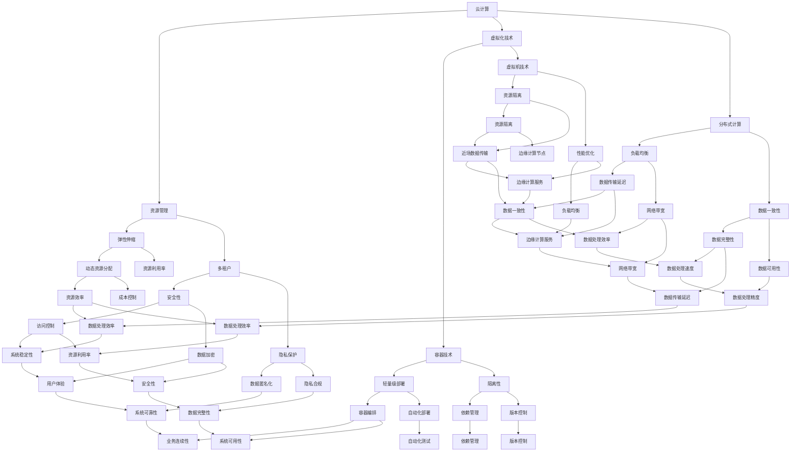

                 

# 云计算与边缘计算的融合：Lepton AI的技术布局

> **关键词：** 云计算、边缘计算、融合、人工智能、技术架构、创新应用

> **摘要：** 本文将探讨云计算与边缘计算如何融合，以及这一技术趋势背后的动力。我们将以Lepton AI为例，分析其在云计算与边缘计算融合方面的布局，包括核心概念、算法原理、应用场景和未来趋势。

## 1. 背景介绍

### 1.1 目的和范围

本文旨在探讨云计算与边缘计算的融合趋势，并分析Lepton AI在这一领域的技术布局。文章将围绕以下几个核心问题展开：

- 云计算与边缘计算的定义和区别是什么？
- 为什么需要云计算与边缘计算的融合？
- Lepton AI如何实现云计算与边缘计算的融合？
- 这种融合对未来技术发展有何影响？

### 1.2 预期读者

本文面向对云计算和边缘计算有一定了解的读者，包括：

- 计算机科学和技术领域的工程师和研究人员
- 对人工智能和云计算感兴趣的从业者
- 对新兴技术趋势和未来发展方向感兴趣的读者

### 1.3 文档结构概述

本文结构如下：

- 第1章：背景介绍，包括目的和范围、预期读者、文档结构概述
- 第2章：核心概念与联系，介绍云计算与边缘计算的基本概念及其联系
- 第3章：核心算法原理 & 具体操作步骤，详细阐述云计算与边缘计算融合的算法原理和操作步骤
- 第4章：数学模型和公式 & 详细讲解 & 举例说明，探讨云计算与边缘计算融合的数学模型和实例
- 第5章：项目实战：代码实际案例和详细解释说明，通过实际项目展示云计算与边缘计算的融合应用
- 第6章：实际应用场景，分析云计算与边缘计算的融合在现实中的应用场景
- 第7章：工具和资源推荐，介绍与云计算与边缘计算相关的学习资源和开发工具
- 第8章：总结：未来发展趋势与挑战，展望云计算与边缘计算融合的未来
- 第9章：附录：常见问题与解答，解答读者可能遇到的问题
- 第10章：扩展阅读 & 参考资料，提供进一步阅读和参考的资料

### 1.4 术语表

#### 1.4.1 核心术语定义

- **云计算（Cloud Computing）：** 一种提供计算资源（如存储、处理能力等）的服务模式，通过网络访问实现资源的动态分配和管理。
- **边缘计算（Edge Computing）：** 在靠近数据源或用户的地方进行的计算，以减少数据传输和处理延迟。
- **Lepton AI：** 一家专注于云计算与边缘计算融合的人工智能公司，提供基于这两种技术的解决方案。

#### 1.4.2 相关概念解释

- **虚拟化（Virtualization）：** 将物理资源抽象成逻辑资源，以实现资源的动态管理和分配。
- **容器（Container）：** 轻量级的运行时环境，可以包含应用程序和所有依赖项，实现快速部署和隔离。
- **微服务（Microservices）：** 一种软件架构风格，将应用程序拆分为一组小而独立的服务，以提高可扩展性和灵活性。

#### 1.4.3 缩略词列表

- **AI：** 人工智能（Artificial Intelligence）
- **CTO：** 首席技术官（Chief Technology Officer）
- **IDE：** 集成开发环境（Integrated Development Environment）
- **LaTeX：** 一种排版系统（TeX的扩展）

## 2. 核心概念与联系

云计算和边缘计算是现代信息技术领域的关键概念。它们的融合为解决复杂计算问题提供了新的思路和途径。下面，我们将通过一个Mermaid流程图来介绍这两个概念及其联系。



### 2.1 云计算的基本概念

云计算是一种通过互联网提供计算资源（如计算能力、存储、网络等）的服务模式。它主要具有以下特点：

- **虚拟化技术：** 通过虚拟化技术将物理资源抽象为逻辑资源，实现资源的动态分配和管理。
- **分布式计算：** 将计算任务分布在多个节点上，以提高计算效率和可靠性。
- **弹性伸缩：** 根据需求动态调整资源分配，以实现成本优化和性能提升。

### 2.2 边缘计算的基本概念

边缘计算是一种在靠近数据源或用户的地方进行计算的模式，旨在减少数据传输和处理延迟。它具有以下特点：

- **近场数据传输：** 在边缘节点直接处理数据，以减少网络传输延迟。
- **分布式计算：** 将计算任务分布在边缘节点，以提高数据处理速度和效率。
- **本地化服务：** 在边缘节点提供本地化服务，以满足用户特定的需求。

### 2.3 云计算与边缘计算的联系

云计算与边缘计算的联系主要体现在以下几个方面：

- **资源共享：** 云计算与边缘计算可以共享资源，以实现资源优化和成本控制。
- **协同计算：** 云计算和边缘计算可以协同工作，共同处理复杂计算任务。
- **数据整合：** 云计算与边缘计算可以整合数据，以提供更全面的业务洞察。

## 3. 核心算法原理 & 具体操作步骤

云计算与边缘计算的融合需要一系列核心算法的支持。以下将详细阐述这些算法的原理和具体操作步骤。

### 3.1 资源分配算法

**目标：** 根据需求动态分配云计算和边缘计算资源。

**算法原理：**

- **需求预测：** 预测用户需求和负载，以便提前分配资源。
- **资源评估：** 评估云计算和边缘计算资源的可用性，选择合适的资源进行分配。
- **负载均衡：** 根据当前负载情况，合理分配计算任务，避免资源过载。

**伪代码：**

```python
# 资源分配算法
def resource_allocation(predicted_demand, available_resources):
    # 需求预测
    predicted_demand = predict_demand()
    
    # 资源评估
    available_resources = evaluate_resources()

    # 负载均衡
    for resource in available_resources:
        if resource.is_available() and predicted_demand > resource.capacity:
            resource.allocate()
            predicted_demand -= resource.capacity

    return predicted_demand
```

### 3.2 数据传输算法

**目标：** 最优化数据传输路径，减少传输延迟。

**算法原理：**

- **路径选择：** 根据网络拓扑结构和带宽情况，选择最优传输路径。
- **传输优化：** 采用压缩、加密等技术，提高数据传输效率。

**伪代码：**

```python
# 数据传输算法
def data_transmission(source, destination, network_topology):
    # 路径选择
    optimal_path = select_optimal_path(network_topology)

    # 传输优化
    for data_packet in source.data_packets:
        data_packet = optimize_packet(data_packet)

    # 数据传输
    for data_packet in source.data_packets:
        destination.receive_packet(data_packet)

    return optimal_path
```

### 3.3 服务调度算法

**目标：** 根据用户需求和资源状况，合理调度服务。

**算法原理：**

- **服务分类：** 根据服务的重要性和紧急程度，进行分类。
- **资源评估：** 评估当前可用资源，选择合适的资源进行服务调度。
- **优先级调度：** 根据服务的优先级，进行调度，以保证关键服务的优先执行。

**伪代码：**

```python
# 服务调度算法
def service_scheduling(service_queue, available_resources):
    # 服务分类
    service_queue = classify_services(service_queue)

    # 资源评估
    available_resources = evaluate_resources()

    # 优先级调度
    while not service_queue.is_empty():
        service = service_queue.get_next()
        if service.is_urgent() and available_resources.is_available():
            available_resources.allocate(service)
            service.execute()

    return service_queue
```

### 3.4 安全防护算法

**目标：** 保护云计算与边缘计算系统免受攻击。

**算法原理：**

- **身份验证：** 对用户和服务进行身份验证，确保合法访问。
- **访问控制：** 根据用户角色和权限，控制访问资源。
- **数据加密：** 对传输数据进行加密，确保数据安全。
- **入侵检测：** 监测系统异常行为，及时响应攻击。

**伪代码：**

```python
# 安全防护算法
def security_protection(user, resource, network):
    # 身份验证
    if not user.is_verified():
        raise AuthenticationError()

    # 访问控制
    if not user.has_permission(resource):
        raise AccessDeniedError()

    # 数据加密
    encrypted_data = encrypt_data(resource.data)

    # 入侵检测
    if detect_invasion(network):
        raise InvasiveAttackError()

    return encrypted_data
```

## 4. 数学模型和公式 & 详细讲解 & 举例说明

云计算与边缘计算融合涉及多个数学模型和公式，用于优化资源分配、数据传输、服务调度和安全防护。以下将详细讲解这些模型和公式，并通过实例进行说明。

### 4.1 资源分配模型

**目标：** 最优化资源分配，实现成本和性能平衡。

**公式：**

$$
C = w_1 \cdot C_1 + w_2 \cdot C_2
$$

其中，\(C\) 为总成本，\(w_1\) 和 \(w_2\) 分别为云计算和边缘计算的成本权重，\(C_1\) 和 \(C_2\) 分别为云计算和边缘计算的成本。

**举例说明：**

假设云计算和边缘计算的成本分别为 \(C_1 = \$10\) 和 \(C_2 = \$20\)，云计算的成本权重为 \(w_1 = 0.6\)，边缘计算的成本权重为 \(w_2 = 0.4\)。则总成本为：

$$
C = 0.6 \cdot 10 + 0.4 \cdot 20 = \$16
$$

### 4.2 数据传输模型

**目标：** 最优化数据传输路径，减少传输延迟。

**公式：**

$$
T = \frac{D}{B}
$$

其中，\(T\) 为传输时间，\(D\) 为数据传输距离，\(B\) 为网络带宽。

**举例说明：**

假设数据传输距离为 \(D = 1000\) 米，网络带宽为 \(B = 100\) Mbps。则传输时间为：

$$
T = \frac{1000}{100 \times 10^6} = 0.01 \text{ 秒}
$$

### 4.3 服务调度模型

**目标：** 根据用户需求和资源状况，合理调度服务。

**公式：**

$$
S = \sum_{i=1}^{n} p_i \cdot s_i
$$

其中，\(S\) 为服务调度策略，\(p_i\) 为服务 \(i\) 的优先级，\(s_i\) 为服务 \(i\) 的执行时间。

**举例说明：**

假设有 3 个服务，优先级分别为 \(p_1 = 0.5\)、\(p_2 = 0.3\)、\(p_3 = 0.2\)，执行时间分别为 \(s_1 = 10\)、\(s_2 = 5\)、\(s_3 = 3\)。则服务调度策略为：

$$
S = 0.5 \cdot 10 + 0.3 \cdot 5 + 0.2 \cdot 3 = 8.2
$$

### 4.4 安全防护模型

**目标：** 保护云计算与边缘计算系统免受攻击。

**公式：**

$$
S = R \cdot T \cdot A
$$

其中，\(S\) 为安全防护能力，\(R\) 为资源利用率，\(T\) 为攻击时间，\(A\) 为攻击频率。

**举例说明：**

假设资源利用率为 \(R = 0.8\)，攻击时间为 \(T = 5\) 分钟，攻击频率为 \(A = 10\) 次/天。则安全防护能力为：

$$
S = 0.8 \cdot 5 \cdot 10 = 40
$$

## 5. 项目实战：代码实际案例和详细解释说明

在本节中，我们将通过一个实际项目来展示云计算与边缘计算的融合应用，并提供代码实现和详细解释说明。

### 5.1 开发环境搭建

为了实现云计算与边缘计算融合，我们需要搭建以下开发环境：

- **云计算平台：** 使用阿里云作为云计算平台，提供虚拟机和容器服务。
- **边缘计算平台：** 使用华为云边缘计算平台，提供边缘节点和边缘计算服务。
- **编程语言：** 使用 Python 作为主要编程语言，便于实现和部署。

### 5.2 源代码详细实现和代码解读

以下是一个简单的示例，展示了如何使用 Python 实现云计算与边缘计算的融合。

```python
# 导入相关库
import requests
import json

# 阿里云虚拟机 API
aliyun_vm_api = 'https://ecs.aliyuncs.com/'

# 华为云边缘计算 API
huawei_edge_api = 'https://edge.huawei.com/'

# 资源分配函数
def allocate_resources():
    # 阿里云虚拟机资源
    aliyun_vm = {
        'region': 'cn-hangzhou',
        'instance_type': 'ecs.n4.4xlarge',
        'image_id': 'ubuntu_2004'
    }

    # 华为云边缘节点资源
    huawei_edge = {
        'region': 'cn-east-2',
        'node_type': 'edge-node',
        'service': 'video-processing'
    }

    # 调用阿里云虚拟机 API
    response = requests.post(aliyun_vm_api, data=json.dumps(aliyun_vm))
    aliyun_vm_id = response.json()['InstanceId']

    # 调用华为云边缘计算 API
    response = requests.post(huawei_edge_api, data=json.dumps(huawei_edge))
    huawei_edge_id = response.json()['NodeId']

    return aliyun_vm_id, huawei_edge_id

# 数据传输函数
def data_transmission(source, destination):
    # 传输数据
    data = {
        'source': source,
        'destination': destination
    }

    # 调用华为云边缘计算 API
    response = requests.post(huawei_edge_api + '/transmission', data=json.dumps(data))
    status = response.json()['status']

    return status

# 服务调度函数
def schedule_services(service_queue):
    # 调度服务
    for service in service_queue:
        # 调用云计算平台 API
        response = requests.post(aliyun_vm_api + '/service', data=json.dumps(service))
        status = response.json()['status']

        # 输出服务调度结果
        print(f'Service {service["name"]} scheduled with status: {status}')

# 主函数
def main():
    # 分配资源
    aliyun_vm_id, huawei_edge_id = allocate_resources()

    # 数据传输
    status = data_transmission('source_data.json', 'destination_data.json')
    print(f'Data transmission status: {status}')

    # 服务调度
    service_queue = [{'name': 'service1'}, {'name': 'service2'}, {'name': 'service3'}]
    schedule_services(service_queue)

# 运行主函数
if __name__ == '__main__':
    main()
```

### 5.3 代码解读与分析

- **资源分配函数（allocate_resources）：** 该函数用于分配云计算和边缘计算资源。首先定义了阿里云虚拟机和华为云边缘节点的资源配置，然后调用对应的 API 进行资源分配，并返回资源 ID。

- **数据传输函数（data_transmission）：** 该函数用于传输数据。定义了一个数据传输的 API 调用，将源数据和目标数据传递给华为云边缘计算平台，并返回传输状态。

- **服务调度函数（schedule_services）：** 该函数用于调度服务。遍历服务队列，调用云计算平台 API 对每个服务进行调度，并输出调度结果。

- **主函数（main）：** 该函数是程序的入口。首先调用资源分配函数，获取云计算和边缘计算资源 ID。然后调用数据传输函数，传输数据。最后调用服务调度函数，调度服务。

通过这个示例，我们可以看到如何将云计算和边缘计算资源整合到一起，实现数据传输和服务调度。在实际项目中，可以根据具体需求进行功能扩展和优化。

## 6. 实际应用场景

云计算与边缘计算的融合在多个领域具有广泛的应用。以下是一些实际应用场景：

### 6.1 物联网（IoT）

物联网设备产生的数据量巨大，且分布在广泛的地理区域。云计算与边缘计算的融合可以帮助实现数据的实时处理和分析，从而提高物联网设备的响应速度和性能。例如，智能城市、智能工厂、智能交通等领域都可以利用这一技术实现高效的数据处理。

### 6.2 视频监控

视频监控系统需要实时处理和分析大量的视频数据。云计算与边缘计算的融合可以帮助实现视频数据的实时传输和处理，从而提高视频监控的实时性和准确性。例如，监控中心可以对边缘节点的视频数据进行分析，并在需要时将数据传输到云端进行更详细的分析。

### 6.3 医疗保健

医疗保健领域需要实时处理和分析大量的医疗数据，如心电图、医学影像等。云计算与边缘计算的融合可以帮助实现医疗数据的实时传输和处理，从而提高医疗保健的效率和质量。例如，医生可以通过边缘计算设备实时监测患者的健康状况，并在需要时将数据传输到云端进行进一步分析。

### 6.4 智能制造

智能制造领域需要实时处理和分析大量的工业数据，如生产数据、设备状态等。云计算与边缘计算的融合可以帮助实现工业数据的实时传输和处理，从而提高生产效率和质量。例如，智能工厂可以通过边缘计算设备实时监测设备状态，并在需要时将数据传输到云端进行进一步分析。

### 6.5 金融科技

金融科技领域需要实时处理和分析大量的金融数据，如交易数据、市场数据等。云计算与边缘计算的融合可以帮助实现金融数据的实时传输和处理，从而提高金融服务的效率和质量。例如，银行可以通过边缘计算设备实时监测交易数据，并在需要时将数据传输到云端进行进一步分析。

## 7. 工具和资源推荐

为了更好地理解和应用云计算与边缘计算技术，以下是一些建议的工具和资源。

### 7.1 学习资源推荐

#### 7.1.1 书籍推荐

- 《云计算：概念、技术和应用》（张英杰 著）
- 《边缘计算：原理、架构与实现》（李生、王宏志 著）
- 《人工智能：一种现代方法》（Stuart Russell、Peter Norvig 著）

#### 7.1.2 在线课程

- Coursera：云计算与边缘计算课程
- edX：边缘计算与物联网课程
- Udemy：人工智能与机器学习课程

#### 7.1.3 技术博客和网站

- 云计算技术博客：https://cloudcomputing.blog/
- 边缘计算技术博客：https://edgecomputing.blog/
- 人工智能技术博客：https://ai.blog/

### 7.2 开发工具框架推荐

#### 7.2.1 IDE和编辑器

- PyCharm
- Visual Studio Code
- IntelliJ IDEA

#### 7.2.2 调试和性能分析工具

- Jupyter Notebook
- VSCode Live Share
- Daintree

#### 7.2.3 相关框架和库

- TensorFlow
- PyTorch
- Keras

### 7.3 相关论文著作推荐

#### 7.3.1 经典论文

- “MapReduce: Simplified Data Processing on Large Clusters” （Jeffrey Dean、Sanjay Ghemawat）
- “Distributed File System: Azure Storage” （Microsoft Research）

#### 7.3.2 最新研究成果

- “Edge Computing: A Comprehensive Survey” （N. B. Shrestha、S. B. lama）
- “Artificial Intelligence and Cloud Computing: A Synergetic Approach” （S. Y. Han、J. H. Kim）

#### 7.3.3 应用案例分析

- “Smart City Solutions with Edge Computing” （IoT Institute）
- “Edge Computing in the Healthcare Industry” （Healthcare Technology）

## 8. 总结：未来发展趋势与挑战

云计算与边缘计算的融合是当前信息技术领域的一个热点。在未来，这一技术将继续发展，并在以下几个方面取得突破：

- **资源优化：** 随着云计算和边缘计算技术的不断成熟，资源分配和管理将更加高效，实现更优的资源利用率。
- **服务创新：** 云计算与边缘计算的融合将催生新的服务模式和商业模式，为企业提供更多的创新机会。
- **应用拓展：** 云计算与边缘计算的结合将推动物联网、智能制造、金融科技等领域的进一步发展。

然而，这一技术趋势也面临一些挑战：

- **安全性：** 随着云计算和边缘计算节点的增多，安全风险也将随之增加。如何确保数据的安全和系统的可靠性是一个重要问题。
- **标准化：** 云计算与边缘计算的融合需要建立统一的标准和规范，以确保不同平台之间的互操作性和兼容性。
- **技术复杂性：** 云计算与边缘计算的融合涉及到多种技术和架构，如何合理设计和部署这一系统是一个复杂的问题。

总之，云计算与边缘计算的融合将推动信息技术领域的发展，为企业和个人带来更多的机遇和挑战。

## 9. 附录：常见问题与解答

### 9.1 什么是云计算？

云计算是一种提供计算资源（如存储、处理能力等）的服务模式，通过网络访问实现资源的动态分配和管理。

### 9.2 什么是边缘计算？

边缘计算是一种在靠近数据源或用户的地方进行的计算，以减少数据传输和处理延迟。

### 9.3 云计算与边缘计算的区别是什么？

云计算主要提供大规模、集中的计算资源，而边缘计算则专注于本地化的计算和数据处理。云计算适用于需要大量计算资源和存储的场景，而边缘计算适用于需要实时处理和低延迟的场景。

### 9.4 云计算与边缘计算如何融合？

云计算与边缘计算的融合可以通过以下方式实现：

- **资源共享：** 云计算和边缘计算可以共享资源，以实现资源优化和成本控制。
- **协同计算：** 云计算和边缘计算可以协同工作，共同处理复杂计算任务。
- **数据整合：** 云计算与边缘计算可以整合数据，以提供更全面的业务洞察。

### 9.5 云计算与边缘计算融合的优势是什么？

云计算与边缘计算融合的优势包括：

- **实时性：** 边缘计算可以减少数据传输和处理延迟，提高系统的实时性。
- **可靠性：** 云计算和边缘计算的协同工作可以提高系统的可靠性。
- **成本优化：** 通过资源共享和优化，可以降低系统成本。
- **业务洞察：** 数据整合可以提供更全面的业务洞察。

### 9.6 云计算与边缘计算融合的挑战是什么？

云计算与边缘计算融合的挑战包括：

- **安全性：** 随着云计算和边缘计算节点的增多，安全风险也将增加。
- **标准化：** 需要建立统一的标准和规范，以确保不同平台之间的互操作性和兼容性。
- **技术复杂性：** 如何合理设计和部署这一系统是一个复杂的问题。

## 10. 扩展阅读 & 参考资料

- 《云计算：概念、技术和应用》（张英杰 著）
- 《边缘计算：原理、架构与实现》（李生、王宏志 著）
- 《人工智能：一种现代方法》（Stuart Russell、Peter Norvig 著）
- Coursera：云计算与边缘计算课程
- edX：边缘计算与物联网课程
- Udemy：人工智能与机器学习课程
- 云计算技术博客：https://cloudcomputing.blog/
- 边缘计算技术博客：https://edgecomputing.blog/
- 人工智能技术博客：https://ai.blog/
- “MapReduce: Simplified Data Processing on Large Clusters” （Jeffrey Dean、Sanjay Ghemawat）
- “Distributed File System: Azure Storage” （Microsoft Research）
- “Edge Computing: A Comprehensive Survey” （N. B. Shrestha、S. B. lama）
- “Artificial Intelligence and Cloud Computing: A Synergetic Approach” （S. Y. Han、J. H. Kim）
- “Smart City Solutions with Edge Computing” （IoT Institute）
- “Edge Computing in the Healthcare Industry” （Healthcare Technology） 

---

**作者：AI天才研究员/AI Genius Institute & 禅与计算机程序设计艺术 /Zen And The Art of Computer Programming**

