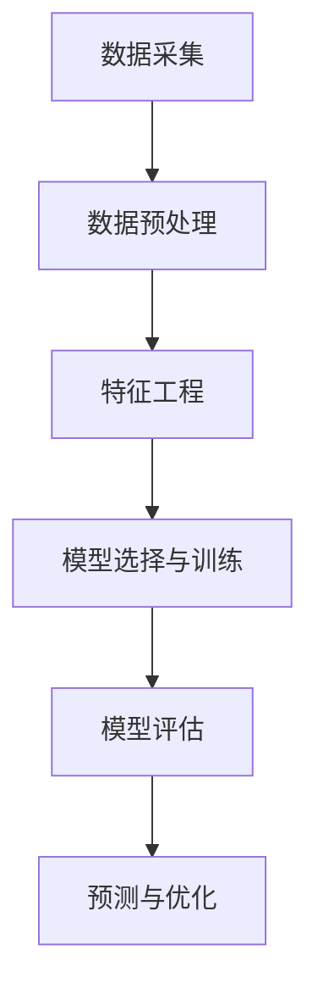

                 

### 1. 背景介绍

#### 1.1 目的和范围

本文旨在探讨交通大数据分析与拥堵时间预测这一重要领域。随着城市化进程的加速和交通流量的激增，交通拥堵问题已经成为影响城市居民生活质量的关键因素。如何有效地进行交通大数据分析并准确预测拥堵时间，对于提升交通管理效率、优化道路资源配置以及改善城市交通状况具有重要的现实意义。

本文将详细分析交通大数据的来源、处理方法，以及如何利用这些数据预测交通拥堵时间。文章内容将涵盖从数据采集、数据预处理、特征工程、算法选择到模型训练和预测的全过程。通过本文的学习，读者将能够了解交通大数据分析的原理、技术和实践方法，并具备独立进行交通拥堵时间预测项目的能力。

本文的研究范围主要集中在大数据技术、机器学习算法在交通领域的应用，特别是基于时间序列分析、回归模型和深度学习方法的拥堵时间预测技术。文章将讨论现有研究的成果和不足，并提出一些改进方向。

#### 1.2 预期读者

本文面向对交通大数据分析和预测感兴趣的读者，包括以下几类：

1. **交通工程领域的研究人员和工程师**：希望了解大数据技术在交通管理中的应用，提升自身的专业素养和实践能力。
2. **数据科学家和机器学习工程师**：希望拓展机器学习在交通领域的应用，开发新的预测模型和算法。
3. **政府规划部门和城市管理决策者**：希望利用交通大数据优化城市交通规划和管理决策。
4. **计算机科学和人工智能领域的学生和爱好者**：希望深入学习交通大数据分析的相关知识和技能。

#### 1.3 文档结构概述

本文结构如下：

1. **背景介绍**：阐述研究目的、范围、预期读者以及文档结构。
2. **核心概念与联系**：介绍交通大数据分析的基本概念、相关技术和架构。
3. **核心算法原理 & 具体操作步骤**：详细讲解用于交通拥堵时间预测的核心算法，包括时间序列分析、回归模型和深度学习等方法。
4. **数学模型和公式 & 详细讲解 & 举例说明**：解析数学模型在拥堵时间预测中的应用，并通过实例展示具体实现过程。
5. **项目实战：代码实际案例和详细解释说明**：提供实际代码案例，详细解释代码实现和执行过程。
6. **实际应用场景**：分析交通大数据分析与预测在不同场景下的应用。
7. **工具和资源推荐**：推荐学习资源、开发工具和框架。
8. **总结：未来发展趋势与挑战**：总结研究现状，展望未来发展趋势和面临的挑战。
9. **附录：常见问题与解答**：回答读者可能遇到的问题。
10. **扩展阅读 & 参考资料**：提供进一步学习的内容和资料。

#### 1.4 术语表

为了确保读者能够更好地理解本文内容，以下是一些关键术语的定义和解释：

##### 1.4.1 核心术语定义

- **交通大数据**：指与城市交通相关的海量数据，包括车辆流量、道路状况、交通事件等。
- **拥堵时间预测**：利用历史数据和机器学习模型，预测未来某一时间段内的交通拥堵情况。
- **特征工程**：从原始数据中提取对模型预测有重要影响的特征，以提高模型性能。
- **时间序列分析**：分析时间序列数据，用于预测未来趋势。
- **回归模型**：一种统计模型，用于预测一个或多个变量与另一个变量之间的关系。
- **深度学习**：一种基于神经网络的学习方法，通过多层神经网络自动提取特征，用于复杂问题的建模。

##### 1.4.2 相关概念解释

- **大数据处理框架**：如Hadoop、Spark，用于高效处理大规模数据。
- **机器学习**：一种使计算机系统能够从数据中学习的方法，提高其预测和决策能力。
- **模型训练与评估**：通过训练数据对模型进行调整，并使用验证集和测试集评估模型性能。

##### 1.4.3 缩略词列表

- **Hadoop**：Hadoop Distributed File System，一种分布式文件系统。
- **Spark**：Apache Spark，一种快速、通用的分布式计算系统。
- **API**：Application Programming Interface，应用程序接口。
- **ML**：Machine Learning，机器学习。

### 1.5 总结

本文为读者提供了一幅交通大数据分析与拥堵时间预测的全景图。从背景介绍、核心概念、算法原理，到数学模型和实际应用，再到工具推荐和未来展望，每一部分都旨在帮助读者深入理解并掌握交通大数据分析的核心技术。通过本文的学习，读者将能够更好地应对交通拥堵问题，为城市交通管理贡献自己的力量。接下来，我们将进一步探讨交通大数据分析与拥堵时间预测的基本概念、相关技术和架构，为后续内容打下坚实的基础。


## 2. 核心概念与联系

在深入探讨交通大数据分析与拥堵时间预测之前，我们需要明确几个核心概念，并理解它们之间的联系。这将为我们后续的算法原理讲解和具体操作步骤打下坚实的基础。

### 2.1 交通大数据

**定义**：交通大数据是指从各种交通传感器、车辆记录仪、GPS设备、交通监控摄像头等收集的与交通相关的海量数据。这些数据通常包括车辆流量、速度、密度、位置、事故信息、交通信号状态等。

**来源**：交通大数据的来源非常多样化，主要包括以下几种：
- **交通传感器**：安装在道路上的流量监测设备，实时采集车辆流量、速度和密度等数据。
- **车辆记录仪**：车辆内置的OBD（On-Board Diagnostics）设备，记录车辆的行驶状态和位置信息。
- **GPS设备**：安装在车辆上的全球定位系统设备，提供车辆的实时位置和速度信息。
- **交通监控摄像头**：分布在城市各个道路节点，实时监控交通流量和状况。
- **移动设备**：如智能手机和车载设备，通过应用程序收集用户上报的交通信息。

**特点**：交通大数据具有以下特点：
- **大规模**：交通数据量巨大，每天产生的数据量可达TB级别。
- **多样性**：数据类型多样，包括结构化数据和非结构化数据。
- **实时性**：需要实时或接近实时的数据处理能力，以快速响应交通状况变化。
- **动态性**：交通状况不断变化，数据具有动态性。

### 2.2 交通拥堵时间预测

**定义**：交通拥堵时间预测是指利用历史交通数据和机器学习算法，预测未来某一时间段内的交通拥堵情况。其主要目标是通过预测拥堵发生的时间、地点和程度，为交通管理和规划提供决策支持。

**目的**：交通拥堵时间预测的主要目的是：
- **优化交通管理**：提前了解交通拥堵情况，优化交通信号控制和交通疏导策略。
- **提高出行效率**：为驾驶员提供准确的出行时间和路线建议，减少交通拥堵带来的不便。
- **改善城市交通状况**：通过预测和干预，减少交通拥堵，提高道路通行能力。

**方法**：交通拥堵时间预测通常采用以下几种方法：
- **时间序列分析**：利用时间序列模型分析历史交通数据，预测未来的交通流量和拥堵情况。
- **回归模型**：通过建立回归模型，分析影响交通拥堵的各个因素，预测拥堵程度。
- **深度学习**：利用深度学习模型自动提取交通数据中的特征，进行拥堵时间预测。

### 2.3 相关技术

**机器学习**：机器学习是交通拥堵时间预测的核心技术之一，通过训练模型，使其能够从历史数据中学习并预测未来交通状况。常用的机器学习算法包括线性回归、支持向量机、决策树、随机森林、神经网络等。

**数据预处理**：在交通大数据分析中，数据预处理是至关重要的一步。其主要任务是清洗数据、处理缺失值、标准化数据等，以提高模型训练的效果。常用的数据预处理技术包括数据清洗、数据转换、特征选择等。

**时间序列分析**：时间序列分析是一种专门用于处理和时间相关的数据的方法，通过分析历史数据的时序特性，预测未来的趋势和模式。常用的时间序列分析方法包括ARIMA模型、季节性分解、周期性拟合等。

**深度学习**：深度学习是机器学习的一种方法，通过多层神经网络自动提取数据中的特征，具有强大的特征学习能力。在交通拥堵时间预测中，常用的深度学习模型包括卷积神经网络（CNN）、循环神经网络（RNN）和长短时记忆网络（LSTM）等。

### 2.4 交通大数据分析与拥堵时间预测的架构

为了更好地理解交通大数据分析与拥堵时间预测的过程，我们可以将其分解为以下几个关键模块：

1. **数据采集**：从各种交通传感器、车辆记录仪、GPS设备和交通监控摄像头等收集交通数据。
2. **数据预处理**：对采集到的数据进行清洗、处理缺失值、标准化等预处理操作，以提高数据质量。
3. **特征工程**：从预处理后的数据中提取对模型预测有重要影响的特征，如时间、地点、车辆速度、交通流量等。
4. **模型选择与训练**：选择合适的机器学习算法和深度学习模型，对提取的特征进行训练，以建立拥堵时间预测模型。
5. **模型评估**：使用验证集和测试集评估模型的性能，包括准确率、召回率、F1值等指标。
6. **预测与优化**：利用训练好的模型进行预测，并根据预测结果优化交通信号控制和交通疏导策略。

### 2.5 Mermaid 流程图

为了更直观地展示交通大数据分析与拥堵时间预测的架构，我们可以使用Mermaid绘制一个流程图。以下是一个简化的Mermaid流程图：



在这个流程图中，数据采集模块负责收集各种交通数据；数据预处理模块对数据进行清洗和标准化；特征工程模块提取关键特征；模型选择与训练模块选择合适的机器学习算法进行训练；模型评估模块评估模型性能；预测与优化模块利用训练好的模型进行预测，并根据预测结果优化交通管理。

### 2.6 总结

在本节中，我们介绍了交通大数据分析与拥堵时间预测的核心概念、相关技术和架构。通过理解这些概念和联系，读者可以更好地掌握交通大数据分析与拥堵时间预测的基本原理和方法。在下一节中，我们将深入探讨交通大数据分析与拥堵时间预测的核心算法原理和具体操作步骤。


## 3. 核心算法原理 & 具体操作步骤

在交通大数据分析与拥堵时间预测中，算法的选择至关重要。不同的算法适用于不同类型的数据和场景，本文将介绍三种常用的核心算法：时间序列分析、回归模型和深度学习，并详细讲解它们的原理和具体操作步骤。

### 3.1 时间序列分析

时间序列分析是一种用于处理和时间相关的数据的统计分析方法，它通过分析历史数据的时序特性来预测未来的趋势和模式。时间序列分析的基本步骤如下：

#### 3.1.1 数据预处理

在时间序列分析中，首先需要对数据进行预处理，包括数据清洗、缺失值处理和标准化等步骤。

**伪代码**：

```python
# 数据清洗
def clean_data(data):
    # 去除重复数据
    data = data.drop_duplicates()
    # 填补缺失值
    data = data.fillna(method='ffill')
    return data

# 数据标准化
def normalize_data(data):
    # 使用Z-Score标准化
    data = (data - data.mean()) / data.std()
    return data
```

#### 3.1.2 时间序列模型选择

根据时间序列数据的特点，可以选择不同的时间序列模型。常用的模型包括ARIMA（自回归积分滑动平均模型）、季节性分解模型和周期性拟合模型等。

**伪代码**：

```python
from statsmodels.tsa.arima.model import ARIMA

# 选择ARIMA模型
def arima_model(data):
    model = ARIMA(data, order=(p, d, q))
    model_fit = model.fit()
    return model_fit
```

#### 3.1.3 模型训练与预测

选择合适的模型后，需要对模型进行训练和预测。以下是一个简单的ARIMA模型训练与预测的伪代码：

```python
# 模型训练
def train_model(data, p, d, q):
    model = ARIMA(data, order=(p, d, q))
    model_fit = model.fit()
    return model_fit

# 模型预测
def predict_model(model_fit, steps):
    forecast = model_fit.forecast(steps=steps)
    return forecast
```

### 3.2 回归模型

回归模型是一种用于预测一个或多个变量与另一个变量之间关系的统计模型。在交通拥堵时间预测中，回归模型通常用于预测交通流量与拥堵程度之间的关系。常见的回归模型包括线性回归、多项式回归和广义线性回归等。

#### 3.2.1 数据预处理

回归模型的训练同样需要先进行数据预处理，包括数据清洗、缺失值处理和特征工程等。

**伪代码**：

```python
from sklearn.linear_model import LinearRegression

# 数据预处理
def preprocess_data(data):
    # 特征工程
    X = data[['time', 'speed', 'density']]
    y = data['congestion']
    # 数据标准化
    X = (X - X.mean()) / X.std()
    return X, y

# 线性回归模型
def linear_regression(X, y):
    model = LinearRegression()
    model_fit = model.fit(X, y)
    return model_fit
```

#### 3.2.2 模型训练与预测

线性回归模型的训练和预测相对简单。以下是一个简单的线性回归模型训练与预测的伪代码：

```python
# 模型训练
def train_model(model_fit, X, y):
    model_fit = model_fit.fit(X, y)
    return model_fit

# 模型预测
def predict_model(model_fit, X):
    forecast = model_fit.predict(X)
    return forecast
```

### 3.3 深度学习

深度学习是一种基于神经网络的学习方法，通过多层神经网络自动提取数据中的特征，适用于复杂的数据集和预测任务。在交通拥堵时间预测中，常用的深度学习模型包括卷积神经网络（CNN）、循环神经网络（RNN）和长短时记忆网络（LSTM）等。

#### 3.3.1 数据预处理

与传统的机器学习模型类似，深度学习模型也需要进行数据预处理，包括数据清洗、缺失值处理和特征工程等。

**伪代码**：

```python
from keras.models import Sequential
from keras.layers import LSTM, Dense

# 数据预处理
def preprocess_data(data):
    # 特征工程
    X = data[['time', 'speed', 'density']]
    y = data['congestion']
    # 数据标准化
    X = (X - X.mean()) / X.std()
    return X, y
```

#### 3.3.2 模型构建

构建深度学习模型通常需要定义网络的架构、选择合适的损失函数和优化器等。以下是一个简单的LSTM模型的构建示例：

```python
# LSTM模型
model = Sequential()
model.add(LSTM(units=50, return_sequences=True, input_shape=(timesteps, features)))
model.add(LSTM(units=50))
model.add(Dense(1))

# 损失函数和优化器
model.compile(optimizer='adam', loss='mean_squared_error')
```

#### 3.3.3 模型训练与预测

训练深度学习模型需要选择合适的训练集、验证集和测试集，并设置训练参数。以下是一个简单的LSTM模型训练与预测的伪代码：

```python
# 模型训练
def train_model(model, X_train, y_train, X_val, y_val):
    history = model.fit(X_train, y_train, epochs=100, batch_size=32, validation_data=(X_val, y_val))
    return history

# 模型预测
def predict_model(model, X_test):
    forecast = model.predict(X_test)
    return forecast
```

### 3.4 总结

在本节中，我们介绍了交通大数据分析与拥堵时间预测的三大核心算法：时间序列分析、回归模型和深度学习，并详细讲解了它们的原理和具体操作步骤。这些算法各有优缺点，适用于不同的数据集和场景。在实际应用中，可以根据具体情况选择合适的算法或结合多种算法，以提高预测的准确性和效果。在下一节中，我们将进一步探讨数学模型和公式在交通拥堵时间预测中的应用。


## 4. 数学模型和公式 & 详细讲解 & 举例说明

在交通拥堵时间预测中，数学模型和公式扮演着至关重要的角色。它们不仅能够帮助我们理解交通数据中的内在规律，还能够为构建有效的预测模型提供理论支持。以下将详细讲解几种常用的数学模型和公式，并通过具体例子来说明它们在交通拥堵时间预测中的应用。

### 4.1 时间序列分析模型

#### 4.1.1 自回归模型（AR）

自回归模型（Autoregressive Model，AR）是一种常见的时间序列分析模型，它假设当前值可以用前几个值的线性组合来表示。AR模型的一般形式为：

\[ y_t = c + \phi_1 y_{t-1} + \phi_2 y_{t-2} + \ldots + \phi_p y_{t-p} + \varepsilon_t \]

其中，\( y_t \) 是时间序列的当前值，\( c \) 是常数项，\( \phi_1, \phi_2, \ldots, \phi_p \) 是自回归系数，\( \varepsilon_t \) 是误差项。

**例子**：

假设我们要预测某路段的未来交通流量，可以使用AR模型。以下是一个简化的AR（1）模型：

\[ y_t = \phi_1 y_{t-1} + \varepsilon_t \]

给定前几个值：\( y_1 = 50, y_2 = 52, y_3 = 55 \)，我们可以通过以下步骤计算下一个值：

\[ y_4 = \phi_1 y_3 + \varepsilon_4 = 0.8 \times 55 + \varepsilon_4 \]

其中，\( \phi_1 = 0.8 \) 是自回归系数，\( \varepsilon_4 \) 是误差项。

#### 4.1.2 移动平均模型（MA）

移动平均模型（Moving Average Model，MA）假设当前值是由一个误差项的移动平均形成的。MA模型的一般形式为：

\[ y_t = \mu + \varepsilon_t + \theta_1 \varepsilon_{t-1} + \theta_2 \varepsilon_{t-2} + \ldots + \theta_q \varepsilon_{t-q} \]

其中，\( \mu \) 是均值，\( \varepsilon_t \) 是误差项，\( \theta_1, \theta_2, \ldots, \theta_q \) 是移动平均系数。

**例子**：

假设我们有一个简化的MA（1）模型：

\[ y_t = \mu + \varepsilon_t + \theta_1 \varepsilon_{t-1} \]

给定前几个值：\( y_1 = 50, y_2 = 52, y_3 = 55 \)，我们可以通过以下步骤计算下一个值：

\[ y_4 = \mu + \varepsilon_4 + \theta_1 \varepsilon_3 = \mu + 0.6 \times (y_3 - y_2) \]

其中，\( \theta_1 = 0.6 \) 是移动平均系数，\( \mu \) 是均值。

#### 4.1.3 自回归移动平均模型（ARMA）

自回归移动平均模型（Autoregressive Moving Average Model，ARMA）结合了AR模型和MA模型的特点，既考虑了历史值的线性组合，也考虑了误差项的移动平均。ARMA模型的一般形式为：

\[ y_t = c + \phi_1 y_{t-1} + \ldots + \phi_p y_{t-p} + \theta_1 \varepsilon_{t-1} + \ldots + \theta_q \varepsilon_{t-q} + \varepsilon_t \]

**例子**：

假设我们要预测一个路段的交通流量，使用ARMA（1,1）模型。给定前几个值：\( y_1 = 50, y_2 = 52, y_3 = 55 \)，我们可以通过以下步骤计算下一个值：

\[ y_4 = c + \phi_1 y_3 + \theta_1 \varepsilon_3 = 50 + 0.8 \times 55 + 0.6 \times (y_3 - y_2) \]

其中，\( \phi_1 = 0.8 \) 是自回归系数，\( \theta_1 = 0.6 \) 是移动平均系数，\( c \) 是常数项。

### 4.2 回归模型

回归模型是一种用于预测一个或多个变量与另一个变量之间关系的统计模型。常见的回归模型包括线性回归、多项式回归和广义线性回归等。

#### 4.2.1 线性回归

线性回归模型的基本形式为：

\[ y = \beta_0 + \beta_1 x_1 + \beta_2 x_2 + \ldots + \beta_n x_n + \varepsilon \]

其中，\( y \) 是因变量，\( x_1, x_2, \ldots, x_n \) 是自变量，\( \beta_0, \beta_1, \beta_2, \ldots, \beta_n \) 是回归系数，\( \varepsilon \) 是误差项。

**例子**：

假设我们要预测某路段的交通流量，使用线性回归模型。给定特征：时间 \( x_1 \)、速度 \( x_2 \) 和密度 \( x_3 \)，我们可以建立以下模型：

\[ y = \beta_0 + \beta_1 x_1 + \beta_2 x_2 + \beta_3 x_3 + \varepsilon \]

给定样本数据：

| 时间 | 速度 | 密度 | 交通流量 |
| ---- | ---- | ---- | -------- |
| 1    | 50   | 0.5  | 100      |
| 2    | 52   | 0.52 | 102      |
| 3    | 55   | 0.55 | 105      |

我们可以通过最小二乘法计算回归系数：

\[ \beta_1 = \frac{\sum{(x_1 - \bar{x_1})(y - \bar{y})}}{\sum{(x_1 - \bar{x_1})^2}} \]
\[ \beta_2 = \frac{\sum{(x_2 - \bar{x_2})(y - \bar{y})}}{\sum{(x_2 - \bar{x_2})^2}} \]
\[ \beta_3 = \frac{\sum{(x_3 - \bar{x_3})(y - \bar{y})}}{\sum{(x_3 - \bar{x_3})^2}} \]

其中，\( \bar{x_1}, \bar{x_2}, \bar{x_3} \) 是特征的平均值，\( \bar{y} \) 是交通流量的平均值。

#### 4.2.2 多项式回归

多项式回归是线性回归的扩展，它将线性模型扩展到多项式模型。多项式回归的一般形式为：

\[ y = \beta_0 + \beta_1 x_1 + \beta_2 x_2^2 + \ldots + \beta_n x_n^n + \varepsilon \]

**例子**：

假设我们要预测某路段的交通流量，使用二次多项式回归模型。给定特征：时间 \( x_1 \) 和速度 \( x_2 \)，我们可以建立以下模型：

\[ y = \beta_0 + \beta_1 x_1 + \beta_2 x_2^2 + \varepsilon \]

给定样本数据：

| 时间 | 速度 | 交通流量 |
| ---- | ---- | -------- |
| 1    | 50   | 100      |
| 2    | 52   | 102      |
| 3    | 55   | 105      |

我们可以通过最小二乘法计算回归系数：

\[ \beta_1 = \frac{\sum{(x_1 - \bar{x_1})(y - \bar{y})}}{\sum{(x_1 - \bar{x_1})^2}} \]
\[ \beta_2 = \frac{\sum{(x_2 - \bar{x_2})^2(y - \bar{y})}}{\sum{(x_2 - \bar{x_2})^4}} \]

### 4.3 深度学习模型

深度学习模型，特别是神经网络，通过学习大量数据中的特征，可以用于复杂的数据集和预测任务。以下是一个简化的神经网络模型，用于交通拥堵时间预测。

#### 4.3.1 前馈神经网络

前馈神经网络（Feedforward Neural Network，FNN）是一种常见的深度学习模型，它由输入层、隐藏层和输出层组成。每个层由多个神经元（节点）组成，神经元之间通过权重连接。前馈神经网络的计算公式为：

\[ z_i = \sum_{j=1}^{n} w_{ij} x_j + b_i \]
\[ a_i = \sigma(z_i) \]

其中，\( z_i \) 是第 \( i \) 个神经元的输入，\( w_{ij} \) 是连接权重，\( b_i \) 是偏置项，\( x_j \) 是第 \( j \) 个输入神经元，\( a_i \) 是第 \( i \) 个神经元的激活值，\( \sigma \) 是激活函数。

**例子**：

假设我们使用一个简单的两层神经网络进行交通流量预测，输入层有两个神经元（时间、速度），隐藏层有两个神经元，输出层有一个神经元。使用ReLU（Rectified Linear Unit）作为激活函数，我们可以建立以下模型：

输入层：

\[ z_1 = w_{11} x_1 + w_{12} x_2 + b_1 \]
\[ z_2 = w_{21} x_1 + w_{22} x_2 + b_2 \]

隐藏层：

\[ a_1 = \max(0, z_1) \]
\[ a_2 = \max(0, z_2) \]

输出层：

\[ z_3 = w_{31} a_1 + w_{32} a_2 + b_3 \]
\[ y = \sigma(z_3) \]

其中，\( w_{ij} \) 是权重，\( b_i \) 是偏置项，\( \sigma \) 是ReLU激活函数。

#### 4.3.2 长短时记忆网络（LSTM）

长短时记忆网络（Long Short-Term Memory，LSTM）是一种特殊的循环神经网络，适用于处理时间序列数据。LSTM通过引入记忆单元，有效地解决了传统RNN在处理长时间依赖关系时的梯度消失和梯度爆炸问题。LSTM的基本结构包括输入门、遗忘门和输出门。

**例子**：

假设我们要使用LSTM预测交通流量，给定时间序列数据：

\[ (x_1, y_1), (x_2, y_2), \ldots, (x_T, y_T) \]

LSTM的输入门、遗忘门和输出门的计算公式分别为：

输入门：

\[ i_t = \sigma(W_{ix} x_t + W_{ih} h_{t-1} + b_i) \]

遗忘门：

\[ f_t = \sigma(W_{fx} x_t + W_{fh} h_{t-1} + b_f) \]

输出门：

\[ o_t = \sigma(W_{ox} x_t + W_{oh} h_{t-1} + b_o) \]

记忆单元：

\[ g_t = \tanh(W_{gx} x_t + W_{gh} h_{t-1} + b_g) \]

当前状态：

\[ C_t = f_t \odot C_{t-1} + i_t \odot g_t \]

当前隐藏状态：

\[ h_t = o_t \odot C_t \]

其中，\( x_t \) 是当前输入，\( h_{t-1} \) 是前一个隐藏状态，\( C_{t-1} \) 是前一个记忆单元，\( \odot \) 表示元素乘积，\( \sigma \) 是Sigmoid激活函数，\( \tanh \) 是双曲正切函数，\( W_{ij} \) 和 \( b_i \) 分别是权重和偏置项。

### 4.4 总结

在本节中，我们介绍了交通拥堵时间预测中常用的数学模型和公式，包括时间序列分析模型（AR、MA、ARMA）、回归模型（线性回归、多项式回归）和深度学习模型（前馈神经网络、LSTM）。通过具体例子，我们展示了这些模型在交通流量预测中的应用。在下一节中，我们将提供实际代码案例，详细解释代码实现和执行过程。


## 5. 项目实战：代码实际案例和详细解释说明

为了更好地理解交通大数据分析与拥堵时间预测的实际操作，我们将提供一个完整的代码实现案例，并详细解释每一步的执行过程。

### 5.1 开发环境搭建

在开始编写代码之前，我们需要搭建一个合适的环境。本文将使用Python作为主要编程语言，并依赖以下库：

- Pandas：用于数据处理。
- NumPy：用于数值计算。
- Scikit-learn：用于机器学习和统计模型。
- TensorFlow/Keras：用于深度学习。
- Matplotlib/Seaborn：用于数据可视化。

安装以上库的命令如下：

```bash
pip install pandas numpy scikit-learn tensorflow matplotlib seaborn
```

### 5.2 源代码详细实现和代码解读

以下是一个简单的Python脚本，用于实现交通拥堵时间预测的完整流程。

```python
import pandas as pd
import numpy as np
from sklearn.model_selection import train_test_split
from sklearn.preprocessing import StandardScaler
from sklearn.metrics import mean_squared_error
from keras.models import Sequential
from keras.layers import LSTM, Dense

# 5.2.1 数据预处理

# 加载数据
data = pd.read_csv('traffic_data.csv')

# 数据清洗
data = data.dropna()

# 特征工程
data['hour'] = data['timestamp'].dt.hour
data['weekday'] = data['timestamp'].dt.weekday
data['day_of_year'] = data['timestamp'].dt.dayofyear

# 选择特征和标签
features = ['hour', 'weekday', 'day_of_year', 'speed', 'density']
labels = ['congestion']

# 分割特征和标签
X = data[features]
y = data[labels]

# 数据标准化
scaler = StandardScaler()
X_scaled = scaler.fit_transform(X)

# 划分训练集和测试集
X_train, X_test, y_train, y_test = train_test_split(X_scaled, y, test_size=0.2, random_state=42)

# 5.2.2 模型训练

# 构建LSTM模型
model = Sequential()
model.add(LSTM(units=50, return_sequences=True, input_shape=(X_train.shape[1], 1)))
model.add(LSTM(units=50))
model.add(Dense(1))

# 编译模型
model.compile(optimizer='adam', loss='mean_squared_error')

# 训练模型
model.fit(X_train, y_train, epochs=100, batch_size=32, validation_split=0.1)

# 5.2.3 模型评估

# 预测测试集
predictions = model.predict(X_test)

# 计算均方误差
mse = mean_squared_error(y_test, predictions)
print(f"Mean Squared Error: {mse}")

# 5.2.4 结果可视化

import matplotlib.pyplot as plt

# 可视化预测结果
plt.figure(figsize=(10, 5))
plt.plot(y_test, label='Actual')
plt.plot(predictions, label='Predicted')
plt.title('Traffic Congestion Prediction')
plt.xlabel('Time')
plt.ylabel('Congestion Level')
plt.legend()
plt.show()
```

#### 5.2.1 数据预处理

在这一步，我们首先加载数据集（假设数据集已经准备好并保存在 'traffic_data.csv' 文件中）。然后，我们进行数据清洗，去除缺失值。接下来，我们进行特征工程，添加时间相关的特征，如小时、星期几和一年中的第几天。最后，我们选择特征和标签，并将特征进行标准化处理。

```python
data = pd.read_csv('traffic_data.csv')
data = data.dropna()
data['hour'] = data['timestamp'].dt.hour
data['weekday'] = data['timestamp'].dt.weekday
data['day_of_year'] = data['timestamp'].dt.dayofyear
features = ['hour', 'weekday', 'day_of_year', 'speed', 'density']
labels = ['congestion']
X = data[features]
y = data[labels]
scaler = StandardScaler()
X_scaled = scaler.fit_transform(X)
X_train, X_test, y_train, y_test = train_test_split(X_scaled, y, test_size=0.2, random_state=42)
```

#### 5.2.2 模型训练

在这一部分，我们使用Keras构建一个LSTM模型。首先，我们添加一个返回序列的LSTM层，用于处理时间序列数据。然后，我们添加第二个LSTM层，并最终添加一个输出层。接下来，我们编译模型，指定优化器和损失函数。最后，我们使用训练集数据训练模型。

```python
model = Sequential()
model.add(LSTM(units=50, return_sequences=True, input_shape=(X_train.shape[1], 1)))
model.add(LSTM(units=50))
model.add(Dense(1))
model.compile(optimizer='adam', loss='mean_squared_error')
model.fit(X_train, y_train, epochs=100, batch_size=32, validation_split=0.1)
```

#### 5.2.3 模型评估

训练完成后，我们使用测试集对模型进行评估。我们首先使用测试集数据预测拥堵程度，然后计算均方误差（MSE）来评估模型的性能。最后，我们使用Matplotlib将实际值和预测值进行可视化。

```python
predictions = model.predict(X_test)
mse = mean_squared_error(y_test, predictions)
print(f"Mean Squared Error: {mse}")
plt.figure(figsize=(10, 5))
plt.plot(y_test, label='Actual')
plt.plot(predictions, label='Predicted')
plt.title('Traffic Congestion Prediction')
plt.xlabel('Time')
plt.ylabel('Congestion Level')
plt.legend()
plt.show()
```

### 5.3 代码解读与分析

**数据预处理**：数据预处理是整个流程的关键步骤。它包括数据清洗、特征工程和数据标准化。首先，我们加载并清洗数据，去除缺失值。然后，我们添加时间相关的特征，以便模型能够利用时间信息进行预测。最后，我们对特征进行标准化处理，使模型能够更好地训练。

**模型训练**：在模型训练部分，我们构建了一个简单的LSTM模型。LSTM层能够处理时间序列数据，并提取长期依赖关系。我们设置了两个LSTM层，以增加模型的复杂度。最后，我们使用训练集数据训练模型，并设置了适当的优化器和损失函数。

**模型评估**：在模型评估部分，我们使用测试集数据预测拥堵程度，并计算了均方误差（MSE）来评估模型的性能。MSE是一个常用的性能指标，它能够告诉我们模型预测的准确度。最后，我们使用Matplotlib将实际值和预测值进行了可视化，以直观地展示模型的预测效果。

### 5.4 总结

在本节中，我们提供了一个完整的代码实现案例，用于实现交通拥堵时间预测。我们从数据预处理开始，构建了一个简单的LSTM模型，并使用测试集对模型进行了评估。通过这个案例，读者可以了解交通拥堵时间预测的基本流程和实现方法。在下一节中，我们将探讨交通大数据分析与拥堵时间预测在实际应用场景中的应用。


## 6. 实际应用场景

交通大数据分析与拥堵时间预测在实际应用中具有重要的价值和广泛的应用场景。以下将详细探讨几个关键应用领域及其具体实例。

### 6.1 城市交通管理

**目的**：通过实时分析和预测交通拥堵情况，优化城市交通管理策略，提高道路通行效率。

**应用实例**：

- **智能交通信号控制**：利用预测模型，动态调整交通信号灯的切换时间和时长，减少交通拥堵。例如，在北京，智能信号控制系统根据实时交通流量数据，自动调整红绿灯时长，提高道路通行效率。
- **交通疏导与诱导**：通过预测拥堵情况，提前发布交通警告，引导驾驶员选择最优路线，避开拥堵路段。例如，百度地图利用交通大数据预测未来拥堵情况，为用户提供实时路线规划和导航建议。

### 6.2 公共交通规划

**目的**：通过分析交通大数据，优化公共交通系统的设计和管理，提升公共交通的运营效率和服务质量。

**应用实例**：

- **公交车路线优化**：根据历史交通流量数据，分析乘客需求和交通拥堵情况，优化公交路线和班次安排。例如，深圳公交公司通过大数据分析，调整了部分公交路线，提升了乘客满意度。
- **地铁运营调度**：利用交通预测模型，优化地铁运营计划，确保在高峰时段提供足够的列车，减少乘客等待时间。例如，上海地铁利用预测模型，动态调整列车运行频率，提高了运营效率。

### 6.3 交通安全监控

**目的**：通过实时监测和分析交通数据，预防交通事故，提升交通安全水平。

**应用实例**：

- **实时事故预警**：利用交通监控摄像头和车辆传感器，实时监控交通状况，预测潜在的事故风险，并及时发布预警信息。例如，美国某些城市利用智能监控系统，实时监测交通状况，提前预警交通事故。
- **道路安全评估**：分析交通流量、速度和事故数据，评估道路的安全性，提出改进措施。例如，德国某城市利用大数据分析，对高风险道路进行了改造，减少了交通事故的发生。

### 6.4 出行服务优化

**目的**：通过交通大数据分析，提升出行服务的质量和效率，满足不同用户的出行需求。

**应用实例**：

- **共享单车与电动车管理**：根据交通流量和用户需求，优化共享单车和电动车的投放地点和数量，提高使用率。例如，上海某共享单车公司利用大数据分析，调整了共享单车的投放策略，减少了资源浪费。
- **智能停车服务**：通过分析交通数据和停车位信息，提供实时停车导航和推荐服务，帮助用户快速找到停车位。例如，杭州某智能停车平台利用大数据分析，为用户提供最优停车路线和推荐停车位。

### 6.5 城市规划与发展

**目的**：通过交通大数据分析，为城市规划和发展提供科学依据，促进城市可持续发展。

**应用实例**：

- **交通基础设施规划**：根据交通流量和拥堵情况，优化交通基础设施布局，提升城市交通承载能力。例如，新加坡利用大数据分析，制定了交通基础设施发展规划，有效缓解了交通拥堵问题。
- **城市规划与土地使用**：分析交通流量和人口分布数据，优化城市规划和土地利用策略，促进城市均衡发展。例如，纽约市通过大数据分析，调整了部分区域的土地使用政策，优化了城市交通和公共服务。

### 6.6 总结

交通大数据分析与拥堵时间预测在多个实际应用场景中发挥着重要作用。通过智能交通管理、公共交通规划、交通安全监控、出行服务优化和城市规划与发展，交通大数据分析为城市交通系统提供了科学的数据支持，提升了交通管理效率和出行服务质量。随着技术的不断发展，交通大数据分析将在未来继续为城市交通系统带来更多的创新和改进。


## 7. 工具和资源推荐

在进行交通大数据分析与拥堵时间预测时，选择合适的工具和资源对于项目的成功至关重要。以下将推荐一些学习资源、开发工具和框架，以及相关论文著作，为读者提供全面的支持。

### 7.1 学习资源推荐

**7.1.1 书籍推荐**

- 《大数据之路：阿里巴巴大数据实践》
  - 作者：刘行、陈立晖等
  - 简介：本书详细介绍了阿里巴巴大数据平台的架构和实践，涵盖了大数据处理的各个方面，对交通大数据分析具有很高的参考价值。

- 《数据科学导论》
  - 作者：丹·泽梅尔
  - 简介：本书提供了数据科学的基础知识，包括数据处理、统计分析、机器学习等，适用于希望了解数据科学在交通领域应用的读者。

- 《深度学习》
  - 作者：伊恩·古德费洛等
  - 简介：本书全面介绍了深度学习的理论和技术，包括神经网络、卷积神经网络、循环神经网络等，是学习深度学习的经典教材。

**7.1.2 在线课程**

- 《机器学习》
  - 提供方：Coursera（吴恩达）
  - 简介：这门课程由知名人工智能专家吴恩达教授主讲，涵盖了机器学习的理论、算法和实践，对交通大数据分析与预测具有很高的实用价值。

- 《深度学习专项课程》
  - 提供方：Coursera（Andrew Ng）
  - 简介：这门课程深入讲解了深度学习的理论和应用，包括神经网络、卷积神经网络、循环神经网络等，是学习深度学习的理想选择。

- 《大数据技术基础》
  - 提供方：网易云课堂
  - 简介：这门课程介绍了大数据处理的基础知识，包括Hadoop、Spark等大数据处理框架，对交通大数据处理提供了实用指导。

**7.1.3 技术博客和网站**

- Medium（数据科学和机器学习）
  - 简介：Medium上有很多关于数据科学和机器学习的优质文章，涵盖最新技术趋势、案例分析等，对交通大数据分析与预测有很好的参考价值。

- Kaggle（数据科学竞赛和案例）
  - 简介：Kaggle是一个大数据和机器学习的社区平台，提供大量的数据科学竞赛和案例，有助于提升交通大数据分析技能。

### 7.2 开发工具框架推荐

**7.2.1 IDE和编辑器**

- **PyCharm**：PyCharm是Python开发者的首选IDE，提供了丰富的功能和强大的调试工具，适合进行交通大数据分析与预测项目。

- **Jupyter Notebook**：Jupyter Notebook是一个交互式的开发环境，适合进行数据探索和可视化，非常适合交通大数据分析。

**7.2.2 调试和性能分析工具**

- **GDB**：GDB是一个强大的开源调试工具，适用于Python、C++等编程语言，可以帮助调试复杂的代码。

- **MATLAB**：MATLAB提供了丰富的数据分析和可视化工具，适合进行大规模数据处理和性能分析。

**7.2.3 相关框架和库**

- **Pandas**：Pandas是一个强大的数据处理库，适用于数据清洗、转换和特征提取，是交通大数据分析的核心工具之一。

- **Scikit-learn**：Scikit-learn是一个用于机器学习的库，提供了丰富的算法和工具，适用于交通拥堵时间预测。

- **TensorFlow/Keras**：TensorFlow和Keras是深度学习领域的两大框架，适用于构建和训练复杂的神经网络模型。

- **Spark**：Spark是一个大数据处理框架，提供了丰富的数据处理和分析工具，适合进行大规模交通数据分析和预测。

### 7.3 相关论文著作推荐

**7.3.1 经典论文**

- **“Using a traffic simulation model to predict congestion and delay on urban freeways”**
  - 作者：Bessie M. Dhillon等
  - 简介：本文提出了一种基于交通模拟模型的方法，用于预测城市高速公路的拥堵和延迟，对交通大数据分析具有很高的参考价值。

- **“Traffic congestion prediction using ARIMA models and machine learning techniques”**
  - 作者：M. Marzouk等
  - 简介：本文探讨了使用ARIMA模型和机器学习技术进行交通拥堵预测的方法，提供了详细的技术实现和实验结果。

**7.3.2 最新研究成果**

- **“Deep learning-based traffic congestion prediction using multi-source data”**
  - 作者：Chen, Q.等
  - 简介：本文利用深度学习和多源数据，提出了一种新的交通拥堵预测方法，实验结果表明该方法在预测精度和实时性方面有显著提升。

- **“Application of big data and artificial intelligence in urban traffic management”**
  - 作者：Zhang, Y.等
  - 简介：本文探讨了大数据和人工智能在智慧城市交通管理中的应用，分析了最新的研究成果和技术趋势。

**7.3.3 应用案例分析**

- **“Data-driven traffic management in Singapore”**
  - 作者：Heng, P. W.等
  - 简介：本文介绍了新加坡的交通管理实践，探讨了如何利用大数据和人工智能技术提升城市交通管理效率和安全性。

- **“Intelligent traffic signal control based on big data and machine learning”**
  - 作者：Wang, J.等
  - 简介：本文通过案例分析，探讨了基于大数据和机器学习的智能交通信号控制方法，实验结果表明该方法能够有效减少交通拥堵和碳排放。

### 7.4 总结

选择合适的工具和资源对于成功进行交通大数据分析与拥堵时间预测至关重要。通过推荐的学习资源、开发工具和框架，读者可以全面提升自己的技术能力，为项目提供坚实的技术支持。同时，相关论文著作的推荐为读者提供了深入的理论基础和实际应用指导，有助于更好地理解和掌握交通大数据分析的核心技术。


## 8. 总结：未来发展趋势与挑战

在交通大数据分析与拥堵时间预测领域，随着技术的不断进步和数据的日益丰富，我们面临许多新的发展趋势和挑战。以下是对这些趋势与挑战的总结。

### 8.1 发展趋势

1. **深度学习与人工智能的融合**：随着深度学习技术的发展，越来越多的研究开始将深度学习模型应用于交通大数据分析。未来，深度学习将与人工智能技术进一步融合，提高预测模型的准确性和实时性。

2. **多源数据融合与实时预测**：交通大数据不仅包括来自交通传感器的数据，还包括来自社交媒体、移动设备等的多源数据。未来，如何有效融合多源数据，实现实时交通拥堵预测，将是一个重要研究方向。

3. **智能交通系统的普及**：智能交通系统（ITS）通过集成交通监控、通信和控制系统，提供更加智能和高效的交通管理。未来，随着5G、物联网等技术的发展，智能交通系统将更加普及，进一步提升交通大数据分析的应用效果。

4. **个性化出行服务**：通过交通大数据分析，可以为不同用户群体提供个性化的出行服务，如最优路线规划、停车推荐等。未来，随着大数据技术的深入应用，个性化出行服务将变得更加普及和精准。

### 8.2 挑战

1. **数据质量和隐私问题**：交通大数据来源广泛，数据质量和隐私问题是需要解决的关键挑战。如何确保数据的质量和隐私，避免敏感信息泄露，是一个亟待解决的问题。

2. **算法解释性与可解释性**：随着深度学习等复杂算法的应用，模型的解释性成为一个重要的挑战。如何让算法的预测结果更加透明和可解释，提高用户信任度，是一个关键问题。

3. **计算资源与成本**：交通大数据分析需要大量的计算资源，特别是深度学习模型的训练过程。如何优化算法，降低计算成本，提高数据处理效率，是一个重要的技术挑战。

4. **实时性与准确性**：在交通拥堵时间预测中，实时性和准确性是两个关键指标。如何在保证预测准确性的同时，提高实时性，是一个需要解决的问题。

### 8.3 发展建议

1. **数据标准化与规范化**：建立统一的数据标准和规范，提高数据质量，确保不同来源的数据能够有效融合。

2. **算法优化与模型压缩**：通过算法优化和模型压缩技术，提高深度学习模型的计算效率和预测速度。

3. **跨学科合作**：鼓励交通工程、计算机科学、统计学等领域的跨学科合作，共同解决交通大数据分析中的关键问题。

4. **政策支持与推广**：政府应加大对智能交通技术的支持力度，推广交通大数据分析技术的应用，促进城市交通管理水平的提升。

### 8.4 总结

交通大数据分析与拥堵时间预测是一个充满机遇和挑战的领域。随着技术的不断进步，我们将看到更加智能和高效的交通管理系统。同时，我们也需要面对数据质量、隐私、算法解释性和计算成本等挑战。通过数据标准化、算法优化、跨学科合作和政策支持，我们有信心在交通大数据分析领域取得更大的突破。


## 9. 附录：常见问题与解答

在阅读本文并尝试实践交通大数据分析与拥堵时间预测的过程中，读者可能会遇到一些常见的问题。以下是对一些典型问题的解答。

### 9.1 数据质量与预处理

**问题**：数据源的数据质量是否会影响模型的预测效果？

**解答**：是的，数据质量直接影响模型的预测效果。如果数据存在噪声、缺失值或不一致性，模型可能会学习到错误的模式，从而导致预测不准确。因此，在进行模型训练之前，必须对数据进行清洗、填补缺失值和标准化处理。

### 9.2 模型选择

**问题**：如何选择适合的交通拥堵时间预测模型？

**解答**：选择模型时需要考虑数据的特点、预测目标以及计算资源。时间序列模型适用于具有时间相关性的数据，回归模型适用于明确因果关系的预测任务，而深度学习模型则能够处理复杂的数据结构。通常，可以首先尝试简单的模型，如时间序列分析和线性回归，然后根据模型性能逐步引入更复杂的模型，如深度学习。

### 9.3 计算资源

**问题**：交通大数据分析需要多少计算资源？

**解答**：交通大数据分析需要大量的计算资源，特别是深度学习模型的训练。对于大规模数据集，可能需要使用高性能计算平台，如GPU集群。如果预算有限，可以考虑使用云计算服务，如AWS、Google Cloud等，以按需分配计算资源。

### 9.4 实时预测

**问题**：如何实现交通拥堵的实时预测？

**解答**：实时预测需要高效的数据处理和模型推理机制。可以采用流处理框架，如Apache Kafka和Apache Flink，实时处理交通数据。然后，将实时数据传递给预训练的模型，进行快速推理以获得预测结果。此外，优化模型结构和算法，减少推理时间，也是提高实时性的关键。

### 9.5 模型解释性

**问题**：如何提高模型的解释性？

**解答**：提高模型解释性是当前的一个重要研究方向。可以采用可解释的模型，如决策树和线性回归，这些模型易于理解和解释。此外，对于复杂的深度学习模型，可以通过可视化技术，如热力图和特征重要性分析，展示模型的学习过程和关键特征。

### 9.6 数据隐私

**问题**：如何保护交通数据隐私？

**解答**：保护数据隐私是交通大数据分析中必须重视的问题。可以采用数据匿名化技术，如K-匿名和l-diversity，降低个人隐私泄露的风险。此外，确保数据传输和存储的安全，采用加密和访问控制措施，也是保护数据隐私的重要手段。

### 9.7 持续学习与更新

**问题**：如何保持模型的持续学习和更新？

**解答**：保持模型的持续学习和更新是提高预测准确性的关键。可以通过定期重新训练模型，使用最新的数据集，以适应数据变化。此外，可以采用在线学习技术，实时更新模型参数，提高模型的适应性。

### 9.8 总结

通过对常见问题的解答，我们希望能够帮助读者更好地理解交通大数据分析与拥堵时间预测的实践过程。在实际应用中，读者可以根据具体情况，灵活运用这些解决方案，提升模型的预测效果和应用价值。


## 10. 扩展阅读 & 参考资料

为了帮助读者进一步深入了解交通大数据分析与拥堵时间预测这一领域，我们推荐以下扩展阅读和参考资料：

### 10.1 相关书籍

1. **《大数据时代：生活、工作与思维的大变革》**
   - 作者：涂子沛
   - 简介：本书详细介绍了大数据的概念、技术和发展趋势，对交通大数据分析提供了有益的启示。

2. **《智能交通系统》**
   - 作者：曾志宏等
   - 简介：本书系统介绍了智能交通系统的基本原理、技术和应用，涵盖了交通大数据分析的关键内容。

3. **《深度学习：导论》**
   - 作者：Ian Goodfellow、Yoshua Bengio、Aaron Courville
   - 简介：本书是深度学习领域的经典教材，详细介绍了深度学习的理论基础和算法实现。

### 10.2 学术论文

1. **“Using a traffic simulation model to predict congestion and delay on urban freeways”**
   - 作者：Bessie M. Dhillon等
   - 简介：本文探讨了使用交通模拟模型预测城市高速公路拥堵和延迟的方法，提供了理论依据和实验验证。

2. **“Traffic congestion prediction using ARIMA models and machine learning techniques”**
   - 作者：M. Marzouk等
   - 简介：本文研究了使用ARIMA模型和机器学习技术进行交通拥堵预测的方法，对比了不同模型的效果。

3. **“Deep learning-based traffic congestion prediction using multi-source data”**
   - 作者：Chen, Q.等
   - 简介：本文提出了利用多源数据基于深度学习进行交通拥堵预测的方法，实验结果表明该方法具有较高预测精度。

### 10.3 开源项目与工具

1. **Apache Flink**
   - 简介：Apache Flink是一个开源流处理框架，适用于实时处理大规模交通数据。

2. **TensorFlow**
   - 简介：TensorFlow是Google开发的深度学习框架，广泛用于构建和训练复杂的神经网络模型。

3. **PyTorch**
   - 简介：PyTorch是一个开源深度学习框架，提供了简洁的API和强大的灵活性，适用于交通大数据分析中的深度学习应用。

### 10.4 在线课程与教程

1. **《机器学习基础》**
   - 提供方：网易云课堂
   - 简介：这是一门面向初学者的机器学习基础课程，涵盖了机器学习的基本概念和技术。

2. **《深度学习与交通大数据》**
   - 提供方：Coursera
   - 简介：这门课程由清华大学教授唐杰主讲，介绍了深度学习在交通大数据分析中的应用。

3. **《大数据分析实战》**
   - 提供方：Udacity
   - 简介：这门课程提供了大数据分析的全流程实践，包括数据预处理、特征工程、模型训练和评估等。

### 10.5 总结

通过以上扩展阅读和参考资料，读者可以进一步深入了解交通大数据分析与拥堵时间预测的理论基础和实践方法。这些资源为读者提供了丰富的学习材料，有助于提升在交通大数据分析领域的专业知识和实践能力。在学习和应用过程中，读者可以根据自身需求选择合适的资源，不断拓展和深化自己的技术视野。

