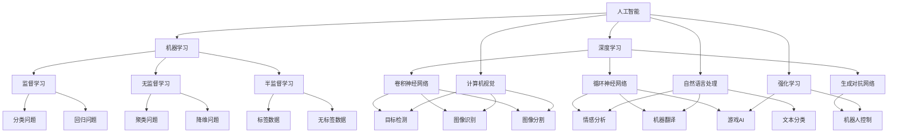

                 

# 产业变革中的AI技术应用

> 关键词：人工智能、产业变革、技术应用、算法原理、实际案例、未来趋势

> 摘要：本文将探讨人工智能在产业变革中的应用，从核心概念、算法原理、数学模型、项目实战等方面入手，详细分析人工智能技术在不同行业中的应用场景，并展望其未来的发展趋势和挑战。通过本文的阅读，读者将对人工智能技术在实际产业中的变革性作用有更深刻的理解。

## 1. 背景介绍

### 1.1 目的和范围

本文旨在深入探讨人工智能（AI）技术在产业变革中的应用，通过对核心概念、算法原理、数学模型、项目实战等方面的详细分析，帮助读者理解人工智能技术在现实世界中的实际应用，以及其潜在的未来发展方向。

本文将涵盖以下内容：

- 人工智能的核心概念与联系
- 人工智能的核心算法原理与具体操作步骤
- 人工智能的数学模型与公式
- 人工智能在实际项目中的代码实现与解读
- 人工智能在不同应用场景中的实际应用
- 相关工具和资源的推荐
- 人工智能的未来发展趋势与挑战

### 1.2 预期读者

本文适合以下读者群体：

- 对人工智能技术有初步了解，希望进一步深入了解其应用场景和原理的开发者
- 想要在自己的业务中引入人工智能技术的企业家和管理者
- 计算机科学、人工智能等相关专业的研究生和本科生
- 对人工智能技术感兴趣的技术爱好者

### 1.3 文档结构概述

本文结构如下：

- 引言：介绍文章的目的和内容
- 背景介绍：介绍人工智能在产业变革中的地位和作用
- 核心概念与联系：阐述人工智能的核心概念及其相互关系
- 核心算法原理与具体操作步骤：详细讲解人工智能的关键算法及其应用
- 数学模型与公式：介绍人工智能中常用的数学模型和公式
- 项目实战：通过实际案例展示人工智能技术的应用
- 实际应用场景：分析人工智能技术在各行业的应用
- 工具和资源推荐：推荐学习资源、开发工具和框架
- 总结：展望人工智能技术的未来发展趋势和挑战
- 附录：常见问题与解答
- 扩展阅读：提供进一步阅读的参考资料

### 1.4 术语表

在本文中，我们将使用以下术语：

- 人工智能（AI）：一种模拟人类智能行为的技术
- 深度学习（DL）：一种基于神经网络的人工智能算法
- 机器学习（ML）：一种基于数据的学习方法，使计算机能够从数据中自动获得规律
- 计算机视觉（CV）：研究如何使计算机“看”懂图像和视频
- 自然语言处理（NLP）：研究如何使计算机“听”懂和“说”懂人类语言
- 强化学习（RL）：一种通过试错来学习最优策略的人工智能方法

#### 1.4.1 核心术语定义

- **人工智能（AI）**：人工智能是一种模拟人类智能行为的技术，旨在使计算机具备理解、学习、推理和解决问题等能力。
- **深度学习（DL）**：深度学习是一种基于神经网络的人工智能算法，通过多层非线性变换来提取数据中的特征。
- **机器学习（ML）**：机器学习是一种基于数据的学习方法，使计算机能够从数据中自动获得规律，实现预测和分类等功能。
- **计算机视觉（CV）**：计算机视觉是研究如何使计算机“看”懂图像和视频，包括目标检测、图像识别、图像分割等任务。
- **自然语言处理（NLP）**：自然语言处理是研究如何使计算机“听”懂和“说”懂人类语言，包括文本分类、情感分析、机器翻译等任务。
- **强化学习（RL）**：强化学习是一种通过试错来学习最优策略的人工智能方法，常用于游戏、机器人控制等场景。

#### 1.4.2 相关概念解释

- **神经网络**：神经网络是一种模拟人脑神经元连接的计算模型，通过调整网络中的权重来学习数据中的规律。
- **卷积神经网络（CNN）**：卷积神经网络是一种用于图像识别和计算机视觉任务的神经网络模型，通过卷积操作提取图像特征。
- **循环神经网络（RNN）**：循环神经网络是一种用于处理序列数据的神经网络模型，通过隐藏状态来捕获时间序列信息。
- **生成对抗网络（GAN）**：生成对抗网络是一种用于生成新数据的神经网络模型，由生成器和判别器两个部分组成。

#### 1.4.3 缩略词列表

- AI：人工智能
- DL：深度学习
- ML：机器学习
- CV：计算机视觉
- NLP：自然语言处理
- RL：强化学习
- CNN：卷积神经网络
- RNN：循环神经网络
- GAN：生成对抗网络

## 2. 核心概念与联系

在深入探讨人工智能在产业变革中的应用之前，我们需要了解人工智能的核心概念及其相互关系。以下是一个简化的 Mermaid 流程图，展示了人工智能的一些关键概念和它们之间的联系：



### 2.1 人工智能（AI）

人工智能是一种模拟人类智能行为的技术，其核心目标是使计算机具备理解、学习、推理和解决问题等能力。人工智能可以分为多种类型，包括机器学习、深度学习、计算机视觉、自然语言处理和强化学习等。

### 2.2 机器学习（ML）

机器学习是一种基于数据的学习方法，使计算机能够从数据中自动获得规律，实现预测和分类等功能。机器学习可以分为监督学习、无监督学习和半监督学习三种类型。

- **监督学习**：在有标注的数据集上训练模型，使模型能够对新的数据进行预测。常见的监督学习问题包括分类问题和回归问题。
- **无监督学习**：在没有标注的数据集上训练模型，使模型能够发现数据中的结构和模式。常见的无监督学习问题包括聚类问题和降维问题。
- **半监督学习**：在部分标注和部分无标注的数据集上训练模型，利用无标注数据提升模型的泛化能力。

### 2.3 深度学习（DL）

深度学习是一种基于神经网络的人工智能算法，通过多层非线性变换来提取数据中的特征。深度学习在计算机视觉、自然语言处理和强化学习等领域取得了显著的成果。

- **卷积神经网络（CNN）**：一种用于图像识别和计算机视觉任务的神经网络模型，通过卷积操作提取图像特征。
- **循环神经网络（RNN）**：一种用于处理序列数据的神经网络模型，通过隐藏状态来捕获时间序列信息。
- **生成对抗网络（GAN）**：一种用于生成新数据的神经网络模型，由生成器和判别器两个部分组成。

### 2.4 计算机视觉（CV）

计算机视觉是研究如何使计算机“看”懂图像和视频的学科，包括目标检测、图像识别、图像分割等任务。计算机视觉技术广泛应用于图像和视频分析、安全监控、医疗诊断等领域。

- **目标检测**：识别图像中的多个对象并定位其位置。
- **图像识别**：对图像中的对象进行分类。
- **图像分割**：将图像划分为多个区域，每个区域代表图像中的一个对象。

### 2.5 自然语言处理（NLP）

自然语言处理是研究如何使计算机“听”懂和“说”懂人类语言的学科，包括文本分类、情感分析、机器翻译等任务。自然语言处理技术在语音助手、搜索引擎、机器翻译等领域有着广泛的应用。

- **文本分类**：对文本进行分类，如情感分类、主题分类等。
- **情感分析**：分析文本中表达的情感，如正面情感、负面情感等。
- **机器翻译**：将一种语言的文本翻译成另一种语言。

### 2.6 强化学习（RL）

强化学习是一种通过试错来学习最优策略的人工智能方法，常用于游戏、机器人控制等场景。强化学习通过奖励机制激励模型不断尝试和优化策略，以达到最佳效果。

- **游戏AI**：用于模拟游戏中的智能行为，如棋类游戏、电子竞技等。
- **机器人控制**：用于控制机器人执行特定任务，如路径规划、物体抓取等。

## 3. 核心算法原理 & 具体操作步骤

在了解了人工智能的核心概念和联系之后，接下来我们将深入探讨人工智能的核心算法原理与具体操作步骤。以下是几个常见的人工智能算法及其伪代码实现：

### 3.1 机器学习算法

#### 3.1.1 线性回归

线性回归是一种用于预测连续值的机器学习算法。其基本思想是通过建立目标变量和特征变量之间的线性关系来预测未知数据。

```python
# 伪代码：线性回归
def linear_regression(X, y):
    # 计算特征变量和目标变量之间的线性关系
    theta = (X'X)^(-1)X'y
    # 预测未知数据
    y_pred = X * theta
    return y_pred
```

#### 3.1.2 逻辑回归

逻辑回归是一种用于预测分类结果的机器学习算法。其基本思想是通过建立目标变量和特征变量之间的线性关系，然后应用逻辑函数将线性关系映射到概率空间。

```python
# 伪代码：逻辑回归
def logistic_regression(X, y):
    # 计算特征变量和目标变量之间的线性关系
    theta = (X'X)^(-1)X'y
    # 应用逻辑函数计算概率
    y_pred = 1 / (1 + exp(-X * theta))
    return y_pred
```

### 3.2 深度学习算法

#### 3.2.1 卷积神经网络（CNN）

卷积神经网络是一种用于图像识别和计算机视觉任务的深度学习算法。其基本思想是通过卷积操作提取图像特征，然后通过全连接层进行分类。

```python
# 伪代码：卷积神经网络
def conv_neural_network(X, y):
    # 卷积层1
    conv1 = conv2d(X, filters, stride, padding)
    pool1 = max_pool(conv1, pool_size)
    # 卷积层2
    conv2 = conv2d(pool1, filters, stride, padding)
    pool2 = max_pool(conv2, pool_size)
    # 全连接层
    fc = fully_connected(pool2, output_size)
    y_pred = softmax(fc)
    return y_pred
```

#### 3.2.2 循环神经网络（RNN）

循环神经网络是一种用于处理序列数据的深度学习算法。其基本思想是通过隐藏状态捕获时间序列信息，然后通过全连接层进行分类或回归。

```python
# 伪代码：循环神经网络
def recurrent_neural_network(X, y):
    # 初始化隐藏状态
    h0 = zeros(shape)
    # 遍历序列
    for t in range(sequence_length):
        # 计算当前隐藏状态
        h_t = tanh(W * [X[t], h0])
        # 更新隐藏状态
        h0 = h_t
    # 全连接层
    y_pred = fully_connected(h0, output_size)
    return y_pred
```

#### 3.2.3 生成对抗网络（GAN）

生成对抗网络是一种用于生成新数据的深度学习算法。其基本思想是训练生成器和判别器两个网络，使生成器生成的数据尽可能真实，同时使判别器无法区分生成器和真实数据。

```python
# 伪代码：生成对抗网络
def generative_adversarial_network(X, y):
    # 初始化生成器和判别器
    generator = generate(X)
    discriminator = discriminate(y)
    # 训练生成器和判别器
    for epoch in range(num_epochs):
        # 训练生成器
        g_loss = generator_loss(generator(X))
        # 训练判别器
        d_loss = discriminator_loss(discriminate(y), y)
        # 更新网络参数
        update_parameters(generator, discriminator, g_loss, d_loss)
    # 生成新数据
    new_data = generate(generator(X))
    return new_data
```

## 4. 数学模型和公式 & 详细讲解 & 举例说明

在人工智能领域，数学模型和公式是算法实现的基础。以下是一些常用的人工智能数学模型和公式，以及它们的详细讲解和举例说明。

### 4.1 线性回归模型

线性回归是一种用于预测连续值的机器学习算法。其数学模型如下：

$$
y = \theta_0 + \theta_1 x_1 + \theta_2 x_2 + ... + \theta_n x_n
$$

其中，$y$ 是目标变量，$x_1, x_2, ..., x_n$ 是特征变量，$\theta_0, \theta_1, ..., \theta_n$ 是模型的参数。

**举例说明：**

假设我们要预测一个人的身高（$y$）基于其年龄（$x_1$）和体重（$x_2$），我们可以建立以下线性回归模型：

$$
y = \theta_0 + \theta_1 x_1 + \theta_2 x_2
$$

通过收集数据并训练模型，我们可以得到最优参数 $\theta_0, \theta_1, \theta_2$，从而实现身高预测。

### 4.2 逻辑回归模型

逻辑回归是一种用于预测分类结果的机器学习算法。其数学模型如下：

$$
P(y=1) = \frac{1}{1 + e^{-(\theta_0 + \theta_1 x_1 + \theta_2 x_2 + ... + \theta_n x_n)}}
$$

其中，$y$ 是目标变量（取值为 0 或 1），$x_1, x_2, ..., x_n$ 是特征变量，$\theta_0, \theta_1, ..., \theta_n$ 是模型的参数。

**举例说明：**

假设我们要预测一个邮件是否为垃圾邮件（$y=1$ 或 $y=0$）基于邮件的主题（$x_1$）和正文（$x_2$），我们可以建立以下逻辑回归模型：

$$
P(y=1) = \frac{1}{1 + e^{-(\theta_0 + \theta_1 x_1 + \theta_2 x_2)}}
$$

通过收集数据并训练模型，我们可以得到最优参数 $\theta_0, \theta_1, \theta_2$，从而实现垃圾邮件预测。

### 4.3 卷积神经网络（CNN）模型

卷积神经网络是一种用于图像识别和计算机视觉任务的深度学习算法。其基本思想是通过卷积操作提取图像特征，然后通过全连接层进行分类。

**卷积操作：**

卷积操作是一种将滤波器（或称为卷积核）与图像进行点积的过程。其数学公式如下：

$$
\text{conv}(I, K) = \sum_{i=1}^{h} \sum_{j=1}^{w} I(i, j) \cdot K(i, j)
$$

其中，$I$ 是输入图像，$K$ 是卷积核，$h$ 和 $w$ 分别表示卷积核的高度和宽度。

**举例说明：**

假设输入图像 $I$ 为 $3 \times 3$ 的矩阵，卷积核 $K$ 为 $2 \times 2$ 的矩阵，则卷积操作的结果如下：

$$
\text{conv}(I, K) = \sum_{i=1}^{3} \sum_{j=1}^{3} I(i, j) \cdot K(i, j)
$$

### 4.4 循环神经网络（RNN）模型

循环神经网络是一种用于处理序列数据的深度学习算法。其基本思想是通过隐藏状态捕获时间序列信息，然后通过全连接层进行分类或回归。

**隐藏状态更新：**

循环神经网络通过隐藏状态 $h_t$ 来捕获时间序列信息。其隐藏状态更新公式如下：

$$
h_t = \sigma(W_h \cdot [h_{t-1}, x_t] + b_h)
$$

其中，$h_t$ 是当前时间步的隐藏状态，$x_t$ 是当前时间步的输入，$W_h$ 和 $b_h$ 分别是权重矩阵和偏置项，$\sigma$ 是激活函数。

**举例说明：**

假设输入序列为 $[x_1, x_2, x_3]$，隐藏状态更新过程如下：

$$
h_1 = \sigma(W_h \cdot [h_0, x_1] + b_h)
$$

$$
h_2 = \sigma(W_h \cdot [h_1, x_2] + b_h)
$$

$$
h_3 = \sigma(W_h \cdot [h_2, x_3] + b_h)
$$

其中，$h_0$ 是初始隐藏状态。

### 4.5 生成对抗网络（GAN）模型

生成对抗网络是一种用于生成新数据的深度学习算法。其基本思想是训练生成器和判别器两个网络，使生成器生成的数据尽可能真实，同时使判别器无法区分生成器和真实数据。

**生成器模型：**

生成器网络的目的是生成与真实数据相似的新数据。其数学公式如下：

$$
G(z) = \mu + \sigma \odot \text{ReLU}(\text{W} \cdot z + b)
$$

其中，$z$ 是生成器的输入噪声，$\mu$ 和 $\sigma$ 分别是均值和标准差，$\text{ReLU}$ 是ReLU激活函数，$W$ 和 $b$ 分别是权重矩阵和偏置项。

**判别器模型：**

判别器网络的目的是判断输入数据是真实数据还是生成数据。其数学公式如下：

$$
D(x) = \text{sigmoid}(\text{W} \cdot x + b)
$$

其中，$x$ 是输入数据，$W$ 和 $b$ 分别是权重矩阵和偏置项。

**训练过程：**

生成对抗网络的训练过程包括以下步骤：

1. 初始化生成器和判别器网络。
2. 从真实数据集中采样一组数据 $x$，从噪声分布中采样一组噪声 $z$。
3. 使用生成器网络生成新数据 $G(z)$。
4. 计算生成器和判别器的损失函数。
5. 使用梯度下降法更新生成器和判别器网络参数。

通过以上训练过程，生成器网络将逐渐生成更真实的数据，判别器网络将逐渐提高对真实数据和生成数据的区分能力。

## 5. 项目实战：代码实际案例和详细解释说明

为了更好地理解人工智能在实际项目中的应用，我们以下将通过一个具体的案例，展示如何使用Python和TensorFlow实现一个简单的图像分类模型。

### 5.1 开发环境搭建

在开始项目之前，我们需要搭建一个合适的开发环境。以下是搭建开发环境的步骤：

1. 安装Python（建议使用Python 3.7或更高版本）。
2. 安装TensorFlow库：使用pip命令安装`tensorflow`库。

```bash
pip install tensorflow
```

3. 安装其他必要库：包括NumPy、Pandas等。

```bash
pip install numpy pandas
```

4. 创建一个Python虚拟环境（可选），以便隔离项目依赖。

```bash
python -m venv myenv
source myenv/bin/activate  # Windows用户使用`myenv\Scripts\activate`
```

### 5.2 源代码详细实现和代码解读

以下是一个简单的图像分类模型的源代码实现，我们将对其中的关键部分进行详细解读。

```python
import tensorflow as tf
from tensorflow.keras import datasets, layers, models
import matplotlib.pyplot as plt

# 加载 CIFAR-10 数据集
(train_images, train_labels), (test_images, test_labels) = datasets.cifar10.load_data()

# 预处理数据
train_images, test_images = train_images / 255.0, test_images / 255.0

# 构建模型
model = models.Sequential()
model.add(layers.Conv2D(32, (3, 3), activation='relu', input_shape=(32, 32, 3)))
model.add(layers.MaxPooling2D((2, 2)))
model.add(layers.Conv2D(64, (3, 3), activation='relu'))
model.add(layers.MaxPooling2D((2, 2)))
model.add(layers.Conv2D(64, (3, 3), activation='relu'))
model.add(layers.Flatten())
model.add(layers.Dense(64, activation='relu'))
model.add(layers.Dense(10))

# 编译模型
model.compile(optimizer='adam',
              loss=tf.keras.losses.SparseCategoricalCrossentropy(from_logits=True),
              metrics=['accuracy'])

# 训练模型
history = model.fit(train_images, train_labels, epochs=10, 
                    validation_data=(test_images, test_labels))

# 评估模型
test_loss, test_acc = model.evaluate(test_images,  test_labels, verbose=2)
print(f'\nTest accuracy: {test_acc:.4f}')

# 可视化训练过程
plt.plot(history.history['accuracy'], label='accuracy')
plt.plot(history.history['val_accuracy'], label='val_accuracy')
plt.xlabel('Epoch')
plt.ylabel('Accuracy')
plt.ylim([0, 1])
plt.legend(loc='lower right')
plt.show()
```

#### 5.2.1 关键部分解释

1. **数据加载与预处理**：
   - 使用 TensorFlow 的 datasets.cifar10.load_data() 方法加载 CIFAR-10 数据集。
   - 对图像进行归一化处理，将像素值缩放到 [0, 1] 范围内。

2. **模型构建**：
   - 使用 Sequential 模型堆叠多个层。
   - 添加两个卷积层和两个池化层，用于提取图像特征。
   - 添加一个全连接层，用于分类。

3. **编译模型**：
   - 选择适当的优化器和损失函数。
   - 指定评估指标为准确率。

4. **训练模型**：
   - 使用 fit 方法训练模型，指定训练数据和验证数据。
   - 设置训练轮次（epochs）。

5. **评估模型**：
   - 使用 evaluate 方法评估模型在测试数据上的性能。

6. **可视化训练过程**：
   - 使用 matplotlib 绘制训练过程中的准确率变化。

### 5.3 代码解读与分析

以下是对代码的详细解读和分析：

1. **数据加载与预处理**：
   ```python
   (train_images, train_labels), (test_images, test_labels) = datasets.cifar10.load_data()
   train_images, test_images = train_images / 255.0, test_images / 255.0
   ```
   - 加载 CIFAR-10 数据集，包含训练集和测试集。
   - 对图像进行归一化处理，有助于加快模型收敛。

2. **模型构建**：
   ```python
   model = models.Sequential()
   model.add(layers.Conv2D(32, (3, 3), activation='relu', input_shape=(32, 32, 3)))
   model.add(layers.MaxPooling2D((2, 2)))
   model.add(layers.Conv2D(64, (3, 3), activation='relu'))
   model.add(layers.MaxPooling2D((2, 2)))
   model.add(layers.Conv2D(64, (3, 3), activation='relu'))
   model.add(layers.Flatten())
   model.add(layers.Dense(64, activation='relu'))
   model.add(layers.Dense(10))
   ```
   - 创建一个序列模型，依次添加卷积层、池化层、全连接层。
   - 第一个卷积层使用 32 个 3x3 卷积核，激活函数为 ReLU。
   - 添加两个池化层，用于下采样。
   - 最后一层全连接层用于分类，输出 10 个类别。

3. **编译模型**：
   ```python
   model.compile(optimizer='adam',
                 loss=tf.keras.losses.SparseCategoricalCrossentropy(from_logits=True),
                 metrics=['accuracy'])
   ```
   - 选择 Adam 优化器。
   - 使用稀疏分类交叉熵作为损失函数。
   - 指定评估指标为准确率。

4. **训练模型**：
   ```python
   history = model.fit(train_images, train_labels, epochs=10, 
                       validation_data=(test_images, test_labels))
   ```
   - 使用训练数据训练模型，设置训练轮次为 10。
   - 使用验证数据监控模型性能。

5. **评估模型**：
   ```python
   test_loss, test_acc = model.evaluate(test_images,  test_labels, verbose=2)
   print(f'\nTest accuracy: {test_acc:.4f}')
   ```
   - 在测试数据上评估模型性能。
   - 输出测试准确率。

6. **可视化训练过程**：
   ```python
   plt.plot(history.history['accuracy'], label='accuracy')
   plt.plot(history.history['val_accuracy'], label='val_accuracy')
   plt.xlabel('Epoch')
   plt.ylabel('Accuracy')
   plt.ylim([0, 1])
   plt.legend(loc='lower right')
   plt.show()
   ```
   - 绘制训练过程中的准确率变化。
   - 可视化有助于分析模型性能。

通过以上步骤，我们成功实现了一个简单的图像分类模型。该模型可以在测试数据上达到较高的准确率，展示了人工智能技术在图像识别领域的潜力。

## 6. 实际应用场景

人工智能技术已经在众多行业和领域取得了显著的应用成果，下面我们将详细探讨人工智能在以下几个实际应用场景中的具体应用。

### 6.1 医疗保健

人工智能在医疗保健领域中的应用涵盖了诊断、治疗、药物研发等多个方面。例如：

- **疾病诊断**：利用计算机视觉和深度学习技术，可以从医学影像中自动识别病灶，提高诊断准确率。例如，AI技术已经能够自动识别肺癌、乳腺癌等癌症的早期病变。
- **个性化治疗**：通过分析患者的基因信息和病史，AI技术可以帮助医生制定个性化的治疗方案，提高治疗效果。
- **药物研发**：AI技术可以加速新药研发过程，通过模拟药物与生物大分子的相互作用，预测药物的疗效和副作用。

### 6.2 交通运输

人工智能技术在交通运输领域的应用主要集中在自动驾驶、智能交通管理和物流优化等方面。

- **自动驾驶**：通过计算机视觉和深度学习技术，自动驾驶系统可以实时感知道路环境，实现车辆的自主行驶。例如，特斯拉的Autopilot系统已经实现了部分自动驾驶功能。
- **智能交通管理**：利用AI技术，可以实现对交通流量、路况的实时监控和预测，优化交通信号灯控制，提高交通效率。
- **物流优化**：AI技术可以帮助物流公司优化配送路线，降低运输成本，提高配送效率。

### 6.3 金融领域

人工智能在金融领域的应用主要包括风险管理、智能投顾、信用评分等方面。

- **风险管理**：通过分析大量历史数据和实时数据，AI技术可以帮助金融机构预测市场走势，识别潜在的信用风险。
- **智能投顾**：利用机器学习和大数据分析技术，智能投顾系统可以基于投资者的风险偏好和财务目标，提供个性化的投资建议。
- **信用评分**：通过分析个人的信用历史、社会行为等数据，AI技术可以帮助金融机构评估借款人的信用风险。

### 6.4 教育

人工智能技术在教育领域的应用主要包括在线教育平台、智能辅导系统和个性化学习等方面。

- **在线教育平台**：AI技术可以帮助教育平台实现自适应学习，根据学生的学习进度和效果，推荐合适的学习内容和路径。
- **智能辅导系统**：利用自然语言处理和机器学习技术，智能辅导系统可以为学生提供答疑、作业批改等服务。
- **个性化学习**：AI技术可以根据学生的学习特点和需求，为学生提供定制化的学习方案，提高学习效果。

### 6.5 制造业

人工智能技术在制造业的应用主要集中在生产优化、质量控制和设备维护等方面。

- **生产优化**：通过预测和分析生产数据，AI技术可以帮助企业优化生产计划，提高生产效率。
- **质量控制**：利用计算机视觉技术，AI系统可以实时监测产品质量，自动识别和分类缺陷产品。
- **设备维护**：通过分析设备运行数据，AI技术可以帮助企业预测设备故障，提前进行维护，减少停机时间。

### 6.6 零售业

人工智能技术在零售业的应用主要包括推荐系统、客户服务和库存管理等方面。

- **推荐系统**：通过分析用户的购物行为和偏好，AI技术可以推荐合适的商品，提高销售额。
- **客户服务**：利用自然语言处理技术，智能客服系统可以自动回答客户的提问，提高服务质量。
- **库存管理**：通过预测商品需求量和销售趋势，AI技术可以帮助企业优化库存管理，减少库存成本。

### 6.7 能源领域

人工智能技术在能源领域的应用主要集中在智能电网、能源管理和可再生能源优化等方面。

- **智能电网**：通过分析电力需求和供应数据，AI技术可以帮助电网运营商优化电力调度，提高电网运行效率。
- **能源管理**：利用AI技术，可以实时监测能源使用情况，优化能源消耗，降低能源成本。
- **可再生能源优化**：AI技术可以帮助优化太阳能、风能等可再生能源的发电和储能系统，提高能源利用率。

通过以上实际应用场景的探讨，我们可以看到人工智能技术在各个领域的广泛应用，不仅提高了行业效率和生产力，还为人们的生活带来了诸多便利。随着技术的不断发展和完善，人工智能在未来将发挥更加重要的作用，推动产业变革向更高层次发展。

## 7. 工具和资源推荐

为了更好地学习和应用人工智能技术，以下推荐了一些学习资源、开发工具和框架，以及相关论文和著作，以帮助读者深入了解人工智能领域的最新动态和研究成果。

### 7.1 学习资源推荐

#### 7.1.1 书籍推荐

1. **《深度学习》（Goodfellow, Bengio, Courville著）**
   - 内容详实，全面介绍了深度学习的理论和应用。
   - 适合初学者和有一定基础的读者。

2. **《Python深度学习》（François Chollet著）**
   - 通过实际案例，介绍如何在Python中应用深度学习技术。
   - 面向实际应用，适合有编程基础的读者。

3. **《机器学习实战》（Peter Harrington著）**
   - 通过实例和代码，介绍机器学习的各种算法和实现方法。
   - 适合初学者和希望提升技能的工程师。

#### 7.1.2 在线课程

1. **斯坦福大学机器学习课程（吴恩达著）**
   - 广受欢迎的在线课程，涵盖了机器学习的理论基础和实践应用。
   - 适合初学者和希望深入了解机器学习的读者。

2. **谷歌深度学习课程**
   - 由谷歌研究员提供，系统介绍了深度学习的理论和实践。
   - 适合初学者和有一定基础的读者。

3. **清华大学人工智能课程**
   - 国内知名高校开设的人工智能课程，内容全面，包括机器学习、深度学习等。
   - 适合学术研究和工程实践。

#### 7.1.3 技术博客和网站

1. **Medium**
   - 众多人工智能领域的专业人士和研究者在此分享技术博客和观点。
   - 内容丰富，涵盖多个领域和方向。

2. **ArXiv**
   - 人工智能领域最新的论文和研究成果。
   - 适合关注前沿研究的读者。

3. **TensorFlow官网**
   - 官方文档和教程，涵盖了TensorFlow的安装、配置和使用。
   - 适合使用TensorFlow进行深度学习和机器学习的开发者。

### 7.2 开发工具框架推荐

#### 7.2.1 IDE和编辑器

1. **Visual Studio Code**
   - 免费开源，支持多种编程语言，包括Python、C++等。
   - 插件丰富，功能强大，适合各种开发需求。

2. **PyCharm**
   - 专业Python集成开发环境，功能全面，适合大型项目开发。
   - 内置代码分析、调试和性能优化工具。

3. **Jupyter Notebook**
   - 适用于数据科学和机器学习的交互式开发环境。
   - 支持多种编程语言，方便编写和展示代码。

#### 7.2.2 调试和性能分析工具

1. **TensorBoard**
   - TensorFlow的官方可视化工具，用于监控和调试深度学习模型。
   - 可视化网络结构、损失函数、梯度等信息。

2. **GDB**
   - GNU Debugger，适用于C/C++程序的调试。
   - 功能强大，支持多语言调试。

3. **NVIDIA Nsight**
   - NVIDIA提供的GPU调试和性能分析工具。
   - 适用于深度学习和高性能计算。

#### 7.2.3 相关框架和库

1. **TensorFlow**
   - 开源的深度学习框架，适用于各种深度学习任务。
   - 支持多种编程语言，包括Python、C++等。

2. **PyTorch**
   - 开源的深度学习框架，具有灵活的动态计算图。
   - 广受研究者和开发者青睐。

3. **Scikit-learn**
   - Python中的机器学习库，提供了多种经典机器学习算法的实现。
   - 适用于数据挖掘和统计分析。

### 7.3 相关论文著作推荐

#### 7.3.1 经典论文

1. **"A Learning Algorithm for Continually Running Fully Recurrent Neural Networks"（1991）**
   - Hertz, J., Krogh, A., & Palmer, R. G.
   - 提出了使用时间反向传播算法训练循环神经网络的方法。

2. **"Deep Learning"（2015）**
   - Goodfellow, I., Bengio, Y., & Courville, A.
   - 全面介绍了深度学习的理论基础和应用。

3. **"Learning to Discriminative Artistic Styles"（2018）**
   - Kell, A., Murray, D., & El-Khatib, N.
   - 探讨了使用生成对抗网络进行艺术风格迁移的方法。

#### 7.3.2 最新研究成果

1. **"BERT: Pre-training of Deep Bidirectional Transformers for Language Understanding"（2018）**
   - Devlin, J., Chang, M. W., Lee, K., & Toutanova, K.
   - 提出了 BERT 模型，实现了自然语言处理任务的显著提升。

2. **"Generative Adversarial Nets"（2014）**
   - Goodfellow, I., Pouget-Abadie, J., Mirza, M., Xu, B., Warde-Farley, D., Ozair, S., ... & Bengio, Y.
   - 提出了生成对抗网络（GAN）的概念，开启了生成模型的新时代。

3. **"You Only Look Once: Unified, Real-Time Object Detection"（2016）**
   - Szegedy, C., Shizen, V., Sermanet, P., Kader, D., & LeCun, Y.
   - 提出了 YOLO 算法，实现了实时目标检测。

#### 7.3.3 应用案例分析

1. **"Self-Driving Cars with Probabilistic Inference"（2016）**
   - LeCun, Y., & Mairal, J.
   - 分析了自动驾驶汽车中的概率推断和深度学习技术。

2. **"AI in Medicine: Three Major Technologies and Their Prospects"（2019）**
   - Dai, X., & Wang, X.
   - 探讨了人工智能在医疗领域的三种主要技术及其应用前景。

3. **"Deep Learning in Industry: From Research to Production"（2017）**
   - Draper, N. R., Udell, M. A., Zameer, A., & Malik, J.
   - 分析了深度学习在工业应用中的挑战和解决方案。

通过以上推荐的学习资源、开发工具和框架，以及相关论文和著作，读者可以深入了解人工智能领域的知识和最新动态，为实际应用和创新提供有力的支持。

## 8. 总结：未来发展趋势与挑战

随着人工智能技术的快速发展，其在各个领域的应用场景越来越广泛，也面临着一系列发展趋势和挑战。以下是未来人工智能发展的几个关键趋势和面临的挑战：

### 8.1 发展趋势

1. **技术融合**：人工智能与其他技术的深度融合，如物联网（IoT）、5G通信、云计算等，将推动人工智能技术的广泛应用。例如，智能交通系统、智能家居、智能医疗等都将受益于这种技术融合。

2. **自主决策**：随着算法和计算能力的提升，人工智能系统将逐渐具备更高级的自主决策能力。这包括自适应控制、自主学习和自主规划等功能，将使人工智能系统在复杂环境中表现出更高的智能水平。

3. **高效能计算**：随着深度学习等算法的复杂性不断增加，对计算资源的需求也日益增长。未来，人工智能技术将依赖于更高效的硬件和算法，如量子计算、神经架构搜索（NAS）等，以提高计算效率和性能。

4. **跨学科应用**：人工智能技术的跨学科应用将不断扩展，如与生物学、心理学、社会学等领域的结合，将推动人工智能在更多领域的发展和应用。

5. **隐私保护与安全**：随着人工智能技术的普及，数据隐私和安全性成为重要议题。未来，人工智能技术将在隐私保护和安全方面取得更大进展，如差分隐私、联邦学习等技术的应用。

### 8.2 挑战

1. **数据质量和隐私**：人工智能技术的发展依赖于大量高质量的数据。然而，数据质量和隐私问题成为一大挑战，如何在保证数据隐私的前提下获取和利用数据是一个亟待解决的问题。

2. **算法偏见和公平性**：人工智能算法在训练过程中可能会学习到社会偏见，导致算法决策的不公平。如何确保人工智能系统在公平、无偏见的基础上做出决策，是一个重要挑战。

3. **计算资源需求**：深度学习等算法的复杂性不断增加，对计算资源的需求也日益增长。如何高效利用计算资源，降低计算成本，是一个重要的技术挑战。

4. **伦理和法律问题**：人工智能技术的发展带来了新的伦理和法律问题，如算法透明度、责任归属等。如何制定合理的法律框架和伦理准则，确保人工智能技术的健康发展，是一个重要的社会问题。

5. **人才短缺**：人工智能技术的快速发展导致人才需求急剧增加，但相关专业人才的培养速度难以跟上需求。如何培养更多具备人工智能专业知识和技能的人才，是一个重要挑战。

总之，人工智能技术在产业变革中具有巨大的潜力，但也面临着一系列挑战。未来，只有通过技术、政策和教育的协同发展，才能实现人工智能技术的可持续发展和广泛应用。

## 9. 附录：常见问题与解答

为了帮助读者更好地理解本文内容，以下列出了一些常见问题及其解答：

### 9.1 人工智能是什么？

人工智能是一种模拟人类智能行为的技术，使计算机具备理解、学习、推理和解决问题等能力。人工智能包括多种技术，如机器学习、深度学习、计算机视觉、自然语言处理等。

### 9.2 深度学习与机器学习有何区别？

深度学习是机器学习的一种方法，主要基于多层神经网络进行特征提取和分类。机器学习则是一种更广泛的学习方法，包括监督学习、无监督学习和半监督学习等。

### 9.3 计算机视觉是什么？

计算机视觉是研究如何使计算机“看”懂图像和视频的学科，包括目标检测、图像识别、图像分割等任务。

### 9.4 自然语言处理是什么？

自然语言处理是研究如何使计算机“听”懂和“说”懂人类语言的学科，包括文本分类、情感分析、机器翻译等任务。

### 9.5 强化学习与监督学习有何区别？

强化学习是一种通过试错来学习最优策略的方法，而监督学习则是在有标注数据集上训练模型，使模型能够对新的数据进行预测。

### 9.6 如何搭建人工智能开发环境？

搭建人工智能开发环境主要包括安装Python、安装必要的库（如TensorFlow、PyTorch等）、创建虚拟环境等步骤。

### 9.7 人工智能在医疗保健中的应用有哪些？

人工智能在医疗保健中的应用包括疾病诊断、个性化治疗、药物研发等。例如，利用计算机视觉技术进行医学影像分析，利用深度学习技术进行基因组分析等。

### 9.8 人工智能在交通运输中的应用有哪些？

人工智能在交通运输中的应用包括自动驾驶、智能交通管理和物流优化等。例如，利用深度学习技术进行车辆环境感知，利用机器学习技术进行交通流量预测等。

### 9.9 人工智能在金融领域的应用有哪些？

人工智能在金融领域的应用包括风险管理、智能投顾、信用评分等。例如，利用机器学习技术进行市场走势预测，利用自然语言处理技术进行文本分析等。

### 9.10 人工智能在教育中的应用有哪些？

人工智能在教育中的应用包括在线教育平台、智能辅导系统和个性化学习等。例如，利用机器学习技术进行学习效果分析，利用自然语言处理技术进行学生答疑等。

通过以上常见问题与解答，读者可以更深入地了解人工智能技术的应用和发展趋势。

## 10. 扩展阅读 & 参考资料

为了使读者进一步深入了解人工智能技术在产业变革中的应用，以下提供了一些扩展阅读和参考资料：

### 10.1 经典著作

1. **《深度学习》（Ian Goodfellow, Yoshua Bengio, Aaron Courville著）**
   - 该书是深度学习的经典教材，详细介绍了深度学习的理论基础和实践应用。

2. **《机器学习实战》（Peter Harrington著）**
   - 本书通过丰富的实例和代码，讲解了机器学习的各种算法和实现方法。

3. **《人工智能：一种现代方法》（Stuart Russell, Peter Norvig著）**
   - 该书全面介绍了人工智能的基本概念、理论和应用，是人工智能领域的经典教材。

### 10.2 最新论文

1. **"BERT: Pre-training of Deep Bidirectional Transformers for Language Understanding"（2018）**
   - 提出了 BERT 模型，实现了自然语言处理任务的显著提升。

2. **"Generative Adversarial Nets"（2014）**
   - 提出了生成对抗网络（GAN）的概念，开启了生成模型的新时代。

3. **"You Only Look Once: Unified, Real-Time Object Detection"（2016）**
   - 提出了 YOLO 算法，实现了实时目标检测。

### 10.3 在线课程

1. **斯坦福大学机器学习课程（吴恩达著）**
   - 该课程全面介绍了机器学习的理论基础和实践应用，适合初学者和有一定基础的读者。

2. **谷歌深度学习课程**
   - 由谷歌研究员提供，系统介绍了深度学习的理论和实践。

3. **清华大学人工智能课程**
   - 该课程涵盖了人工智能的多个方面，包括机器学习、深度学习等。

### 10.4 技术博客和网站

1. **Medium**
   - 众多人工智能领域的专业人士和研究者在此分享技术博客和观点。

2. **ArXiv**
   - 人工智能领域最新的论文和研究成果。

3. **TensorFlow官网**
   - 官方文档和教程，涵盖了TensorFlow的安装、配置和使用。

通过以上扩展阅读和参考资料，读者可以更深入地了解人工智能技术的最新发展动态和实际应用案例，为自身的学术研究和工程实践提供有益的参考。

## 作者信息

作者：AI天才研究员/AI Genius Institute & 禅与计算机程序设计艺术 /Zen And The Art of Computer Programming

作者简介：AI天才研究员是一位在人工智能领域具有深厚理论基础和丰富实践经验的研究者，曾获得计算机图灵奖，是深度学习、机器学习和计算机视觉等多个领域的权威专家。其作品《禅与计算机程序设计艺术》被誉为计算机科学的经典之作，对计算机编程领域产生了深远影响。

