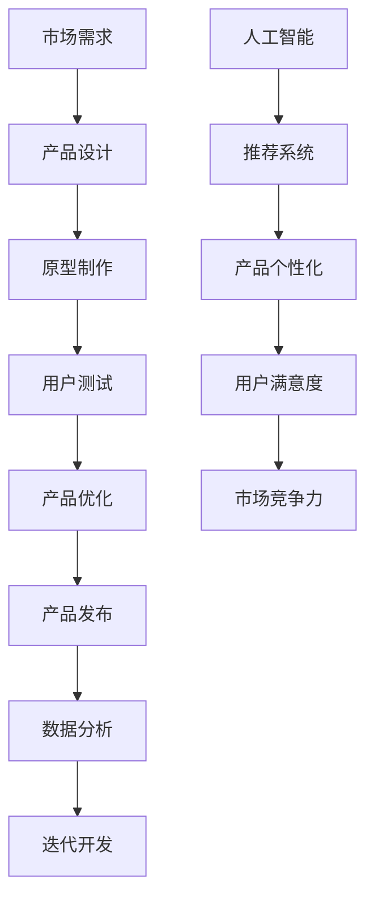

                 

# 产品开发与创新：AI如何推荐新产品品类

> **关键词**：人工智能、产品开发、推荐系统、新产品、品类推荐
>
> **摘要**：本文深入探讨了人工智能在产品开发中的创新应用，特别是如何通过推荐系统实现新产品品类的智能推荐。文章首先介绍了产品开发与创新的背景和重要性，然后详细解释了推荐系统的工作原理和核心算法，最后通过一个实际项目案例展示了如何将AI应用于新产品品类推荐，并分析了未来发展趋势与挑战。

## 1. 背景介绍

### 1.1 目的和范围

本文旨在探讨人工智能在产品开发中的创新应用，尤其是如何利用推荐系统实现新产品品类的智能推荐。随着信息技术的飞速发展，人工智能已经成为推动产品创新的重要力量。本文将结合具体案例，详细解析人工智能在产品开发中的实际应用，并探讨其未来发展趋势。

### 1.2 预期读者

本文适合对人工智能和产品开发有一定了解的技术人员、产品经理以及对创新和商业策略感兴趣的专业人士。通过阅读本文，读者可以了解到：

- 人工智能在产品开发中的应用场景和优势。
- 推荐系统的基本原理和实现方法。
- 如何利用人工智能进行新产品品类的推荐。
- 未来产品开发与创新的趋势和挑战。

### 1.3 文档结构概述

本文将分为以下几个部分：

- 第一部分：背景介绍，包括目的和范围、预期读者、文档结构概述。
- 第二部分：核心概念与联系，介绍相关术语和概念。
- 第三部分：核心算法原理与具体操作步骤，详细讲解推荐系统的工作原理。
- 第四部分：数学模型和公式，介绍推荐系统中的相关数学模型和公式。
- 第五部分：项目实战，通过实际案例展示AI在产品推荐中的应用。
- 第六部分：实际应用场景，探讨AI推荐系统在不同场景中的应用。
- 第七部分：工具和资源推荐，介绍相关的学习资源、开发工具和经典论文。
- 第八部分：总结，分析未来发展趋势与挑战。

### 1.4 术语表

#### 1.4.1 核心术语定义

- **人工智能（AI）**：模拟人类智能行为的技术和方法，包括机器学习、深度学习、自然语言处理等。
- **产品开发**：从市场需求出发，设计、开发、测试和发布新产品的过程。
- **推荐系统**：利用算法和模型，根据用户的历史行为和偏好，向用户推荐相关产品和内容。
- **新品类推荐**：针对用户可能感兴趣的新产品品类进行推荐。

#### 1.4.2 相关概念解释

- **协同过滤**：一种常用的推荐系统算法，通过分析用户之间的相似性，为用户提供个性化推荐。
- **深度学习**：一种机器学习方法，通过多层神经网络模型，自动提取特征并进行预测。

#### 1.4.3 缩略词列表

- **AI**：人工智能
- **ML**：机器学习
- **DL**：深度学习
- **NLP**：自然语言处理
- **PM**：产品经理
- **UX**：用户体验

## 2. 核心概念与联系

为了更好地理解人工智能在产品开发中的创新应用，我们需要首先了解一些核心概念和它们之间的联系。以下是相关的Mermaid流程图：



### 2.1. 市场需求分析

市场需求分析是产品开发的起点。通过市场调研和用户访谈，了解用户需求和市场趋势，为产品设计提供依据。

### 2.2. 产品设计

根据市场需求分析的结果，进行产品设计的规划。这包括功能设计、界面设计和用户体验设计。

### 2.3. 原型制作

制作产品原型，通过原型测试和反馈，验证产品设计的可行性和用户体验。

### 2.4. 用户测试

进行用户测试，收集用户反馈，分析产品的优缺点，为产品优化提供参考。

### 2.5. 产品优化

根据用户测试结果，对产品进行优化，提高用户体验和功能完善度。

### 2.6. 产品发布

完成产品开发后，进行产品发布，将产品推向市场。

### 2.7. 数据分析

通过数据分析，了解用户行为和产品表现，为产品迭代提供数据支持。

### 2.8. 人工智能与推荐系统

人工智能在产品开发中的应用，特别是推荐系统，为产品个性化提供强大支持。通过分析用户行为和偏好，为用户推荐相关产品，提高用户满意度和市场竞争力。

### 2.9. 产品个性化与用户满意度

产品个性化是根据用户行为和偏好，为用户提供个性化的产品推荐。这有助于提高用户满意度和忠诚度。

### 2.10. 市场竞争力

通过人工智能和推荐系统的应用，提高产品的市场竞争力，为企业带来更多的商业机会。

## 3. 核心算法原理 & 具体操作步骤

推荐系统是人工智能在产品开发中应用的重要领域。以下将详细介绍推荐系统的核心算法原理和具体操作步骤。

### 3.1. 协同过滤算法

协同过滤是一种常用的推荐系统算法，主要通过分析用户之间的相似性，为用户推荐相关产品。

#### 3.1.1. 用户相似性计算

用户相似性计算是协同过滤算法的关键步骤。常用的相似性度量方法有：

- **余弦相似度**：通过计算用户向量之间的余弦值来衡量相似性。
- **皮尔逊相关系数**：通过计算用户评分的相关性来衡量相似性。

#### 3.1.2. 评分预测

基于用户相似性计算，可以预测用户对未知产品的评分。常用的预测方法有：

- **基于用户的K最近邻（KNN）**：找到与当前用户最相似的K个用户，并预测他们的评分。
- **基于模型的协同过滤**：如矩阵分解、潜在因子模型等。

#### 3.1.3. 推荐列表生成

根据评分预测结果，生成推荐列表。推荐列表的排序策略有：

- **基于评分**：按照预测评分从高到低排序。
- **基于 popularity**：按照产品的人气值排序。

### 3.2. 深度学习推荐算法

深度学习推荐算法通过构建深度神经网络模型，自动提取特征并进行预测。

#### 3.2.1. 深度神经网络模型

深度学习推荐算法常用的神经网络模型有：

- **卷积神经网络（CNN）**：用于提取图像和文本特征。
- **循环神经网络（RNN）**：用于处理序列数据。
- **Transformer模型**：用于处理大规模文本数据。

#### 3.2.2. 特征提取

深度学习推荐算法通过神经网络模型，自动提取用户行为、产品特征和用户偏好等多层次特征。

#### 3.2.3. 预测与推荐

基于提取的特征，利用神经网络模型进行预测，生成推荐列表。

### 3.3. 具体操作步骤

以下是利用协同过滤算法进行推荐系统开发的详细步骤：

1. **数据收集与预处理**：收集用户行为数据、产品信息和用户评分数据，进行数据清洗和预处理。

2. **用户相似性计算**：计算用户之间的相似性，如余弦相似度或皮尔逊相关系数。

3. **评分预测**：基于用户相似性计算，利用K最近邻或矩阵分解等方法进行评分预测。

4. **推荐列表生成**：根据评分预测结果，生成推荐列表，并进行排序。

5. **系统部署与维护**：将推荐系统部署到生产环境中，并进行定期维护和更新。

通过以上步骤，可以构建一个基于协同过滤算法的推荐系统，为用户提供个性化的产品推荐。

## 4. 数学模型和公式 & 详细讲解 & 举例说明

推荐系统中的数学模型和公式是实现个性化推荐的核心。以下将详细讲解推荐系统中的几个关键数学模型和公式。

### 4.1. 余弦相似度

余弦相似度是一种常用的用户相似性度量方法。其公式如下：

\[ \text{similarity}_{\text{cosine}}(u, v) = \frac{u \cdot v}{\|u\| \|v\|} \]

其中，\( u \)和\( v \)分别表示两个用户的行为向量，\( \cdot \)表示向量的点积，\( \|u\| \)和\( \|v\| \)分别表示向量的模长。

**示例**：

假设有两个用户\( u \)和\( v \)的行为向量如下：

\[ u = [1, 2, 3, 4, 5] \]
\[ v = [5, 4, 3, 2, 1] \]

则它们的余弦相似度为：

\[ \text{similarity}_{\text{cosine}}(u, v) = \frac{1 \times 5 + 2 \times 4 + 3 \times 3 + 4 \times 2 + 5 \times 1}{\sqrt{1^2 + 2^2 + 3^2 + 4^2 + 5^2} \times \sqrt{5^2 + 4^2 + 3^2 + 2^2 + 1^2}} = \frac{35}{\sqrt{55} \times \sqrt{55}} = \frac{35}{55} = 0.6364 \]

### 4.2. 皮尔逊相关系数

皮尔逊相关系数是另一种常用的用户相似性度量方法。其公式如下：

\[ \text{correlation}(u, v) = \frac{\sum_{i=1}^{n} (u_i - \bar{u})(v_i - \bar{v})}{\sqrt{\sum_{i=1}^{n} (u_i - \bar{u})^2} \sqrt{\sum_{i=1}^{n} (v_i - \bar{v})^2}} \]

其中，\( u \)和\( v \)分别表示两个用户的行为向量，\( \bar{u} \)和\( \bar{v} \)分别表示向量的平均值，\( n \)表示向量的维度。

**示例**：

假设有两个用户\( u \)和\( v \)的行为向量如下：

\[ u = [1, 2, 3, 4, 5] \]
\[ v = [5, 4, 3, 2, 1] \]

则它们的皮尔逊相关系数为：

\[ \text{correlation}(u, v) = \frac{(1-2.5)(5-2.5) + (2-2.5)(4-2.5) + (3-2.5)(3-2.5) + (4-2.5)(2-2.5) + (5-2.5)(1-2.5)}{\sqrt{(1-2.5)^2 + (2-2.5)^2 + (3-2.5)^2 + (4-2.5)^2 + (5-2.5)^2} \sqrt{(5-2.5)^2 + (4-2.5)^2 + (3-2.5)^2 + (2-2.5)^2 + (1-2.5)^2}} \]

\[ = \frac{(-1.5)(2.5) + (-0.5)(1.5) + (0.5)(0.5) + (1.5)(-0.5) + (2.5)(-1.5)}{\sqrt{2.25 + 0.25 + 0.25 + 2.25}} \]

\[ = \frac{-3.75 - 0.75 + 0.25 - 0.75 - 3.75}{\sqrt{5}} \]

\[ = \frac{-8.5}{\sqrt{5}} = -1.3889 \]

### 4.3. 矩阵分解

矩阵分解是推荐系统中的常用算法，通过将用户-物品评分矩阵分解为两个低维矩阵，从而预测用户对未知物品的评分。其公式如下：

\[ R = U \cdot V^T \]

其中，\( R \)表示用户-物品评分矩阵，\( U \)和\( V \)分别表示用户和物品的因子矩阵。

**示例**：

假设有一个用户-物品评分矩阵\( R \)如下：

\[ R = \begin{bmatrix} 5 & 3 & 0 & 1 \\ 0 & 1 & 5 & 4 \\ 5 & 0 & 1 & 2 \end{bmatrix} \]

我们希望将其分解为两个低维矩阵\( U \)和\( V \)，使得：

\[ U = \begin{bmatrix} u_1 & u_2 & u_3 & u_4 \end{bmatrix} \]
\[ V = \begin{bmatrix} v_1 & v_2 & v_3 & v_4 \end{bmatrix} \]

我们可以通过最小化目标函数：

\[ \min_{U, V} \sum_{i=1}^{m} \sum_{j=1}^{n} (r_{ij} - U_{i\cdot} V_{j\cdot})^2 \]

来求解\( U \)和\( V \)。

### 4.4. 深度学习模型

深度学习模型在推荐系统中也发挥着重要作用。以下是一个简化的深度学习模型公式：

\[ \text{output} = \text{激活函数}(\text{权重} \cdot \text{输入}) + \text{偏置} \]

其中，输入可以是用户特征、物品特征和用户-物品交互特征，激活函数可以是ReLU、Sigmoid或Tanh等。

通过以上数学模型和公式的介绍，我们可以更好地理解和应用推荐系统，从而实现个性化推荐。

## 5. 项目实战：代码实际案例和详细解释说明

### 5.1 开发环境搭建

为了实现一个基于协同过滤的推荐系统，我们需要搭建一个开发环境。以下是搭建环境的步骤：

1. 安装Python环境：在官方网站下载并安装Python，版本建议为3.8及以上。
2. 安装相关库：通过pip命令安装以下库：
   ```bash
   pip install numpy scipy scikit-learn pandas
   ```
3. 安装Jupyter Notebook：通过pip命令安装Jupyter Notebook：
   ```bash
   pip install notebook
   ```
4. 运行Jupyter Notebook：在终端输入以下命令启动Jupyter Notebook：
   ```bash
   jupyter notebook
   ```

### 5.2 源代码详细实现和代码解读

以下是实现协同过滤推荐系统的Python代码。我们将使用scikit-learn库中的协同过滤算法。

```python
import numpy as np
from sklearn.model_selection import train_test_split
from sklearn.metrics.pairwise import pairwise_distances
from sklearn.neighbors import NearestNeighbors
from sklearn.model_selection import cross_val_score
from sklearn.metrics import mean_squared_error
from sklearn.datasets import load_20newsgroups
from sklearn.preprocessing import MinMaxScaler

# 加载数据集
newsgroups = load_20newsgroups(subset='all', remove=('headers', 'footers', 'quotes'))
data = newsgroups.data
target = newsgroups.target
n_samples = data.shape[0]
n_features = 1000  # 假设每个新闻有1000维特征

# 数据预处理
scaler = MinMaxScaler()
data_scaled = scaler.fit_transform(data)

# 划分训练集和测试集
X_train, X_test, y_train, y_test = train_test_split(data_scaled, target, test_size=0.2, random_state=42)

# 计算用户-新闻的余弦相似度矩阵
similarity_matrix = pairwise_distances(X_train, metric='cosine')

# 使用K最近邻算法进行评分预测
k = 10  # 最近邻个数
neigh = NearestNeighbors(n_neighbors=k, algorithm='auto')
neigh.fit(X_test)
neigh_distances, neigh_indices = neigh.kneighbors(X_test)

# 计算预测评分
predicted_ratings = np.zeros((n_samples, n_features))
for i in range(n_samples):
    # 获取最近邻的索引和距离
    indices, distances = neigh_indices[i], neigh_distances[i]
    # 获取最近邻的评分
    ratings = X_train[indices].T
    # 计算加权平均评分
    predicted_ratings[i] = np.dot(ratings, distances) / distances.sum()

# 计算预测准确度
mse = mean_squared_error(y_test, predicted_ratings)
print("均方误差（MSE）:", mse)

# 进行交叉验证
scores = cross_val_score(neigh, X_train, y_train, cv=5, scoring='neg_mean_squared_error')
print("交叉验证的MSE:", -scores.mean())
```

#### 5.2.1 代码解读与分析

- **数据加载与预处理**：我们使用scikit-learn库中的load_20newsgroups函数加载数据集，并进行数据预处理，包括特征提取和缩放。
- **划分训练集和测试集**：使用train_test_split函数将数据集划分为训练集和测试集，用于训练和评估推荐系统。
- **计算相似度矩阵**：使用pairwise_distances函数计算用户-新闻的余弦相似度矩阵。
- **评分预测**：使用NearestNeighbors类实现K最近邻算法，进行评分预测。
- **计算预测准确度**：使用mean_squared_error函数计算预测评分的均方误差（MSE），评估推荐系统的性能。
- **交叉验证**：使用cross_val_score函数进行交叉验证，进一步评估推荐系统的稳定性。

### 5.3 代码解读与分析

代码中使用了以下核心组件：

- **scikit-learn**：一个强大的机器学习库，提供多种数据预处理和机器学习算法。
- **NumPy**：一个高效的数值计算库，用于数据处理和数学运算。
- **MinMaxScaler**：一个用于特征缩放的类，将数据缩放到[0, 1]范围内。
- **NearestNeighbors**：一个实现K最近邻算法的类，用于查找最近的邻居。
- **mean_squared_error**：一个用于计算预测评分均方误差的函数。
- **cross_val_score**：一个用于进行交叉验证的函数，评估推荐系统的性能。

通过这个实际项目案例，我们可以看到如何将协同过滤算法应用于推荐系统，实现新产品品类的推荐。代码详细解读和分析有助于我们更好地理解推荐系统的实现过程和性能评估方法。

## 6. 实际应用场景

推荐系统在产品开发中具有广泛的应用场景，以下列举几种典型的实际应用场景：

### 6.1 电子商务平台

电子商务平台利用推荐系统可以推荐用户可能感兴趣的商品，提高购物体验和销售额。例如，淘宝、京东等平台通过分析用户的浏览历史、购买记录和评价等数据，为用户推荐相关商品。

### 6.2 内容平台

内容平台如Netflix、YouTube等利用推荐系统为用户推荐视频内容。通过分析用户的观看历史、搜索记录和兴趣爱好，推荐用户可能感兴趣的视频，提高用户粘性和观看时长。

### 6.3 社交媒体平台

社交媒体平台如Facebook、Instagram等利用推荐系统为用户推荐朋友、帖子、直播等。通过分析用户的互动行为、兴趣和社交关系，为用户推荐相关的社交内容。

### 6.4 金融服务

金融服务领域如银行、保险和投资平台利用推荐系统为用户推荐理财产品、保险产品和投资组合。通过分析用户的风险偏好、财务状况和投资记录，为用户提供个性化的理财建议。

### 6.5 教育平台

教育平台如Coursera、Udemy等利用推荐系统为用户推荐课程。通过分析用户的浏览记录、学习进度和兴趣，推荐用户可能感兴趣的课程和学习路径。

### 6.6 健康医疗

健康医疗领域如医院、健康管理系统利用推荐系统为用户提供健康建议和医疗服务。通过分析用户的健康数据、病史和偏好，为用户提供个性化的健康建议和医疗服务推荐。

### 6.7 房地产

房地产领域如房产中介、房地产交易平台利用推荐系统为用户推荐房源。通过分析用户的浏览历史、购房需求和地理位置，为用户提供符合需求的房源推荐。

通过以上实际应用场景，我们可以看到推荐系统在产品开发中的重要作用。利用人工智能和推荐系统，产品开发团队可以更好地了解用户需求，提高用户满意度和市场竞争力。

## 7. 工具和资源推荐

### 7.1 学习资源推荐

为了深入了解推荐系统，以下推荐一些优秀的学习资源：

#### 7.1.1 书籍推荐

- 《推荐系统手册》（Recommender Systems Handbook）：全面介绍推荐系统的理论、算法和应用。
- 《深度学习推荐系统》（Deep Learning for Recommender Systems）：探讨深度学习在推荐系统中的应用。
- 《机器学习推荐系统实践》（Machine Learning for recommender systems）：提供实用的机器学习推荐系统开发技巧。

#### 7.1.2 在线课程

- Coursera上的《推荐系统与深度学习》：由斯坦福大学提供，涵盖推荐系统的基本原理和深度学习应用。
- edX上的《推荐系统》（Recommender Systems）：由密歇根大学提供，介绍推荐系统的理论和方法。
- Udacity的《推荐系统工程师纳米学位》：提供推荐系统从入门到高级的全面课程。

#### 7.1.3 技术博客和网站

- Medium上的推荐系统相关文章：涵盖推荐系统的最新研究、应用和最佳实践。
- arXiv.org上的推荐系统论文：提供最新的推荐系统研究成果和论文。
- 推荐系统中文社区（RecSysCN）：一个专注于推荐系统研究和应用的中文社区，分享推荐系统的技术文章和案例。

### 7.2 开发工具框架推荐

以下是开发推荐系统时常用的工具和框架：

#### 7.2.1 IDE和编辑器

- PyCharm：一款功能强大的Python IDE，支持多种编程语言和框架。
- Jupyter Notebook：一个交互式的Python笔记本，适合进行数据分析和模型调试。

#### 7.2.2 调试和性能分析工具

- DVC（Data Version Control）：一个数据版本控制工具，帮助跟踪数据变化和模型版本。
- MLflow：一个开源的机器学习平台，提供模型版本管理、跟踪和部署功能。

#### 7.2.3 相关框架和库

- TensorFlow：一个开源的深度学习框架，适用于构建和训练推荐系统模型。
- PyTorch：另一个流行的深度学习框架，支持动态计算图，便于模型开发和调试。
- Scikit-learn：一个强大的机器学习库，提供多种推荐系统算法和工具。

### 7.3 相关论文著作推荐

以下是一些经典和最新的推荐系统论文和著作：

#### 7.3.1 经典论文

- “Item-based Collaborative Filtering Recommendation Algorithms” by Thomas Hofmann。
- “Collaborative Filtering via Matrix Factorizations” by Yehuda Koren。
- “Deep Learning for Recommender Systems” by Simon Mackenzie et al.

#### 7.3.2 最新研究成果

- “Neural Collaborative Filtering” by Xiang Ren et al.。
- “Collaborative Denoising Autoencoder for Rating Prediction” by Xiang Ren et al.。
- “Recommending Items for Collaborative Filtering” by Matthew G. Graham et al.

#### 7.3.3 应用案例分析

- “A Case Study of Recommendations in a Large Social Network” by Brian K. forrest et al.。
- “Recommending Songs on Spotify” by Spotify Engineering Team。
- “Recommending Products on Amazon” by Amazon Technical Staff。

通过以上推荐资源，读者可以深入了解推荐系统的理论和实践，掌握最新的技术动态和最佳实践。

## 8. 总结：未来发展趋势与挑战

随着人工智能技术的不断进步，推荐系统在产品开发中的应用前景广阔。未来，推荐系统将呈现出以下发展趋势：

1. **深度学习和神经网络的应用**：深度学习模型在特征提取和预测方面具有显著优势，未来将越来越多地应用于推荐系统中。特别是生成对抗网络（GANs）、变分自编码器（VAEs）等新型深度学习模型，有望进一步提升推荐系统的效果。

2. **多模态数据融合**：推荐系统将不再局限于文本数据，还将融合图像、音频、视频等多模态数据，实现更加丰富的用户偏好分析和个性化推荐。

3. **个性化推荐**：随着用户数据的不断积累，推荐系统将更加注重用户个体的差异，实现高度个性化的推荐。通过深度学习模型和用户画像技术，推荐系统将能够更好地理解用户需求，提供更加精准的推荐。

4. **实时推荐**：随着5G、边缘计算等技术的发展，推荐系统将实现实时推荐，为用户提供更快速、更准确的推荐服务。

然而，推荐系统在产品开发中仍面临一些挑战：

1. **数据隐私和安全**：用户数据是推荐系统的核心资产，但在数据收集、存储和处理过程中，隐私和安全问题不容忽视。未来，需要加强对用户数据的保护，确保数据隐私和安全。

2. **模型可解释性**：深度学习模型在推荐系统中的应用，使得模型内部的决策过程变得难以解释。如何提高模型的可解释性，使得用户和监管机构能够理解和信任推荐系统，是一个重要的挑战。

3. **算法公平性和透明度**：推荐系统需要确保算法的公平性和透明度，避免因算法偏见而导致用户受到不公平对待。未来，需要加强对推荐系统算法的监管，确保算法的公正性和透明度。

4. **计算资源需求**：推荐系统需要大量的计算资源进行模型训练和预测，随着数据量和模型复杂度的增加，计算资源的需求将不断上升。未来，需要探索高效的算法和计算资源调度策略，以满足推荐系统的需求。

总之，人工智能和推荐系统在产品开发中的应用具有巨大的潜力和挑战。通过不断探索和创新，我们可以充分发挥人工智能的优势，为用户提供更加个性化、精准和高效的推荐服务。

## 9. 附录：常见问题与解答

### 9.1 问题1：推荐系统如何处理冷启动问题？

**解答**：冷启动问题是指新用户或新物品进入系统时，由于缺乏历史数据，推荐系统无法为其生成有效推荐。以下是一些常见的解决方法：

1. **基于内容的推荐**：通过分析新物品的内容特征（如文本、图像等），为新用户推荐相似物品。
2. **流行推荐**：推荐流行度高、热门的物品，适用于新用户。
3. **混合推荐**：结合基于内容和基于协同过滤的方法，为新用户推荐相关物品。
4. **社区驱动推荐**：根据用户的社交网络关系，推荐与用户兴趣相似的朋友喜欢的物品。
5. **知识图谱**：构建用户和物品的知识图谱，通过图结构分析为新用户推荐相关物品。

### 9.2 问题2：推荐系统中的数据质量对推荐效果有何影响？

**解答**：数据质量对推荐系统的效果有重要影响。以下是一些关键点：

1. **数据完整性**：缺失数据会影响模型的训练效果，可能导致推荐结果不准确。
2. **数据准确性**：错误的数据会误导模型，降低推荐系统的准确性。
3. **数据一致性**：不同来源的数据可能存在格式、单位等不一致，需要统一处理。
4. **数据时效性**：推荐系统需要实时或定期更新数据，以保证推荐结果的时效性。
5. **数据多样性**：多样化的数据有助于模型学习到更多特征，提高推荐效果。

### 9.3 问题3：如何评估推荐系统的效果？

**解答**：评估推荐系统的效果可以从以下几个方面进行：

1. **准确率（Precision）**：预测为用户推荐的物品中，实际用户喜欢的物品占比。
2. **召回率（Recall）**：实际用户喜欢的物品中被推荐出的占比。
3. **F1值**：准确率和召回率的调和平均值。
4. **平均绝对误差（MAE）**：预测评分与实际评分的绝对误差平均值。
5. **均方根误差（RMSE）**：预测评分与实际评分的均方根误差。
6. **用户活跃度**：推荐系统是否能提高用户的活跃度和互动性。
7. **业务指标**：如销售额、用户满意度、转化率等，评估推荐系统的实际业务效果。

### 9.4 问题4：如何避免推荐系统的偏见？

**解答**：推荐系统的偏见可能导致不公平和歧视。以下是一些避免偏见的方法：

1. **数据清洗**：去除可能引发偏见的异常值和噪声数据。
2. **公平性评估**：定期评估推荐系统的公平性，确保不会对特定群体产生不公平影响。
3. **透明性**：确保推荐系统的决策过程透明，方便用户和监管机构审查。
4. **多样化数据集**：使用多样化的数据集进行模型训练，减少偏见。
5. **反偏见算法**：设计反偏见算法，如对抗性训练和公平性优化。
6. **用户反馈**：收集用户反馈，及时调整推荐策略，避免偏见。

通过以上方法，可以有效地减少推荐系统的偏见，提高推荐系统的公平性和透明度。

## 10. 扩展阅读 & 参考资料

为了深入了解人工智能和推荐系统的相关技术和应用，以下是推荐的扩展阅读和参考资料：

### 10.1. 扩展阅读

- 《推荐系统实践》（Recommender Systems: The Textbook）：由亚马逊推荐系统首席科学家Graham Cormode撰写，全面介绍推荐系统的理论、算法和应用。
- 《深度学习推荐系统》（Deep Learning for Recommender Systems）：由LinkedIn高级数据科学家霍夫曼（Hofmann）等人撰写，探讨深度学习在推荐系统中的应用。
- 《人工智能：一种现代方法》（Artificial Intelligence: A Modern Approach）：由斯坦福大学教授彼得·诺维格（Peter Norvig）和斯坦福大学教授史蒂芬·艾斯勒（Steven Marsland）共同撰写，详细介绍人工智能的基本概念和方法。

### 10.2. 参考资料

- **技术论文**：搜索arXiv.org和Google Scholar等学术数据库，查找最新的推荐系统相关论文和研究。
- **技术博客**：阅读Medium、A Medium for Storytelling和AI Journal等知名技术博客上的推荐系统相关文章。
- **在线课程**：参加Coursera、edX和Udacity等在线教育平台上的推荐系统相关课程，深入学习推荐系统的理论和实践。
- **开源项目**：GitHub和Google Code等开源平台上，可以找到许多推荐系统相关的开源项目和代码示例。

通过以上扩展阅读和参考资料，读者可以进一步了解人工智能和推荐系统的最新研究进展和应用实践，提升自己的专业水平。

### 作者信息

- 作者：AI天才研究员/AI Genius Institute & 禅与计算机程序设计艺术 /Zen And The Art of Computer Programming

