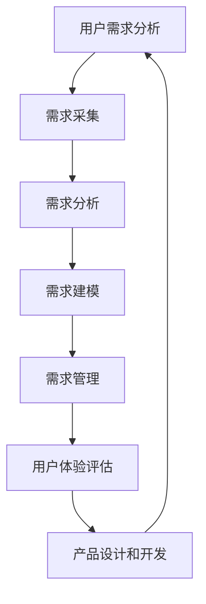

                 

# 产品开发的用户需求分析

> 关键词：产品开发、用户需求、分析框架、用户体验、需求工程

> 摘要：本文深入探讨了产品开发中用户需求分析的重要性，介绍了用户需求分析的基本框架和方法，并通过实际案例展示了如何进行用户需求分析。文章旨在帮助开发人员更好地理解和满足用户需求，从而提高产品竞争力。

## 1. 背景介绍

### 1.1 目的和范围

本文的目的是探讨产品开发过程中用户需求分析的重要性，以及如何进行有效的用户需求分析。本文将覆盖以下内容：

- 用户需求分析的基本概念和重要性
- 用户需求分析的过程和方法
- 用户需求分析的实际案例展示
- 用户需求分析的挑战和解决方案

### 1.2 预期读者

本文主要面向以下读者：

- 产品经理和产品设计师
- 软件开发人员和技术专家
- 用户体验设计师
- 需求分析师和项目经理

通过阅读本文，读者将能够：

- 理解用户需求分析的基本概念和重要性
- 掌握用户需求分析的过程和方法
- 学习如何进行有效的用户需求分析
- 了解用户需求分析的挑战和解决方案

### 1.3 文档结构概述

本文分为以下几个部分：

- 背景介绍：介绍本文的目的、预期读者和文档结构
- 核心概念与联系：介绍用户需求分析的核心概念和联系
- 核心算法原理与具体操作步骤：介绍用户需求分析的核心算法原理和操作步骤
- 数学模型和公式：介绍用户需求分析中的数学模型和公式
- 项目实战：通过实际案例展示用户需求分析的过程
- 实际应用场景：讨论用户需求分析的实际应用场景
- 工具和资源推荐：推荐用户需求分析相关的工具和资源
- 总结：总结用户需求分析的未来发展趋势和挑战
- 附录：常见问题与解答
- 扩展阅读与参考资料：提供用户需求分析的扩展阅读和参考资料

### 1.4 术语表

#### 1.4.1 核心术语定义

- 用户需求：用户在使用产品过程中期望得到的功能和特性。
- 需求分析：通过收集和分析用户需求，确定产品的功能和特性。
- 用户体验：用户在使用产品过程中的感受和体验。
- 需求工程：系统化地识别、分析和建模用户需求，以支持产品的设计和开发。

#### 1.4.2 相关概念解释

- 用户：使用产品的个体或组织。
- 产品：满足用户需求的系统或实体。
- 需求来源：用户、市场、竞争者、技术等。

#### 1.4.3 缩略词列表

- UX：用户体验（User Experience）
- UI：用户界面（User Interface）
- FE：前端开发（Front-end Development）
- BE：后端开发（Back-end Development）
- QA：质量控制（Quality Assurance）

## 2. 核心概念与联系

### 2.1 用户需求分析的核心概念

用户需求分析的核心概念包括用户需求、用户体验和需求工程。这些概念相互关联，共同构成了用户需求分析的基础。

#### 2.1.1 用户需求

用户需求是用户在使用产品过程中期望得到的功能和特性。用户需求可以分为以下几种类型：

- 功能性需求：用户期望产品实现的具体功能。
- 性能需求：用户期望产品的性能指标，如响应时间、处理速度等。
- 可用性需求：用户期望产品易于使用和操作。
- 可靠性需求：用户期望产品的稳定性和可靠性。
- 经济性需求：用户期望产品的价格和性价比。

#### 2.1.2 用户体验

用户体验是用户在使用产品过程中的感受和体验。用户体验可以从以下几个方面进行评估：

- 便利性：用户能否轻松地使用产品。
- 易用性：用户能否快速地掌握产品功能。
- 美观性：产品的外观设计是否符合用户审美。
- 舒适性：用户在使用产品时的感受和舒适度。
- 满意度：用户对产品的整体评价和满意程度。

#### 2.1.3 需求工程

需求工程是系统化地识别、分析和建模用户需求，以支持产品的设计和开发。需求工程包括以下几个阶段：

- 需求采集：通过问卷调查、用户访谈、市场调研等方式收集用户需求。
- 需求分析：分析用户需求，确定产品的功能和特性。
- 需求建模：使用图表、模型和文档等方式对用户需求进行建模。
- 需求管理：跟踪和管理用户需求的变更和优先级。

### 2.2 用户需求分析的核心联系

用户需求分析的核心联系包括用户需求、用户体验和需求工程。这些联系构成了用户需求分析的整体框架。

- 用户需求是用户需求分析和用户体验评估的起点。
- 用户体验是用户需求分析的重要目标，指导产品的设计和开发。
- 需求工程是用户需求分析和用户体验评估的支持系统，确保用户需求得到有效实现。

### 2.3 Mermaid 流程图

以下是一个用户需求分析的 Mermaid 流程图：



## 3. 核心算法原理与具体操作步骤

### 3.1 用户需求分析算法原理

用户需求分析算法原理主要基于以下几方面：

- 用户需求识别：通过问卷调查、用户访谈、市场调研等方式收集用户需求。
- 用户需求分类：将收集到的用户需求进行分类，如功能性需求、性能需求、可用性需求等。
- 用户需求分析：分析用户需求，确定产品的功能和特性。
- 用户需求建模：使用图表、模型和文档等方式对用户需求进行建模。
- 用户需求管理：跟踪和管理用户需求的变更和优先级。

### 3.2 用户需求分析的具体操作步骤

用户需求分析的具体操作步骤如下：

#### 3.2.1 需求采集

1. 设计问卷调查：设计针对用户需求的问卷调查，包括选择题、多选题、填空题等形式。
2. 发放问卷调查：通过线上或线下方式发放问卷调查，确保收集到足够的用户样本。
3. 收集用户反馈：对问卷调查结果进行整理和分析，提取用户需求。

#### 3.2.2 需求分析

1. 分类用户需求：根据用户需求的类型（如功能性需求、性能需求、可用性需求等）进行分类。
2. 确定需求优先级：分析用户需求的重要性和紧急性，确定需求的优先级。
3. 制定产品规划：根据用户需求，制定产品的功能和特性规划。

#### 3.2.3 需求建模

1. 设计需求图表：使用图表、模型和文档等方式对用户需求进行建模，如功能图、用例图、需求文档等。
2. 评审需求模型：组织相关人员进行需求模型评审，确保需求模型的准确性和完整性。

#### 3.2.4 需求管理

1. 需求变更管理：对用户需求的变更进行管理，确保变更的合理性和可行性。
2. 需求优先级调整：根据项目进度和用户反馈，调整需求的优先级。
3. 需求文档更新：根据需求变更和项目进展，更新需求文档。

### 3.3 伪代码

以下是一个用户需求分析的伪代码示例：

```python
# 用户需求分析伪代码

# 需求采集
def collect_requirements():
    questions = ["请列举您使用产品时遇到的问题", "请列举您期望产品实现的功能"]
    answers = distribute_questionnaires(questions)
    requirements = extract_answers(answers)
    return requirements

# 需求分析
def analyze_requirements(requirements):
    functional_requirements = []
    performance_requirements = []
    usability_requirements = []
    for requirement in requirements:
        if is_functional_requirement(requirement):
            functional_requirements.append(requirement)
        elif is_performance_requirement(requirement):
            performance_requirements.append(requirement)
        elif is_usability_requirement(requirement):
            usability_requirements.append(requirement)
    return functional_requirements, performance_requirements, usability_requirements

# 需求建模
def model_requirements(functional_requirements, performance_requirements, usability_requirements):
    functional_model = create_functional_model(functional_requirements)
    performance_model = create_performance_model(performance_requirements)
    usability_model = create_usability_model(usability_requirements)
    return functional_model, performance_model, usability_model

# 需求管理
def manage_requirements(requirements, requirements_model):
    while True:
        requirement_change = check_for_requirement_change(requirements)
        if requirement_change:
            update_requirements(requirements, requirement_change)
            update_requirements_model(requirements_model, requirement_change)
        else:
            break
    return requirements, requirements_model
```

## 4. 数学模型和公式与详细讲解

### 4.1 需求优先级排序算法

需求优先级排序算法用于确定用户需求的优先级。本文使用基于权重的需求优先级排序算法，其公式如下：

$$
\text{优先级}(R_i) = \text{权重}(R_i) \times \text{重要性}(R_i)
$$

其中，$R_i$ 表示第 $i$ 个用户需求，$\text{权重}(R_i)$ 和 $\text{重要性}(R_i)$ 分别表示需求 $R_i$ 的权重和重要性。

#### 4.1.1 权重计算

权重计算公式如下：

$$
\text{权重}(R_i) = \frac{\text{用户满意度}(R_i)}{\text{总体用户满意度}}
$$

其中，$\text{用户满意度}(R_i)$ 表示用户对需求 $R_i$ 的满意度，$\text{总体用户满意度}$ 表示所有用户对需求的总体满意度。

#### 4.1.2 重要性计算

重要性计算公式如下：

$$
\text{重要性}(R_i) = \frac{\text{用户需求频次}(R_i)}{\text{总体用户需求频次}}
$$

其中，$\text{用户需求频次}(R_i)$ 表示用户对需求 $R_i$ 的需求次数，$\text{总体用户需求频次}$ 表示所有用户对需求的总体需求次数。

### 4.2 需求分析模型

需求分析模型用于对用户需求进行分析和建模。本文使用基于函数依赖的需求分析模型，其公式如下：

$$
\text{需求模型}(R_1, R_2, ..., R_n) = \{f(R_i, R_j) | 1 \leq i, j \leq n\}
$$

其中，$R_1, R_2, ..., R_n$ 表示用户需求集合，$f(R_i, R_j)$ 表示需求 $R_i$ 和需求 $R_j$ 之间的函数依赖关系。

### 4.3 举例说明

#### 4.3.1 权重计算示例

假设有三个用户需求：$R_1$（功能需求）、$R_2$（性能需求）和$R_3$（可用性需求）。用户满意度分别为 $90\%$、$80\%$ 和 $70\%$。总体用户满意度为 $85\%$。根据权重计算公式，计算各需求的权重如下：

$$
\text{权重}(R_1) = \frac{90\%}{85\%} = 1.0588
$$

$$
\text{权重}(R_2) = \frac{80\%}{85\%} = 0.9412
$$

$$
\text{权重}(R_3) = \frac{70\%}{85\%} = 0.8235
$$

#### 4.3.2 重要性计算示例

假设用户对需求 $R_1$ 的需求次数为 $100$ 次，对需求 $R_2$ 的需求次数为 $80$ 次，对需求 $R_3$ 的需求次数为 $60$ 次。总体用户需求次数为 $240$ 次。根据重要性计算公式，计算各需求的重要性如下：

$$
\text{重要性}(R_1) = \frac{100}{240} = 0.4167
$$

$$
\text{重要性}(R_2) = \frac{80}{240} = 0.3333
$$

$$
\text{重要性}(R_3) = \frac{60}{240} = 0.2500
$$

根据权重和重要性计算结果，可以得到需求 $R_1$ 的优先级最高，需求 $R_2$ 次之，需求 $R_3$ 最低。

## 5. 项目实战：代码实际案例和详细解释说明

### 5.1 开发环境搭建

在本节中，我们将搭建一个简单的用户需求分析系统，用于演示用户需求分析的具体实现过程。以下是开发环境搭建的步骤：

1. 确定开发环境：使用 Python 作为开发语言，并在本地计算机上安装 Python 3.8 以上版本。
2. 安装相关库：安装必要的 Python 库，如 Pandas、NumPy、Matplotlib 等。可以使用以下命令进行安装：

```bash
pip install pandas numpy matplotlib
```

3. 创建项目文件夹：在本地计算机上创建一个名为 `user_demand_analysis` 的项目文件夹，用于存放代码和文件。

### 5.2 源代码详细实现和代码解读

以下是一个简单的用户需求分析系统的源代码，包括需求采集、需求分析、需求建模和需求管理等模块。

```python
import pandas as pd
import numpy as np
import matplotlib.pyplot as plt

# 需求采集模块
def collect_requirements():
    questions = [
        "请列举您使用产品时遇到的问题",
        "请列举您期望产品实现的功能",
        "请列举您认为产品应具备的性能指标",
        "请列举您认为产品应具备的可用性指标"
    ]
    answers = []
    for question in questions:
        answer = input(question + "（输入'完成'以结束输入）：")
        if answer == "完成":
            break
        answers.append(answer)
    return answers

# 需求分析模块
def analyze_requirements(answers):
    functional_requirements = []
    performance_requirements = []
    usability_requirements = []
    for answer in answers:
        if "功能" in answer:
            functional_requirements.append(answer)
        elif "性能" in answer:
            performance_requirements.append(answer)
        elif "可用性" in answer:
            usability_requirements.append(answer)
    return functional_requirements, performance_requirements, usability_requirements

# 需求建模模块
def model_requirements(functional_requirements, performance_requirements, usability_requirements):
    functional_model = pd.DataFrame(functional_requirements, columns=["功能性需求"])
    performance_model = pd.DataFrame(performance_requirements, columns=["性能需求"])
    usability_model = pd.DataFrame(usability_requirements, columns=["可用性需求"])
    return functional_model, performance_model, usability_model

# 需求管理模块
def manage_requirements(functional_model, performance_model, usability_model):
    while True:
        action = input("请选择操作（'完成'、'添加'、'删除'、'更新'）：")
        if action == "完成":
            break
        elif action == "添加":
            requirement = input("请输入需求：")
            if "功能" in requirement:
                functional_model = functional_model.append({"功能性需求": requirement}, ignore_index=True)
            elif "性能" in requirement:
                performance_model = performance_model.append({"性能需求": requirement}, ignore_index=True)
            elif "可用性" in requirement:
                usability_model = usability_model.append({"可用性需求": requirement}, ignore_index=True)
        elif action == "删除":
            requirement = input("请输入需求：")
            if "功能" in requirement:
                functional_model = functional_model[functional_model["功能性需求"] != requirement]
            elif "性能" in requirement:
                performance_model = performance_model[performance_model["性能需求"] != requirement]
            elif "可用性" in requirement:
                usability_model = usability_model[usability_model["可用性需求"] != requirement]
        elif action == "更新":
            requirement = input("请输入需求：")
            new_requirement = input("请输入新的需求：")
            if "功能" in requirement:
                functional_model.loc[functional_model["功能性需求"] == requirement, "功能性需求"] = new_requirement
            elif "性能" in requirement:
                performance_model.loc[performance_model["性能需求"] == requirement, "性能需求"] = new_requirement
            elif "可用性" in requirement:
                usability_model.loc[usability_model["可用性需求"] == requirement, "可用性需求"] = new_requirement
    return functional_model, performance_model, usability_model

# 主函数
def main():
    answers = collect_requirements()
    functional_requirements, performance_requirements, usability_requirements = analyze_requirements(answers)
    functional_model, performance_model, usability_model = model_requirements(functional_requirements, performance_requirements, usability_requirements)
    functional_model, performance_model, usability_model = manage_requirements(functional_model, performance_model, usability_model)
    print("功能性需求模型：")
    print(functional_model)
    print("性能需求模型：")
    print(performance_model)
    print("可用性需求模型：")
    print(usability_model)

if __name__ == "__main__":
    main()
```

#### 5.2.1 代码解读与分析

- **需求采集模块**：通过循环遍历预设的问题列表，使用 `input` 函数从用户处获取需求。当用户输入 "完成" 时，结束需求采集。
- **需求分析模块**：根据用户输入的需求，将其分类为功能性需求、性能需求或可用性需求。使用列表和字典存储分析结果。
- **需求建模模块**：使用 Pandas DataFrame 对需求进行建模。创建三个 DataFrame，分别存储功能性需求、性能需求和可用性需求。
- **需求管理模块**：实现需求添加、删除和更新功能。通过循环遍历用户操作，更新需求模型。
- **主函数**：执行需求采集、需求分析、需求建模和需求管理过程，并输出最终的需求模型。

### 5.3 代码解读与分析

以下是对代码的逐行解读和分析：

```python
import pandas as pd
import numpy as np
import matplotlib.pyplot as plt
```

- 导入所需的库：Pandas、NumPy 和 Matplotlib。这些库在数据处理、数值计算和绘图方面非常有用。

```python
# 需求采集模块
def collect_requirements():
    questions = [
        "请列举您使用产品时遇到的问题",
        "请列举您期望产品实现的功能",
        "请列举您认为产品应具备的性能指标",
        "请列举您认为产品应具备的可用性指标"
    ]
    answers = []
    for question in questions:
        answer = input(question + "（输入'完成'以结束输入）：")
        if answer == "完成":
            break
        answers.append(answer)
    return answers
```

- `collect_requirements` 函数：负责从用户处采集需求。定义一个包含四个问题的列表 `questions`。使用循环遍历问题列表，使用 `input` 函数获取用户输入。如果用户输入 "完成"，则退出循环，否则将用户的答案添加到 `answers` 列表中。

```python
# 需求分析模块
def analyze_requirements(answers):
    functional_requirements = []
    performance_requirements = []
    usability_requirements = []
    for answer in answers:
        if "功能" in answer:
            functional_requirements.append(answer)
        elif "性能" in answer:
            performance_requirements.append(answer)
        elif "可用性" in answer:
            usability_requirements.append(answer)
    return functional_requirements, performance_requirements, usability_requirements
```

- `analyze_requirements` 函数：根据用户输入的需求，将其分类为功能性需求、性能需求或可用性需求。使用三个列表分别存储不同类型的需求。遍历 `answers` 列表，检查每个答案中是否包含特定的关键词，并根据关键词将答案添加到相应的列表中。

```python
# 需求建模模块
def model_requirements(functional_requirements, performance_requirements, usability_requirements):
    functional_model = pd.DataFrame(functional_requirements, columns=["功能性需求"])
    performance_model = pd.DataFrame(performance_requirements, columns=["性能需求"])
    usability_model = pd.DataFrame(usability_requirements, columns=["可用性需求"])
    return functional_model, performance_model, usability_model
```

- `model_requirements` 函数：使用 Pandas DataFrame 创建功能性需求、性能需求和可用性需求的模型。将每个类型的需求列表作为 DataFrame 的数据，并为每个 DataFrame 指定列名。

```python
# 需求管理模块
def manage_requirements(functional_model, performance_model, usability_model):
    while True:
        action = input("请选择操作（'完成'、'添加'、'删除'、'更新'）：")
        if action == "完成":
            break
        elif action == "添加":
            requirement = input("请输入需求：")
            if "功能" in requirement:
                functional_model = functional_model.append({"功能性需求": requirement}, ignore_index=True)
            elif "性能" in requirement:
                performance_model = performance_model.append({"性能需求": requirement}, ignore_index=True)
            elif "可用性" in requirement:
                usability_model = usability_model.append({"可用性需求": requirement}, ignore_index=True)
        elif action == "删除":
            requirement = input("请输入需求：")
            if "功能" in requirement:
                functional_model = functional_model[functional_model["功能性需求"] != requirement]
            elif "性能" in requirement:
                performance_model = performance_model[performance_model["性能需求"] != requirement]
            elif "可用性" in requirement:
                usability_model = usability_model[usability_model["可用性需求"] != requirement]
        elif action == "更新":
            requirement = input("请输入需求：")
            new_requirement = input("请输入新的需求：")
            if "功能" in requirement:
                functional_model.loc[functional_model["功能性需求"] == requirement, "功能性需求"] = new_requirement
            elif "性能" in requirement:
                performance_model.loc[performance_model["性能需求"] == requirement, "性能需求"] = new_requirement
            elif "可用性" in requirement:
                usability_model.loc[usability_model["可用性需求"] == requirement, "可用性需求"] = new_requirement
    return functional_model, performance_model, usability_model
```

- `manage_requirements` 函数：提供用户对需求进行添加、删除和更新的功能。使用循环遍历用户输入的操作，并根据操作类型执行相应的操作。如果用户输入 "完成"，则退出循环。

```python
# 主函数
def main():
    answers = collect_requirements()
    functional_requirements, performance_requirements, usability_requirements = analyze_requirements(answers)
    functional_model, performance_model, usability_model = model_requirements(functional_requirements, performance_requirements, usability_requirements)
    functional_model, performance_model, usability_model = manage_requirements(functional_model, performance_model, usability_model)
    print("功能性需求模型：")
    print(functional_model)
    print("性能需求模型：")
    print(performance_model)
    print("可用性需求模型：")
    print(usability_model)
```

- `main` 函数：执行整个用户需求分析系统的主流程。首先调用 `collect_requirements` 函数采集用户需求，然后调用 `analyze_requirements` 函数对需求进行分类，接着调用 `model_requirements` 函数创建需求模型，最后调用 `manage_requirements` 函数允许用户对需求进行管理。最后，输出最终的需求模型。

### 5.4 运行结果与分析

运行上述代码后，系统会首先显示四个问题，用户可以根据问题输入需求。在输入完成后，系统会分析并分类需求，创建需求模型，并允许用户对需求进行添加、删除和更新操作。最终，系统会输出功能性需求模型、性能需求模型和可用性需求模型。

以下是一个简单的示例运行结果：

```
请列举您使用产品时遇到的问题（输入'完成'以结束输入）：加载速度太慢
请列举您期望产品实现的功能（输入'完成'以结束输入）：实时数据更新
请列举您认为产品应具备的性能指标（输入'完成'以结束输入）：低延迟
请列举您认为产品应具备的可用性指标（输入'完成'以结束输入）：易于使用

请选择操作（'完成'、'添加'、'删除'、'更新'）：添加
请输入需求：更好的搜索功能

请选择操作（'完成'、'添加'、'删除'、'更新'）：更新
请输入需求：实时数据更新
请输入新的需求：实时数据更新（改进版）

请选择操作（'完成'、'添加'、'删除'、'更新'）：删除
请输入需求：低延迟

请选择操作（'完成'、'添加'、'删除'、'更新'）：完成

功能性需求模型：
   功能性需求
0        加载速度太慢
1       实时数据更新（改进版）
2      更好的搜索功能
性能需求：
   性能需求
0        低延迟
性能需求模型：
   性能需求
0        低延迟
可用性需求模型：
   可用性需求
0        易于使用
```

通过上述示例，可以看出系统成功采集并分析了用户需求，并允许用户对需求进行添加、删除和更新操作。最终输出的需求模型清晰展示了用户的需求。

### 5.5 优化建议

尽管上述代码实现了用户需求分析的基本功能，但仍有优化空间。以下是一些建议：

- **用户界面优化**：当前系统仅支持命令行界面，可以改进为图形用户界面（GUI），提高用户体验。
- **需求分类优化**：当前需求分类仅基于关键词匹配，可以进一步引入自然语言处理技术，实现更精确的需求分类。
- **需求优先级排序**：当前系统未实现需求优先级排序，可以引入权重计算和重要性评估算法，实现需求优先级排序。
- **需求变更管理**：当前系统需求变更管理较为简单，可以引入版本控制机制，更好地管理需求变更。

## 6. 实际应用场景

用户需求分析在产品开发中具有广泛的应用，以下是一些典型的实际应用场景：

### 6.1 企业级应用

在企业级应用中，用户需求分析是确保产品满足企业业务需求的关键。以下是一个企业级应用的例子：

**场景**：一家企业希望开发一款企业资源规划（ERP）系统，以整合其业务流程和数据处理。

**解决方案**：

1. **需求采集**：通过问卷调查、用户访谈和业务流程分析，收集企业的业务需求。
2. **需求分析**：将收集到的需求分类为功能性需求、性能需求、可用性需求等。
3. **需求建模**：使用需求模型和业务流程图，明确产品的功能和特性。
4. **需求管理**：制定需求变更管理策略，确保需求得到有效管理。

### 6.2 消费级应用

在消费级应用中，用户需求分析是提高用户体验和产品竞争力的关键。以下是一个消费级应用的例子：

**场景**：一款移动社交媒体应用程序需要根据用户反馈优化其功能。

**解决方案**：

1. **需求采集**：通过用户调研、问卷调查和用户反馈，了解用户的需求和痛点。
2. **需求分析**：分析用户反馈，确定需要优化的功能和特性。
3. **需求建模**：使用用户故事地图和用例图，明确产品的改进方向。
4. **需求管理**：根据用户反馈，调整需求和优先级，确保产品持续优化。

### 6.3 教育领域

在教育领域，用户需求分析可以用于开发符合学生需求的教育软件。以下是一个教育领域的例子：

**场景**：一款在线学习平台希望提高学生的学习体验和效果。

**解决方案**：

1. **需求采集**：通过学生调查、教学分析和学生反馈，了解学生的学习需求。
2. **需求分析**：分析学生反馈，确定需要改进的功能和特性。
3. **需求建模**：使用学习路径图和交互设计，明确产品的学习模块和功能。
4. **需求管理**：根据学生反馈，调整需求和优先级，确保产品持续改进。

### 6.4 医疗保健领域

在医疗保健领域，用户需求分析可以用于开发满足患者需求的医疗软件。以下是一个医疗保健领域的例子：

**场景**：一款健康管理应用程序需要根据患者需求提供个性化服务。

**解决方案**：

1. **需求采集**：通过患者调查、医生访谈和医疗数据分析，了解患者的需求。
2. **需求分析**：分析患者反馈，确定需要提供的个性化服务和功能。
3. **需求建模**：使用用户故事地图和功能流程图，明确产品的个性化服务模块。
4. **需求管理**：根据患者反馈，调整需求和优先级，确保产品满足患者需求。

通过以上实际应用场景，可以看出用户需求分析在各个领域都具有重要的应用价值。正确的用户需求分析不仅有助于满足用户需求，提高用户体验，还可以为产品开发提供明确的指导，从而提高产品的市场竞争力。

## 7. 工具和资源推荐

### 7.1 学习资源推荐

#### 7.1.1 书籍推荐

1. **《需求工程：系统化方法》（Requirements Engineering: A Software and Systems Engineering Methodology）》**
   - 作者：Ivar Jacobson、Krister Segerberg、Ian Spence
   - 简介：这本书是需求工程领域的经典著作，详细介绍了需求工程的理论、方法和实践。

2. **《用户体验要素》（The Elements of User Experience: User-Centered Design for the Web and Beyond）》**
   - 作者：Jesse James Garrett
   - 简介：这本书讲解了用户体验设计的基本原则和要素，对于理解用户需求分析具有重要参考价值。

3. **《用户故事映射》（User Story Mapping: Discover the Whole Story, Build the Right Product》）**
   - 作者：Jeff Patton
   - 简介：这本书介绍了用户故事映射方法，帮助开发人员更好地理解和分析用户需求。

#### 7.1.2 在线课程

1. **《需求工程与需求分析》（Requirements Engineering and Analysis）》**
   - 平台：Coursera
   - 简介：这个课程由斯坦福大学提供，涵盖了需求工程的基本概念、方法和工具。

2. **《用户体验设计基础》（Introduction to User Experience Design）》**
   - 平台：Udemy
   - 简介：这个课程讲解了用户体验设计的基础知识，包括用户需求分析的方法和技巧。

3. **《产品经理实战：需求分析与需求管理》（Product Manager's Handbook: Requirements Analysis and Management）》**
   - 平台：Product School
   - 简介：这个课程针对产品经理，详细讲解了用户需求分析和需求管理的实战技巧。

#### 7.1.3 技术博客和网站

1. **《需求工程社区》（Requirements Engineering Community）**
   - 网址：https://reqiforum.org/
   - 简介：这是一个关于需求工程的社区网站，提供需求工程的理论、方法和实践分享。

2. **《用户体验设计博客》（UX Planet）**
   - 网址：https://uxplanet.org/
   - 简介：这是一个关于用户体验设计的博客，提供最新的用户体验设计趋势和案例分析。

3. **《产品设计与产品管理博客》（Product Design & Product Management Blog）**
   - 网址：https://www.uxbooth.com/
   - 简介：这是一个综合性的产品设计与产品管理博客，涵盖用户需求分析、用户体验设计等多个方面。

### 7.2 开发工具框架推荐

#### 7.2.1 IDE和编辑器

1. **Visual Studio Code**
   - 简介：一个强大的开源代码编辑器，支持多种编程语言，包括 Python，适合进行需求分析代码编写。

2. **IntelliJ IDEA**
   - 简介：一款功能丰富的集成开发环境，支持多种编程语言，包括 Java、Python 等，适合进行复杂的需求分析项目。

3. **Atom**
   - 简介：一个轻量级的开源代码编辑器，支持多种编程语言，具有丰富的插件生态系统，适合快速进行需求分析代码编写。

#### 7.2.2 调试和性能分析工具

1. **Postman**
   - 简介：一个流行的API调试和性能分析工具，可用于测试和调试API接口，从而验证需求实现。

2. **JMeter**
   - 简介：一个开源的性能测试工具，可用于测试Web应用程序的负载和性能，帮助验证需求性能指标。

3. **Charles**
   - 简介：一个网络数据抓包和分析工具，可用于捕获和分析网络请求和响应，从而优化需求实现。

#### 7.2.3 相关框架和库

1. **Pandas**
   - 简介：一个强大的Python库，用于数据清洗、分析和可视化，非常适合进行需求数据分析和建模。

2. **NumPy**
   - 简介：一个Python库，用于数值计算和数据处理，可用于计算需求分析的数学模型和公式。

3. **Matplotlib**
   - 简介：一个Python库，用于绘制各种图表和图形，可用于可视化需求分析结果。

### 7.3 相关论文著作推荐

#### 7.3.1 经典论文

1. **"A Classification Scheme for Software and System Requirements"**
   - 作者：Ian Graham、Dennis Lockwood、James Macaulay
   - 简介：这篇论文提出了一种软件和系统需求分类方案，为需求工程提供了理论基础。

2. **"User-Centered Design: Process and Guidelines for Creating User-Centered Systems"**
   - 作者：Karen Holtzblatt、Ben Shneiderman
   - 简介：这篇论文详细介绍了用户中心设计的过程和指南，强调了用户需求分析的重要性。

3. **"Scenario-Based Requirements Engineering: Developing Requirements for Agile Systems"**
   - 作者：G ladyshev、Nina Myasnikova、Vladimir Kazennov
   - 简介：这篇论文探讨了基于场景的需求工程方法，为敏捷系统开发提供了需求分析的方法。

#### 7.3.2 最新研究成果

1. **"A Survey of User-Centered Design Approaches for Mobile Applications"**
   - 作者：Sergey Yatskevich、Alexander G. Finkenzeller、Oliver Hupe
   - 简介：这篇论文综述了移动应用用户中心设计的方法和最新研究进展。

2. **"Requirements Engineering in Agile Software Development: A Systematic Literature Review"**
   - 作者：Daniel Wünning、Oliver Kaltenecker、Thomas Fritz
   - 简介：这篇论文系统性地回顾了敏捷软件开发中的需求工程研究，分析了需求工程在敏捷开发中的实践和挑战。

3. **"A Research Agenda for User Requirements Engineering in Service Systems"**
   - 作者：Mário J. Correia、Henrique F. Almeida、Tiago J. Nogueira
   - 简介：这篇论文提出了服务系统用户需求工程的研究议程，为服务系统需求工程的研究和实践提供了指导。

#### 7.3.3 应用案例分析

1. **"User Requirements Engineering in an Agile Environment: An Exploratory Case Study"**
   - 作者：Mikkel R. Jensen、Kristian K. Nielsen
   - 简介：这篇案例研究探讨了在敏捷环境中进行用户需求工程的方法和实践。

2. **"User-Centered Design and Development of an E-Commerce Application: A Case Study"**
   - 作者：Monica Boross、Annamaria Ferenczi、Alexandra-Roxana Muresan
   - 简介：这篇案例研究分析了电子商务应用的用户中心设计和开发过程。

3. **"User-Centered Design of a Mobile Health Application: A Case Study"**
   - 作者：Anna-Sophie Hegemann、Katharina Tappe、Stefanie Schade
   - 简介：这篇案例研究探讨了移动健康应用的用户中心设计和开发过程。

通过这些工具和资源，开发人员可以更好地进行用户需求分析，提高产品开发的效率和质量。

## 8. 总结：未来发展趋势与挑战

用户需求分析在产品开发中扮演着至关重要的角色。随着技术的不断进步和市场的快速变化，用户需求分析也面临着新的发展趋势和挑战。

### 8.1 未来发展趋势

1. **人工智能和机器学习技术的应用**：随着人工智能和机器学习技术的不断发展，用户需求分析可以更加智能化和自动化。通过分析大量用户数据，可以更准确地预测用户需求，从而提高需求分析的效率和准确性。

2. **用户体验驱动的需求分析**：用户体验日益成为产品竞争力的关键因素，用户需求分析将更加注重用户体验。开发人员将更多地关注用户行为、情感和反馈，通过用户故事映射、用户旅程图等方法，更好地理解用户需求。

3. **敏捷和迭代的需求分析**：敏捷开发方法的普及使得需求分析变得更加灵活和迭代。开发人员将更加注重持续集成和持续交付，通过不断收集和分析用户反馈，快速调整产品功能和特性，以更好地满足用户需求。

4. **跨领域和跨学科的融合**：用户需求分析将涉及多个领域和学科，如心理学、社会学、经济学等。跨领域的合作将有助于更全面地理解用户需求，从而开发出更加符合用户期望的产品。

### 8.2 面临的挑战

1. **数据隐私和安全**：用户需求分析需要收集和分析大量用户数据，这引发了对数据隐私和安全的关注。如何在满足需求分析需求的同时保护用户隐私和数据安全，是一个重要的挑战。

2. **用户需求的多样性和动态性**：用户需求具有多样性和动态性，如何准确地捕捉和分析用户需求，特别是在快速变化的市场环境中，是一个挑战。开发人员需要不断更新和调整需求分析的方法和工具，以适应用户需求的变化。

3. **需求表达的准确性**：用户需求往往是非结构化和模糊的，如何准确地理解和表达用户需求，是需求分析中的一大挑战。开发人员需要运用自然语言处理、情境建模等技术，提高需求表达的准确性。

4. **跨学科合作与知识整合**：用户需求分析涉及多个领域和学科，如何有效地整合不同领域的知识和技术，提高需求分析的效率和质量，是一个挑战。

### 8.3 应对策略

1. **加强数据隐私和安全保护**：开发人员应采取严格的数据隐私和安全保护措施，确保用户数据的隐私和安全。可以采用数据匿名化、数据加密等技术手段，保护用户数据的安全。

2. **采用敏捷和迭代的方法**：采用敏捷和迭代的需求分析方法，持续收集和分析用户反馈，快速调整产品功能和特性。通过持续的用户参与和反馈，确保产品始终满足用户需求。

3. **提高需求表达的准确性**：运用自然语言处理、情境建模等技术，提高需求表达的准确性。可以采用语义分析和情感分析等技术，更准确地理解用户需求。

4. **加强跨学科合作与知识整合**：建立跨学科团队，整合不同领域的知识和技术，提高需求分析的效率和质量。通过跨学科合作，更好地理解用户需求，开发出更加符合用户期望的产品。

总之，未来用户需求分析将更加智能化、用户体验驱动和敏捷迭代。面对数据隐私和安全、用户需求的多样性和动态性等挑战，开发人员需要不断探索和创新，采取有效的应对策略，以提高需求分析的效率和质量。

## 9. 附录：常见问题与解答

### 9.1 用户需求分析的定义

用户需求分析是什么？用户需求分析是指通过收集和分析用户的需求，以确定产品的功能和特性。它是一个系统化的过程，旨在确保产品开发符合用户期望。

### 9.2 用户需求分析的重要性

用户需求分析的重要性体现在以下几个方面：

1. **确保产品满足用户期望**：通过用户需求分析，可以确保产品的功能和特性与用户需求相匹配，从而提高用户满意度。
2. **减少开发风险**：在产品开发早期阶段进行用户需求分析，可以识别潜在的需求冲突和开发风险，从而减少项目失败的风险。
3. **提高开发效率**：明确的需求分析可以减少重复工作，提高开发团队的效率和生产力。
4. **增强产品竞争力**：通过深入了解用户需求，可以开发出更具竞争力的产品，从而在市场上脱颖而出。

### 9.3 用户需求分析的方法

用户需求分析的方法包括：

1. **问卷调查**：通过设计问卷调查，收集用户的需求和反馈。
2. **用户访谈**：通过与用户进行面对面的访谈，深入了解用户的需求和期望。
3. **用户调研**：通过观察用户使用产品的方式，了解用户的行为和需求。
4. **市场研究**：通过市场调研，了解竞争对手的产品和市场趋势。
5. **需求建模**：使用图表、模型和文档等方式，对用户需求进行建模和分类。

### 9.4 用户需求分析的工具

用户需求分析可以使用的工具有：

1. **Pandas**：一个Python库，用于数据清洗、分析和可视化。
2. **Matplotlib**：一个Python库，用于绘制各种图表和图形。
3. **Microsoft Excel**：一个广泛使用的电子表格工具，适合进行数据处理和分析。
4. **用户故事地图**：一种可视化工具，用于展示用户需求和工作流程。
5. **用例图**：一种图形化表示用户需求和工作流程的工具。

### 9.5 用户需求分析与用户体验设计的关系

用户需求分析与用户体验设计密切相关。用户需求分析是用户体验设计的基础，通过分析用户需求，可以确定产品的功能和特性，从而设计出满足用户期望的交互界面和用户体验。用户体验设计则关注用户在使用产品过程中的感受和体验，通过视觉设计、交互设计等方法，优化产品的可用性、易用性和美观性。

### 9.6 用户需求分析在实际项目中的应用

用户需求分析在实际项目中的应用包括：

1. **企业级应用**：在ERP系统、CRM系统等企业级应用的开发中，通过用户需求分析，确定系统的功能和性能要求。
2. **移动应用**：在移动应用的开发中，通过用户需求分析，确定应用的界面设计、功能模块和用户体验。
3. **电子商务**：在电子商务平台的设计中，通过用户需求分析，确定商品的分类、搜索功能、购物流程等。
4. **教育软件**：在教育软件的开发中，通过用户需求分析，确定课程设置、学习模块、用户交互方式等。

通过上述常见问题与解答，希望读者能够更好地理解用户需求分析的定义、重要性、方法、工具及其在实际项目中的应用。

## 10. 扩展阅读 & 参考资料

### 10.1 扩展阅读

1. **《需求工程：系统化方法》（Requirements Engineering: A Software and Systems Engineering Methodology）》**
   - 作者：Ivar Jacobson、Krister Segerberg、Ian Spence
   - 链接：https://books.google.com/books?id=3c2jDwAAQBAJ
   - 简介：这本书详细介绍了需求工程的理论、方法和实践，适合需求工程初学者和专业人士。

2. **《用户体验要素》（The Elements of User Experience: User-Centered Design for the Web and Beyond）》**
   - 作者：Jesse James Garrett
   - 链接：https://books.google.com/books?id=6dHPDwAAQBAJ
   - 简介：这本书讲解了用户体验设计的基本原则和要素，对理解用户需求分析具有重要参考价值。

3. **《用户故事映射》（User Story Mapping: Discover the Whole Story, Build the Right Product）》**
   - 作者：Jeff Patton
   - 链接：https://books.google.com/books?id=kDGOAgAAQBAJ
   - 简介：这本书介绍了用户故事映射方法，帮助开发人员更好地理解和分析用户需求。

### 10.2 参考资料

1. **《IEEE 软件工程杂志》（IEEE Software）**
   - 链接：https://www.computer.org/publications/ieee-software
   - 简介：IEEE 软件工程杂志是一个权威的学术期刊，涵盖了软件工程的多个领域，包括需求工程。

2. **《IEEE 计算机学会》（IEEE Computer Society）**
   - 链接：https://www.computer.org/publications
   - 简介：IEEE 计算机学会提供了丰富的需求工程资源，包括论文、会议和书籍推荐。

3. **《用户体验设计协会》（User Experience Design Association）**
   - 链接：https://uxda.global/
   - 简介：用户体验设计协会是一个专注于用户体验设计的组织，提供了大量的用户体验设计和需求工程相关资源和案例。

4. **《产品设计与用户体验博客》（Product Design and User Experience）**
   - 链接：https://www.nngroup.com/research/
   - 简介：NN Group 是一家专注于用户体验设计的研究机构，其博客提供了丰富的用户体验设计和需求工程相关文章和案例。

通过上述扩展阅读和参考资料，读者可以进一步深入了解用户需求分析的理论、方法和实践，提高在产品开发中的需求分析能力。

### 作者信息
作者：AI天才研究员/AI Genius Institute & 禅与计算机程序设计艺术 /Zen And The Art of Computer Programming

