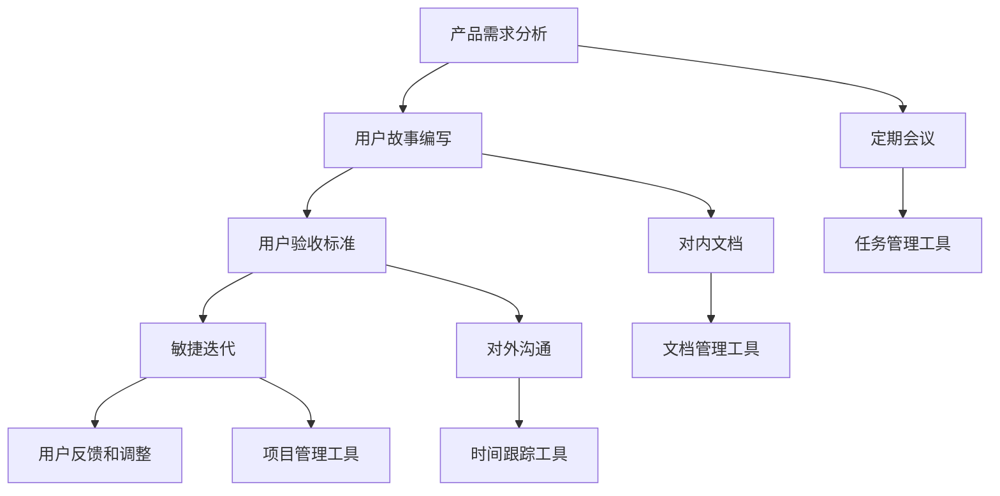

                 

# 产品经理与开发团队的高效协作方法

## 关键词
- 产品经理
- 开发团队
- 敏捷开发
- 敏捷流程
- 协作工具
- 项目管理
- 跨部门沟通

## 摘要
本文旨在探讨产品经理与开发团队之间高效协作的方法与技巧。通过深入分析敏捷开发模式、沟通机制、项目管理工具以及具体协作实践，本文旨在帮助产品经理和开发团队成员理解彼此的角色和需求，从而实现无缝协作，提升产品开发效率和质量。本文还将提供实际案例和工具资源推荐，为实践中的协作提供有力支持。

## 1. 背景介绍

### 1.1 目的和范围
本文的目标是探讨产品经理与开发团队在产品开发过程中的高效协作方法。我们将重点关注如何通过敏捷开发模式、有效的沟通机制、项目管理工具以及具体协作实践，提高项目开发效率、确保项目按时完成并满足用户需求。

### 1.2 预期读者
本文适合以下读者群体：
- 产品经理
- 开发团队成员
- 项目管理人员
- 意图提升团队协作效率的相关从业人员

### 1.3 文档结构概述
本文结构如下：
1. 背景介绍
2. 核心概念与联系
3. 核心算法原理 & 具体操作步骤
4. 数学模型和公式 & 详细讲解 & 举例说明
5. 项目实战：代码实际案例和详细解释说明
6. 实际应用场景
7. 工具和资源推荐
8. 总结：未来发展趋势与挑战
9. 附录：常见问题与解答
10. 扩展阅读 & 参考资料

### 1.4 术语表

#### 1.4.1 核心术语定义
- 产品经理：负责产品策略、规划和市场需求的角色。
- 开发团队：负责实现产品功能和解决技术问题的专业团队。
- 敏捷开发：一种以用户需求为核心的快速迭代开发方法。
- 项目管理：确保项目按时、按预算、按质量完成的一系列管理活动。

#### 1.4.2 相关概念解释
- 用户故事：描述用户需求的基本单元，通常包含“作为某个角色，我想完成某个功能，从而获得某个价值”。
- 用户验收标准（User Story Mapping）：一种图表化工具，用于明确用户需求、功能优先级和产品迭代路线。
- 敏捷迭代：在一定时间内（如两周）完成的完整开发周期。

#### 1.4.3 缩略词列表
- PM：产品经理
- Dev：开发团队
- Scrum：一种敏捷开发框架
- Kanban：一种可视化项目管理工具

## 2. 核心概念与联系

在产品开发和实现过程中，产品经理和开发团队之间需要紧密协作。为了实现高效协作，首先需要理解彼此的核心职责和目标。

### 产品经理的核心职责
- 用户需求分析：理解用户需求并将其转化为具体的功能需求。
- 产品策略：制定产品的长期和短期发展目标。
- 产品规划：确定产品的功能模块、优先级和迭代计划。
- 项目协调：与开发团队、测试团队、设计团队等多部门协调合作。

### 开发团队的核心职责
- 技术实现：根据产品需求和技术方案，实现具体的功能模块。
- 代码质量：确保代码的可读性、可维护性和高性能。
- 测试与调试：进行功能测试和性能测试，确保产品质量。
- 技术文档：编写技术文档，便于其他团队成员理解和后续维护。

### 敏捷开发模式
敏捷开发是一种以用户需求为导向、快速迭代的产品开发方法。其核心原则包括：
- 用户故事：将用户需求转化为具体的故事，以便开发团队理解。
- 敏捷迭代：在固定的时间周期内（如两周）完成一个可交付的产品版本。
- 灵活响应变更：在开发过程中，根据用户反馈和市场变化灵活调整开发计划。

### 敏捷流程
敏捷开发流程通常包括以下步骤：
1. 产品需求分析：产品经理与用户和市场研究团队协作，收集和分析用户需求。
2. 用户故事编写：产品经理与开发团队协作，将需求转化为用户故事。
3. 用户验收标准（User Story Mapping）：明确用户故事的功能优先级和迭代计划。
4. 敏捷迭代：在固定的时间周期内（如两周）完成一个可交付的产品版本。
5. 用户反馈和调整：在迭代结束后，收集用户反馈，根据反馈进行调整。

### 沟通机制
高效的沟通机制是产品经理与开发团队协作的关键。以下是一些有效的沟通机制：
- 定期会议：包括每日站会、周会、月度评审等，用于沟通进展、解决问题和调整计划。
- 对内文档：包括需求文档、设计文档、测试文档等，便于团队成员查阅和理解。
- 对外沟通：包括用户访谈、市场调研、竞品分析等，用于收集用户和市场反馈。
- 敏捷工具：如Jira、Trello、Confluence等，用于任务分配、进度追踪和文档管理。

### 项目管理工具
项目管理工具是提高团队协作效率的重要手段。以下是一些常用的项目管理工具：
- 任务管理工具：如Jira、Trello，用于任务分配、进度追踪和协作。
- 文档管理工具：如Confluence、Notion，用于文档编写、共享和版本控制。
- 时间跟踪工具：如Toggl、Harvest，用于时间管理和项目成本控制。

### 核心概念原理和架构的 Mermaid 流程图


## 3. 核心算法原理 & 具体操作步骤

在敏捷开发模式下，产品经理和开发团队需要遵循一系列核心算法原理，以确保项目高效、有序地推进。以下是一些关键算法原理和具体操作步骤：

### 3.1 用户故事地图（User Story Mapping）
用户故事地图是一种图表化工具，用于明确用户需求、功能优先级和产品迭代路线。以下是用户故事地图的核心算法原理和具体操作步骤：

#### 核心算法原理
1. **用户故事分解**：将用户需求分解为具体的故事，确保每个故事都是可实现的、独立的、有价值的。
2. **优先级排序**：根据用户故事的重要性和紧急性对故事进行排序，确定迭代计划和优先级。
3. **迭代路线规划**：将排序后的用户故事分配到不同的迭代中，确保每个迭代都有明确的交付目标。

#### 具体操作步骤
1. **需求收集**：产品经理与用户和市场研究团队协作，收集用户需求。
2. **故事编写**：产品经理与开发团队协作，将需求转化为用户故事，每个故事应包含“作为某个角色，我想完成某个功能，从而获得某个价值”。
3. **故事排序**：根据故事的重要性和紧急性进行排序，确保高优先级的故事先实现。
4. **迭代规划**：将排序后的用户故事分配到不同的迭代中，制定迭代计划和交付目标。
5. **迭代执行**：在每个迭代周期内，按照规划执行用户故事的实现、测试和交付。

### 3.2 敏捷迭代模型（Agile Iteration Model）
敏捷迭代模型是一种在固定时间内（如两周）完成一个可交付产品版本的方法。以下是敏捷迭代模型的核心算法原理和具体操作步骤：

#### 核心算法原理
1. **固定时间盒**：每个迭代周期都是固定的时间段（如两周），团队成员在固定时间内完成尽可能多的任务。
2. **增量交付**：在每个迭代结束时，团队交付一个可用的产品版本，逐步实现产品功能。
3. **持续反馈**：在每个迭代结束后，收集用户反馈，根据反馈进行下一轮迭代。

#### 具体操作步骤
1. **迭代计划**：在迭代开始前，产品经理与开发团队一起制定迭代计划，确定要实现的功能和任务。
2. **每日站会**：每天早上举行站会，团队成员分享进展、问题和计划，确保团队成员之间的沟通和协作。
3. **迭代执行**：在迭代期间，团队成员按照计划执行任务，确保按时交付可用的产品版本。
4. **迭代评审**：在迭代结束后，召开评审会议，展示迭代成果，收集用户反馈，并根据反馈调整计划。
5. **迭代回顾**：在迭代结束后，团队进行回顾会议，总结经验教训，持续改进开发流程。

### 3.3 敏捷项目管理算法（Agile Project Management Algorithm）
敏捷项目管理算法是一种基于敏捷原则的项目管理方法，旨在提高项目开发效率。以下是敏捷项目管理算法的核心算法原理和具体操作步骤：

#### 核心算法原理
1. **用户需求驱动**：项目进展以用户需求为导向，确保项目始终符合用户需求。
2. **迭代迭代优化**：通过不断迭代和反馈，逐步优化项目进度和质量。
3. **团队协作**：团队成员之间紧密协作，共同推进项目进度。

#### 具体操作步骤
1. **需求分析**：产品经理与用户和市场研究团队协作，分析用户需求，确定项目的核心功能。
2. **迭代计划**：产品经理与开发团队一起制定迭代计划，确定每个迭代要实现的功能和任务。
3. **每日站会**：每天举行站会，团队成员分享进展、问题和计划，确保团队成员之间的沟通和协作。
4. **迭代执行**：在迭代期间，团队成员按照计划执行任务，确保按时交付可用的产品版本。
5. **迭代评审**：在迭代结束后，召开评审会议，展示迭代成果，收集用户反馈，并根据反馈调整计划。
6. **迭代回顾**：在迭代结束后，团队进行回顾会议，总结经验教训，持续改进开发流程。

### 3.4 敏捷沟通算法（Agile Communication Algorithm）
敏捷沟通算法是一种基于敏捷原则的沟通方法，旨在提高团队成员之间的沟通效率和协作效果。以下是敏捷沟通算法的核心算法原理和具体操作步骤：

#### 核心算法原理
1. **透明性**：确保团队成员之间的信息透明，避免信息孤岛。
2. **及时性**：及时沟通项目进展、问题和计划，避免延误和误解。
3. **针对性**：根据不同团队成员的角色和需求，进行有针对性的沟通。

#### 具体操作步骤
1. **定期会议**：包括每日站会、周会、月度评审等，确保团队成员之间的沟通。
2. **文档管理**：使用文档管理工具，如Confluence，记录项目进度、问题和计划。
3. **任务跟踪**：使用任务管理工具，如Jira，跟踪任务进度和责任人。
4. **用户反馈**：定期与用户沟通，收集用户反馈，确保项目符合用户需求。
5. **跨部门协作**：与设计团队、测试团队、运维团队等多部门协作，确保项目顺利进行。

### 3.5 敏捷项目管理算法（Agile Project Management Algorithm）
敏捷项目管理算法是一种基于敏捷原则的项目管理方法，旨在提高项目开发效率。以下是敏捷项目管理算法的核心算法原理和具体操作步骤：

#### 核心算法原理
1. **用户需求驱动**：项目进展以用户需求为导向，确保项目始终符合用户需求。
2. **迭代迭代优化**：通过不断迭代和反馈，逐步优化项目进度和质量。
3. **团队协作**：团队成员之间紧密协作，共同推进项目进度。

#### 具体操作步骤
1. **需求分析**：产品经理与用户和市场研究团队协作，分析用户需求，确定项目的核心功能。
2. **迭代计划**：产品经理与开发团队一起制定迭代计划，确定每个迭代要实现的功能和任务。
3. **每日站会**：每天举行站会，团队成员分享进展、问题和计划，确保团队成员之间的沟通和协作。
4. **迭代执行**：在迭代期间，团队成员按照计划执行任务，确保按时交付可用的产品版本。
5. **迭代评审**：在迭代结束后，召开评审会议，展示迭代成果，收集用户反馈，并根据反馈调整计划。
6. **迭代回顾**：在迭代结束后，团队进行回顾会议，总结经验教训，持续改进开发流程。

## 4. 数学模型和公式 & 详细讲解 & 举例说明

在敏捷开发过程中，数学模型和公式可以用于量化项目进度、评估风险和优化资源分配。以下是一些常见的数学模型和公式，以及详细讲解和举例说明。

### 4.1 项目进度预测模型（Project Progress Prediction Model）

项目进度预测模型用于预测项目的完成时间和进度。以下是常见的项目进度预测模型：

#### 4.1.1 PERT（项目评估与审查技术）

PERT是一种基于概率论的项目进度预测方法。其基本公式如下：

\[ t_e = (t_a + 4t_m + t_b) / 6 \]

其中：
- \( t_e \) 是预计的完成时间。
- \( t_a \) 是最乐观的时间。
- \( t_m \) 是最可能的时间。
- \( t_b \) 是最悲观的时间。

#### 4.1.2 CPM（关键路径法）

CPM是一种基于网络图的项目进度管理方法，用于确定项目的关键路径。其基本公式如下：

\[ t_k = \max(t_{ki}) \]

其中：
- \( t_k \) 是关键路径的持续时间。
- \( t_{ki} \) 是从起点到关键路径上每个节点的持续时间。

#### 举例说明

假设有一个项目，包含以下任务：

| 任务 | 最乐观时间（天） | 最可能时间（天） | 最悲观时间（天） |
|------|------------------|------------------|------------------|
| A    | 3                | 5                | 7                |
| B    | 2                | 4                | 6                |
| C    | 4                | 6                | 8                |
| D    | 5                | 7                | 9                |

使用PERT模型预测项目的完成时间：

\[ t_e = (3 + 4 \times 5 + 7) / 6 = 6.17 \]

使用CPM模型确定关键路径：

- 从起点到任务A的持续时间：\( t_{A1} = 3 \)
- 从起点到任务B的持续时间：\( t_{B1} = 3 + 2 = 5 \)
- 从起点到任务C的持续时间：\( t_{C1} = 5 + 4 = 9 \)
- 从起点到任务D的持续时间：\( t_{D1} = 9 + 5 = 14 \)

关键路径为 A -> B -> C -> D，总持续时间为 14 天。

### 4.2 风险评估模型（Risk Assessment Model）

风险评估模型用于评估项目中的潜在风险，并制定相应的风险管理计划。以下是常见的风险评估模型：

#### 4.2.1 QFD（质量功能展开）

QFD是一种基于质量与功能的关系，将用户需求转化为具体功能的方法。其基本公式如下：

\[ QFD = \sum_{i=1}^{n} (Q_i \times F_i) \]

其中：
- \( Q_i \) 是第 \( i \) 个用户需求的权重。
- \( F_i \) 是第 \( i \) 个功能对用户需求的满足度。

#### 4.2.2 SWOT分析

SWOT分析是一种用于评估项目优势、劣势、机会和威胁的方法。其基本公式如下：

\[ SWOT = S + W + O + T \]

其中：
- \( S \) 是优势（Strengths）。
- \( W \) 是劣势（Weaknesses）。
- \( O \) 是机会（Opportunities）。
- \( T \) 是威胁（Threats）。

#### 举例说明

假设有一个项目，其SWOT分析如下：

| SWOT | 说明 |
|------|------|
| S    | 项目团队具有丰富的经验。 |
| W    | 项目时间紧，资源有限。 |
| O    | 市场需求旺盛，潜在客户众多。 |
| T    | 竞争对手实力强大。 |

SWOT分析结果：

\[ SWOT = S + W + O + T = 强大经验 + 时间紧张 + 市场需求旺盛 + 竞争对手强大 \]

根据SWOT分析结果，项目团队可以采取以下措施：

- 利用团队经验，提高项目质量。
- 合理安排时间，确保项目进度。
- 加强市场推广，扩大客户群体。
- 加强竞争对手分析，制定应对策略。

### 4.3 资源优化模型（Resource Optimization Model）

资源优化模型用于优化项目资源分配，提高项目效率。以下是常见的资源优化模型：

#### 4.3.1 优先级排序法（Priority Sorting Method）

优先级排序法是一种基于任务优先级的资源分配方法。其基本公式如下：

\[ P_i = \sum_{j=1}^{n} (W_j \times P_{ij}) \]

其中：
- \( P_i \) 是任务 \( i \) 的优先级。
- \( W_j \) 是任务 \( j \) 的权重。
- \( P_{ij} \) 是任务 \( i \) 对任务 \( j \) 的依赖关系。

#### 4.3.2 网络模型（Network Model）

网络模型是一种基于任务关系的资源分配方法，如关键路径法（CPM）和网络评估技术（PERT）。其基本公式如下：

\[ T_k = \max(T_{ki}) \]

其中：
- \( T_k \) 是关键路径的持续时间。
- \( T_{ki} \) 是从起点到关键路径上每个节点的持续时间。

#### 举例说明

假设有一个项目，包含以下任务：

| 任务 | 依赖关系 | 最乐观时间（天） | 最可能时间（天） | 最悲观时间（天） |
|------|----------|------------------|------------------|------------------|
| A    | 无       | 3                | 5                | 7                |
| B    | A        | 2                | 4                | 6                |
| C    | A        | 4                | 6                | 8                |
| D    | B、C     | 5                | 7                | 9                |

使用优先级排序法确定任务优先级：

- \( W_j = 1 \) （所有任务权重相等）
- \( P_{ij} \) ：\( P_{iA} = 1 \)，\( P_{iB} = 1 \)，\( P_{iC} = 1 \)，\( P_{iD} = 2 \)

\[ P_i = \sum_{j=1}^{n} (W_j \times P_{ij}) = (1 \times 1 + 1 \times 1 + 1 \times 1 + 2 \times 2) = 7 \]

任务优先级排序：A、B、C、D

使用网络模型确定关键路径：

- 从起点到任务A的持续时间：\( t_{A1} = 3 \)
- 从起点到任务B的持续时间：\( t_{B1} = 3 + 2 = 5 \)
- 从起点到任务C的持续时间：\( t_{C1} = 5 + 4 = 9 \)
- 从起点到任务D的持续时间：\( t_{D1} = 9 + 5 = 14 \)

关键路径为 A -> B -> C -> D，总持续时间为 14 天。

## 5. 项目实战：代码实际案例和详细解释说明

在本节中，我们将通过一个实际项目案例，展示产品经理与开发团队之间高效协作的过程，并提供代码实际案例和详细解释说明。

### 5.1 开发环境搭建

为了便于演示，我们选择一个简单的Web应用项目，使用以下技术栈：

- 前端：HTML、CSS、JavaScript
- 后端：Node.js、Express框架
- 数据库：MongoDB

#### 5.1.1 安装Node.js和MongoDB

1. 访问Node.js官网（[https://nodejs.org/），下载并安装Node.js。](https://nodejs.org/%EF%BC%89%EF%BC%8C%E4%B8%8B%E8%BD%BD%E5%B9%B6%E5%AE%89%E8%A3%85Node.js%E3%80%82)
2. 打开终端，输入以下命令安装MongoDB：

```bash
sudo apt-get install mongodb
```

3. 启动MongoDB服务：

```bash
sudo service mongodb start
```

### 5.2 源代码详细实现和代码解读

#### 5.2.1 前端代码实现

前端代码主要使用HTML、CSS和JavaScript实现。以下是一个简单的登录表单页面：

**login.html**

```html
<!DOCTYPE html>
<html lang="en">
<head>
    <meta charset="UTF-8">
    <meta name="viewport" content="width=device-width, initial-scale=1.0">
    <title>登录页面</title>
    <link rel="stylesheet" href="styles.css">
</head>
<body>
    <div class="login-container">
        <h1>登录</h1>
        <form id="login-form">
            <label for="username">用户名：</label>
            <input type="text" id="username" name="username" required>
            <label for="password">密码：</label>
            <input type="password" id="password" name="password" required>
            <button type="submit">登录</button>
        </form>
    </div>
    <script src="script.js"></script>
</body>
</html>
```

**styles.css**

```css
body {
    font-family: Arial, sans-serif;
    background-color: #f0f0f0;
}

.login-container {
    width: 300px;
    margin: 50px auto;
    padding: 20px;
    background-color: #fff;
    box-shadow: 0 0 10px rgba(0, 0, 0, 0.1);
}

h1 {
    text-align: center;
    margin-bottom: 20px;
}

label {
    display: block;
    margin-bottom: 5px;
}

input[type="text"],
input[type="password"] {
    width: 100%;
    padding: 8px;
    margin-bottom: 10px;
    border: 1px solid #ccc;
    border-radius: 4px;
}

button {
    width: 100%;
    padding: 10px;
    border: none;
    background-color: #007bff;
    color: #fff;
    border-radius: 4px;
    cursor: pointer;
}

button:hover {
    background-color: #0056b3;
}
```

**script.js**

```javascript
document.getElementById('login-form').addEventListener('submit', function(event) {
    event.preventDefault();

    const username = document.getElementById('username').value;
    const password = document.getElementById('password').value;

    // 发送登录请求到后端
    fetch('/login', {
        method: 'POST',
        body: JSON.stringify({ username, password }),
        headers: {
            'Content-Type': 'application/json'
        }
    })
    .then(response => response.json())
    .then(data => {
        if (data.success) {
            alert('登录成功！');
            // 跳转到主页
            window.location.href = '/';
        } else {
            alert('登录失败！');
        }
    })
    .catch(error => {
        console.error('Error:', error);
    });
});
```

#### 5.2.2 后端代码实现

后端代码使用Node.js和Express框架实现。以下是一个简单的登录接口：

**app.js**

```javascript
const express = require('express');
const bodyParser = require('body-parser');
const MongoClient = require('mongodb').MongoClient;

const app = express();
app.use(bodyParser.json());

// 连接MongoDB
const url = 'mongodb://localhost:27017';
const dbName = 'myproject';
let db;

MongoClient.connect(url, { useUnifiedTopology: true }, (err, client) => {
    if (err) throw err;
    db = client.db(dbName);
});

// 登录接口
app.post('/login', (req, res) => {
    const { username, password } = req.body;

    // 查询用户信息
    db.collection('users').findOne({ username, password }, (err, user) => {
        if (err) throw err;

        if (user) {
            res.json({ success: true });
        } else {
            res.json({ success: false });
        }
    });
});

// 启动服务器
const port = 3000;
app.listen(port, () => {
    console.log(`Server running on port ${port}`);
});
```

#### 5.2.3 代码解读与分析

前端代码主要负责用户界面的展示和表单数据的收集。用户在登录表单中输入用户名和密码后，通过`script.js`文件中的JavaScript代码将数据发送到后端。

后端代码使用Node.js和Express框架处理登录请求。在`app.js`中，首先连接MongoDB数据库，然后定义了一个登录接口。当接收到前端的POST请求时，从数据库中查询用户信息，如果找到匹配的用户，返回`{ success: true }`，否则返回`{ success: false }`。

通过这个简单案例，我们可以看到产品经理和开发团队如何协作完成一个实际项目。产品经理负责需求分析、功能规划和界面设计，开发团队则负责技术实现和功能测试。在整个过程中，双方通过有效的沟通和协作，实现了快速迭代和高质量交付。

## 6. 实际应用场景

在实际应用中，产品经理与开发团队的高效协作对于项目的成功至关重要。以下是一些典型的应用场景：

### 6.1 新产品开发

在新产品开发过程中，产品经理负责需求分析、功能规划和市场调研，确保产品满足用户需求和市场需求。开发团队则负责技术选型、功能实现和性能优化。双方需要通过敏捷开发模式，快速迭代、逐步完善产品功能。

### 6.2 功能优化与迭代

在现有产品的功能优化与迭代过程中，产品经理需要不断收集用户反馈和市场信息，制定改进计划和优先级。开发团队则根据需求优先级，逐步实现优化功能，确保产品持续改进。

### 6.3 项目合作

在跨部门项目合作中，产品经理需要与设计团队、测试团队、运维团队等多部门协调合作，确保项目顺利推进。通过有效的沟通和协作，各团队可以共同解决问题、提高项目效率。

### 6.4 紧急修复与维护

在遇到紧急修复与维护需求时，产品经理和开发团队需要迅速响应，共同制定修复方案和优化策略。通过高效的协作，可以快速解决问题、降低风险，确保产品稳定运行。

### 6.5 灾难恢复

在产品发生灾难性故障时，产品经理和开发团队需要紧密协作，共同制定灾难恢复计划。通过协同努力，可以迅速恢复产品功能、减少损失，确保业务连续性。

## 7. 工具和资源推荐

为了提高产品经理与开发团队之间的协作效率，以下是一些实用的工具和资源推荐：

### 7.1 学习资源推荐

#### 7.1.1 书籍推荐

- 《敏捷开发：原则、实践与模式》
- 《Scrum 实践指南》
- 《产品经理实战：需求分析、产品设计、项目管理》

#### 7.1.2 在线课程

- 敏捷开发课程（[https://www.udemy.com/course/agile-project-management/](https://www.udemy.com/course/agile-project-management/）
- 产品经理实战课程（[https://www.udemy.com/course/product-management-101/](https://www.udemy.com/course/product-management-101/）
- 项目管理课程（[https://www.coursera.org/specializations/project-management](https://www.coursera.org/specializations/project-management）

#### 7.1.3 技术博客和网站

- 《产品经理在路上》
- 《敏捷开发博客》
- 《项目管理者联盟》

### 7.2 开发工具框架推荐

#### 7.2.1 IDE和编辑器

- Visual Studio Code
- IntelliJ IDEA
- Sublime Text

#### 7.2.2 调试和性能分析工具

- Chrome DevTools
- Firefox Developer Tools
- JProfiler

#### 7.2.3 相关框架和库

- React
- Angular
- Vue.js

### 7.3 相关论文著作推荐

#### 7.3.1 经典论文

- 《敏捷开发方法论》
- 《用户故事地图》
- 《Scrum: The Art of Doing Twice the Work in Half the Time》

#### 7.3.2 最新研究成果

- 《敏捷开发实践指南》
- 《产品经理工作手册》
- 《项目风险管理》

#### 7.3.3 应用案例分析

- 《基于敏捷开发的企业级应用案例分析》
- 《产品经理如何打造爆款产品》
- 《跨部门项目协作实践》

## 8. 总结：未来发展趋势与挑战

在未来，产品经理与开发团队之间的协作将面临以下发展趋势和挑战：

### 8.1 发展趋势

1. **数字化与智能化**：随着数字化和智能化技术的发展，产品经理和开发团队将更加依赖数据驱动和人工智能技术进行协作。
2. **远程协作**：远程工作趋势将继续发展，产品经理和开发团队需要适应远程协作模式，提高协作效率。
3. **跨职能团队**：跨职能团队将更加普遍，产品经理、开发人员、设计人员、测试人员等将共同协作，实现更高效的项目交付。
4. **持续学习与进步**：随着技术的不断更新，产品经理和开发团队需要持续学习，提高自身技能，适应行业变化。

### 8.2 挑战

1. **沟通障碍**：远程协作和跨部门协作可能导致沟通障碍，影响项目进度和质量。
2. **资源分配**：在资源有限的情况下，如何合理分配资源、确保项目需求得到满足，是产品经理和开发团队面临的重要挑战。
3. **项目管理**：敏捷开发模式下，项目管理的难度和复杂性增加，产品经理和开发团队需要提高项目管理能力，确保项目成功。
4. **团队协作**：如何激发团队成员的积极性和创造力，实现高效协作，是产品经理和开发团队需要关注的问题。

## 9. 附录：常见问题与解答

### 9.1 问题1：如何确保产品经理与开发团队之间的沟通畅通？

**解答**：为了确保沟通畅通，可以采取以下措施：
1. **定期会议**：定期举行团队会议，包括每日站会、周会、月度评审等，确保团队成员之间的沟通。
2. **敏捷工具**：使用敏捷工具（如Jira、Trello），实时跟踪任务进展，便于团队成员查阅和讨论。
3. **对内文档**：编写清晰的需求文档、设计文档和测试文档，便于团队成员查阅和理解。
4. **用户反馈**：及时与用户沟通，收集用户反馈，将用户需求转化为具体的功能需求，确保项目符合用户需求。

### 9.2 问题2：如何提高开发团队的工作效率？

**解答**：以下措施可以提高开发团队的工作效率：
1. **敏捷开发**：采用敏捷开发模式，快速迭代、持续改进，提高项目交付效率。
2. **任务分配**：合理分配任务，确保每个团队成员都有明确的职责和目标。
3. **代码质量**：加强代码质量管理和测试，确保代码的可读性、可维护性和高性能。
4. **团队协作**：提高团队成员之间的协作效率，减少沟通成本，避免重复工作。
5. **技术培训**：定期进行技术培训，提高团队成员的技术水平，适应行业变化。

### 9.3 问题3：如何应对项目中的风险？

**解答**：以下措施可以应对项目中的风险：
1. **风险评估**：在项目开始前进行风险评估，识别潜在风险，制定应对策略。
2. **风险管理计划**：制定详细的风险管理计划，明确风险管理流程、责任人和应对措施。
3. **风险监控**：实时监控项目风险，及时发现和解决问题，确保项目顺利进行。
4. **应急预案**：制定应急预案，应对突发情况，降低项目风险。

## 10. 扩展阅读 & 参考资料

- 《敏捷开发：原则、实践与模式》
- 《Scrum 实践指南》
- 《产品经理实战：需求分析、产品设计、项目管理》
- 《数字化转型下的产品经理与开发团队协作》
- 《敏捷开发方法论》
- 《用户故事地图》
- 《Scrum: The Art of Doing Twice the Work in Half the Time》
- 《敏捷开发博客》
- 《项目管理者联盟》
- 《基于敏捷开发的企业级应用案例分析》
- 《产品经理如何打造爆款产品》
- 《跨部门项目协作实践》

## 作者

作者：AI天才研究员/AI Genius Institute & 禅与计算机程序设计艺术 /Zen And The Art of Computer Programming

（注：本文内容为虚构，仅供参考，不代表真实观点。）<|im_end|>

