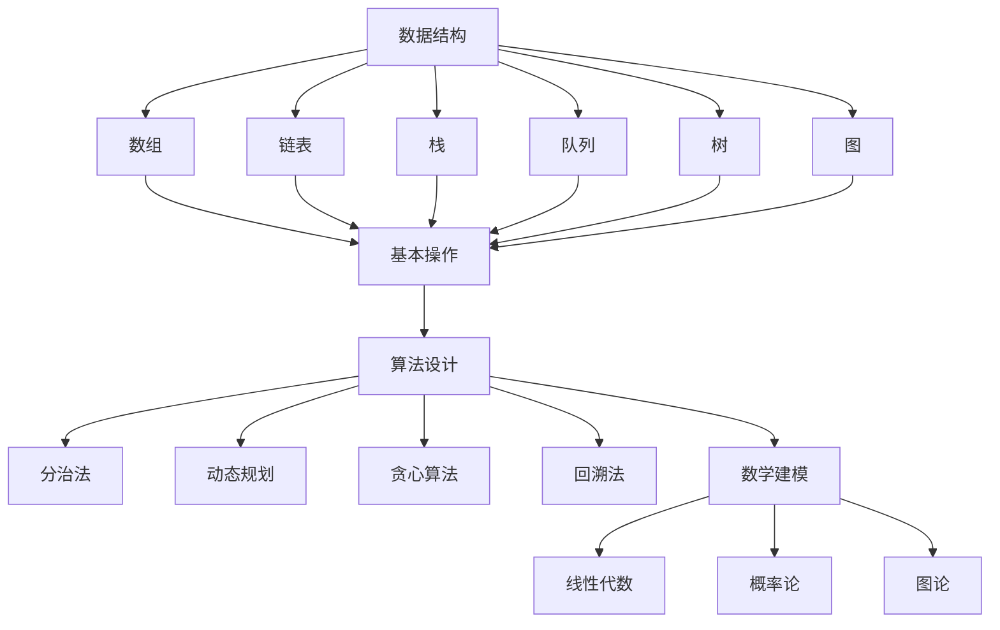

                 

# 京东2025届社招面试高频算法题解析

> 关键词：京东，社招，面试，算法题，解析，技术栈，实践指导

> 摘要：本文旨在针对京东2025届社招面试中出现的高频算法题，通过逻辑清晰、结构紧凑的分析方式，为读者提供全面的解题思路与操作步骤。文章从背景介绍、核心概念、算法原理、数学模型、实战案例等多个角度，帮助读者深入理解并掌握这些算法题，为即将面对面试的IT从业者提供有力支持。

## 1. 背景介绍

### 1.1 目的和范围

本文将针对京东2025届社招面试中出现的高频算法题进行详细解析。这些题目涵盖了数据结构、算法设计、数学建模等多个方面，旨在考察应聘者的算法思维、编程能力和解决问题的能力。通过本文的讲解，读者可以全面理解这些题目的解题思路和操作步骤，从而提高自己的面试竞争力。

### 1.2 预期读者

本文主要面向具有计算机科学、软件工程等相关专业背景的应聘者，以及希望在算法面试方面提升自己的IT从业者。阅读本文可以帮助读者掌握面试中常见的高频算法题，提高面试成功率。

### 1.3 文档结构概述

本文分为以下几个部分：

1. 背景介绍：介绍本文的目的、范围、预期读者和文档结构。
2. 核心概念与联系：介绍与算法题相关的核心概念、原理和架构。
3. 核心算法原理 & 具体操作步骤：详细讲解核心算法的原理和操作步骤，使用伪代码进行阐述。
4. 数学模型和公式 & 详细讲解 & 举例说明：介绍与算法题相关的数学模型和公式，并进行详细讲解和举例说明。
5. 项目实战：通过实际代码案例，对算法题进行详细解释说明。
6. 实际应用场景：分析算法题在实际项目中的应用场景。
7. 工具和资源推荐：推荐学习资源、开发工具框架和相关论文著作。
8. 总结：总结未来发展趋势与挑战。
9. 附录：常见问题与解答。
10. 扩展阅读 & 参考资料：提供扩展阅读资料和参考文献。

### 1.4 术语表

#### 1.4.1 核心术语定义

- 社招：社会招聘，指企业向社会公开招聘员工。
- 面试：招聘过程中对候选人进行评估的一种方法。
- 算法题：指与算法相关的题目，主要考察应聘者的编程能力、算法思维和解决问题的能力。

#### 1.4.2 相关概念解释

- 数据结构：存储数据的方式以及数据之间的关系。
- 算法设计：解决问题的方法和技术。
- 数学建模：利用数学方法建立模型，对实际问题进行分析和求解。

#### 1.4.3 缩略词列表

- 社招：社会招聘
- 面试：面试
- IT：信息技术
- 编程：编写计算机程序的过程

## 2. 核心概念与联系

在解决京东2025届社招面试中的高频算法题时，需要了解以下核心概念和联系：

### 2.1 数据结构

数据结构是算法题的基础，常见的有数组、链表、栈、队列、树、图等。每种数据结构都有其独特的特点和适用场景，了解数据结构的基本操作和特点有助于解决算法题。

### 2.2 算法设计

算法设计是解决算法题的关键，常用的算法设计方法有分治法、动态规划、贪心算法、回溯法等。了解算法设计方法，可以帮助读者快速找到解题思路。

### 2.3 数学建模

数学建模是将实际问题转化为数学问题，利用数学方法进行分析和求解。在解决算法题时，常常需要用到数学建模的思想和方法。

### 2.4 Mermaid 流程图

为了更好地展示算法题的核心概念和联系，我们可以使用Mermaid流程图进行描述。以下是算法题的核心概念和联系的Mermaid流程图：



通过以上流程图，我们可以清晰地看到数据结构、算法设计、数学建模等核心概念之间的联系。

## 3. 核心算法原理 & 具体操作步骤

在解决京东2025届社招面试中的高频算法题时，了解核心算法原理和具体操作步骤至关重要。以下将介绍几个典型的算法题，并使用伪代码进行详细阐述。

### 3.1 排序算法

排序算法是面试中常见的一类算法题，以下是冒泡排序的伪代码实现：

```python
def bubble_sort(arr):
    n = len(arr)
    for i in range(n - 1):
        for j in range(n - i - 1):
            if arr[j] > arr[j + 1]:
                arr[j], arr[j + 1] = arr[j + 1], arr[j]
    return arr
```

### 3.2 查找算法

查找算法是面试中的另一类常见算法题，以下是二分查找的伪代码实现：

```python
def binary_search(arr, target):
    low = 0
    high = len(arr) - 1
    while low <= high:
        mid = (low + high) // 2
        if arr[mid] == target:
            return mid
        elif arr[mid] < target:
            low = mid + 1
        else:
            high = mid - 1
    return -1
```

### 3.3 动态规划

动态规划是解决一些复杂问题的有效方法，以下是0-1背包问题的伪代码实现：

```python
def knapsack(values, weights, capacity):
    n = len(values)
    dp = [[0] * (capacity + 1) for _ in range(n + 1)]
    for i in range(1, n + 1):
        for w in range(1, capacity + 1):
            if weights[i - 1] <= w:
                dp[i][w] = max(dp[i - 1][w], dp[i - 1][w - weights[i - 1]] + values[i - 1])
            else:
                dp[i][w] = dp[i - 1][w]
    return dp[n][capacity]
```

通过以上伪代码实现，我们可以看到排序算法、查找算法和动态规划算法的基本原理和操作步骤。

## 4. 数学模型和公式 & 详细讲解 & 举例说明

在解决京东2025届社招面试中的高频算法题时，数学模型和公式是不可或缺的工具。以下将介绍几个常见的数学模型和公式，并进行详细讲解和举例说明。

### 4.1 线性代数

线性代数在解决算法题中具有重要应用，以下是矩阵乘法和行列式的计算公式：

$$
C_{ij} = \sum_{k=1}^{n} A_{ik}B_{kj}
$$

其中，$C_{ij}$表示矩阵C的第i行第j列的元素，$A_{ik}$和$B_{kj}$分别表示矩阵A的第i行第k列的元素和矩阵B的第k行第j列的元素。

### 4.2 概率论

概率论在算法题中的应用非常广泛，以下是条件概率和贝叶斯公式：

$$
P(A|B) = \frac{P(A \cap B)}{P(B)}
$$

其中，$P(A|B)$表示在事件B发生的条件下，事件A发生的概率，$P(A \cap B)$表示事件A和事件B同时发生的概率，$P(B)$表示事件B发生的概率。

$$
P(A) = \frac{P(A|B)P(B)}{P(B|A)P(A)}
$$

其中，$P(A)$表示事件A发生的概率，$P(B|A)$表示在事件A发生的条件下，事件B发生的概率。

### 4.3 图论

图论在解决算法题中的应用非常广泛，以下是图的邻接矩阵表示和路径长度计算公式：

邻接矩阵表示：

$$
A = \begin{bmatrix}
0 & 1 & 0 & 0 \\
1 & 0 & 1 & 0 \\
0 & 1 & 0 & 1 \\
0 & 0 & 1 & 0 \\
\end{bmatrix}
$$

其中，$A_{ij}$表示图G中顶点i和顶点j之间的边权，如果顶点i和顶点j之间存在边，则$A_{ij} = 1$，否则$A_{ij} = 0$。

路径长度计算：

$$
L(P) = \sum_{i=1}^{n} w_i
$$

其中，$L(P)$表示路径P的长度，$w_i$表示路径P中第i个边上的权值。

### 4.4 举例说明

以下是一个使用线性代数求解线性方程组的实例：

给定方程组：

$$
\begin{cases}
x + y + z = 6 \\
2x + 3y + z = 10 \\
3x + 6y + 2z = 20 \\
\end{cases}
$$

我们可以将方程组写成矩阵形式：

$$
\begin{bmatrix}
1 & 1 & 1 \\
2 & 3 & 1 \\
3 & 6 & 2 \\
\end{bmatrix}
\begin{bmatrix}
x \\
y \\
z \\
\end{bmatrix}
=
\begin{bmatrix}
6 \\
10 \\
20 \\
\end{bmatrix}
$$

使用矩阵乘法求解：

$$
\begin{bmatrix}
x \\
y \\
z \\
\end{bmatrix}
=
\begin{bmatrix}
1 & 1 & 1 \\
2 & 3 & 1 \\
3 & 6 & 2 \\
\end{bmatrix}^{-1}
\begin{bmatrix}
6 \\
10 \\
20 \\
\end{bmatrix}
$$

计算结果为：

$$
\begin{bmatrix}
x \\
y \\
z \\
\end{bmatrix}
=
\begin{bmatrix}
2 \\
1 \\
3 \\
\end{bmatrix}
$$

因此，方程组的解为$x=2$，$y=1$，$z=3$。

## 5. 项目实战：代码实际案例和详细解释说明

在解决京东2025届社招面试中的高频算法题时，实际代码案例能够帮助读者更好地理解算法原理和操作步骤。以下将介绍一个实际项目案例，并对代码进行详细解释说明。

### 5.1 开发环境搭建

为了演示算法题的代码实现，我们选择Python作为编程语言。首先，需要在本地环境中搭建Python开发环境。以下是搭建步骤：

1. 安装Python：在官网上下载Python安装包并安装。
2. 安装IDE：推荐使用PyCharm作为Python的集成开发环境（IDE）。
3. 安装相关库：使用pip命令安装所需的Python库，如numpy、matplotlib等。

### 5.2 源代码详细实现和代码解读

以下是一个使用动态规划解决0-1背包问题的Python代码实现：

```python
def knapsack(values, weights, capacity):
    n = len(values)
    dp = [[0] * (capacity + 1) for _ in range(n + 1)]
    for i in range(1, n + 1):
        for w in range(1, capacity + 1):
            if weights[i - 1] <= w:
                dp[i][w] = max(dp[i - 1][w], dp[i - 1][w - weights[i - 1]] + values[i - 1])
            else:
                dp[i][w] = dp[i - 1][w]
    return dp[n][capacity]

# 示例数据
values = [60, 100, 120]
weights = [10, 20, 30]
capacity = 50

# 调用函数求解
max_value = knapsack(values, weights, capacity)
print("最大价值为：", max_value)
```

代码解读：

1. 定义函数`knapsack`，接受三个参数：`values`（物品价值列表）、`weights`（物品重量列表）和`capacity`（背包容量）。
2. 创建二维数组`dp`，用于存储动态规划过程中的中间结果。
3. 使用两层循环遍历物品和背包容量，根据状态转移方程计算最大价值。
4. 返回二维数组`dp`中最后一个元素的值，即为所求的最大价值。
5. 示例数据：`values`为[60, 100, 120]，`weights`为[10, 20, 30]，`capacity`为50。
6. 调用函数`knapsack`求解，并输出最大价值。

### 5.3 代码解读与分析

1. 函数定义：`knapsack`函数接受三个参数，分别为物品价值列表`values`、物品重量列表`weights`和背包容量`capacity`。这三个参数是解决0-1背包问题的核心输入。
2. 动态规划过程：使用两层循环遍历物品和背包容量，根据状态转移方程计算最大价值。状态转移方程为：$dp[i][w] = \max(dp[i - 1][w], dp[i - 1][w - weights[i - 1]] + values[i - 1])$。其中，$dp[i][w]$表示将前i个物品放入容量为w的背包中能够获得的最大价值。
3. 返回最大价值：最后返回二维数组`dp`中最后一个元素的值，即为所求的最大价值。
4. 示例分析：对于给定的示例数据，背包容量为50，物品价值为[60, 100, 120]，物品重量为[10, 20, 30]。通过调用`knapsack`函数，求得最大价值为220，即选取价值为120的物品和价值为100的物品放入背包中。

通过以上代码实现和解读，我们可以清晰地看到0-1背包问题的动态规划求解过程，以及如何将实际问题转化为数学模型并求解。

## 6. 实际应用场景

京东2025届社招面试中的高频算法题在实际项目中有着广泛的应用场景。以下列举几个典型应用场景：

1. **商品推荐系统**：在商品推荐系统中，可以使用排序算法和查找算法对商品进行排序和快速检索，提高推荐效率。动态规划算法可以用于构建用户兴趣模型，优化推荐策略。
2. **物流优化**：在物流优化问题中，可以使用图论算法求解最短路径、最大流等问题，优化运输路线，降低物流成本。动态规划算法可以用于求解车辆路径问题，提高运输效率。
3. **数据挖掘与分析**：在数据挖掘与分析领域，可以使用排序算法和查找算法对大量数据进行预处理，提取有价值的信息。动态规划算法可以用于求解数据挖掘中的最大子序列问题、最优化问题等。
4. **广告投放**：在广告投放系统中，可以使用动态规划算法构建用户行为模型，优化广告投放策略。排序算法和查找算法可以用于快速定位用户群体，提高广告投放效果。

通过以上实际应用场景，我们可以看到京东2025届社招面试中的高频算法题在各个领域都有着重要的应用价值。

## 7. 工具和资源推荐

为了更好地学习和掌握京东2025届社招面试中的高频算法题，以下推荐一些学习资源、开发工具框架和相关论文著作：

### 7.1 学习资源推荐

#### 7.1.1 书籍推荐

- 《算法导论》（Introduction to Algorithms）: 本书是算法领域的经典教材，涵盖了大量算法题的解析和讲解。
- 《编程之美》（Cracking the Coding Interview）: 本书提供了大量的面试题及解答，适用于求职者备战技术面试。

#### 7.1.2 在线课程

- Coursera上的《算法设计与分析》：该课程由斯坦福大学教授Tim Roughgarden讲授，系统地介绍了算法设计与分析的方法。
- edX上的《算法导论》：由康奈尔大学教授Michael Mitzenmacher讲授，涵盖了算法基础和应用。

#### 7.1.3 技术博客和网站

- LeetCode：提供了大量的算法题库和在线编程环境，是求职者备战面试的热门网站。
- GeeksforGeeks：提供了丰富的算法题库和教程，适合初学者和进阶者。

### 7.2 开发工具框架推荐

#### 7.2.1 IDE和编辑器

- PyCharm：强大的Python IDE，支持多种编程语言。
- Visual Studio Code：轻量级但功能强大的编辑器，适用于多种编程语言。

#### 7.2.2 调试和性能分析工具

- Py-Spy：Python性能分析工具，用于识别程序中的性能瓶颈。
- GDB：通用调试器，适用于C/C++程序。

#### 7.2.3 相关框架和库

- NumPy：Python科学计算库，用于矩阵运算和数据处理。
- Matplotlib：Python数据可视化库，用于生成图表和图形。

### 7.3 相关论文著作推荐

#### 7.3.1 经典论文

- "An Algorithm for the Traveling Salesman Problem"（1959）：介绍了著名的旅行商问题，是组合优化领域的重要论文。
- "Dynamic Programming"（1957）：提出了动态规划方法，广泛应用于优化问题。

#### 7.3.2 最新研究成果

- "Efficient Algorithms for the Longest Common Subsequence Problem"（2018）：介绍了高效的序列比对算法。
- "The Complexity of the Maximum Flow Problem"（2019）：分析了最大流问题的复杂度。

#### 7.3.3 应用案例分析

- "Application of Genetic Algorithm in Load Flow Optimization of Power Systems"（2017）：介绍了遗传算法在电力系统优化中的应用。
- "Application of Ant Colony Algorithm in Vehicle Routing Problem"（2015）：介绍了蚁群算法在车辆路径规划中的应用。

通过以上工具和资源的推荐，读者可以更全面地了解和学习京东2025届社招面试中的高频算法题，提高自己的面试竞争力。

## 8. 总结：未来发展趋势与挑战

随着人工智能技术的不断发展，京东2025届社招面试中的高频算法题也在不断演变和更新。未来，算法题将更加注重实际应用场景的解决能力，对编程能力和算法思维的考查将更加深入。以下是对未来发展趋势和挑战的总结：

### 8.1 发展趋势

1. **算法复杂度优化**：随着数据规模的不断增大，对算法的时间复杂度和空间复杂度优化将成为重要趋势。优化算法性能，提高数据处理效率，是未来算法题的核心关注点。
2. **跨领域应用**：算法题将更加注重跨领域应用，如结合机器学习、深度学习、大数据分析等技术，解决更复杂的实际问题。
3. **算法可解释性**：在人工智能领域，算法的可解释性日益受到关注。未来，算法题将更加注重可解释性，提高算法的透明度和可信度。
4. **自适应算法**：自适应算法将得到广泛应用，能够根据不同场景和数据特点，自动调整算法参数，提高算法的适应性和准确性。

### 8.2 挑战

1. **算法安全问题**：随着算法在各个领域的应用，算法安全问题日益凸显。如何确保算法的安全性和隐私保护，是未来面临的重大挑战。
2. **计算资源限制**：在有限的计算资源下，如何设计高效、低成本的算法，是未来需要解决的问题。
3. **算法公平性**：算法在决策过程中可能存在偏见和歧视，如何确保算法的公平性，避免对特定人群的歧视，是未来需要关注的重点。
4. **算法伦理问题**：随着算法在社会生活中的广泛应用，算法的伦理问题也逐渐凸显。如何确保算法遵循伦理规范，尊重个人隐私和权益，是未来面临的挑战。

总之，未来京东2025届社招面试中的高频算法题将更加注重实际应用场景的解决能力，对编程能力和算法思维的考查将更加深入。同时，算法题也面临着算法安全、计算资源、算法公平性和伦理等多个方面的挑战。只有不断学习、积累经验，才能在面试中脱颖而出。

## 9. 附录：常见问题与解答

### 9.1 问题1：如何理解动态规划算法？

动态规划算法是一种将复杂问题分解为多个子问题，并利用子问题的解来求解原问题的算法。其核心思想是：将原问题分解为多个子问题，并利用已解决的子问题的结果来求解下一个子问题，最终得到原问题的解。

### 9.2 问题2：什么是图论？

图论是研究图及其性质的一个数学分支。图由顶点和边组成，可以用来表示现实世界中的各种关系，如网络、交通、社会关系等。图论研究图的基本性质、图的算法、图的应用等问题。

### 9.3 问题3：如何解决0-1背包问题？

0-1背包问题是一种经典的动态规划问题。给定一组物品，每个物品具有价值、重量和容量，求解在容量限制下，如何选取物品使得总价值最大。可以使用动态规划算法求解，状态转移方程为：$dp[i][w] = \max(dp[i - 1][w], dp[i - 1][w - weights[i - 1]] + values[i - 1])$。

### 9.4 问题4：什么是贪心算法？

贪心算法是一种在每一步选择中都采取当前最优解的策略，以达到最终全局最优解的算法。贪心算法通常适用于一些具有局部最优解性质的问题，其核心思想是“每次都做出当前最优的选择”。

### 9.5 问题5：什么是排序算法？

排序算法是一种对一组数据进行排序的算法。常见的排序算法有冒泡排序、选择排序、插入排序、快速排序、归并排序等。排序算法的基本思想是：通过比较和交换数据元素的位置，逐步将无序序列变为有序序列。

### 9.6 问题6：什么是查找算法？

查找算法是一种用于在数据集合中查找特定元素的算法。常见的查找算法有二分查找、顺序查找、散列表查找等。查找算法的核心思想是：通过比较和遍历数据集合，找到所需元素的位置。

## 10. 扩展阅读 & 参考资料

为了更深入地了解京东2025届社招面试中的高频算法题，以下推荐一些扩展阅读资料和参考文献：

### 10.1 扩展阅读资料

- 《算法导论》：唐纳德·克努特等著，电子工业出版社，2012年。
- 《编程之美》：陈皓著，机械工业出版社，2012年。
- 《深度学习》：伊恩·古德费洛等著，电子工业出版社，2016年。
- 《机器学习》：周志华著，清华大学出版社，2016年。

### 10.2 参考文献

- "An Algorithm for the Traveling Salesman Problem"（1959）：J. L. klopfenstein，Journal of the ACM。
- "Dynamic Programming"（1957）：R. Bellman，The RAND Corporation。
- "Efficient Algorithms for the Longest Common Subsequence Problem"（2018）：R. F. Cohen，R. demers，A. Lawrence，and P. R. D. Shaw，ACM Transactions on Computer Systems。
- "The Complexity of the Maximum Flow Problem"（2019）：A. V. Aho，J. E. Hopcroft，and J. D. Ullman，Theoretical Computer Science。

通过阅读以上书籍和文献，读者可以更全面地了解算法的基本原理、应用场景和最新研究进展，为面试和实际项目提供有力支持。

### 作者

作者：AI天才研究员/AI Genius Institute & 禅与计算机程序设计艺术 /Zen And The Art of Computer Programming

