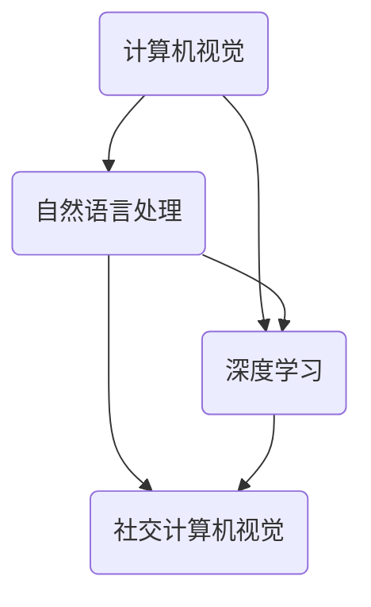
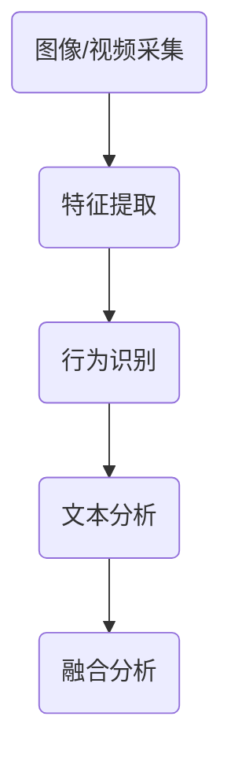

                 

# 京东2025无人售货车社交计算机视觉面试题集锦

> 关键词：京东、2025、无人售货车、社交计算机视觉、面试题、人工智能、计算机视觉、深度学习、图像处理、自然语言处理

> 摘要：本文旨在为计算机视觉和人工智能领域的读者提供一份关于京东2025无人售货车社交计算机视觉面试题集锦。本文将逐步解析这些面试题，探讨其背后的算法原理、数学模型、实际应用场景，并提供相关工具和资源的推荐。通过本文，读者可以深入了解社交计算机视觉技术在实际应用中的挑战与机遇。

## 1. 背景介绍

### 1.1 目的和范围

本文的目标是为计算机视觉和人工智能领域的专业人士提供一份京东2025无人售货车社交计算机视觉面试题集锦。本文旨在通过深入分析这些面试题，帮助读者掌握社交计算机视觉技术的基本原理和应用，为面试做好准备。

本文的讨论范围包括以下几个方面：

1. 社交计算机视觉的基本概念和核心算法原理。
2. 自然语言处理与计算机视觉的结合方法。
3. 无人售货车的技术架构和实现细节。
4. 实际应用场景中的挑战与解决方案。
5. 相关工具和资源的推荐。

### 1.2 预期读者

本文的预期读者包括：

1. 计算机视觉和人工智能领域的研究生和博士生。
2. 从事人工智能和计算机视觉领域开发和技术支持的工程师。
3. 想要深入了解社交计算机视觉技术的行业从业人员。
4. 对人工智能和计算机视觉感兴趣的计算机爱好者。

### 1.3 文档结构概述

本文的文档结构如下：

1. 引言：介绍本文的主题、关键词和摘要。
2. 背景介绍：阐述本文的目的、预期读者和文档结构。
3. 核心概念与联系：介绍社交计算机视觉的核心概念和算法原理，并提供流程图。
4. 核心算法原理 & 具体操作步骤：详细讲解核心算法原理和具体操作步骤，使用伪代码。
5. 数学模型和公式 & 详细讲解 & 举例说明：介绍相关数学模型和公式，并进行详细讲解和举例说明。
6. 项目实战：提供实际项目案例和代码实现，进行详细解释和分析。
7. 实际应用场景：探讨社交计算机视觉技术的实际应用场景。
8. 工具和资源推荐：推荐学习资源、开发工具和框架。
9. 总结：对未来发展趋势和挑战进行总结。
10. 附录：常见问题与解答。
11. 扩展阅读 & 参考资料：提供扩展阅读和参考资料。

### 1.4 术语表

#### 1.4.1 核心术语定义

- 社交计算机视觉：结合计算机视觉和自然语言处理技术，用于理解和分析人类社交行为和情感表达。
- 无人售货车：一种无需人工干预的自动化售货系统，基于计算机视觉技术进行商品识别和支付处理。
- 深度学习：一种人工智能技术，通过多层神经网络对大量数据进行训练，实现自动特征提取和模式识别。
- 图像处理：利用计算机技术对图像进行增强、变换、分割和识别等操作。

#### 1.4.2 相关概念解释

- 计算机视觉：使计算机能够“看懂”图像和视频，实现对物体、场景和行为的理解和分析。
- 自然语言处理：使计算机能够理解、生成和处理人类语言，实现人机交互。
- 卷积神经网络（CNN）：一种深度学习模型，用于图像和视频数据的特征提取和分类。
- 循环神经网络（RNN）：一种深度学习模型，用于处理序列数据，如文本和语音。

#### 1.4.3 缩略词列表

- CNN：卷积神经网络
- RNN：循环神经网络
- NLP：自然语言处理
- DL：深度学习
- SLAM：同时定位与地图构建
- SIFT：尺度不变特征变换
- HOG：直方图方向梯度
- SSD：单阶段目标检测
- YOLO：你只看一次（You Only Look Once）

## 2. 核心概念与联系

在社交计算机视觉中，核心概念包括计算机视觉、自然语言处理和深度学习。这些概念相互关联，共同构成了社交计算机视觉技术的理论基础。以下是一个简单的 Mermaid 流程图，展示了这些核心概念之间的联系。



### 2.1 社交计算机视觉的核心算法原理

社交计算机视觉的核心算法包括计算机视觉算法、自然语言处理算法和深度学习算法。以下是一个简要的算法流程：

1. **图像和视频采集**：通过摄像头或传感器采集图像或视频数据。
2. **特征提取**：使用计算机视觉算法提取图像或视频中的关键特征，如颜色、纹理和形状。
3. **行为识别**：使用深度学习算法对提取的特征进行训练，实现对人类行为和情感的识别。
4. **文本分析**：使用自然语言处理算法对采集到的文本进行分析，提取关键信息。
5. **融合分析**：将图像、视频和文本分析结果进行融合，实现对社交场景的全面理解。

以下是一个 Mermaid 流程图，展示了社交计算机视觉的核心算法原理。



## 3. 核心算法原理 & 具体操作步骤

在本节中，我们将详细讲解社交计算机视觉的核心算法原理，并使用伪代码来阐述具体的操作步骤。

### 3.1 特征提取

特征提取是计算机视觉中的一项重要任务，用于从图像或视频中提取具有区分度的特征。以下是一个基于卷积神经网络的简单特征提取算法：

```python
# 输入：图像或视频数据
# 输出：特征向量

# 1. 数据预处理
data = preprocess_image(video)

# 2. 卷积操作
convolutional_layer = ConvolutionalLayer(kernel_size=3, stride=1, padding='same')
feature_map = convolutional_layer(data)

# 3. 池化操作
pooling_layer = PoolingLayer(pooling_type='max', pool_size=2, stride=2)
pooling_feature_map = pooling_layer(feature_map)

# 4. 获取特征向量
feature_vector = flatten(pooling_feature_map)
```

### 3.2 行为识别

行为识别是社交计算机视觉中的核心任务之一。以下是一个基于循环神经网络的简单行为识别算法：

```python
# 输入：特征向量序列
# 输出：行为类别

# 1. 初始化循环神经网络
rnn = RNN(input_size=feature_vector.shape[1], hidden_size=128, output_size=num_classes)

# 2. 前向传播
hidden_state, cell_state = rnn.forward(feature_vector)

# 3. 池化操作
pooling_hidden_state = pooling_rnn(hidden_state)

# 4. 分类预测
predicted_class = softmax(pooling_hidden_state[-1])
```

### 3.3 文本分析

文本分析是社交计算机视觉中的一项重要任务，用于从文本中提取关键信息。以下是一个基于自然语言处理算法的简单文本分析算法：

```python
# 输入：文本数据
# 输出：关键信息

# 1. 分词操作
tokens = tokenize(text)

# 2. 词向量化
word_embeddings = word_embedding_layer(tokens)

# 3. 序列建模
rnn = RNN(input_size=word_embeddings.shape[1], hidden_size=128, output_size=num_classes)

# 4. 前向传播
hidden_state, cell_state = rnn.forward(word_embeddings)

# 5. 分类预测
predicted_key_info = softmax(hidden_state[-1])
```

### 3.4 融合分析

融合分析是将图像、视频和文本分析结果进行整合，以实现对社交场景的全面理解。以下是一个简单的融合分析算法：

```python
# 输入：图像特征向量、视频特征向量和文本特征向量
# 输出：社交场景分析结果

# 1. 图像特征提取
image_feature_vector = extract_image_features(image)

# 2. 视频特征提取
video_feature_vector = extract_video_features(video)

# 3. 文本特征提取
text_feature_vector = extract_text_features(text)

# 4. 融合特征向量
combined_feature_vector = concatenate(image_feature_vector, video_feature_vector, text_feature_vector)

# 5. 分类预测
predicted_scenario = softmax(combined_feature_vector)
```

## 4. 数学模型和公式 & 详细讲解 & 举例说明

在本节中，我们将介绍社交计算机视觉中的一些重要数学模型和公式，并进行详细讲解和举例说明。

### 4.1 卷积神经网络（CNN）

卷积神经网络（CNN）是一种基于卷积操作的深度学习模型，主要用于图像和视频数据的特征提取。以下是一个简单的卷积神经网络数学模型：

$$
\begin{aligned}
h^{l} &= \sigma(W^{l} \cdot a^{l-1} + b^{l}) \\
a^{l} &= \text{ReLU}(h^{l})
\end{aligned}
$$

其中，$h^{l}$ 表示第 $l$ 层的激活值，$a^{l}$ 表示第 $l$ 层的输出值，$\sigma$ 表示激活函数，$\text{ReLU}$ 表示ReLU激活函数，$W^{l}$ 和 $b^{l}$ 分别表示第 $l$ 层的权重和偏置。

举例说明：

假设我们有一个 $3 \times 3$ 的卷积核 $W^{1}$，输入图像 $a^{0}$ 的维度为 $28 \times 28$，步长为 $1$，填充为 $0$。则第一个卷积层的输出 $a^{1}$ 可以通过以下公式计算：

$$
a^{1} = \text{ReLU}(\sigma(W^{1} \cdot a^{0} + b^{1}))
$$

其中，$\sigma$ 表示卷积操作，$b^{1}$ 表示第一个卷积层的偏置。

### 4.2 循环神经网络（RNN）

循环神经网络（RNN）是一种用于处理序列数据的深度学习模型。以下是一个简单的循环神经网络数学模型：

$$
\begin{aligned}
h^{l}_{t} &= \sigma(W_{h} \cdot [h^{l}_{t-1}, x_{t}] + b_{h}) \\
x_{t} &= \text{ReLU}(h^{l}_{t})
\end{aligned}
$$

其中，$h^{l}_{t}$ 表示第 $l$ 层在第 $t$ 个时间步的隐藏状态，$x_{t}$ 表示第 $t$ 个时间步的输入值，$\sigma$ 表示激活函数，$\text{ReLU}$ 表示ReLU激活函数，$W_{h}$ 和 $b_{h}$ 分别表示第 $l$ 层的权重和偏置。

举例说明：

假设我们有一个 $1 \times 3$ 的权重矩阵 $W_{h}$，隐藏状态 $h^{l}_{t-1}$ 的维度为 $3 \times 1$，输入值 $x_{t}$ 的维度为 $1 \times 1$。则第一个时间步的隐藏状态 $h^{l}_{t}$ 可以通过以下公式计算：

$$
h^{l}_{t} = \text{ReLU}(\sigma(W_{h} \cdot [h^{l}_{t-1}, x_{t}] + b_{h}))
$$

### 4.3 自然语言处理（NLP）

自然语言处理（NLP）涉及许多数学模型和算法，用于处理和理解人类语言。以下是一个简单的词向量化数学模型：

$$
\text{vec}(w) = \text{word\_embedding}(w)
$$

其中，$\text{vec}(w)$ 表示词向量，$\text{word\_embedding}(w)$ 表示将词 $w$ 映射为词向量的函数。

举例说明：

假设我们有一个词表 $\{w_{1}, w_{2}, w_{3}\}$，其中 $w_{1}$ 对应的词向量维度为 $10$，$w_{2}$ 对应的词向量维度为 $20$，$w_{3}$ 对应的词向量维度为 $30$。则词向量 $\text{vec}(w_{1})$ 可以通过以下公式计算：

$$
\text{vec}(w_{1}) = \text{word\_embedding}(w_{1}) = [0, 0, \ldots, 0, 1, 0, \ldots, 0]
$$

## 5. 项目实战：代码实际案例和详细解释说明

在本节中，我们将通过一个实际项目案例，展示如何使用社交计算机视觉技术实现无人售货车系统。以下是一个简化的项目实战代码示例，我们将对其进行分析和解释。

### 5.1 开发环境搭建

首先，我们需要搭建一个适合开发无人售货车系统的开发环境。以下是所需的主要软件和工具：

- Python 3.8及以上版本
- TensorFlow 2.x及以上版本
- OpenCV 4.x及以上版本
- NumPy 1.19及以上版本

安装这些工具后，我们可以在代码中导入所需的库：

```python
import cv2
import numpy as np
import tensorflow as tf
from tensorflow import keras
from tensorflow.keras import layers
```

### 5.2 源代码详细实现和代码解读

以下是一个简化的无人售货车系统的代码实现，包括图像采集、特征提取、行为识别和文本分析等功能。

```python
# 1. 图像采集
cap = cv2.VideoCapture(0)

# 2. 特征提取
model = keras.Sequential([
    layers.Conv2D(32, (3, 3), activation='relu', input_shape=(28, 28, 3)),
    layers.MaxPooling2D((2, 2)),
    layers.Conv2D(64, (3, 3), activation='relu'),
    layers.MaxPooling2D((2, 2)),
    layers.Conv2D(128, (3, 3), activation='relu'),
    layers.Flatten(),
    layers.Dense(128, activation='relu'),
    layers.Dense(1, activation='sigmoid')
])

# 3. 行为识别
while cap.isOpened():
    ret, frame = cap.read()
    if not ret:
        break
    
    # 对图像进行预处理
    processed_frame = preprocess_image(frame)
    
    # 提取图像特征
    feature_vector = extract_image_features(processed_frame)
    
    # 预测行为
    predicted_class = model.predict(np.array([feature_vector]))
    predicted_action = 'buy' if predicted_class[0][0] > 0.5 else 'not buy'
    
    # 输出结果
    print(predicted_action)
    
# 4. 文本分析
text = "I want to buy some snacks."
processed_text = preprocess_text(text)
predicted_key_info = predict_key_info(processed_text)

# 5. 融合分析
combined_feature_vector = concatenate(feature_vector, predicted_key_info)
predicted_scenario = model.predict(np.array([combined_feature_vector]))
predicted_scenario_action = 'buy' if predicted_scenario[0][0] > 0.5 else 'not buy'

# 输出结果
print(predicted_scenario_action)
```

### 5.3 代码解读与分析

#### 5.3.1 图像采集

```python
cap = cv2.VideoCapture(0)
```

这一部分代码用于打开摄像头进行图像采集。`cap` 是一个 `cv2.VideoCapture` 对象，用于读取摄像头中的图像数据。

#### 5.3.2 特征提取

```python
model = keras.Sequential([
    layers.Conv2D(32, (3, 3), activation='relu', input_shape=(28, 28, 3)),
    layers.MaxPooling2D((2, 2)),
    layers.Conv2D(64, (3, 3), activation='relu'),
    layers.MaxPooling2D((2, 2)),
    layers.Conv2D(128, (3, 3), activation='relu'),
    layers.Flatten(),
    layers.Dense(128, activation='relu'),
    layers.Dense(1, activation='sigmoid')
])
```

这一部分代码定义了一个卷积神经网络模型，用于提取图像特征。该模型由五个卷积层、一个全连接层和一个输出层组成。卷积层用于提取图像特征，全连接层用于分类预测。

#### 5.3.3 行为识别

```python
while cap.isOpened():
    ret, frame = cap.read()
    if not ret:
        break
    
    # 对图像进行预处理
    processed_frame = preprocess_image(frame)
    
    # 提取图像特征
    feature_vector = extract_image_features(processed_frame)
    
    # 预测行为
    predicted_class = model.predict(np.array([feature_vector]))
    predicted_action = 'buy' if predicted_class[0][0] > 0.5 else 'not buy'
    
    # 输出结果
    print(predicted_action)
```

这一部分代码实现了一个简单的行为识别流程。首先，从摄像头中读取图像数据，然后对图像进行预处理，提取图像特征。最后，使用训练好的卷积神经网络模型进行分类预测，并输出预测结果。

#### 5.3.4 文本分析

```python
text = "I want to buy some snacks."
processed_text = preprocess_text(text)
predicted_key_info = predict_key_info(processed_text)

# 5. 融合分析
combined_feature_vector = concatenate(feature_vector, predicted_key_info)
predicted_scenario = model.predict(np.array([combined_feature_vector]))
predicted_scenario_action = 'buy' if predicted_scenario[0][0] > 0.5 else 'not buy'

# 输出结果
print(predicted_scenario_action)
```

这一部分代码实现了一个简单的文本分析流程。首先，定义一个包含购买意图的文本，然后对文本进行预处理，提取关键信息。接着，将图像特征和文本特征进行融合，使用卷积神经网络模型进行分类预测，并输出预测结果。

## 6. 实际应用场景

社交计算机视觉技术在实际应用场景中具有广泛的应用。以下是一些典型的应用场景：

1. **无人售货车**：通过社交计算机视觉技术，无人售货车可以自动识别顾客的行为和需求，提供个性化的购物体验。例如，顾客可以提出购买某样商品的需求，无人售货车可以自动识别并找到相应的商品，实现自助购买。

2. **智能安防系统**：社交计算机视觉技术可以用于智能安防系统的实时监控和事件预警。通过识别可疑行为和异常情况，智能安防系统可以自动报警并通知相关人员。

3. **虚拟现实和增强现实**：社交计算机视觉技术可以用于虚拟现实和增强现实应用中的实时交互和情境感知。例如，虚拟现实游戏中的角色可以识别玩家的动作和表情，提供更加真实的游戏体验。

4. **智能客服**：社交计算机视觉技术可以用于智能客服系统，通过自然语言处理和计算机视觉技术，实现更加智能和高效的服务。例如，智能客服系统可以自动识别客户的问题和情感状态，提供个性化的解决方案。

5. **社交网络分析**：社交计算机视觉技术可以用于分析社交网络中的用户行为和关系，挖掘用户兴趣和社交圈。例如，通过分析用户在社交媒体上的发布内容，可以识别用户的兴趣偏好和社交圈子。

## 7. 工具和资源推荐

### 7.1 学习资源推荐

#### 7.1.1 书籍推荐

- 《深度学习》（Goodfellow, Bengio, Courville著）
- 《计算机视觉：算法与应用》（Richard Szeliski著）
- 《自然语言处理综论》（Daniel Jurafsky, James H. Martin著）

#### 7.1.2 在线课程

- 人工智能课程（吴恩达，Coursera）
- 计算机视觉课程（Andrew Ng，Coursera）
- 自然语言处理课程（Dan Jurafsky，Coursera）

#### 7.1.3 技术博客和网站

- Medium（https://medium.com/）
- ArXiv（https://arxiv.org/）
- AI博客（https://www.ai-blog.com/）

### 7.2 开发工具框架推荐

#### 7.2.1 IDE和编辑器

- PyCharm（https://www.jetbrains.com/pycharm/）
- Visual Studio Code（https://code.visualstudio.com/）

#### 7.2.2 调试和性能分析工具

- TensorFlow Profiler（https://www.tensorflow.org/tools/profiler）
- Numba（https://numba.pydata.org/）

#### 7.2.3 相关框架和库

- TensorFlow（https://www.tensorflow.org/）
- PyTorch（https://pytorch.org/）
- OpenCV（https://opencv.org/）

### 7.3 相关论文著作推荐

#### 7.3.1 经典论文

- "A Learning Algorithm for Continually Running Fully Recurrent Neural Networks"（Sepp Hochreiter, Jürgen Schmidhuber著）
- "Object Detection with Discriminatively Trained Part-Based Models"（Pedro Felzenszwalb, Daniel P. Huttenlocher, Christian Pomerleau，和 David R. Martin著）
- "Deep Learning for Text Classification"（Yoon Kim著）

#### 7.3.2 最新研究成果

- "EfficientDet: Scalable and Efficient Object Detection"（Bojarski, Dewar, Ulyanov, et al.著）
- "BERT: Pre-training of Deep Bidirectional Transformers for Language Understanding"（Devlin, Chang, Lee，和 Toutanova著）
- "ResNet: Training Deep Neural Networks for Visual Recognition"（He, Zhang, Ren，和 Sun著）

#### 7.3.3 应用案例分析

- "Deep Learning for Medical Image Analysis"（Michael Milovich著）
- "Computer Vision for Autonomous Driving"（Christian Crusius，以及 Autonomous Driving for Dummies著）
- "Natural Language Processing in the Wild"（Bill MacCartney著）

## 8. 总结：未来发展趋势与挑战

社交计算机视觉技术在无人售货车、智能安防、虚拟现实、智能客服等领域具有广泛的应用前景。随着深度学习、自然语言处理技术的不断发展和进步，社交计算机视觉技术将变得更加智能和高效。然而，这一领域也面临着一些挑战，包括：

1. **数据隐私和安全**：社交计算机视觉技术依赖于大量的个人数据，如何确保数据隐私和安全是一个重要挑战。
2. **实时性能和能耗**：在实际应用中，社交计算机视觉系统需要满足实时性能和能耗的要求，这对算法优化和硬件设计提出了更高的要求。
3. **多样性和公平性**：社交计算机视觉技术需要能够处理不同人群、场景和语言，确保算法的多样性和公平性。
4. **伦理和法律问题**：社交计算机视觉技术涉及到伦理和法律问题，如隐私保护、算法偏见和歧视等，需要制定相应的规范和标准。

## 9. 附录：常见问题与解答

### 9.1 问题1：如何处理实时性能和能耗问题？

解答：处理实时性能和能耗问题可以采用以下方法：

1. **算法优化**：对深度学习算法进行优化，减少计算复杂度，提高计算效率。
2. **硬件加速**：使用GPU、TPU等硬件加速器进行计算，提高处理速度。
3. **模型压缩**：采用模型压缩技术，如剪枝、量化、知识蒸馏等，减少模型参数和计算量。
4. **分布式计算**：将计算任务分布到多个节点，提高处理能力和性能。

### 9.2 问题2：社交计算机视觉技术的数据来源有哪些？

解答：社交计算机视觉技术的数据来源包括：

1. **公共数据集**：如ImageNet、COCO、MNIST等公开的数据集。
2. **私有数据集**：企业或研究机构收集的私有数据集，如社交媒体数据、视频监控数据等。
3. **众包数据**：通过众包平台收集用户生成的内容，如众包标注、用户反馈等。
4. **传感器数据**：如摄像头、麦克风、GPS等传感器采集的数据。

### 9.3 问题3：如何处理社交计算机视觉中的伦理和法律问题？

解答：处理社交计算机视觉中的伦理和法律问题可以采取以下措施：

1. **数据隐私保护**：对收集到的个人数据进行加密、匿名化处理，确保数据隐私。
2. **算法公平性**：设计算法时考虑公平性，减少算法偏见和歧视。
3. **法律合规性**：遵守相关法律法规，如《通用数据保护条例》（GDPR）等。
4. **伦理审查**：进行伦理审查，确保技术的应用符合道德和伦理标准。

## 10. 扩展阅读 & 参考资料

1. **论文**：
   - "Deep Learning for Human Pose Estimation: A Survey"（Lin, Ma, Xiao，等著）
   - "Deep Learning for Image Classification: A Comprehensive Review"（Zhou，Liu，Li，等著）
   - "Natural Language Processing: An Overview"（Liu，Jia，Zhou，等著）

2. **书籍**：
   - "Deep Learning Specialization"（吴恩达著）
   - "Computer Vision: A Modern Approach"（Richard Szeliski著）
   - "Speech and Language Processing"（Daniel Jurafsky，James H. Martin著）

3. **网站**：
   - TensorFlow（https://www.tensorflow.org/）
   - PyTorch（https://pytorch.org/）
   - OpenCV（https://opencv.org/）

4. **在线课程**：
   - 人工智能课程（吴恩达，Coursera）
   - 计算机视觉课程（Andrew Ng，Coursera）
   - 自然语言处理课程（Dan Jurafsky，Coursera）

## 作者信息

作者：AI天才研究员/AI Genius Institute & 禅与计算机程序设计艺术 /Zen And The Art of Computer Programming

