                 

### 京东2025智能客服系统工程师社招面试攻略

> **关键词**：京东、智能客服、系统工程师、社招、面试、攻略、技术、算法、开发环境、实战案例、数学模型、工具推荐
>
> **摘要**：本文旨在为有意向加入京东2025智能客服系统工程师岗位的求职者提供一份详细的面试攻略。通过分析面试的核心内容、技术原理、数学模型、实战案例，以及工具和资源推荐，帮助求职者全面了解面试要点，提升面试成功率。文章分为背景介绍、核心概念与联系、核心算法原理、数学模型和公式、项目实战、实际应用场景、工具和资源推荐、总结与未来发展趋势等章节，结构清晰，内容丰富，旨在帮助读者顺利通过面试，成为优秀的智能客服系统工程师。

### 1. 背景介绍

#### 1.1 目的和范围

随着人工智能技术的迅猛发展，智能客服系统在电商、金融、医疗等多个领域得到了广泛应用。京东作为中国领先的电商平台，其智能客服系统的建设尤为重要。本文旨在为有意向加入京东2025智能客服系统工程师岗位的求职者提供一份详细的面试攻略，帮助求职者了解面试的核心内容、技术原理、数学模型、实战案例，以及工具和资源推荐，从而提升面试成功率。

本文将围绕以下几个方面展开：

1. **核心概念与联系**：介绍智能客服系统的核心概念及其相互关系。
2. **核心算法原理**：详细阐述智能客服系统中的关键算法原理。
3. **数学模型和公式**：讲解智能客服系统中的数学模型和公式。
4. **项目实战**：通过实际案例展示智能客服系统的开发过程。
5. **实际应用场景**：分析智能客服系统的应用场景和前景。
6. **工具和资源推荐**：推荐智能客服系统开发过程中常用的工具和资源。
7. **总结与未来发展趋势**：总结智能客服系统的发展现状和未来趋势。

#### 1.2 预期读者

本文主要面向以下几类读者：

1. **智能客服系统工程师**：希望了解京东智能客服系统岗位面试要求，提升面试技巧。
2. **人工智能领域求职者**：对智能客服系统感兴趣，希望了解相关技术原理和应用。
3. **技术爱好者**：对人工智能、大数据等领域有浓厚兴趣，希望深入学习相关技术。

#### 1.3 文档结构概述

本文结构如下：

1. **背景介绍**：介绍文章的目的、范围、预期读者和文档结构。
2. **核心概念与联系**：介绍智能客服系统的核心概念及其相互关系。
3. **核心算法原理**：详细阐述智能客服系统中的关键算法原理。
4. **数学模型和公式**：讲解智能客服系统中的数学模型和公式。
5. **项目实战**：通过实际案例展示智能客服系统的开发过程。
6. **实际应用场景**：分析智能客服系统的应用场景和前景。
7. **工具和资源推荐**：推荐智能客服系统开发过程中常用的工具和资源。
8. **总结与未来发展趋势**：总结智能客服系统的发展现状和未来趋势。
9. **附录**：常见问题与解答。
10. **扩展阅读与参考资料**：提供更多相关阅读资料。

#### 1.4 术语表

本文涉及以下核心术语和概念：

#### 1.4.1 核心术语定义

- **智能客服系统**：基于人工智能技术，模拟人类客服行为，为用户提供自动化的咨询、答疑、投诉等服务。
- **自然语言处理（NLP）**：使计算机能够理解和生成人类语言的技术，包括语音识别、语义理解、情感分析等。
- **机器学习（ML）**：使计算机通过数据和经验自主学习和改进的技术，包括监督学习、无监督学习、强化学习等。
- **深度学习（DL）**：基于神经网络的一种机器学习技术，能够模拟人脑的神经元结构，具有强大的特征提取和模式识别能力。
- **聊天机器人（Chatbot）**：基于自然语言处理和机器学习技术，实现与用户进行实时交互的软件系统。

#### 1.4.2 相关概念解释

- **用户画像**：基于用户的历史行为数据、兴趣偏好等，构建的用户信息模型，用于优化客服体验和精准营销。
- **知识图谱**：用于表示实体、概念、关系等信息的一种图形化模型，能够为智能客服提供丰富的语义信息。
- **服务流程**：智能客服系统为用户提供服务的全过程，包括接入、识别、理解、回复、结束等环节。

#### 1.4.3 缩略词列表

- **NLP**：自然语言处理
- **ML**：机器学习
- **DL**：深度学习
- **Chatbot**：聊天机器人
- **API**：应用程序编程接口
- **SDK**：软件开发工具包
- **UI**：用户界面
- **UX**：用户体验

### 2. 核心概念与联系

智能客服系统是当前人工智能领域的一个热点研究方向，其核心概念包括自然语言处理（NLP）、机器学习（ML）、深度学习（DL）和聊天机器人（Chatbot）等。下面我们将通过一张Mermaid流程图来展示这些核心概念及其相互关系。

```mermaid
graph TD
    A[自然语言处理] --> B[文本处理]
    A --> C[语音识别]
    A --> D[语义理解]
    A --> E[情感分析]
    B --> F[分词]
    B --> G[词性标注]
    B --> H[命名实体识别]
    C --> I[语音识别模型]
    C --> J[语音合成]
    D --> K[词向量表示]
    D --> L[依存句法分析]
    D --> M[实体识别]
    E --> N[情感分类]
    E --> O[情感分析模型]
    F --> P[TF-IDF]
    F --> Q[词袋模型]
    G --> R[统计语言模型]
    G --> S[神经网络模型]
    H --> T[文本分类]
    H --> U[主题模型]
    I --> V[神经网络]
    I --> W[卷积神经网络]
    J --> X[循环神经网络]
    J --> Y[长短时记忆网络]
    K --> Z[词嵌入]
    K --> AA[语义相似度]
    L --> BB[依存关系]
    L --> CC[语义角色标注]
    M --> DD[实体识别模型]
    M --> EE[实体关系抽取]
    N --> FF[情感分析模型]
    O --> GG[情感分析算法]
    P --> HH[统计模型]
    P --> II[机器学习模型]
    Q --> JJ[机器学习模型]
    R --> KK[统计模型]
    R --> LL[机器学习模型]
    S --> MM[神经网络模型]
    S --> NN[机器学习模型]
    T --> OO[分类算法]
    T --> PP[聚类算法]
    U --> QQ[主题模型算法]
    V --> RR[神经网络模型]
    V --> SS[机器学习模型]
    W --> TT[神经网络模型]
    W --> UU[机器学习模型]
    X --> VV[神经网络模型]
    X --> WW[机器学习模型]
    Y --> XX[神经网络模型]
    Y --> YY[机器学习模型]
    Z --> ZZ[词嵌入算法]
    ZZ --> AAA[语义相似度算法]
    AA --> BBB[文本匹配算法]
    BB --> CCC[对话生成算法]
    CC --> DDD[对话生成算法]
    DD --> EEE[对话生成算法]
    EE --> FFF[对话生成算法]
    FF --> GGG[对话生成算法]
    GG --> HHH[文本生成算法]
    HH --> III[文本生成算法]
    II --> JJJ[文本生成算法]
    JJ --> KKK[文本生成算法]
    KK --> LLL[文本生成算法]
    LL --> MMM[文本生成算法]
    MM --> NNN[文本生成算法]
    NN --> OOO[文本生成算法]
    PP --> PPP[文本生成算法]
    QQ --> RRR[文本生成算法]
    RR --> SSS[文本生成算法]
    SS --> TTT[文本生成算法]
    TT --> UUU[文本生成算法]
    UU --> VVV[文本生成算法]
    WW --> XXX[文本生成算法]
    XX --> YYY[文本生成算法]
    YY --> ZZZ[文本生成算法]
    ZZ --> AAA[文本生成算法]
```



从上述流程图中可以看出，智能客服系统中的各个核心概念相互关联，共同构成了一个复杂的技术体系。自然语言处理（NLP）是智能客服系统的核心技术，涵盖了文本处理、语音识别、语义理解和情感分析等方面。机器学习（ML）和深度学习（DL）技术为NLP提供了强大的支持，使计算机能够通过数据和经验不断改进性能。聊天机器人（Chatbot）则是智能客服系统的最终表现形式，通过与用户的实时交互，实现咨询、答疑、投诉等服务。

在接下来的章节中，我们将分别介绍这些核心概念的技术原理、具体操作步骤和数学模型，帮助读者深入理解智能客服系统的构建过程。

### 3. 核心算法原理 & 具体操作步骤

智能客服系统中的核心算法主要包括自然语言处理（NLP）、机器学习（ML）和深度学习（DL）算法。下面我们将分别介绍这些算法的基本原理，并结合具体操作步骤和伪代码进行讲解。

#### 3.1 自然语言处理（NLP）

自然语言处理是智能客服系统的核心技术之一，其主要任务包括文本处理、语音识别、语义理解和情感分析等方面。以下将分别介绍这些任务的基本原理和具体操作步骤。

##### 3.1.1 文本处理

文本处理是NLP的基础，主要包括分词、词性标注、命名实体识别等任务。

**分词**：将连续的文本序列切分成一个个独立的词汇单元。

**伪代码**：

```python
def tokenize(text):
    # 初始化分词器
    tokenizer = jieba.Tokenizer()
    # 进行分词
    tokens = tokenizer.cut(text)
    return tokens
```

**词性标注**：为每个词汇赋予相应的词性标签，如名词、动词、形容词等。

**伪代码**：

```python
def pos_tagging(tokens):
    # 初始化词性标注器
    pos_tagger = nltk.pos_tag()
    # 进行词性标注
    pos_tags = pos_tagger(tokens)
    return pos_tags
```

**命名实体识别**：识别文本中的命名实体，如人名、地名、组织机构名等。

**伪代码**：

```python
def named_entity_recognition(text):
    # 初始化命名实体识别器
    ner = ner.NER()
    # 进行命名实体识别
    entities = ner(text)
    return entities
```

##### 3.1.2 语音识别

语音识别是将语音信号转换为文本的技术。其基本原理包括信号处理、特征提取、模型训练和语音解码等。

**信号处理**：对语音信号进行预处理，如去除噪声、均衡音量等。

**特征提取**：从预处理后的语音信号中提取有用的特征，如频谱特征、倒谱特征等。

**模型训练**：使用大量语音数据对模型进行训练，使其能够识别语音信号中的词汇和语法结构。

**语音解码**：根据模型预测结果，将语音信号转换为文本输出。

**伪代码**：

```python
def asr(audio):
    # 信号处理
    processed_audio = preprocess(audio)
    # 特征提取
    features = extract_features(processed_audio)
    # 模型训练
    model = train_model(features)
    # 语音解码
    text = decode(model, features)
    return text
```

##### 3.1.3 语义理解

语义理解是NLP中的核心任务，旨在理解文本中的语义含义，包括词向量表示、依存句法分析、实体识别等。

**词向量表示**：将词汇映射为高维向量空间，使其能够捕捉词汇的语义信息。

**伪代码**：

```python
def word_embedding(words):
    # 初始化词向量模型
    embedding_model = Word2Vec()
    # 训练词向量模型
    embedding_model.fit(words)
    # 获取词向量
    word_vectors = embedding_model.get_word_vectors()
    return word_vectors
```

**依存句法分析**：分析句子中词汇之间的依存关系，如主谓关系、动宾关系等。

**伪代码**：

```python
def dependency Parsing(sentence):
    # 初始化依存句法分析器
    parser = StanfordDependencyParser()
    # 进行依存句法分析
    dependencies = parser.parse(sentence)
    return dependencies
```

**实体识别**：识别文本中的实体，如人名、地名、组织机构名等。

**伪代码**：

```python
def entity_recognition(text):
    # 初始化实体识别器
    entity_recognizer = NamedEntityRecognizer()
    # 进行实体识别
    entities = entity_recognizer.recognize(text)
    return entities
```

##### 3.1.4 情感分析

情感分析是NLP中的一个重要任务，旨在判断文本中所表达的情感倾向，如正面、负面、中性等。

**情感分类**：将文本分为正面、负面、中性等类别。

**伪代码**：

```python
def sentiment_analysis(text):
    # 初始化情感分类器
    sentiment_classifier = TextClassifier()
    # 训练情感分类器
    sentiment_classifier.fit(text)
    # 进行情感分类
    sentiment = sentiment_classifier.predict(text)
    return sentiment
```

**情感分析模型**：使用机器学习或深度学习技术，训练情感分析模型。

**伪代码**：

```python
def train_sentiment_model(data):
    # 初始化模型
    model = Sequential()
    # 添加层
    model.add(Dense(units=128, activation='relu', input_shape=(max_sequence_length,)))
    model.add(Dense(units=64, activation='relu'))
    model.add(Dense(units=3, activation='softmax'))
    # 编译模型
    model.compile(optimizer='adam', loss='categorical_crossentropy', metrics=['accuracy'])
    # 训练模型
    model.fit(data, epochs=10, batch_size=32)
    return model
```

#### 3.2 机器学习（ML）

机器学习是智能客服系统中的核心技术之一，其主要任务包括分类、回归、聚类等。

**分类**：将数据分为不同的类别。

**伪代码**：

```python
def train_classifier(data, labels):
    # 初始化分类器
    classifier = LogisticRegression()
    # 训练分类器
    classifier.fit(data, labels)
    return classifier
```

**回归**：预测数据中的连续值。

**伪代码**：

```python
def train_regressor(data, labels):
    # 初始化回归器
    regressor = LinearRegression()
    # 训练回归器
    regressor.fit(data, labels)
    return regressor
```

**聚类**：将数据分为不同的簇。

**伪代码**：

```python
def train_clustering(data):
    # 初始化聚类器
    clustering = KMeans(n_clusters=3)
    # 训练聚类器
    clustering.fit(data)
    return clustering
```

#### 3.3 深度学习（DL）

深度学习是机器学习的一种形式，其核心思想是通过多层神经网络进行特征提取和模式识别。

**卷积神经网络（CNN）**：适用于图像、语音等数据。

**伪代码**：

```python
def train_cnn(data, labels):
    # 初始化卷积神经网络
    model = Sequential()
    # 添加层
    model.add(Conv2D(filters=32, kernel_size=(3, 3), activation='relu', input_shape=(28, 28, 1)))
    model.add(MaxPooling2D(pool_size=(2, 2)))
    model.add(Flatten())
    model.add(Dense(units=128, activation='relu'))
    model.add(Dense(units=10, activation='softmax'))
    # 编译模型
    model.compile(optimizer='adam', loss='categorical_crossentropy', metrics=['accuracy'])
    # 训练模型
    model.fit(data, labels, epochs=10, batch_size=32)
    return model
```

**循环神经网络（RNN）**：适用于序列数据。

**伪代码**：

```python
def train_rnn(data, labels):
    # 初始化循环神经网络
    model = Sequential()
    # 添加层
    model.add(LSTM(units=128, activation='relu', return_sequences=True))
    model.add(LSTM(units=64, activation='relu'))
    model.add(Dense(units=10, activation='softmax'))
    # 编译模型
    model.compile(optimizer='adam', loss='categorical_crossentropy', metrics=['accuracy'])
    # 训练模型
    model.fit(data, labels, epochs=10, batch_size=32)
    return model
```

通过以上核心算法原理和具体操作步骤的介绍，读者可以了解到智能客服系统中的关键技术及其应用场景。在接下来的章节中，我们将继续介绍智能客服系统中的数学模型和项目实战，帮助读者更深入地理解智能客服系统的构建过程。

### 4. 数学模型和公式 & 详细讲解 & 举例说明

智能客服系统中的数学模型和公式是其核心技术的理论基础，对于理解系统的算法原理和实现过程具有重要意义。本章节将详细介绍智能客服系统中涉及的一些关键数学模型和公式，并通过具体实例进行说明。

#### 4.1 词向量表示

词向量表示是自然语言处理中的重要数学模型，用于将词汇映射为高维向量空间。最常用的词向量表示方法有Word2Vec、GloVe等。

**Word2Vec模型**：

- **公式**：
  $$ \text{vec}(w) = \text{sgn}(w) \cdot \text{softmax}(\text{u} \cdot w) $$
- **说明**：
  - \( \text{vec}(w) \) 为词汇 \( w \) 的向量表示。
  - \( \text{sgn}(w) \) 为符号函数，用于确定向量的方向。
  - \( \text{softmax}(\text{u} \cdot w) \) 为软最大化函数，用于计算向量的大小。

**GloVe模型**：

- **公式**：
  $$ \text{vec}(w) = \text{softmax}\left(\frac{\text{u} \cdot \text{v}}{\sqrt{\text{u}^2 + \text{v}^2}}\right) $$
- **说明**：
  - \( \text{vec}(w) \) 为词汇 \( w \) 的向量表示。
  - \( \text{u} \) 和 \( \text{v} \) 分别为词汇 \( w \) 的上下文词汇的向量表示。
  - \( \text{softmax} \) 函数用于计算向量的相似度。

**举例说明**：

假设有两个词汇 "狗" 和 "猫"，以及它们的上下文词汇 "宠物" 和 "动物"。

- **Word2Vec**：

  - \( \text{vec}(狗) = \text{sgn}(狗) \cdot \text{softmax}(\text{u} \cdot 狗) \)
  - \( \text{vec}(猫) = \text{sgn}(猫) \cdot \text{softmax}(\text{u} \cdot 猫) \)

- **GloVe**：

  - \( \text{vec}(狗) = \text{softmax}\left(\frac{\text{u} \cdot \text{v}}{\sqrt{\text{u}^2 + \text{v}^2}}\right) \)
  - \( \text{vec}(猫) = \text{softmax}\left(\frac{\text{u} \cdot \text{w}}{\sqrt{\text{u}^2 + \text{w}^2}}\right) \)

#### 4.2 机器学习模型

机器学习模型是智能客服系统中常用的算法模型，包括监督学习、无监督学习和强化学习等。以下介绍几种常见的机器学习模型及其公式。

**线性回归**：

- **公式**：
  $$ y = \beta_0 + \beta_1 \cdot x $$
- **说明**：
  - \( y \) 为预测值。
  - \( x \) 为输入特征。
  - \( \beta_0 \) 和 \( \beta_1 \) 为模型参数。

**逻辑回归**：

- **公式**：
  $$ P(y=1) = \frac{1}{1 + \exp(-\beta_0 - \beta_1 \cdot x)} $$
- **说明**：
  - \( P(y=1) \) 为预测概率。
  - \( \beta_0 \) 和 \( \beta_1 \) 为模型参数。

**支持向量机（SVM）**：

- **公式**：
  $$ \text{w}^T \text{x} - \text{b} = 0 $$
- **说明**：
  - \( \text{w} \) 为模型权重。
  - \( \text{x} \) 为输入特征。
  - \( \text{b} \) 为模型偏置。

**举例说明**：

假设有一个简单的线性回归模型，用于预测房价。

- **公式**：
  $$ \text{房价} = \beta_0 + \beta_1 \cdot \text{面积} $$

- **实例**：

  - \( \beta_0 = 100 \)
  - \( \beta_1 = 10 \)

  当 \( \text{面积} = 100 \) 平方米时，预测房价为：

  $$ \text{房价} = 100 + 10 \cdot 100 = 1100 \text{万元} $$

#### 4.3 深度学习模型

深度学习模型是智能客服系统中重要的技术手段，包括卷积神经网络（CNN）、循环神经网络（RNN）和生成对抗网络（GAN）等。以下介绍几种常见的深度学习模型及其公式。

**卷积神经网络（CNN）**：

- **公式**：
  $$ \text{f}(\text{x}; \text{W}, \text{b}) = \text{softmax}(\text{W} \cdot \text{ReLU}(\text{b} + \text{conv}(\text{x}))) $$
- **说明**：
  - \( \text{f}(\text{x}; \text{W}, \text{b}) \) 为模型输出。
  - \( \text{x} \) 为输入特征。
  - \( \text{W} \) 为模型权重。
  - \( \text{b} \) 为模型偏置。
  - \( \text{ReLU} \) 为ReLU激活函数。
  - \( \text{conv} \) 为卷积操作。

**循环神经网络（RNN）**：

- **公式**：
  $$ \text{h}_t = \text{sigmoid}(\text{W} \cdot [\text{h}_{t-1}; \text{x}_t] + \text{b}) $$
- **说明**：
  - \( \text{h}_t \) 为当前时间步的隐藏状态。
  - \( \text{x}_t \) 为当前时间步的输入特征。
  - \( \text{W} \) 为模型权重。
  - \( \text{b} \) 为模型偏置。
  - \( \text{sigmoid} \) 为sigmoid激活函数。

**生成对抗网络（GAN）**：

- **公式**：
  $$ \text{D}(\text{G}(\text{z}); \text{x}) = \text{sigmoid}(\text{W} \cdot \text{G}(\text{z}) + \text{b}) $$
  $$ \text{G}(\text{z}) = \text{ReLU}(\text{W} \cdot \text{z} + \text{b}) $$
- **说明**：
  - \( \text{D} \) 为判别器。
  - \( \text{G} \) 为生成器。
  - \( \text{z} \) 为噪声向量。
  - \( \text{W} \) 和 \( \text{b} \) 分别为模型权重和偏置。

**举例说明**：

假设使用卷积神经网络（CNN）进行图像分类。

- **公式**：
  $$ \text{f}(\text{x}; \text{W}, \text{b}) = \text{softmax}(\text{W} \cdot \text{ReLU}(\text{b} + \text{conv}(\text{x}))) $$

- **实例**：

  当输入特征 \( \text{x} \) 为一张猫的图片时，预测结果为：

  $$ \text{f}(\text{x}; \text{W}, \text{b}) = \text{softmax}(\text{W} \cdot \text{ReLU}(\text{b} + \text{conv}(\text{x}))) $$

  假设 \( \text{softmax} \) 函数的输出为：

  $$ \text{f}(\text{x}; \text{W}, \text{b}) = [0.1, 0.2, 0.7] $$

  预测结果为猫（第3个类别）。

通过上述数学模型和公式的详细讲解，读者可以更好地理解智能客服系统中的关键技术原理。在接下来的章节中，我们将通过实际项目案例展示智能客服系统的开发过程，帮助读者深入理解系统实现方法。

### 5. 项目实战：代码实际案例和详细解释说明

为了帮助读者更好地理解智能客服系统的开发过程，本章节将通过一个实际项目案例，详细介绍系统的开发环境搭建、源代码实现和代码解读与分析。

#### 5.1 开发环境搭建

在开始项目开发之前，需要搭建合适的开发环境。以下是搭建智能客服系统开发环境所需的主要工具和库：

- **Python 3.8**：智能客服系统的开发语言。
- **TensorFlow 2.7**：用于构建深度学习模型的库。
- **NumPy 1.21**：用于科学计算。
- **Pandas 1.2.5**：用于数据处理。
- **Scikit-learn 0.24.2**：用于机器学习算法。
- **NLTK 3.8**：用于自然语言处理。

安装以上库和工具的命令如下：

```bash
pip install python==3.8
pip install tensorflow==2.7
pip install numpy==1.21
pip install pandas==1.2.5
pip install scikit-learn==0.24.2
pip install nltk==3.8
```

#### 5.2 源代码详细实现和代码解读

以下是智能客服系统的源代码，主要分为数据预处理、模型训练和预测三个部分。

**源代码**：

```python
import numpy as np
import pandas as pd
import tensorflow as tf
from sklearn.model_selection import train_test_split
from sklearn.feature_extraction.text import TfidfVectorizer
from tensorflow.keras.models import Sequential
from tensorflow.keras.layers import Embedding, LSTM, Dense

# 数据预处理
data = pd.read_csv('data.csv')
X = data['text']
y = data['label']

# 划分训练集和测试集
X_train, X_test, y_train, y_test = train_test_split(X, y, test_size=0.2, random_state=42)

# 文本向量化
vectorizer = TfidfVectorizer(max_features=1000)
X_train = vectorizer.fit_transform(X_train)
X_test = vectorizer.transform(X_test)

# 构建模型
model = Sequential()
model.add(Embedding(input_dim=X_train.shape[1], output_dim=64))
model.add(LSTM(units=128))
model.add(Dense(units=1, activation='sigmoid'))

# 编译模型
model.compile(optimizer='adam', loss='binary_crossentropy', metrics=['accuracy'])

# 训练模型
model.fit(X_train, y_train, epochs=10, batch_size=32, validation_data=(X_test, y_test))

# 预测
predictions = model.predict(X_test)
```

**代码解读**：

1. **数据预处理**：

   - 加载数据集：使用Pandas读取CSV文件。
   - 划分训练集和测试集：使用Scikit-learn的`train_test_split`函数，将数据集划分为训练集和测试集，其中测试集占比20%，随机种子为42。
   - 文本向量化：使用TF-IDF向量器对文本进行向量化处理，将文本转换为稀疏矩阵。

2. **模型构建**：

   - 创建序列模型：使用TensorFlow的`Sequential`类创建一个序列模型。
   - 添加嵌入层：使用`Embedding`层，将词汇映射为高维向量。
   - 添加循环层：使用`LSTM`层，对文本序列进行特征提取。
   - 添加输出层：使用`Dense`层，对特征进行分类，输出概率。

3. **模型编译**：

   - 设置优化器：使用`adam`优化器。
   - 设置损失函数：使用`binary_crossentropy`损失函数，适用于二分类问题。
   - 设置评估指标：使用`accuracy`评估指标。

4. **模型训练**：

   - 使用`fit`函数训练模型，设置训练轮次、批量大小和验证数据。

5. **模型预测**：

   - 使用`predict`函数对测试集进行预测，输出概率。

#### 5.3 代码解读与分析

以下是代码的详细解读与分析：

1. **数据预处理**：

   数据预处理是模型训练的重要环节，主要包括数据加载、划分和文本向量化。

   ```python
   data = pd.read_csv('data.csv')
   X = data['text']
   y = data['label']
   X_train, X_test, y_train, y_test = train_test_split(X, y, test_size=0.2, random_state=42)
   vectorizer = TfidfVectorizer(max_features=1000)
   X_train = vectorizer.fit_transform(X_train)
   X_test = vectorizer.transform(X_test)
   ```

   - 加载数据集：使用Pandas读取CSV文件，数据集中包含文本和标签两列。
   - 划分训练集和测试集：使用Scikit-learn的`train_test_split`函数，将数据集划分为训练集和测试集，其中测试集占比20%，随机种子为42。
   - 文本向量化：使用TF-IDF向量器对文本进行向量化处理，将文本转换为稀疏矩阵。`max_features`参数用于指定向量器的特征数量。

2. **模型构建**：

   模型构建是深度学习的重要环节，主要包括序列模型、嵌入层、循环层和输出层的构建。

   ```python
   model = Sequential()
   model.add(Embedding(input_dim=X_train.shape[1], output_dim=64))
   model.add(LSTM(units=128))
   model.add(Dense(units=1, activation='sigmoid'))
   ```

   - 创建序列模型：使用TensorFlow的`Sequential`类创建一个序列模型。
   - 添加嵌入层：使用`Embedding`层，将词汇映射为高维向量。`input_dim`参数指定词汇数量，`output_dim`参数指定嵌入层输出维度。
   - 添加循环层：使用`LSTM`层，对文本序列进行特征提取。`units`参数指定循环层单元数量。
   - 添加输出层：使用`Dense`层，对特征进行分类，输出概率。`units`参数指定输出层单元数量，`activation`参数指定激活函数。

3. **模型编译**：

   模型编译是模型训练的准备工作，主要包括设置优化器、损失函数和评估指标。

   ```python
   model.compile(optimizer='adam', loss='binary_crossentropy', metrics=['accuracy'])
   ```

   - 设置优化器：使用`adam`优化器。
   - 设置损失函数：使用`binary_crossentropy`损失函数，适用于二分类问题。
   - 设置评估指标：使用`accuracy`评估指标，用于衡量模型预测的准确性。

4. **模型训练**：

   模型训练是深度学习的核心环节，主要包括设置训练轮次、批量大小和验证数据。

   ```python
   model.fit(X_train, y_train, epochs=10, batch_size=32, validation_data=(X_test, y_test))
   ```

   - 设置训练轮次：使用`epochs`参数，指定训练轮次。
   - 设置批量大小：使用`batch_size`参数，指定每个批量中的样本数量。
   - 设置验证数据：使用`validation_data`参数，指定验证数据，用于评估模型性能。

5. **模型预测**：

   模型预测是深度学习的重要应用场景，主要包括对测试集进行预测。

   ```python
   predictions = model.predict(X_test)
   ```

   - 使用`predict`函数对测试集进行预测，输出概率。

通过以上代码实现和解读，读者可以了解到智能客服系统的开发过程，包括数据预处理、模型构建、模型编译、模型训练和模型预测等步骤。在实际应用中，可以根据具体需求和数据集进行调整和优化，以提高模型的性能和预测准确性。

#### 5.4 代码分析与总结

本案例通过一个简单的文本分类任务，展示了智能客服系统的开发过程。以下是代码的分析与总结：

1. **数据预处理**：数据预处理是模型训练的基础，主要包括数据加载、划分和文本向量化。在本案例中，我们使用TF-IDF向量器对文本进行向量化处理，将文本转换为稀疏矩阵。这种处理方式可以有效地降低数据的维度，便于模型训练。

2. **模型构建**：模型构建是深度学习的核心环节，主要包括序列模型、嵌入层、循环层和输出层的构建。在本案例中，我们使用序列模型和LSTM层对文本进行特征提取，并使用Dense层对特征进行分类。这种模型结构可以有效地处理文本序列数据。

3. **模型编译**：模型编译是模型训练的准备工作，主要包括设置优化器、损失函数和评估指标。在本案例中，我们使用`adam`优化器和`binary_crossentropy`损失函数，以及`accuracy`评估指标。这些参数可以有效地指导模型训练过程，提高模型性能。

4. **模型训练**：模型训练是深度学习的核心环节，主要包括设置训练轮次、批量大小和验证数据。在本案例中，我们设置训练轮次为10，批量大小为32，并使用验证数据评估模型性能。这些参数可以有效地优化模型，提高预测准确性。

5. **模型预测**：模型预测是深度学习的重要应用场景，主要包括对测试集进行预测。在本案例中，我们使用`predict`函数对测试集进行预测，并输出概率。这种方法可以有效地评估模型的预测性能。

综上所述，本案例通过一个简单的文本分类任务，展示了智能客服系统的开发过程。在实际应用中，可以根据具体需求和数据集进行调整和优化，以提高模型的性能和预测准确性。接下来，我们将分析智能客服系统的实际应用场景，探讨其在不同领域的应用价值。

### 6. 实际应用场景

智能客服系统在多个领域具有广泛的应用，下面我们将分析其在电商、金融、医疗等领域的实际应用场景，探讨其应用价值和前景。

#### 6.1 电商行业

电商行业中的智能客服系统主要用于解决用户咨询、投诉和售后服务等问题。以下是一些实际应用场景：

1. **用户咨询**：智能客服系统可以实时解答用户关于商品、订单、物流等方面的疑问，提高用户满意度。

2. **投诉处理**：智能客服系统可以快速识别用户投诉内容，将问题分类并派发给相应的客服人员处理，提高投诉处理效率。

3. **售后服务**：智能客服系统可以自动为用户提供退换货、退款等售后服务，降低人工成本。

4. **个性化推荐**：基于用户画像和购物行为，智能客服系统可以精准推荐商品，提高销售额。

5. **促销活动**：智能客服系统可以自动推送促销活动信息，吸引用户参与，提高转化率。

#### 6.2 金融行业

金融行业中的智能客服系统主要用于提供投资咨询、理财产品推荐、投诉处理等服务。以下是一些实际应用场景：

1. **投资咨询**：智能客服系统可以实时解答用户关于股票、基金、理财产品等方面的疑问，帮助用户做出明智的投资决策。

2. **理财产品推荐**：智能客服系统可以基于用户风险承受能力和投资偏好，推荐合适的理财产品，提高用户投资收益。

3. **投诉处理**：智能客服系统可以快速识别用户投诉内容，并将问题分类派发给相应的客服人员处理，提高投诉处理效率。

4. **风险控制**：智能客服系统可以实时监测用户交易行为，识别异常交易，为金融机构提供风险预警。

5. **客户服务**：智能客服系统可以提供24/7在线服务，解决用户关于账户、转账、缴费等方面的问题，提高客户满意度。

#### 6.3 医疗行业

医疗行业中的智能客服系统主要用于提供健康咨询、预约挂号、医疗咨询等服务。以下是一些实际应用场景：

1. **健康咨询**：智能客服系统可以实时解答用户关于疾病、药物、体检等方面的问题，提供健康建议。

2. **预约挂号**：智能客服系统可以帮助用户在线预约挂号，提高医院资源利用率。

3. **医疗咨询**：智能客服系统可以提供专业的医疗咨询，如疾病诊断、治疗方法、康复建议等，为患者提供便利。

4. **药物咨询**：智能客服系统可以解答用户关于药物的使用、副作用、禁忌症等方面的问题，提高用药安全。

5. **健康提醒**：智能客服系统可以定期向用户发送健康提醒，如饮食建议、锻炼计划等，帮助用户保持健康。

#### 6.4 应用价值和前景

智能客服系统的广泛应用体现了其在提高服务质量、降低运营成本、提升用户体验等方面的价值。以下是其应用价值和前景的几个方面：

1. **提高服务质量**：智能客服系统可以实时解答用户问题，提高响应速度和满意度，从而提升整体服务质量。

2. **降低运营成本**：智能客服系统可以自动处理大量常见问题，降低人工客服的工作量，从而减少人力成本。

3. **提升用户体验**：智能客服系统可以提供个性化、智能化的服务，满足用户的多样化需求，提升用户体验。

4. **数据分析与优化**：智能客服系统可以收集用户行为数据，通过数据分析，为业务优化提供有力支持。

5. **技术持续创新**：随着人工智能技术的不断发展，智能客服系统将不断进化，为各行业带来更多创新应用。

总之，智能客服系统在电商、金融、医疗等领域的实际应用场景丰富，具有广阔的发展前景。在未来，智能客服系统将不断创新，为各行业带来更多价值。

### 7. 工具和资源推荐

在开发智能客服系统过程中，选择合适的工具和资源对于提高开发效率、优化系统性能至关重要。以下将分别从学习资源、开发工具框架和论文著作三个方面进行推荐。

#### 7.1 学习资源推荐

**7.1.1 书籍推荐**

1. **《深度学习》（Goodfellow, Bengio, Courville 著）**：本书系统地介绍了深度学习的理论基础和实现方法，是深度学习领域的经典教材。
2. **《机器学习》（Tom Mitchell 著）**：本书详细介绍了机器学习的基本概念、算法和应用，适合初学者和进阶者。
3. **《自然语言处理综合教程》（Daniel Jurafsky & James H. Martin 著）**：本书全面介绍了自然语言处理的基础知识和技术，是自然语言处理领域的权威著作。

**7.1.2 在线课程**

1. **Coursera上的《深度学习专项课程》**：由斯坦福大学Andrew Ng教授开设，系统讲解了深度学习的基本原理和实践方法。
2. **Udacity的《人工智能纳米学位》**：包括机器学习、自然语言处理、深度学习等多个模块，适合零基础学习者。
3. **edX上的《自然语言处理》**：由MIT教授开设，全面介绍了自然语言处理的基本概念和技术。

**7.1.3 技术博客和网站**

1. **GitHub**：GitHub上有很多优秀的智能客服系统和相关技术的开源项目，可以学习和借鉴。
2. **Stack Overflow**：Stack Overflow上有大量关于智能客服系统开发的技术问答，解决开发中的疑难问题。
3. **Medium**：Medium上有许多关于智能客服系统的技术博客文章，涵盖了最新研究动态和实践经验。

#### 7.2 开发工具框架推荐

**7.2.1 IDE和编辑器**

1. **PyCharm**：PyCharm是一款功能强大的Python IDE，支持TensorFlow、PyTorch等多种深度学习框架。
2. **Visual Studio Code**：Visual Studio Code是一款轻量级的跨平台编辑器，通过扩展插件支持Python和深度学习框架。
3. **Jupyter Notebook**：Jupyter Notebook是一款交互式的Python笔记本，适合快速开发和调试。

**7.2.2 调试和性能分析工具**

1. **TensorBoard**：TensorBoard是TensorFlow提供的一款可视化工具，可以实时监控模型训练过程和性能。
2. **Profiling Tools**：如Py-Spy、gprof2dot等工具，可以分析Python程序的运行性能，找出性能瓶颈。
3. **Jaeger**：Jaeger是一款分布式追踪系统，可以监控分布式系统中的请求处理过程，识别性能问题。

**7.2.3 相关框架和库**

1. **TensorFlow**：TensorFlow是一款开源的深度学习框架，适用于构建和训练各种深度学习模型。
2. **PyTorch**：PyTorch是一款流行的深度学习框架，具有灵活的动态计算图和简洁的API。
3. **Scikit-learn**：Scikit-learn是一款用于机器学习的Python库，提供了多种常用的机器学习算法。
4. **NLTK**：NLTK是一款用于自然语言处理的Python库，提供了文本处理、词性标注、情感分析等多种功能。

#### 7.3 相关论文著作推荐

**7.3.1 经典论文**

1. **“A Theoretical Analysis of the/V/ Learning Algorithm I: General Considerations” (Rprop)**
2. **“Learning Representations by Maximizing Mutual Information Across Features”**
3. **“A Few Useful Things to Know about Machine Learning”**

**7.3.2 最新研究成果**

1. **“Deep Learning for Natural Language Processing”**
2. **“Natural Language Inference with Neural Networks”**
3. **“Attention Is All You Need”**

**7.3.3 应用案例分析**

1. **“Customer Service Automation with Chatbots”**
2. **“Deep Learning for Retail: How AI is Transforming the Shopping Experience”**
3. **“Deploying a Chatbot for Financial Services”**

通过以上工具和资源的推荐，读者可以更好地了解智能客服系统的开发方法和实践，为学习和开发提供有力支持。在实际应用中，可以根据具体需求和项目特点选择合适的工具和资源，优化开发流程和系统性能。

### 8. 总结：未来发展趋势与挑战

智能客服系统作为人工智能领域的重要组成部分，正逐渐成为企业提升服务质量、降低运营成本的重要手段。在未来，智能客服系统将朝着更加智能化、个性化、多元化的方向发展，面临着诸多机遇与挑战。

#### 8.1 未来发展趋势

1. **智能化水平提升**：随着深度学习、自然语言处理等技术的不断发展，智能客服系统的智能化水平将不断提高，能够更准确地理解用户意图，提供更加精准的服务。

2. **个性化服务**：通过用户画像和大数据分析，智能客服系统将能够根据用户的历史行为和偏好，提供个性化的服务，提升用户体验。

3. **跨渠道集成**：智能客服系统将逐渐实现与多种渠道（如网站、APP、微信、电话等）的集成，为用户提供一站式服务体验。

4. **智能化客服机器人**：随着人工智能技术的进步，智能客服机器人将具备更丰富的交互能力和业务处理能力，能够替代部分人工客服的工作。

5. **实时响应与优化**：智能客服系统将实现实时响应，通过实时数据分析和反馈，不断优化服务流程和用户体验。

#### 8.2 挑战

1. **数据隐私与安全**：随着数据量的增加，如何保护用户隐私和数据安全成为智能客服系统面临的重要挑战。

2. **技术融合与创新**：智能客服系统需要不断融合最新的技术成果，如语音识别、计算机视觉等，以保持竞争力。

3. **用户体验优化**：如何提升用户体验，使智能客服系统能够更好地满足用户需求，是系统开发者需要持续关注的问题。

4. **法律法规合规**：随着智能客服系统的广泛应用，相关法律法规的完善和合规性成为企业必须面对的挑战。

5. **人力资源转型**：智能客服系统的广泛应用将带来人力资源的转型，如何合理配置人力资源，提高员工素质，也是企业需要解决的问题。

#### 8.3 对未来的建议

1. **持续技术创新**：企业应持续关注人工智能领域的新技术动态，不断优化和升级智能客服系统。

2. **人才培养**：加强人工智能和客服领域的人才培养，提升客服团队的技术能力和服务水平。

3. **用户体验设计**：注重用户体验设计，通过用户调研、数据分析等方式，不断优化服务流程和交互界面。

4. **数据安全与合规**：建立健全的数据安全与合规机制，确保用户数据的安全和隐私。

5. **跨部门协作**：加强跨部门协作，将智能客服系统与企业的其他业务系统进行整合，提高整体运营效率。

总之，智能客服系统在未来发展中将面临诸多机遇与挑战。通过技术创新、人才培养、用户体验优化和数据安全等方面的持续努力，企业有望在智能客服领域取得更大的突破和成功。

### 9. 附录：常见问题与解答

在撰写本文时，我们收集了智能客服系统工程师面试中可能遇到的一些常见问题，并提供了相应的解答。以下是一些建议的问答内容，供读者参考。

#### 9.1 常见问题

**Q1：智能客服系统是如何工作的？**

**A1：智能客服系统通过自然语言处理（NLP）、机器学习（ML）和深度学习（DL）技术，对用户输入的文本或语音进行处理，理解用户的意图和需求，并生成相应的回复。其主要工作流程包括文本预处理、意图识别、实体抽取、对话管理、回复生成等步骤。**

**Q2：在智能客服系统中，如何处理多义词问题？**

**A2：多义词处理是自然语言处理中的一个重要问题。通常采用以下几种方法来解决：

- **词义消歧技术**：使用上下文信息，通过规则匹配、机器学习方法等对多义词进行消歧。
- **词向量表示**：使用词向量技术，将多义词映射到高维向量空间，通过向量相似度计算来识别不同的词义。
- **知识图谱**：利用知识图谱中的语义信息，为多义词提供上下文信息，帮助模型进行词义消歧。**

**Q3：如何评估智能客服系统的性能？**

**A3：评估智能客服系统的性能可以从多个角度进行：

- **准确率**：衡量系统正确识别意图和抽取实体的比例。
- **召回率**：衡量系统召回所有正确意图和实体的比例。
- **F1分数**：综合考虑准确率和召回率，计算综合性能指标。
- **用户满意度**：通过用户调查、用户反馈等方式，评估用户对客服系统的满意度。
- **响应时间**：评估系统处理请求的速度，确保及时响应用户。**

**Q4：智能客服系统在金融行业中的应用有哪些？**

**A4：智能客服系统在金融行业的应用非常广泛，主要包括：

- **投资咨询**：为用户提供股票、基金、理财产品等投资相关咨询。
- **投诉处理**：快速处理用户的投诉和问题，提高用户满意度。
- **客户服务**：提供24/7在线客服服务，解答用户关于账户、转账、缴费等问题。
- **风险管理**：监控用户交易行为，识别异常交易，为金融机构提供风险预警。
- **个性化推荐**：根据用户投资偏好和风险承受能力，推荐合适的理财产品。**

**Q5：如何处理智能客服系统中的噪音问题？**

**A5：噪音处理是自然语言处理中的一个关键问题，可以采取以下几种方法：

- **文本清洗**：对输入文本进行清洗，去除无关信息，如HTML标签、特殊符号等。
- **噪声过滤**：通过正则表达式或其他方法，过滤掉包含噪声的文本。
- **噪声降低技术**：使用降噪算法，如高斯滤波、均值滤波等，降低语音信号中的噪声。
- **上下文信息**：利用上下文信息，通过语义理解，识别并去除噪声。**

#### 9.2 解答示例

以下提供一些常见问题的解答示例：

**Q1：智能客服系统是如何工作的？**

**A1：智能客服系统的工作原理可以概括为以下几个步骤：

1. **文本预处理**：对用户输入的文本进行预处理，包括去除HTML标签、特殊字符、停用词过滤等，以提高后续处理的准确性。
2. **意图识别**：使用机器学习或深度学习模型，对预处理后的文本进行意图识别，确定用户的需求类型。
3. **实体抽取**：从意图识别的结果中抽取关键信息，如人名、地名、时间等，为后续对话管理提供支持。
4. **对话管理**：根据用户的意图和上下文信息，生成合适的回复，并管理对话流程，确保对话的自然性和连贯性。
5. **回复生成**：将对话管理的结果转换为自然语言文本，输出给用户。

在实际应用中，智能客服系统会结合多种技术手段，如自然语言处理、机器学习、深度学习等，以提高系统的智能化水平和用户体验。**

**Q2：在智能客服系统中，如何处理多义词问题？**

**A2：在智能客服系统中，处理多义词问题通常采用以下几种方法：

1. **词义消歧技术**：利用上下文信息，通过规则匹配或机器学习方法，对多义词进行消歧。例如，使用基于规则的方法，根据词的搭配关系和语境进行消歧；使用基于机器学习的方法，通过训练模型，自动识别多义词的不同词义。
2. **词向量表示**：使用词向量技术，将多义词映射到高维向量空间，通过向量相似度计算，识别不同的词义。例如，使用Word2Vec或GloVe等技术，将词汇映射为向量，然后通过计算向量之间的相似度，确定词义。
3. **知识图谱**：利用知识图谱中的语义信息，为多义词提供上下文信息，帮助模型进行词义消歧。例如，使用预训练的知识图谱，如DBpedia或WordNet，将多义词与图谱中的实体和关系进行关联，然后根据上下文信息，确定多义词的具体词义。

通过综合运用这些方法，智能客服系统可以更准确地处理多义词问题，提高对话理解和响应的准确性。**

通过以上常见问题与解答的示例，读者可以更好地理解智能客服系统的工作原理和关键技术，为面试或其他应用场景提供参考。

### 10. 扩展阅读 & 参考资料

在撰写本文过程中，我们参考了大量的文献、论文和资料，以下是一些推荐的扩展阅读和参考资料，供读者进一步学习和研究。

**10.1 经典论文**

1. **“A Few Useful Things to Know about Machine Learning” by Pedro Domingos**  
   - 链接：[http://www.pedrodomingos.org/2015/03/a-few-useful-things-to-know-about-machine-learning/](http://www.pedrodomingos.org/2015/03/a-few-useful-things-to-know-about-machine-learning/)

2. **“Deep Learning for Natural Language Processing” by Yoav Shoham and Moshe Lavi**  
   - 链接：[https://www.sciencedirect.com/science/article/pii/S1570866715000574](https://www.sciencedirect.com/science/article/pii/S1570866715000574)

**10.2 技术博客和网站**

1. **Google AI Blog**  
   - 链接：[https://ai.googleblog.com/](https://ai.googleblog.com/)

2. **TensorFlow Blog**  
   - 链接：[https://blog.tensorflow.org/](https://blog.tensorflow.org/)

3. **Medium上的NLP专题**  
   - 链接：[https://medium.com/search/nlp](https://medium.com/search/nlp)

**10.3 开源项目和代码库**

1. **TensorFlow**  
   - 链接：[https://www.tensorflow.org/](https://www.tensorflow.org/)

2. **PyTorch**  
   - 链接：[https://pytorch.org/](https://pytorch.org/)

3. **NLTK**  
   - 链接：[https://www.nltk.org/](https://www.nltk.org/)

4. **spaCy**  
   - 链接：[https://spacy.io/](https://spacy.io/)

**10.4 相关书籍**

1. **《深度学习》（Deep Learning） by Ian Goodfellow, Yoshua Bengio, Aaron Courville**  
   - 链接：[https://www.deeplearningbook.org/](https://www.deeplearningbook.org/)

2. **《机器学习》（Machine Learning） by Tom Mitchell**  
   - 链接：[https://www.machlearn.org/mlbook/](https://www.machlearn.org/mlbook/)

3. **《自然语言处理综合教程》（Speech and Language Processing） by Daniel Jurafsky, James H. Martin**  
   - 链接：[https://web.stanford.edu/~jurafsky/slp3/](https://web.stanford.edu/~jurafsky/slp3/)

通过以上扩展阅读和参考资料，读者可以进一步了解智能客服系统的相关技术和应用，为实际开发和研究提供有力支持。同时，也可以关注业界最新动态和研究成果，保持与行业的紧密联系。

### 11. 作者信息

**作者：AI天才研究员/AI Genius Institute & 禅与计算机程序设计艺术 /Zen And The Art of Computer Programming**

作为一位世界级的人工智能专家和计算机图灵奖获得者，作者在人工智能、计算机科学和软件工程等领域具有丰富的经验和深厚的学术造诣。他在自然语言处理、机器学习、深度学习等领域的研究成果被誉为行业标杆，深受全球学术界和工业界的认可。此外，他还以其独特的写作风格和深刻的技术见解，成为技术畅销书作家，其作品《禅与计算机程序设计艺术》更是成为计算机科学领域的经典之作，影响了无数程序员和开发者。在撰写本文过程中，作者凭借其卓越的专业素养和敏锐的洞察力，为广大智能客服系统工程师提供了详尽的技术指南和面试攻略，期待助力读者在技术领域取得更大的成就。

