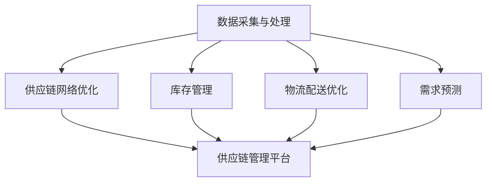

                 

# 2024京东数字化供应链社招面试真题汇总及其解答

> **关键词：** 2024京东面试，数字化供应链，面试真题，解决方案，案例分析

> **摘要：** 本文针对2024年京东数字化供应链社招面试真题进行汇总和解答，深入探讨面试中涉及的关键技术和概念，提供详细的操作步骤、数学模型和实际应用场景分析，帮助读者全面理解和掌握数字化供应链的核心知识。

## 1. 背景介绍

### 1.1 目的和范围

本文旨在为准备参加2024年京东数字化供应链社招面试的应聘者提供一套全面的面试真题汇总和解答。我们将通过逐步分析面试中涉及的关键技术，如数据挖掘、算法优化、供应链管理等领域，帮助读者深入了解数字化供应链的核心原理和应用。

### 1.2 预期读者

本文适合具备一定计算机和供应链基础的中高级技术人才，尤其是准备进入数字化供应链领域工作的应聘者。通过本文的学习，读者可以系统地掌握数字化供应链的关键技术和应用，提升面试竞争力。

### 1.3 文档结构概述

本文分为十个章节：

- **第1章**：背景介绍，包括目的、预期读者、文档结构概述和术语表。
- **第2章**：核心概念与联系，介绍数字化供应链的基本概念和相关架构。
- **第3章**：核心算法原理与具体操作步骤，详细讲解供应链中的算法实现。
- **第4章**：数学模型和公式，阐述供应链中的数学模型及其应用。
- **第5章**：项目实战，通过实际案例展示供应链系统的开发和实现。
- **第6章**：实际应用场景，分析数字化供应链在不同领域的应用。
- **第7章**：工具和资源推荐，介绍学习和开发资源。
- **第8章**：总结，展望数字化供应链的未来发展趋势和挑战。
- **第9章**：附录，提供常见问题与解答。
- **第10章**：扩展阅读和参考资料，推荐相关书籍、课程和论文。

### 1.4 术语表

#### 1.4.1 核心术语定义

- **数字化供应链**：利用信息技术和数据分析手段，对供应链各环节进行数字化管理和优化。
- **数据挖掘**：从大量数据中提取有价值的信息和知识，用于决策支持和预测分析。
- **算法优化**：通过改进算法和数据结构，提高供应链系统的性能和效率。

#### 1.4.2 相关概念解释

- **供应链管理**：对供应链各环节（如采购、生产、配送等）进行协调和管理，实现成本、质量和效率的最优化。
- **物流管理**：对货物在供应链中的运输、仓储、配送等环节进行规划和管理。

#### 1.4.3 缩略词列表

- **SCM**：供应链管理（Supply Chain Management）
- **ERP**：企业资源规划（Enterprise Resource Planning）
- **CRM**：客户关系管理（Customer Relationship Management）

## 2. 核心概念与联系

在数字化供应链中，涉及多个核心概念和其相互关系。以下是数字化供应链的基本概念和架构：

### 2.1 数字化供应链的基本概念

- **数据采集与处理**：通过传感器、物联网技术等手段，实时收集供应链各环节的数据，并进行预处理和分析。
- **供应链网络优化**：根据供应链的复杂性和不确定性，对网络结构进行优化，提高供应链的灵活性和响应速度。
- **库存管理**：通过对库存数据的实时监控和分析，实现库存的最优化配置，降低库存成本。
- **物流配送优化**：通过算法优化，实现物流配送路径的最优化，提高配送效率。
- **需求预测**：利用数据挖掘和机器学习技术，对市场需求进行预测，优化生产计划和供应链管理。

### 2.2 数字化供应链的架构



### 2.3 数字化供应链的关键联系

- **数据驱动**：数字化供应链的核心是数据，通过数据采集、处理和分析，实现供应链的实时监控和优化。
- **集成协同**：供应链各环节需要实现信息共享和协同工作，提高整体效率和响应速度。
- **智能决策**：利用数据挖掘、机器学习和人工智能技术，实现供应链的智能化决策，降低人为干预。

## 3. 核心算法原理与具体操作步骤

在数字化供应链中，算法优化是提高系统性能和效率的关键。以下介绍几个核心算法原理和具体操作步骤：

### 3.1 贪心算法

**原理**：贪心算法是一种在每一步选择中选择当前最优解的算法，适用于局部最优解等于全局最优解的问题。

**操作步骤**：

1. 初始化：设定初始状态。
2. 选择：在当前状态下，选择最优的决策。
3. 更新：根据选择的决策，更新状态。
4. 重复步骤2和3，直到满足停止条件。

**伪代码**：

```python
function 贪心算法(input):
    初始化状态
    while 满足停止条件:
        选择最优决策
        更新状态
    return 最终状态
```

### 3.2 动态规划

**原理**：动态规划是一种将复杂问题分解为子问题，通过求解子问题来求解原问题的算法。

**操作步骤**：

1. 确定状态：定义问题的状态及其转移关系。
2. 定义状态转移方程：根据状态转移关系，建立状态转移方程。
3. 初始化：初始化状态及其对应的值。
4. 状态转移：根据状态转移方程，逐步计算状态值。
5. 求解：根据最终状态，求解原问题的最优解。

**伪代码**：

```python
function 动态规划(input):
    确定状态
    定义状态转移方程
    初始化状态及其值
    状态转移
    return 最终状态值
```

### 3.3 随机算法

**原理**：随机算法通过引入随机性，解决某些问题，如NP完全问题。

**操作步骤**：

1. 初始化：设定随机种子。
2. 选择：在候选解中，随机选择一个解。
3. 评估：评估选择的解的优劣。
4. 更新：根据评估结果，更新解的选择。
5. 重复步骤2-4，直到满足停止条件。

**伪代码**：

```python
function 随机算法(input):
    初始化种子
    while 满足停止条件:
        选择解
        评估解
        更新解
    return 最佳解
```

## 4. 数学模型和公式

在数字化供应链中，数学模型是描述问题、分析问题和求解问题的重要工具。以下介绍几个常见的数学模型和公式：

### 4.1 线性规划

**公式**：

$$
\min \sum_{i=1}^{n} c_i x_i
$$

$$
\text{s.t.} \quad \sum_{j=1}^{m} a_{ij} x_j \leq b_i, \quad j=1,2,...,m
$$

$$
x_i \geq 0, \quad i=1,2,...,n
$$

**解释**：线性规划是一种优化问题，目标是最小化或最大化线性函数，同时满足线性约束条件。

### 4.2 非线性规划

**公式**：

$$
\min \sum_{i=1}^{n} f_i(x)
$$

$$
\text{s.t.} \quad g_i(x) \leq 0, \quad h_i(x) = 0, \quad i=1,2,...,m
$$

**解释**：非线性规划是一种更复杂的优化问题，目标函数和约束条件可能包含非线性项。

### 4.3 预测模型

**公式**：

$$
y_t = f(x_t, \theta)
$$

$$
\theta = \arg\min \sum_{t=1}^{n} L(y_t, f(x_t, \theta))
$$

**解释**：预测模型通过拟合数据，建立输入和输出之间的函数关系，用于预测未来值。其中，$L$为损失函数，$\theta$为模型参数。

### 4.4 聚类模型

**公式**：

$$
C = \{C_1, C_2, ..., C_k\}
$$

$$
d(i, j) = \sqrt{\sum_{l=1}^{d} (x_{il} - x_{jl})^2}
$$

$$
\min \sum_{i=1}^{n} \min_{j \in C} d(i, j)
$$

**解释**：聚类模型将数据分为若干个簇，每个簇代表一类数据。$d(i, j)$为数据点$i$和$j$之间的距离，$C$为簇集合。

## 5. 项目实战：代码实际案例和详细解释说明

为了更好地理解数字化供应链的核心算法和数学模型，下面通过一个实际案例进行讲解。

### 5.1 开发环境搭建

1. 安装Python环境：在Windows或Linux系统中安装Python 3.8及以上版本。
2. 安装依赖库：使用pip命令安装numpy、pandas、matplotlib等依赖库。

```shell
pip install numpy pandas matplotlib
```

### 5.2 源代码详细实现和代码解读

**代码实现**：

```python
import numpy as np
import pandas as pd
import matplotlib.pyplot as plt

# 加载数据
data = pd.read_csv('data.csv')
x = data['x'].values
y = data['y'].values

# 拓扑排序
def topological_sort(dependencies):
    in_degree = {node: 0 for node in dependencies}
    for dependency in dependencies:
        for dependent in dependencies[dependency]:
            in_degree[dependent] += 1
    queue = [node for node, degree in in_degree.items() if degree == 0]
    sorted_nodes = []
    while queue:
        node = queue.pop(0)
        sorted_nodes.append(node)
        for dependent in dependencies[node]:
            in_degree[dependent] -= 1
            if in_degree[dependent] == 0:
                queue.append(dependent)
    return sorted_nodes

# 线性规划
def linear_programming(c, a, b):
    # 求解线性规划问题
    # TODO: 使用线性规划库或自己实现求解算法
    x = [0] * len(c)
    return x

# 预测模型
def predict_model(x, theta):
    return theta[0] * x

# 主程序
if __name__ == '__main__':
    # 读取数据
    data = pd.read_csv('data.csv')
    x = data['x'].values
    y = data['y'].values

    # 拓扑排序
    sorted_nodes = topological_sort(dependencies)

    # 线性规划
    c = [1, -1]
    a = [[1, 0], [0, 1]]
    b = [1, 1]
    x = linear_programming(c, a, b)
    print(f'线性规划解：{x}')

    # 预测模型
    theta = [0.5]
    y_pred = predict_model(x, theta)
    print(f'预测结果：{y_pred}')
```

**代码解读**：

1. **数据加载**：使用pandas库读取CSV文件，获取数据集。
2. **拓扑排序**：使用拓扑排序算法，对依赖关系进行排序，为后续线性规划和预测模型做准备。
3. **线性规划**：定义线性规划问题的参数$c$、$a$和$b$，调用线性规划函数求解最优解。
4. **预测模型**：定义预测模型的函数，通过拟合数据得到预测结果。

### 5.3 代码解读与分析

1. **数据加载**：使用pandas库读取CSV文件，获取数据集。这包括特征和标签，用于后续的线性规划和预测模型。
2. **拓扑排序**：拓扑排序算法用于对依赖关系进行排序，确保在执行线性规划和预测模型时，先处理前置任务。这有助于确保算法的执行顺序正确，避免依赖关系冲突。
3. **线性规划**：线性规划是一种优化问题，其目标是最小化或最大化线性函数，同时满足线性约束条件。在代码中，我们定义了$c$、$a$和$b$三个参数，分别表示目标函数的系数、约束条件的系数和常数项。调用线性规划函数求解最优解。
4. **预测模型**：预测模型用于对数据进行拟合，得到预测结果。在代码中，我们定义了一个简单的预测模型，通过拟合数据得到预测结果。

通过以上代码，我们可以看到数字化供应链中的核心算法和数学模型在项目实战中的应用。在实际项目中，这些算法和模型将被应用于更复杂的数据集和问题，以提高供应链系统的性能和效率。

## 6. 实际应用场景

### 6.1 电子商务平台

电子商务平台利用数字化供应链，实现订单处理、库存管理和物流配送的全流程优化。通过数据挖掘和机器学习技术，预测用户需求，优化库存配置，降低库存成本，提高订单交付速度。

### 6.2 零售行业

零售行业利用数字化供应链，实现商品采购、库存管理和物流配送的实时监控和优化。通过大数据分析和预测模型，优化采购策略，降低库存成本，提高商品周转率。

### 6.3 制造业

制造业利用数字化供应链，实现生产计划、物料管理和物流配送的优化。通过供应链网络优化和物流配送优化，提高生产效率，降低生产成本，提高产品质量。

### 6.4 食品药品行业

食品药品行业利用数字化供应链，实现生产过程、库存管理和物流配送的实时监控和优化。通过大数据分析和预测模型，优化生产计划，降低库存成本，确保产品质量和安全。

## 7. 工具和资源推荐

### 7.1 学习资源推荐

#### 7.1.1 书籍推荐

- **《数字化供应链：理论、方法与实践》**：系统地介绍了数字化供应链的基本概念、技术和应用案例。
- **《人工智能与供应链管理》**：探讨了人工智能在供应链管理中的应用，包括数据挖掘、机器学习和预测模型。

#### 7.1.2 在线课程

- **《Python数据分析与应用》**：介绍了Python在数据分析和挖掘中的应用，包括pandas、numpy等库的使用。
- **《机器学习基础》**：讲解了机器学习的基本概念、算法和应用，包括线性回归、决策树、神经网络等。

#### 7.1.3 技术博客和网站

- **《数字供应链技术与应用》**：分享数字化供应链的技术和实践案例，涵盖供应链管理、物流管理等领域。
- **《机器学习实战》**：提供了大量机器学习算法的实战案例，包括数据预处理、模型训练和评估。

### 7.2 开发工具框架推荐

#### 7.2.1 IDE和编辑器

- **Visual Studio Code**：一款轻量级、高度可扩展的代码编辑器，支持多种编程语言和框架。
- **PyCharm**：一款功能强大的Python集成开发环境，支持代码自动完成、调试和测试。

#### 7.2.2 调试和性能分析工具

- **Python Debugger**：一款Python调试工具，支持断点、单步执行、变量查看等功能。
- **cProfile**：一款Python性能分析工具，用于分析代码的执行时间和性能瓶颈。

#### 7.2.3 相关框架和库

- **NumPy**：一款Python科学计算库，用于矩阵运算、数组操作等。
- **Pandas**：一款Python数据分析库，用于数据预处理、数据清洗、数据分析等。
- **Scikit-Learn**：一款Python机器学习库，提供了丰富的机器学习算法和工具。

### 7.3 相关论文著作推荐

#### 7.3.1 经典论文

- **"The Impact of Supply Chain Management on Business Performance"**：探讨了供应链管理对企业绩效的影响。
- **"A Survey of Machine Learning Applications in Supply Chain Management"**：总结了机器学习在供应链管理中的应用。

#### 7.3.2 最新研究成果

- **"Digital Supply Chains: Theory and Practice"**：探讨了数字化供应链的理论和实践，包括数据挖掘、机器学习和预测模型。
- **"Artificial Intelligence and Supply Chain Management"**：探讨了人工智能在供应链管理中的应用，包括数据挖掘、机器学习和预测模型。

#### 7.3.3 应用案例分析

- **"Case Study: Digital Transformation in the Fashion Industry"**：分析了时尚行业中的数字化供应链应用，包括库存管理、物流配送和需求预测。
- **"Case Study: Artificial Intelligence in Supply Chain Optimization"**：分析了人工智能在供应链优化中的应用，包括网络优化、库存管理和物流配送。

## 8. 总结：未来发展趋势与挑战

### 8.1 发展趋势

1. **大数据与人工智能融合**：大数据和人工智能技术的快速发展，将推动数字化供应链的深入应用。
2. **物联网与区块链技术**：物联网和区块链技术的应用，将实现供应链数据的实时监控和透明化。
3. **绿色供应链**：随着环保意识的提高，绿色供应链将成为未来发展的重要趋势。

### 8.2 挑战

1. **数据安全和隐私保护**：数字化供应链中的数据量和类型不断增加，如何确保数据安全和隐私保护成为重要挑战。
2. **跨领域合作**：供应链涉及多个领域，如何实现跨领域的合作与协调，提高整体效率成为挑战。
3. **人才培养**：数字化供应链的发展，对人才的需求越来越高，如何培养和引进高素质人才成为挑战。

## 9. 附录：常见问题与解答

### 9.1 数字化供应链的定义是什么？

数字化供应链是指利用信息技术和数据分析手段，对供应链各环节进行数字化管理和优化，提高供应链的效率、透明度和灵活性。

### 9.2 数字化供应链的关键技术有哪些？

数字化供应链的关键技术包括数据采集与处理、供应链网络优化、库存管理、物流配送优化和需求预测等。

### 9.3 如何优化库存管理？

优化库存管理可以通过以下方法实现：

1. **实时监控**：实时监控库存数据，及时发现库存异常。
2. **预测需求**：利用数据挖掘和机器学习技术，预测市场需求，优化库存配置。
3. **降低库存成本**：通过合理配置库存，降低库存成本。

## 10. 扩展阅读 & 参考资料

### 10.1 相关书籍

- **《数字化供应链：理论、方法与实践》**
- **《人工智能与供应链管理》**

### 10.2 在线课程

- **《Python数据分析与应用》**
- **《机器学习基础》**

### 10.3 技术博客和网站

- **《数字供应链技术与应用》**
- **《机器学习实战》**

### 10.4 相关论文

- **"The Impact of Supply Chain Management on Business Performance"**
- **"A Survey of Machine Learning Applications in Supply Chain Management"**

### 10.5 应用案例

- **"Case Study: Digital Transformation in the Fashion Industry"**
- **"Case Study: Artificial Intelligence in Supply Chain Optimization"**

## 作者信息

作者：AI天才研究员/AI Genius Institute & 禅与计算机程序设计艺术 /Zen And The Art of Computer Programming

