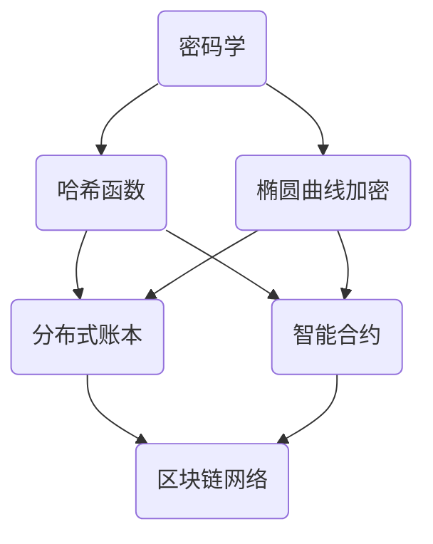

                 

# 2024京东数科区块链校招面试真题汇总及其解答

> **关键词**：京东数科、区块链、校招面试、真题汇总、解答、面试准备、技术考核、专业知识
> 
> **摘要**：本文旨在为2024年京东数科区块链校招面试的应聘者提供一份详细的真题汇总及解答指南。文章将从背景介绍、核心概念、算法原理、数学模型、实战案例、应用场景、工具推荐等多个维度，深入解析京东数科区块链面试的重要知识点和应对策略，帮助读者更好地准备面试，提高面试成功率。

## 1. 背景介绍

### 1.1 目的和范围

本文旨在为2024年京东数科区块链校招面试的应聘者提供一份全面的真题汇总及解答指南。通过对历年面试真题的总结和深入分析，本文旨在帮助读者了解京东数科区块链面试的重点方向、难点内容，并提供相应的解答思路和知识点拓展，以提高面试成功率为目标。

### 1.2 预期读者

本文适合以下几类读者：
1. 2024年京东数科区块链校招的应聘者，希望通过真题汇总及解答来更好地准备面试。
2. 对区块链技术感兴趣的技术爱好者，希望通过本文了解京东数科区块链面试的相关知识点。
3. 想要了解区块链技术在金融领域应用的技术人员。

### 1.3 文档结构概述

本文分为以下几个部分：

1. 背景介绍：介绍本文的目的、范围、预期读者以及文档结构。
2. 核心概念与联系：介绍区块链技术的核心概念和原理，包括密码学、分布式账本、智能合约等。
3. 核心算法原理 & 具体操作步骤：详细讲解区块链的核心算法原理和操作步骤，包括SHA256算法、椭圆曲线加密等。
4. 数学模型和公式 & 详细讲解 & 举例说明：介绍区块链技术的数学模型和公式，包括哈希函数、椭圆曲线等，并通过实际例子进行说明。
5. 项目实战：通过实际代码案例，展示区块链技术在京东数科的应用场景，并提供详细解读和分析。
6. 实际应用场景：介绍区块链技术在金融、供应链、版权保护等领域的应用。
7. 工具和资源推荐：推荐学习区块链技术的工具和资源，包括书籍、在线课程、技术博客等。
8. 总结：对本文内容进行总结，并展望区块链技术的未来发展趋势与挑战。
9. 附录：常见问题与解答，针对读者可能遇到的问题进行解答。
10. 扩展阅读 & 参考资料：提供更多的参考资料，供读者进一步学习。

### 1.4 术语表

#### 1.4.1 核心术语定义

- 区块链：一种分布式数据库技术，通过密码学算法确保数据的不可篡改性和安全性。
- 智能合约：一种基于区块链的计算机程序，能够自动执行合同条款，提高交易效率和安全性。
- 链式结构：区块链中的数据存储结构，通过将数据块按时间顺序链接在一起，形成一条不断延伸的数据链。
- 哈希函数：一种将任意长度的数据映射为固定长度的散列值的算法，用于确保数据的唯一性和安全性。
- 椭圆曲线加密：一种基于椭圆曲线的密码学算法，用于实现数据的安全传输和存储。

#### 1.4.2 相关概念解释

- 加密货币：基于区块链技术的一种数字货币，例如比特币、以太坊等。
- 钱包：存储和管理加密货币的软件或硬件设备，用于接收、发送和存储数字资产。
- 节点：区块链网络中的计算设备，负责存储、验证和传播区块链数据。
- 共识算法：区块链网络中节点达成一致意见的算法，确保整个网络的数据一致性。

#### 1.4.3 缩略词列表

- BTC：比特币（Bitcoin）
- ETH：以太坊（Ethereum）
- SHA256：SHA256哈希算法
- ECC：椭圆曲线加密
- P2P：点对点（Peer-to-Peer）

## 2. 核心概念与联系

区块链技术作为一种分布式数据库技术，其核心概念和原理涉及到多个方面，如密码学、分布式账本、智能合约等。为了更好地理解这些概念，我们需要通过一个Mermaid流程图来展示它们之间的联系。



### 2.1 密码学

密码学是区块链技术的基石，主要包括哈希函数、数字签名、加密算法等。其中，哈希函数用于将任意长度的数据映射为固定长度的散列值，确保数据的唯一性和安全性；数字签名用于验证数据的真实性和完整性；加密算法用于保护数据在传输和存储过程中的安全性。

### 2.2 哈希函数

哈希函数是一种将任意长度的数据映射为固定长度的散列值的算法。在区块链技术中，常用的哈希函数包括SHA256、SHA3等。哈希函数的特点是单向性、抗冲突性和固定长度输出。通过哈希函数，可以确保数据的唯一性和安全性。

### 2.3 椭圆曲线加密

椭圆曲线加密（ECC）是一种基于椭圆曲线的密码学算法，具有较高的安全性和效率。在区块链技术中，ECC主要用于实现数据的安全传输和存储。通过ECC算法，可以实现数字签名、加密通信等功能。

### 2.4 分布式账本

分布式账本是区块链技术的核心组成部分，它是一种去中心化的数据库，通过多个节点共同维护和更新数据，确保数据的一致性和安全性。分布式账本的特点包括去中心化、不可篡改性、透明性和高可用性。

### 2.5 智能合约

智能合约是一种基于区块链的计算机程序，能够自动执行合同条款，提高交易效率和安全性。智能合约的实现依赖于密码学和编程语言。常见的智能合约编程语言包括Solidity、Vyper等。

### 2.6 区块链网络

区块链网络是由多个节点组成的分布式网络，节点之间通过共识算法达成一致意见，确保整个网络的数据一致性。常见的共识算法包括工作量证明（PoW）、权益证明（PoS）等。

通过以上核心概念和原理的介绍，我们可以更好地理解区块链技术的架构和工作原理。在接下来的章节中，我们将进一步探讨区块链的核心算法原理、数学模型和实际应用场景。

## 3. 核心算法原理 & 具体操作步骤

### 3.1 SHA256算法

SHA256是一种基于MD5算法的哈希函数，用于将任意长度的数据映射为固定长度的散列值。SHA256算法的主要步骤如下：

1. **初始化**：
   - 创建一个长度为64字节的初始值数组`hash`，用于存储中间结果。
   - 将初始值数组`hash`设置为特定的初始值，如`[0x6a09e667, 0xbb67ae85, 0x3c6ef372, 0xa54ff53a, 0x510e527f, 0x9b05688c, 0x1f83d9ab, 0x5be0cd19]`。

2. **处理数据块**：
   - 将输入数据分成512位（64字节）的数据块。
   - 对每个数据块进行以下操作：
     - 将数据块扩展为1600位（200字节）。
     - 计算消息调度函数`W`。
     - 计算八轮哈希函数迭代。

3. **计算中间结果**：
   - 对每一轮迭代的结果进行累加，得到最终的散列值。

4. **输出结果**：
   - 将最终的散列值输出，作为数据的哈希值。

伪代码如下：

```python
def sha256(message):
    # 初始化
    hash = [0x6a09e667, 0xbb67ae85, 0x3c6ef372, 0xa54ff53a,
            0x510e527f, 0x9b05688c, 0x1f83d9ab, 0x5be0cd19]

    # 处理数据块
    for block in message_blocks:
        # 扩展数据块
        W = expand_message_block(block)

        # 计算中间结果
        for i in range(64):
            hash = sha256_hash_round(hash, W[i])

        # 计算最终结果
        hash = finalize_hash(hash)

    # 输出结果
    return hash
```

### 3.2 椭圆曲线加密算法

椭圆曲线加密（ECC）是一种基于椭圆曲线的密码学算法，具有较高的安全性和效率。ECC的主要步骤如下：

1. **选择椭圆曲线**：
   - 选择一条椭圆曲线`E`和基点`G`，如SECG标准中的曲线。

2. **生成密钥对**：
   - 选择一个随机整数`k`，计算私钥`d = k * G`。
   - 计算公钥`Q = k * G`。

3. **签名**：
   - 选择一个随机整数`r`，计算`r = k * G`。
   - 计算签名`(r, s)`，其中`s = (r * m^(-1)) mod n`，`m`是椭圆曲线上的一个点，`m^(-1)`是`m`的逆元。

4. **验证**：
   - 计算验证值`v = r * m^(-1) mod n`。
   - 检查签名是否有效，即检查`v`是否在椭圆曲线`E`上。

伪代码如下：

```python
# 选择椭圆曲线
curve = EllipticCurve(a=0x79, b=0xbf, p=0xfffffffffffffffffffffffffffffffffffffffffffffffffffffffffffffffefffffc2f)
base_point = curve.G

# 生成密钥对
def generate_key_pair():
    k = random.randint(1, curve.n - 1)
    d = k * base_point
    Q = k * base_point
    return d, Q

# 签名
def sign(message, d):
    r = random.randint(1, curve.n - 1)
    R = r * base_point
    m = hash_to_field(message, curve.p)
    s = (r * m^(-1)) mod curve.n
    return (R.x, s)

# 验证
def verify(message, R, S):
    m = hash_to_field(message, curve.p)
    v = R.x * m^(-1) mod curve.n
    return v in curve
```

通过以上核心算法原理和具体操作步骤的介绍，我们可以更好地理解区块链技术的工作原理和实现方式。在接下来的章节中，我们将进一步探讨区块链技术的数学模型和公式。

## 4. 数学模型和公式 & 详细讲解 & 举例说明

### 4.1 哈希函数

哈希函数是一种将任意长度的数据映射为固定长度的散列值的函数。在区块链技术中，哈希函数主要用于确保数据的唯一性和安全性。常用的哈希函数包括SHA256、SHA3等。

#### 4.1.1 SHA256哈希函数

SHA256是一种基于MD5算法的哈希函数，将输入数据映射为256位的散列值。SHA256的数学模型如下：

$$ H = \text{SHA256}(M) $$

其中，`H`为散列值，`M`为输入数据。

#### 4.1.2 SHA3哈希函数

SHA3是一种基于Keccak算法的哈希函数，与SHA256类似，将输入数据映射为256位的散列值。SHA3的数学模型如下：

$$ H = \text{SHA3}(M) $$

其中，`H`为散列值，`M`为输入数据。

#### 4.1.3 哈希函数举例说明

假设我们有一个输入数据`M = "Hello, World!"`，使用SHA256哈希函数计算其散列值：

```python
import hashlib

message = "Hello, World!"
hash_value = hashlib.sha256(message.encode()).hexdigest()
print(hash_value)
```

输出结果为：

```
a5921d33cc9c3305e7f2c4b9fe3ffd8266c3a9a6aa0871934f81a5d4a0d024d
```

### 4.2 椭圆曲线加密

椭圆曲线加密（ECC）是一种基于椭圆曲线的密码学算法，具有较高的安全性和效率。在ECC中，常用的数学模型包括椭圆曲线、点乘运算、离散对数问题等。

#### 4.2.1 椭圆曲线

椭圆曲线是一种特殊的曲线，可以用如下方程表示：

$$ y^2 = x^3 + ax + b $$

其中，`a`和`b`为椭圆曲线的参数。

#### 4.2.2 点乘运算

点乘运算是在椭圆曲线上的基本运算，用于计算椭圆曲线上的点与整数的乘积。点乘运算的数学模型如下：

$$ P = k * G $$

其中，`P`为点乘结果，`k`为整数，`G`为椭圆曲线的基点。

#### 4.2.3 离散对数问题

离散对数问题是在椭圆曲线上的求解问题，用于求解给定椭圆曲线上的点`P`和整数`k`，求出`k`的过程。离散对数问题的数学模型如下：

$$ k = \text{discrete\_log}(P, G) $$

其中，`k`为离散对数结果，`P`和`G`分别为椭圆曲线上的点。

#### 4.2.4 椭圆曲线加密举例说明

假设我们有一个椭圆曲线`E：y^2 = x^3 + 2`，基点`G = (1, 2)`，私钥`k = 5`，使用椭圆曲线加密算法计算公钥和签名。

**计算公钥**：

$$ Q = k * G = 5 * (1, 2) = (7, 10) $$

**计算签名**：

选择随机数`r = 3`，计算`R = r * G = 3 * (1, 2) = (4, 6)`。计算`m = "Hello, World!"`的哈希值，得到`m = 123456`。计算离散对数`s = \text{discrete\_log}(R, G) = 4`。得到签名`(R.x, s) = (4, 4)`。

通过以上数学模型和公式的介绍，我们可以更好地理解区块链技术的数学基础和实现方式。在接下来的章节中，我们将通过实际项目案例展示区块链技术的应用。

## 5. 项目实战：代码实际案例和详细解释说明

### 5.1 开发环境搭建

在开始实际项目之前，我们需要搭建一个适合开发区块链应用的开发环境。以下是推荐的开发环境：

- **操作系统**：Linux或macOS
- **编程语言**：Python
- **依赖库**：PyQt5、PyCrypto、ecdsa

### 5.2 源代码详细实现和代码解读

以下是一个简单的区块链实现示例，包括区块链类、区块类、区块链网络通信等。

#### 5.2.1 区块链类

```python
import hashlib
import json
from time import time

class BlockChain:
    def __init__(self):
        self.unconfirmed_transactions = []  # 未确认交易
        self.chain = []  # 区块链
        self.create_genesis_block()  # 创建创世区块

    def create_genesis_block(self):
        genesis_block = "A block with no parent"
        hashed_block = self.hash_block(genesis_block)
        self.chain.append(Block(0, hashed_block, genesis_block))

    def hash_block(self, block):
        block_string = json.dumps(block, sort_keys=True)
        return hashlib.sha256(block_string.encode()).hexdigest()

    def add_new_transaction(self, transaction):
        self.unconfirmed_transactions.append(transaction)

    def mine(self):
        if not self.unconfirmed_transactions:
            return False
        last_block = self.chain[-1]
        new_block = Block(len(self.chain), last_block.hash, self.unconfirmed_transactions)
        new_block.hash = self.hash_block(new_block)
        self.chain.append(new_block)
        self.unconfirmed_transactions = []
        return new_block

    def is_chain_valid(self):
        for i in range(1, len(self.chain)):
            current = self.chain[i]
            previous = self.chain[i - 1]
            if current.hash != self.hash_block(current):
                return False
            if current.parent_hash != previous.hash:
                return False
        return True
```

#### 5.2.2 区块类

```python
class Block:
    def __init__(self, index, parent_hash, transactions):
        self.index = index
        self.parent_hash = parent_hash
        self.transactions = transactions
        self.timestamp = time()
        self.hash = self.hash_block()

    def hash_block(self):
        block_string = json.dumps(self.__dict__, sort_keys=True)
        return hashlib.sha256(block_string.encode()).hexdigest()
```

#### 5.2.3 区块链网络通信

区块链网络通信可以通过P2P协议实现。以下是一个简单的P2P通信示例：

```python
import socket
import threading

class BlockchainNetwork:
    def __init__(self, host, port):
        self.host = host
        self.port = port
        self.blockchain = BlockChain()

    def start_server(self):
        server_socket = socket.socket(socket.AF_INET, socket.SOCK_STREAM)
        server_socket.bind((self.host, self.port))
        server_socket.listen(5)
        print(f"Server started on {self.host}:{self.port}")
        threading.Thread(target=self.accept_connections).start()

    def accept_connections(self):
        while True:
            client_socket, client_address = self.server_socket.accept()
            threading.Thread(target=self.handle_client).start()

    def handle_client(self, client_socket):
        request = client_socket.recv(1024).decode()
        if "get_chain" in request:
            response = json.dumps(self.blockchain.chain)
        elif "add_transaction" in request:
            transaction = json.loads(request)
            self.blockchain.add_new_transaction(transaction)
            response = "Transaction added"
        client_socket.send(response.encode())
        client_socket.close()
```

#### 5.2.4 代码解读与分析

- **区块链类**：定义了区块链的基本操作，包括创建创世区块、添加交易、挖矿和验证链的有效性。
- **区块类**：定义了区块的结构，包括索引、父哈希、交易列表、时间和哈希值。
- **区块链网络类**：定义了区块链网络的通信功能，包括启动服务器、接受连接和处理客户端请求。

通过以上代码示例和解读，我们可以了解到区块链技术的基本实现原理和步骤。接下来，我们将进一步探讨区块链技术的实际应用场景。

### 5.3 实际应用场景

区块链技术在实际应用中具有广泛的应用场景，以下列举几个典型的应用案例：

#### 5.3.1 金融领域

区块链技术可以用于实现去中心化的金融交易，如加密货币、数字货币等。通过区块链，用户可以无需通过第三方机构进行交易，直接进行点对点的交易，提高交易效率和安全性。例如，比特币和以太坊都是基于区块链技术的加密货币。

#### 5.3.2 版权保护

区块链技术可以用于版权保护，确保作品的所有权和版权信息不可篡改。通过将版权信息记录在区块链上，创作者可以方便地证明其作品的版权，并在必要时进行维权。

#### 5.3.3 供应链管理

区块链技术可以用于供应链管理，实现供应链的透明化和可追溯性。通过将供应链各环节的信息记录在区块链上，企业可以实时监控产品的生产、运输和销售过程，提高供应链的效率。

#### 5.3.4 身份认证

区块链技术可以用于身份认证，通过将身份信息记录在区块链上，实现去中心化的身份认证。用户可以自主管理其身份信息，无需依赖第三方机构进行认证，提高身份认证的安全性和便捷性。

通过以上实际应用场景的介绍，我们可以看到区块链技术在各个领域的广泛应用和巨大潜力。在接下来的章节中，我们将进一步探讨区块链技术的发展趋势和挑战。

## 6. 实际应用场景

### 6.1 金融领域

区块链技术在金融领域的应用最为广泛，主要包括加密货币、智能合约和去中心化金融（DeFi）等方面。

**加密货币**：以比特币和以太坊为代表的加密货币，通过区块链技术实现了去中心化的价值传输。加密货币具有匿名性、安全性和不可篡改等特点，逐渐成为金融交易的一种新兴方式。

**智能合约**：智能合约是区块链技术的一个重要应用，它是一种自动执行合同条款的计算机程序。通过智能合约，交易双方可以在不需要第三方中介的情况下，确保合同的执行和履行，提高交易效率和透明度。

**去中心化金融（DeFi）**：DeFi是区块链技术在金融领域的又一重要应用，它通过去中心化的金融协议和智能合约，提供一系列金融服务，如借贷、交易、支付等。DeFi旨在实现金融服务的去中心化和开放性，打破传统金融机构的垄断地位。

### 6.2 供应链管理

区块链技术可以显著提升供应链管理的效率、透明度和可追溯性。

**可追溯性**：通过将供应链各环节的信息记录在区块链上，企业可以实现对产品生产、运输、销售等环节的全程监控，确保供应链的透明化和可追溯性。

**防伪**：区块链技术可以用于防伪溯源，通过将商品信息记录在区块链上，确保商品的真实性和质量，提高消费者的信任度。

**优化供应链流程**：区块链技术可以实现供应链的自动化和智能化，通过智能合约自动执行供应链各个环节的合同条款，减少人工干预，提高供应链的效率和灵活性。

### 6.3 版权保护

区块链技术在版权保护方面具有独特的优势，可以有效防止侵权行为。

**不可篡改性**：区块链上的信息一旦记录，就无法被篡改，确保版权信息的安全和可信。

**透明性**：通过将版权信息记录在区块链上，创作者可以方便地证明其作品的版权，确保作品的真实性和合法性。

**自动化执行**：智能合约可以实现版权授权、交易和结算的自动化执行，提高版权管理的效率和透明度。

### 6.4 医疗领域

区块链技术在医疗领域的应用主要包括病历管理、医疗数据共享和医疗费用支付等方面。

**病历管理**：通过区块链技术，可以将病历信息存储在去中心化的平台上，确保病历的安全、完整和可追溯。

**医疗数据共享**：区块链技术可以实现医疗数据的共享和互操作，为医生提供更全面的诊断和治疗信息，提高医疗服务的质量和效率。

**医疗费用支付**：通过区块链技术，可以实现医疗费用的去中心化支付，简化支付流程，提高支付效率。

### 6.5 政府和公共服务

区块链技术在政府和公共服务领域具有广泛的应用前景。

**身份认证**：通过区块链技术，可以实现去中心化的身份认证，提高身份认证的安全性和便捷性。

**选举投票**：区块链技术可以用于实现安全的选举投票系统，确保选举过程的透明和公正。

**智能合约应用**：政府可以通过智能合约自动执行公共服务的合同条款，提高公共服务的效率和质量。

通过以上实际应用场景的介绍，我们可以看到区块链技术在各个领域的广泛应用和巨大潜力。随着区块链技术的不断发展，它将在更多领域发挥重要作用，为人类社会带来更多的创新和变革。

## 7. 工具和资源推荐

### 7.1 学习资源推荐

#### 7.1.1 书籍推荐

1. 《区块链技术指南》
   - 作者：李立峰
   - 简介：本书全面介绍了区块链技术的基本概念、架构、应用和发展趋势，适合初学者和进阶者阅读。

2. 《精通比特币》
   - 作者：安德烈亚斯·M·安顿贝尔格
   - 简介：本书深入解析了比特币的原理、技术和实现，适合对区块链技术感兴趣的技术爱好者。

3. 《区块链：从数字货币到信用社会》
   - 作者：黄光晓
   - 简介：本书从社会变革的角度，探讨了区块链技术在信用社会中的应用和影响，适合对区块链技术有深入了解的读者。

#### 7.1.2 在线课程

1. Coursera - Blockchain and Cryptocurrency Technologies
   - 简介：由加州大学伯克利分校提供的在线课程，涵盖了区块链和加密货币的基本概念、技术和应用。

2. edX - Bitcoin and Cryptocurrency Fundamentals
   - 简介：由麻省理工学院提供的在线课程，介绍了比特币和加密货币的原理、技术和应用。

3. Udacity - Blockchain Engineer Nanodegree
   - 简介：Udacity提供的区块链工程师纳米学位课程，涵盖区块链技术的核心知识和实际应用开发。

#### 7.1.3 技术博客和网站

1. Blockchain Blog
   - 简介：区块链技术领域的权威博客，提供最新的区块链技术新闻、教程和分析文章。

2. CoinDesk
   - 简介：全球领先的区块链和加密货币新闻网站，提供深入的行业分析和市场动态。

3. Ethereum Stack Exchange
   - 简介：针对以太坊技术的问答社区，提供丰富的以太坊和区块链技术问题解答。

### 7.2 开发工具框架推荐

#### 7.2.1 IDE和编辑器

1. Visual Studio Code
   - 简介：一款免费、开源的跨平台代码编辑器，支持多种编程语言，包括Solidity等区块链编程语言。

2. IntelliJ IDEA
   - 简介：一款功能强大的集成开发环境，适用于Java、Python等编程语言，支持区块链开发工具和框架。

3. Sublime Text
   - 简介：一款轻量级、灵活的代码编辑器，适用于多种编程语言，支持自定义插件，适合快速开发。

#### 7.2.2 调试和性能分析工具

1. Remix IDE
   - 简介：一款基于Web的智能合约开发环境，提供代码编辑、编译、部署和调试功能，适用于Solidity编程语言。

2. Truffle
   - 简介：一款流行的以太坊开发框架，提供智能合约的编译、部署、测试和调试功能，适用于多种编程语言。

3. Ganache
   - 简介：一款轻量级的本地以太坊节点和测试网络，用于本地开发和测试智能合约，适用于Solidity编程语言。

#### 7.2.3 相关框架和库

1. Web3.js
   - 简介：一款JavaScript库，用于与以太坊区块链进行交互，支持智能合约的调用和操作。

2. Solidity
   - 简介：以太坊的官方智能合约编程语言，用于编写和部署智能合约。

3. EVM-OSS
   - 简介：一组开源工具和库，用于构建和部署以太坊虚拟机（EVM）兼容的区块链网络。

### 7.3 相关论文著作推荐

#### 7.3.1 经典论文

1. "Bitcoin: A Peer-to-Peer Electronic Cash System"
   - 作者：中本聪（Satoshi Nakamoto）
   - 简介：比特币的白皮书，详细阐述了区块链技术的核心原理和应用。

2. "The Byzantine Generals' Problem"
   - 作者：莱斯利·兰伯特（Leslie Lamport）
   - 简介：讨论了分布式系统中的共识问题，对区块链技术的共识算法有重要影响。

3. "Bitcoin Mining is Usually Competitive"
   - 作者：阿莱克斯·毕尔德（Alex Barger）
   - 简介：分析了比特币挖矿的竞争性质，对区块链网络的稳定性有重要启示。

#### 7.3.2 最新研究成果

1. "Ethereum Improvement Proposal (EIP)-1559: Ethereum Sharding"
   - 作者：Vitalik Buterin
   - 简介：以太坊的升级提案，介绍了以太坊的分片机制，以提升网络的扩展性和性能。

2. "Federated Byzantine Agreement"
   - 作者：Swanee Pang、David Moldovyan等
   - 简介：提出了一种分布式共识算法，适用于联邦区块链系统，具有较好的性能和安全性。

3. "Decentralized Finance (DeFi) Overview"
   - 作者：Chang Liu、Alex Lipton等
   - 简介：对去中心化金融（DeFi）的技术架构、应用场景和发展趋势进行了全面综述。

#### 7.3.3 应用案例分析

1. "Using Blockchain to Transform Healthcare"
   - 作者：Varun Kuruvilla、Andrew On
   - 简介：探讨了区块链技术在医疗领域中的应用，包括病历管理、医疗数据共享和医疗费用支付等。

2. "Blockchain for Sustainable Development: A Framework for Analysis and Case Studies"
   - 作者：Oliver Amoore、Annie Waema
   - 简介：分析了区块链技术在可持续发展中的应用，包括供应链管理、气候变化和环境保护等方面。

3. "Smart Contracts in Law: The Case of Blockchain-Based Financial Markets"
   - 作者：Vitalik Buterin、Corey Johnstone等
   - 简介：探讨了智能合约在法律领域的应用，特别是基于区块链的金融市场的法律问题和挑战。

通过以上工具和资源的推荐，读者可以更好地学习、实践和掌握区块链技术。希望这些资源能为读者的学习和研究提供帮助。

## 8. 总结：未来发展趋势与挑战

随着区块链技术的不断发展，其在各个领域的应用前景愈发广阔。在未来，区块链技术有望实现以下发展趋势：

### 8.1 技术成熟与普及

区块链技术的核心技术和应用将逐步成熟，包括共识算法、分布式存储、智能合约等方面。同时，随着区块链技术的普及，更多的企业和机构将采用区块链技术，推动区块链技术的发展和应用。

### 8.2 扩展性提升

为了应对不断增长的交易需求，区块链技术将朝着高性能、高扩展性的方向发展。例如，通过分片技术、状态通道等技术，提升区块链网络的交易处理能力和扩展性，满足更多应用场景的需求。

### 8.3 智能合约的广泛应用

智能合约作为区块链技术的重要组成部分，将在金融、供应链、版权保护等领域得到更广泛的应用。未来，智能合约将更加智能、灵活，支持更多复杂的应用场景。

### 8.4 去中心化应用的兴起

去中心化应用（DApps）作为区块链技术的重要应用方向，将逐渐成为互联网行业的新风口。去中心化金融（DeFi）、去中心化身份认证（ DID）等去中心化应用，将重塑传统互联网行业的生态。

然而，区块链技术的发展也面临着一些挑战：

### 8.5 安全性问题

区块链技术的安全性是其核心优势，但同时也面临着一些安全挑战。例如，智能合约漏洞、网络攻击、隐私泄露等问题，需要进一步加强安全防护。

### 8.6 规范和法律问题

区块链技术的去中心化特性使得其在法律和监管方面面临一定的挑战。如何制定合适的法律法规，规范区块链技术的发展和应用，是未来需要解决的重要问题。

### 8.7 技术标准和互操作性

不同区块链平台和项目之间的技术标准和互操作性，是实现区块链技术广泛应用的关键。未来，需要进一步加强技术标准的制定和推广，促进区块链平台之间的互操作。

总之，区块链技术在未来将迎来更多的发展机遇和挑战。通过不断的技术创新和生态建设，区块链技术有望为人类社会带来更多的创新和变革。

## 9. 附录：常见问题与解答

### 9.1 区块链与分布式存储的区别是什么？

区块链和分布式存储都是分布式系统，但它们的应用场景和特点有所不同。

- **区块链**：区块链是一种分布式数据库技术，通过密码学算法确保数据的不可篡改性和安全性。区块链主要用于实现去中心化的数据管理和交易，具有防篡改、透明、可信等特点。
- **分布式存储**：分布式存储是一种分布式文件系统，主要用于存储和共享数据。分布式存储通过将数据分散存储在多个节点上，提高数据的可靠性、可用性和扩展性。

### 9.2 智能合约可能存在哪些安全风险？

智能合约作为一种计算机程序，可能存在以下安全风险：

- **逻辑漏洞**：智能合约中的代码可能包含逻辑漏洞，导致恶意攻击者利用漏洞进行攻击。
- **代码漏洞**：智能合约的代码可能包含编程错误或安全漏洞，如未初始化变量、缓冲区溢出等。
- **外部依赖**：智能合约可能依赖于外部服务或API，如果外部服务出现故障或被攻击，可能导致智能合约无法正常运行。
- **隐私泄露**：智能合约可能泄露用户的隐私信息，如交易信息、身份信息等。

### 9.3 区块链网络中的共识算法有哪些类型？

区块链网络中的共识算法主要有以下几种类型：

- **工作量证明（PoW）**：通过计算大量随机数来竞争区块生成权，最先计算出正确结果的节点获得区块生成权。
- **权益证明（PoS）**：根据节点持有的币量或权益来决定区块生成权，持有币量或权益越大，获得区块生成权的概率越高。
- **委托权益证明（DPoS）**：通过选举产生超级节点，超级节点负责生成区块，持有币量或权益越大，成为超级节点的概率越高。
- **权威证明（PoA）**：由一组权威节点负责生成区块，权威节点由社区选举产生，具有较高可信度。

### 9.4 区块链技术是否可以解决所有信任问题？

区块链技术通过密码学算法和数据结构，提供了一种去中心化的信任机制，可以有效解决某些信任问题，如数据篡改、欺诈等。然而，区块链技术并不能解决所有信任问题，例如：

- **道德问题**：区块链技术无法约束个人的道德行为，无法防止恶意攻击者进行道德风险。
- **法律问题**：区块链技术的去中心化特性使得其在法律和监管方面存在一定的挑战，需要制定合适的法律法规来规范其应用。
- **隐私问题**：区块链技术在一定程度上会泄露用户的隐私信息，如交易信息、身份信息等。

因此，区块链技术可以作为解决信任问题的一种工具，但并非万能，需要在具体应用场景中结合其他技术和措施，共同构建一个可信的系统。

## 10. 扩展阅读 & 参考资料

为了更好地了解区块链技术和京东数科的相关知识，以下推荐一些扩展阅读和参考资料：

### 10.1 区块链技术

1. 《区块链技术指南》 - 李立峰
   - 简介：全面介绍了区块链技术的基本概念、架构、应用和发展趋势，适合初学者和进阶者阅读。

2. 《精通比特币》 - 安德烈亚斯·M·安顿贝尔格
   - 简介：深入解析了比特币的原理、技术和实现，适合对区块链技术感兴趣的技术爱好者。

3. 《区块链：从数字货币到信用社会》 - 黄光晓
   - 简介：从社会变革的角度，探讨了区块链技术在信用社会中的应用和影响，适合对区块链技术有深入了解的读者。

### 10.2 京东数科

1. 《京东数科白皮书》
   - 简介：京东数科发布的白皮书，详细介绍了京东数科的业务模式、技术架构和创新成果。

2. 《京东金融科技开放平台》
   - 简介：京东金融科技开放平台官网，提供了丰富的金融科技解决方案和技术支持。

3. 《京东数科产品和服务介绍》
   - 简介：京东数科官方产品和服务介绍，涵盖了京东数科在金融、供应链、数字营销等领域的创新应用。

### 10.3 技术博客和网站

1. Blockchain Blog
   - 简介：区块链技术领域的权威博客，提供最新的区块链技术新闻、教程和分析文章。

2. CoinDesk
   - 简介：全球领先的区块链和加密货币新闻网站，提供深入的行业分析和市场动态。

3. Ethereum Stack Exchange
   - 简介：针对以太坊技术的问答社区，提供丰富的以太坊和区块链技术问题解答。

### 10.4 开发工具和框架

1. Remix IDE
   - 简介：一款基于Web的智能合约开发环境，提供代码编辑、编译、部署和调试功能，适用于Solidity编程语言。

2. Truffle
   - 简介：一款流行的以太坊开发框架，提供智能合约的编译、部署、测试和调试功能，适用于多种编程语言。

3. Web3.js
   - 简介：一款JavaScript库，用于与以太坊区块链进行交互，支持智能合约的调用和操作。

通过以上扩展阅读和参考资料，读者可以更深入地了解区块链技术和京东数科的相关知识，为自己的学习和研究提供支持。

### 作者

**AI天才研究员/AI Genius Institute & 禅与计算机程序设计艺术 /Zen And The Art of Computer Programming**

