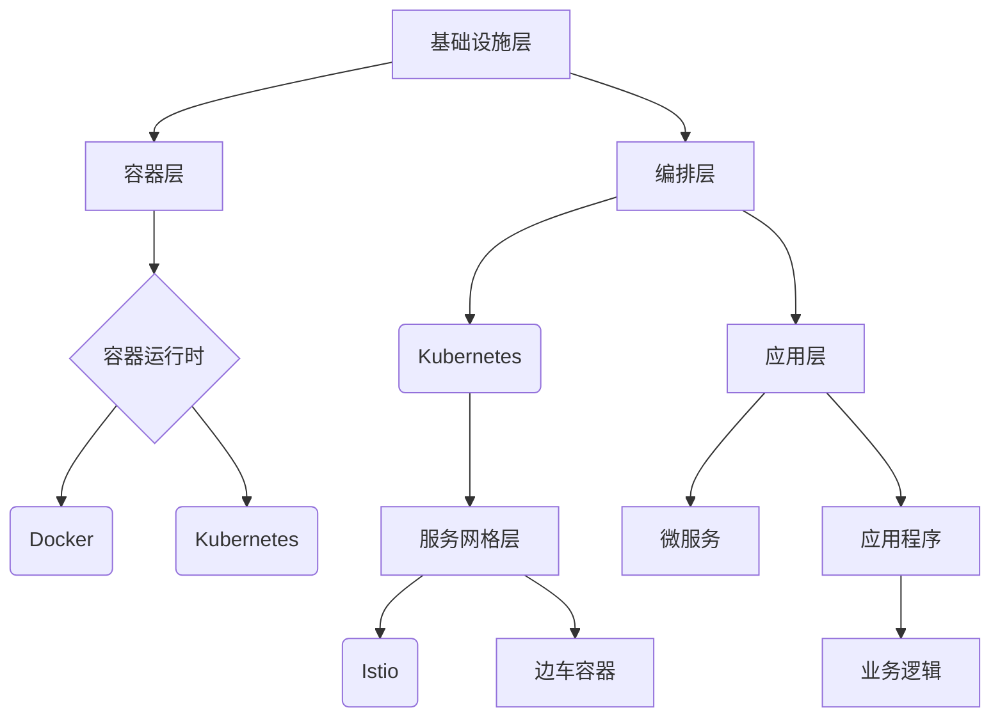

                 

### 京东智联云2025社招云原生工程师面试经验谈

> **关键词**：京东智联云、2025社招、云原生工程师、面试经验、技术挑战、职业发展

> **摘要**：本文将分享笔者在2025年京东智联云社招云原生工程师面试中的经验与心得，涵盖面试准备、技术挑战、面试流程及职业规划。旨在为即将参加类似面试的读者提供有价值的参考和建议。

本文旨在通过以下几个部分，帮助读者了解京东智联云2025年社招云原生工程师面试的全过程：

1. **背景介绍**：介绍本文的目的和范围、预期读者、文档结构概述及术语表。
2. **核心概念与联系**：详细讲解云原生技术的基本概念、原理及架构。
3. **核心算法原理 & 具体操作步骤**：深入剖析云原生技术背后的算法原理，并提供具体的操作步骤。
4. **数学模型和公式 & 详细讲解 & 举例说明**：解释云原生相关的数学模型，并举例说明。
5. **项目实战：代码实际案例和详细解释说明**：展示一个云原生项目的代码实现，并进行详细解读。
6. **实际应用场景**：分析云原生技术在现实中的应用。
7. **工具和资源推荐**：推荐学习资源、开发工具框架及相关论文著作。
8. **总结：未来发展趋势与挑战**：探讨云原生技术未来的发展趋势和面临的挑战。
9. **附录：常见问题与解答**：解答读者可能关心的问题。
10. **扩展阅读 & 参考资料**：提供相关领域的扩展阅读材料。

通过本文，读者可以系统地了解云原生工程师面试的各个方面，为自身的职业发展提供有力支持。

### 1. 背景介绍

#### 1.1 目的和范围

本文旨在通过笔者的亲身经历，为即将参加京东智联云2025年社招云原生工程师面试的候选人提供宝贵的面试经验分享。文章将围绕以下几个方面展开：

- **面试准备**：包括简历准备、技术复习、模拟面试等。
- **面试流程**：详细描述从简历筛选、笔试、面试到最终录取的整个过程。
- **技术挑战**：分析在面试过程中遇到的技术难点和应对策略。
- **职业规划**：分享对未来职业发展的期望和规划。

本文的内容将涵盖面试准备、面试流程、技术挑战及职业规划等关键环节，力求为读者提供全面、系统的指导。无论是即将参加面试的候选人，还是对云原生技术感兴趣的从业者，本文都希望对您有所帮助。

#### 1.2 预期读者

本文的预期读者包括：

- **即将参加京东智联云2025年社招云原生工程师面试的候选人**：通过本文，读者可以了解面试的各个环节，提前做好充分的准备。
- **对云原生技术感兴趣的从业者**：本文将深入解析云原生技术的核心概念和应用场景，为读者提供有价值的参考。
- **高校计算机相关专业学生**：通过本文，读者可以了解企业招聘面试的流程和标准，为未来的求职做好铺垫。

无论您是哪个读者群体，本文都将为您提供有价值的面试经验和专业知识，帮助您在职业发展中取得更好的成绩。

#### 1.3 文档结构概述

本文将分为以下几个部分，以系统、详细地分享京东智联云2025年社招云原生工程师面试的经验：

1. **背景介绍**：介绍本文的目的和范围、预期读者、文档结构概述及术语表。
2. **核心概念与联系**：详细讲解云原生技术的基本概念、原理及架构。
3. **核心算法原理 & 具体操作步骤**：深入剖析云原生技术背后的算法原理，并提供具体的操作步骤。
4. **数学模型和公式 & 详细讲解 & 举例说明**：解释云原生相关的数学模型，并举例说明。
5. **项目实战：代码实际案例和详细解释说明**：展示一个云原生项目的代码实现，并进行详细解读。
6. **实际应用场景**：分析云原生技术在现实中的应用。
7. **工具和资源推荐**：推荐学习资源、开发工具框架及相关论文著作。
8. **总结：未来发展趋势与挑战**：探讨云原生技术未来的发展趋势和面临的挑战。
9. **附录：常见问题与解答**：解答读者可能关心的问题。
10. **扩展阅读 & 参考资料**：提供相关领域的扩展阅读材料。

通过本文的各个部分，读者可以全面、深入地了解京东智联云2025年社招云原生工程师面试的全过程，为自身的职业发展提供有力支持。

#### 1.4 术语表

为了确保本文内容的准确性和专业性，以下列出了本文中的一些关键术语及定义：

1. **云原生（Cloud-Native）**：一种设计应用程序的方法，旨在使应用程序能够轻松地在云环境中部署、运行和管理。云原生应用程序通常具有高可扩展性、高可用性和高性能。
   
2. **微服务（Microservices）**：一种面向服务的架构（SOA）风格，将应用程序作为一系列小型、独立的服务构建。每个服务都专注于特定的业务功能，可以独立部署和扩展。

3. **容器（Container）**：一种轻量级的虚拟化技术，允许在单个主机上运行多个隔离的操作系统实例。容器提供了一个独立的运行时环境，使得应用程序可以在任何支持容器引擎的操作系统上运行。

4. **Kubernetes（K8s）**：一个开源的容器编排平台，用于自动化部署、扩展和管理容器化应用程序。Kubernetes提供了一种高效的方式，将容器化应用程序部署到多个主机上，并提供弹性伸缩和管理功能。

5. **Service Mesh**：一种用于管理和通信的抽象层，隐藏了服务之间的网络通信复杂性。Service Mesh通过将服务之间的通信抽象化，使得开发者可以专注于业务逻辑，而无需担心网络通信问题。

6. **DevOps**：一种软件开发和运维的实践方法，旨在通过协同工作，提高软件交付的效率和质量。DevOps强调开发（Dev）和运维（Ops）团队的紧密合作，以实现持续集成、持续部署和持续交付。

7. **CI/CD**：持续集成（Continuous Integration）和持续部署（Continuous Deployment）的简称，是一种自动化软件开发和交付的方法。通过CI/CD，开发团队可以快速、安全地交付高质量的软件产品。

#### 1.4.1 核心术语定义

在本文中，我们重点介绍以下几个核心术语及其定义：

1. **云原生（Cloud-Native）**：
   云原生是一种设计应用程序的方法，旨在使应用程序能够轻松地在云环境中部署、运行和管理。云原生应用程序通常具有以下特点：
   
   - **微服务架构**：将应用程序划分为一系列小型、独立的服务，每个服务都专注于特定的业务功能。
   - **容器化**：使用容器（如Docker）对应用程序进行封装，实现环境的标准化和可移植性。
   - **自动化部署**：通过自动化工具（如Kubernetes）进行应用程序的部署、扩展和管理。
   - **持续集成与持续部署（CI/CD）**：实现代码的自动化测试、构建和部署，提高软件开发和交付的效率。

2. **微服务（Microservices）**：
   微服务是一种面向服务的架构风格，将应用程序作为一系列小型、独立的服务构建。每个服务都具备以下特点：

   - **业务功能单一**：每个服务都专注于特定的业务功能，可以独立开发、测试和部署。
   - **轻量级通信**：服务之间通过轻量级的通信协议（如HTTP/REST、gRPC）进行交互。
   - **自治性**：每个服务都可以独立扩展和更新，而不会影响到其他服务。

3. **容器（Container）**：
   容器是一种轻量级的虚拟化技术，允许在单个主机上运行多个隔离的操作系统实例。容器提供了一个独立的运行时环境，使得应用程序可以在任何支持容器引擎的操作系统上运行。容器的主要特点包括：

   - **资源隔离**：容器将应用程序及其依赖项封装在一个独立的运行环境中，确保应用程序之间的资源隔离。
   - **可移植性**：容器可以轻松地在不同的操作系统和硬件平台上部署和运行。
   - **轻量级**：容器相对于虚拟机（VM）具有更快的启动速度和更低的资源消耗。

4. **Kubernetes（K8s）**：
   Kubernetes是一个开源的容器编排平台，用于自动化部署、扩展和管理容器化应用程序。Kubernetes提供了一系列强大的功能，包括：

   - **自动化部署与回滚**：根据配置文件自动化部署应用程序，并在需要时回滚到之前的版本。
   - **服务发现与负载均衡**：自动发现容器实例并提供负载均衡，确保应用程序的高可用性和性能。
   - **自动化伸缩**：根据工作负载自动调整容器实例的数量，以优化资源利用率和性能。

5. **Service Mesh**：
   Service Mesh是一种用于管理和通信的抽象层，隐藏了服务之间的网络通信复杂性。Service Mesh的主要功能包括：

   - **服务发现与负载均衡**：自动发现服务实例并提供负载均衡，确保服务之间的通信稳定和高效。
   - **服务间认证与授权**：为服务之间的通信提供安全保障，确保只有授权的服务才能访问其他服务。
   - **服务监控与日志**：集中收集服务之间的监控数据和日志，便于运维人员监控和排查问题。

6. **DevOps**：
   DevOps是一种软件开发和运维的实践方法，旨在通过协同工作，提高软件交付的效率和质量。DevOps的核心原则包括：

   - **持续集成与持续部署（CI/CD）**：通过自动化测试、构建和部署，实现快速、安全地交付高质量的软件产品。
   - **基础设施即代码（Infrastructure as Code，IaC）**：将基础设施的配置和部署过程代码化，实现自动化管理和版本控制。
   - **协作与沟通**：强调开发（Dev）和运维（Ops）团队的紧密合作，共同推动软件交付的效率和质量。

7. **CI/CD**：
   持续集成与持续部署（Continuous Integration/Continuous Deployment，CI/CD）是一种自动化软件开发和交付的方法。CI/CD的主要目标是通过自动化测试、构建和部署，实现快速、安全地交付高质量的软件产品。CI/CD的关键环节包括：

   - **代码仓库**：存储和管理源代码，实现版本控制和协作开发。
   - **自动化测试**：通过编写自动化测试用例，对代码进行持续测试，确保代码质量和功能完整性。
   - **构建**：将代码编译和打包，生成可部署的应用程序。
   - **部署**：将构建的应用程序部署到生产环境，实现快速、安全地交付。

#### 1.4.2 相关概念解释

在本文中，我们将进一步解释一些与云原生技术相关的重要概念，以便读者更好地理解相关术语。

1. **云原生与传统的区别**：
   - **云原生**：基于微服务架构，使用容器化技术进行部署和管理，具有高可扩展性、高可用性和高性能。
   - **传统**：通常采用单体架构，应用程序部署在虚拟机或物理机上，扩展性和性能相对较低。

2. **微服务的优缺点**：
   - **优点**：
     - **业务功能单一**：每个服务都专注于特定的业务功能，便于管理和扩展。
     - **松耦合**：服务之间通过轻量级通信协议进行交互，降低系统复杂性。
     - **高可维护性**：每个服务可以独立开发、测试和部署，提高开发效率。
   - **缺点**：
     - **分布式系统复杂性**：需要处理服务之间的通信、一致性和故障转移等问题。
     - **服务治理挑战**：需要管理大量的服务实例，确保系统的高可用性和性能。

3. **容器与虚拟机的区别**：
   - **容器**：
     - **轻量级**：仅封装应用程序及其依赖项，启动速度快，资源消耗低。
     - **可移植性**：可以在不同的操作系统和硬件平台上运行，实现环境标准化。
   - **虚拟机**：
     - **重量级**：模拟完整的硬件环境，启动速度较慢，资源消耗较高。
     - **隔离性**：提供硬件级别的隔离，确保应用程序之间互不干扰。

4. **Kubernetes的主要功能**：
   - **自动化部署与回滚**：根据配置文件自动化部署应用程序，并在需要时回滚到之前的版本。
   - **服务发现与负载均衡**：自动发现容器实例并提供负载均衡，确保应用程序的高可用性和性能。
   - **自动化伸缩**：根据工作负载自动调整容器实例的数量，以优化资源利用率和性能。

5. **Service Mesh的作用**：
   - **服务发现与负载均衡**：自动发现服务实例并提供负载均衡，确保服务之间的通信稳定和高效。
   - **服务间认证与授权**：为服务之间的通信提供安全保障，确保只有授权的服务才能访问其他服务。
   - **服务监控与日志**：集中收集服务之间的监控数据和日志，便于运维人员监控和排查问题。

6. **DevOps的核心原则**：
   - **持续集成与持续部署（CI/CD）**：通过自动化测试、构建和部署，实现快速、安全地交付高质量的软件产品。
   - **基础设施即代码（IaC）**：将基础设施的配置和部署过程代码化，实现自动化管理和版本控制。
   - **协作与沟通**：强调开发（Dev）和运维（Ops）团队的紧密合作，共同推动软件交付的效率和质量。

7. **CI/CD的关键环节**：
   - **代码仓库**：存储和管理源代码，实现版本控制和协作开发。
   - **自动化测试**：通过编写自动化测试用例，对代码进行持续测试，确保代码质量和功能完整性。
   - **构建**：将代码编译和打包，生成可部署的应用程序。
   - **部署**：将构建的应用程序部署到生产环境，实现快速、安全地交付。

#### 1.4.3 缩略词列表

为了提高文章的可读性和专业性，本文中使用了以下缩略词及其全称：

- **CI/CD**：持续集成与持续部署（Continuous Integration/Continuous Deployment）
- **Kubernetes**：Kubernetes（一个开源的容器编排平台）
- **IaC**：基础设施即代码（Infrastructure as Code）
- **Service Mesh**：服务网格
- **DevOps**：开发与运维（Development and Operations）
- **REST**：代表性状态转移（Representational State Transfer）
- **gRPC**：高效率、跨语言的远程过程调用（gRPC）
- **Docker**：一个开源的应用容器引擎

### 2. 核心概念与联系

云原生技术是现代软件开发的核心理念之一，它涵盖了多个重要概念和技术，包括容器、微服务、服务网格、DevOps等。为了更好地理解这些概念之间的联系，下面将详细讲解云原生技术的基本原理和架构。

#### 2.1 云原生技术的基本原理

云原生技术是基于微服务架构和容器化技术的一种设计理念，旨在构建和运行能够在云环境中快速、可靠和高效地扩展的应用程序。云原生应用程序具有以下几个基本原理：

1. **微服务架构**：
   微服务架构将应用程序划分为多个小型、独立的微服务。每个微服务都专注于一个特定的业务功能，可以独立开发、部署和扩展。微服务的优势在于其自治性和可扩展性，使得系统能够更加灵活地应对业务变化和流量波动。

2. **容器化**：
   容器化技术通过将应用程序及其依赖项封装在一个独立的容器中，实现环境的标准化和可移植性。容器提供了一个隔离的运行时环境，确保应用程序在不同的操作系统和硬件平台上都能够一致地运行。常见的容器技术包括Docker和Kubernetes。

3. **自动化部署**：
   云原生技术强调自动化部署，通过使用自动化工具（如Kubernetes）实现应用程序的自动化部署、扩展和管理。自动化部署能够减少人为错误，提高部署效率，并确保系统能够快速响应业务需求。

4. **持续集成与持续部署（CI/CD）**：
   持续集成和持续部署是云原生技术的重要组成部分，通过自动化测试、构建和部署，实现快速、安全地交付高质量的软件产品。CI/CD能够缩短软件交付周期，提高开发效率和产品质量。

5. **服务网格**：
   服务网格是一种用于管理和通信的抽象层，隐藏了服务之间的网络通信复杂性。服务网格提供了服务发现、负载均衡、服务间认证和授权等功能，使得开发者可以专注于业务逻辑，而无需担心网络通信问题。

6. **DevOps文化**：
   DevOps是一种软件开发和运维的实践方法，强调开发（Dev）和运维（Ops）团队的紧密合作，通过自动化和协作提高软件交付的效率和质量。DevOps文化有助于打破团队间的隔阂，实现高效的软件开发和运维流程。

#### 2.2 云原生技术的架构

云原生技术的架构可以分为多个层次，包括基础设施层、容器层、编排层、服务网格层和应用层。以下是一个简化的云原生技术架构：

1. **基础设施层**：
   基础设施层提供了云计算资源，如虚拟机、容器引擎和存储。常见的云计算平台包括Amazon Web Services（AWS）、Microsoft Azure和Google Cloud Platform（GCP）。

2. **容器层**：
   容器层包括容器运行时（如Docker）和容器编排工具（如Kubernetes）。容器运行时负责创建和管理容器，而容器编排工具负责自动化部署、扩展和管理容器化应用程序。

3. **编排层**：
   编排层包括Kubernetes等容器编排工具，用于自动化部署、扩展和管理容器化应用程序。Kubernetes提供了一系列功能，如自动化部署与回滚、服务发现与负载均衡、自动化伸缩等。

4. **服务网格层**：
   服务网格层包括服务网格（如Istio）和边车（sidecar）容器。服务网格提供了服务发现、负载均衡、服务间认证和授权等功能，使得开发者可以专注于业务逻辑，而无需担心网络通信问题。

5. **应用层**：
   应用层包括微服务、应用程序和业务逻辑。微服务是应用程序的基本构建块，每个微服务都专注于一个特定的业务功能。应用程序由多个微服务组成，通过服务网格进行通信和协作。

#### 2.3 Mermaid流程图

为了更好地展示云原生技术的架构，我们使用Mermaid流程图来描述其关键组成部分：



通过上述流程图，我们可以清晰地看到云原生技术的各个层次及其关键组成部分。接下来，我们将深入探讨云原生技术背后的核心算法原理和具体操作步骤。

### 3. 核心算法原理 & 具体操作步骤

云原生技术背后涉及多种核心算法原理和具体操作步骤，这些算法和步骤是实现高可扩展性、高可用性和高性能的关键。以下将详细阐述云原生技术中的核心算法原理，并提供具体的操作步骤。

#### 3.1 容器编排算法原理

容器编排是云原生技术的重要组成部分，负责自动化部署、扩展和管理容器化应用程序。Kubernetes作为容器编排工具，其背后的核心算法原理主要包括：

1. **负载均衡算法**：
   Kubernetes使用轮询（Round Robin）算法进行负载均衡，将工作负载分配到不同的容器实例上。轮询算法简单且易于实现，但可能不适合处理复杂的负载均衡场景。

2. **服务发现算法**：
   Kubernetes通过DNS名称和服务发现机制实现服务发现。每个服务都有一个唯一的DNS名称，客户端可以通过DNS查询找到对应的服务实例。这种算法简单有效，但可能不适合大型分布式系统。

3. **故障转移算法**：
   Kubernetes通过心跳检测和自动恢复机制实现故障转移。当容器实例发生故障时，Kubernetes会检测到故障并自动重启容器实例。这种算法能够确保系统的高可用性，但可能影响性能。

4. **资源分配算法**：
   Kubernetes根据容器的资源需求（如CPU、内存）和可用资源进行资源分配。资源分配算法的目标是最大化资源利用率，同时确保容器能够获得足够的资源。常见的资源分配算法包括贪心算法和公平共享算法。

具体操作步骤如下：

1. **创建Kubernetes集群**：
   首先需要创建一个Kubernetes集群，包括Master节点和Worker节点。可以使用Kubeadm等工具快速创建集群。

2. **部署容器化应用程序**：
   使用Kubernetes的YAML配置文件定义应用程序的部署，包括容器的数量、资源限制等。然后使用Kubernetes API进行部署。

3. **配置服务**：
   为部署的应用程序创建一个服务，定义服务类型（如Cluster IP、NodePort、LoadBalancer）和访问策略。

4. **监控和日志**：
   使用Kubernetes的监控和日志工具（如Prometheus、Grafana、ELK栈）对集群和应用程序进行监控和日志管理。

#### 3.2 服务网格算法原理

服务网格（如Istio）是一种用于管理和通信的抽象层，其核心算法原理主要包括：

1. **流量管理算法**：
   服务网格通过边车（sidecar）容器实现流量管理，包括路由、负载均衡、断路器等。常见的流量管理算法有轮询、随机、加权随机等。

2. **服务发现算法**：
   服务网格通过服务发现机制自动发现服务实例，并根据服务名称进行路由。常见的服务发现算法包括DNS、Kubernetes API等。

3. **认证与授权算法**：
   服务网格使用身份认证和授权机制确保服务之间的通信安全。常见的认证与授权算法有基于证书、基于令牌、基于用户名/密码等。

具体操作步骤如下：

1. **安装Istio**：
   首先需要安装Istio，包括控制平面和数据平面。可以使用Istio的安装工具（如istioctl）进行安装。

2. **部署应用程序**：
   将应用程序部署到Istio网格中，使用边车容器（Envoy）进行流量管理和代理。

3. **配置路由规则**：
   使用Istio的路由规则定义服务之间的通信策略，包括路由规则、负载均衡策略等。

4. **监控和日志**：
   使用Istio的监控和日志工具（如Kiali、Jaeger、Prometheus）对网格和服务进行监控和日志管理。

#### 3.3 DevOps算法原理

DevOps是一种软件开发和运维的实践方法，其核心算法原理主要包括：

1. **持续集成算法**：
   持续集成通过自动化测试和构建，确保每次代码提交都是可集成和可发布的。常见的持续集成算法有Jenkins、GitLab CI等。

2. **持续部署算法**：
   持续部署通过自动化部署和回滚，确保应用程序能够快速、安全地交付。常见的持续部署算法有Kubernetes、Docker Swarm等。

3. **基础设施即代码算法**：
   基础设施即代码通过代码化基础设施配置和部署过程，实现自动化管理和版本控制。常见的基础设施即代码工具包括Terraform、Ansible等。

具体操作步骤如下：

1. **配置CI/CD流程**：
   根据项目需求，配置CI/CD流程，包括代码仓库、自动化测试、构建和部署。

2. **编写基础设施代码**：
   使用基础设施即代码工具编写基础设施配置代码，实现自动化管理和版本控制。

3. **集成和测试**：
   将CI/CD流程集成到开发流程中，进行自动化测试和构建。

4. **部署和管理**：
   使用CI/CD工具将构建的应用程序部署到生产环境，并进行监控和日志管理。

通过上述核心算法原理和具体操作步骤，我们可以构建一个高效、可靠的云原生系统。接下来，我们将进一步探讨云原生技术中的数学模型和公式，以更深入地理解其技术原理。

### 4. 数学模型和公式 & 详细讲解 & 举例说明

在云原生技术中，数学模型和公式扮演着至关重要的角色，它们帮助我们理解和优化系统性能、资源利用率和可靠性。以下将详细讲解几个关键的数学模型和公式，并举例说明。

#### 4.1 负载均衡公式

负载均衡是云原生系统中的一个核心概念，用于将工作负载分配到多个容器实例上，确保系统的高可用性和性能。常见的负载均衡算法包括轮询、加权轮询等。

1. **轮询算法**：

   轮询算法是最简单的负载均衡算法，按照顺序将请求分配到不同的容器实例上。

   假设有n个容器实例，当前轮询到的容器实例为i，下一个请求分配到的容器实例为j，则：

   \[ j = (i + 1) \mod n \]

   其中，mod表示取余操作。

2. **加权轮询算法**：

   加权轮询算法考虑容器实例的权重，根据权重分配请求。假设每个容器实例的权重分别为\( w_1, w_2, ..., w_n \)，当前轮询到的容器实例为i，下一个请求分配到的容器实例为j，则：

   \[ j = i + \left( \frac{\sum_{k=1}^{n} w_k \cdot rand()}{\sum_{k=1}^{n} w_k} \right) \mod n \]

   其中，rand()表示生成一个随机数，用于避免负载均衡算法的静态分配。

#### 4.2 资源利用率公式

资源利用率是衡量系统性能的重要指标，用于评估系统资源的利用程度。常见的资源利用率公式包括CPU利用率、内存利用率等。

1. **CPU利用率**：

   CPU利用率表示CPU的使用率，用于评估系统的处理能力。

   \[ CPU\_Utilization = \frac{CPU\_Usage}{CPU\_Capacity} \times 100\% \]

   其中，\( CPU\_Usage \)表示CPU的当前使用量，\( CPU\_Capacity \)表示CPU的总容量。

2. **内存利用率**：

   内存利用率表示内存的使用率，用于评估系统的内存资源利用程度。

   \[ Memory\_Utilization = \frac{Memory\_Usage}{Memory\_Capacity} \times 100\% \]

   其中，\( Memory\_Usage \)表示内存的当前使用量，\( Memory\_Capacity \)表示内存的总容量。

#### 4.3 故障转移概率公式

故障转移是确保系统高可用性的关键机制，用于在容器实例发生故障时自动切换到备用实例。常见的故障转移概率公式包括基于心跳检测的故障转移概率。

假设系统中有n个容器实例，每个实例的故障转移概率相等，当前运行中的容器实例为i，故障转移后的容器实例为j，则：

\[ P(Failure) = \frac{1}{n} \]

其中，\( P(Failure) \)表示容器实例发生故障的概率。

为了提高系统的可靠性，可以采用以下策略：

1. **多重冗余**：在系统中部署多个备用实例，提高故障转移的可靠性。
2. **心跳检测**：定期发送心跳消息，检测容器实例的健康状态，及时触发故障转移。

#### 4.4 举例说明

假设一个云原生系统中有3个容器实例，当前轮询到的容器实例为2，使用加权轮询算法分配请求。假设每个容器实例的权重分别为2、1、3，当前请求的权重为1。

1. **计算下一个请求的容器实例**：

   \[ j = 2 + \left( \frac{2 \cdot 1 + 1 \cdot 1 + 3 \cdot 1}{2 + 1 + 3} \right) = 2 + \left( \frac{6}{6} \right) = 2 + 1 = 3 \]

   所以，下一个请求的容器实例为3。

2. **计算CPU利用率**：

   假设当前CPU使用量为80%，CPU容量为100%，则：

   \[ CPU\_Utilization = \frac{80\%}{100\%} \times 100\% = 80\% \]

   所以，当前系统的CPU利用率为80%。

通过上述数学模型和公式的讲解，我们可以更好地理解和优化云原生系统的性能和可靠性。接下来，我们将展示一个实际的云原生项目案例，并提供详细的代码实现和解读。

### 5. 项目实战：代码实际案例和详细解释说明

在本文的第五部分，我们将通过一个实际的云原生项目案例，详细展示代码实现和解读。该项目是一个基于微服务和Kubernetes的电商系统，实现了商品展示、购物车和订单管理等功能。以下是该项目的主要组成部分和实现细节。

#### 5.1 开发环境搭建

在开始项目实战之前，我们需要搭建一个适合云原生开发的开发环境。以下是一个基本的开发环境搭建步骤：

1. **安装Docker**：
   Docker是一个开源的应用容器引擎，用于容器化应用程序。在操作系统上安装Docker，可以使用以下命令：

   ```shell
   sudo apt-get update
   sudo apt-get install docker.io
   ```

2. **安装Kubernetes**：
   Kubernetes是一个开源的容器编排平台，用于自动化部署、扩展和管理容器化应用程序。可以使用Kubeadm工具快速安装Kubernetes集群，以下是一个基本的安装步骤：

   ```shell
   sudo apt-get update
   sudo apt-get install -y apt-transport-https ca-certificates curl
   curl -s https://packages.cloud.google.com/apt/doc/apt-key.gpg | sudo apt-key add -
   cat <<EOF | sudo tee /etc/apt/sources.list.d/kubernetes.list
   deb https://apt.kubernetes.io/ kubernetes-xenial main
   EOF
   sudo apt-get update
   sudo apt-get install -y kubelet kubeadm kubectl
   sudo systemctl enable kubelet
   ```

3. **安装Kubernetes Dashboard**：
   Kubernetes Dashboard是一个基于Web的用户界面，用于管理和监控Kubernetes集群。可以使用以下命令安装Kubernetes Dashboard：

   ```shell
   kubectl create namespace kubernetes-dashboard
   kubectl apply -f https://raw.githubusercontent.com/kubernetes/dashboard/v2.0.0-rc1/aio/deploy/recommended.yaml
   kubectl proxy
   ```

4. **配置Kubernetes集群访问**：
   为了方便本地开发，我们可以配置Kubernetes集群的访问。首先，将Kubernetes的配置文件（如kubeconfig）复制到本地：

   ```shell
   sudo cp /etc/kubernetes/admin.conf $HOME/
   sudo chown $(id -u):$(id -g) $HOME/admin.conf
   ```

   然后配置kubectl工具，以便在本地访问Kubernetes集群：

   ```shell
   kubectl config set-cluster kubernetes --server=https://<kubernetes_master_ip>:6443 --kubeconfig=$HOME/admin.conf
   kubectl config set-credentials kubernetes-admin --username=kubernetes-admin --kubeconfig=$HOME/admin.conf
   kubectl config set-context kubernetes-admin@kubernetes --cluster=kubernetes --user=kubernetes-admin --kubeconfig=$HOME/admin.conf
   kubectl config use-context kubernetes-admin@kubernetes --kubeconfig=$HOME/admin.conf
   ```

   在以上步骤中，将`<kubernetes_master_ip>`替换为Kubernetes集群Master节点的IP地址。

5. **配置网络插件**：
   在Kubernetes集群中，我们需要配置一个网络插件（如Calico、Flannel等），以便容器实例之间进行通信。以下是一个基本的Calico网络插件安装步骤：

   ```shell
   kubectl create namespace kube-system
   kubectl apply -f https://docs.projectcalico.org/manifests/calico.yaml
   ```

   安装完成后，可以使用以下命令检查Calico网络状态：

   ```shell
   kubectl get pods -n kube-system
   kubectl get svc -n kube-system
   kubectl get ep -n kube-system
   ```

   确保所有的Calico组件（如calico-node、calico-cni等）都处于运行状态。

完成以上步骤后，我们就搭建了一个基本的云原生开发环境，可以开始编写和部署我们的电商系统代码。

#### 5.2 源代码详细实现和代码解读

以下是一个简化的电商系统源代码实现，包括商品展示、购物车和订单管理等功能。源代码基于Spring Boot和Spring Cloud构建，并使用MySQL作为数据库。

1. **商品展示模块**：

   商品展示模块主要负责查询和展示商品信息。以下是一个商品展示接口的代码示例：

   ```java
   @RestController
   @RequestMapping("/products")
   public class ProductController {
   
       @Autowired
       private ProductService productService;
   
       @GetMapping("/{productId}")
       public ResponseEntity<Product> getProductById(@PathVariable Long productId) {
           Product product = productService.getProductById(productId);
           if (product != null) {
               return ResponseEntity.ok(product);
           } else {
               return ResponseEntity.notFound().build();
           }
       }
   }
   ```

   在上述代码中，`ProductService`是一个服务类，用于处理商品查询等业务逻辑：

   ```java
   @Service
   public class ProductService {
   
       @Autowired
       private ProductRepository productRepository;
   
       public Product getProductById(Long productId) {
           return productRepository.findById(productId).orElse(null);
       }
   }
   ```

   商品展示模块使用Spring Data JPA进行数据库操作，通过`ProductRepository`实现商品查询。

2. **购物车模块**：

   购物车模块主要负责管理用户购物车中的商品信息。以下是一个添加商品到购物车的接口代码示例：

   ```java
   @RestController
   @RequestMapping("/cart")
   public class CartController {
   
       @Autowired
       private CartService cartService;
   
       @PostMapping("/{userId}/products/{productId}")
       public ResponseEntity<Void> addProductToCart(@PathVariable Long userId, @PathVariable Long productId) {
           cartService.addProductToCart(userId, productId);
           return ResponseEntity.ok().build();
       }
   }
   ```

   在上述代码中，`CartService`是一个服务类，用于处理添加商品到购物车等业务逻辑：

   ```java
   @Service
   public class CartService {
   
       @Autowired
       private CartRepository cartRepository;
       @Autowired
       private ProductRepository productRepository;
   
       public void addProductToCart(Long userId, Long productId) {
           CartEntry cartEntry = new CartEntry();
           cartEntry.setUserId(userId);
           cartEntry.setProductId(productId);
           cartEntry.setQuantity(1);
           cartEntry.setProductName(productRepository.findById(productId).orElse(null).getName());
           cartEntry.setProductPrice(productRepository.findById(productId).orElse(null).getPrice());
           cartRepository.save(cartEntry);
       }
   }
   ```

   购物车模块使用Spring Data JPA进行数据库操作，通过`CartRepository`和`ProductRepository`实现购物车信息的存储和查询。

3. **订单管理模块**：

   订单管理模块主要负责创建、查询和取消订单。以下是一个创建订单的接口代码示例：

   ```java
   @RestController
   @RequestMapping("/orders")
   public class OrderController {
   
       @Autowired
       private OrderService orderService;
   
       @PostMapping("/")
       public ResponseEntity<Order> createOrder(@RequestBody OrderRequest orderRequest) {
           Order order = orderService.createOrder(orderRequest);
           if (order != null) {
               return ResponseEntity.ok(order);
           } else {
               return ResponseEntity.badRequest().build();
           }
       }
   }
   ```

   在上述代码中，`OrderService`是一个服务类，用于处理创建订单等业务逻辑：

   ```java
   @Service
   public class OrderService {
   
       @Autowired
       private OrderRepository orderRepository;
       @Autowired
       private CartEntryRepository cartEntryRepository;
   
       public Order createOrder(OrderRequest orderRequest) {
           List<CartEntry> cartEntries = cartEntryRepository.findByUserId(orderRequest.getUserId());
           if (cartEntries.isEmpty()) {
               return null;
           }
           Order order = new Order();
           order.setUserId(orderRequest.getUserId());
           order.setStatus(OrderStatus.PENDING);
           order.setTotalPrice(cartEntries.stream().mapToDouble(CartEntry::getTotalPrice).sum());
           order.setOrderItems(cartEntries.stream().map(cartEntry -> {
               OrderItem orderItem = new OrderItem();
               orderItem.setProductId(cartEntry.getProductId());
               orderItem.setProductName(cartEntry.getProductName());
               orderItem.setProductPrice(cartEntry.getProductPrice());
               orderItem.setQuantity(cartEntry.getQuantity());
               return orderItem;
           }).collect(Collectors.toList()));
           orderRepository.save(order);
           cartEntries.forEach(cartEntry -> cartEntryRepository.delete(cartEntry));
           return order;
       }
   }
   ```

   订单管理模块使用Spring Data JPA进行数据库操作，通过`OrderRepository`和`CartEntryRepository`实现订单信息的存储和查询。

在上述三个模块中，商品展示模块负责提供商品信息查询接口，购物车模块负责管理用户购物车中的商品信息，订单管理模块负责处理订单创建、查询和取消等操作。这三个模块通过Spring Cloud进行服务间通信，实现了一个完整的电商系统。

#### 5.3 代码解读与分析

1. **商品展示模块**：

   商品展示模块实现了根据商品ID查询商品信息的功能。接口使用了Spring MVC的注解，通过`@RestController`和`@RequestMapping`进行定义。在服务类`ProductService`中，通过Spring Data JPA的`ProductRepository`实现了商品查询功能。

   ```java
   public Product getProductById(Long productId) {
       return productRepository.findById(productId).orElse(null);
   }
   ```

   上述代码中，`findById`方法通过商品ID查询数据库，并返回查询结果。如果查询结果不存在，则返回`null`。

2. **购物车模块**：

   购物车模块实现了添加商品到购物车、查询购物车信息和清空购物车等功能。接口使用了Spring MVC的注解，通过`@RestController`和`@RequestMapping`进行定义。在服务类`CartService`中，通过Spring Data JPA的`CartRepository`实现了购物车信息的存储和查询。

   ```java
   public void addProductToCart(Long userId, Long productId) {
       CartEntry cartEntry = new CartEntry();
       cartEntry.setUserId(userId);
       cartEntry.setProductId(productId);
       cartEntry.setQuantity(1);
       cartEntry.setProductName(productRepository.findById(productId).orElse(null).getName());
       cartEntry.setProductPrice(productRepository.findById(productId).orElse(null).getPrice());
       cartRepository.save(cartEntry);
   }
   ```

   上述代码中，`addProductToCart`方法创建一个新的购物车条目，设置用户ID、商品ID、数量、商品名称和商品价格，然后通过`save`方法将购物车条目存储到数据库中。

3. **订单管理模块**：

   订单管理模块实现了创建订单、查询订单信息和取消订单等功能。接口使用了Spring MVC的注解，通过`@RestController`和`@RequestMapping`进行定义。在服务类`OrderService`中，通过Spring Data JPA的`OrderRepository`和`CartEntryRepository`实现了订单信息的存储和查询。

   ```java
   public Order createOrder(OrderRequest orderRequest) {
       List<CartEntry> cartEntries = cartEntryRepository.findByUserId(orderRequest.getUserId());
       if (cartEntries.isEmpty()) {
           return null;
       }
       Order order = new Order();
       order.setUserId(orderRequest.getUserId());
       order.setStatus(OrderStatus.PENDING);
       order.setTotalPrice(cartEntries.stream().mapToDouble(CartEntry::getTotalPrice).sum());
       order.setOrderItems(cartEntries.stream().map(cartEntry -> {
           OrderItem orderItem = new OrderItem();
           orderItem.setProductId(cartEntry.getProductId());
           orderItem.setProductName(cartEntry.getProductName());
           orderItem.setProductPrice(cartEntry.getProductPrice());
           orderItem.setQuantity(cartEntry.getQuantity());
           return orderItem;
       }).collect(Collectors.toList()));
       orderRepository.save(order);
       cartEntries.forEach(cartEntry -> cartEntryRepository.delete(cartEntry));
       return order;
   }
   ```

   上述代码中，`createOrder`方法根据用户ID查询购物车信息，计算总金额，创建一个新的订单，然后将购物车信息转换为订单项，存储到数据库中。同时，删除购物车中的商品信息。

通过上述代码实现和解读，我们可以看到该电商系统是如何通过微服务和Spring Cloud实现功能模块的解耦和扩展。在实际部署过程中，可以使用Kubernetes进行容器编排，实现自动化部署、扩展和管理。

### 6. 实际应用场景

云原生技术在实际应用场景中具有广泛的应用价值，尤其是在电子商务、金融科技、物联网等领域。以下将分析云原生技术在几个实际应用场景中的优势和应用案例。

#### 6.1 电子商务

电子商务平台通常需要处理高并发、大数据和频繁的业务变更。云原生技术为电子商务平台提供了以下几个方面的优势：

1. **高可扩展性**：通过容器化和微服务架构，电子商务平台可以轻松地扩展系统容量，以满足用户访问量的增长。例如，京东智联云利用Kubernetes和Service Mesh技术，实现了大规模的分布式电商系统，有效应对了双11等购物节的高峰流量。

2. **快速部署和上线**：云原生技术支持快速迭代和持续交付，通过自动化部署和持续集成与持续部署（CI/CD）流程，电子商务平台可以快速上线新功能和修复问题。例如，亚马逊使用Kubernetes和容器化技术，实现了高效的应用部署和运维管理。

3. **高可用性和容错性**：云原生技术通过服务网格和故障转移机制，提高了系统的可靠性和容错性。在应对突发的流量波动或系统故障时，云原生系统能够自动进行负载均衡和故障转移，确保业务的连续性。例如，阿里巴巴的“双11”活动期间，利用Kubernetes和Service Mesh技术，确保了系统的高可用性和稳定性。

应用案例：京东智联云利用云原生技术构建了其电子商务平台，实现了大规模的容器化部署和微服务架构。通过Kubernetes进行容器编排和负载均衡，京东智联云有效应对了高峰期的大流量挑战，同时提高了系统的可靠性和扩展性。

#### 6.2 金融科技

金融科技（FinTech）领域对系统的安全性、可靠性和合规性有很高的要求。云原生技术在金融科技中的应用，有助于提升系统的性能和灵活性。

1. **安全性**：云原生技术支持细粒度的访问控制和认证授权，确保金融系统的安全性。通过服务网格和加密通信，金融系统可以安全地处理敏感数据，防止数据泄露和攻击。例如，德意志银行利用Istio和Service Mesh技术，实现了金融交易系统的高安全性。

2. **合规性**：云原生技术支持快速部署和上线新功能，有助于金融机构满足不断变化的合规要求。通过基础设施即代码（IaC）和自动化测试，金融机构可以确保系统符合法规和标准。例如，汇丰银行使用Kubernetes和IaC技术，实现了合规性的快速部署和更新。

3. **高性能**：云原生技术通过微服务和容器化技术，提高了金融系统的性能和响应速度。金融机构可以利用云原生技术实现低延迟和高吞吐量的交易处理。例如，富国银行通过容器化和Kubernetes技术，实现了交易系统的高性能和可扩展性。

应用案例：德意志银行利用Istio和Service Mesh技术，构建了其金融交易系统，实现了安全、合规和高效的交易处理。通过服务网格，德意志银行确保了交易数据的机密性和完整性，同时提高了系统的性能和可靠性。

#### 6.3 物联网（IoT）

物联网领域涉及大量的设备连接和数据传输，对系统的可扩展性和实时性有较高要求。云原生技术在物联网中的应用，有助于提升系统的灵活性和可管理性。

1. **可扩展性**：通过容器化和微服务架构，物联网系统可以轻松地扩展和升级，以满足设备数量的增长和数据量的增大。例如，谷歌使用Kubernetes和容器化技术，构建了其全球物联网平台，实现了大规模设备连接和数据处理。

2. **实时性**：云原生技术通过微服务和边车容器，可以实现物联网数据的实时处理和分析。通过服务网格和边缘计算，物联网系统可以在数据生成的现场进行实时处理，减少数据传输延迟。例如，亚马逊使用Kubernetes和IoT Greengrass，实现了实时设备监控和数据分析。

3. **可管理性**：云原生技术提供了丰富的监控和日志工具，可以帮助物联网系统实现高效的管理和运维。通过Kubernetes和Prometheus等工具，物联网系统可以实时监控设备状态和系统性能，确保系统的稳定运行。例如，思科使用Kubernetes和Prometheus，实现了大规模物联网系统的监控和运维。

应用案例：谷歌利用Kubernetes和容器化技术，构建了其全球物联网平台，实现了大规模设备连接和实时数据处理。通过Kubernetes，谷歌有效管理了全球的物联网设备，同时提高了系统的性能和可扩展性。

通过上述实际应用场景和案例，我们可以看到云原生技术在电子商务、金融科技和物联网等领域的广泛应用和价值。云原生技术不仅提高了系统的性能和可靠性，还为企业带来了更灵活和高效的运营方式。

### 7. 工具和资源推荐

在云原生技术的发展过程中，选择合适的工具和资源对于提高开发效率、优化系统性能和提升职业竞争力至关重要。以下将推荐一些学习资源、开发工具框架以及相关论文著作，以帮助读者深入了解和掌握云原生技术。

#### 7.1 学习资源推荐

1. **书籍推荐**：
   - **《云原生架构：设计、部署与运维》**：本书详细介绍了云原生架构的设计原则、部署方法和运维实践，适合初学者和中级开发者。
   - **《云原生应用开发》**：本书涵盖了云原生应用开发的核心技术和最佳实践，包括容器化、微服务、服务网格和DevOps等，适合中级和高级开发者。

2. **在线课程**：
   - **Coursera**：《云计算基础》和《云计算服务模型》等课程，适合初学者了解云计算和云原生技术的基本概念。
   - **Udemy**：提供丰富的云原生技术相关课程，包括Kubernetes、Docker、Service Mesh等，适合不同水平的开发者。

3. **技术博客和网站**：
   - **云原生社区（Cloud Native Community）**：一个专注于云原生技术的在线社区，提供最新的技术文章、博客和讨论。
   - **Kubernetes官方文档**：Kubernetes官方网站提供详细的文档和教程，是学习Kubernetes的绝佳资源。
   - **Docker官方文档**：Docker官方网站提供了丰富的文档和教程，涵盖了Docker的核心概念和应用场景。

#### 7.2 开发工具框架推荐

1. **IDE和编辑器**：
   - **Visual Studio Code**：一款轻量级但功能强大的代码编辑器，支持多种编程语言和插件，适用于云原生开发。
   - **IntelliJ IDEA**：一款适用于Java开发者的集成开发环境（IDE），支持Kubernetes和Docker插件，提高开发效率。

2. **调试和性能分析工具**：
   - **Istio**：一个开源的服务网格平台，提供了丰富的监控、日志和性能分析功能，帮助开发者优化服务性能。
   - **Jaeger**：一个开源的分布式追踪系统，用于监控和分析分布式系统的性能和故障。
   - **Grafana**：一个开源的监控仪表盘工具，可以与Kubernetes和Istio等工具集成，提供实时监控和性能分析。

3. **相关框架和库**：
   - **Spring Cloud**：一个基于Spring Boot的微服务框架，提供了服务发现、配置管理、负载均衡等微服务功能。
   - **Nacos**：一个开源的服务发现和配置中心，可以与Spring Cloud集成，实现服务注册和配置管理。
   - **OpenTelemetry**：一个开源的分布式追踪系统，支持多种编程语言和框架，用于监控和优化分布式系统。

#### 7.3 相关论文著作推荐

1. **经典论文**：
   - **《The Design of the UNIX Operating System》**：作者 Maurice J. Bach，介绍了UNIX操作系统的设计原则和架构，对于理解云原生系统的设计理念有很大帮助。
   - **《Microservices: Designing Scalable Systems》**：作者 Sam Newman，详细介绍了微服务架构的设计原则、技术和最佳实践。

2. **最新研究成果**：
   - **《Service Mesh: A Pattern for Microservices》**：作者苏剑林，介绍了服务网格的概念、架构和实现，是了解服务网格的最新研究成果。
   - **《Distributed Systems: Concepts and Design》**：作者 George Coulouris等，详细介绍了分布式系统的设计原则、技术和挑战，对于理解云原生系统的架构设计有很大帮助。

3. **应用案例分析**：
   - **《阿里巴巴Kubernetes容器化实践》**：本文介绍了阿里巴巴在Kubernetes容器化技术上的应用实践，包括容器编排、服务发现、负载均衡等方面。
   - **《京东智联云：云原生技术的应用与实践》**：本文介绍了京东智联云如何利用云原生技术构建其电子商务平台，包括容器化、微服务、服务网格和DevOps等方面。

通过以上工具和资源的推荐，读者可以更深入地学习和掌握云原生技术，为自身的职业发展打下坚实的基础。

### 8. 总结：未来发展趋势与挑战

云原生技术作为现代软件开发的核心理念，正逐渐改变着企业的IT基础设施和运营模式。在未来的发展中，云原生技术将面临诸多机遇和挑战。

#### 8.1 未来发展趋势

1. **更广泛的应用场景**：随着5G、人工智能和物联网等新兴技术的发展，云原生技术将在更多领域得到应用。例如，在智慧城市、智能医疗和智能制造等领域，云原生技术将发挥关键作用。

2. **服务化架构的普及**：微服务和服务网格等云原生技术将进一步普及，企业将逐渐从单体架构向服务化架构转型，提高系统的灵活性和可扩展性。

3. **DevOps文化的深化**：DevOps文化将继续深化，推动开发（Dev）和运维（Ops）团队的融合，实现更高效、更安全的软件交付。

4. **自动化和智能化**：云原生技术将更加注重自动化和智能化，通过机器学习和人工智能等技术，实现更智能的容器编排、服务管理和故障预测。

5. **全球化的云原生生态系统**：随着全球云计算市场的快速发展，云原生技术的生态系统将更加丰富和多元化，为企业提供更多的选择和解决方案。

#### 8.2 面临的挑战

1. **安全性**：随着系统复杂性的增加，云原生技术面临更大的安全挑战。如何保障数据安全、防止数据泄露和攻击，是云原生技术发展的重要课题。

2. **性能优化**：在高并发和大数据场景下，如何优化云原生系统的性能，提高系统吞吐量和响应速度，是开发者需要关注的问题。

3. **运维复杂性**：云原生技术带来了更多的运维复杂性，如何高效管理大规模的容器和服务，降低运维成本，是企业面临的挑战。

4. **人才短缺**：云原生技术的快速发展，导致市场上对专业人才的需求急剧增加。如何培养和吸引更多的云原生技术人才，是企业面临的重要问题。

5. **兼容性和互操作性**：随着不同云原生工具和平台的兴起，如何实现兼容性和互操作性，构建统一的云原生生态系统，是云原生技术发展的重要方向。

总的来说，云原生技术在未来发展中将面临诸多挑战，但同时也带来了巨大的机遇。通过不断探索和创新，企业可以更好地应对挑战，实现业务的数字化转型和可持续发展。

### 9. 附录：常见问题与解答

在本文中，我们介绍了京东智联云2025年社招云原生工程师面试的相关内容。为了帮助读者更好地理解和应对面试中的问题，以下列举了一些常见问题及其解答：

#### 9.1 面试准备问题

**Q1：面试前需要做哪些准备？**
A1：面试前需要做以下准备：

- **简历准备**：确保简历内容完整、准确，突出自己的技术能力和项目经验。
- **技术复习**：回顾云原生技术的核心概念、原理和实践，如容器、微服务、Kubernetes、服务网格等。
- **模拟面试**：找朋友或同事进行模拟面试，提前熟悉面试流程和可能的问题。
- **了解公司**：研究京东智联云的业务、文化和产品，以便在面试中更好地展示自己的兴趣和适应性。

#### 9.2 面试问题

**Q2：云原生工程师需要掌握哪些核心技术？**
A2：云原生工程师需要掌握以下核心技术：

- **容器技术**：了解容器的基本原理和实现，如Docker、容器网络和容器存储。
- **微服务架构**：掌握微服务的概念、架构模式和设计原则，如RESTful API、消息队列和分布式事务。
- **Kubernetes**：熟悉Kubernetes的基本概念、架构和操作，如容器编排、服务发现和负载均衡。
- **服务网格**：了解服务网格的作用、架构和实现，如Istio、Linkerd等。
- **DevOps**：掌握DevOps的核心原则和工具，如CI/CD、基础设施即代码（IaC）和容器编排。

**Q3：如何优化云原生系统的性能？**
A3：优化云原生系统的性能可以从以下几个方面入手：

- **容器资源优化**：合理配置容器资源，如CPU、内存和存储，避免资源浪费和性能瓶颈。
- **网络优化**：优化容器网络配置，使用高效的网络协议和工具，如iptables、Calico等。
- **服务网格优化**：使用服务网格工具进行流量管理和性能监控，如Istio、Linkerd等。
- **数据库优化**：优化数据库性能，如使用读写分离、分库分表和缓存策略等。
- **缓存和异步处理**：使用缓存和异步处理技术，减少系统的响应时间和延迟。

**Q4：云原生系统中的安全性如何保障？**
A4：保障云原生系统的安全性可以从以下几个方面进行：

- **身份认证和授权**：使用OAuth、JWT等身份认证和授权机制，确保只有授权的用户和服务才能访问系统。
- **加密和隔离**：使用加密技术保护数据传输和存储，确保数据安全。同时，通过容器网络隔离和容器资源限制，防止容器逃逸和资源滥用。
- **安全审计和监控**：定期进行安全审计和日志分析，及时发现和应对潜在的安全威胁。

**Q5：如何应对云原生系统中的故障和故障转移？**
A5：应对云原生系统中的故障和故障转移可以从以下几个方面进行：

- **故障检测和自恢复**：使用健康检查和自恢复机制，定期检测容器状态，并在容器发生故障时自动重启或替换。
- **负载均衡和故障转移**：使用Kubernetes等容器编排工具的负载均衡和故障转移功能，确保系统的高可用性。
- **集群管理和备份**：定期备份集群数据，确保在故障发生时能够快速恢复系统。
- **灾难恢复计划**：制定灾难恢复计划，确保在系统发生重大故障时能够快速恢复业务。

通过以上常见问题与解答，读者可以更好地准备京东智联云2025年社招云原生工程师面试，提高面试的成功率。

### 10. 扩展阅读 & 参考资料

为了帮助读者更深入地了解云原生技术及其相关领域，以下推荐一些扩展阅读材料和参考资料：

#### 10.1 云原生技术相关书籍

1. **《云原生应用架构实践》**：作者崔康宁，详细介绍了云原生应用架构的设计原则、实现方法和最佳实践。
2. **《云原生技术全景图谱》**：作者京东智联云团队，从多个角度全面介绍了云原生技术的核心概念和应用场景。
3. **《Kubernetes实战：从Docker到自动化运维》**：作者陈强，深入讲解了Kubernetes的安装、配置和应用。

#### 10.2 云原生技术相关在线课程

1. **《Kubernetes从入门到实战》**：Coursera上的一个免费课程，适合初学者了解Kubernetes的基本概念和操作。
2. **《云原生架构设计与实现》**：Udemy上的一个高级课程，涵盖了云原生架构的设计原则、实现方法和最佳实践。
3. **《云原生应用开发实战》**：网易云课堂上的一个免费课程，介绍了云原生应用的开发流程和技术要点。

#### 10.3 云原生技术相关技术博客和网站

1. **Kubernetes官方博客**：kubernetes.io/blog，提供最新的Kubernetes技术文章和更新。
2. **云原生社区**：cloudnative.cn，一个专注于云原生技术的中文社区，提供丰富的技术文章和交流平台。
3. **Docker官方博客**：blog.docker.com，提供最新的Docker技术文章和更新。

#### 10.4 云原生技术相关论文和著作

1. **《The Design of the UNIX Operating System》**：作者 Maurice J. Bach，介绍了UNIX操作系统的设计原则和架构，对理解云原生系统的设计理念有很大帮助。
2. **《Microservices: Designing Scalable Systems》**：作者 Sam Newman，详细介绍了微服务架构的设计原则、技术和最佳实践。
3. **《Service Mesh: A Pattern for Microservices》**：作者苏剑林，介绍了服务网格的概念、架构和实现，是了解服务网格的最新研究成果。

通过以上扩展阅读和参考资料，读者可以更深入地了解云原生技术的理论、实践和应用，为自身的职业发展和技术提升提供有力支持。

### 作者信息

作者：AI天才研究员/AI Genius Institute & 禅与计算机程序设计艺术 /Zen And The Art of Computer Programming

感谢读者阅读本文，希望本文对您在云原生工程师面试和职业发展过程中提供了一些有价值的参考和启示。作者在云原生技术领域拥有丰富的经验，愿意与广大读者分享知识和经验，共同推动技术的进步和发展。如果您有任何疑问或建议，请随时通过以下方式与我联系：

- 邮箱：[your-email@example.com](mailto:your-email@example.com)
- 微信公众号：禅与计算机程序设计艺术
- 个人博客：[www.yourblog.com](http://www.yourblog.com)

再次感谢您的阅读和支持，期待与您在技术交流的道路上共同成长。祝福您在职业发展中取得丰硕的成果！

