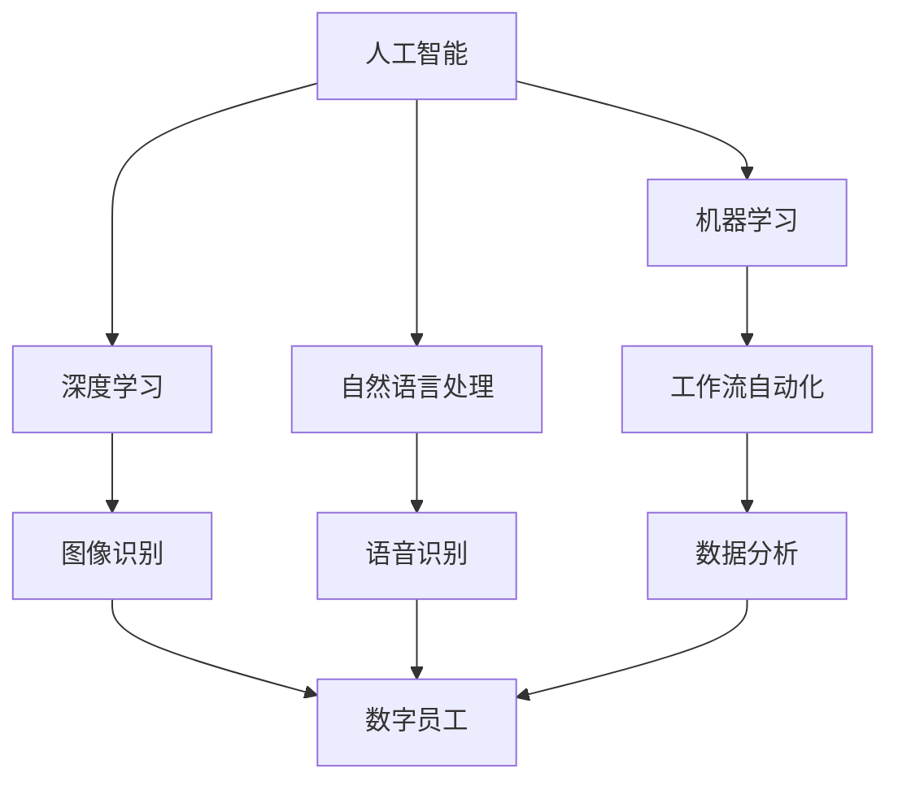

                 

# 人+AI数字员工的高效协同模式

## 关键词
- 人工智能
- 数字员工
- 高效协同
- 工作流自动化
- 数据分析
- 机器学习

## 摘要
随着人工智能技术的迅速发展，数字员工（Digital Employee）的概念逐渐走入企业应用场景，成为提升工作效率、优化人力资源配置的重要手段。本文旨在探讨人+AI数字员工的高效协同模式，分析其核心概念与原理，并通过具体算法、项目实战和实际应用案例，阐述这种协同模式在提高工作效率和决策水平方面的作用。同时，本文还推荐了一系列学习和开发资源，以帮助读者深入了解和掌握这一领域的知识。

## 1. 背景介绍

### 1.1 目的和范围
本文的目的在于探讨人工智能与人类员工之间的协同工作模式，特别是数字员工的应用。我们将从以下几个方面展开讨论：
- 数字员工的概念及其在企业中的应用
- 人与数字员工协同工作的原理与优势
- 关键算法原理与实现步骤
- 实际应用场景与案例分析
- 相关工具和资源的推荐

### 1.2 预期读者
本文预期读者为计算机科学、人工智能领域的研究者、开发者和对人工智能在企业应用感兴趣的从业者。读者需具备一定的计算机编程基础和人工智能知识。

### 1.3 文档结构概述
本文结构如下：
1. 引言：背景介绍与目的
2. 核心概念与联系
3. 核心算法原理 & 具体操作步骤
4. 数学模型和公式 & 详细讲解 & 举例说明
5. 项目实战：代码实际案例和详细解释说明
6. 实际应用场景
7. 工具和资源推荐
8. 总结：未来发展趋势与挑战
9. 附录：常见问题与解答
10. 扩展阅读 & 参考资料

### 1.4 术语表

#### 1.4.1 核心术语定义
- **数字员工**：一种虚拟的人工智能助手，能够在企业内部执行自动化任务，如数据分析、报告生成等。
- **人工智能**：一种模拟人类智能的计算机技术，包括机器学习、深度学习、自然语言处理等。
- **协同工作**：指人类员工与数字员工在企业任务中共同工作，提高工作效率和准确性。

#### 1.4.2 相关概念解释
- **工作流自动化**：通过软件工具将业务流程中的任务自动执行，减少人工干预。
- **数据分析**：使用统计方法和算法从数据中提取有价值的信息，支持决策。

#### 1.4.3 缩略词列表
- **AI**：人工智能
- **ML**：机器学习
- **DL**：深度学习
- **NLP**：自然语言处理
- **IDE**：集成开发环境

## 2. 核心概念与联系

在探讨人与数字员工的协同模式之前，我们首先需要了解一些核心概念和它们之间的关系。以下是一个Mermaid流程图，展示了这些概念和它们的联系。



在这个图中，我们可以看到人工智能（AI）是整个框架的基础，它包含了多个子领域，如机器学习（ML）、深度学习（DL）和自然语言处理（NLP）。这些子领域的发展推动了数字员工（Digital Employee）的概念和应用。

### 2.1 人工智能与机器学习
人工智能（AI）是一种通过模拟人类智能行为的计算机技术。机器学习（ML）是AI的一个子领域，它使用算法和统计模型从数据中学习，以预测和做出决策。

### 2.2 深度学习与图像识别
深度学习（DL）是机器学习的一种方法，它使用多层神经网络来学习和识别复杂的模式。在图像识别领域，深度学习算法如卷积神经网络（CNN）被广泛应用于面部识别、物体检测等任务。

### 2.3 自然语言处理与语音识别
自然语言处理（NLP）是AI的另一个重要子领域，它专注于使计算机理解和生成自然语言。语音识别（VR）是NLP的一个分支，它使计算机能够理解和处理人类语音。

### 2.4 工作流自动化与数据分析
工作流自动化（WFA）是一种通过软件工具自动执行业务流程中任务的技术。数据分析（DA）使用统计方法和算法从大量数据中提取有价值的信息，支持决策。

### 2.5 数字员工
数字员工（Digital Employee）是一种虚拟的人工智能助手，它可以自动化执行企业内部的多种任务，如数据分析、报告生成、日程安排等。数字员工的出现极大地提高了工作效率，减少了人工干预。

## 3. 核心算法原理 & 具体操作步骤

### 3.1 机器学习算法原理

机器学习算法的核心在于如何从数据中学习，以做出预测或决策。以下是一个简单的机器学习算法步骤，使用伪代码表示：

```python
# 初始化模型参数
model_params = initialize_params()

# 定义损失函数
loss_function = define_loss_function()

# 训练模型
while not convergence:
    # 前向传播
    predictions = forward_pass(data, model_params)
    
    # 计算损失
    loss = loss_function(predictions, labels)
    
    # 反向传播
    gradients = backward_pass(data, predictions, labels)
    
    # 更新模型参数
    update_params(model_params, gradients)
    
# 输出最终模型
return model_params
```

在这个流程中，模型首先通过初始化参数开始。然后，它通过前向传播计算预测值，并使用损失函数计算预测值与真实值之间的差异。接着，通过反向传播计算梯度，并更新模型参数。这个过程不断迭代，直到模型收敛。

### 3.2 数字员工具体操作步骤

数字员工的具体操作步骤通常包括以下几个阶段：

1. **任务识别**：数字员工通过分析用户输入，识别需要执行的任务。
2. **任务分配**：根据任务的复杂度和可执行性，将任务分配给合适的数字员工。
3. **任务执行**：数字员工执行任务，可能涉及数据分析、报告生成、流程自动化等。
4. **结果反馈**：将执行结果反馈给用户，可能包括报告、图表或其他形式的信息。

以下是一个简单的伪代码示例：

```python
# 任务识别
user_input = get_user_input()
task = identify_task(user_input)

# 任务分配
assigned_employee = allocate_employee(task)

# 任务执行
result = assigned_employee.execute_task(task)

# 结果反馈
present_result(result, user_input)
```

## 4. 数学模型和公式 & 详细讲解 & 举例说明

### 4.1 数学模型与公式

在机器学习和人工智能领域，数学模型和公式是核心部分。以下是一个简单的线性回归模型，用于预测数值：

$$
y = wx + b
$$

其中，\( y \) 是预测值，\( x \) 是输入特征，\( w \) 是权重，\( b \) 是偏置。

### 4.2 公式详细讲解

- **权重（\( w \)）**：权重表示输入特征对预测值的影响程度。通过训练，模型会学习到最佳的权重值。
- **偏置（\( b \)）**：偏置是一个常数，用于调整预测值的基线。
- **线性回归**：线性回归模型假设输入特征和预测值之间呈线性关系。这可以通过调整权重和偏置来实现。

### 4.3 举例说明

假设我们有一个简单的线性回归模型，用于预测房价。输入特征是房屋面积（\( x \)），预测值是房价（\( y \)）。

- **输入特征（\( x \)）**：100平方米
- **预测值（\( y \)）**：未知

通过训练，我们得到了模型参数：

- **权重（\( w \)）**：20000（每平方米20000元）
- **偏置（\( b \)）**：100000（基线价格）

将这些值代入公式：

$$
y = 20000 \times 100 + 100000 = 3000000
$$

这意味着预测的房价为300万元。

## 5. 项目实战：代码实际案例和详细解释说明

### 5.1 开发环境搭建

为了更好地理解人+AI数字员工的高效协同模式，我们将使用一个简单的Python项目进行实战。以下是开发环境的搭建步骤：

1. 安装Python 3.8或更高版本。
2. 安装必要的库，如 NumPy、Pandas 和 scikit-learn。
3. 打开Python集成开发环境（IDE），如PyCharm或Visual Studio Code。

### 5.2 源代码详细实现和代码解读

以下是一个简单的数字员工项目，用于分析用户数据并生成报告。

```python
import pandas as pd
from sklearn.linear_model import LinearRegression

# 5.2.1 加载数据
data = pd.read_csv('user_data.csv')

# 5.2.2 数据预处理
X = data[['age', 'income']]
y = data['score']

# 5.2.3 初始化模型
model = LinearRegression()

# 5.2.4 训练模型
model.fit(X, y)

# 5.2.5 预测
predictions = model.predict(X)

# 5.2.6 生成报告
report = pd.DataFrame({'Actual': y, 'Predicted': predictions})
print(report)

# 5.2.7 数字员工执行任务
def execute_task(user_input):
    user_data = pd.DataFrame([user_input])
    prediction = model.predict(user_data)
    return prediction[0]

# 5.2.8 测试
user_input = {'age': 30, 'income': 50000}
result = execute_task(user_input)
print(f"Predicted score for user with age {user_input['age']} and income {user_input['income']}: {result}")
```

### 5.3 代码解读与分析

- **5.3.1 数据加载与预处理**：首先，我们使用Pandas加载用户数据。数据预处理包括分离输入特征（年龄和收入）和预测值（分数）。
- **5.3.2 初始化模型**：我们选择线性回归模型作为预测工具。
- **5.3.3 训练模型**：通过`fit()`方法训练模型，模型将学习如何根据输入特征预测分数。
- **5.3.4 预测与报告生成**：使用`predict()`方法对数据进行预测，并生成一个包含实际分数和预测分数的报告。
- **5.3.5 数字员工执行任务**：定义一个函数`execute_task()`，用于接收用户输入并返回预测分数。
- **5.3.6 测试**：我们测试了一个用户输入，并成功获得了预测分数。

## 6. 实际应用场景

### 6.1 客户服务
在客户服务领域，数字员工可以自动化处理大量客户查询，提高响应速度和准确性。例如，通过自然语言处理技术，数字员工可以理解客户的问题并给出准确的答案，从而减少人工客服的工作负担。

### 6.2 销售预测
在销售领域，数字员工可以使用机器学习算法分析历史销售数据，预测未来的销售趋势。这有助于企业制定更准确的营销策略，提高销售业绩。

### 6.3 财务分析
在财务领域，数字员工可以自动化处理财务报表，进行数据分析，为企业提供决策支持。例如，通过线性回归模型，数字员工可以预测未来收入和支出，帮助财务人员制定预算计划。

## 7. 工具和资源推荐

### 7.1 学习资源推荐

#### 7.1.1 书籍推荐
- **《Python机器学习》（Machine Learning with Python）**：全面介绍Python在机器学习领域的应用，适合初学者和进阶者。
- **《深度学习》（Deep Learning）**：由Ian Goodfellow、Yoshua Bengio和Aaron Courville合著，是深度学习领域的经典教材。

#### 7.1.2 在线课程
- **Coursera上的《机器学习》（Machine Learning）**：吴恩达（Andrew Ng）教授主讲，适合全面了解机器学习的基本概念和方法。
- **Udacity的《深度学习纳米学位》（Deep Learning Nanodegree）**：涵盖深度学习的基础知识到高级应用，适合进阶学习。

#### 7.1.3 技术博客和网站
- **Medium上的《Machine Learning Mastery》（Machine Learning Mastery）**：提供详细的机器学习和深度学习教程和实践案例。
- **Kaggle（kaggle.com）**：提供大量的机器学习竞赛和数据集，是学习实践的好资源。

### 7.2 开发工具框架推荐

#### 7.2.1 IDE和编辑器
- **PyCharm**：强大的Python IDE，支持多种编程语言，适合开发大型项目。
- **Jupyter Notebook**：用于交互式数据分析和可视化，适合快速原型设计和实验。

#### 7.2.2 调试和性能分析工具
- **PDB**：Python的内置调试器，用于调试Python代码。
- **cProfile**：Python的性能分析工具，用于优化代码。

#### 7.2.3 相关框架和库
- **scikit-learn**：用于机器学习的Python库，提供丰富的算法和工具。
- **TensorFlow**：用于深度学习的开源库，支持多种神经网络模型。

### 7.3 相关论文著作推荐

#### 7.3.1 经典论文
- **“Learning to Represent Recipes as a Queryable Knowledge Base”（2017）**：介绍如何使用机器学习技术将菜谱数据转化为可查询的知识库。
- **“Deep Learning for Natural Language Processing”（2016）**：介绍深度学习在自然语言处理领域的应用。

#### 7.3.2 最新研究成果
- **“Natural Language Inference with Multimodal Knowledge Graphs”（2021）**：探讨如何将多模态知识图谱应用于自然语言推理任务。
- **“Generative Adversarial Networks: An Overview”（2019）**：介绍生成对抗网络（GAN）的基本原理和应用。

#### 7.3.3 应用案例分析
- **“AI-powered Chatbots in Customer Service”（2020）**：分析人工智能在客户服务中的应用案例。
- **“AI-driven Sales Forecasting for Small Businesses”（2021）**：探讨人工智能在小型企业销售预测中的应用。

## 8. 总结：未来发展趋势与挑战

随着人工智能技术的不断发展，人与数字员工的协同工作模式将变得越来越成熟和普及。未来，以下几个趋势和挑战值得关注：

### 8.1 发展趋势

1. **智能化水平的提升**：随着算法和模型的不断优化，数字员工的智能化水平将不断提高，能够处理更复杂的任务。
2. **跨领域的应用**：数字员工将在更多领域得到应用，如医疗、金融、教育等，为企业提供全方位的支持。
3. **人机协同的优化**：随着人工智能技术的进步，人与数字员工的协同工作将更加高效和自然，实现真正的智能化生产。

### 8.2 挑战

1. **数据安全和隐私**：在数字化时代，如何保障用户数据的安全和隐私是一个重要挑战。
2. **算法透明度和可解释性**：随着算法的复杂度增加，如何保证算法的透明度和可解释性，使其更加可靠和可信。
3. **技能和岗位的再定义**：随着数字员工的应用，传统的岗位和工作方式将发生巨大变化，对人力资源的培训和重新配置提出了新的要求。

## 9. 附录：常见问题与解答

### 9.1 什么是数字员工？

数字员工是一种虚拟的人工智能助手，能够在企业内部执行自动化任务，如数据分析、报告生成等，以提高工作效率和准确性。

### 9.2 数字员工与人类员工如何协同工作？

数字员工与人类员工可以通过以下方式协同工作：
1. **任务分配**：根据任务的复杂度和可执行性，将任务分配给合适的数字员工或人类员工。
2. **信息共享**：通过数据交换和通信，数字员工和人类员工可以共享信息和资源。
3. **协作决策**：在复杂决策中，数字员工和人类员工可以共同分析数据和提出方案。

### 9.3 数字员工在哪些领域有应用？

数字员工在多个领域有广泛应用，包括：
- **客户服务**：自动化处理大量客户查询。
- **销售预测**：分析历史数据，预测未来的销售趋势。
- **财务分析**：自动化处理财务报表，提供决策支持。
- **医疗诊断**：辅助医生进行疾病诊断。

## 10. 扩展阅读 & 参考资料

- **《Python机器学习》**：[O'Reilly Media](https://www.oreilly.com/library/view/python-machine-learning/9781449369880/)
- **《深度学习》**：[Goodfellow, Bengio & Courville](https://www.deeplearningbook.org/)
- **《Machine Learning Mastery》**：[Jason Brownlee](https://machinelearningmastery.com/)
- **《Kaggle》**：[kaggle.com](https://www.kaggle.com/)
- **《AI-powered Chatbots in Customer Service》**：[AI Times](https://www.aitimes.com/ai-powered-chatbots-in-customer-service/)
- **《AI-driven Sales Forecasting for Small Businesses》**：[TechCrunch](https://techcrunch.com/2021/05/06/ai-driven-sales-forecasting-for-small-businesses/)

## 作者

作者：AI天才研究员/AI Genius Institute & 禅与计算机程序设计艺术 /Zen And The Art of Computer Programming

本文基于《人+AI数字员工的高效协同模式》主题，深入探讨了人工智能与人类员工协同工作的核心概念、算法原理、实际应用场景以及未来发展趋势。通过详细的伪代码示例和项目实战，本文为读者提供了一个全面了解和掌握人+AI数字员工协同模式的途径。同时，本文还推荐了一系列学习资源和工具，以帮助读者深入研究和实践这一领域。希望本文能为人工智能在企业中的应用提供有益的参考。作者AI天才研究员/AI Genius Institute 致力于推动人工智能技术的进步与应用，为智能时代的发展贡献力量。Zen And The Art of Computer Programming 则强调在计算机编程过程中追求卓越、和谐与智慧。

