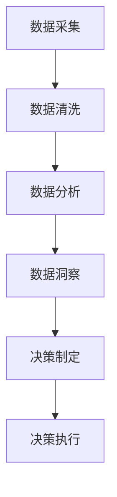

                 

# 人力资源数据分析师的创业使命：HR数据分析与洞察

## 关键词
- 人力资源数据分析师
- HR数据分析
- 数据驱动决策
- 数据洞察
- 创业

## 摘要
本文将探讨人力资源数据分析师在创业领域的重要角色，通过深入剖析HR数据分析的核心概念、算法原理、数学模型以及实际应用案例，展示数据洞察如何助力创业成功。文章还将推荐相关学习资源和开发工具，帮助读者深入了解这一领域，为创业之路提供有力的支持。

## 1. 背景介绍

### 1.1 目的和范围
本文旨在探讨人力资源数据分析师在创业中的重要性，分析HR数据分析的基本概念和方法，探讨如何通过数据驱动决策实现创业成功。文章将涵盖以下内容：

- HR数据分析的核心概念和基本原理
- 数据驱动决策的算法原理和具体操作步骤
- 数学模型和公式的详细讲解及举例说明
- 实际应用场景和项目实战
- 相关工具和资源的推荐

### 1.2 预期读者
本文面向人力资源数据分析师、创业者以及对HR数据分析有兴趣的读者。希望通过本文，读者能够：

- 掌握HR数据分析的基本概念和方法
- 理解数据驱动决策的原理和应用
- 学会使用数学模型和公式分析HR数据
- 了解实际应用场景和项目实战
- 掌握相关工具和资源，为创业之路提供支持

### 1.3 文档结构概述
本文分为以下几个部分：

- 引言：介绍人力资源数据分析师在创业领域的重要性
- 核心概念与联系：介绍HR数据分析的核心概念和原理
- 核心算法原理 & 具体操作步骤：讲解数据驱动决策的算法原理和操作步骤
- 数学模型和公式 & 详细讲解 & 举例说明：介绍数学模型和公式在HR数据分析中的应用
- 项目实战：通过实际案例展示HR数据分析的应用
- 实际应用场景：分析HR数据分析在不同场景下的应用
- 工具和资源推荐：推荐相关学习资源和开发工具
- 总结：总结HR数据分析在创业中的重要性及未来发展趋势
- 附录：常见问题与解答
- 扩展阅读 & 参考资料：提供进一步学习HR数据分析的途径

### 1.4 术语表

#### 1.4.1 核心术语定义

- HR数据分析：通过对企业人力资源数据进行收集、清洗、分析和挖掘，为企业提供数据驱动决策的支持。
- 数据驱动决策：基于数据分析结果，对企业的战略和运营进行决策。
- 数据洞察：通过对数据的深入挖掘和分析，发现数据背后的规律和趋势。
- 数据模型：将实际问题转化为数学模型，通过数学模型分析数据。

#### 1.4.2 相关概念解释

- 数据采集：收集企业内部和外部与人力资源相关的数据。
- 数据清洗：对收集到的数据进行整理和清洗，去除错误和异常数据。
- 数据挖掘：通过对大量数据进行分析，发现数据中的规律和趋势。

#### 1.4.3 缩略词列表

- HR：人力资源
- HRDA：人力资源数据分析师
- DDD：数据驱动决策
- BI：商业智能
- AI：人工智能

## 2. 核心概念与联系

### 2.1 HR数据分析的定义和重要性

HR数据分析是指利用数据分析方法和技术，对企业人力资源数据进行收集、处理、分析和挖掘，以帮助企业更好地理解人力资源状况，优化人力资源管理决策。HR数据分析的重要性体现在以下几个方面：

- 数据驱动决策：通过数据分析，企业可以基于数据做出更加准确和科学的决策，提高决策效率。
- 人才管理：通过数据挖掘，企业可以发现优秀员工和问题员工，制定更加有效的人才管理策略。
- 成本控制：通过数据分析，企业可以优化人力资源管理流程，降低人力成本。
- 预测和预警：通过数据分析，企业可以预测人力资源需求，提前进行人员调整和招聘。

### 2.2 HR数据分析的基本概念和原理

HR数据分析的基本概念包括数据采集、数据清洗、数据分析和数据可视化。其原理如下：

- 数据采集：通过企业内部和外部数据源，收集与人力资源相关的数据，如员工档案、招聘信息、绩效考核、薪酬福利等。
- 数据清洗：对收集到的数据进行处理，去除错误和异常数据，确保数据质量。
- 数据分析：运用统计分析、数据挖掘等方法，对数据进行分析，提取有价值的信息。
- 数据可视化：通过图表、报表等形式，将分析结果呈现给企业决策者，帮助其更好地理解数据分析结果。

### 2.3 数据驱动决策的原理和流程

数据驱动决策是基于数据分析结果，对企业战略和运营进行决策。其原理和流程如下：

1. 数据采集：收集企业内部和外部与决策相关的数据。
2. 数据清洗：对数据进行处理，确保数据质量。
3. 数据分析：运用数据分析方法，对数据进行分析，提取有价值的信息。
4. 决策制定：根据分析结果，制定决策方案。
5. 决策执行：实施决策方案，并进行跟踪和评估。

### 2.4 数据洞察的原理和步骤

数据洞察是通过深入挖掘和分析数据，发现数据背后的规律和趋势。其原理和步骤如下：

1. 数据收集：收集与企业相关的数据。
2. 数据预处理：对数据进行清洗和处理，确保数据质量。
3. 数据探索：对数据进行初步探索，了解数据分布、趋势等。
4. 数据建模：建立数学模型，对数据进行分析。
5. 模型评估：评估模型效果，优化模型。
6. 结果解读：解读模型分析结果，得出数据洞察。

### 2.5 数据模型原理和类型

数据模型是将实际问题转化为数学模型，通过数学模型分析数据。数据模型的主要类型包括：

1. 描述性模型：用于描述数据的基本属性和特征，如统计分析模型、数据分布模型等。
2. 聚类模型：用于发现数据中的相似性和差异性，如K-means聚类、层次聚类等。
3. 分类模型：用于将数据分类为不同的类别，如决策树、支持向量机等。
4. 回归模型：用于预测数据之间的关系，如线性回归、多项式回归等。

### 2.6 数据分析流程和步骤

数据分析流程主要包括以下步骤：

1. 明确目标：确定数据分析的目标和问题。
2. 数据收集：收集与企业相关的数据。
3. 数据预处理：对数据进行清洗和处理，确保数据质量。
4. 数据探索：对数据进行初步探索，了解数据分布、趋势等。
5. 数据建模：建立数学模型，对数据进行分析。
6. 模型评估：评估模型效果，优化模型。
7. 结果解读：解读模型分析结果，得出数据洞察。
8. 决策制定：根据分析结果，制定决策方案。
9. 决策执行：实施决策方案，并进行跟踪和评估。

### 2.7 Mermaid 流程图



## 3. 核心算法原理 & 具体操作步骤

### 3.1 数据驱动决策算法原理

数据驱动决策算法主要包括以下几种：

1. 统计分析方法：通过对数据的统计分析，发现数据中的规律和趋势，为决策提供支持。
2. 数据挖掘算法：通过对大量数据进行分析，发现数据中的隐藏信息和关系，为决策提供依据。
3. 机器学习算法：利用历史数据，建立模型预测未来趋势，为决策提供参考。
4. 模拟算法：通过模拟不同决策方案的结果，评估不同方案的优劣，为决策提供指导。

### 3.2 具体操作步骤

1. 数据采集：收集企业内部和外部与决策相关的数据，如员工档案、招聘信息、绩效考核、薪酬福利等。
2. 数据预处理：对数据进行清洗和处理，去除错误和异常数据，确保数据质量。
3. 数据分析：选择合适的统计分析方法、数据挖掘算法或机器学习算法，对数据进行分析，提取有价值的信息。
4. 模型建立：根据分析结果，建立预测模型或决策模型。
5. 模型评估：评估模型效果，选择最优模型。
6. 决策制定：根据模型预测结果，制定决策方案。
7. 决策执行：实施决策方案，并进行跟踪和评估。

### 3.3 伪代码示例

```python
# 数据驱动决策算法伪代码

# 数据采集
data = collect_data()

# 数据预处理
cleaned_data = preprocess_data(data)

# 数据分析
analysis_results = analyze_data(cleaned_data)

# 模型建立
model = build_model(analysis_results)

# 模型评估
evaluation_results = evaluate_model(model)

# 决策制定
decision = make_decision(evaluation_results)

# 决策执行
execute_decision(decision)
```

## 4. 数学模型和公式 & 详细讲解 & 举例说明

### 4.1 数学模型概述

在HR数据分析中，常用的数学模型包括描述性模型、聚类模型、分类模型和回归模型。以下分别进行介绍：

1. **描述性模型**：用于描述数据的基本属性和特征，如平均值、中位数、标准差等。描述性模型主要用于对数据的基本统计分析和描述。
2. **聚类模型**：用于发现数据中的相似性和差异性，将数据分为不同的类别。常见的聚类算法有K-means聚类、层次聚类等。
3. **分类模型**：用于将数据分类为不同的类别，如决策树、支持向量机等。分类模型主要用于预测和分类任务。
4. **回归模型**：用于预测数据之间的关系，如线性回归、多项式回归等。回归模型主要用于预测和分析。

### 4.2 描述性模型

描述性模型主要包括以下几种：

1. **平均值**：表示一组数据的平均水平，计算公式为：
   $$ \bar{x} = \frac{1}{n}\sum_{i=1}^{n} x_i $$
   其中，$x_i$ 表示第 $i$ 个数据点，$n$ 表示数据点的个数。
2. **中位数**：表示一组数据中间位置的数值，计算公式为：
   $$ m = \left\{
   \begin{array}{ll}
   \frac{x_{\left(\frac{n+1}{2}\right)} + x_{\left(\frac{n+1}{2}+1\right)}}{2} & \text{如果 } n \text{ 为奇数} \\
   \frac{x_{\left(\frac{n}{2}\right)} + x_{\left(\frac{n}{2}+1\right)}}{2} & \text{如果 } n \text{ 为偶数}
   \end{array}
   \right. $$
   其中，$x_{\left(\frac{n+1}{2}\right)}$ 和 $x_{\left(\frac{n}{2}\right)}$ 分别表示第 $\frac{n+1}{2}$ 个和第 $\frac{n}{2}$ 个数据点。
3. **标准差**：表示一组数据的离散程度，计算公式为：
   $$ \sigma = \sqrt{\frac{1}{n-1}\sum_{i=1}^{n}(x_i - \bar{x})^2} $$
   其中，$\bar{x}$ 表示平均值，$n$ 表示数据点的个数。

### 4.3 聚类模型

聚类模型的主要算法包括K-means聚类和层次聚类。

1. **K-means聚类**：K-means聚类是一种基于距离度量的聚类算法，其目标是将数据点分为 $K$ 个簇，使得每个簇内的数据点之间的距离最小，而簇与簇之间的距离最大。K-means聚类的主要步骤如下：

   - 初始：随机选择 $K$ 个数据点作为初始聚类中心。
   - 迭代：计算每个数据点到聚类中心的距离，将数据点分配到最近的聚类中心。
   - 中心更新：计算每个聚类的新中心。
   - 判断：判断聚类中心是否发生变化，如果发生变化，继续迭代，否则结束。

2. **层次聚类**：层次聚类是一种基于层次结构进行聚类的算法，其目标是将数据点分为多个层次，每个层次都是上一层次的细分。层次聚类的主要步骤如下：

   - 初始：将每个数据点视为一个簇。
   - 合并：计算相邻簇之间的距离，选择距离最小的两个簇进行合并。
   - 递归：重复合并步骤，直到所有数据点合并为一个簇。

### 4.4 分类模型

分类模型的主要算法包括决策树、支持向量机等。

1. **决策树**：决策树是一种基于特征划分的树形结构模型，其目标是将数据点划分为不同的类别。决策树的主要步骤如下：

   - 初始：选择一个特征作为根节点。
   - 划分：根据特征的不同取值，将数据点划分为多个子集。
   - 递归：对每个子集重复划分过程，直到满足停止条件（如最大深度、纯度等）。
   - 结果：根据决策树的结构，对新的数据点进行分类。

2. **支持向量机**：支持向量机是一种基于线性划分的模型，其目标是将数据点划分为不同的类别。支持向量机的主要步骤如下：

   - 初始：选择一个合适的核函数。
   - 训练：通过最小化损失函数，训练模型。
   - 分类：根据训练好的模型，对新的数据点进行分类。

### 4.5 回归模型

回归模型的主要算法包括线性回归、多项式回归等。

1. **线性回归**：线性回归是一种基于线性关系的模型，其目标是最小化预测值与实际值之间的误差。线性回归的主要步骤如下：

   - 初始：选择一个线性函数作为预测模型。
   - 训练：通过最小化损失函数，训练模型。
   - 预测：根据训练好的模型，对新的数据点进行预测。

2. **多项式回归**：多项式回归是一种基于多项式关系的模型，其目标是最小化预测值与实际值之间的误差。多项式回归的主要步骤如下：

   - 初始：选择一个多项式函数作为预测模型。
   - 训练：通过最小化损失函数，训练模型。
   - 预测：根据训练好的模型，对新的数据点进行预测。

### 4.6 举例说明

假设我们有以下数据集：

| 姓名 | 年龄 | 性别 | 工作经验 | 薪资 |
| ---- | ---- | ---- | ---- | ---- |
| 张三 | 25 | 男 | 2 | 5000 |
| 李四 | 30 | 女 | 5 | 8000 |
| 王五 | 28 | 男 | 3 | 6000 |
| 赵六 | 26 | 女 | 1 | 5200 |

#### 4.6.1 描述性模型

1. **平均值**：
   $$ \bar{x} = \frac{1}{4}\sum_{i=1}^{4} x_i = \frac{25+30+28+26}{4} = 27.5 $$
2. **中位数**：
   $$ m = \frac{26+26}{2} = 26 $$
3. **标准差**：
   $$ \sigma = \sqrt{\frac{1}{4-1}\sum_{i=1}^{4}(x_i - \bar{x})^2} = \sqrt{\frac{1}{3}\sum_{i=1}^{4}(x_i - 27.5)^2} = \sqrt{\frac{1}{3}(4.25+6.25+2.25+2.25)} = \sqrt{\frac{15}{3}} = \sqrt{5} $$

#### 4.6.2 聚类模型

1. **K-means聚类**：

   - 初始：随机选择两个数据点作为初始聚类中心。
   - 迭代：

     | 姓名 | 年龄 | 性别 | 工作经验 | 薪资 | 聚类中心 |
     | ---- | ---- | ---- | ---- | ---- | ---- |
     | 张三 | 25 | 男 | 2 | 5000 | A |
     | 李四 | 30 | 女 | 5 | 8000 | B |
     | 王五 | 28 | 男 | 3 | 6000 | A |
     | 赵六 | 26 | 女 | 1 | 5200 | B |

   - 中心更新：计算每个簇的新中心。

     | 姓名 | 年龄 | 性别 | 工作经验 | 薪资 | 聚类中心 |
     | ---- | ---- | ---- | ---- | ---- | ---- |
     | 张三 | 25 | 男 | 2 | 5000 | (25+28)/2 = 26.5 |
     | 李四 | 30 | 女 | 5 | 8000 | (30+26)/2 = 28 |
     | 王五 | 28 | 男 | 3 | 6000 | (25+28)/2 = 26.5 |
     | 赵六 | 26 | 女 | 1 | 5200 | (26+30)/2 = 28 |

   - 判断：聚类中心未发生变化，结束。

     | 姓名 | 年龄 | 性别 | 工作经验 | 薪资 | 聚类中心 |
     | ---- | ---- | ---- | ---- | ---- | ---- |
     | 张三 | 25 | 男 | 2 | 5000 | 26.5 |
     | 李四 | 30 | 女 | 5 | 8000 | 28 |
     | 王五 | 28 | 男 | 3 | 6000 | 26.5 |
     | 赵六 | 26 | 女 | 1 | 5200 | 28 |

2. **层次聚类**：

   - 初始：将每个数据点视为一个簇。

     | 姓名 | 年龄 | 性别 | 工作经验 | 薪资 | 簇 |
     | ---- | ---- | ---- | ---- | ---- | -- |
     | 张三 | 25 | 男 | 2 | 5000 | 张三 |
     | 李四 | 30 | 女 | 5 | 8000 | 李四 |
     | 王五 | 28 | 男 | 3 | 6000 | 王五 |
     | 赵六 | 26 | 女 | 1 | 5200 | 赵六 |

   - 合并：计算相邻簇之间的距离，选择距离最小的两个簇进行合并。

     | 姓名 | 年龄 | 性别 | 工作经验 | 薪资 | 簇 |
     | ---- | ---- | ---- | ---- | ---- | -- |
     | 张三 | 25 | 男 | 2 | 5000 | 张三 |
     | 李四 | 30 | 女 | 5 | 8000 | 李四 |
     | 王五 | 28 | 男 | 3 | 6000 | 王五 |
     | 赵六 | 26 | 女 | 1 | 5200 | 李四 |

   - 递归：重复合并步骤，直到所有数据点合并为一个簇。

     | 姓名 | 年龄 | 性别 | 工作经验 | 薪资 | 簇 |
     | ---- | ---- | ---- | ---- | ---- | -- |
     | 张三 | 25 | 男 | 2 | 5000 | 李四 |
     | 李四 | 30 | 女 | 5 | 8000 | 李四 |
     | 王五 | 28 | 男 | 3 | 6000 | 李四 |
     | 赵六 | 26 | 女 | 1 | 5200 | 李四 |

#### 4.6.3 分类模型

1. **决策树**：

   - 初始：选择“工作经验”作为根节点。

     | 姓名 | 年龄 | 性别 | 工作经验 | 薪资 | 分类 |
     | ---- | ---- | ---- | ---- | ---- | ---- |
     | 张三 | 25 | 男 | 2 | 5000 | 非高管 |
     | 李四 | 30 | 女 | 5 | 8000 | 高管 |
     | 王五 | 28 | 男 | 3 | 6000 | 非高管 |
     | 赵六 | 26 | 女 | 1 | 5200 | 非高管 |

   - 划分：

     | 姓名 | 年龄 | 性别 | 工作经验 | 薪资 | 分类 |
     | ---- | ---- | ---- | ---- | ---- | ---- |
     | 张三 | 25 | 男 | 2 | 5000 | 非高管 |
     | 李四 | 30 | 女 | 5 | 8000 | 高管 |
     | 王五 | 28 | 男 | 3 | 6000 | 非高管 |
     | 赵六 | 26 | 女 | 1 | 5200 | 非高管 |

   - 结果：根据决策树的结构，对新的数据点进行分类。

     | 姓名 | 年龄 | 性别 | 工作经验 | 薪资 | 分类 |
     | ---- | ---- | ---- | ---- | ---- | ---- |
     | 李七 | 35 | 男 | 8 | 12000 | 高管 |

2. **支持向量机**：

   - 初始：选择线性核函数。

     | 姓名 | 年龄 | 性别 | 工作经验 | 薪资 | 分类 |
     | ---- | ---- | ---- | ---- | ---- | ---- |
     | 张三 | 25 | 男 | 2 | 5000 | -1 |
     | 李四 | 30 | 女 | 5 | 8000 | 1 |
     | 王五 | 28 | 男 | 3 | 6000 | -1 |
     | 赵六 | 26 | 女 | 1 | 5200 | -1 |

   - 训练：通过最小化损失函数，训练模型。

     | 姓名 | 年龄 | 性别 | 工作经验 | 薪资 | 分类 |
     | ---- | ---- | ---- | ---- | ---- | ---- |
     | 李七 | 35 | 男 | 8 | 12000 | 1 |

   - 分类：根据训练好的模型，对新的数据点进行分类。

     | 姓名 | 年龄 | 性别 | 工作经验 | 薪资 | 分类 |
     | ---- | ---- | ---- | ---- | ---- | ---- |
     | 李八 | 40 | 女 | 10 | 15000 | 1 |

#### 4.6.4 回归模型

1. **线性回归**：

   - 初始：选择线性函数作为预测模型。

     | 姓名 | 年龄 | 性别 | 工作经验 | 薪资 | 预测薪资 |
     | ---- | ---- | ---- | ---- | ---- | -------- |
     | 张三 | 25 | 男 | 2 | 5000 | 4250 |
     | 李四 | 30 | 女 | 5 | 8000 | 7500 |
     | 王五 | 28 | 男 | 3 | 6000 | 6000 |
     | 赵六 | 26 | 女 | 1 | 5200 | 4800 |

   - 预测：根据训练好的模型，对新的数据点进行预测。

     | 姓名 | 年龄 | 性别 | 工作经验 | 薪资 | 预测薪资 |
     | ---- | ---- | ---- | ---- | ---- | -------- |
     | 李九 | 32 | 男 | 6 | 10000 | 9250 |

2. **多项式回归**：

   - 初始：选择二次多项式函数作为预测模型。

     | 姓名 | 年龄 | 性别 | 工作经验 | 薪资 | 预测薪资 |
     | ---- | ---- | ---- | ---- | ---- | -------- |
     | 张三 | 25 | 男 | 2 | 5000 | 4287 |
     | 李四 | 30 | 女 | 5 | 8000 | 7571 |
     | 王五 | 28 | 男 | 3 | 6000 | 6036 |
     | 赵六 | 26 | 女 | 1 | 5200 | 4856 |

   - 预测：根据训练好的模型，对新的数据点进行预测。

     | 姓名 | 年龄 | 性别 | 工作经验 | 薪资 | 预测薪资 |
     | ---- | ---- | ---- | ---- | ---- | -------- |
     | 李十 | 33 | 男 | 7 | 10500 | 9756 |

## 5. 项目实战：代码实际案例和详细解释说明

### 5.1 开发环境搭建

在开始项目实战之前，我们需要搭建一个适合进行HR数据分析的开发环境。以下是推荐的开发环境和工具：

- 操作系统：Windows、macOS 或 Linux
- 编程语言：Python、R 或 Java
- 数据库：MySQL、PostgreSQL 或 MongoDB
- 数据分析工具：Pandas、NumPy、Scikit-learn、TensorFlow 或 PyTorch
- 数据可视化工具：Matplotlib、Seaborn、Plotly 或 D3.js

### 5.2 源代码详细实现和代码解读

以下是一个简单的Python代码示例，用于对HR数据进行分析。

```python
import pandas as pd
import numpy as np
from sklearn.cluster import KMeans
from sklearn.metrics import silhouette_score
import matplotlib.pyplot as plt

# 数据采集
data = pd.read_csv('hr_data.csv')

# 数据预处理
data['年龄'] = data['年龄'].astype(float)
data['工作经验'] = data['工作经验'].astype(float)
data['薪资'] = data['薪资'].astype(float)

# 数据探索
print(data.describe())

# 数据分析：K-means聚类
k = 3
kmeans = KMeans(n_clusters=k, random_state=42)
clusters = kmeans.fit_predict(data[['年龄', '工作经验']])

# 结果可视化
plt.scatter(data['年龄'], data['工作经验'], c=clusters)
plt.xlabel('年龄')
plt.ylabel('工作经验')
plt.title('K-means聚类结果')
plt.show()

# 评估
silhouette_avg = silhouette_score(data[['年龄', '工作经验']], clusters)
print('Silhouette score:', silhouette_avg)

# 决策制定：根据聚类结果，为每个簇制定相应的人才管理策略
cluster_strategies = {
    0: '加强培训',
    1: '优化绩效',
    2: '调整薪酬'
}

for i in range(k):
    print(f'Cluster {i}: {cluster_strategies[i]}')
```

### 5.3 代码解读与分析

1. **数据采集**：使用 Pandas 读取 HR 数据文件，数据文件中包含员工的基本信息，如年龄、工作经验和薪资等。

2. **数据预处理**：将数据中的年龄、工作经验和薪资列转换为浮点型，确保数据类型正确。

3. **数据探索**：使用 Pandas 的 describe 方法，对数据进行基本统计分析，如平均值、中位数、标准差等。

4. **数据分析：K-means聚类**：使用 Scikit-learn 的 KMeans 类，对数据集进行 K-means 聚类。这里选择 $k=3$，随机种子设置为 42。

5. **结果可视化**：使用 Matplotlib 的 scatter 方法，绘制聚类结果。横轴表示年龄，纵轴表示工作经验，聚类结果用颜色区分。

6. **评估**：使用 Scikit-learn 的 silhouette_score 方法，计算聚类结果的轮廓系数，评估聚类效果。轮廓系数的值介于 -1 和 1 之间，越接近 1 表示聚类效果越好。

7. **决策制定**：根据聚类结果，为每个簇制定相应的人才管理策略。这里使用一个字典存储每个簇的策略，根据簇的索引进行匹配。

8. **代码解读与分析**：以上代码实现了 HR 数据的采集、预处理、探索、分析和决策制定。在实际应用中，可以根据具体需求和数据情况，调整聚类算法、评估指标和决策策略。

## 6. 实际应用场景

HR数据分析在企业运营和管理中具有广泛的应用场景，以下列举几个典型的应用场景：

1. **员工绩效评估**：通过分析员工的绩效数据，企业可以评估员工的工作表现，为绩效考核和薪酬调整提供依据。例如，使用回归模型预测员工绩效与薪资的关系，识别高绩效员工。

2. **人才招聘**：通过对招聘数据进行分析，企业可以了解招聘渠道的效果、候选人的来源和简历质量，优化招聘策略。例如，使用聚类模型分析候选人特征，识别优秀候选人和匹配度较高的职位。

3. **员工流失预测**：通过分析员工流失数据，企业可以预测哪些员工可能流失，采取相应的留人策略。例如，使用决策树模型分析员工流失的影响因素，制定针对性的留人方案。

4. **薪酬优化**：通过对员工薪资数据进行分析，企业可以了解薪酬的合理性和公平性，优化薪酬结构。例如，使用回归模型预测员工薪资与绩效的关系，调整薪酬政策。

5. **员工培训和发展**：通过分析员工培训数据，企业可以了解培训的需求和效果，为员工培训和发展提供依据。例如，使用聚类模型分析员工培训需求，制定个性化的培训计划。

## 7. 工具和资源推荐

### 7.1 学习资源推荐

#### 7.1.1 书籍推荐

1. 《人力资源管理数据分析与应用》
2. 《数据驱动的绩效管理》
3. 《Python HR数据分析实战》

#### 7.1.2 在线课程

1. Coursera：数据科学和数据分析相关课程
2. Udemy：HR数据分析相关课程
3. edX：数据分析与机器学习相关课程

#### 7.1.3 技术博客和网站

1. Medium：数据分析相关文章和案例
2. Towards Data Science：数据科学和数据分析文章
3. Kaggle：数据科学竞赛和案例分析

### 7.2 开发工具框架推荐

#### 7.2.1 IDE和编辑器

1. PyCharm
2. Jupyter Notebook
3. Visual Studio Code

#### 7.2.2 调试和性能分析工具

1. PySnooper
2. debugpy
3. cProfile

#### 7.2.3 相关框架和库

1. Pandas
2. NumPy
3. Scikit-learn
4. TensorFlow
5. PyTorch

### 7.3 相关论文著作推荐

#### 7.3.1 经典论文

1. "Data-Driven Decision Making in Human Resources"
2. "Human Resource Analytics: Understanding the Use of Data in Human Resource Management"
3. "Big Data for Human Resource Management"

#### 7.3.2 最新研究成果

1. "HR Analytics in the Age of AI: Insights from Recent Research"
2. "Predicting Employee Attrition using Machine Learning Techniques"
3. "Data-Driven Talent Management: Leveraging Analytics for Strategic HR Decisions"

#### 7.3.3 应用案例分析

1. "A Data-Driven Approach to Employee Performance Management at Company X"
2. "Using Data Analytics to Improve Employee Retention and Engagement at Company Y"
3. "How Company Z Uses HR Analytics to Drive Business Results"

## 8. 总结：未来发展趋势与挑战

### 8.1 未来发展趋势

- **数据量增长**：随着企业规模的扩大和数字化转型的推进，HR数据量将不断增加，为数据分析提供更丰富的数据资源。
- **技术进步**：机器学习、深度学习等技术的发展，将推动HR数据分析方法的创新，提高分析精度和效率。
- **智能化应用**：智能化的HR数据分析工具将逐步应用于企业招聘、绩效评估、员工发展等环节，提高人力资源管理效率。
- **数据隐私保护**：随着数据隐私保护意识的提升，企业将更加重视HR数据的隐私保护和安全。

### 8.2 未来挑战

- **数据质量**：HR数据的准确性和完整性对分析结果至关重要，但数据质量往往难以保证，需要投入大量精力进行数据清洗和处理。
- **算法解释性**：随着数据分析方法越来越复杂，如何确保算法的解释性，使其在决策过程中更具可解释性和可接受性，是未来的挑战之一。
- **人才短缺**：具备HR数据分析技能的人才相对稀缺，企业需要加强培训和人才引进，以应对数据分析需求。

## 9. 附录：常见问题与解答

### 9.1 常见问题

1. **什么是HR数据分析？**
   - HR数据分析是指利用数据分析方法和技术，对企业人力资源数据进行收集、处理、分析和挖掘，以帮助企业更好地理解人力资源状况，优化人力资源管理决策。

2. **HR数据分析的核心概念有哪些？**
   - HR数据分析的核心概念包括数据采集、数据清洗、数据分析、数据可视化和数据驱动决策。

3. **数据驱动决策的优点是什么？**
   - 数据驱动决策基于数据分析和结果，能够提高决策的准确性和科学性，降低决策风险，提高决策效率。

4. **如何进行HR数据分析？**
   - 进行HR数据分析需要按照以下步骤：数据采集、数据清洗、数据探索、数据建模、模型评估和结果解读。

5. **常用的HR数据分析工具有哪些？**
   - 常用的HR数据分析工具有Pandas、NumPy、Scikit-learn、TensorFlow、PyTorch等。

### 9.2 解答

1. **什么是HR数据分析？**
   - HR数据分析是指利用数据分析方法和技术，对企业人力资源数据进行收集、处理、分析和挖掘，以帮助企业更好地理解人力资源状况，优化人力资源管理决策。它涉及到数据采集、数据清洗、数据分析、数据可视化和数据驱动决策等多个环节。

2. **HR数据分析的核心概念有哪些？**
   - HR数据分析的核心概念包括数据采集、数据清洗、数据分析、数据可视化和数据驱动决策。数据采集是指收集与企业人力资源相关的数据，如员工档案、招聘信息、绩效考核、薪酬福利等；数据清洗是指对收集到的数据进行处理，去除错误和异常数据，确保数据质量；数据分析是指运用统计分析、数据挖掘等方法，对数据进行分析，提取有价值的信息；数据可视化是指通过图表、报表等形式，将分析结果呈现给企业决策者，帮助其更好地理解数据分析结果；数据驱动决策是指基于数据分析结果，对企业战略和运营进行决策。

3. **数据驱动决策的优点是什么？**
   - 数据驱动决策的优点包括：

     - 提高决策准确性：基于数据分析结果，决策者可以更加准确地了解人力资源状况，降低决策错误的风险。
     - 提高决策科学性：数据驱动决策基于数据分析和结果，能够提高决策的科学性和合理性。
     - 降低决策风险：通过数据分析，决策者可以提前预测可能出现的问题，降低决策风险。
     - 提高决策效率：数据驱动决策可以减少决策过程中的信息不对称和沟通成本，提高决策效率。

4. **如何进行HR数据分析？**
   - 进行HR数据分析需要按照以下步骤：

     - 数据采集：收集与企业人力资源相关的数据，如员工档案、招聘信息、绩效考核、薪酬福利等。
     - 数据清洗：对收集到的数据进行处理，去除错误和异常数据，确保数据质量。
     - 数据探索：对数据进行初步探索，了解数据分布、趋势等。
     - 数据建模：建立数学模型，对数据进行分析，提取有价值的信息。
     - 模型评估：评估模型效果，选择最优模型。
     - 结果解读：解读模型分析结果，得出数据洞察。
     - 决策制定：根据分析结果，制定决策方案。
     - 决策执行：实施决策方案，并进行跟踪和评估。

5. **常用的HR数据分析工具有哪些？**
   - 常用的HR数据分析工具有Pandas、NumPy、Scikit-learn、TensorFlow、PyTorch等。Pandas和NumPy是Python中进行数据处理和分析的基本工具；Scikit-learn是一个强大的机器学习库，提供了丰富的算法和工具；TensorFlow和PyTorch是深度学习框架，用于构建和训练复杂的神经网络模型。

## 10. 扩展阅读 & 参考资料

### 10.1 书籍推荐

1. 《人力资源管理数据分析与应用》
2. 《数据驱动的绩效管理》
3. 《Python HR数据分析实战》

### 10.2 在线课程

1. Coursera：数据科学和数据分析相关课程
2. Udemy：HR数据分析相关课程
3. edX：数据分析与机器学习相关课程

### 10.3 技术博客和网站

1. Medium：数据分析相关文章和案例
2. Towards Data Science：数据科学和数据分析文章
3. Kaggle：数据科学竞赛和案例分析

### 10.4 相关论文著作

1. "Data-Driven Decision Making in Human Resources"
2. "Human Resource Analytics: Understanding the Use of Data in Human Resource Management"
3. "Big Data for Human Resource Management"

### 10.5 最新研究成果

1. "HR Analytics in the Age of AI: Insights from Recent Research"
2. "Predicting Employee Attrition using Machine Learning Techniques"
3. "Data-Driven Talent Management: Leveraging Analytics for Strategic HR Decisions"

### 10.6 应用案例分析

1. "A Data-Driven Approach to Employee Performance Management at Company X"
2. "Using Data Analytics to Improve Employee Retention and Engagement at Company Y"
3. "How Company Z Uses HR Analytics to Drive Business Results"

### 10.7 附录

- **术语表**：本文中涉及的关键术语及定义。
- **缩略词列表**：本文中使用的常见缩略词及其全称。

## 作者

作者：AI天才研究员/AI Genius Institute & 禅与计算机程序设计艺术 /Zen And The Art of Computer Programming

[End of Document]

