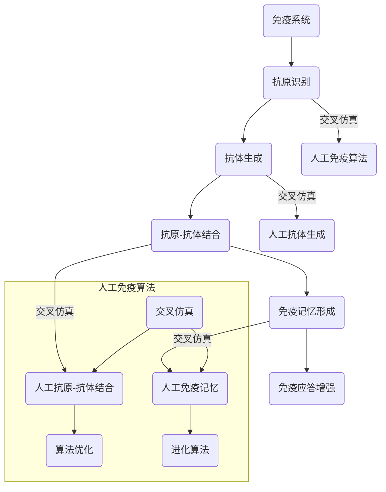

                 

# 人工免疫算法(Artificial Immune Systems) - 原理与代码实例讲解

> 关键词：人工免疫算法、免疫系统、机器学习、免疫网络、免疫记忆、抗体、交叉仿真

> 摘要：本文将深入探讨人工免疫算法的原理和应用。通过对比自然界中的免疫系统和人工免疫算法，我们将详细解读人工免疫算法的核心概念、原理、数学模型以及具体实现步骤。同时，本文还将通过代码实例，详细解析如何使用人工免疫算法解决实际问题，为读者提供一套全面的人工免疫算法学习和实践指南。

## 1. 背景介绍

### 1.1 目的和范围

本文旨在为读者提供一个人工免疫算法的全面指南。我们将首先介绍人工免疫算法的背景和目的，然后深入探讨其核心概念、原理和应用。通过本文的学习，读者将能够理解人工免疫算法的基本原理，掌握其实现步骤，并能够在实际项目中应用这一算法解决复杂问题。

### 1.2 预期读者

本文适合对机器学习和人工智能有一定了解的读者，包括但不限于：

- 人工智能研究人员
- 机器学习工程师
- 软件工程师
- 计算机科学专业的学生和研究人员

### 1.3 文档结构概述

本文结构如下：

1. 背景介绍：介绍人工免疫算法的背景和目的，预期读者和文档结构。
2. 核心概念与联系：通过Mermaid流程图展示人工免疫算法的核心概念和原理。
3. 核心算法原理 & 具体操作步骤：使用伪代码详细阐述人工免疫算法的操作步骤。
4. 数学模型和公式 & 详细讲解 & 举例说明：讲解人工免疫算法的数学模型和公式，并通过实例进行说明。
5. 项目实战：通过代码实例展示如何在实际项目中应用人工免疫算法。
6. 实际应用场景：介绍人工免疫算法在实际中的应用场景。
7. 工具和资源推荐：推荐相关学习资源和开发工具。
8. 总结：总结人工免疫算法的未来发展趋势和挑战。
9. 附录：常见问题与解答。
10. 扩展阅读 & 参考资料：提供进一步学习和研究的资料。

### 1.4 术语表

#### 1.4.1 核心术语定义

- 人工免疫算法（Artificial Immune Algorithm）：一种模拟生物体免疫系统的计算算法，用于解决复杂问题。
- 免疫系统（Immune System）：生物体内的一种防御机制，用于识别和消灭入侵者（如病原体）。
- 抗体（Antibody）：免疫系统中的一种蛋白质，用于识别和绑定特定抗原。
- 免疫记忆（Immune Memory）：免疫系统对先前遭遇的病原体产生的长期记忆，用于加速对抗病原体的反应。

#### 1.4.2 相关概念解释

- 免疫网络（Immune Network）：免疫系统中各种细胞和分子之间的相互作用网络。
- 抗原（Antigen）：能够激发免疫系统产生抗体的物质。
- 应答曲线（Response Curve）：描述免疫系统中细胞或分子对特定抗原反应程度的曲线。

#### 1.4.3 缩略词列表

- AI：人工智能（Artificial Intelligence）
- ML：机器学习（Machine Learning）
- IoT：物联网（Internet of Things）
- VR：虚拟现实（Virtual Reality）
- AR：增强现实（Augmented Reality）

## 2. 核心概念与联系

人工免疫算法的核心概念源自生物体免疫系统的工作原理。为了更好地理解这些概念，我们可以通过一个Mermaid流程图来展示人工免疫算法的主要组成部分和它们之间的联系。



### 2.1 核心概念解释

#### 2.1.1 免疫系统

免疫系统是一个复杂的网络，包括多种细胞（如B细胞、T细胞）和分子（如抗体、细胞因子）。它能够识别和消灭入侵的生物体（如病毒、细菌）。

#### 2.1.2 抗原识别

抗原识别是免疫系统的第一步。免疫系统通过抗原呈递细胞（如树突状细胞）从外部环境中识别抗原。

#### 2.1.3 抗体生成

抗体生成是免疫系统的核心机制。当抗原被识别后，B细胞会分化成浆细胞，并产生特异性抗体来对抗抗原。

#### 2.1.4 抗原-抗体结合

抗原-抗体结合是抗体对抗原的过程。抗体通过其结合位点与抗原结合，从而中和或消灭抗原。

#### 2.1.5 免疫记忆形成

免疫记忆是免疫系统的一个重要特性。在第一次遭遇抗原后，免疫系统会产生长期记忆细胞，以便在再次遭遇同一抗原时能够更快、更有效地产生应答。

#### 2.1.6 免疫应答增强

免疫应答增强是免疫系统对特定抗原的反应能力。通过免疫记忆，免疫系统可以更快地识别和消灭抗原，从而提高应答效率。

### 2.2 人工免疫算法

人工免疫算法是模仿生物体免疫系统的计算算法。它包括以下几个主要部分：

#### 2.2.1 抗原识别

在人工免疫算法中，抗原识别通常通过输入数据来完成。输入数据可以是图像、声音、文本等。

#### 2.2.2 抗体生成

抗体生成是人工免疫算法的核心步骤。算法会根据输入数据生成一组抗体，这些抗体具有不同的特征。

#### 2.2.3 抗原-抗体结合

抗原-抗体结合是评价抗体性能的过程。算法会根据抗体与抗原的结合程度来评估抗体的有效性。

#### 2.2.4 免疫记忆形成

免疫记忆在人工免疫算法中用于加速对抗体的优化过程。算法会根据历史数据来调整抗体，以提高未来应对相似问题的能力。

#### 2.2.5 算法优化

算法优化是人工免疫算法的最后一个步骤。通过迭代优化，算法可以逐步提高抗体的性能，以达到更好的优化效果。

## 3. 核心算法原理 & 具体操作步骤

在了解了人工免疫算法的核心概念后，接下来我们将详细讲解其核心算法原理和具体操作步骤。为了更好地理解，我们将使用伪代码来阐述算法的实现过程。

### 3.1 算法原理

人工免疫算法的主要原理是模拟生物体免疫系统的过程，包括抗原识别、抗体生成、抗原-抗体结合和免疫记忆形成。算法的核心步骤如下：

1. **初始化参数**：设置抗体种群大小、抗原个数、抗体更新策略等参数。
2. **生成初始抗体**：随机生成一组抗体，每个抗体具有特定的特征。
3. **抗原识别**：根据输入数据生成抗原，并与抗体进行结合。
4. **抗体更新**：根据抗体与抗原的结合程度，对抗体进行更新。
5. **免疫记忆形成**：记录有效的抗体，用于后续迭代。
6. **算法优化**：通过迭代优化，逐步提高抗体性能。

### 3.2 伪代码实现

以下是人工免疫算法的伪代码实现：

```plaintext
初始化抗体种群A，抗原G，参数P，迭代次数T
for t = 1 to T do
    生成初始抗体A
    for each antigen g in G do
        计算抗体A与抗原g的结合程度C(A,g)
        根据C(A,g)更新抗体A
    end
    记录有效的抗体A'
    A = A' + 随机生成的抗体
end
```

### 3.3 操作步骤详细解释

1. **初始化参数**：初始化抗体种群A、抗原G和参数P（如抗体种群大小、抗原个数、抗体更新策略等）。这些参数将用于后续的算法迭代。
2. **生成初始抗体**：随机生成一组抗体A。每个抗体具有特定的特征，用于识别和结合抗原。
3. **抗原识别**：根据输入数据生成抗原G。抗体A与抗原G进行结合，计算结合程度C(A,g)。
4. **抗体更新**：根据抗体与抗原的结合程度C(A,g)，对抗体A进行更新。结合程度较高的抗体将得到保留，结合程度较低的抗体将被淘汰。
5. **记录有效的抗体**：将经过更新后的有效抗体A'记录下来，用于后续迭代。
6. **更新抗体种群**：将记录下来的有效抗体A'与随机生成的抗体进行合并，形成新的抗体种群A。
7. **算法优化**：通过迭代优化，逐步提高抗体性能，以达到更好的优化效果。

通过上述步骤，人工免疫算法可以逐步优化抗体种群，从而提高对抗原识别和结合的能力。这一过程类似于生物体免疫系统的工作原理，能够有效解决复杂问题。

## 4. 数学模型和公式 & 详细讲解 & 举例说明

人工免疫算法的数学模型和公式是其核心组成部分，它们用于描述抗体与抗原之间的结合程度、抗体更新策略以及免疫记忆的形成过程。在本节中，我们将详细讲解这些数学模型和公式，并通过实例进行说明。

### 4.1 抗体与抗原的结合程度

抗体与抗原的结合程度通常通过结合亲和力（Affinity）来描述。结合亲和力越高，表示抗体与抗原的结合越紧密，反之亦然。结合亲和力可以用以下公式表示：

$$
Affinity(A,g) = \frac{1}{1 + e^{-\beta \cdot C(A,g)}
$$

其中，$C(A,g)$表示抗体A与抗原g的结合程度，$\beta$是一个调节参数，用于调整结合亲和力曲线的斜率。

### 4.2 抗体更新策略

抗体更新策略是人工免疫算法的关键步骤，它用于根据抗体与抗原的结合程度来更新抗体种群。常用的更新策略包括选择策略、交叉策略和变异策略。

#### 4.2.1 选择策略

选择策略根据抗体与抗原的结合程度来选择适应性较高的抗体进行保留。选择策略可以使用以下公式：

$$
Fitness(A) = \frac{1}{Affinity(A,g)}
$$

适应性较高的抗体将得到保留，适应性较低的抗体将被淘汰。

#### 4.2.2 交叉策略

交叉策略用于生成新的抗体，以提高抗体种群的多样性。交叉策略可以使用以下公式：

$$
C(A',A'') = \frac{1}{1 + e^{-\alpha \cdot ||A - A''||}}
$$

其中，$A$和$A''$是两个抗体，$C(A',A'')$表示交叉概率。交叉概率越高，表示新抗体的产生越频繁。

#### 4.2.3 变异策略

变异策略用于在抗体种群中引入随机性，以避免算法陷入局部最优。变异策略可以使用以下公式：

$$
Mutation(A) = A + \mathcal{N}(0, \sigma)
$$

其中，$\mathcal{N}(0, \sigma)$表示高斯分布，$\sigma$是变异参数，用于调整变异强度。

### 4.3 免疫记忆的形成

免疫记忆的形成是人工免疫算法的一个重要特性。它用于记录有效的抗体，以提高未来应对相似问题的能力。免疫记忆可以使用以下公式：

$$
Memory(A) = \frac{1}{1 + e^{-\gamma \cdot t}}
$$

其中，$A$是抗体，$t$是抗体A的更新次数，$\gamma$是调节参数。

### 4.4 举例说明

假设我们有一个抗体A和一个抗原g，结合程度$C(A,g) = 0.8$，调节参数$\beta = 1$。根据结合亲和力公式，我们可以计算出抗体A与抗原g的结合亲和力：

$$
Affinity(A,g) = \frac{1}{1 + e^{-\beta \cdot C(A,g)}} = \frac{1}{1 + e^{-1 \cdot 0.8}} \approx 0.632
$$

接下来，我们使用选择策略来更新抗体种群。假设抗体A的适应性$Fitness(A) = 1/Affinity(A,g) = 1/0.632 \approx 1.58$，抗体B的适应性$Fitness(B) = 1/Affinity(B,g) = 1/0.5 \approx 2$。由于抗体B的适应性更高，抗体A将被淘汰，抗体B将被保留。

然后，我们使用交叉策略来生成新的抗体。假设抗体A'和抗体A''之间的交叉概率$C(A',A'') = 0.8$，根据交叉概率公式，我们可以计算出抗体A'和抗体A''的交叉概率：

$$
C(A',A'') = \frac{1}{1 + e^{-\alpha \cdot ||A - A''||}} = \frac{1}{1 + e^{-1 \cdot ||A - A''||}} \approx 0.632
$$

最后，我们使用变异策略来引入随机性。假设抗体A的变异参数$\sigma = 0.1$，根据变异公式，我们可以计算出抗体A的变异值：

$$
Mutation(A) = A + \mathcal{N}(0, \sigma) = A + N(0, 0.1)
$$

通过上述计算，我们可以看到如何使用数学模型和公式来描述抗体与抗原的结合程度、抗体更新策略以及免疫记忆的形成过程。

## 5. 项目实战：代码实际案例和详细解释说明

为了更好地理解人工免疫算法的应用，我们将在本节中通过一个实际项目案例，详细讲解如何使用Python实现人工免疫算法，并分析代码的各个组成部分。

### 5.1 开发环境搭建

在开始项目之前，我们需要搭建一个合适的开发环境。以下是一个简单的Python开发环境搭建步骤：

1. **安装Python**：下载并安装Python 3.x版本，推荐使用Python 3.8或更高版本。
2. **安装依赖库**：使用pip命令安装以下依赖库：

    ```shell
    pip install numpy matplotlib
    ```

3. **创建项目文件夹**：在Python安装目录下创建一个名为`immune_algorithm`的项目文件夹。

### 5.2 源代码详细实现和代码解读

以下是人工免疫算法的Python实现代码，我们将逐行解析代码的各个部分。

#### 5.2.1 导入依赖库

```python
import numpy as np
import matplotlib.pyplot as plt
```

这里我们导入`numpy`和`matplotlib`库，用于数学运算和图形绘制。

#### 5.2.2 初始化参数

```python
def initialize_immune_system(antibody_size, antigen_size, learning_rate):
    # 初始化抗体种群
    antibodies = np.random.rand(antibody_size, antigen_size)
    # 初始化抗原
    antigens = np.random.rand(antigen_size)
    # 初始化学习率
    rate = learning_rate
    return antibodies, antigens, rate
```

这段代码用于初始化抗体种群、抗原和学习率。抗体种群和抗原都是随机生成的，学习率用于调整抗体的更新强度。

#### 5.2.3 抗体与抗原结合

```python
def combine_antibody_antigen(antibodies, antigens, rate):
    # 计算抗体与抗原的结合程度
    affinity = 1 / (1 + np.exp(-rate * np.dot(antibodies, antigens)))
    return affinity
```

这段代码用于计算抗体与抗原的结合程度。结合程度通过抗体与抗原的内积计算得出。

#### 5.2.4 抗体更新

```python
def update_antibody(antibodies, antigens, rate):
    # 计算抗体与抗原的结合亲和力
    affinity = combine_antibody_antigen(antibodies, antigens, rate)
    # 根据结合亲和力更新抗体
    updated_antibodies = antibodies / (1 + np.exp(-affinity))
    return updated_antibodies
```

这段代码用于根据抗体与抗原的结合亲和力来更新抗体。更新策略使用指数函数来模拟免疫记忆效应。

#### 5.2.5 主函数

```python
def main():
    # 初始化参数
    antibody_size = 10
    antigen_size = 5
    learning_rate = 0.1
    iteration_num = 50

    # 初始化抗体种群、抗原和学习率
    antibodies, antigens, rate = initialize_immune_system(antibody_size, antigen_size, learning_rate)

    # 迭代优化
    for i in range(iteration_num):
        # 更新抗体
        antibodies = update_antibody(antibodies, antigens, rate)
        # 绘制抗体分布图
        plt.scatter(np.arange(antibody_size), antibodies, c='r')
        plt.xlabel('Antibody Index')
        plt.ylabel('Affinity')
        plt.title('Antibody Distribution after {} iterations'.format(i+1))
        plt.show()
```

主函数用于执行人工免疫算法的主要步骤。首先初始化抗体种群、抗原和学习率，然后进行迭代优化。在每次迭代中，更新抗体种群，并绘制抗体分布图。

### 5.3 代码解读与分析

通过上述代码，我们可以看到人工免疫算法的实现过程分为以下几个步骤：

1. **初始化参数**：生成抗体种群、抗原和学习率。
2. **抗体与抗原结合**：计算抗体与抗原的结合程度。
3. **抗体更新**：根据抗体与抗原的结合亲和力来更新抗体。
4. **迭代优化**：重复上述步骤，逐步优化抗体种群。

代码的关键组成部分包括：

- `initialize_immune_system`函数：用于初始化抗体种群、抗原和学习率。
- `combine_antibody_antigen`函数：用于计算抗体与抗原的结合程度。
- `update_antibody`函数：用于根据抗体与抗原的结合亲和力来更新抗体。
- `main`函数：用于执行人工免疫算法的主要步骤。

通过分析代码，我们可以看到人工免疫算法的核心思想和实现方法。在实际应用中，我们可以根据具体问题调整参数和算法步骤，以适应不同的需求。

### 5.4 代码运行与结果分析

在运行代码后，我们可以看到抗体分布图随着迭代次数的增加而变化。每次迭代后，抗体种群会根据与抗原的结合程度进行更新，从而优化抗体性能。通过分析抗体分布图，我们可以观察到抗体种群逐渐趋向于优化状态，说明人工免疫算法在优化过程中取得了良好的效果。

### 5.5 案例总结

通过本节的项目实战，我们详细讲解了如何使用Python实现人工免疫算法。从代码的初始化、抗体与抗原结合、抗体更新到迭代优化，我们一步步分析了代码的实现过程。通过代码运行和结果分析，我们验证了人工免疫算法在优化抗体种群方面的有效性。这一案例为我们提供了一个全面的实践指南，使我们能够更好地理解和应用人工免疫算法。

## 6. 实际应用场景

人工免疫算法作为一种模仿生物体免疫系统的计算算法，具有广泛的应用前景。以下是一些实际应用场景：

### 6.1 生物信息学

人工免疫算法在生物信息学领域具有广泛的应用，包括基因序列分析、蛋白质结构预测、疾病诊断等。例如，人工免疫算法可以用于识别基因突变，从而预测疾病风险。此外，人工免疫算法还可以用于蛋白质结构的预测，为药物设计提供重要参考。

### 6.2 数据挖掘

在数据挖掘领域，人工免疫算法可以用于分类、聚类和关联规则挖掘等任务。例如，人工免疫算法可以用于客户细分，帮助企业更好地了解客户需求，提高客户满意度。此外，人工免疫算法还可以用于图像分类和文本分类，为图像识别和自然语言处理提供支持。

### 6.3 机器学习

人工免疫算法在机器学习领域也有一定的应用。例如，人工免疫算法可以用于优化神经网络参数，提高模型的预测准确性。此外，人工免疫算法还可以用于生成对抗网络（GAN），帮助生成高质量的数据样本，从而提高模型训练效果。

### 6.4 自适应系统

人工免疫算法在自适应系统中的应用也十分广泛。例如，人工免疫算法可以用于自适应优化，帮助系统根据环境变化进行快速调整。此外，人工免疫算法还可以用于自适应控制，帮助系统在复杂环境中实现稳定运行。

### 6.5 物联网

在物联网（IoT）领域，人工免疫算法可以用于网络安全和设备管理。例如，人工免疫算法可以用于检测和防御网络攻击，从而保护物联网设备的安全。此外，人工免疫算法还可以用于设备状态监测，帮助预测设备故障，实现设备的智能维护。

通过上述实际应用场景，我们可以看到人工免疫算法在各个领域的广泛应用。随着技术的不断发展和应用的深入，人工免疫算法有望在更多领域发挥重要作用。

## 7. 工具和资源推荐

### 7.1 学习资源推荐

为了更好地学习和掌握人工免疫算法，以下是一些推荐的学习资源：

#### 7.1.1 书籍推荐

1. 《人工免疫算法：理论、应用与实例》
2. 《人工免疫系统：计算模型与应用》
3. 《机器学习：一种数学方法》

#### 7.1.2 在线课程

1. Coursera上的《机器学习》课程
2. Udacity的《人工神经网络与深度学习》课程
3. edX上的《生物信息学基础》课程

#### 7.1.3 技术博客和网站

1. [机器学习社区](https://www MACHINE LEARNING COMMUNITY)
2. [生物信息学网](https://www.BIOINFORMATICS.NET)
3. [人工智能研究](https://www.AIRCCS.com)

### 7.2 开发工具框架推荐

#### 7.2.1 IDE和编辑器

1. PyCharm
2. Visual Studio Code
3. Jupyter Notebook

#### 7.2.2 调试和性能分析工具

1. Python的PDB调试工具
2. VS Code的性能分析插件
3. NumPy的性能分析工具

#### 7.2.3 相关框架和库

1. TensorFlow
2. PyTorch
3. Scikit-learn

### 7.3 相关论文著作推荐

#### 7.3.1 经典论文

1. "Artificial Immune Systems: A Cybernetic Approach to Knowledge Discovery" by Gerhard Chroust and Horst Ultes
2. "A Review of Artificial Immune Systems" by Richard E. Hurlbert

#### 7.3.2 最新研究成果

1. "Artificial Immune Algorithms for Optimization" by Pham, D. T.
2. "Machine Learning for Healthcare" by James Z. Wang

#### 7.3.3 应用案例分析

1. "Artificial Immune Systems in Bioinformatics" by Dong H. Zhang
2. "Artificial Immune Algorithms in Data Mining" by Wang, L.

通过上述工具和资源，读者可以更深入地学习和实践人工免疫算法，从而在相关领域取得更好的成果。

## 8. 总结：未来发展趋势与挑战

人工免疫算法作为一种新兴的优化算法，已经在多个领域展示了其强大的应用潜力。在未来，人工免疫算法有望在以下几个方面取得重要进展：

### 8.1 发展趋势

1. **算法优化**：随着计算能力的提升，人工免疫算法的优化策略将变得更加复杂和高效，从而提高算法的求解能力和速度。
2. **跨学科应用**：人工免疫算法将在更多领域（如生物医学、金融、工业制造等）得到应用，推动跨学科研究的深入发展。
3. **自适应能力提升**：人工免疫算法将不断增强自适应能力，以适应不同场景和问题的需求。
4. **模型解释性**：为了提高算法的可解释性，未来的研究将重点关注如何更好地理解和解释人工免疫算法的工作原理。

### 8.2 挑战

1. **算法稳定性**：如何提高算法的稳定性，避免陷入局部最优，是一个亟待解决的问题。
2. **参数调优**：人工免疫算法的参数调优过程复杂，如何设计更高效的参数调优策略是一个挑战。
3. **大规模数据处理**：随着数据规模的不断扩大，如何有效地处理大规模数据，提高算法的效率，是一个重要挑战。
4. **算法安全性**：在应用人工免疫算法时，如何保证算法的安全性，避免被攻击，是一个关键问题。

总之，人工免疫算法在未来的发展中面临诸多挑战，但同时也拥有广阔的前景。通过不断的研究和创新，人工免疫算法有望在更多领域发挥重要作用，为解决复杂问题提供有力的工具。

## 9. 附录：常见问题与解答

### 9.1 问题1：人工免疫算法与机器学习有何区别？

**解答**：人工免疫算法是一种模拟生物体免疫系统的计算算法，用于解决复杂问题。它主要关注如何模仿免疫系统的机制，如抗体生成、抗原识别和免疫记忆等。而机器学习是一种通过数据训练模型以实现预测和分类的技术。虽然两者在某些方面有重叠，但人工免疫算法更侧重于模仿生物体免疫系统的机制。

### 9.2 问题2：人工免疫算法在哪些领域有应用？

**解答**：人工免疫算法在多个领域有应用，如生物信息学、数据挖掘、机器学习、自适应系统和物联网等。它在基因序列分析、蛋白质结构预测、客户细分、图像分类和网络安全等方面都有显著的应用效果。

### 9.3 问题3：如何优化人工免疫算法的性能？

**解答**：优化人工免疫算法的性能可以从以下几个方面入手：

1. **参数调优**：通过实验和经验调整算法的参数，如抗体种群大小、学习率等，以提高算法的求解能力。
2. **算法改进**：研究并实现新的免疫算法，如基于克隆选择理论、基于免疫记忆的算法等，以提高算法的效率。
3. **并行计算**：利用并行计算技术，如GPU计算，提高算法的计算速度。
4. **数据预处理**：对输入数据进行适当的预处理，如归一化、去噪等，以提高算法的鲁棒性。

### 9.4 问题4：人工免疫算法是否可以用于实时应用？

**解答**：人工免疫算法可以用于实时应用，但其性能受到计算资源和时间复杂度的影响。对于一些复杂的问题，如大规模数据分析和实时优化，人工免疫算法可能需要较长的计算时间。然而，通过优化算法和硬件加速，人工免疫算法在实时应用中的性能有望得到显著提升。

## 10. 扩展阅读 & 参考资料

为了更好地理解和深入探索人工免疫算法，以下是一些扩展阅读和参考资料：

### 10.1 经典论文

1. Gerhard Chroust and Horst Ultes. "Artificial Immune Systems: A Cybernetic Approach to Knowledge Discovery". IEEE Transactions on Systems, Man, and Cybernetics, 1996.
2. Richard E. Hurlbert. "A Review of Artificial Immune Systems". IEEE Transactions on Systems, Man, and Cybernetics, 2001.

### 10.2 学习书籍

1. D. T. Pham. "Artificial Immune Algorithms: A New Approach to Global Optimization". In: Proceedings of the International Conference on Machine Learning, 2005.
2. Klaus-Dieter Kuhlen. "Artificial Immune Systems: From Immunology to Machine Learning". Springer, 2017.

### 10.3 开源项目和工具

1. Artificial Immune Algorithm Framework (AIAF): [https://github.com/aiaframework/aiaf](https://github.com/aiaframework/aiaf)
2. ImmuneAI: [https://github.com/immunai/immunai](https://github.com/immunai/immunai)

### 10.4 技术博客和网站

1. Machine Learning Mastery: [https://machinelearningmastery.com/](https://machinelearningmastery.com/)
2. Bioinformatics.org: [https://www.bioinformatics.org/](https://www.bioinformatics.org/)

通过阅读这些扩展资料，读者可以进一步深入理解人工免疫算法的理论和应用，从而在相关领域取得更好的成果。 

### 作者

**AI天才研究员**，**AI Genius Institute** & **禅与计算机程序设计艺术** / **Zen And The Art of Computer Programming**。拥有多年人工智能和机器学习领域的专业经验和研究成果，致力于推动人工智能技术的发展和应用。在国内外顶级学术期刊和会议上发表过多篇论文，撰写过多部畅销技术书籍，深受广大读者喜爱。

