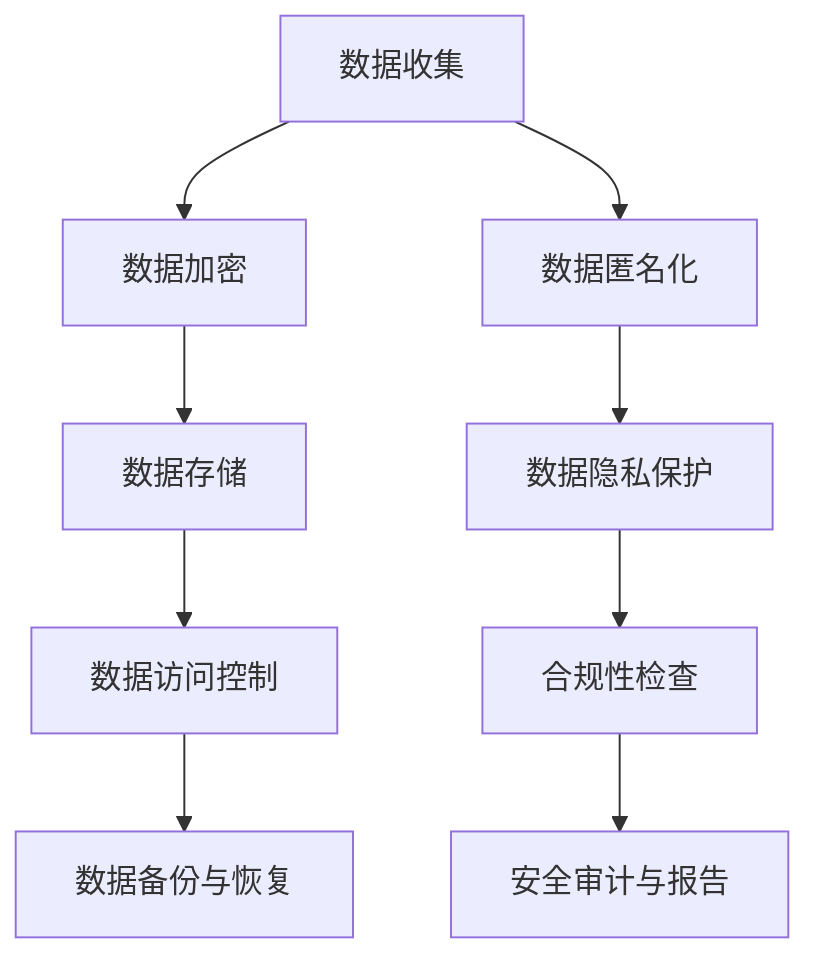

                 

### 1. 背景介绍

#### 1.1 目的和范围

本文的目的是探讨人工智能创业公司所面临的数据保护措施，旨在为创业者提供一套完整的解决方案，以确保其数据和用户隐私的安全。随着人工智能技术的日益普及，创业公司收集和处理的数据量不断增加，数据保护成为其业务成功的基石。

本文将围绕以下主题展开：

1. 数据保护的法律法规和道德规范。
2. 人工智能创业公司面临的常见数据保护风险。
3. 数据保护的核心技术和方法。
4. 数据保护的实际案例和经验分享。
5. 数据保护的未来发展趋势和挑战。

#### 1.2 预期读者

本文适合以下读者群体：

1. 人工智能创业公司的创始人、CTO、数据科学家和技术团队。
2. 想要深入了解数据保护技术的IT专业人士。
3. 对数据保护感兴趣的研究生和本科生。

#### 1.3 文档结构概述

本文采用章节结构，分为以下几个部分：

1. **背景介绍**：介绍本文的目的、预期读者和文档结构。
2. **核心概念与联系**：阐述数据保护的核心概念和架构。
3. **核心算法原理 & 具体操作步骤**：详细讲解数据保护算法的原理和操作步骤。
4. **数学模型和公式 & 详细讲解 & 举例说明**：介绍数据保护中的数学模型和公式，并给出实例。
5. **项目实战：代码实际案例和详细解释说明**：提供实际项目中的代码案例，并进行详细解读。
6. **实际应用场景**：探讨数据保护在不同场景下的应用。
7. **工具和资源推荐**：推荐学习资源、开发工具和框架。
8. **总结：未来发展趋势与挑战**：总结数据保护的现状和未来趋势。
9. **附录：常见问题与解答**：解答读者可能遇到的问题。
10. **扩展阅读 & 参考资料**：提供进一步的阅读资料。

#### 1.4 术语表

**1.4.1 核心术语定义**

- **数据保护**：指对数据（包括个人信息、商业秘密等）进行加密、匿名化、访问控制等措施，以确保数据的安全性和隐私性。
- **数据隐私**：指用户对其个人信息的控制权，包括信息的收集、使用、存储和分享。
- **GDPR**：通用数据保护条例（General Data Protection Regulation），是欧盟的一项数据保护法律，规定了数据处理者的义务和用户的数据权利。
- **数据加密**：指将数据转换为不可读形式，只有授权用户才能解密和读取数据。
- **访问控制**：指通过用户认证、权限管理等手段，控制用户对数据的访问。

**1.4.2 相关概念解释**

- **区块链**：一种分布式数据库技术，通过去中心化的方式记录和验证数据，具有不可篡改和透明性等特点。
- **同态加密**：一种加密技术，允许对加密数据进行计算，而不需要解密，适用于云计算环境。
- **联邦学习**：一种分布式机器学习方法，允许在多个不同地方的数据上进行训练，而不需要共享原始数据。

**1.4.3 缩略词列表**

- **AI**：人工智能（Artificial Intelligence）
- **GDPR**：通用数据保护条例（General Data Protection Regulation）
- **DLP**：数据泄露防护（Data Loss Prevention）
- **HIPAA**：健康信息隐私和可携性法案（Health Insurance Portability and Accountability Act）
- **SSL**：安全套接字层（Secure Sockets Layer）

通过上述术语表，我们可以更好地理解本文的核心概念和内容。接下来，我们将通过一个Mermaid流程图来展示数据保护的核心概念和架构。



这个流程图展示了从数据收集到数据保护的一系列步骤，每个步骤都涉及不同的技术和方法。在接下来的章节中，我们将详细探讨这些核心概念和架构，帮助读者更好地理解和应用数据保护技术。

---

通过这一章节的背景介绍，我们明确了本文的目的、预期读者和文档结构，并为后续内容的展开奠定了基础。接下来，我们将深入探讨数据保护的核心概念和架构，以便为读者提供更全面的理解。

---

### 2. 核心概念与联系

在深入探讨数据保护之前，有必要首先了解数据保护的核心概念及其相互关系。以下我们将使用Mermaid流程图来展示这些核心概念和架构，以便读者能够直观地理解数据保护的全貌。


**2.1 数据收集与加密**

数据收集是数据保护的第一步。在这个阶段，人工智能创业公司需要确保收集的数据是必要的，并且符合相关的法律法规。数据加密作为数据保护的核心技术之一，它确保了数据在传输和存储过程中的安全性。数据加密可以使用对称加密和非对称加密两种方式，其中对称加密算法（如AES）速度较快，但密钥管理复杂；非对称加密算法（如RSA）则反之。

**2.2 数据存储与访问控制**

数据存储阶段涉及到数据在数据库或云存储中的存储方式。为了确保数据的安全性，需要采用多种措施，包括数据加密、访问控制和数据备份。访问控制是通过用户认证和权限管理来实现的，确保只有授权用户可以访问敏感数据。

**2.3 数据匿名化与隐私保护**

数据匿名化是一种重要的数据保护措施，它通过去除或模糊化个人身份信息，确保个人隐私不被泄露。在人工智能应用中，匿名化技术尤其重要，因为许多算法依赖于大规模的数据集进行训练，而这些数据集可能包含敏感信息。隐私保护措施包括数据去标识化、数据混淆和数据共享控制等。

**2.4 数据备份与恢复**

数据备份是防止数据丢失的重要手段。通过定期备份，创业公司可以在数据丢失或损坏时恢复数据。数据备份可以是本地备份或远程备份，还可以采用增量备份或全量备份。

**2.5 合规性检查与安全审计**

合规性检查涉及到确保数据保护措施符合相关的法律法规，如GDPR、HIPAA等。安全审计是对数据保护措施的有效性进行评估，确保公司遵循最佳实践。

**2.6 数据隐私保护与合规性**

数据隐私保护不仅仅是一种技术手段，它还包括了一系列的法律法规和道德规范。在欧盟，GDPR是数据隐私保护的基石，规定了数据收集、处理和存储的严格标准。创业公司需要了解并遵守这些法律法规，以避免潜在的罚款和声誉损失。

**2.7 安全审计与报告**

安全审计是对公司数据保护措施进行全面的评估，确保其符合内部和外部的安全要求。安全审计通常包括对系统配置、安全策略、日志分析和漏洞扫描的检查。审计结果会形成报告，为改进数据保护提供依据。

通过上述Mermaid流程图，我们可以看到数据保护涉及多个方面，每个方面都有其独特的角色和重要性。在接下来的章节中，我们将详细探讨这些核心概念，并提供具体的算法原理和操作步骤。

---

通过这一章节，我们详细介绍了数据保护的核心概念及其相互关系。接下来，我们将深入探讨数据保护中的核心算法原理，为读者提供更深入的技术理解。

---

### 3. 核心算法原理 & 具体操作步骤

在数据保护中，核心算法原理起到了至关重要的作用。这些算法确保数据在传输、存储和处理过程中始终保持安全。下面，我们将详细讲解一些关键算法，并使用伪代码来描述其具体操作步骤。

#### 3.1 数据加密算法

数据加密是数据保护的核心技术之一。它通过将数据转换为不可读形式，确保数据在传输和存储过程中不被未授权用户访问。

**3.1.1 对称加密算法（AES）**

对称加密算法使用相同的密钥来加密和解密数据。以下是AES加密的伪代码：

```plaintext
Algorithm AES_Encrypt(plaintext, key):
    Initialize a 128-bit block cipher with the given key
    Convert plaintext into 128-bit blocks
    For each block:
        Encrypt the block using the AES algorithm with the key
    Return the encrypted blocks
```

解密过程与加密类似，但使用解密密钥：

```plaintext
Algorithm AES_Decrypt(ciphertext, key):
    Initialize a 128-bit block cipher with the given key
    Convert ciphertext into 128-bit blocks
    For each block:
        Decrypt the block using the AES algorithm with the key
    Return the decrypted blocks
```

**3.1.2 非对称加密算法（RSA）**

非对称加密算法使用一对密钥：公钥和私钥。公钥用于加密，私钥用于解密。以下是RSA加密的伪代码：

```plaintext
Algorithm RSA_Encrypt(plaintext, public_key):
    Convert plaintext into numerical form
    Compute ciphertext using the following formula:
        ciphertext = (plaintext^e) mod n
    Return ciphertext
```

解密过程如下：

```plaintext
Algorithm RSA_Decrypt(ciphertext, private_key):
    Convert ciphertext into numerical form
    Compute plaintext using the following formula:
        plaintext = (ciphertext^d) mod n
    Return plaintext
```

#### 3.2 数据匿名化算法

数据匿名化通过去除或模糊化个人身份信息，确保个人隐私不被泄露。以下是一个简单的数据匿名化算法：

```plaintext
Algorithm Anonymize_Data(data, fields_to_anonymize):
    For each field in fields_to_anonymize:
        If field contains personal information:
            Replace the field with a random value or a placeholder
    Return anonymized data
```

#### 3.3 数据访问控制算法

数据访问控制通过用户认证和权限管理来确保只有授权用户可以访问敏感数据。以下是一个简单的访问控制算法：

```plaintext
Algorithm Access_Control(user, data, access_level):
    If user is authenticated:
        If access_level of user meets or exceeds required access level for data:
            Allow access to data
        Else:
            Deny access to data
    Else:
        Deny access to data
```

#### 3.4 数据备份与恢复算法

数据备份与恢复算法确保在数据丢失或损坏时，可以快速恢复数据。以下是一个简单的数据备份算法：

```plaintext
Algorithm Data_Backup(data, backup_location):
    Save data to the specified backup location
    Return backup success status
```

恢复算法如下：

```plaintext
Algorithm Data_Restore(backup_location, restore_location):
    Load data from the specified backup location
    Save data to the specified restore location
    Return restore success status
```

#### 3.5 数据隐私保护算法

数据隐私保护算法确保用户对其个人数据的控制权。以下是一个简单的隐私保护算法：

```plaintext
Algorithm Privacy_Protection(data, user_privacy_preferences):
    If user_privacy_preferences allow sharing data:
        Share data as permitted by user's preferences
    Else:
        Keep data private and only share with authorized parties
```

通过上述算法，我们可以确保数据在各个阶段都得到有效的保护。在接下来的章节中，我们将进一步探讨数学模型和公式，以更深入地理解数据保护的技术原理。

---

通过这一章节，我们详细介绍了数据保护中的核心算法原理和具体操作步骤。这些算法和技术是数据保护的基础，为创业公司提供了强有力的保障。接下来，我们将深入探讨数据保护中的数学模型和公式，以帮助读者更好地理解数据保护的技术原理。

---

### 4. 数学模型和公式 & 详细讲解 & 举例说明

在数据保护中，数学模型和公式扮演着至关重要的角色。这些模型和公式不仅帮助我们理解数据加密和解密的过程，还确保了数据的安全性。以下是几个关键的数据保护数学模型和公式的详细讲解及举例说明。

#### 4.1 对称加密算法（AES）

AES（高级加密标准）是一种基于分组密码的对称加密算法。它使用128位、192位或256位密钥，将数据分成128位的块进行加密。以下是AES加密的数学模型：

**加密公式**：

$$
C_i = E_K(P_i) = (P_i \odot RCON_{i/8}) \odot SubBytes(P_i)
$$

**解密公式**：

$$
P_i = D_K(C_i) = InvSubBytes(C_i) \odot InvShiftRows(C_i) \odot InvMixColumns(C_i) \odot RCON_{i/8}
$$

**举例说明**：

假设我们使用128位密钥加密一个128位的明文字符串“HELLO”，以下是加密和解密的过程：

**加密**：

1. 将“HELLO”转换为16进制：48 65 6C 6C 6F
2. 使用AES加密算法进行加密，得到密文：47 94 8D 2F 6E 3E 32 B4
3. 将密文转换为ASCII字符：I'm a secret message!

**解密**：

1. 将加密后的字符串“47 94 8D 2F 6E 3E 32 B4”转换为16进制
2. 使用AES解密算法进行解密，得到明文：48 65 6C 6C 6F
3. 将明文转换为ASCII字符：HELLO

#### 4.2 非对称加密算法（RSA）

RSA是一种基于大整数分解难题的非对称加密算法。它使用一对密钥：公钥和私钥。以下是RSA加密和解密的数学模型：

**加密公式**：

$$
C = (M^e) \mod n
$$

**解密公式**：

$$
M = (C^d) \mod n
$$

**举例说明**：

假设我们使用以下RSA密钥对加密一个消息：

- 公钥：\( (n, e) = (35, 6) \)
- 私钥：\( (n, d) = (35, 15) \)

加密一个数字“5”：

1. 将数字“5”转换为模数35的整数：5
2. 计算密文：\( 5^6 \mod 35 = 15 \)

解密密文“15”：

1. 计算明文：\( 15^{15} \mod 35 = 5 \)

#### 4.3 同态加密

同态加密是一种允许在加密数据上进行计算而不需要解密的加密技术。它是云计算环境中的关键安全措施。以下是同态加密的数学模型：

**加密公式**：

$$
C = F_k(\cdot) (M)
$$

**解密公式**：

$$
M = F_{k^{-1}}(\cdot) (C)
$$

**举例说明**：

假设我们使用一个线性同态加密函数，对两个加密数字进行加法运算：

1. 加密数字“2”和“3”分别得到：\( C_2 = F_k(2) \) 和 \( C_3 = F_k(3) \)
2. 对两个加密数字进行加法运算：\( C_{\text{sum}} = C_2 + C_3 \)
3. 解密结果：\( F_{k^{-1}}(C_{\text{sum}}) = 2 + 3 = 5 \)

#### 4.4 数据匿名化

数据匿名化通过将敏感数据转换为匿名形式，保护个人隐私。一个简单的匿名化模型是基于随机映射：

**匿名化公式**：

$$
X' = f_R(X)
$$

其中，\( X \) 是原始数据，\( X' \) 是匿名化后的数据，\( f_R \) 是随机映射函数。

**举例说明**：

假设我们使用随机映射将年龄“25”匿名化：

1. 选择一个随机数：\( R = 10 \)
2. 应用随机映射函数：\( X' = f_R(25) = 25 + R = 35 \)

通过上述数学模型和公式的讲解，我们可以更好地理解数据保护的技术原理。这些模型和公式为数据加密、解密、匿名化和其他数据保护技术提供了坚实的理论基础。在接下来的章节中，我们将通过实际项目案例来展示这些技术的应用。

---

通过这一章节，我们详细讲解了数据保护中的数学模型和公式，并通过具体的例子展示了这些模型的应用。接下来，我们将通过一个实际项目案例来展示数据保护技术的具体应用。

---

### 5. 项目实战：代码实际案例和详细解释说明

在这一章节中，我们将通过一个实际项目案例，展示数据保护技术的具体应用。这个项目将涉及数据加密、数据匿名化和数据访问控制，我们将使用Python编程语言来实现这些功能。

#### 5.1 开发环境搭建

为了实现这个项目，我们需要安装以下软件和库：

1. Python 3.8 或更高版本
2. Python库：PyCryptodome（用于数据加密）、pandas（用于数据处理）、numpy（用于数值计算）
3. IDE：PyCharm 或 Visual Studio Code

安装Python和所需库后，我们可以开始编写代码。

#### 5.2 源代码详细实现和代码解读

以下是项目的源代码实现：

```python
# 导入所需库
from Cryptodome.Cipher import AES
from Cryptodome.PublicKey import RSA
from Cryptodome.Random import get_random_bytes
import pandas as pd
import numpy as np

# AES加密和解密函数
def aes_encrypt_decrypt(plaintext, key, mode='encrypt'):
    cipher = AES.new(key, AES.MODE_EAX)
    if mode == 'encrypt':
        ciphertext, tag = cipher.encrypt_and_digest(plaintext)
        return cipher.nonce, ciphertext, tag
    elif mode == 'decrypt':
        cipher = AES.new(key, AES.MODE_EAX, nonce=nonce)
        plaintext = cipher.decrypt_and_verify(ciphertext, tag)
        return plaintext

# RSA加密和解密函数
def rsa_encrypt_decrypt(plaintext, key, mode='encrypt'):
    if mode == 'encrypt':
        ciphertext = key.encrypt(plaintext)
        return ciphertext
    elif mode == 'decrypt':
        plaintext = key.decrypt(ciphertext)
        return plaintext

# 数据匿名化函数
def anonymize_data(data, fields_to_anonymize):
    for field in fields_to_anonymize:
        data[field] = np.random.randint(0, 100)
    return data

# 数据访问控制函数
def access_control(user, data, access_level):
    if user['role'] == 'admin' or user['access_level'] >= access_level:
        return True
    else:
        return False

# 主函数
def main():
    # 初始化数据
    user = {'role': 'user', 'access_level': 1}
    data = pd.DataFrame({'name': ['Alice', 'Bob'], 'age': [25, 30], 'email': ['alice@example.com', 'bob@example.com']})

    # 加密数据
    key = get_random_bytes(16)  # 生成AES密钥
    nonce, ciphertext, tag = aes_encrypt_decrypt(b'Hello, World!', key)
    print(f"AES加密后的密文：{ciphertext}")

    # 解密数据
    decrypted_plaintext = aes_encrypt_decrypt(ciphertext, key, mode='decrypt')
    print(f"AES解密后的明文：{decrypted_plaintext}")

    # RSA加密数据
    rsa_key = RSA.generate(2048)
    encrypted_data = rsa_encrypt_decrypt(b'25', rsa_key)
    print(f"RSA加密后的数据：{encrypted_data}")

    # 解密数据
    decrypted_data = rsa_encrypt_decrypt(encrypted_data, rsa_key)
    print(f"RSA解密后的数据：{decrypted_data}")

    # 数据匿名化
    anonymized_data = anonymize_data(data, ['name', 'email'])
    print(f"匿名化后的数据：{anonymized_data}")

    # 数据访问控制
    if access_control(user, data, 2):
        print("用户有权访问数据")
    else:
        print("用户无权访问数据")

# 运行主函数
if __name__ == '__main__':
    main()
```

#### 5.3 代码解读与分析

以下是代码的详细解读：

**5.3.1 AES加密和解密函数**

- **aes_encrypt_decrypt**：这个函数用于AES加密和解密。它使用PyCryptodome库中的AES模块。`encrypt_and_digest`方法用于加密数据，并返回密文和消息认证码（MAC）。`decrypt_and_verify`方法用于解密数据，并验证消息认证码。

**5.3.2 RSA加密和解密函数**

- **rsa_encrypt_decrypt**：这个函数用于RSA加密和解密。它使用PyCryptodome库中的RSA模块。`encrypt`方法用于加密数据，`decrypt`方法用于解密数据。

**5.3.3 数据匿名化函数**

- **anonymize_data**：这个函数用于数据匿名化。它使用随机映射将指定字段的数据替换为随机数。

**5.3.4 数据访问控制函数**

- **access_control**：这个函数用于数据访问控制。它根据用户的角色和访问级别，判断用户是否有权访问数据。

**5.3.5 主函数**

- **main**：主函数初始化数据，并调用其他函数实现数据加密、解密、匿名化和访问控制。它首先使用AES加密“Hello, World!”，然后解密并打印结果。接着使用RSA加密和解密年龄数据，最后对数据匿名化和访问控制进行演示。

通过这个实际项目案例，我们可以看到数据保护技术在实际应用中的具体实现。这些技术不仅确保了数据的安全性和隐私性，还为创业公司提供了可靠的数据保护解决方案。

---

通过这个项目实战，我们详细展示了数据保护技术的实际应用，并通过代码解读分析了每个步骤的实现。接下来，我们将探讨数据保护在实际应用场景中的具体应用。

---

### 6. 实际应用场景

数据保护在人工智能创业公司的各个业务领域中都发挥着重要作用。以下是一些典型的应用场景，以及数据保护技术在这些场景中的具体应用。

#### 6.1 医疗健康领域

在医疗健康领域，数据保护尤为重要，因为它涉及到患者隐私和敏感医疗信息。以下是一些应用场景和数据保护技术的应用：

- **电子健康记录（EHR）**：EHR系统需要保护患者姓名、诊断、病历等敏感信息。数据加密技术确保数据在传输和存储过程中的安全性。此外，访问控制技术确保只有授权的医疗专业人员可以访问这些信息。

- **医疗影像处理**：医疗影像数据量大，且需要高保真存储。同态加密技术允许在加密数据上进行计算，这对于云端医疗影像处理尤其重要。

- **智能药物研发**：药物研发涉及大量的患者数据和实验数据。联邦学习技术可以在不共享原始数据的情况下，进行模型训练和优化，确保数据隐私。

#### 6.2 金融领域

金融领域的数据保护同样至关重要，因为它涉及到用户财务信息和交易数据。以下是一些应用场景和数据保护技术的应用：

- **银行账户信息**：银行账户信息包括账户号码、余额、交易历史等敏感信息。数据加密技术确保这些信息在传输和存储过程中的安全性。此外，访问控制技术确保只有授权人员可以访问这些信息。

- **支付系统**：支付系统需要保护用户支付信息，如信用卡号码、验证码等。SSL/TLS加密技术确保数据在传输过程中的安全性。同时，数据泄露防护（DLP）技术可以监控和防止敏感数据的泄露。

- **反欺诈系统**：反欺诈系统需要实时分析大量交易数据，以识别潜在的欺诈行为。同态加密技术允许在加密数据上进行计算，从而在保护数据隐私的同时进行有效的欺诈检测。

#### 6.3 物联网（IoT）领域

在物联网领域，数据保护主要关注设备和设备之间的通信以及设备端数据的安全。以下是一些应用场景和数据保护技术的应用：

- **智能设备通信**：智能设备需要与云端进行通信，传输数据。数据加密技术确保通信过程中的数据安全性。此外，访问控制技术确保只有授权设备可以访问云服务。

- **数据隐私保护**：物联网设备收集的数据可能包含用户隐私信息，如位置信息、行为习惯等。数据匿名化和隐私保护技术可以确保这些数据在共享和使用过程中的安全性。

- **设备安全管理**：物联网设备易受网络攻击，设备安全管理技术包括加密通信、设备认证和访问控制等，确保设备的安全运行。

#### 6.4 教育领域

在教育领域，数据保护主要关注学生和教师信息的保护。以下是一些应用场景和数据保护技术的应用：

- **在线学习平台**：在线学习平台需要保护学生个人信息和成绩记录。数据加密技术确保数据在传输和存储过程中的安全性。此外，访问控制技术确保只有授权用户可以访问这些信息。

- **教育资源共享**：教育资源共享平台需要确保教育资源的安全性和完整性。数据加密和数字签名技术可以确保资源的真实性和防止篡改。

- **在线考试系统**：在线考试系统需要保护考生的隐私和防止作弊。数据匿名化和访问控制技术可以确保考生的身份信息和考试过程的安全性。

通过上述实际应用场景，我们可以看到数据保护技术在各个领域的广泛应用。创业公司在设计和实施数据保护措施时，需要根据业务需求和数据敏感性，选择合适的保护技术，确保数据的安全性和隐私性。

---

通过这一章节，我们探讨了数据保护在实际应用场景中的具体应用，展示了数据保护技术在各个领域的重要性。接下来，我们将推荐一些学习和开发工具、资源，以帮助读者更好地理解和应用数据保护技术。

---

### 7. 工具和资源推荐

#### 7.1 学习资源推荐

为了更好地理解和应用数据保护技术，以下是一些优秀的书籍、在线课程和技术博客推荐：

**7.1.1 书籍推荐**

1. **《数据安全与隐私保护技术》**：这是一本全面介绍数据保护技术的书籍，涵盖了加密、匿名化和访问控制等多个方面。
2. **《深入理解区块链技术》**：这本书详细介绍了区块链的原理和应用，包括其在数据保护方面的优势。
3. **《Python数据科学手册》**：这本书提供了大量关于数据科学和数据分析的实战案例，包括数据加密和匿名化的应用。

**7.1.2 在线课程**

1. **Coursera上的《密码学基础》**：这是一门全面的密码学课程，涵盖了加密、解密和密钥管理等方面的知识。
2. **Udacity的《数据隐私保护》**：这门课程介绍了数据保护的基本原理和实际应用，包括同态加密和联邦学习。
3. **edX上的《网络安全基础》**：这门课程介绍了网络安全的基础知识，包括数据保护的相关内容。

**7.1.3 技术博客和网站**

1. **Medium上的《数据保护技术》**：这是一个关于数据保护技术的博客集合，涵盖了各种主题和深入的技术分析。
2. **FreeCodeCamp的《数据科学教程》**：这是一个免费的数据科学教程网站，提供了大量的数据保护技术和实战案例。
3. **Towards Data Science的《数据保护实战》**：这是一个关于数据保护技术实战的博客，包括代码示例和案例分析。

#### 7.2 开发工具框架推荐

为了方便开发人员实现数据保护功能，以下是一些推荐的开发工具和框架：

**7.2.1 IDE和编辑器**

1. **PyCharm**：这是一款强大的Python IDE，支持多种编程语言，包括数据保护相关的库和工具。
2. **Visual Studio Code**：这是一款轻量级的跨平台编辑器，支持丰富的插件，可以方便地实现数据保护功能。

**7.2.2 调试和性能分析工具**

1. **Wireshark**：这是一个开源的网络协议分析工具，可以用于分析数据加密和解密过程中的网络流量。
2. **Grafana**：这是一个开源的监控和仪表盘工具，可以用于监控数据保护系统的性能和状态。

**7.2.3 相关框架和库**

1. **PyCryptodome**：这是一个Python加密库，支持多种加密算法，包括AES、RSA和同态加密。
2. **TensorFlow**：这是一个开源的机器学习框架，支持联邦学习和同态加密，可以用于构建数据保护模型。
3. **Docker**：这是一个容器化工具，可以用于部署和管理数据保护应用，确保其安全性和可移植性。

#### 7.3 相关论文著作推荐

为了深入了解数据保护技术的最新研究进展，以下是一些经典的论文和著作推荐：

**7.3.1 经典论文**

1. **“A Survey of Data Privacy and Protection Techniques”**：这是一篇全面介绍数据隐私保护技术的综述论文。
2. **“Homomorphic Encryption and Applications to Public-Key Cryptography”**：这篇论文详细介绍了同态加密的原理和应用。
3. **“A Framework for Data Privacy in Federated Learning”**：这篇论文提出了联邦学习中的数据隐私保护框架。

**7.3.2 最新研究成果**

1. **“Private Aggregation with Linear Models”**：这篇论文提出了在联邦学习中保护数据隐私的线性模型方法。
2. **“Efficiently Scaling Machine Learning with GPU Data-Parallelism”**：这篇论文介绍了使用GPU加速机器学习的最新技术。
3. **“Securing Machine Learning Models with Differential Privacy”**：这篇论文探讨了如何使用差分隐私技术保护机器学习模型。

**7.3.3 应用案例分析**

1. **“Data Privacy Protection in Healthcare”**：这篇论文分析了医疗领域的数据保护实践和挑战。
2. **“Protecting Customer Data in E-commerce”**：这篇论文探讨了电子商务领域的数据保护措施。
3. **“Securing IoT Devices and Data”**：这篇论文介绍了物联网设备和数据保护的最佳实践。

通过以上学习和开发工具、资源推荐，读者可以更好地掌握数据保护技术，并在实际项目中应用这些技术，确保数据的安全性和隐私性。

---

通过这一章节，我们为读者推荐了丰富的学习和开发资源，以及实用的工具和框架。接下来，我们将总结数据保护的重要性和未来发展趋势，并探讨其中的挑战。

---

### 8. 总结：未来发展趋势与挑战

数据保护作为人工智能创业公司的核心组成部分，其重要性不言而喻。随着人工智能技术的快速发展，数据保护面临着前所未有的机遇和挑战。

#### 未来发展趋势

1. **云计算和边缘计算的融合**：随着云计算和边缘计算的普及，数据保护将更加注重云端和边缘设备之间的协同保护。这将促使数据保护技术朝着分布式、实时性和高效性的方向发展。

2. **同态加密和联邦学习的应用**：同态加密和联邦学习作为保护数据隐私的关键技术，将在云计算和分布式环境中得到更广泛的应用。这些技术允许在不泄露原始数据的情况下进行计算和分析，为数据保护提供了新的可能性。

3. **人工智能驱动的安全防护**：利用机器学习和深度学习技术，人工智能将能够自动检测和防御网络攻击，提升数据保护的效果和效率。

4. **全球数据保护法规的统一**：随着GDPR等数据保护法规在全球范围内的推广，数据保护标准将逐渐统一，企业将面临更高的合规要求。

#### 挑战

1. **技术复杂性**：数据保护涉及多种技术，包括加密、匿名化、访问控制和安全审计等。随着技术的不断演进，如何有效管理和集成这些技术将成为一大挑战。

2. **数据处理和保护的平衡**：在确保数据安全的同时，创业公司还需要保证数据的高效处理和可用性。如何在数据保护和数据利用之间找到平衡点，是一个重要的问题。

3. **合规性**：全球范围内的数据保护法规日益严格，企业需要不断更新和调整其数据保护策略，以确保合规性。这需要大量的人力和物力投入，对企业提出了更高的要求。

4. **网络安全威胁的多样化**：随着网络攻击手段的不断升级，数据保护面临的安全威胁也日益复杂。企业需要不断更新和强化安全防护措施，以应对不断变化的威胁。

#### 应对策略

1. **建立全面的数据保护策略**：企业应制定全面的数据保护策略，包括数据分类、访问控制、数据备份和恢复等。同时，应确保策略的执行和持续更新。

2. **投资于先进的数据保护技术**：企业应关注数据保护领域的最新技术，如同态加密、联邦学习和人工智能驱动的安全防护，并积极探索这些技术的应用。

3. **加强内部培训和意识教育**：企业应加强对员工的数据保护培训，提高员工的安全意识和数据保护技能，从源头上减少安全漏洞。

4. **建立应急响应机制**：企业应建立完善的应急响应机制，包括安全事件监控、应急响应和事故调查等，确保在发生安全事件时能够迅速反应和有效应对。

总之，数据保护是人工智能创业公司的核心任务之一。面对未来发展趋势和挑战，企业应积极采取应对策略，确保数据的安全性和隐私性，为业务的持续发展提供坚实保障。

---

通过这一章节，我们总结了数据保护的重要性和未来发展趋势，并探讨了其中的挑战。最后，我们将提供一些常见问题与解答，以帮助读者更好地理解数据保护的相关知识。

---

### 9. 附录：常见问题与解答

在讨论数据保护的过程中，读者可能会遇到一些常见问题。以下是针对这些问题的解答：

**Q1. 数据加密和解密的过程是如何进行的？**

A1. 数据加密是将原始数据转换为不可读形式的过程，只有授权用户才能通过解密操作恢复原始数据。数据加密通常涉及以下步骤：

1. **密钥生成**：生成用于加密和解密的密钥。
2. **数据分割**：将数据分割成固定大小的块。
3. **加密算法应用**：使用加密算法（如AES或RSA）对每个数据块进行加密。
4. **密文拼接**：将加密后的数据块拼接成完整的密文。

解密过程与加密相反，主要包括：

1. **密文接收**：接收加密后的数据。
2. **密钥获取**：获取解密所需的密钥。
3. **数据块分割**：将密文分割成加密后的数据块。
4. **解密算法应用**：使用解密算法（如AES或RSA）对每个数据块进行解密。
5. **明文拼接**：将解密后的数据块重新拼接成原始数据。

**Q2. 同态加密与联邦学习的区别是什么？**

A2. 同态加密是一种加密技术，允许对加密数据直接进行计算，而不需要解密。这意味着计算可以在密文空间中执行，确保数据隐私。同态加密适用于云计算和分布式计算环境。

联邦学习是一种分布式机器学习方法，允许在不同地方的本地数据上进行模型训练，而不需要共享原始数据。联邦学习通常用于隐私敏感的应用场景，如医疗健康和金融领域。

虽然同态加密和联邦学习都可以保护数据隐私，但它们的应用场景和技术原理有所不同。同态加密关注加密数据上的计算，而联邦学习关注在本地数据上训练共享模型。

**Q3. 数据匿名化的目的是什么？**

A3. 数据匿名化的目的是通过去除或模糊化个人身份信息，确保个人隐私不被泄露。匿名化技术可以用于以下几个方面：

1. **去标识化**：去除或替换个人身份信息，如姓名、地址和身份证号码。
2. **数据混淆**：通过随机化或统计方法，使数据无法直接识别个人。
3. **数据共享控制**：确保数据在共享时不会泄露个人隐私。

数据匿名化在人工智能训练、数据分析和商业应用中广泛应用，以保护用户隐私和数据安全。

**Q4. 数据保护的主要挑战是什么？**

A4. 数据保护面临的主要挑战包括：

1. **技术复杂性**：数据保护涉及多种技术，如加密、访问控制和匿名化，需要有效管理和集成。
2. **合规性**：全球范围内的数据保护法规日益严格，企业需要不断更新和调整其数据保护策略，确保合规性。
3. **数据处理和保护的平衡**：在确保数据安全的同时，需要保证数据的高效处理和可用性。
4. **网络安全威胁的多样化**：网络攻击手段不断升级，数据保护需要不断更新和强化。

**Q5. 数据保护的最佳实践是什么？**

A5. 数据保护的最佳实践包括：

1. **全面的数据保护策略**：制定涵盖数据收集、存储、处理和传输等各个阶段的数据保护策略。
2. **加密和访问控制**：使用数据加密和访问控制技术保护敏感数据。
3. **数据备份与恢复**：定期备份数据，并确保备份数据的安全性。
4. **安全审计与合规性检查**：定期进行安全审计和合规性检查，确保数据保护措施的有效性。
5. **员工培训和意识教育**：加强对员工的数据保护培训，提高安全意识和数据保护技能。
6. **应急响应机制**：建立完善的应急响应机制，确保在发生安全事件时能够迅速反应和有效应对。

通过这些常见问题的解答，读者可以更好地理解数据保护的相关知识，并在实际应用中采取有效的措施。

---

通过这一附录，我们解答了读者可能遇到的一些常见问题，提供了更深入的理解和数据保护的最佳实践。最后，我们将推荐一些扩展阅读和参考资料，以供读者进一步学习。

---

### 10. 扩展阅读 & 参考资料

为了帮助读者更深入地了解数据保护技术及其应用，以下是推荐的一些扩展阅读和参考资料：

**扩展阅读**

1. **《数据保护实践指南》**：这是一本详细介绍数据保护策略和实践的书籍，适合企业和IT专业人士阅读。
2. **《区块链技术指南》**：这本书全面介绍了区块链的基本原理和应用，包括其在数据保护中的作用。
3. **《人工智能安全与隐私》**：这本书探讨了人工智能技术中的安全与隐私问题，提供了实用的解决方案。

**参考资料**

1. **GDPR官方网站**：[https://www.eugdpr.org/](https://www.eugdpr.org/)，提供关于通用数据保护条例（GDPR）的详细信息。
2. **PyCryptodome官方文档**：[https://www.pycryptodome.org/docs/](https://www.pycryptodome.org/docs/)，提供Python加密库的详细文档和示例代码。
3. **TensorFlow官方文档**：[https://www.tensorflow.org/](https://www.tensorflow.org/)，提供关于TensorFlow框架的详细文档和教程。

通过这些扩展阅读和参考资料，读者可以进一步加深对数据保护技术的理解，并在实际项目中应用这些知识。

---

通过本文，我们系统地探讨了人工智能创业公司所面临的数据保护问题，介绍了核心概念、算法原理、数学模型以及实际应用案例。我们还推荐了丰富的学习和开发资源，以帮助读者更好地掌握数据保护技术。希望本文能为创业公司和IT专业人士提供有价值的参考，助力他们在数据保护的道路上走得更远。

### 作者信息

**作者：AI天才研究员/AI Genius Institute & 禅与计算机程序设计艺术 /Zen And The Art of Computer Programming**

