                 

# 人工智能创业数据管理的成功秘诀

> 关键词：人工智能创业、数据管理、成功秘诀、数据处理、数据安全、架构设计、算法优化

> 摘要：本文将深入探讨人工智能创业公司在数据管理方面面临的挑战和成功秘诀。我们将分析数据管理的基本概念、核心算法原理、数学模型，并展示实际项目中的代码案例。同时，还将介绍相关工具和资源，以及未来发展趋势与挑战。

## 1. 背景介绍

### 1.1 目的和范围

本文旨在为人工智能创业公司提供数据管理的指导，帮助它们在面对数据管理和安全挑战时找到有效的解决方案。文章将涵盖数据管理的核心概念、算法原理、数学模型，以及实际项目中的代码案例。

### 1.2 预期读者

本篇文章主要面向人工智能创业公司的创始人、数据科学家、软件工程师和技术经理等。希望读者能够通过本文了解到数据管理的重要性，并掌握一些实用的数据管理技巧。

### 1.3 文档结构概述

本文分为以下几个部分：

1. 背景介绍：介绍文章的目的和范围，预期读者和文档结构。
2. 核心概念与联系：介绍数据管理的基本概念和核心算法原理。
3. 核心算法原理 & 具体操作步骤：详细讲解数据管理中的核心算法原理和操作步骤。
4. 数学模型和公式 & 详细讲解 & 举例说明：介绍数据管理中的数学模型和公式，并进行举例说明。
5. 项目实战：展示实际项目中的代码案例和详细解释说明。
6. 实际应用场景：探讨数据管理在实际中的应用场景。
7. 工具和资源推荐：介绍学习资源、开发工具和框架。
8. 总结：未来发展趋势与挑战。
9. 附录：常见问题与解答。
10. 扩展阅读 & 参考资料。

### 1.4 术语表

#### 1.4.1 核心术语定义

- 数据管理：对数据进行收集、存储、处理、分析和保护的一系列操作。
- 数据安全：确保数据在传输、存储和处理过程中不被非法访问、篡改和泄露。
- 数据清洗：对原始数据进行预处理，去除错误、缺失和重复数据。
- 数据仓库：用于存储和管理大量数据的系统。
- 数据挖掘：从大量数据中发现有价值的信息和模式。
- 算法优化：对数据处理算法进行改进，提高其效率和准确性。

#### 1.4.2 相关概念解释

- 数据质量：数据的准确性、完整性、一致性和可用性。
- 数据源：数据的来源，如数据库、文件、API 等。
- 数据格式：数据存储和传输的格式，如 JSON、CSV、XML 等。
- 数据流处理：对实时数据流进行实时分析和处理。
- 数据隐私：保护个人和敏感数据的隐私。

#### 1.4.3 缩略词列表

- AI：人工智能
- ML：机器学习
- DL：深度学习
- DB：数据库
- SQL：结构化查询语言
- NoSQL：非关系型数据库
- Hadoop：分布式数据处理框架
- Spark：大数据处理框架
- TensorFlow：深度学习框架
- Keras：深度学习框架

## 2. 核心概念与联系

在数据管理领域，有一些核心概念和联系是非常重要的。下面我们将通过 Mermaid 流程图来展示这些核心概念和它们之间的联系。

```mermaid
graph TD
    A[数据管理] --> B[数据收集]
    A --> C[数据存储]
    A --> D[数据处理]
    A --> E[数据分析和挖掘]
    A --> F[数据安全和隐私]
    B --> G[数据源]
    C --> H[数据仓库]
    C --> I[数据库]
    D --> J[数据清洗]
    D --> K[数据转换]
    E --> L[数据可视化]
    E --> M[预测分析]
    F --> N[数据加密]
    F --> O[访问控制]
    G --> P[内部数据源]
    G --> Q[外部数据源]
    H --> R[数据报表]
    I --> S[SQL数据库]
    I --> T[NoSQL数据库]
    J --> U[缺失值处理]
    J --> V[重复值处理]
    K --> W[数据融合]
    K --> X[数据规范化]
    L --> Y[交互式可视化]
    L --> Z[自动化报告]
    M --> AA[异常检测]
    M --> BB[趋势预测]
    N --> CC[对称加密]
    N --> DD[非对称加密]
    O --> EE[身份验证]
    O --> FF[授权管理]
    P --> GG[企业内部数据]
    P --> HH[用户数据]
    Q --> II[市场数据]
    Q --> JJ[社交媒体数据]
    R --> KK[实时报表]
    R --> LL[历史报表]
    S --> MM[关系型数据库]
    T --> NN[非关系型数据库]
    U --> OO[均值填充]
    U --> PP[插值填充]
    V --> QQ[去重算法]
    V --> RR[合并算法]
    W --> SS[数据归一化]
    W --> TT[数据标准化]
    X --> UU[特征提取]
    X --> VV[特征选择]
    Y --> WW[图表库]
    Y --> XX[可视化工具]
    Z --> YY[自动化脚本]
    AA --> ZZ[实时预警]
    BB --> AAA[长期预测]
    CC --> BBB[数据加密算法]
    CC --> CCC[身份认证算法]
    DD --> AAA[非对称加密算法]
    EE --> BBB[身份验证算法]
    FF --> CCC[授权管理算法]
    GG --> AAA[企业内部数据管理]
    HH --> BBB[用户数据管理]
    II --> AAA[市场数据管理]
    JJ --> BBB[社交媒体数据管理]
    KK --> CCC[实时报表系统]
    LL --> CCC[历史报表系统]
    MM --> AAA[关系型数据库管理]
    NN --> BBB[非关系型数据库管理]
    OO --> CCC[缺失值处理算法]
    PP --> CCC[重复值处理算法]
    QQ --> CCC[数据融合算法]
    RR --> CCC[数据规范化算法]
    SS --> CCC[特征提取算法]
    TT --> CCC[特征选择算法]
    WW --> CCC[数据可视化算法]
    XX --> CCC[交互式可视化算法]
    YY --> CCC[自动化数据处理算法]
    ZZ --> CCC[实时预测算法]
    AAA --> CCC[数据管理优化算法]
    BBB --> CCC[数据安全管理算法]
    CCC --> CCC[数据隐私保护算法]
```



通过这个 Mermaid 流程图，我们可以清晰地看到数据管理中的核心概念和联系。这些概念和联系构成了数据管理的基础，对于人工智能创业公司来说，了解并掌握这些概念和联系是非常重要的。

## 3. 核心算法原理 & 具体操作步骤

在数据管理中，有一些核心算法原理是非常重要的。这些算法原理不仅可以帮助我们更好地理解数据管理，还可以帮助我们提高数据处理的效率和准确性。下面我们将详细讲解这些核心算法原理，并提供具体的操作步骤。

### 3.1 数据清洗算法原理

数据清洗是数据管理中非常重要的一步，其目的是去除错误、缺失和重复数据，提高数据质量。以下是数据清洗算法的基本原理：

#### 3.1.1 缺失值处理

缺失值处理是数据清洗中的重要步骤。常见的缺失值处理方法有：

- 均值填充：用缺失值的平均值来填充。
- 插值填充：用缺失值前后数据的平均值来填充。
- 常量填充：用指定的常量来填充。

```python
import numpy as np

# 均值填充
def mean_fill(data):
    mean_value = np.mean(data)
    return data.fillna(mean_value)

# 插值填充
def interpolate_fill(data):
    return data.interpolate()

# 常量填充
def constant_fill(data, constant=0):
    return data.fillna(constant)
```

#### 3.1.2 重复值处理

重复值处理是去除数据中重复记录的过程。常见的重复值处理方法有：

- 去重算法：使用集合操作去除重复值。
- 合并算法：将重复值合并为一个记录。

```python
import pandas as pd

# 去重算法
def unique_values(data):
    return data.drop_duplicates()

# 合并算法
def merge_duplicates(data):
    return data.groupby(data.columns.tolist(), as_index=False).first()
```

### 3.2 数据转换算法原理

数据转换是将数据从一种格式转换为另一种格式的过程。常见的数据转换方法有：

- 数据归一化：将数据缩放到相同的范围内，通常使用最小-最大缩放。
- 数据标准化：将数据转换为标准正态分布，通常使用 Z-Score 缩放。

```python
from sklearn.preprocessing import MinMaxScaler, StandardScaler

# 数据归一化
def normalize_data(data):
    scaler = MinMaxScaler()
    return scaler.fit_transform(data)

# 数据标准化
def standardize_data(data):
    scaler = StandardScaler()
    return scaler.fit_transform(data)
```

### 3.3 数据分析算法原理

数据分析是对数据进行统计分析和模式识别的过程。常见的数据分析算法有：

- 特征提取：从原始数据中提取出有用的特征。
- 特征选择：从提取出的特征中选择最有用的特征。

```python
from sklearn.feature_extraction import DictVectorizer

# 特征提取
def extract_features(data):
    vectorizer = DictVectorizer()
    return vectorizer.fit_transform(data)

# 特征选择
def select_features(data, target_variable):
    features = data.drop(target_variable, axis=1)
    target = data[target_variable]
    return selectkbest(k=10, score_func=f1_score)(features, target)
```

### 3.4 数据安全算法原理

数据安全是数据管理中的关键环节，其目的是保护数据免受非法访问、篡改和泄露。常见的数据安全算法有：

- 数据加密：使用加密算法对数据进行加密，确保数据在传输和存储过程中不被非法访问。
- 访问控制：通过身份验证和授权管理来控制对数据的访问。

```python
from Crypto.PublicKey import RSA
from Crypto.Cipher import PKCS1_OAEP

# 数据加密
def encrypt_data(data, public_key):
    cipher = PKCS1_OAEP.new(public_key)
    return cipher.encrypt(data)

# 数据解密
def decrypt_data(data, private_key):
    cipher = PKCS1_OAEP.new(private_key)
    return cipher.decrypt(data)
```

通过以上核心算法原理和具体操作步骤，我们可以更好地理解数据管理的过程，并在实际项目中应用这些算法来提高数据处理的效率和准确性。

## 4. 数学模型和公式 & 详细讲解 & 举例说明

在数据管理中，数学模型和公式是非常重要的工具，可以帮助我们分析和解决各种数据问题。下面我们将详细讲解一些常见的数学模型和公式，并通过具体例子进行说明。

### 4.1 数据归一化

数据归一化是将数据缩放到相同的范围内，以便进行后续处理。最常见的数据归一化方法是使用最小-最大缩放。公式如下：

$$
\text{规范化值} = \frac{\text{数据值} - \text{最小值}}{\text{最大值} - \text{最小值}}
$$

**例子：**

假设我们有以下数据集：

| 数据值 |  
| --- |  
| 10 |  
| 20 |  
| 30 |  
| 40 |  
| 50 |

使用最小-最大缩放方法进行归一化：

- 最小值：10  
- 最大值：50

计算结果：

| 数据值 | 规范化值 |  
| --- | --- |  
| 10 | 0 |  
| 20 | 0.25 |  
| 30 | 0.5 |  
| 40 | 0.75 |  
| 50 | 1 |

通过归一化，我们将原始数据缩放到了 0 到 1 的范围内。

### 4.2 数据标准化

数据标准化是将数据转换为标准正态分布，以便进行后续处理。常用的方法是使用 Z-Score 缩放。公式如下：

$$
\text{标准化值} = \frac{\text{数据值} - \text{均值}}{\text{标准差}}
$$

**例子：**

假设我们有以下数据集：

| 数据值 | 均值 | 标准差 |  
| --- | --- | --- |  
| 10 | 25 | 10 |  
| 20 | 25 | 10 |  
| 30 | 25 | 10 |  
| 40 | 25 | 10 |  
| 50 | 25 | 10 |

计算均值和标准差：

- 均值：25  
- 标准差：10

计算结果：

| 数据值 | 标准化值 |  
| --- | --- |  
| 10 | -1 |  
| 20 | 0 |  
| 30 | 1 |  
| 40 | 2 |  
| 50 | 3 |

通过标准化，我们将原始数据转换为标准正态分布。

### 4.3 相关系数

相关系数是衡量两个变量之间线性相关程度的指标。最常用的相关系数是皮尔逊相关系数。公式如下：

$$
r = \frac{\sum (x_i - \bar{x})(y_i - \bar{y})}{\sqrt{\sum (x_i - \bar{x})^2}\sqrt{\sum (y_i - \bar{y})^2}}
$$

**例子：**

假设我们有以下两个变量 X 和 Y：

| X | Y |  
| --- | --- |  
| 10 | 20 |  
| 20 | 30 |  
| 30 | 40 |  
| 40 | 50 |  
| 50 | 60 |

计算均值：

- X 的均值：30  
- Y 的均值：40

计算结果：

| X | Y |  
| --- | --- |  
| 10 | 20 |  
| 20 | 30 |  
| 30 | 40 |  
| 40 | 50 |  
| 50 | 60 |  
| r | 0.98 |

通过计算，我们发现 X 和 Y 之间存在很强的线性相关关系。

通过以上数学模型和公式的讲解，我们可以更好地理解和应用这些方法来解决实际的数据管理问题。

## 5. 项目实战：代码实际案例和详细解释说明

为了更好地展示数据管理在实际项目中的应用，我们将通过一个实际案例来讲解代码实现和详细解释说明。该案例将包括数据收集、数据清洗、数据转换、数据分析等步骤。

### 5.1 开发环境搭建

在开始之前，我们需要搭建一个开发环境。以下是所需的软件和库：

- Python 3.8 或更高版本
- Pandas 库：用于数据操作和处理
- NumPy 库：用于数值计算
- Scikit-learn 库：用于机器学习和数据分析
- Matplotlib 库：用于数据可视化

安装以上库后，我们就可以开始编写代码了。

### 5.2 源代码详细实现和代码解读

以下是一个简单的数据管理项目的代码实现：

```python
import pandas as pd
import numpy as np
from sklearn.preprocessing import StandardScaler
from sklearn.feature_selection import SelectKBest
from sklearn.ensemble import RandomForestClassifier

# 5.2.1 数据收集
data = pd.read_csv("data.csv")

# 5.2.2 数据清洗
# 缺失值处理
data.fillna(data.mean(), inplace=True)

# 重复值处理
data.drop_duplicates(inplace=True)

# 5.2.3 数据转换
# 特征提取
data = data.apply(lambda x: (x - x.min()) / (x.max() - x.min()) if x.dtype == "float64" else x)

# 5.2.4 数据分析
# 特征选择
X = data.drop("target", axis=1)
y = data["target"]
selector = SelectKBest(k=5)
X_selected = selector.fit_transform(X, y)

# 模型训练
model = RandomForestClassifier()
model.fit(X_selected, y)

# 5.2.5 结果评估
accuracy = model.score(X_selected, y)
print("Accuracy:", accuracy)
```

#### 5.2.1 数据收集

在这个案例中，我们使用一个 CSV 文件作为数据源。CSV 文件包含一些特征和目标变量。

```python
data = pd.read_csv("data.csv")
```

#### 5.2.2 数据清洗

数据清洗是数据管理中非常重要的一步。首先，我们使用均值填充缺失值：

```python
data.fillna(data.mean(), inplace=True)
```

然后，我们去除重复值：

```python
data.drop_duplicates(inplace=True)
```

#### 5.2.3 数据转换

数据转换是将数据从一种格式转换为另一种格式的过程。在这个案例中，我们使用最小-最大缩放对特征进行归一化：

```python
data = data.apply(lambda x: (x - x.min()) / (x.max() - x.min()) if x.dtype == "float64" else x)
```

#### 5.2.4 数据分析

数据分析是对数据进行统计分析和模式识别的过程。首先，我们使用 SelectKBest 方法进行特征选择：

```python
selector = SelectKBest(k=5)
X_selected = selector.fit_transform(X, y)
```

然后，我们使用随机森林分类器进行模型训练：

```python
model = RandomForestClassifier()
model.fit(X_selected, y)
```

#### 5.2.5 结果评估

最后，我们对模型进行评估，计算准确率：

```python
accuracy = model.score(X_selected, y)
print("Accuracy:", accuracy)
```

### 5.3 代码解读与分析

在这个案例中，我们首先使用了 Pandas 库读取 CSV 文件。然后，我们对数据进行清洗，包括填充缺失值和去除重复值。接下来，我们使用最小-最大缩放对特征进行归一化。最后，我们使用 SelectKBest 方法进行特征选择，并使用随机森林分类器进行模型训练和评估。

通过这个案例，我们可以看到数据管理在实际项目中的应用。数据清洗、数据转换、数据分析和模型训练等步骤都是数据管理中不可或缺的部分。只有通过这些步骤，我们才能得到高质量的模型，并对数据进行深入的分析和挖掘。

## 6. 实际应用场景

数据管理在人工智能创业公司中的应用场景非常广泛。以下是几个常见应用场景：

### 6.1 营销分析

在营销领域，数据管理可以帮助企业更好地了解客户需求，优化营销策略。通过数据收集、清洗和归一化，企业可以对客户数据进行深入分析，挖掘客户喜好、行为习惯等特征，从而实现精准营销。

### 6.2 供应链管理

在供应链管理中，数据管理可以帮助企业优化库存管理、物流配送等环节。通过对供应链数据进行分析和挖掘，企业可以预测市场需求、优化库存水平，降低物流成本，提高供应链效率。

### 6.3 人力资源

在人力资源领域，数据管理可以帮助企业优化招聘、培训和员工绩效评估等环节。通过对员工数据进行分析和挖掘，企业可以找到最佳招聘渠道、优化培训内容，提高员工绩效。

### 6.4 金融风控

在金融领域，数据管理可以帮助金融机构进行风险控制和信用评估。通过对客户数据、交易数据等进行分析和挖掘，金融机构可以识别高风险客户、预测信用风险，从而降低金融风险。

### 6.5 智能医疗

在智能医疗领域，数据管理可以帮助医院和医疗机构优化医疗资源配置、提高诊疗效率。通过对患者数据、医疗记录等进行分析和挖掘，医疗机构可以制定个性化的治疗方案，提高医疗质量。

通过以上实际应用场景，我们可以看到数据管理在人工智能创业公司中的重要作用。只有通过有效的数据管理，企业才能从海量数据中挖掘出有价值的信息，实现业务的持续增长和优化。

## 7. 工具和资源推荐

为了帮助人工智能创业公司更好地进行数据管理，以下是几个推荐的学习资源、开发工具和框架。

### 7.1 学习资源推荐

#### 7.1.1 书籍推荐

1. 《数据科学入门：使用 Python 进行数据处理和可视化》：适合初学者了解数据科学的基本概念和操作。
2. 《机器学习实战》：详细介绍机器学习算法和实际应用，适合有一定编程基础的学习者。
3. 《深度学习》：由深度学习领域的权威专家撰写，适合深入了解深度学习技术。

#### 7.1.2 在线课程

1. Coursera 上的《数据科学专项课程》：由约翰·霍普金斯大学提供，涵盖数据科学的基本概念和操作。
2. edX 上的《机器学习专项课程》：由加州大学伯克利分校提供，详细介绍机器学习算法和应用。
3. Udacity 上的《深度学习纳米学位》：适合初学者深入了解深度学习技术。

#### 7.1.3 技术博客和网站

1. Towards Data Science：提供大量关于数据科学和机器学习的优质文章和教程。
2. Medium 上的 Data Science and Machine Learning 博客：涵盖数据科学和机器学习的最新研究和技术。
3. Analytics Vidhya：提供丰富的数据科学和机器学习资源，包括教程、案例分析和竞赛。

### 7.2 开发工具框架推荐

#### 7.2.1 IDE和编辑器

1. PyCharm：一款功能强大的 Python IDE，适用于数据科学和机器学习开发。
2. Jupyter Notebook：一款基于 Web 的交互式开发环境，适用于数据可视化和机器学习实验。
3. Visual Studio Code：一款轻量级跨平台 IDE，适用于 Python 开发。

#### 7.2.2 调试和性能分析工具

1. Python Debugger（pdb）：Python 内置的调试器，适用于调试 Python 代码。
2. Py-Spy：一款高性能的 Python 性能分析工具，适用于分析 Python 代码的性能瓶颈。
3. Matplotlib：一款常用的 Python 数据可视化库，适用于绘制各种类型的图表。

#### 7.2.3 相关框架和库

1. Pandas：一款强大的 Python 数据处理库，适用于数据清洗、转换和分析。
2. NumPy：一款 Python 数值计算库，适用于数据操作和数学计算。
3. Scikit-learn：一款常用的 Python 机器学习库，适用于模型训练和评估。
4. TensorFlow：一款流行的 Python 深度学习库，适用于构建和训练深度学习模型。

通过以上推荐的学习资源、开发工具和框架，人工智能创业公司可以更好地进行数据管理，提高业务效率和竞争力。

## 8. 总结：未来发展趋势与挑战

随着人工智能技术的快速发展，数据管理在人工智能创业公司中的重要性日益凸显。未来，数据管理将呈现出以下几个发展趋势：

1. **数据安全与隐私保护**：随着数据泄露事件频发，数据安全与隐私保护将成为数据管理的核心挑战。创业公司需要采用更加严格的安全措施，确保数据在传输、存储和处理过程中不被非法访问、篡改和泄露。

2. **实时数据处理与流处理**：随着大数据和实时数据处理需求的增加，实时数据处理和流处理技术将成为数据管理的重要发展方向。创业公司需要建立高效的数据流处理系统，实现实时数据分析和决策。

3. **自动化与智能化**：随着人工智能技术的进步，自动化和智能化将成为数据管理的趋势。通过使用机器学习和深度学习算法，创业公司可以自动化数据清洗、转换和分析过程，提高数据处理效率。

然而，数据管理在人工智能创业公司中也面临着一系列挑战：

1. **数据质量与一致性**：创业公司需要确保数据质量，包括准确性、完整性和一致性。数据质量直接影响模型的性能和业务决策。

2. **技术选型与架构设计**：在数据管理领域，技术选型与架构设计至关重要。创业公司需要在性能、可扩展性和成本之间做出权衡，选择合适的技术和架构。

3. **数据隐私与法规合规**：随着全球范围内数据隐私法规的实施，创业公司需要确保数据处理的合规性，避免潜在的法律风险。

综上所述，数据管理是人工智能创业公司成功的关键因素。通过关注数据安全与隐私保护、实时数据处理与流处理、自动化与智能化等发展趋势，并克服数据质量与一致性、技术选型与架构设计、数据隐私与法规合规等挑战，创业公司可以在数据管理方面取得显著成果，推动业务的持续增长。

## 9. 附录：常见问题与解答

### 9.1 数据清洗算法如何处理缺失值？

数据清洗中处理缺失值的方法有多种，包括：

- **均值填充**：用缺失值的平均值来填充。
- **插值填充**：用缺失值前后数据的平均值来填充。
- **常量填充**：用指定的常量（如 0 或某个特定值）来填充。
- **基于模型的预测**：使用机器学习模型来预测缺失值。

### 9.2 如何进行数据转换？

数据转换包括以下步骤：

- **归一化**：将数据缩放到相同的范围内，如使用最小-最大缩放或 Z-Score 缩放。
- **标准化**：将数据转换为标准正态分布。
- **编码**：将类别型数据转换为数值型数据，如使用独热编码或标签编码。

### 9.3 如何进行数据分析？

数据分析包括以下步骤：

- **描述性统计**：计算数据的均值、方差、标准差等基本统计量。
- **相关性分析**：计算变量之间的相关性，如使用皮尔逊相关系数。
- **特征选择**：从特征中选取最有用的特征，如使用选择K最佳算法。
- **模型训练**：使用机器学习算法训练模型，如随机森林、支持向量机等。

### 9.4 如何保证数据安全？

为了保证数据安全，可以采取以下措施：

- **数据加密**：使用加密算法对数据进行加密，确保数据在传输和存储过程中不被非法访问。
- **访问控制**：通过身份验证和授权管理来控制对数据的访问，确保只有授权用户可以访问数据。
- **备份与恢复**：定期备份数据，并在发生数据丢失或损坏时进行数据恢复。

## 10. 扩展阅读 & 参考资料

为了深入了解数据管理在人工智能创业公司中的应用，以下是几篇推荐的扩展阅读和参考资料：

1. **书籍**：
   - 《数据科学实战：机器学习与统计方法》
   - 《深度学习：全面介绍》
   - 《大数据技术基础》

2. **在线课程**：
   - Coursera 上的《机器学习专项课程》
   - edX 上的《深度学习专项课程》
   - Udacity 上的《数据科学纳米学位》

3. **技术博客和网站**：
   - Medium 上的 Data Science 和 Machine Learning 博客
   - Analytics Vidhya：提供丰富的数据科学和机器学习资源
   - Towards Data Science：优质的数据科学和机器学习文章

4. **开源框架和库**：
   - TensorFlow：深度学习框架
   - PyTorch：深度学习框架
   - Scikit-learn：机器学习库
   - Pandas：数据处理库

通过以上扩展阅读和参考资料，您将能够深入了解数据管理在人工智能创业公司中的应用，并掌握更多的实用技术和方法。

### 作者

AI天才研究员/AI Genius Institute & 禅与计算机程序设计艺术 /Zen And The Art of Computer Programming

