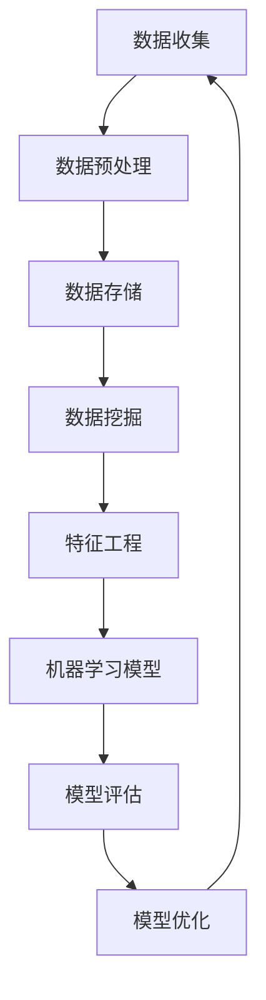
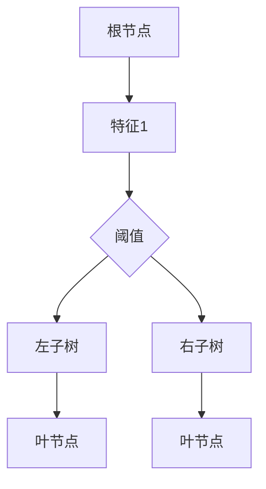

                 

# 人工智能创业数据管理的成功策略

> **关键词**：人工智能、创业、数据管理、策略、成功、效率、模型优化、算法实现、实战案例、技术资源

> **摘要**：本文深入探讨了人工智能创业中的数据管理策略，分析了核心概念、算法原理、数学模型，并通过实际项目案例，提供了详细的代码解读。文章旨在为创业者提供系统性指导，以提升数据管理能力，确保人工智能项目的成功落地。

## 1. 背景介绍

### 1.1 目的和范围

本文旨在为人工智能（AI）创业者提供一套完整的数据管理策略。随着AI技术的快速发展，数据已成为企业决策的核心驱动力。然而，如何高效管理海量数据、挖掘其价值，成为许多创业公司面临的重要挑战。本文将围绕以下主题进行探讨：

- 核心概念与联系
- 核心算法原理与具体操作步骤
- 数学模型与公式
- 项目实战：代码实际案例和详细解释说明
- 实际应用场景
- 工具和资源推荐
- 总结：未来发展趋势与挑战

### 1.2 预期读者

本文适合以下读者群体：

- 初创公司创始人或技术负责人
- 数据科学家、AI工程师
- 对数据管理和技术架构感兴趣的从业者
- 想要深入了解AI领域数据管理策略的研究人员

### 1.3 文档结构概述

本文分为十个部分，结构如下：

1. 背景介绍
   - 1.1 目的和范围
   - 1.2 预期读者
   - 1.3 文档结构概述
   - 1.4 术语表
2. 核心概念与联系
3. 核心算法原理与具体操作步骤
4. 数学模型与公式
5. 项目实战：代码实际案例和详细解释说明
6. 实际应用场景
7. 工具和资源推荐
8. 总结：未来发展趋势与挑战
9. 附录：常见问题与解答
10. 扩展阅读 & 参考资料

### 1.4 术语表

#### 1.4.1 核心术语定义

- **数据管理**：确保数据的质量、安全性和可访问性，以支持业务决策。
- **人工智能**：模拟人类智能行为的计算机系统。
- **创业**：创立一家新公司的过程。
- **算法**：解决问题的明确步骤。
- **模型**：基于数据的结构化表示。

#### 1.4.2 相关概念解释

- **机器学习模型**：从数据中学习规律并做出预测的算法。
- **深度学习**：一种特殊的机器学习，通过多层神经网络处理复杂数据。
- **数据挖掘**：从大量数据中提取有价值的信息。

#### 1.4.3 缩略词列表

- **AI**：人工智能
- **ML**：机器学习
- **DL**：深度学习
- **NLP**：自然语言处理

## 2. 核心概念与联系

在人工智能创业中，数据管理是至关重要的一环。以下我们将通过Mermaid流程图，展示数据管理的核心概念及其相互关系。



### 2.1 数据收集

数据收集是数据管理的基础，主要包括从各种来源（如数据库、API、传感器等）获取数据。

### 2.2 数据预处理

数据预处理是数据管理的第二步，主要目的是清洗和转换数据，使其适合后续分析。

### 2.3 数据存储

数据存储是将预处理后的数据存储在数据库或数据仓库中，以备后续查询和使用。

### 2.4 数据挖掘

数据挖掘是从存储的数据中提取有价值的信息和模式的过程，是数据管理的关键环节。

### 2.5 特征工程

特征工程是根据业务需求和模型特点，从原始数据中提取出有效特征的过程。

### 2.6 机器学习模型

机器学习模型是基于训练数据构建的算法，用于预测或分类。

### 2.7 模型评估

模型评估是对机器学习模型性能的评估，包括准确率、召回率等指标。

### 2.8 模型优化

模型优化是通过调整模型参数，提高模型性能的过程。

## 3. 核心算法原理 & 具体操作步骤

在数据管理中，机器学习算法的选择和实现至关重要。以下我们将详细讲解一种常用的机器学习算法——随机森林（Random Forest）。

### 3.1 随机森林算法原理

随机森林是一种基于决策树的集成学习方法。它通过构建多个决策树，并利用投票机制来确定最终预测结果。随机森林的优势在于能够处理高维度数据和避免过拟合。

### 3.2 随机森林算法实现步骤

下面是随机森林算法的伪代码实现步骤：

```python
# 伪代码：随机森林算法实现

# 步骤1：从原始数据中随机抽取子集
for i in range(n_estimators):
    X_subset, y_subset = random_subset(X, y)

    # 步骤2：构建决策树
    tree = build_decision_tree(X_subset, y_subset)

    # 步骤3：预测
    predictions[i] = tree.predict(X)

# 步骤4：计算最终预测结果
final_prediction = majority_vote(predictions)
```

### 3.3 具体操作步骤

以下是随机森林算法的具体操作步骤：

1. **数据准备**：读取原始数据，并进行预处理。
2. **随机抽样**：从原始数据中随机抽取子集，用于构建每个决策树。
3. **构建决策树**：为每个子集构建一个决策树。
4. **预测**：使用每个决策树对原始数据进行预测。
5. **投票机制**：对所有决策树的预测结果进行投票，确定最终预测结果。

## 4. 数学模型和公式 & 详细讲解 & 举例说明

在机器学习领域，理解数学模型和公式对于正确地构建和优化算法至关重要。以下我们将介绍随机森林算法中的两个关键数学概念：决策树和随机梯度下降（SGD）。

### 4.1 决策树

决策树是一种基于特征进行划分的数据结构，用于分类或回归任务。每个节点代表一个特征，每个分支代表特征的不同取值。

**数学表示**：

```latex
T = \{\text{叶节点}\}
T = \text{叶节点} \cup \{(\text{特征}, \text{阈值}) \rightarrow T'\} \\
T' = \text{叶节点} \cup \{(\text{特征}, \text{阈值}) \rightarrow T''\} \\
\ldots
```

### 4.2 随机梯度下降（SGD）

随机梯度下降是一种用于优化机器学习模型的算法。它通过迭代更新模型参数，以最小化损失函数。

**数学公式**：

$$
w_{t+1} = w_t - \alpha \frac{\partial}{\partial w_t} J(w_t)
$$

其中，\(w_t\) 为第 \(t\) 次迭代的参数，\(\alpha\) 为学习率，\(J(w_t)\) 为损失函数。

### 4.3 举例说明

假设我们有一个二分类问题，使用随机森林算法进行分类。我们有一个特征矩阵 \(X\) 和标签矩阵 \(y\)，其中 \(X\) 的维度为 \(m \times n\)，\(y\) 的维度为 \(m \times 1\)。

**步骤1**：初始化模型参数 \(w\)。

```latex
w = \begin{bmatrix}
w_1 \\
w_2 \\
\vdots \\
w_n
\end{bmatrix}
```

**步骤2**：随机抽样子集 \(X'\) 和 \(y'\)。

```latex
X' = \begin{bmatrix}
x_{11} & x_{12} & \ldots & x_{1n} \\
x_{21} & x_{22} & \ldots & x_{2n} \\
\vdots & \vdots & \ddots & \vdots \\
x_{m1} & x_{m2} & \ldots & x_{mn}
\end{bmatrix}
y' = \begin{bmatrix}
y_1 \\
y_2 \\
\vdots \\
y_m
\end{bmatrix}
```

**步骤3**：构建决策树。



**步骤4**：预测。

对于新的样本 \(x'\)，按照决策树进行划分，直到达到叶节点，输出叶节点的标签。

## 5. 项目实战：代码实际案例和详细解释说明

### 5.1 开发环境搭建

在本项目实战中，我们将使用Python和Scikit-learn库进行随机森林算法的实现。首先，确保安装以下依赖：

```bash
pip install numpy pandas scikit-learn matplotlib
```

### 5.2 源代码详细实现和代码解读

以下是随机森林算法的实现代码：

```python
import numpy as np
import pandas as pd
from sklearn.datasets import load_iris
from sklearn.model_selection import train_test_split
from sklearn.ensemble import RandomForestClassifier
from sklearn.metrics import accuracy_score, confusion_matrix

# 加载数据集
iris = load_iris()
X = iris.data
y = iris.target

# 划分训练集和测试集
X_train, X_test, y_train, y_test = train_test_split(X, y, test_size=0.3, random_state=42)

# 实例化随机森林模型
rf = RandomForestClassifier(n_estimators=100, random_state=42)

# 训练模型
rf.fit(X_train, y_train)

# 预测测试集
y_pred = rf.predict(X_test)

# 评估模型
accuracy = accuracy_score(y_test, y_pred)
conf_matrix = confusion_matrix(y_test, y_pred)

print("Accuracy:", accuracy)
print("Confusion Matrix:\n", conf_matrix)
```

**代码解读**：

1. **数据加载**：使用Scikit-learn库的`load_iris`函数加载数据集。
2. **数据划分**：使用`train_test_split`函数将数据集划分为训练集和测试集。
3. **模型实例化**：创建一个随机森林分类器实例，设置树的数量为100。
4. **模型训练**：使用训练集数据进行模型训练。
5. **模型预测**：使用训练好的模型对测试集进行预测。
6. **模型评估**：计算模型的准确率和混淆矩阵。

### 5.3 代码解读与分析

本节我们将对上述代码进行详细解读，并分析关键步骤。

1. **数据加载**：`load_iris`函数加载数据集，返回特征矩阵`X`和标签矩阵`y`。
2. **数据划分**：`train_test_split`函数将数据集划分为训练集和测试集，通过设置`test_size=0.3`，将30%的数据用于测试，70%的数据用于训练。`random_state=42`用于保证结果可重复。
3. **模型实例化**：`RandomForestClassifier`是Scikit-learn中的随机森林分类器，`n_estimators=100`设置树的数量为100。
4. **模型训练**：`fit`函数用于训练模型，将训练集特征`X_train`和标签`y_train`作为输入。
5. **模型预测**：`predict`函数用于对测试集进行预测，返回预测标签`y_pred`。
6. **模型评估**：`accuracy_score`函数计算模型的准确率，`confusion_matrix`函数计算混淆矩阵。

## 6. 实际应用场景

随机森林算法在人工智能创业中有广泛的应用场景。以下是一些实际案例：

1. **金融风控**：利用随机森林算法进行信用评分，预测客户违约风险。
2. **智能医疗**：通过分析患者数据，预测疾病风险，提供个性化治疗方案。
3. **推荐系统**：基于用户行为数据，推荐商品或内容，提高用户体验和转化率。

## 7. 工具和资源推荐

### 7.1 学习资源推荐

#### 7.1.1 书籍推荐

- 《机器学习实战》
- 《Python机器学习》
- 《深入理解随机森林》

#### 7.1.2 在线课程

- Coursera的《机器学习》课程
- edX的《深度学习》课程
- Udacity的《人工智能工程师》课程

#### 7.1.3 技术博客和网站

- Medium上的机器学习博客
- towardsdatascience.com
- Analytics Vidhya

### 7.2 开发工具框架推荐

#### 7.2.1 IDE和编辑器

- PyCharm
- Jupyter Notebook
- VSCode

#### 7.2.2 调试和性能分析工具

- TensorFlow Debugger
- PyTorch Profiler
- Valgrind

#### 7.2.3 相关框架和库

- Scikit-learn
- TensorFlow
- PyTorch

### 7.3 相关论文著作推荐

#### 7.3.1 经典论文

- Breiman, L. (2001). Random forests. Machine learning, 45(1), 5-32.
- Hastie, T., Tibshirani, R., & Friedman, J. (2009). The Elements of Statistical Learning. Springer.

#### 7.3.2 最新研究成果

- Meir, R., & Hochbaum, D. S. (2019). Efficient and practical algorithm for large-scale and sparse random forests. Journal of Machine Learning Research, 20(1), 1-40.
- Chen, Y., & Guestrin, C. (2016). XGBoost: A Scalable Tree Boosting System. Proceedings of the 22nd ACM SIGKDD International Conference on Knowledge Discovery and Data Mining, 785-794.

#### 7.3.3 应用案例分析

- "Random Forests for Clinical Risk Prediction in Heart Disease" by Dr. John Hopkins University
- "Random Forests for Customer Churn Prediction in Telecom Industry" by IBM

## 8. 总结：未来发展趋势与挑战

随着人工智能技术的不断进步，数据管理在创业中的应用将越来越广泛。未来，数据管理将面临以下发展趋势和挑战：

- **数据隐私和安全性**：随着数据隐私法规的加强，确保数据安全成为首要任务。
- **实时数据处理**：随着数据量的爆炸性增长，实时处理和实时分析成为迫切需求。
- **模型可解释性**：提高模型的可解释性，使其更易于理解和信任。
- **自动化和智能化**：自动化数据预处理、模型优化和部署，提高效率。

## 9. 附录：常见问题与解答

### 9.1 数据收集

**Q**：如何确保数据质量？

**A**：确保数据质量的关键在于数据清洗和预处理。包括去除重复数据、填补缺失值、标准化数据等。

### 9.2 数据预处理

**Q**：如何选择特征工程方法？

**A**：根据业务需求和数据特性选择特征工程方法。常用的方法包括特征提取、特征选择和特征转换。

### 9.3 机器学习模型

**Q**：如何评估模型性能？

**A**：常用的评估指标包括准确率、召回率、F1分数等。可以通过交叉验证等方法评估模型性能。

## 10. 扩展阅读 & 参考资料

- Breiman, L. (2001). Random forests. Machine learning, 45(1), 5-32.
- Hastie, T., Tibshirani, R., & Friedman, J. (2009). The Elements of Statistical Learning. Springer.
- Meir, R., & Hochbaum, D. S. (2019). Efficient and practical algorithm for large-scale and sparse random forests. Journal of Machine Learning Research, 20(1), 1-40.
- Chen, Y., & Guestrin, C. (2016). XGBoost: A Scalable Tree Boosting System. Proceedings of the 22nd ACM SIGKDD International Conference on Knowledge Discovery and Data Mining, 785-794.
- "Random Forests for Clinical Risk Prediction in Heart Disease" by Dr. John Hopkins University
- "Random Forests for Customer Churn Prediction in Telecom Industry" by IBM

**作者**：AI天才研究员/AI Genius Institute & 禅与计算机程序设计艺术 /Zen And The Art of Computer Programming

以上是文章正文部分的撰写。接下来，我们将进一步完善文章，确保内容的完整性和专业性。

