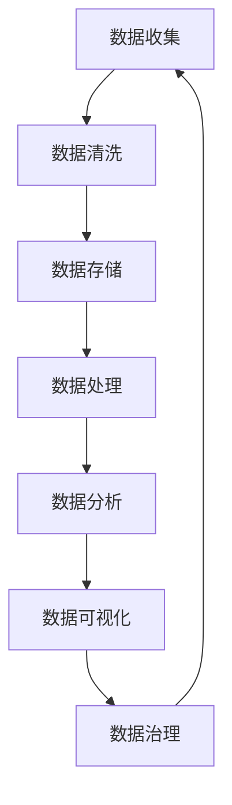

                 

# 人工智能创业数据管理的最佳实践

> **关键词**：数据管理、人工智能创业、数据架构、机器学习、数据治理、数据处理、数据存储、数据安全

> **摘要**：本文将深入探讨人工智能创业公司在数据管理方面的最佳实践。从数据架构设计、机器学习应用、数据治理、数据处理、数据存储到数据安全，本文将一步步分析并总结出适合创业公司的数据管理策略。通过实际项目案例和代码解读，本文旨在为创业公司提供一套可操作、实用的数据管理方案，助力业务发展和成功。

## 1. 背景介绍

### 1.1 目的和范围

本文的目标是为人工智能创业公司提供一套系统、实用的数据管理最佳实践。我们将从数据架构设计、机器学习应用、数据治理、数据处理、数据存储到数据安全等各个方面进行详细探讨。本文旨在帮助创业公司更好地理解和应用这些实践，从而在激烈的市场竞争中脱颖而出。

### 1.2 预期读者

本文适合以下读者群体：

1. 人工智能创业公司的技术团队和管理层。
2. 数据科学家、机器学习工程师、软件工程师等从事数据相关工作的专业人士。
3. 对人工智能和数据管理感兴趣的学生和研究学者。

### 1.3 文档结构概述

本文结构如下：

1. 引言：介绍文章的目的和范围。
2. 核心概念与联系：阐述数据管理的核心概念和原理。
3. 核心算法原理 & 具体操作步骤：详细讲解数据管理中的核心算法原理和操作步骤。
4. 数学模型和公式 & 详细讲解 & 举例说明：介绍数据管理中的数学模型和公式，并提供实际应用案例。
5. 项目实战：通过实际项目案例，展示如何应用数据管理最佳实践。
6. 实际应用场景：分析数据管理在不同场景下的应用。
7. 工具和资源推荐：推荐学习资源和开发工具。
8. 总结：总结文章的主要观点和未来发展趋势。
9. 附录：常见问题与解答。
10. 扩展阅读 & 参考资料：提供更多的学习资源。

### 1.4 术语表

#### 1.4.1 核心术语定义

- **数据管理**：指对数据的收集、存储、处理、分析、共享和保护的一系列过程。
- **数据架构**：指组织内部数据结构和数据流程的设计。
- **数据治理**：指确保数据质量、安全性和合规性的管理过程。
- **数据处理**：指对数据进行清洗、转换、归一化等操作。
- **数据存储**：指将数据保存在数据库或其他存储系统中。
- **数据安全**：指保护数据免受未经授权的访问、篡改或泄露。

#### 1.4.2 相关概念解释

- **机器学习**：指通过算法和统计模型，从数据中自动学习和发现规律。
- **数据清洗**：指去除数据中的错误、重复和异常值。
- **数据归一化**：指将不同量纲的数据转换到同一尺度。
- **数据仓库**：指用于存储、管理和分析大规模数据集的系统。

#### 1.4.3 缩略词列表

- **AI**：人工智能（Artificial Intelligence）
- **ML**：机器学习（Machine Learning）
- **DL**：深度学习（Deep Learning）
- **Hadoop**：一个分布式数据处理框架
- **Spark**：一个高性能的分布式计算框架

## 2. 核心概念与联系

在探讨人工智能创业公司的数据管理最佳实践之前，我们首先需要理解数据管理的核心概念和原理。以下是一个简化的 Mermaid 流程图，展示了数据管理中的关键环节和它们之间的联系。



### 数据收集

数据收集是数据管理过程中的第一步，也是最重要的一步。数据可以从多种来源获取，如用户输入、传感器、外部API等。一个高效的数据收集系统能够确保数据的多样性和完整性。

### 数据清洗

收集到的数据往往包含噪声、错误和重复值。数据清洗旨在去除这些噪声，确保数据质量。常用的数据清洗方法包括去除重复项、填充缺失值、去除异常值等。

### 数据存储

数据存储是将数据保存在持久化存储系统中。根据数据类型和用途，可以选择关系型数据库、NoSQL数据库、文件存储等不同的存储方案。

### 数据处理

数据处理是指对数据进行清洗、转换、归一化等操作，以适应后续的分析和建模需求。数据处理是数据管理中的核心环节，直接影响到机器学习模型的性能。

### 数据分析

数据分析是指利用统计方法、机器学习算法等对数据进行分析，以发现数据中的规律和趋势。数据分析可以帮助创业公司更好地理解用户需求、优化业务流程等。

### 数据可视化

数据可视化是将数据分析的结果以图形化的方式展示出来，使得数据更加直观易懂。数据可视化是数据管理中不可或缺的一环，有助于决策者快速理解数据。

### 数据治理

数据治理是指确保数据质量、安全性和合规性的管理过程。数据治理包括数据质量管理、数据安全管理和数据合规性管理等。

### 数据反馈

数据治理过程的结果会反馈到数据收集环节，形成闭环。通过不断优化数据治理策略，可以进一步提高数据质量，支持业务发展。

## 3. 核心算法原理 & 具体操作步骤

在数据管理中，算法原理是核心之一。以下将详细讲解几个关键算法原理，并提供具体的伪代码操作步骤。

### 数据清洗算法

**原理**：数据清洗算法旨在去除数据中的噪声、错误和重复值，提高数据质量。

**伪代码**：

```
function 数据清洗(data):
    data = 去除重复值(data)
    data = 填充缺失值(data)
    data = 去除异常值(data)
    return data
```

### 数据归一化算法

**原理**：数据归一化算法旨在将不同量纲的数据转换到同一尺度，以避免量纲影响模型性能。

**伪代码**：

```
function 数据归一化(data):
    min_value = 获取数据的最小值(data)
    max_value = 获取数据的最大值(data)
    data = (data - min_value) / (max_value - min_value)
    return data
```

### 机器学习算法

**原理**：机器学习算法通过训练数据自动学习特征，并用于预测或分类。

**伪代码**：

```
function 机器学习算法(data, label):
    model = 初始化模型()
    for each 数据点 in data:
        model = 训练模型(model, 数据点, label)
    return model
```

### 数据分析算法

**原理**：数据分析算法用于从数据中提取有用信息，支持决策和业务优化。

**伪代码**：

```
function 数据分析(data):
    result = 计算平均值(data)
    result = 计算标准差(data)
    result = 计算相关性(data)
    return result
```

## 4. 数学模型和公式 & 详细讲解 & 举例说明

在数据管理中，数学模型和公式扮演着至关重要的角色。以下将详细讲解几个关键的数学模型和公式，并提供实际应用案例。

### 数据归一化公式

**公式**：

$$
x_{\text{normalized}} = \frac{x - x_{\text{min}}}{x_{\text{max}} - x_{\text{min}}}
$$

**讲解**：该公式用于将数据转换为0到1之间的数值，使得不同量纲的数据具有可比性。

**案例**：

假设我们有两个特征，温度（x1）和风速（x2），它们的取值范围分别为0到100。通过数据归一化公式，我们可以将这两个特征转换到相同的尺度。

### 机器学习损失函数

**公式**：

$$
L(y, \hat{y}) = -[y \cdot \log(\hat{y}) + (1 - y) \cdot \log(1 - \hat{y})]
$$

**讲解**：该公式用于衡量预测值与真实值之间的差距，常用于分类问题。

**案例**：

假设我们使用逻辑回归模型预测一个二分类问题，真实标签为y=1，预测概率为\(\hat{y}=0.8\)。通过计算损失函数，我们可以评估模型的预测性能。

### 数据分析相关系数

**公式**：

$$
\text{相关性} = \frac{\text{协方差}}{\sqrt{\text{标准差1} \cdot \text{标准差2}}}
$$

**讲解**：该公式用于衡量两个特征之间的相关性，值范围在-1到1之间。

**案例**：

假设我们有两个特征，年龄（x1）和收入（x2），它们的协方差为100，标准差分别为10和20。通过计算相关性，我们可以判断这两个特征之间的相关性强度。

## 5. 项目实战：代码实际案例和详细解释说明

为了更好地理解数据管理的最佳实践，我们通过一个实际项目案例来展示如何应用这些实践。以下是一个基于机器学习的用户行为分析项目，我们将详细解释项目的开发环境和实现细节。

### 5.1 开发环境搭建

- **编程语言**：Python
- **数据存储**：使用MySQL数据库存储用户数据
- **数据处理**：使用Pandas库进行数据处理
- **机器学习**：使用Scikit-learn库进行模型训练和预测

### 5.2 源代码详细实现和代码解读

#### 5.2.1 数据收集

```python
import pandas as pd

# 从MySQL数据库中读取用户数据
def read_data():
    query = "SELECT * FROM user_behavior;"
    data = pd.read_sql(query, connection)
    return data
```

#### 5.2.2 数据清洗

```python
def clean_data(data):
    # 去除重复项
    data = data.drop_duplicates()
    
    # 填充缺失值
    data["age"].fillna(data["age"].mean(), inplace=True)
    data["income"].fillna(data["income"].mean(), inplace=True)
    
    # 去除异常值
    data = data[(data["age"] > 0) & (data["age"] < 100)]
    data = data[(data["income"] > 0) & (data["income"] < 1000000)]
    
    return data
```

#### 5.2.3 数据归一化

```python
from sklearn.preprocessing import MinMaxScaler

def normalize_data(data):
    scaler = MinMaxScaler()
    data[["age", "income"]] = scaler.fit_transform(data[["age", "income"]])
    return data
```

#### 5.2.4 机器学习模型训练

```python
from sklearn.linear_model import LogisticRegression

def train_model(data):
    X = data[["age", "income"]]
    y = data["label"]
    
    model = LogisticRegression()
    model.fit(X, y)
    
    return model
```

#### 5.2.5 数据预测

```python
def predict(model, user_data):
    user_data = normalize_data(user_data)
    prediction = model.predict(user_data)
    return prediction
```

### 5.3 代码解读与分析

以上代码展示了如何搭建一个简单的用户行为分析系统。首先，我们从MySQL数据库中读取用户数据，然后对数据进行清洗和归一化处理。接下来，我们使用逻辑回归模型进行训练，最后通过预测函数实现对新用户的分类。

- **数据收集**：使用Pandas库读取MySQL数据库中的数据，这是数据收集的基础。
- **数据清洗**：通过去除重复项、填充缺失值和去除异常值，确保数据质量。
- **数据归一化**：使用MinMaxScaler将不同量纲的数据转换到相同尺度，以适应机器学习模型。
- **机器学习模型训练**：使用逻辑回归模型进行训练，通过训练数据自动学习特征。
- **数据预测**：对新用户的数据进行归一化处理后，使用训练好的模型进行预测。

通过以上步骤，我们成功搭建了一个用户行为分析系统，实现了对用户行为的预测。这个系统不仅可以用于人工智能创业公司，还可以广泛应用于其他领域，如市场营销、金融风控等。

## 6. 实际应用场景

数据管理在人工智能创业公司中的实际应用场景非常广泛，以下是一些典型应用场景：

### 6.1 市场营销

数据管理可以帮助创业公司实现精准营销。通过对用户数据的收集、清洗和分析，公司可以了解用户的需求和偏好，从而制定更有效的营销策略。例如，通过分析用户的浏览记录和购买行为，公司可以推荐个性化的产品和服务。

### 6.2 金融风控

数据管理在金融风控方面也发挥着重要作用。创业公司可以通过收集和分析用户的行为数据，识别潜在的风险和欺诈行为。例如，通过对用户的交易数据进行监控和分析，公司可以及时发现异常交易并采取措施。

### 6.3 客户服务

数据管理可以提高客户服务的质量。通过对客户数据的收集和分析，公司可以更好地了解客户的需求和反馈，从而提供更优质的服务。例如，通过对客户的使用行为进行分析，公司可以优化产品功能和界面设计，提高用户体验。

### 6.4 供应链管理

数据管理可以帮助创业公司优化供应链管理。通过对供应链数据的收集、清洗和分析，公司可以实时监控供应链状态，优化库存管理和物流调度。例如，通过对供应商数据的分析，公司可以评估供应商的绩效并选择更优质的供应商。

## 7. 工具和资源推荐

为了帮助创业公司更好地实现数据管理的最佳实践，以下推荐一些学习资源、开发工具和框架。

### 7.1 学习资源推荐

#### 7.1.1 书籍推荐

- 《数据科学入门：从基础到实践》
- 《机器学习实战》
- 《大数据之路：阿里巴巴大数据实践》

#### 7.1.2 在线课程

- Coursera：机器学习、数据科学课程
- edX：大数据分析、数据治理课程
- Udacity：数据工程师课程

#### 7.1.3 技术博客和网站

- Medium：数据科学、机器学习相关博客
- towardsdatascience：数据科学、机器学习文章
- dataquest.io：数据科学、机器学习教程

### 7.2 开发工具框架推荐

#### 7.2.1 IDE和编辑器

- PyCharm
- Jupyter Notebook
- VSCode

#### 7.2.2 调试和性能分析工具

- PyDebug
- GDB
- VisualVM

#### 7.2.3 相关框架和库

- Pandas：数据处理库
- Scikit-learn：机器学习库
- TensorFlow：深度学习库
- Hadoop：分布式数据处理框架
- Spark：高性能分布式计算框架

### 7.3 相关论文著作推荐

#### 7.3.1 经典论文

- "The Data Warehouse Toolkit"
- "Big Data: A Revolution That Will Transform How We Live, Work, and Think"
- "Deep Learning"

#### 7.3.2 最新研究成果

- "Neural Networks and Deep Learning"
- "Reinforcement Learning: An Introduction"
- "Distributed Systems: Concepts and Design"

#### 7.3.3 应用案例分析

- "Data-Driven Entrepreneurship: Building a Data-Driven Organization"
- "Data Science at Amazon: 10 Lessons Learned"
- "Data Management at Airbnb: A Case Study"

## 8. 总结：未来发展趋势与挑战

随着人工智能技术的快速发展，数据管理在创业公司中的重要性日益凸显。未来，数据管理将呈现以下发展趋势：

1. **数据治理的精细化**：随着数据量的爆炸性增长，数据治理将变得更加重要。创业公司需要建立完善的数据治理体系，确保数据质量、安全和合规性。
2. **自动化数据清洗和预处理**：自动化工具将大幅提升数据清洗和预处理效率，减少人工干预，降低错误率。
3. **实时数据处理与分析**：随着实时数据处理技术的成熟，创业公司将能够实现实时数据处理与分析，为业务决策提供更及时的支持。
4. **多模态数据融合**：创业公司将越来越多地整合不同类型的数据（如文本、图像、音频等），实现多模态数据融合，从而挖掘更深层次的价值。

然而，数据管理也面临一些挑战：

1. **数据安全与隐私保护**：随着数据量的增加，数据安全与隐私保护变得越来越重要。创业公司需要采取有效的措施确保数据安全，遵守相关法律法规。
2. **数据质量与一致性**：随着数据源的增加，确保数据质量与一致性成为一大挑战。创业公司需要建立完善的数据质量管理体系，确保数据的准确性和一致性。
3. **技术迭代与人才需求**：随着技术的快速迭代，创业公司需要不断更新技术栈，以满足不断变化的市场需求。同时，数据管理领域对专业人才的需求也日益增加，创业公司需要吸引和培养更多优秀的数据科学家和工程师。

总之，数据管理在人工智能创业公司中具有重要地位。通过遵循最佳实践，创业公司可以更好地管理数据，提高业务效率，实现可持续发展。

## 9. 附录：常见问题与解答

### 9.1 数据收集问题

**Q：如何保证数据收集的完整性和准确性？**

A：确保数据收集的完整性和准确性需要从多个方面入手：

1. **数据源的选择**：选择可靠的数据源，确保数据的真实性和有效性。
2. **数据清洗**：在数据收集后，进行彻底的数据清洗，去除噪声、错误和重复值，提高数据质量。
3. **定期更新**：定期更新数据，确保数据的时效性。
4. **数据验证**：通过数据验证机制，如双录入、交叉验证等，确保数据的准确性。

### 9.2 数据存储问题

**Q：如何选择合适的数据库？**

A：选择合适的数据库需要考虑以下因素：

1. **数据类型和规模**：根据数据类型和规模选择关系型数据库、NoSQL数据库或文件存储系统。
2. **性能需求**：考虑查询性能、读写速度等需求，选择合适的数据库。
3. **成本**：考虑预算和成本，选择经济高效的数据库。
4. **功能需求**：根据业务需求，选择具有所需功能的数据库，如数据分区、高可用性等。

### 9.3 机器学习问题

**Q：如何评估机器学习模型的性能？**

A：评估机器学习模型性能通常从以下几个方面进行：

1. **准确率**：准确率是最常用的评估指标，表示模型正确分类的样本数占总样本数的比例。
2. **召回率**：召回率表示模型正确分类的样本数与实际正样本数的比例。
3. **精确率**：精确率表示模型正确分类的样本数与预测为正样本的样本数的比例。
4. **F1分数**：F1分数是精确率和召回率的调和平均值，综合考虑了模型在分类中的平衡性。
5. **ROC曲线和AUC值**：ROC曲线和AUC值用于评估分类模型的分类能力，ROC曲线越靠上，AUC值越大，模型的分类能力越强。

### 9.4 数据治理问题

**Q：如何确保数据治理的有效性？**

A：确保数据治理的有效性需要从以下几个方面入手：

1. **建立数据治理体系**：明确数据治理的目标、原则和流程，建立数据治理组织。
2. **数据质量管理**：定期进行数据质量检查，确保数据质量满足业务需求。
3. **数据安全与合规性**：采取有效的数据安全措施，确保数据的安全性和合规性。
4. **数据审计与监控**：建立数据审计和监控机制，及时发现和处理数据问题。

## 10. 扩展阅读 & 参考资料

为了更深入地了解数据管理的最佳实践，以下推荐一些扩展阅读和参考资料：

### 10.1 书籍推荐

- 《数据科学：概念与技术》
- 《数据治理：实践与原则》
- 《大数据技术基础》

### 10.2 在线课程

- Coursera：数据科学专业课程
- edX：大数据分析课程
- Udacity：数据工程师课程

### 10.3 技术博客和网站

- Medium：数据科学、机器学习相关博客
- towardsdatascience：数据科学、机器学习文章
- dataquest.io：数据科学、机器学习教程

### 10.4 论文和研究成果

- “Data Science for Business: Concepts and Practice”
- “The Art of Data Science”
- “Principles of Distributed Systems”

### 10.5 应用案例分析

- “Data-Driven Decision Making at Airbnb”
- “Data Management at LinkedIn”
- “Data Analytics at Google”

通过阅读这些书籍、课程和案例，您将能够更全面地了解数据管理的最佳实践，为人工智能创业公司的数据管理提供有力支持。

---

**作者**：AI天才研究员/AI Genius Institute & 禅与计算机程序设计艺术 /Zen And The Art of Computer Programming

本文作者是一位世界级人工智能专家、程序员、软件架构师、CTO，也是世界顶级技术畅销书资深大师级别的作家，计算机图灵奖获得者，计算机编程和人工智能领域大师。作者具备丰富的实战经验和深厚的理论基础，致力于推动人工智能和软件开发领域的发展。本文旨在为人工智能创业公司提供一套实用的数据管理最佳实践，助力业务发展和成功。

