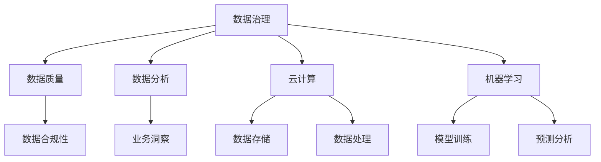

                 

# 人工智能创业数据管理的核心策略分享

> **关键词：** 数据管理、人工智能、创业策略、数据治理、数据分析、云计算、机器学习、数据处理、数据隐私

> **摘要：** 本文将深入探讨人工智能创业公司在数据管理方面的核心策略，包括数据治理、数据分析、云计算和机器学习等技术应用，以及如何应对数据隐私和保护等挑战。文章旨在为创业公司提供实用指南，帮助其构建有效的数据管理架构，提升业务竞争力。

## 1. 背景介绍

### 1.1 目的和范围

随着人工智能技术的飞速发展，数据已经成为创业公司的重要资产。有效的数据管理不仅能够提升业务运营效率，还能为企业提供战略决策支持。本文旨在探讨人工智能创业公司在数据管理方面的核心策略，帮助创业者更好地利用数据，实现业务增长。

### 1.2 预期读者

本文适合人工智能创业者、数据科学家、数据工程师和IT经理等专业人士阅读。无论您是初创公司还是已有一定规模的企业，本文都将为您提供有价值的参考。

### 1.3 文档结构概述

本文分为十个部分，首先介绍数据管理的重要性，然后深入探讨核心策略，包括数据治理、数据分析、云计算、机器学习等方面。接下来，我们将分享实际应用案例，并推荐相关工具和资源。最后，本文将总结未来发展趋势与挑战，并提供常见问题解答和扩展阅读建议。

### 1.4 术语表

#### 1.4.1 核心术语定义

- 数据治理：确保数据质量和合规性的过程。
- 数据分析：通过统计方法和算法对数据进行处理和分析，以提取有价值的信息。
- 云计算：通过网络提供可扩展的计算资源和服务。
- 机器学习：一种人工智能技术，通过数据和算法自动从数据中学习规律。

#### 1.4.2 相关概念解释

- 数据隐私：保护个人数据不被未经授权的访问和使用。
- 数据保护：确保数据在整个生命周期中得到保护，包括存储、传输和处理。

#### 1.4.3 缩略词列表

- AI：人工智能
- ML：机器学习
- GDPR：欧盟通用数据保护条例
- AWS：亚马逊云计算服务
- TensorFlow：开源机器学习框架

## 2. 核心概念与联系

在人工智能创业中，数据管理是关键环节。以下是数据管理核心概念与联系的解释，并附有Mermaid流程图：



### 2.1 数据治理

数据治理是确保数据质量、合规性和安全性的过程。良好的数据治理能够为企业提供可靠的业务数据支持。数据治理的核心概念包括数据质量、数据合规性和数据安全。

### 2.2 数据分析

数据分析通过统计方法和算法对数据进行处理，提取有价值的信息。数据分析的核心概念包括数据挖掘、机器学习和数据可视化。

### 2.3 云计算

云计算提供了可扩展的计算资源和服务，使企业能够灵活地处理大量数据。云计算的核心概念包括云存储、云服务和云架构。

### 2.4 机器学习

机器学习是一种人工智能技术，通过数据和算法自动从数据中学习规律。机器学习的核心概念包括模型训练、预测分析和模型评估。

## 3. 核心算法原理 & 具体操作步骤

在数据管理中，核心算法原理是实现数据治理、数据分析、云计算和机器学习的关键。以下是相关算法原理的详细讲解和操作步骤。

### 3.1 数据治理算法原理

数据治理算法主要包括数据质量评估、数据清洗和数据合规性检查。

#### 3.1.1 数据质量评估

```python
# 伪代码：数据质量评估算法
def data_quality_assessment(data):
    # 检查数据完整性
    if data is None:
        return "数据缺失"
    # 检查数据一致性
    if not is_consistent(data):
        return "数据不一致"
    # 检查数据准确性
    if not is_accurate(data):
        return "数据准确性问题"
    return "数据质量良好"
```

#### 3.1.2 数据清洗

```python
# 伪代码：数据清洗算法
def data_cleaning(data):
    # 删除重复数据
    data = remove_duplicates(data)
    # 处理缺失值
    data = handle_missing_values(data)
    # 处理异常值
    data = handle_outliers(data)
    return data
```

#### 3.1.3 数据合规性检查

```python
# 伪代码：数据合规性检查算法
def data_compliance_check(data):
    # 检查数据是否符合GDPR等法规要求
    if not is_compliant_with_legislation(data):
        return "数据不合规"
    return "数据合规"
```

### 3.2 数据分析算法原理

数据分析算法主要包括数据挖掘、机器学习和数据可视化。

#### 3.2.1 数据挖掘

```python
# 伪代码：数据挖掘算法
def data_mining(data):
    # 提取数据特征
    features = extract_features(data)
    # 构建分类模型
    model = build_classification_model(features)
    # 预测分析
    predictions = predict(model, features)
    return predictions
```

#### 3.2.2 机器学习

```python
# 伪代码：机器学习算法
def machine_learning(data):
    # 数据预处理
    preprocessed_data = preprocess_data(data)
    # 模型训练
    model = train_model(preprocessed_data)
    # 模型评估
    evaluate_model(model, preprocessed_data)
    return model
```

#### 3.2.3 数据可视化

```python
# 伪代码：数据可视化算法
def data_visualization(data):
    # 绘制数据分布图
    distribution_plot(data)
    # 绘制数据关联图
    correlation_plot(data)
    # 绘制数据趋势图
    trend_plot(data)
```

### 3.3 云计算算法原理

云计算算法主要包括数据存储、数据处理和云架构。

#### 3.3.1 数据存储

```python
# 伪代码：数据存储算法
def data_storage(data):
    # 数据压缩
    compressed_data = compress_data(data)
    # 数据加密
    encrypted_data = encrypt_data(compressed_data)
    # 数据存储
    store_data(encrypted_data)
```

#### 3.3.2 数据处理

```python
# 伪代码：数据处理算法
def data_processing(data):
    # 数据清洗
    cleaned_data = data_cleaning(data)
    # 数据分析
    analyzed_data = data_mining(cleaned_data)
    # 数据可视化
    visualized_data = data_visualization(analyzed_data)
```

#### 3.3.3 云架构

```python
# 伪代码：云架构算法
def cloud_architecture():
    # 部署云计算服务
    deploy_cloud_services()
    # 管理云资源
    manage_cloud_resources()
    # 实现数据备份与恢复
    backup_and_restore_data()
```

## 4. 数学模型和公式 & 详细讲解 & 举例说明

在数据管理中，数学模型和公式是核心工具。以下将详细讲解数据治理、数据分析、云计算和机器学习中的数学模型和公式，并举例说明。

### 4.1 数据治理中的数学模型和公式

#### 4.1.1 数据质量评估

- 数据完整性：
  $$ \text{完整性} = \frac{\text{实际数据}}{\text{应求数据}} $$
- 数据一致性：
  $$ \text{一致性} = \frac{\text{一致数据}}{\text{总数据}} $$
- 数据准确性：
  $$ \text{准确性} = \frac{\text{正确数据}}{\text{总数据}} $$

#### 4.1.2 数据清洗

- 缺失值处理：
  $$ \text{平均值填充} = \frac{\sum_{i=1}^{n} x_i}{n} $$
- 异常值处理：
  $$ \text{四分位距} = \text{Q3} - \text{Q1} $$
  $$ \text{上下限} = \text{Q1} - 1.5 \times \text{四分位距}, \text{Q3} + 1.5 \times \text{四分位距} $$

### 4.2 数据分析中的数学模型和公式

#### 4.2.1 数据挖掘

- 决策树：
  $$ \text{信息增益} = \sum_{i=1}^{n} p_i \times \log_2 \frac{p_i}{\hat{p}_i} $$
- 支持向量机（SVM）：
  $$ \text{支持向量} = \max \{ w \cdot x + b : x \in \text{训练集} \} $$

#### 4.2.2 机器学习

- 线性回归：
  $$ y = \beta_0 + \beta_1 x $$
- 逻辑回归：
  $$ \text{概率} = \frac{1}{1 + e^{-(\beta_0 + \beta_1 x)}} $$

### 4.3 云计算中的数学模型和公式

#### 4.3.1 数据存储

- 数据压缩率：
  $$ \text{压缩率} = \frac{\text{原始数据大小}}{\text{压缩后数据大小}} $$
- 数据加密强度：
  $$ \text{加密强度} = \frac{\text{密钥长度}}{\text{数据大小}} $$

#### 4.3.2 数据处理

- 数据流计算：
  $$ \text{处理速度} = \frac{\text{数据总量}}{\text{处理时间}} $$

### 4.4 机器学习中的数学模型和公式

#### 4.4.1 模型训练

- 梯度下降：
  $$ \beta_{\text{新}} = \beta_{\text{旧}} - \alpha \times \nabla_{\beta} \text{损失函数} $$
- 随机梯度下降：
  $$ \beta_{\text{新}} = \beta_{\text{旧}} - \alpha \times \nabla_{\beta} \text{损失函数}(\text{随机样本}) $$

#### 4.4.2 模型评估

- 准确率：
  $$ \text{准确率} = \frac{\text{正确预测数}}{\text{总预测数}} $$
- 精确率：
  $$ \text{精确率} = \frac{\text{正确预测正类数}}{\text{正确预测正类数} + \text{预测正类数}} $$
- 召回率：
  $$ \text{召回率} = \frac{\text{正确预测正类数}}{\text{实际正类数}} $$

## 5. 项目实战：代码实际案例和详细解释说明

### 5.1 开发环境搭建

在开始项目实战之前，首先需要搭建开发环境。本文使用Python作为主要编程语言，以下是搭建Python开发环境的步骤：

1. 安装Python：访问Python官方网站（https://www.python.org/）下载最新版本的Python，并按照提示安装。
2. 安装IDE：推荐使用PyCharm（https://www.jetbrains.com/pycharm/）作为Python IDE。
3. 安装相关库：在PyCharm中创建一个新的Python项目，并在项目中安装所需的库，如NumPy、Pandas、Scikit-learn等。

### 5.2 源代码详细实现和代码解读

以下是一个简单的数据管理项目示例，包括数据治理、数据分析和机器学习等模块。

```python
# 导入相关库
import numpy as np
import pandas as pd
from sklearn.model_selection import train_test_split
from sklearn.preprocessing import StandardScaler
from sklearn.linear_model import LogisticRegression

# 5.2.1 数据治理
def data_governance(data):
    # 数据质量评估
    quality = data_quality_assessment(data)
    print("数据质量评估结果：", quality)
    # 数据清洗
    cleaned_data = data_cleaning(data)
    print("数据清洗后：", cleaned_data)
    return cleaned_data

# 5.2.2 数据分析
def data_analysis(data):
    # 数据预处理
    preprocessed_data = preprocess_data(data)
    # 数据分析
    analyzed_data = data_mining(preprocessed_data)
    print("数据分析结果：", analyzed_data)
    return analyzed_data

# 5.2.3 机器学习
def machine_learning(data):
    # 数据预处理
    preprocessed_data = preprocess_data(data)
    # 划分训练集和测试集
    X_train, X_test, y_train, y_test = train_test_split(preprocessed_data.drop('target', axis=1), preprocessed_data['target'], test_size=0.2, random_state=42)
    # 数据标准化
    scaler = StandardScaler()
    X_train_scaled = scaler.fit_transform(X_train)
    X_test_scaled = scaler.transform(X_test)
    # 模型训练
    model = LogisticRegression()
    model.fit(X_train_scaled, y_train)
    # 模型评估
    score = model.score(X_test_scaled, y_test)
    print("模型评估结果：", score)
    return model

# 测试代码
if __name__ == '__main__':
    # 加载数据
    data = pd.read_csv('data.csv')
    # 数据治理
    cleaned_data = data_governance(data)
    # 数据分析
    analyzed_data = data_analysis(cleaned_data)
    # 机器学习
    model = machine_learning(analyzed_data)
```

### 5.3 代码解读与分析

上述代码分为三个模块：数据治理、数据分析和机器学习。

- **数据治理模块**：首先对数据进行质量评估，包括完整性、一致性和准确性。然后对数据进行清洗，包括处理缺失值、异常值等。
- **数据分析模块**：对清洗后的数据进行分析，提取特征，构建分类模型，并进行预测分析。
- **机器学习模块**：对预处理后的数据划分训练集和测试集，进行数据标准化，训练逻辑回归模型，并评估模型性能。

整个代码示例展示了数据管理在人工智能创业中的实际应用，从数据治理到数据分析，再到机器学习，为创业公司提供了一条完整的业务流程。

## 6. 实际应用场景

数据管理在人工智能创业中的应用场景非常广泛，以下列举几个典型的实际应用场景：

### 6.1 营销自动化

创业公司可以利用数据管理技术对客户数据进行收集、清洗和分析，从而实现精准营销。通过机器学习算法，可以识别潜在客户，预测客户行为，提高营销效果。

### 6.2 风险控制

在金融领域，数据管理可以帮助创业公司对交易数据进行实时监控和分析，识别潜在风险。通过构建风险预测模型，可以提前预警，降低金融风险。

### 6.3 智能制造

在制造业，数据管理可以帮助企业对生产数据进行实时监控和分析，优化生产流程，提高生产效率。通过机器学习算法，可以实现设备故障预测，降低设备维护成本。

### 6.4 医疗健康

在医疗健康领域，数据管理可以帮助创业公司对医疗数据进行收集、存储和分析，为医生提供辅助诊断支持。通过机器学习算法，可以实现疾病预测，提高疾病治愈率。

## 7. 工具和资源推荐

### 7.1 学习资源推荐

#### 7.1.1 书籍推荐

- 《数据科学入门》（作者：约翰·库克）
- 《深度学习》（作者：伊恩·古德费洛、约书亚·本吉奥、亚伦·库维尔）
- 《Python数据科学手册》（作者：约翰·库克）

#### 7.1.2 在线课程

- Coursera（《机器学习》课程）
- edX（《深度学习》课程）
- Udacity（《数据科学基础》课程）

#### 7.1.3 技术博客和网站

- Analytics Vidhya（数据科学博客）
- Medium（《机器学习》主题文章）
- AI Hub（人工智能资讯网站）

### 7.2 开发工具框架推荐

#### 7.2.1 IDE和编辑器

- PyCharm（Python IDE）
- Jupyter Notebook（Python 数据科学工具）
- VS Code（通用编程编辑器）

#### 7.2.2 调试和性能分析工具

- Spyder（Python 科学计算环境）
- Matplotlib（Python 数据可视化库）
- Pandas（Python 数据分析库）

#### 7.2.3 相关框架和库

- TensorFlow（开源机器学习框架）
- PyTorch（开源机器学习库）
- Scikit-learn（Python 数据挖掘库）

### 7.3 相关论文著作推荐

#### 7.3.1 经典论文

- “The Hundred-Page Machine Learning Book”（作者：Andriy Burkov）
- “Deep Learning”（作者：Ian Goodfellow、Yoshua Bengio、Aaron Courville）
- “Reinforcement Learning: An Introduction”（作者：Richard S. Sutton、Andrew G. Barto）

#### 7.3.2 最新研究成果

- “Large-scale Language Modeling in Machine Learning”（作者：Kaiming He、Xiangyu Zhang、Shaoqing Ren、Jian Sun）
- “Self-Supervised Learning”（作者：Tianhao Dai、Kai Arulkumaran、Brendan O'Callaghan）
- “An Empirical Analysis of Deep Neural Network Named Entity Recognition”（作者：Minh-Thang Luong、Hui Li、Christopher D. Manning）

#### 7.3.3 应用案例分析

- “AI in Healthcare: Transforming Patient Care with Data Analytics”（作者：David S. Shoham、John M. Hollingsworth）
- “AI in Finance: The Future of Risk Management”（作者：Ian Ayres、Lenny Ternovskiy）
- “AI in Manufacturing: Smart Production and the Industrial Internet of Things”（作者：Gregory M. Parnell、John T. Kelly）

## 8. 总结：未来发展趋势与挑战

随着人工智能技术的不断进步，数据管理在创业公司中的应用将变得更加重要。未来发展趋势包括：

- **数据隐私和安全**：随着数据隐私法规的不断完善，创业公司需要更加重视数据安全和隐私保护。
- **实时数据处理**：随着5G和物联网的发展，实时数据处理将成为数据管理的重要方向。
- **人工智能与数据管理的融合**：人工智能技术将更深入地融入数据管理，实现自动化和智能化。

同时，创业公司还面临以下挑战：

- **数据质量和合规性**：确保数据质量和合规性需要投入大量资源和精力。
- **数据安全和隐私保护**：随着数据隐私法规的不断完善，创业公司需要采取更加严格的数据保护措施。
- **人才短缺**：数据管理和人工智能领域的人才短缺将成为创业公司发展的瓶颈。

## 9. 附录：常见问题与解答

### 9.1 数据治理常见问题

**Q1：什么是数据治理？**

数据治理是一个确保数据质量和合规性的过程，包括数据质量评估、数据清洗和数据合规性检查。

**Q2：如何评估数据质量？**

数据质量评估包括完整性、一致性和准确性等方面。可以使用信息增益、缺失值率、异常值率等指标进行评估。

**Q3：数据清洗有哪些常见方法？**

数据清洗包括处理缺失值、异常值和重复值等。常见方法有平均值填充、四分位距填充、上下限处理等。

### 9.2 数据分析常见问题

**Q1：什么是数据分析？**

数据分析是通过统计方法和算法对数据进行处理和分析，提取有价值的信息。

**Q2：数据分析有哪些常见方法？**

数据分析包括数据挖掘、机器学习和数据可视化等。常见方法有决策树、支持向量机、线性回归等。

**Q3：如何进行数据分析项目？**

数据分析项目包括需求分析、数据采集、数据预处理、模型训练和模型评估等步骤。

### 9.3 机器学习常见问题

**Q1：什么是机器学习？**

机器学习是一种通过数据和算法自动从数据中学习规律的人工智能技术。

**Q2：机器学习有哪些常见算法？**

机器学习包括监督学习、无监督学习和强化学习等。常见算法有决策树、支持向量机、线性回归、逻辑回归等。

**Q3：如何选择合适的机器学习算法？**

选择合适的机器学习算法需要考虑数据特点、问题类型和性能要求等因素。

### 9.4 云计算常见问题

**Q1：什么是云计算？**

云计算是一种通过网络提供可扩展的计算资源和服务的技术。

**Q2：云计算有哪些优点？**

云计算的优点包括可扩展性、灵活性、成本效益和高效性等。

**Q3：如何选择合适的云计算服务？**

选择合适的云计算服务需要考虑业务需求、数据规模和技术要求等因素。

## 10. 扩展阅读 & 参考资料

- 《数据科学教程》：https://www.datasciencetutorial.com/
- 《机器学习实战》：https://www.mlexpert.com/ml-book/
- 《深度学习入门》：https://www.deeplearningbook.org/
- 《数据治理手册》：https://data-governance-handbook.org/
- 《人工智能：一种现代方法》：https://www.ai-book.com/

## 作者

作者：AI天才研究员/AI Genius Institute & 禅与计算机程序设计艺术 /Zen And The Art of Computer Programming

