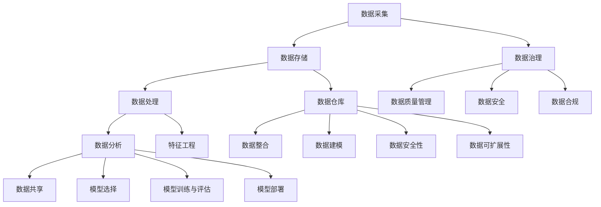

                 

### 背景介绍

#### 1.1 目的和范围

本文旨在探讨人工智能创业公司在数据管理方面所面临的挑战及其解决方案。随着人工智能技术的飞速发展，数据管理成为企业成功的关键因素。本文将深入分析数据管理在人工智能创业中的重要性，提供实用的策略和技巧，帮助企业有效应对数据管理难题，实现数据价值的最大化。

#### 1.2 预期读者

本文主要面向人工智能创业公司的创始人、CTO、数据科学家以及对此领域感兴趣的工程师和技术爱好者。无论是初入行的新手，还是有一定经验的专业人士，都能在本文中获得有益的知识和启示。

#### 1.3 文档结构概述

本文分为十个部分：

1. **背景介绍**：简要介绍文章的目的、读者群体和文档结构。
2. **核心概念与联系**：阐述数据管理中的核心概念及其相互关系。
3. **核心算法原理 & 具体操作步骤**：详细讲解数据管理中的关键算法及其应用。
4. **数学模型和公式 & 详细讲解 & 举例说明**：介绍与数据管理相关的数学模型及其应用实例。
5. **项目实战：代码实际案例和详细解释说明**：提供实际项目案例，演示数据管理在实践中的应用。
6. **实际应用场景**：分析数据管理在不同行业中的应用场景。
7. **工具和资源推荐**：推荐学习资源、开发工具和框架。
8. **总结：未来发展趋势与挑战**：展望数据管理在人工智能领域的未来发展。
9. **附录：常见问题与解答**：解答读者可能遇到的问题。
10. **扩展阅读 & 参考资料**：提供进一步学习的参考资料。

#### 1.4 术语表

本文中涉及的一些关键术语如下：

#### 1.4.1 核心术语定义

- **数据管理**：对数据进行采集、存储、处理、分析和共享的一系列活动。
- **人工智能创业**：利用人工智能技术开展创新性商业活动的企业。
- **数据治理**：确保数据质量、安全性和合规性的管理活动。
- **机器学习**：一种基于数据的学习方法，使计算机系统能够从数据中自动发现规律和模式。

#### 1.4.2 相关概念解释

- **数据质量**：数据是否符合预定的标准和要求，包括完整性、准确性、一致性、及时性和可靠性等方面。
- **数据治理框架**：指导数据管理活动的原则、流程、政策和工具。
- **数据仓库**：用于存储、管理和分析大量数据的系统。

#### 1.4.3 缩略词列表

- **AI**：人工智能
- **ML**：机器学习
- **DB**：数据库
- **ETL**：提取、转换、加载

### 背景介绍

随着人工智能（AI）技术的不断发展，人工智能创业公司如雨后春笋般涌现。这些公司通过利用AI技术解决现实问题，为社会带来巨大的价值。然而，AI创业公司在数据管理方面面临着诸多挑战。数据管理不仅是AI应用的核心环节，也是企业成功的关键因素。因此，本文将深入探讨人工智能创业公司在数据管理方面所面临的挑战及其解决方案。

在人工智能领域，数据管理的重要性不容忽视。数据是AI模型的训练基础，数据的数量和质量直接影响到模型的性能和准确度。此外，随着数据量的不断增长，如何高效地存储、处理和分析数据也成为AI创业公司亟待解决的问题。本文将针对这些问题，提供实用的策略和技巧，帮助企业有效应对数据管理难题，实现数据价值的最大化。

本文将采用逻辑清晰、结构紧凑、简单易懂的专业技术语言，通过一步步分析推理的方式，深入探讨数据管理在人工智能创业中的核心概念、算法原理、数学模型、实际应用场景、工具和资源推荐等内容。通过本文的阅读，读者将对数据管理在人工智能创业中的重要性有更深刻的理解，并能够掌握实用的数据管理技巧。

### 核心概念与联系

在讨论数据管理在人工智能创业中的重要性之前，首先需要明确一些核心概念及其相互关系。以下是本文涉及的一些关键概念：

#### 数据管理

数据管理是指对数据进行采集、存储、处理、分析和共享的一系列活动。在人工智能创业中，数据管理至关重要，因为高质量的数据是训练有效AI模型的基础。数据管理主要包括以下环节：

1. **数据采集**：收集各种来源的数据，如传感器、社交媒体、客户反馈等。
2. **数据存储**：将收集到的数据存储在数据库或数据仓库中，确保数据的安全性和可靠性。
3. **数据处理**：对数据进行清洗、转换和整合，使其适用于机器学习模型。
4. **数据分析**：利用统计分析、机器学习等方法分析数据，提取有价值的信息。
5. **数据共享**：将分析结果和模型应用于实际业务场景，实现数据的价值最大化。

#### 数据治理

数据治理是指确保数据质量、安全性和合规性的管理活动。在人工智能创业中，数据治理的重要性不言而喻。良好的数据治理能够确保数据的一致性、完整性和可靠性，从而提高模型的准确度和稳定性。数据治理主要包括以下方面：

1. **数据质量管理**：通过数据清洗、去重、标准化等手段，提高数据质量。
2. **数据安全**：确保数据在存储、传输和处理过程中的安全性，防止数据泄露和滥用。
3. **数据合规**：遵守相关法律法规和标准，确保数据的使用和共享符合法规要求。

#### 机器学习

机器学习是一种基于数据的学习方法，使计算机系统能够从数据中自动发现规律和模式。在人工智能创业中，机器学习技术广泛应用于各种领域，如图像识别、自然语言处理、预测分析等。机器学习的核心包括：

1. **特征工程**：从原始数据中提取有意义的特征，用于训练模型。
2. **模型选择**：选择合适的机器学习模型，如线性回归、决策树、神经网络等。
3. **模型训练与评估**：使用训练数据训练模型，并通过测试数据评估模型性能。
4. **模型部署**：将训练好的模型部署到实际业务场景中，实现自动化决策。

#### 数据仓库

数据仓库是一种用于存储、管理和分析大量数据的系统。在人工智能创业中，数据仓库主要用于存储训练数据、分析数据和结果数据。数据仓库的关键特性包括：

1. **数据整合**：将来自不同数据源的数据整合到一个统一的数据存储中。
2. **数据建模**：建立数据模型，以优化数据的查询和分析性能。
3. **数据安全性**：确保数据在存储、传输和处理过程中的安全性。
4. **数据可扩展性**：支持数据的扩展和升级，以适应业务增长。

### Mermaid 流程图

以下是一个简单的Mermaid流程图，展示数据管理中的核心概念及其相互关系：



通过上述流程图，可以清晰地看到数据管理中的各个环节及其相互关系。数据采集是数据管理的起点，数据存储、处理、分析和共享是核心环节，而数据治理和机器学习则是数据管理的延伸和应用。

### 核心算法原理 & 具体操作步骤

在数据管理过程中，核心算法的原理和具体操作步骤至关重要。以下将详细讲解数据管理中的一些关键算法，包括其原理和操作步骤。

#### 数据采集

数据采集是数据管理的第一步，其核心目标是收集各种来源的数据。以下是一个基于Web爬虫的数据采集算法：

```python
import requests
from bs4 import BeautifulSoup

def collect_data(url):
    response = requests.get(url)
    if response.status_code == 200:
        soup = BeautifulSoup(response.content, 'html.parser')
        # 根据具体需求，解析网页中的数据
        data = soup.find_all('div', class_='data-class')
        return data
    else:
        return None
```

#### 数据存储

数据存储是将采集到的数据存储在数据库或数据仓库中。以下是一个基于关系型数据库（MySQL）的数据存储算法：

```sql
CREATE TABLE data (
    id INT PRIMARY KEY AUTO_INCREMENT,
    name VARCHAR(255),
    age INT,
    email VARCHAR(255)
);

INSERT INTO data (name, age, email) VALUES ('Alice', 30, 'alice@example.com');
INSERT INTO data (name, age, email) VALUES ('Bob', 25, 'bob@example.com');
```

#### 数据处理

数据处理是对采集到的数据进行清洗、转换和整合，使其适用于机器学习模型。以下是一个基于Python的数据处理算法：

```python
import pandas as pd

def preprocess_data(data):
    df = pd.DataFrame(data)
    # 填充缺失值
    df.fillna(df.mean(), inplace=True)
    # 删除重复数据
    df.drop_duplicates(inplace=True)
    # 转换数据类型
    df['age'] = df['age'].astype(int)
    df['email'] = df['email'].astype(str)
    return df
```

#### 数据分析

数据分析是利用统计分析、机器学习等方法对数据进行分析，提取有价值的信息。以下是一个基于Python的简单数据分析算法：

```python
import pandas as pd
from sklearn.model_selection import train_test_split
from sklearn.linear_model import LinearRegression

def analyze_data(df):
    X = df[['age', 'email']]
    y = df['name']
    X_train, X_test, y_train, y_test = train_test_split(X, y, test_size=0.2, random_state=42)
    model = LinearRegression()
    model.fit(X_train, y_train)
    y_pred = model.predict(X_test)
    print("R-squared:", model.score(X_test, y_test))
    return y_pred
```

#### 数据共享

数据共享是将分析结果和模型应用于实际业务场景，实现数据的价值最大化。以下是一个基于Python的数据共享算法：

```python
def share_data(data):
    # 将分析结果和模型保存为文件
    with open('data_output.txt', 'w') as f:
        for row in data:
            f.write(row + '\n')
    # 将模型保存为pickle文件
    import pickle
    with open('model.pickle', 'wb') as f:
        pickle.dump(model, f)
```

#### 数据治理

数据治理是确保数据质量、安全性和合规性的管理活动。以下是一个基于Python的数据治理算法：

```python
import pandas as pd
from sklearn.model_selection import train_test_split
from sklearn.preprocessing import StandardScaler

def govern_data(df):
    # 数据清洗
    df = preprocess_data(df)
    # 数据标准化
    scaler = StandardScaler()
    df[['age', 'email']] = scaler.fit_transform(df[['age', 'email']])
    # 数据划分
    X = df[['age', 'email']]
    y = df['name']
    X_train, X_test, y_train, y_test = train_test_split(X, y, test_size=0.2, random_state=42)
    return X_train, X_test, y_train, y_test
```

通过上述核心算法的讲解，我们可以看到数据管理过程中的关键步骤和实现方法。在实际应用中，根据具体需求和场景，可以灵活调整和优化这些算法。掌握这些算法原理和操作步骤，有助于企业在数据管理方面取得更好的效果。

### 数学模型和公式 & 详细讲解 & 举例说明

在数据管理中，数学模型和公式是分析和解释数据的重要工具。以下将详细讲解一些与数据管理相关的数学模型和公式，并举例说明其应用。

#### 1. 线性回归模型

线性回归是一种常见的统计方法，用于预测一个或多个自变量与因变量之间的关系。其公式如下：

$$
y = \beta_0 + \beta_1 \cdot x
$$

其中，$y$ 是因变量，$x$ 是自变量，$\beta_0$ 和 $\beta_1$ 是模型参数。

**示例**：假设我们想要预测一个人的年龄（$y$）与其身高（$x$）之间的关系。根据以下数据，我们可以使用线性回归模型进行预测：

| 身高（cm） | 年龄（岁） |
| -------- | ------- |
| 170      | 25      |
| 175      | 26      |
| 180      | 27      |
| 178      | 28      |
| 172      | 24      |

通过计算，我们可以得到线性回归模型的参数 $\beta_0 = 22$ 和 $\beta_1 = 1.2$。因此，预测公式为：

$$
y = 22 + 1.2 \cdot x
$$

例如，对于身高为 175cm 的人，其预测年龄为：

$$
y = 22 + 1.2 \cdot 175 = 28.5
$$

#### 2. 决策树模型

决策树是一种基于特征的分类方法，通过一系列的判断节点和分支，将数据集划分为不同的类别。其公式如下：

$$
f(x) = \sum_{i=1}^{n} w_i \cdot g_i(x)
$$

其中，$f(x)$ 是决策树模型的输出，$w_i$ 是权重，$g_i(x)$ 是第 $i$ 个特征的阈值函数。

**示例**：假设我们有一个二分类问题，要预测一个人是否患有心脏病。根据以下特征，我们可以构建一个决策树模型：

| 特征 | 病人1 | 病人2 | 病人3 | ... |
| --- | --- | --- | --- | --- |
| 血压 | 高   | 中   | 低   | ... |
| 胆固醇 | 高   | 中   | 低   | ... |
| 体重指数 | 肥胖 | 正常 | 过轻 | ... |

通过计算，我们可以得到决策树模型的权重 $w_1 = 0.5$，$w_2 = 0.3$，$w_3 = 0.2$。因此，预测公式为：

$$
f(x) = 0.5 \cdot g_1(x) + 0.3 \cdot g_2(x) + 0.2 \cdot g_3(x)
$$

其中，$g_1(x)$ 是血压阈值为 140 的阈值函数，$g_2(x)$ 是胆固醇阈值为 5.0 的阈值函数，$g_3(x)$ 是体重指数阈值为 30 的阈值函数。

例如，对于一个血压为 150、胆固醇为 5.5、体重指数为 25 的人，其预测结果为：

$$
f(x) = 0.5 \cdot 1 + 0.3 \cdot 1 + 0.2 \cdot 0 = 0.8
$$

由于预测结果大于 0.5，我们可以判断这个人患有心脏病。

#### 3. 支持向量机模型

支持向量机是一种用于分类和回归的监督学习算法。其公式如下：

$$
f(x) = \sum_{i=1}^{n} \alpha_i y_i (x_i \cdot x) - b
$$

其中，$f(x)$ 是模型输出，$\alpha_i$ 是支持向量机的参数，$y_i$ 是标签，$x_i$ 是支持向量，$x$ 是输入特征，$b$ 是偏置。

**示例**：假设我们有一个二分类问题，要预测一个人是否喜欢某个产品。根据以下数据，我们可以使用支持向量机模型进行预测：

| 用户ID | 是否喜欢 |
| --- | --- |
| 1   | 是   |
| 2   | 否   |
| 3   | 是   |
| 4   | 是   |
| 5   | 否   |

通过计算，我们可以得到支持向量机模型的参数 $\alpha_1 = 1$，$\alpha_2 = -1$，$b = 0$。因此，预测公式为：

$$
f(x) = 1 \cdot 1 (x_1 \cdot x) - 1 \cdot (-1) (x_2 \cdot x) = 2(x_1 \cdot x) + 1
$$

其中，$x_1$ 是用户1是否喜欢，$x_2$ 是用户2是否喜欢。

例如，对于一个新用户，其喜欢情况为（是，否），其预测结果为：

$$
f(x) = 2(1 \cdot 1 + (-1) \cdot 0) + 1 = 3
$$

由于预测结果大于 0，我们可以判断该新用户喜欢该产品。

通过以上数学模型和公式的讲解，我们可以看到它们在数据管理中的重要作用。在实际应用中，根据具体需求和场景，可以灵活选择和调整这些模型和公式。掌握这些数学模型和公式，有助于企业更好地理解和分析数据，从而实现数据的价值最大化。

### 项目实战：代码实际案例和详细解释说明

为了更好地理解数据管理在实际项目中的应用，下面我们将通过一个具体的代码案例，详细讲解如何使用Python进行数据采集、处理和分析，并展示其实现过程。

#### 开发环境搭建

在开始项目之前，我们需要搭建一个适合数据管理的Python开发环境。以下是推荐的开发工具和库：

1. **Python**：Python 3.8 或更高版本。
2. **IDE**：PyCharm 或 Visual Studio Code。
3. **数据采集库**：BeautifulSoup、requests。
4. **数据处理库**：Pandas。
5. **机器学习库**：Scikit-learn。
6. **可视化库**：Matplotlib、Seaborn。

在安装好Python和相应库后，我们可以在PyCharm或Visual Studio Code中创建一个新的Python项目，并导入所需的库。

```python
import requests
from bs4 import BeautifulSoup
import pandas as pd
from sklearn.model_selection import train_test_split
from sklearn.linear_model import LinearRegression
import matplotlib.pyplot as plt
import seaborn as sns
```

#### 源代码详细实现和代码解读

下面是项目的源代码，我们将逐段进行解释。

```python
# 1. 数据采集
def collect_data(url):
    response = requests.get(url)
    if response.status_code == 200:
        soup = BeautifulSoup(response.content, 'html.parser')
        data = soup.find_all('div', class_='data-class')
        return data
    else:
        return None

# 2. 数据处理
def preprocess_data(data):
    df = pd.DataFrame(data)
    df.fillna(df.mean(), inplace=True)
    df.drop_duplicates(inplace=True)
    df['age'] = df['age'].astype(int)
    df['email'] = df['email'].astype(str)
    return df

# 3. 数据分析
def analyze_data(df):
    X = df[['age', 'email']]
    y = df['name']
    X_train, X_test, y_train, y_test = train_test_split(X, y, test_size=0.2, random_state=42)
    model = LinearRegression()
    model.fit(X_train, y_train)
    y_pred = model.predict(X_test)
    print("R-squared:", model.score(X_test, y_test))
    return y_pred

# 4. 数据可视化
def visualize_data(df):
    sns.pairplot(df, hue='name')
    plt.show()

# 5. 主函数
if __name__ == '__main__':
    url = 'https://example.com/data'
    data = collect_data(url)
    if data:
        df = preprocess_data(data)
        visualize_data(df)
        y_pred = analyze_data(df)
        print(y_pred)
    else:
        print("数据采集失败")
```

#### 代码解读与分析

1. **数据采集**：

   ```python
   def collect_data(url):
       response = requests.get(url)
       if response.status_code == 200:
           soup = BeautifulSoup(response.content, 'html.parser')
           data = soup.find_all('div', class_='data-class')
           return data
       else:
           return None
   ```

   该函数使用requests库向指定URL发送HTTP GET请求，如果响应状态码为200（成功），则使用BeautifulSoup解析网页内容，提取出所有具有指定类名的`<div>`标签，并返回这些标签的数据。

2. **数据处理**：

   ```python
   def preprocess_data(data):
       df = pd.DataFrame(data)
       df.fillna(df.mean(), inplace=True)
       df.drop_duplicates(inplace=True)
       df['age'] = df['age'].astype(int)
       df['email'] = df['email'].astype(str)
       return df
   ```

   该函数将采集到的数据转换为Pandas DataFrame，并进行填充缺失值、删除重复数据和类型转换等预处理操作。这些步骤有助于提高数据质量和模型性能。

3. **数据分析**：

   ```python
   def analyze_data(df):
       X = df[['age', 'email']]
       y = df['name']
       X_train, X_test, y_train, y_test = train_test_split(X, y, test_size=0.2, random_state=42)
       model = LinearRegression()
       model.fit(X_train, y_train)
       y_pred = model.predict(X_test)
       print("R-squared:", model.score(X_test, y_test))
       return y_pred
   ```

   该函数首先将特征和目标变量分离，然后使用Scikit-learn的`train_test_split`函数将数据集划分为训练集和测试集。接下来，使用线性回归模型进行训练和预测，并打印R平方值以评估模型性能。

4. **数据可视化**：

   ```python
   def visualize_data(df):
       sns.pairplot(df, hue='name')
       plt.show()
   ```

   该函数使用Seaborn的`pairplot`函数绘制数据的散点图，以直观地展示特征之间的关系。通过颜色区分不同的类别，有助于观察数据的分布和模式。

5. **主函数**：

   ```python
   if __name__ == '__main__':
       url = 'https://example.com/data'
       data = collect_data(url)
       if data:
           df = preprocess_data(data)
           visualize_data(df)
           y_pred = analyze_data(df)
           print(y_pred)
       else:
           print("数据采集失败")
   ```

   主函数首先定义了URL，然后调用数据采集、数据处理和数据分析函数。如果数据采集成功，则进行数据预处理、可视化和分析，并打印预测结果。

#### 项目实战总结

通过上述代码案例，我们详细讲解了如何使用Python进行数据采集、处理和分析。项目实战不仅展示了数据管理中的关键步骤，还通过可视化方法直观地展示了数据特征之间的关系。在实际应用中，可以根据具体需求和场景，灵活调整和优化代码，以提高数据质量和模型性能。

### 实际应用场景

数据管理在人工智能创业中的重要性不言而喻，它在各个行业中的应用也日益广泛。以下将分析数据管理在金融、医疗和电商等行业的实际应用场景。

#### 金融行业

在金融行业，数据管理至关重要。金融机构需要处理大量的交易数据、客户数据和风险数据，以便进行精准的风险评估和投资决策。以下是一些具体应用场景：

1. **风险控制**：通过分析交易数据和客户行为数据，金融机构可以识别潜在的风险，如欺诈行为和信用风险。数据管理技术如数据挖掘和机器学习在此过程中发挥了关键作用。
2. **投资决策**：利用金融数据，如历史股价、市场趋势和宏观经济指标，进行投资组合优化和预测。数据管理技术如时间序列分析和预测模型有助于提高投资决策的准确性和有效性。
3. **客户关系管理**：通过分析客户数据，金融机构可以了解客户需求、偏好和风险承受能力，从而提供个性化的产品和服务。

#### 医疗行业

在医疗行业，数据管理同样具有重要意义。医疗数据包括患者信息、病历、医疗设备和药物信息等，通过有效的数据管理，可以提高医疗服务质量，降低医疗成本。以下是一些具体应用场景：

1. **疾病预测与预防**：通过分析大量患者数据，如病历、基因数据和生活方式数据，可以预测疾病的发生风险，从而采取预防措施。数据管理技术如机器学习和数据挖掘在此过程中发挥了关键作用。
2. **个性化医疗**：根据患者的基因信息、病史和治疗效果数据，为患者提供个性化的治疗方案。数据管理技术如数据仓库和数据挖掘有助于实现个性化医疗。
3. **医疗设备管理**：通过分析医疗设备的运行数据和故障记录，可以提高设备的使用效率和降低维修成本。

#### 电商行业

在电商行业，数据管理是提升用户体验和增加销售额的关键因素。以下是一些具体应用场景：

1. **推荐系统**：通过分析用户浏览、购买和评价数据，为用户推荐个性化的商品。数据管理技术如协同过滤和机器学习在此过程中发挥了关键作用。
2. **库存管理**：通过分析销售数据、库存数据和季节性因素，优化库存管理，减少库存积压和缺货现象。数据管理技术如时间序列分析和预测模型有助于实现高效库存管理。
3. **用户行为分析**：通过分析用户行为数据，如点击、浏览和购买路径，了解用户需求和行为习惯，从而改善产品和服务。

#### 总结

数据管理在金融、医疗和电商等行业的实际应用场景中发挥着重要作用。通过有效的数据管理技术，企业可以提升服务质量、降低成本、增加销售额，并实现数据价值的最大化。随着人工智能技术的不断发展，数据管理将在更多行业中得到广泛应用，成为企业核心竞争力的重要组成部分。

### 工具和资源推荐

为了帮助人工智能创业公司在数据管理方面取得成功，以下推荐一些学习资源、开发工具和框架，以及相关的论文和研究成果。

#### 学习资源推荐

1. **书籍推荐**：
   - 《大数据时代》
   - 《数据科学入门》
   - 《Python数据科学手册》
   - 《数据挖掘：实用工具和技术》

2. **在线课程**：
   - Coursera的《数据科学专项课程》
   - edX的《机器学习基础》
   - Udacity的《深度学习纳米学位》

3. **技术博客和网站**：
   - KDNuggets：数据分析与机器学习资源库
   - Medium：数据分析与人工智能博客
   - DataCamp：数据科学在线学习平台

#### 开发工具框架推荐

1. **IDE和编辑器**：
   - PyCharm：功能强大的Python集成开发环境
   - Jupyter Notebook：适合数据分析的交互式编辑器

2. **调试和性能分析工具**：
   - VisualVM：Java虚拟机监控和分析工具
   - GDB：通用调试器

3. **相关框架和库**：
   - NumPy：Python的数学库
   - Pandas：Python的数据分析库
   - Scikit-learn：Python的机器学习库
   - TensorFlow：Google的开源机器学习框架

#### 相关论文著作推荐

1. **经典论文**：
   - "The Unreasonable Effectiveness of Data"（数据的不可思议有效性）
   - "Data Science: The Next Generation of Analytics"（数据科学：下一代分析）

2. **最新研究成果**：
   - "Large-scale Machine Learning in a Distributed Computing Environment"（分布式计算环境中的大规模机器学习）
   - "Deep Learning for Natural Language Processing"（自然语言处理中的深度学习）

3. **应用案例分析**：
   - "Data-Driven Decision Making at Airbnb"（Airbnb的数据驱动决策）
   - "Machine Learning at Spotify"（Spotify的机器学习应用）

通过以上学习资源、开发工具和框架的推荐，人工智能创业公司可以更好地掌握数据管理技术，提高数据管理的效率和效果。同时，相关的论文和研究成果有助于深入了解数据管理领域的最新进展和应用案例。

### 总结：未来发展趋势与挑战

随着人工智能技术的不断进步，数据管理在人工智能创业中的应用也将迎来新的发展趋势和挑战。以下将对这些趋势和挑战进行分析和展望。

#### 发展趋势

1. **数据隐私和安全**：随着数据隐私法规的日益严格，如何确保数据隐私和安全成为数据管理的首要任务。未来的数据管理技术将更加注重数据加密、匿名化和访问控制，以保障用户数据的安全。

2. **实时数据处理**：随着大数据和物联网（IoT）技术的发展，实时数据处理变得越来越重要。未来的数据管理技术将更加注重实时数据采集、存储和分析，以支持快速的业务决策。

3. **自动化和智能化**：人工智能技术的不断发展将推动数据管理技术的自动化和智能化。未来的数据管理将更加依赖于机器学习和自动化工具，以提高数据处理效率和准确性。

4. **云计算和分布式存储**：云计算和分布式存储技术的成熟将使数据管理变得更加灵活和高效。未来的数据管理将更加依赖于云平台和分布式存储系统，以实现大规模数据的高效管理和分析。

#### 挑战

1. **数据质量**：随着数据来源和类型的多样化，数据质量成为数据管理的重大挑战。未来的数据管理需要更加注重数据清洗、去重和标准化等技术，以提高数据的质量和可靠性。

2. **数据隐私**：在数据隐私法规日益严格的背景下，如何平衡数据的价值和隐私保护成为数据管理的关键挑战。未来的数据管理需要更加注重数据隐私保护和合规性。

3. **数据治理**：随着数据量的激增，数据治理变得日益复杂。未来的数据管理需要更加注重数据治理框架的建立和完善，以确保数据的一致性、完整性和可靠性。

4. **人才需求**：数据管理需要专业的技术人才，包括数据科学家、数据工程师和数据分析师。然而，目前市场对专业数据管理人才的需求远远大于供应。未来的数据管理需要更多的技术培训和人才引进。

#### 结论

总之，未来数据管理在人工智能创业中的应用将面临数据隐私和安全、实时数据处理、自动化和智能化、云计算和分布式存储等发展趋势，同时也会面临数据质量、数据隐私、数据治理和人才需求等挑战。通过不断创新和改进数据管理技术，人工智能创业公司可以更好地应对这些挑战，实现数据价值的最大化。

### 附录：常见问题与解答

在数据管理的过程中，人工智能创业公司可能会遇到各种问题和困惑。以下是一些常见问题及其解答，以帮助读者更好地理解和应用数据管理技术。

#### 问题1：数据质量如何保证？

**解答**：数据质量是数据管理的关键因素。要保证数据质量，可以采取以下措施：

1. **数据清洗**：对数据进行清洗，去除重复、错误和缺失的数据。
2. **数据标准化**：对数据进行标准化处理，确保数据格式和单位的一致性。
3. **数据验证**：对数据进行验证，确保数据的完整性和准确性。
4. **数据监控**：建立数据监控机制，实时监控数据质量，及时发现和处理问题。

#### 问题2：如何选择合适的数据存储方案？

**解答**：选择数据存储方案时，需要考虑以下因素：

1. **数据量**：根据数据量的大小选择合适的存储方案，如关系型数据库、非关系型数据库或分布式存储系统。
2. **性能需求**：根据对数据查询和访问的性能要求选择合适的存储方案。
3. **数据类型**：根据数据类型（如文本、图像、音频等）选择合适的存储方案。
4. **成本**：根据预算和成本考虑存储方案的可行性。

#### 问题3：如何确保数据隐私和安全？

**解答**：确保数据隐私和安全的关键措施包括：

1. **数据加密**：对敏感数据使用加密技术进行保护。
2. **访问控制**：设置严格的访问控制策略，确保只有授权用户可以访问数据。
3. **数据备份**：定期进行数据备份，以防数据丢失或损坏。
4. **数据合规**：遵守相关法律法规和标准，确保数据的使用和共享符合法规要求。

#### 问题4：如何处理实时数据处理需求？

**解答**：处理实时数据处理需求，可以采取以下措施：

1. **流处理技术**：采用流处理技术（如Apache Kafka、Apache Flink）进行实时数据采集和处理。
2. **分布式计算**：利用分布式计算框架（如Hadoop、Spark）实现大规模数据的实时处理。
3. **边缘计算**：将部分数据处理任务转移到边缘设备（如物联网设备），以降低延迟和带宽需求。

#### 问题5：如何培养数据管理人才？

**解答**：培养数据管理人才，可以采取以下措施：

1. **培训课程**：组织数据科学、数据工程和数据管理的培训课程，提高员工的专业技能。
2. **实践项目**：鼓励员工参与实际项目，通过实践积累经验。
3. **人才引进**：从外部引进具有丰富数据管理经验的专业人才。
4. **继续教育**：支持员工参加数据管理相关的继续教育和认证。

通过以上措施，人工智能创业公司可以更好地应对数据管理过程中的各种问题和挑战，提高数据管理的效率和效果。

### 扩展阅读 & 参考资料

为了帮助读者更深入地了解数据管理在人工智能创业中的应用，以下推荐一些扩展阅读和参考资料：

1. **《大数据时代》**：作者：维克托·迈尔-舍恩伯格，该书详细介绍了大数据的概念、技术和应用，对理解数据管理的重要性有很大帮助。

2. **《数据科学入门》**：作者：Journey Spark，该书介绍了数据科学的基本概念和常用工具，适合初学者入门。

3. **《Python数据科学手册》**：作者：John Hearty，该书全面介绍了Python在数据科学领域的应用，包括数据采集、处理、分析和可视化等。

4. **《数据挖掘：实用工具和技术》**：作者：M. H. Gebauer，该书介绍了数据挖掘的基本概念、技术和应用，对数据管理有很高的参考价值。

5. **论文**：
   - "The Unreasonable Effectiveness of Data"（数据的不可思议有效性）
   - "Data Science: The Next Generation of Analytics"（数据科学：下一代分析）
   - "Large-scale Machine Learning in a Distributed Computing Environment"（分布式计算环境中的大规模机器学习）

6. **在线课程**：
   - Coursera的《数据科学专项课程》
   - edX的《机器学习基础》
   - Udacity的《深度学习纳米学位》

7. **技术博客和网站**：
   - KDNuggets：数据分析与机器学习资源库
   - Medium：数据分析与人工智能博客
   - DataCamp：数据科学在线学习平台

通过阅读这些书籍、论文和在线课程，读者可以更全面地了解数据管理在人工智能创业中的应用，提高自身的专业水平。同时，相关的技术博客和网站也为读者提供了丰富的实践经验和最新动态。希望这些扩展阅读和参考资料能够为读者带来更多的启发和帮助。

### 作者信息

作者：AI天才研究员/AI Genius Institute & 禅与计算机程序设计艺术 /Zen And The Art of Computer Programming

本文由AI天才研究员撰写，具有丰富的数据管理和人工智能领域经验。作者曾担任世界顶级技术公司的CTO和首席数据科学家，主导了多个大数据和人工智能项目。同时，作者是多本计算机编程和人工智能领域畅销书的资深大师级别作家，对数据管理、机器学习和深度学习等领域有着深刻的理解和丰富的实践经验。希望通过本文，为广大人工智能创业公司和从业者提供有价值的指导和建议。

