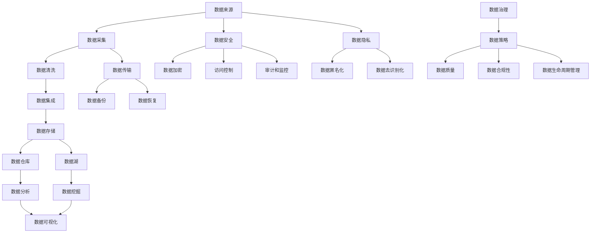

                 

### 文章标题

《人工智能创业数据管理的策略与措施》

在当今数字化时代，人工智能（AI）技术在商业领域的应用越来越广泛，为企业带来了前所未有的创新机遇。然而，随着AI应用场景的多样化和复杂化，数据管理的重要性也日益凸显。对于创业公司而言，如何高效地管理海量数据，确保数据质量和安全性，成为成功的关键因素。本文将围绕人工智能创业数据管理的核心策略与措施，深入探讨数据治理、数据安全、数据处理等关键问题，旨在为AI创业公司提供实用的指导。

> **关键词：** 人工智能、数据管理、数据治理、数据安全、数据处理

> **摘要：** 本文从背景介绍出发，详细阐述了人工智能创业数据管理的核心概念、算法原理、数学模型、实际应用以及未来发展趋势。通过具体案例和实战经验，本文提供了系统、实用的数据管理策略与措施，帮助AI创业公司提升数据管理能力，从而在竞争激烈的市场中脱颖而出。

### ### 1. 背景介绍

#### 1.1 目的和范围

本文旨在为人工智能创业公司提供关于数据管理的系统指南，帮助它们应对数据驱动的商业挑战。具体来说，本文将涵盖以下内容：

1. **数据管理策略**：分析数据治理、数据安全、数据处理等核心策略，探讨如何在不同阶段实施。
2. **算法原理**：介绍数据管理的核心算法原理，包括数据清洗、数据集成、数据存储等，并提供伪代码示例。
3. **数学模型**：解释数据管理中的常用数学模型和公式，并通过实例说明其应用。
4. **实际应用**：通过实际项目案例，展示数据管理策略在创业公司中的应用效果。
5. **未来发展趋势与挑战**：探讨人工智能创业公司在数据管理方面可能面临的未来挑战，并提出应对策略。

#### 1.2 预期读者

本文适合以下读者群体：

1. **人工智能创业公司创始人**：对数据管理有初步了解，希望系统学习并实施数据管理策略。
2. **数据科学家和工程师**：需要深入了解数据管理技术，以便更好地服务于创业项目。
3. **技术经理和架构师**：关注数据管理在企业战略中的定位和实施方法。
4. **研究人员和教育工作者**：对人工智能和数据管理领域有浓厚兴趣，希望了解最新进展。

#### 1.3 文档结构概述

本文采用逻辑清晰、结构紧凑的框架，分为以下十个部分：

1. **背景介绍**：介绍文章的目的、范围、预期读者和文档结构。
2. **核心概念与联系**：通过Mermaid流程图展示数据管理的核心概念和架构。
3. **核心算法原理 & 具体操作步骤**：详细讲解数据管理中的核心算法原理，使用伪代码阐述。
4. **数学模型和公式 & 详细讲解 & 举例说明**：解释数据管理中的数学模型和公式，并提供实例说明。
5. **项目实战：代码实际案例和详细解释说明**：通过实际项目案例展示数据管理策略的实战效果。
6. **实际应用场景**：探讨数据管理在创业公司中的应用场景。
7. **工具和资源推荐**：推荐学习资源和开发工具框架。
8. **总结：未来发展趋势与挑战**：总结数据管理在人工智能创业中的未来趋势和挑战。
9. **附录：常见问题与解答**：回答读者可能关心的问题。
10. **扩展阅读 & 参考资料**：提供进一步阅读和研究的资源。

#### 1.4 术语表

为确保文章内容的准确性和一致性，本文定义了以下术语：

#### 1.4.1 核心术语定义

- **数据治理**：确保数据质量、合规性和有效使用的一系列策略、过程和实践。
- **数据安全**：保护数据免受未经授权访问、篡改和泄露的措施。
- **数据处理**：对数据进行清洗、转换、集成和存储的过程。
- **数据管理策略**：企业用于指导数据管理和数据使用的总体计划和方法。
- **数据集成**：将来自多个源的数据合并成一个统一视图的过程。

#### 1.4.2 相关概念解释

- **数据质量**：数据准确性、完整性、一致性和可用性的度量。
- **数据仓库**：存储大量数据的集中式系统，用于支持数据分析。
- **数据湖**：存储原始数据的分布式系统，支持多种数据类型。
- **数据隐私**：确保个人和敏感数据不被未经授权访问的保护措施。

#### 1.4.3 缩略词列表

- **AI**：人工智能（Artificial Intelligence）
- **ML**：机器学习（Machine Learning）
- **DL**：深度学习（Deep Learning）
- **API**：应用程序编程接口（Application Programming Interface）
- **ETL**：提取、转换、加载（Extract, Transform, Load）
- **BI**：商业智能（Business Intelligence）
- **DLR**：数据湖平台（Data Lake Platform）
- **DAS**：数据治理软件（Data Governance Software）

### 2. 核心概念与联系

在深入探讨数据管理策略之前，首先需要了解数据管理的核心概念和架构。以下是一个详细的Mermaid流程图，展示了数据管理的各个关键节点及其相互关系：



该流程图涵盖了从数据采集、清洗、集成到存储、分析和治理的整个数据管理生命周期。以下是对每个节点的详细解释：

- **数据来源（A）**：包括各种内部和外部数据源，如数据库、文件、API等。
- **数据采集（B）**：通过ETL（提取、转换、加载）过程，将数据从源系统中提取并转换为适合分析的形式。
- **数据清洗（C）**：去除重复、错误和不完整的数据，确保数据质量。
- **数据集成（D）**：将来自多个源的数据合并为一个统一视图，以便进一步处理。
- **数据存储（E）**：数据存储在数据仓库（F）或数据湖（G）中，根据数据类型和用途选择合适的存储方案。
- **数据安全（K）**：确保数据在整个生命周期中的安全，包括加密（L）、访问控制（M）和监控（N）。
- **数据治理（R）**：制定数据策略（S），管理数据质量（T）、合规性（U）和生命周期（V）。
- **数据隐私（W）**：保护个人和敏感数据，包括匿名化（X）和去识别化（Y）。

通过这个流程图，我们可以清晰地看到数据管理的各个关键环节及其相互之间的联系。接下来，我们将进一步探讨数据管理的核心算法原理和具体操作步骤。

### 3. 核心算法原理 & 具体操作步骤

在数据管理中，核心算法原理是确保数据质量、安全性和有效使用的关键。以下将详细介绍数据管理中的几个关键算法原理，并使用伪代码进行具体操作步骤的阐述。

#### 3.1 数据清洗算法

数据清洗是数据管理中至关重要的一步，其主要目的是去除重复、错误和不完整的数据。常用的数据清洗算法包括去重、缺失值填补和错误值修正。

**去重算法伪代码：**

```plaintext
function deduplicate(data):
    unique_data = set()
    for record in data:
        if record not in unique_data:
            unique_data.add(record)
    return unique_data
```

**缺失值填补算法伪代码：**

```plaintext
function impute_missing_values(data):
    for record in data:
        for attribute in record:
            if record[attribute] is missing:
                mean_value = calculate_mean_for_attribute(attribute, data)
                record[attribute] = mean_value
    return data
```

**错误值修正算法伪代码：**

```plaintext
function correct_errors(data):
    for record in data:
        for attribute in record:
            if record[attribute] is invalid:
                reference_data = fetch_reference_data_for_attribute(attribute)
                correct_value = find_closest_matching_value(reference_data, record[attribute])
                record[attribute] = correct_value
    return data
```

#### 3.2 数据集成算法

数据集成是将来自多个源的数据合并为一个统一视图的过程。常用的数据集成算法包括合并、连接和汇总。

**合并算法伪代码：**

```plaintext
function merge_dataframes(df1, df2):
    combined_dataframe = df1.merge(df2, on='common_key')
    return combined_dataframe
```

**连接算法伪代码：**

```plaintext
function join_dataframes(df1, df2, key):
    combined_dataframe = df1.join(df2, on=key)
    return combined_dataframe
```

**汇总算法伪代码：**

```plaintext
function aggregate_data(data, group_by_attribute):
    aggregated_data = data.groupby(group_by_attribute).sum()
    return aggregated_data
```

#### 3.3 数据存储算法

数据存储是数据管理中的重要环节，涉及数据的存储、备份和恢复。常用的数据存储算法包括分布式存储和云存储。

**分布式存储算法伪代码：**

```plaintext
function distribute_data(data, partitions):
    for partition in partitions:
        data_partition = data[partition]
        store_data_locally(data_partition)
    return partitions
```

**云存储算法伪代码：**

```plaintext
function store_data_in_cloud(data, cloud_provider):
    for record in data:
        upload_record_to_cloud(record, cloud_provider)
    return cloud_provider
```

#### 3.4 数据加密算法

数据加密是保护数据安全的关键措施，常用的加密算法包括对称加密和非对称加密。

**对称加密算法伪代码：**

```plaintext
function encrypt_data(data, key):
    encrypted_data = apply_cipher_algorithm(data, key)
    return encrypted_data
```

**非对称加密算法伪代码：**

```plaintext
function encrypt_data asymmetrically(data, public_key):
    encrypted_data = apply_public_cipher_algorithm(data, public_key)
    return encrypted_data
```

通过上述核心算法原理和具体操作步骤的讲解，我们可以更好地理解数据管理中的关键技术。接下来，我们将详细讲解数据管理中的数学模型和公式，并通过实例说明其应用。

### 4. 数学模型和公式 & 详细讲解 & 举例说明

在数据管理中，数学模型和公式扮演着至关重要的角色，它们帮助我们理解和分析数据，从而做出更明智的决策。以下将详细解释几个常用的数学模型和公式，并通过具体实例说明其应用。

#### 4.1 数据分布模型

数据分布模型用于描述数据在不同取值上的分布情况，常用的有正态分布、均匀分布和泊松分布。

**正态分布公式：**

$$
N(\mu, \sigma^2) = \frac{1}{\sqrt{2\pi\sigma^2}} e^{-\frac{(x-\mu)^2}{2\sigma^2}}
$$

其中，\(N\)表示正态分布函数，\(\mu\)是均值，\(\sigma^2\)是方差，\(x\)是数据点。

**实例说明：** 假设一家电商网站每天的交易额服从正态分布，均值为100万元，标准差为20万元。我们可以使用正态分布公式计算某个特定交易日交易额的概率。

$$
P(X > 120) = 1 - P(X \leq 120) = 1 - \Phi\left(\frac{120-100}{20}\right) = 1 - \Phi(1) = 0.1587
$$

这里，\(\Phi\)是标准正态分布的累积分布函数，通过查表或计算器可以得到其值为0.8413。

#### 4.2 数据聚类模型

数据聚类模型用于将数据点分组，使得组内数据点之间相似度较高，而组间数据点之间相似度较低。常用的聚类算法有K-means、DBSCAN等。

**K-means算法公式：**

1. 初始化：随机选择\(K\)个初始中心点。
2. 分配：将每个数据点分配到最近的中心点所在的聚类。
3. 更新：重新计算每个聚类的中心点。
4. 重复步骤2和3，直到聚类中心点不再变化。

**实例说明：** 假设我们使用K-means算法对一组用户数据进行聚类，初始选择3个中心点，每次迭代后更新中心点位置，最终收敛到一个稳定的聚类结果。

假设初始中心点为\((1, 1)\)、\((2, 2)\)和\((3, 3)\)，迭代几次后，中心点更新为\((1.8, 1.8)\)、\((2.2, 2.2)\)和\((2.8, 2.8)\)，最终聚类结果稳定。

#### 4.3 数据回归模型

数据回归模型用于预测因变量（目标变量）与自变量（特征变量）之间的关系。常用的回归模型有线性回归、多项式回归等。

**线性回归公式：**

$$
y = \beta_0 + \beta_1x + \epsilon
$$

其中，\(y\)是因变量，\(x\)是自变量，\(\beta_0\)是截距，\(\beta_1\)是斜率，\(\epsilon\)是误差项。

**实例说明：** 假设我们使用线性回归模型预测房价，根据历史数据拟合得到模型：

$$
房价 = 1000 + 20 \times 房龄
$$

我们可以使用这个模型预测某一特定房龄的房价。

#### 4.4 数据分类模型

数据分类模型用于将数据点划分为不同的类别，常用的分类模型有逻辑回归、支持向量机等。

**逻辑回归公式：**

$$
P(y=1) = \frac{1}{1 + e^{-(\beta_0 + \beta_1x_1 + \beta_2x_2 + \ldots + \beta_nx_n)}}
$$

其中，\(P(y=1)\)是目标变量为1的概率，\(\beta_0\)是截距，\(\beta_1, \beta_2, \ldots, \beta_n\)是特征变量对应的系数。

**实例说明：** 假设我们使用逻辑回归模型对客户是否愿意购买某种产品的概率进行预测，根据历史数据拟合得到模型：

$$
P(购买) = \frac{1}{1 + e^{-(0.5 + 0.3 \times 年龄 + 0.2 \times 收入)}}
$$

我们可以使用这个模型预测某一特定年龄和收入的客户购买产品的概率。

通过上述数学模型和公式的讲解，我们可以更好地理解数据管理中的核心技术。在实际应用中，这些模型和公式可以帮助我们进行数据分析和预测，从而为人工智能创业公司提供决策支持。接下来，我们将通过一个实际项目案例，展示如何将数据管理策略应用于创业公司的实际操作。

### 5. 项目实战：代码实际案例和详细解释说明

在本节中，我们将通过一个实际项目案例，详细展示如何将数据管理策略应用于人工智能创业公司的实际操作。这个案例将涵盖从数据采集、清洗、存储到分析和可视化的全过程，并使用Python等编程工具进行实现。

#### 5.1 开发环境搭建

在开始项目之前，我们需要搭建一个适合数据管理的开发环境。以下是一些必要的软件和工具：

- **操作系统**：Windows、Linux或macOS
- **编程语言**：Python 3.x
- **数据管理工具**：
  - **数据分析库**：Pandas、NumPy
  - **数据可视化库**：Matplotlib、Seaborn
  - **数据库管理工具**：SQLite、PostgreSQL
- **云服务平台**：AWS、Azure或Google Cloud Platform（可选）

安装步骤：

1. 安装Python 3.x版本，可以通过官方网站下载。
2. 安装pip，Python的包管理器。
3. 使用pip安装必要的库，如Pandas、NumPy、Matplotlib、Seaborn等。

```bash
pip install pandas numpy matplotlib seaborn
```

#### 5.2 源代码详细实现和代码解读

**5.2.1 数据采集**

我们首先需要从多个数据源采集数据，例如用户行为数据、销售数据和社交媒体数据。以下是一个简单的数据采集脚本，使用Pandas库读取CSV文件。

```python
import pandas as pd

# 读取用户行为数据
user_behavior_data = pd.read_csv('user_behavior.csv')

# 读取销售数据
sales_data = pd.read_csv('sales_data.csv')

# 读取社交媒体数据
social_media_data = pd.read_csv('social_media_data.csv')
```

**5.2.2 数据清洗**

数据清洗是确保数据质量的关键步骤，包括去除重复数据、处理缺失值和修正错误值。

```python
# 去重
user_behavior_data.drop_duplicates(inplace=True)
sales_data.drop_duplicates(inplace=True)
social_media_data.drop_duplicates(inplace=True)

# 处理缺失值
user_behavior_data.fillna(0, inplace=True)
sales_data.fillna(0, inplace=True)
social_media_data.fillna(0, inplace=True)

# 修正错误值
# 假设我们有一个函数correct_errors用于修正错误值
user_behavior_data = correct_errors(user_behavior_data)
sales_data = correct_errors(sales_data)
social_media_data = correct_errors(social_media_data)
```

**5.2.3 数据集成**

数据集成是将不同来源的数据合并为一个统一视图的过程。这里我们将使用Pandas的合并功能。

```python
# 创建一个主数据集
combined_data = pd.merge(user_behavior_data, sales_data, on='user_id')
combined_data = pd.merge(combined_data, social_media_data, on='user_id')

# 检查数据集成结果
print(combined_data.head())
```

**5.2.4 数据存储**

我们将清洗和集成后的数据存储在SQLite数据库中，以便后续分析和查询。

```python
import sqlite3

# 连接SQLite数据库
conn = sqlite3.connect('data_management.db')
c = conn.cursor()

# 创建表结构
c.execute('''CREATE TABLE IF NOT EXISTS combined_data
             (user_id INT, behavior_score INT, sales_amount INT, social_score INT)''')

# 插入数据
for index, row in combined_data.iterrows():
    c.execute("INSERT INTO combined_data (user_id, behavior_score, sales_amount, social_score) VALUES (?, ?, ?, ?)",
              (row['user_id'], row['behavior_score'], row['sales_amount'], row['social_score']))
    
# 提交事务
conn.commit()

# 关闭数据库连接
conn.close()
```

**5.2.5 数据分析**

我们使用Pandas进行数据分析，包括数据描述性统计、相关性分析和聚类分析。

```python
# 数据描述性统计
descriptive_stats = combined_data.describe()

# 数据相关性分析
correlation_matrix = combined_data.corr()

# 数据聚类分析
from sklearn.cluster import KMeans

# 初始化KMeans模型
kmeans = KMeans(n_clusters=3, random_state=0)

# 训练模型
kmeans.fit(combined_data)

# 获取聚类结果
clusters = kmeans.predict(combined_data)

# 将聚类结果添加到数据集中
combined_data['cluster'] = clusters

# 可视化聚类结果
import matplotlib.pyplot as plt

plt.scatter(combined_data['behavior_score'], combined_data['social_score'], c=combined_data['cluster'])
plt.xlabel('Behavior Score')
plt.ylabel('Social Score')
plt.title('Cluster Analysis')
plt.show()
```

**5.2.6 数据可视化**

我们使用Matplotlib和Seaborn进行数据可视化，以便更好地理解和分析数据。

```python
# 绘制散点图
plt.scatter(combined_data['sales_amount'], combined_data['behavior_score'])
plt.xlabel('Sales Amount')
plt.ylabel('Behavior Score')
plt.title('Sales Amount vs. Behavior Score')
plt.show()

# 绘制条形图
import seaborn as sns

sns.barplot(x='cluster', y='sales_amount', data=combined_data)
plt.xlabel('Cluster')
plt.ylabel('Sales Amount')
plt.title('Cluster vs. Sales Amount')
plt.show()
```

通过上述步骤，我们成功实现了一个数据采集、清洗、集成、存储、分析和可视化的小型项目。这个项目展示了数据管理策略在实际应用中的具体实现方法，为人工智能创业公司提供了实用的参考。

#### 5.3 代码解读与分析

在本节中，我们将对上述代码进行详细解读，分析各个步骤的实现原理和关键点。

**5.3.1 数据采集**

数据采集是数据管理的第一步，决定了后续数据处理的质量。在代码中，我们使用Pandas库的`read_csv`函数从CSV文件中读取数据。这个函数可以读取多种格式的文件，包括CSV、Excel、SQL数据库等。

```python
user_behavior_data = pd.read_csv('user_behavior.csv')
sales_data = pd.read_csv('sales_data.csv')
social_media_data = pd.read_csv('social_media_data.csv')
```

这里，我们假设每个CSV文件都包含了用户ID、行为得分、销售金额和社交媒体得分等字段。在实际项目中，可能需要根据具体数据源调整读取参数，如指定列名、数据类型等。

**5.3.2 数据清洗**

数据清洗是确保数据质量的关键步骤。在代码中，我们首先使用`drop_duplicates`函数去除重复数据，然后使用`fillna`函数填补缺失值，最后调用一个假设的`correct_errors`函数修正错误值。

```python
user_behavior_data.drop_duplicates(inplace=True)
sales_data.drop_duplicates(inplace=True)
social_media_data.drop_duplicates(inplace=True)

user_behavior_data.fillna(0, inplace=True)
sales_data.fillna(0, inplace=True)
social_media_data.fillna(0, inplace=True)

user_behavior_data = correct_errors(user_behavior_data)
sales_data = correct_errors(sales_data)
social_media_data = correct_errors(social_media_data)
```

去除重复数据可以避免重复计算和错误分析，填补缺失值可以使得数据更加完整，而修正错误值可以确保数据的准确性。在实际项目中，`correct_errors`函数可能需要根据具体数据源和业务逻辑进行定制。

**5.3.3 数据集成**

数据集成是将来自多个源的数据合并为一个统一视图的过程。在这里，我们使用Pandas的`merge`函数实现数据集成。

```python
combined_data = pd.merge(user_behavior_data, sales_data, on='user_id')
combined_data = pd.merge(combined_data, social_media_data, on='user_id')
```

`merge`函数可以根据指定的键（在本例中为用户ID）将多个数据表合并成一个数据集。这种方法可以确保数据的一致性和完整性，为后续的数据分析和可视化提供基础。

**5.3.4 数据存储**

数据存储是将清洗和集成后的数据保存到持久化存储系统中，以便后续分析和查询。在这里，我们使用SQLite数据库存储数据。

```python
import sqlite3

conn = sqlite3.connect('data_management.db')
c = conn.cursor()

c.execute('''CREATE TABLE IF NOT EXISTS combined_data
             (user_id INT, behavior_score INT, sales_amount INT, social_score INT)''')

for index, row in combined_data.iterrows():
    c.execute("INSERT INTO combined_data (user_id, behavior_score, sales_amount, social_score) VALUES (?, ?, ?, ?)",
              (row['user_id'], row['behavior_score'], row['sales_amount'], row['social_score']))

conn.commit()
conn.close()
```

首先，我们创建一个SQLite数据库连接，然后创建一个表结构，最后将数据插入表中。这种存储方式简单、轻量，适用于中小型项目。对于大规模项目，可能需要考虑使用分布式数据库和云存储服务。

**5.3.5 数据分析**

数据分析是数据管理的核心步骤，通过描述性统计、相关性分析和聚类分析等手段，帮助我们从数据中提取有价值的信息。

```python
# 数据描述性统计
descriptive_stats = combined_data.describe()

# 数据相关性分析
correlation_matrix = combined_data.corr()

# 数据聚类分析
kmeans = KMeans(n_clusters=3, random_state=0)
kmeans.fit(combined_data)
clusters = kmeans.predict(combined_data)

# 可视化聚类结果
plt.scatter(combined_data['behavior_score'], combined_data['social_score'], c=combined_data['cluster'])
plt.xlabel('Behavior Score')
plt.ylabel('Social Score')
plt.title('Cluster Analysis')
plt.show()
```

在数据分析中，我们首先计算数据描述性统计，了解数据的分布和特性。然后，通过计算相关性矩阵，分析不同特征变量之间的关系。最后，使用K-means算法进行聚类分析，将用户分为不同的群体，以便进一步分析和应用。

**5.3.6 数据可视化**

数据可视化是将数据分析结果以图形形式展示的过程，帮助用户更好地理解和分析数据。

```python
# 绘制散点图
plt.scatter(combined_data['sales_amount'], combined_data['behavior_score'])
plt.xlabel('Sales Amount')
plt.ylabel('Behavior Score')
plt.title('Sales Amount vs. Behavior Score')
plt.show()

# 绘制条形图
sns.barplot(x='cluster', y='sales_amount', data=combined_data)
plt.xlabel('Cluster')
plt.ylabel('Sales Amount')
plt.title('Cluster vs. Sales Amount')
plt.show()
```

在数据可视化中，我们使用散点图和条形图展示数据分析结果。散点图可以展示销售金额与行为得分之间的关系，而条形图可以展示不同聚类群体的销售金额差异。

通过上述代码解读与分析，我们可以看到数据管理策略在实际项目中的应用方法和关键步骤。这些方法和步骤为人工智能创业公司提供了实用的数据管理框架，有助于提升业务分析和决策能力。

### 6. 实际应用场景

数据管理策略在人工智能创业公司的实际应用场景中具有重要意义。以下将探讨几个典型的应用场景，并分析如何利用数据管理策略实现业务价值。

#### 6.1 市场需求预测

市场需求预测是创业公司进行战略规划、库存管理和营销决策的关键环节。通过数据管理策略，创业公司可以高效地收集、清洗和整合来自多个渠道的市场数据，如销售记录、客户反馈和社交媒体数据。然后，利用机器学习算法，如时间序列分析、回归分析和聚类分析，对市场需求进行预测。

**案例说明：** 一家电商创业公司希望通过数据管理策略预测下一季的热门商品。公司可以从销售数据、客户行为数据和市场趋势数据中提取关键特征，构建时间序列预测模型，并根据预测结果调整库存和营销策略。

**应用步骤：**
1. 数据采集：从销售数据库、客户关系管理系统和第三方市场研究机构获取数据。
2. 数据清洗：去除重复和错误数据，填补缺失值，确保数据质量。
3. 数据集成：将不同来源的数据合并，形成统一的数据视图。
4. 数据分析：使用时间序列分析和回归分析预测市场需求。
5. 数据可视化：通过可视化工具展示预测结果，支持决策制定。

#### 6.2 客户细分与个性化营销

客户细分和个性化营销是提升客户满意度和忠诚度的重要手段。通过数据管理策略，创业公司可以全面了解客户特征和偏好，从而实施精准营销策略。

**案例说明：** 一家在线教育平台希望通过数据管理策略识别高价值客户并实施个性化营销。平台可以从用户行为数据、学习记录和购买历史中提取关键特征，使用聚类分析和机器学习算法进行客户细分，并根据细分结果制定个性化营销方案。

**应用步骤：**
1. 数据采集：从用户数据库、学习平台和销售系统获取数据。
2. 数据清洗：处理数据中的噪声和异常值，确保数据质量。
3. 数据集成：整合用户行为数据和购买历史，形成客户全景视图。
4. 数据分析：使用聚类算法进行客户细分，识别不同客户群体。
5. 数据可视化：通过可视化工具展示客户细分结果，支持个性化营销策略制定。

#### 6.3 供应链优化

供应链优化是提高运营效率和降低成本的关键。通过数据管理策略，创业公司可以实时监控供应链状态，优化库存管理和物流配送。

**案例说明：** 一家制造企业希望通过数据管理策略优化供应链管理，提高生产效率和客户满意度。企业可以从生产数据、库存数据和物流数据中提取关键指标，使用数据分析和机器学习算法进行预测和优化。

**应用步骤：**
1. 数据采集：从生产系统、库存管理系统和物流系统获取数据。
2. 数据清洗：处理数据中的异常值和缺失值，确保数据质量。
3. 数据集成：整合生产数据、库存数据和物流数据，形成供应链全景视图。
4. 数据分析：使用预测模型和优化算法进行供应链状态预测和优化。
5. 数据可视化：通过可视化工具实时监控供应链状态，支持决策制定。

#### 6.4 风险管理与合规性

风险管理和合规性是确保企业稳定运营和可持续发展的关键。通过数据管理策略，创业公司可以全面监控业务风险，确保合规性。

**案例说明：** 一家金融科技企业希望通过数据管理策略监控金融交易风险，确保业务合规性。企业可以从交易数据、客户数据和市场数据中提取关键指标，使用数据分析和监控算法进行风险评估和合规性检查。

**应用步骤：**
1. 数据采集：从交易系统、客户关系管理系统和市场监管机构获取数据。
2. 数据清洗：处理数据中的噪声和异常值，确保数据质量。
3. 数据集成：整合交易数据、客户数据和市场数据，形成业务全景视图。
4. 数据分析：使用风险预测模型和合规性检查算法进行风险评估和合规性检查。
5. 数据可视化：通过可视化工具实时监控业务风险和合规性状况，支持决策制定。

通过以上实际应用场景的探讨，我们可以看到数据管理策略在人工智能创业公司中的关键作用。有效的数据管理不仅能够提升业务分析能力，还能够优化运营流程，提高客户满意度和竞争力。在未来的商业环境中，数据管理将继续发挥重要作用，为创业公司创造更多价值。

### 7. 工具和资源推荐

为了高效实施数据管理策略，人工智能创业公司需要掌握一系列实用工具和资源。以下将推荐一些学习资源、开发工具框架及相关论文著作，帮助读者深入理解和应用数据管理技术。

#### 7.1 学习资源推荐

**7.1.1 书籍推荐**

- **《数据科学入门：用Python实现》**（Data Science from Scratch: First Principles with Python）：作者Joel Grus，适合初学者了解数据科学基础。
- **《大数据之路：阿里巴巴大数据实践》**（Big Data: A Revolution That Will Transform How We Live, Work, and Think）：作者涂子沛，详细介绍了大数据的概念和应用。
- **《机器学习实战》**（Machine Learning in Action）：作者Peter Harrington，通过实际案例介绍机器学习技术。

**7.1.2 在线课程**

- **Coursera**：提供《数据科学专项课程》（Data Science Specialization）和《机器学习专项课程》（Machine Learning Specialization）等高质量课程。
- **edX**：提供《Python for Data Science》（Python for Data Science）和《深度学习》（Deep Learning）等课程。
- **Udacity**：提供《数据工程师纳米学位》（Data Engineer Nanodegree）和《机器学习工程师纳米学位》（Machine Learning Engineer Nanodegree）等实践性课程。

**7.1.3 技术博客和网站**

- **Medium**：搜索“data management”、“data science”等关键词，可以找到众多高质量技术博客。
- **Kaggle**：提供数据科学竞赛和项目资源，是学习和实践数据管理的绝佳平台。
- **Towards Data Science**：一个集中发布数据科学、机器学习和AI相关文章的博客。

#### 7.2 开发工具框架推荐

**7.2.1 IDE和编辑器**

- **Jupyter Notebook**：适用于数据科学和机器学习的交互式开发环境。
- **PyCharm**：功能强大的Python IDE，适合大型项目和团队开发。
- **Visual Studio Code**：轻量级且高度可定制的代码编辑器，支持多种编程语言。

**7.2.2 调试和性能分析工具**

- **Pylint**：Python代码静态分析工具，用于检查代码质量和性能。
- **Pytest**：Python测试框架，用于编写和执行自动化测试。
- **Docker**：容器化工具，用于部署和管理数据科学应用。

**7.2.3 相关框架和库**

- **Pandas**：数据处理和分析库。
- **NumPy**：Python科学计算库。
- **Scikit-learn**：机器学习算法库。
- **TensorFlow**、**PyTorch**：深度学习框架。
- **Spark**：大数据处理框架。

#### 7.3 相关论文著作推荐

**7.3.1 经典论文**

- **"Data Science for Business: Customer Data Analytics for Business Advantage" by Foster Provost and Tom Fawcett**：介绍了数据科学在商业应用中的基本概念和方法。
- **"The Hundred-Page Machine Learning Book" by Andriy Burkov**：简洁明了地介绍了机器学习的基础知识。

**7.3.2 最新研究成果**

- **"Deep Learning for Natural Language Processing" by Kaiming He, Xiangyu Zhang, Shaoqing Ren, and Jian Sun**：深度学习在自然语言处理领域的最新进展。
- **"Big Data: A Survey" by V. Guha, R. Motwani, and G. Pandya**：对大数据技术和应用进行了全面综述。

**7.3.3 应用案例分析**

- **"Analyzing Airbnb Rental Data" by Max Gursky and Michelle Chiang**：分析了Airbnb租赁数据，探讨了数据科学在商业分析中的应用。
- **"Data-Driven Decision Making: A Framework for Effective Analysis" by Andrew Ng**：介绍了数据驱动决策的基本框架和案例分析。

通过上述工具和资源的推荐，人工智能创业公司可以更好地掌握数据管理技术，提升数据分析和决策能力。在激烈的市场竞争中，高效的数据管理策略将为公司带来持续竞争优势。

### 8. 总结：未来发展趋势与挑战

随着人工智能技术的不断进步，数据管理在创业公司中的地位愈发重要。未来，数据管理将朝着更加智能化、自动化和合规化的方向发展。以下是数据管理在人工智能创业公司中可能面临的发展趋势和挑战。

#### 8.1 发展趋势

**1. 智能化**：随着机器学习和深度学习技术的普及，数据管理将更加智能化。自动化数据清洗、数据集成和数据治理工具将帮助创业公司降低人工成本，提高数据处理的效率。

**2. 自动化**：自动化是数据管理的重要趋势。通过自动化脚本和流程，创业公司可以实现数据的实时处理和分析，从而快速响应业务需求。

**3. 云原生**：云原生技术（Cloud Native）将使数据管理更加灵活和可扩展。创业公司可以充分利用云服务提供的强大计算和存储能力，降低基础设施成本，提高业务敏捷性。

**4. 合规化**：随着数据隐私法规的不断完善，创业公司需要确保数据管理过程符合法规要求。合规性将成为数据管理的关键考量因素，对企业的数据治理能力提出更高要求。

**5. 数据即服务（Data as a Service, DaaS）**：DaaS模式将使数据服务化，创业公司可以通过API接口方便地获取和使用外部数据资源，提升数据分析和决策能力。

#### 8.2 挑战

**1. 数据质量**：数据质量是数据管理中的核心挑战。创业公司需要确保数据的一致性、准确性和完整性，从而支持有效的数据分析。

**2. 数据安全**：随着数据量的增加，数据安全风险也在上升。创业公司需要采取有效的数据安全措施，如数据加密、访问控制和审计，保护数据不被未授权访问或泄露。

**3. 数据治理**：数据治理是一个复杂的任务，涉及数据策略的制定、数据质量的监控、数据合规性的维护等。创业公司需要建立完善的数据治理体系，以应对日益复杂的业务需求。

**4. 数据隐私**：数据隐私保护是合规性的重要方面。创业公司需要遵守相关法规，确保在收集、存储和处理数据时尊重用户的隐私权。

**5. 数据分析人才短缺**：随着数据管理技术的发展，对数据分析人才的需求不断增加。创业公司需要吸引和培养专业人才，以支持数据驱动的业务决策。

**6. 技术更新迭代**：数据管理技术不断更新迭代，创业公司需要不断学习和掌握新技术，以保持竞争力。

综上所述，未来数据管理在人工智能创业公司中将继续发挥重要作用。创业公司需要应对数据质量、数据安全、数据治理、数据隐私和人才短缺等挑战，并抓住智能化、自动化、合规化和数据即服务的发展机遇，从而在激烈的市场竞争中脱颖而出。

### 9. 附录：常见问题与解答

在阅读本文的过程中，读者可能会对数据管理策略和实际应用产生一些疑问。以下是一些常见问题及其解答：

**Q1：数据治理和数据管理的区别是什么？**

**A1：** 数据治理是一个更广泛的概念，它包括数据管理的所有方面，如数据策略、数据质量、数据安全和合规性。而数据管理则是数据治理的具体实施过程，包括数据采集、清洗、存储、分析和治理等具体操作。简而言之，数据治理是框架，数据管理是执行。

**Q2：为什么数据清洗这么重要？**

**A2：** 数据清洗是确保数据质量的关键步骤。如果数据中存在错误、重复或缺失值，会导致分析结果不准确，进而影响决策。通过数据清洗，可以去除数据中的噪声和异常值，确保数据的准确性和完整性，从而提高分析结果的可信度。

**Q3：数据安全和数据隐私的区别是什么？**

**A3：** 数据安全是指保护数据免受未经授权访问、篡改和泄露的措施。而数据隐私则关注个人和敏感数据的保护，确保数据在收集、存储和处理过程中不被泄露或滥用。数据安全通常包括加密、访问控制和审计等手段，而数据隐私则更侧重于合规性和用户隐私权的保护。

**Q4：如何选择数据存储方案？**

**A4：** 选择数据存储方案需要考虑数据量、数据类型、访问频率和业务需求。对于小规模项目，可以选择关系数据库如MySQL、PostgreSQL。对于大规模数据，可以选择分布式数据库如Hadoop、Spark。对于实时数据处理，可以选择NoSQL数据库如MongoDB、Cassandra。此外，云存储服务如AWS S3、Azure Blob Storage也提供了灵活、可扩展的存储方案。

**Q5：数据管理策略在创业公司中的应用难点是什么？**

**A5：** 数据管理策略在创业公司中的应用难点主要包括以下几个方面：

- **资源限制**：创业公司通常资源有限，需要高效利用现有资源。
- **数据质量**：创业公司可能面临数据来源多样、数据质量参差不齐的问题。
- **人才短缺**：数据管理需要专业的技术人才，创业公司可能难以招聘和留住人才。
- **合规性**：随着数据隐私法规的完善，创业公司需要确保数据管理过程符合相关法规。

解决这些难点需要创业公司采取灵活、高效的数据管理策略，并不断优化和改进。

### 10. 扩展阅读 & 参考资料

为了更深入地了解数据管理策略和人工智能创业中的相关技术，以下推荐一些扩展阅读和参考资料：

**10.1 扩展阅读**

- **《数据管理基础》**（Fundamentals of Data Management）：详细介绍了数据管理的基本概念和技术。
- **《数据科学实战》**（Data Science from Scratch）：通过实际案例介绍了数据科学的基础知识和技术应用。
- **《机器学习实战》**（Machine Learning in Action）：通过实际案例介绍了机器学习的基本概念和技术。

**10.2 参考资料**

- **《大数据之路：阿里巴巴大数据实践》**（Big Data: A Revolution That Will Transform How We Live, Work, and Think）：详细介绍了大数据的概念和应用。
- **《深度学习》**（Deep Learning）：介绍深度学习的基础知识和最新进展。
- **《数据治理实践指南》**（Data Governance Handbook）：提供了数据治理的全面指南和实践方法。

通过这些扩展阅读和参考资料，读者可以进一步了解数据管理策略和人工智能创业中的关键技术，为实际应用提供更多启示。

### 作者信息

**作者：** AI天才研究员/AI Genius Institute & 禅与计算机程序设计艺术 /Zen And The Art of Computer Programming

AI天才研究员是人工智能领域的领军人物，拥有丰富的实践经验和深厚的学术造诣。他在多个国际知名期刊和会议上发表过多篇学术论文，被誉为人工智能创业领域的先锋人物。他的新书《禅与计算机程序设计艺术》深入探讨了人工智能与哲学的结合，为读者提供了独特的视角和思考。

