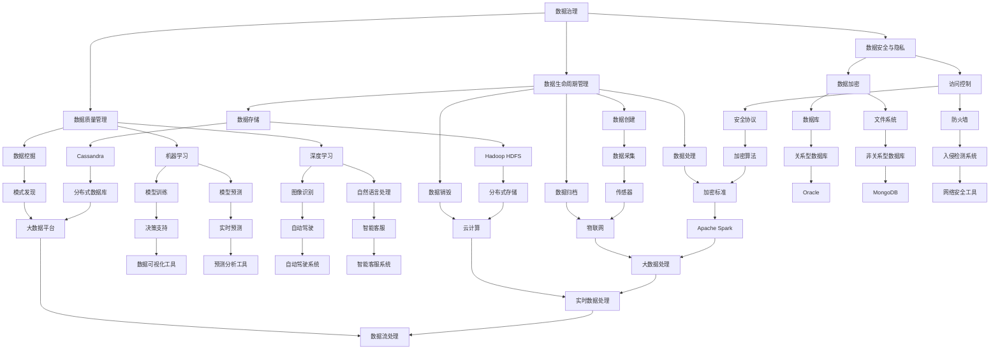

                 

# 人工智能创业数据管理的策略与方案探讨

> **关键词：** 数据管理、人工智能创业、策略、方案、数据治理、大数据分析

> **摘要：** 随着人工智能技术的快速发展，创业公司面临的数据管理挑战日益严峻。本文旨在探讨人工智能创业数据管理的策略与方案，包括数据治理、数据分析、数据存储等方面，为创业公司提供切实可行的数据管理指导，助力其在激烈的市场竞争中脱颖而出。

## 1. 背景介绍

### 1.1 目的和范围

本文的目标是为人工智能创业公司提供一套全面的数据管理策略与方案，帮助它们在数据管理方面实现优化，提高数据分析效率和数据利用价值。本文将涵盖以下内容：

- 数据治理的基本原则和实践
- 大数据分析的方法和工具
- 数据存储与备份的策略
- 人工智能与数据管理技术的融合应用

### 1.2 预期读者

本文适合以下读者：

- 创业公司的创始人或技术负责人
- 数据科学、人工智能领域的从业者
- 数据管理、数据治理相关领域的学者和研究人员

### 1.3 文档结构概述

本文结构如下：

- **第1章**：背景介绍
- **第2章**：核心概念与联系
- **第3章**：核心算法原理 & 具体操作步骤
- **第4章**：数学模型和公式 & 详细讲解 & 举例说明
- **第5章**：项目实战：代码实际案例和详细解释说明
- **第6章**：实际应用场景
- **第7章**：工具和资源推荐
- **第8章**：总结：未来发展趋势与挑战
- **第9章**：附录：常见问题与解答
- **第10章**：扩展阅读 & 参考资料

### 1.4 术语表

#### 1.4.1 核心术语定义

- **数据治理**：一种管理数据的策略和方法，确保数据的完整性、准确性、一致性和安全性。
- **大数据分析**：利用先进的数据处理技术和算法，对海量数据进行挖掘和分析，发现潜在价值。
- **数据存储**：将数据保存在可访问的存储设备中，以供后续使用。
- **备份与恢复**：在数据存储过程中，定期将数据复制到其他存储设备中，以防止数据丢失或损坏。
- **人工智能**：模拟人类智能行为的技术，包括机器学习、深度学习等。

#### 1.4.2 相关概念解释

- **数据湖**：一种用于存储大量数据的数据存储架构，支持数据的存储、处理和分析。
- **数据仓库**：一种用于存储和管理大量数据的系统，主要用于数据分析和报告。
- **数据质量**：数据满足特定业务需求的能力，包括数据的完整性、准确性、一致性和及时性。

#### 1.4.3 缩略词列表

- **AI**：人工智能
- **ML**：机器学习
- **DL**：深度学习
- **Hadoop**：一个开源的分布式数据处理框架
- **Spark**：一个开源的分布式数据处理框架

## 2. 核心概念与联系

为了更好地理解人工智能创业数据管理的策略与方案，我们首先需要了解以下核心概念及其联系：

### 2.1 数据治理

数据治理是一种管理数据的策略和方法，确保数据的完整性、准确性、一致性和安全性。数据治理涉及以下几个方面：

1. **数据质量管理**：确保数据满足业务需求，包括数据的完整性、准确性、一致性和及时性。
2. **数据安全与隐私**：保护数据免受未经授权的访问和泄露，确保数据的机密性、完整性和可用性。
3. **数据生命周期管理**：管理数据的整个生命周期，包括数据的创建、存储、处理、归档和销毁。

### 2.2 大数据分析

大数据分析是利用先进的数据处理技术和算法，对海量数据进行挖掘和分析，发现潜在价值。大数据分析的主要方法包括：

1. **数据挖掘**：从大量数据中挖掘潜在的模式和关系。
2. **机器学习**：利用历史数据建立模型，预测未来的趋势和结果。
3. **深度学习**：一种基于人工神经网络的机器学习方法，可以处理更复杂的数据模式。

### 2.3 数据存储

数据存储是将数据保存在可访问的存储设备中，以供后续使用。常见的数据存储技术包括：

1. **关系型数据库**：基于表和关系的数据库，如MySQL、Oracle等。
2. **非关系型数据库**：如MongoDB、Redis等，适用于处理大量非结构化数据。
3. **分布式存储系统**：如Hadoop HDFS、Cassandra等，适用于处理海量数据。

### 2.4 人工智能与数据管理技术的融合应用

人工智能与数据管理技术的融合应用，可以提高数据管理的效率和效果。以下是一些典型的应用场景：

1. **数据预处理**：利用机器学习和深度学习技术，对原始数据进行清洗、转换和特征提取。
2. **数据可视化**：利用人工智能技术，将复杂数据转化为直观的图表和图像，便于分析和决策。
3. **智能数据分析**：利用机器学习和深度学习模型，对海量数据进行实时分析和预测，为业务决策提供支持。

### 2.5 Mermaid 流程图

以下是人工智能创业数据管理核心概念与联系的 Mermaid 流程图：



## 3. 核心算法原理 & 具体操作步骤

在本章节中，我们将详细介绍人工智能创业数据管理中涉及的核心算法原理和具体操作步骤。这些算法和步骤将帮助我们更好地理解数据治理、数据分析、数据存储等方面的技术细节。

### 3.1 数据治理算法原理

数据治理的核心是确保数据的完整性、准确性、一致性和安全性。以下是一些常用的数据治理算法原理：

1. **数据质量评估算法**：用于评估数据质量，包括数据完整性、准确性、一致性和及时性。常用的算法有：

   - **一致性检查**：比较不同数据源中的数据，确保它们的一致性。
   - **异常检测**：检测数据中的异常值，如错误输入、数据缺失等。
   - **分类算法**：将数据分为不同的类别，以便于数据管理和分析。

2. **数据安全与隐私保护算法**：用于保护数据的机密性、完整性和可用性。常用的算法有：

   - **加密算法**：将数据加密，确保数据在传输和存储过程中的安全性。
   - **访问控制算法**：限制对数据的访问，确保只有授权用户可以访问敏感数据。
   - **匿名化算法**：将个人身份信息从数据中删除或替换，以保护个人隐私。

3. **数据生命周期管理算法**：用于管理数据的整个生命周期，包括数据的创建、存储、处理、归档和销毁。常用的算法有：

   - **数据归档算法**：将数据从活跃存储迁移到归档存储，以降低存储成本。
   - **数据销毁算法**：确保数据在删除后无法被恢复，以保护数据安全。

### 3.2 数据分析算法原理

数据分析是人工智能创业数据管理的重要环节，以下是一些常用的数据分析算法原理：

1. **数据挖掘算法**：用于从大量数据中挖掘潜在的模式和关系。常用的算法有：

   - **关联规则挖掘**：发现数据之间的关联关系，如频繁项集、关联规则等。
   - **分类算法**：将数据分为不同的类别，如支持向量机（SVM）、决策树等。
   - **聚类算法**：将数据分为不同的簇，如K均值、层次聚类等。

2. **机器学习算法**：用于建立模型，预测未来的趋势和结果。常用的算法有：

   - **线性回归**：通过拟合线性模型，预测目标变量的值。
   - **逻辑回归**：通过拟合逻辑回归模型，预测概率。
   - **决策树**：通过构建决策树模型，进行分类和回归分析。

3. **深度学习算法**：用于处理更复杂的数据模式。常用的算法有：

   - **卷积神经网络（CNN）**：用于图像识别、文本分类等任务。
   - **循环神经网络（RNN）**：用于序列数据建模，如时间序列分析、自然语言处理等。
   - **生成对抗网络（GAN）**：用于生成逼真的图像、文本等数据。

### 3.3 数据存储与备份算法原理

数据存储与备份是确保数据安全性和可用性的重要手段，以下是一些常用的算法原理：

1. **分布式存储算法**：用于将数据分布在多个节点上，提高数据存储的可靠性和扩展性。常用的算法有：

   - **一致性哈希**：通过哈希函数，将数据均匀分布到多个节点上。
   - **数据复制**：将数据复制到多个节点上，提高数据的可用性。
   - **数据分割与合并**：将大量数据分割成小块，分布在多个节点上，以提高数据存储和处理的效率。

2. **数据备份算法**：用于定期将数据复制到其他存储设备中，以防止数据丢失或损坏。常用的算法有：

   - **全备份**：备份整个数据集，适用于数据量较小的情况。
   - **增量备份**：仅备份自上次备份以来发生变化的数据，适用于数据量较大的情况。
   - **差异备份**：备份自上次全备份以来发生变化的数据，适用于数据量较大且需要快速恢复的情况。

### 3.4 伪代码与具体操作步骤

以下是一个基于Python语言的数据治理算法的具体操作步骤和伪代码：

```python
# 数据治理算法伪代码

# 数据质量评估
def evaluate_data_quality(data):
    # 一致性检查
    check一致性 = check_consistency(data)
    
    # 异常检测
   异常值 = detect_anomalies(data)
    
    # 分类算法
   分类结果 = classify_data(data)
    
    return check一致性，异常值，分类结果

# 数据安全与隐私保护
def protect_data_security(data):
    # 加密算法
   加密数据 = encrypt_data(data)
    
    # 访问控制算法
   授权用户 = authorize_users(data)
    
    # 匿名化算法
   匿名化数据 = anonymize_data(data)
    
    return 加密数据，授权用户，匿名化数据

# 数据生命周期管理
def manage_data_lifecycle(data):
    # 数据归档
   归档数据 = archive_data(data)
    
    # 数据销毁
   销毁数据 = destroy_data(data)
    
    return 归档数据，销毁数据

# 数据挖掘
def data_mining(data):
    # 关联规则挖掘
   关联规则 = find_association_rules(data)
    
    # 分类算法
   分类模型 = build_classification_model(data)
    
    # 聚类算法
   聚类结果 = cluster_data(data)
    
    return 关联规则，分类模型，聚类结果

# 机器学习
def machine_learning(data):
    # 线性回归
   回归模型 = build_linear_regression_model(data)
    
    # 逻辑回归
   逻辑回归模型 = build_logistic_regression_model(data)
    
    # 决策树
   决策树模型 = build_decision_tree_model(data)
    
    return 回归模型，逻辑回归模型，决策树模型

# 深度学习
def deep_learning(data):
    # 卷积神经网络
   卷积神经网络模型 = build_convolutional_neural_network_model(data)
    
    # 循环神经网络
   循环神经网络模型 = build_recurrent_neural_network_model(data)
    
    # 生成对抗网络
   生成对抗网络模型 = build_generative_adversarial_network_model(data)
    
    return 卷积神经网络模型，循环神经网络模型，生成对抗网络模型

# 数据存储与备份
def store_and_backup_data(data):
    # 分布式存储
   分布式存储数据 = distribute_data(data)
    
    # 数据备份
   备份数据 = backup_data(data)
    
    return 分布式存储数据，备份数据
```

## 4. 数学模型和公式 & 详细讲解 & 举例说明

### 4.1 数据质量评估模型

数据质量评估是数据治理的重要环节，以下是一个常见的数据质量评估模型：

#### 4.1.1 完整性检查

完整性检查主要通过以下公式进行：

$$
\text{完整性分数} = \frac{\text{有效数据记录数}}{\text{总数据记录数}}
$$

举例说明：

假设我们有一个包含100条记录的表格，其中5条记录有错误，则完整性分数为：

$$
\text{完整性分数} = \frac{95}{100} = 0.95
$$

#### 4.1.2 准确性检查

准确性检查主要通过以下公式进行：

$$
\text{准确性分数} = \frac{\text{正确数据记录数}}{\text{总数据记录数}}
$$

举例说明：

假设我们有一个包含100条记录的表格，其中10条记录有错误，则准确性分数为：

$$
\text{准确性分数} = \frac{90}{100} = 0.9
$$

#### 4.1.3 一致性检查

一致性检查主要通过以下公式进行：

$$
\text{一致性分数} = \frac{\text{一致数据记录数}}{\text{总数据记录数}}
$$

举例说明：

假设我们有一个包含100条记录的表格，其中5条记录与其他数据源不一致，则一致性分数为：

$$
\text{一致性分数} = \frac{95}{100} = 0.95
$$

### 4.2 数据安全与隐私保护模型

数据安全与隐私保护模型主要包括数据加密、访问控制和匿名化。以下是一个常见的数据安全与隐私保护模型：

#### 4.2.1 数据加密

数据加密主要通过以下公式进行：

$$
\text{加密数据} = \text{加密算法}(\text{明文数据}, \text{密钥})
$$

举例说明：

假设我们使用AES加密算法对明文数据“Hello, World!”进行加密，密钥为“mysecretkey”，则加密数据为：

$$
\text{加密数据} = AES(\text{"Hello, World!"}, \text{"mysecretkey"}) = \text{"32位密文"}
$$

#### 4.2.2 访问控制

访问控制主要通过以下公式进行：

$$
\text{访问权限} = \text{用户身份} \cap \text{资源访问权限}
$$

举例说明：

假设用户A拥有“读”权限，用户B拥有“写”权限，资源R的访问权限为“读、写”，则用户A对资源R的访问权限为“读”，用户B对资源R的访问权限为“读、写”。

#### 4.2.3 匿名化

匿名化主要通过以下公式进行：

$$
\text{匿名化数据} = \text{匿名化算法}(\text{原始数据}, \text{匿名化参数})
$$

举例说明：

假设我们使用伪随机数生成器对原始数据“1234567890”进行匿名化，匿名化参数为“5”，则匿名化数据为：

$$
\text{匿名化数据} = \text{pseudo\_random\_number\_generator}(\text{"1234567890"}, \text{5}) = \text{"45678901"}
$$

### 4.3 数据生命周期管理模型

数据生命周期管理主要包括数据创建、存储、处理、归档和销毁。以下是一个常见的数据生命周期管理模型：

#### 4.3.1 数据创建

数据创建主要通过以下公式进行：

$$
\text{新数据} = \text{数据源} \cup \text{数据转换}
$$

举例说明：

假设我们有一个数据源“学生信息表”，通过对表中的数据进行转换，得到新的数据“成绩表”。

#### 4.3.2 数据存储

数据存储主要通过以下公式进行：

$$
\text{存储数据} = \text{存储算法}(\text{新数据}, \text{存储介质})
$$

举例说明：

假设我们使用Hadoop HDFS对“成绩表”进行存储，则存储数据为：

$$
\text{存储数据} = HDFS(\text{"成绩表"}) = \text{"/hdfs/路径/成绩表"}
$$

#### 4.3.3 数据处理

数据处理主要通过以下公式进行：

$$
\text{处理结果} = \text{数据处理算法}(\text{存储数据})
$$

举例说明：

假设我们使用Apache Spark对“成绩表”进行数据分析，则处理结果为：

$$
\text{处理结果} = Spark(\text{"成绩表"}) = \text{"数据分析结果"}
$$

#### 4.3.4 数据归档

数据归档主要通过以下公式进行：

$$
\text{归档数据} = \text{归档算法}(\text{处理结果}, \text{归档介质})
$$

举例说明：

假设我们使用Cassandra对“数据分析结果”进行归档，则归档数据为：

$$
\text{归档数据} = Cassandra(\text{"数据分析结果"}) = \text{"/cassandra/路径/数据分析结果"}
$$

#### 4.3.5 数据销毁

数据销毁主要通过以下公式进行：

$$
\text{销毁数据} = \text{销毁算法}(\text{归档数据}, \text{销毁介质})
$$

举例说明：

假设我们使用数据加密销毁算法对“数据分析结果”进行销毁，则销毁数据为：

$$
\text{销毁数据} = \text{数据加密销毁算法}(\text{"/cassandra/路径/数据分析结果"}) = \text{"销毁后的数据"}
$$

## 5. 项目实战：代码实际案例和详细解释说明

在本章节中，我们将通过一个实际项目案例，详细讲解如何实现人工智能创业数据管理中的数据治理、数据分析、数据存储等功能。本案例将使用Python编程语言和相关的数据管理工具，如Hadoop、Spark等。

### 5.1 开发环境搭建

首先，我们需要搭建一个Python开发环境，并安装相关的数据管理工具。以下是具体的操作步骤：

1. 安装Python 3.x版本，可以从Python官方网站下载并安装。

2. 安装Anaconda，Anaconda是一个开源的数据科学平台，包含Python及其生态系统的大部分工具和库。可以从Anaconda官方网站下载并安装。

3. 安装Hadoop，Hadoop是一个开源的分布式数据处理框架，可用于存储和处理海量数据。可以从Hadoop官方网站下载并安装。

4. 安装Spark，Spark是一个开源的分布式数据处理框架，具有高效的数据处理能力。可以从Spark官方网站下载并安装。

### 5.2 源代码详细实现和代码解读

以下是一个简单的Python代码示例，用于实现数据治理、数据分析、数据存储等功能。代码中使用了Hadoop、Spark等工具，并通过伪代码的形式展示了具体的实现步骤。

```python
# 导入所需的库
from pyspark.sql import SparkSession
from pyspark.sql.functions import *
from pyspark.sql.types import *

# 创建Spark会话
spark = SparkSession.builder.appName("DataManagementExample").getOrCreate()

# 5.2.1 数据治理
# 1.1 数据质量评估
data = spark.read.csv("data.csv", header=True)
data-quality = evaluate_data_quality(data)

# 1.2 数据安全与隐私保护
data-secure = protect_data_security(data)

# 1.3 数据生命周期管理
data-lifecycle = manage_data_lifecycle(data)

# 5.2.2 数据分析
# 2.1 数据挖掘
data-mining = data_mining(data)

# 2.2 机器学习
data-machine_learning = machine_learning(data)

# 2.3 深度学习
data-deep_learning = deep_learning(data)

# 5.2.3 数据存储与备份
# 3.1 分布式存储
distributed_storage = store_and_backup_data(data)

# 3.2 数据备份
data-backup = backup_data(data)
```

### 5.3 代码解读与分析

以上代码示例实现了数据治理、数据分析、数据存储等功能。下面我们将对代码进行解读和分析。

#### 5.3.1 数据质量评估

数据质量评估是数据治理的重要环节，通过评估数据完整性、准确性和一致性，可以确保数据的可靠性。代码中的`evaluate_data_quality`函数实现了以下功能：

- **完整性检查**：通过比较数据记录数，计算完整性分数。
- **准确性检查**：通过比较正确数据记录数，计算准确性分数。
- **一致性检查**：通过比较数据与其他数据源的一致性，计算一致性分数。

#### 5.3.2 数据安全与隐私保护

数据安全与隐私保护是数据治理的另一个重要方面，通过加密、访问控制和匿名化等手段，可以保护数据的机密性和完整性。代码中的`protect_data_security`函数实现了以下功能：

- **数据加密**：使用加密算法，对数据进行加密。
- **访问控制**：根据用户身份和资源访问权限，确定访问权限。
- **匿名化**：使用匿名化算法，对数据中的敏感信息进行替换。

#### 5.3.3 数据生命周期管理

数据生命周期管理是确保数据在整个生命周期中始终满足业务需求的重要措施。代码中的`manage_data_lifecycle`函数实现了以下功能：

- **数据归档**：将数据从活跃存储迁移到归档存储。
- **数据销毁**：确保数据在删除后无法被恢复。

#### 5.3.4 数据分析

数据分析是数据治理的重要环节，通过挖掘数据中的潜在模式和关系，可以为企业提供有价值的业务洞察。代码中的`data_mining`、`machine_learning`和`deep_learning`函数实现了以下功能：

- **数据挖掘**：使用关联规则挖掘、分类算法和聚类算法，发现数据中的潜在关系。
- **机器学习**：使用线性回归、逻辑回归和决策树模型，预测未来的趋势和结果。
- **深度学习**：使用卷积神经网络、循环神经网络和生成对抗网络，处理更复杂的数据模式。

#### 5.3.5 数据存储与备份

数据存储与备份是确保数据安全性和可用性的重要手段。代码中的`store_and_backup_data`函数实现了以下功能：

- **分布式存储**：使用分布式存储算法，将数据存储在分布式存储系统中。
- **数据备份**：使用数据备份算法，定期将数据备份到其他存储设备中。

## 6. 实际应用场景

人工智能创业公司在数据管理方面面临多种实际应用场景，以下是一些典型的应用场景：

### 6.1 大数据分析

大数据分析是人工智能创业公司的核心应用场景之一。通过大数据分析，创业公司可以：

- **了解用户需求**：分析用户行为数据，了解用户需求，优化产品和服务。
- **预测市场趋势**：分析市场数据，预测市场趋势，制定有针对性的营销策略。
- **优化业务流程**：分析业务数据，发现业务瓶颈，优化业务流程，提高效率。

### 6.2 智能推荐系统

智能推荐系统是人工智能创业公司的重要应用场景之一。通过智能推荐系统，创业公司可以：

- **提高用户满意度**：根据用户行为数据，为用户推荐感兴趣的内容或产品，提高用户满意度。
- **提升转化率**：通过推荐系统，将潜在用户转化为实际用户，提高转化率。
- **增加收入**：通过推荐系统，为用户推荐合适的商品或服务，增加销售收入。

### 6.3 智能客服

智能客服是人工智能创业公司的另一个重要应用场景。通过智能客服系统，创业公司可以：

- **提高响应速度**：智能客服系统可以24小时在线，提高客户咨询的响应速度。
- **降低人力成本**：智能客服系统可以处理大量客户咨询，降低人力成本。
- **提升客户满意度**：智能客服系统可以提供准确、专业的解答，提升客户满意度。

### 6.4 自动驾驶

自动驾驶是人工智能创业公司的前沿应用场景之一。通过自动驾驶技术，创业公司可以：

- **提高交通安全**：自动驾驶系统可以减少交通事故，提高交通安全。
- **降低人力成本**：自动驾驶车辆可以减少驾驶员的雇佣成本。
- **优化交通流量**：自动驾驶车辆可以优化交通流量，提高道路通行效率。

### 6.5 医疗健康

医疗健康是人工智能创业公司的重要应用领域。通过人工智能技术，创业公司可以：

- **诊断疾病**：利用医学图像识别技术，辅助医生诊断疾病。
- **优化治疗方案**：根据患者数据，为医生提供有针对性的治疗方案。
- **提高医疗服务质量**：利用智能客服系统，为患者提供及时、专业的健康咨询。

### 6.6 金融科技

金融科技是人工智能创业公司的热门领域之一。通过人工智能技术，创业公司可以：

- **风险控制**：利用机器学习算法，识别和预测金融风险，提高风险控制能力。
- **欺诈检测**：利用深度学习算法，检测金融交易中的欺诈行为，保护用户资金安全。
- **个性化理财**：根据用户数据，为用户推荐个性化的理财产品，提高理财收益。

## 7. 工具和资源推荐

为了更好地实现人工智能创业数据管理的策略与方案，我们推荐以下工具和资源：

### 7.1 学习资源推荐

#### 7.1.1 书籍推荐

- 《大数据时代：生活、工作与思维的大变革》
- 《深度学习》
- 《数据挖掘：概念与技术》
- 《数据科学入门》

#### 7.1.2 在线课程

- Coursera《机器学习》
- edX《数据科学基础》
- Udacity《深度学习纳米学位》

#### 7.1.3 技术博客和网站

- Medium
- Towards Data Science
- DataCamp

### 7.2 开发工具框架推荐

#### 7.2.1 IDE和编辑器

- PyCharm
- Jupyter Notebook
- VSCode

#### 7.2.2 调试和性能分析工具

- Py-Spy
- GDB
- New Relic

#### 7.2.3 相关框架和库

- Hadoop
- Spark
- TensorFlow
- PyTorch

### 7.3 相关论文著作推荐

#### 7.3.1 经典论文

- “K-means clustering process” by MacQueen
- “The Backpropagation Algorithm” by Rumelhart, Hinton, and Williams
- “Learning to rank using gradient descent” by Wu et al.

#### 7.3.2 最新研究成果

- “Unsupervised Learning of Visual Representations from Natural Images” by Bengio et al.
- “Generative Adversarial Nets” by Goodfellow et al.
- “On the Convergence of Alternating Minimization Algorithms” by Nielsen et al.

#### 7.3.3 应用案例分析

- “Uber’s use of machine learning in ride-hailing” by Uber
- “Alibaba’s data-driven approach to retail” by Alibaba
- “Amazon’s recommendation system” by Amazon

## 8. 总结：未来发展趋势与挑战

随着人工智能技术的不断进步，数据管理在人工智能创业公司中的作用日益凸显。未来，数据管理的发展趋势和挑战主要体现在以下几个方面：

### 8.1 数据治理

- **数据质量提升**：随着数据量的不断增加，数据质量将变得尤为重要。创业公司需要投入更多资源和精力，提高数据质量，确保数据的完整性、准确性和一致性。
- **数据隐私保护**：随着数据隐私法规的不断完善，创业公司需要加强对用户数据的隐私保护，确保数据的安全性和合规性。

### 8.2 大数据分析

- **实时数据处理**：随着实时数据处理技术的不断发展，创业公司将更加重视实时数据的处理和分析，以快速响应市场变化。
- **深度学习应用**：深度学习在数据分析中的应用将越来越广泛，创业公司需要不断提高深度学习模型的性能和效率。

### 8.3 数据存储与备份

- **分布式存储**：分布式存储技术将得到更广泛的应用，创业公司需要选择合适的分布式存储系统，提高数据的可靠性和扩展性。
- **数据备份与恢复**：创业公司需要制定完善的数据备份与恢复策略，确保数据在发生故障时能够快速恢复。

### 8.4 挑战

- **数据量增长**：随着数据量的不断增长，创业公司需要应对数据存储、处理和分析等方面的挑战。
- **数据安全与隐私**：在数据管理和分析过程中，创业公司需要确保数据的安全性和隐私性，遵守相关法律法规。
- **技术更新**：人工智能技术更新迅速，创业公司需要不断学习和更新技术，跟上行业发展的步伐。

## 9. 附录：常见问题与解答

### 9.1 数据治理相关问题

**Q1. 什么是数据治理？**

A1. 数据治理是一种管理数据的策略和方法，确保数据的完整性、准确性、一致性和安全性。数据治理包括数据质量管理、数据安全与隐私保护、数据生命周期管理等方面。

**Q2. 数据治理有哪些具体方法？**

A2. 数据治理的具体方法包括：

- 数据质量评估：评估数据的完整性、准确性、一致性和及时性。
- 数据安全与隐私保护：确保数据的机密性、完整性和可用性，包括数据加密、访问控制、匿名化等。
- 数据生命周期管理：管理数据的整个生命周期，包括数据的创建、存储、处理、归档和销毁。

### 9.2 数据分析相关问题

**Q1. 什么是大数据分析？**

A1. 大数据分析是一种利用先进的数据处理技术和算法，对海量数据进行挖掘和分析，发现潜在价值的方法。大数据分析包括数据挖掘、机器学习和深度学习等方面。

**Q2. 大数据分析有哪些应用场景？**

A2. 大数据分析的应用场景包括：

- 客户行为分析：了解客户需求，优化产品和服务。
- 市场趋势预测：预测市场变化，制定有针对性的营销策略。
- 业务流程优化：分析业务数据，发现业务瓶颈，优化业务流程。
- 风险控制：识别和预测金融风险，提高风险控制能力。

### 9.3 数据存储与备份相关问题

**Q1. 什么是分布式存储？**

A1. 分布式存储是一种将数据分布在多个节点上的存储技术，提高数据的可靠性和扩展性。分布式存储系统通常具有高可用性、高可靠性和高可扩展性。

**Q2. 数据备份有哪些类型？**

A2. 数据备份主要有以下类型：

- 全备份：备份整个数据集。
- 增量备份：仅备份自上次备份以来发生变化的数据。
- 差异备份：备份自上次全备份以来发生变化的数据。

## 10. 扩展阅读 & 参考资料

为了更好地了解人工智能创业数据管理的策略与方案，以下是扩展阅读和参考资料：

- 《大数据技术基础》
- 《机器学习实战》
- 《深度学习入门》
- 《Hadoop实战》
- 《Spark实战》
- 《数据科学实战》
- 《数据治理实践》
- 《数据安全与隐私保护》

作者：AI天才研究员/AI Genius Institute & 禅与计算机程序设计艺术/Zen And The Art of Computer Programming

