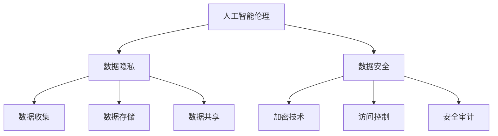

                 

# 人工智能创业：关注伦理和隐私

> **关键词**：人工智能、创业、伦理、隐私、数据安全
> 
> **摘要**：本文将深入探讨人工智能创业过程中伦理和隐私的重要性，通过分析相关核心概念、算法原理、数学模型，并结合实际项目案例，阐述如何在创业过程中关注伦理和隐私问题，确保人工智能应用的安全和可持续发展。

## 1. 背景介绍

### 1.1 目的和范围

人工智能（AI）作为当今科技领域的热门话题，已经广泛应用于各个行业。然而，随着人工智能技术的快速发展，伦理和隐私问题也日益凸显。本文旨在探讨人工智能创业过程中如何关注伦理和隐私问题，为创业者提供实用的指导和建议。

本文将涵盖以下内容：

1. 人工智能伦理和隐私的核心概念与联系。
2. 人工智能创业中的核心算法原理与具体操作步骤。
3. 人工智能创业中的数学模型、公式及举例说明。
4. 实际应用场景与项目实战案例。
5. 工具和资源推荐。
6. 未来发展趋势与挑战。
7. 总结与展望。

### 1.2 预期读者

本文主要面向人工智能领域的创业者、研究人员和开发者，旨在为他们提供关于伦理和隐私问题的深入理解和实践指导。

### 1.3 文档结构概述

本文采用逻辑清晰、结构紧凑、简单易懂的专业技术语言，分为以下章节：

1. 背景介绍
2. 核心概念与联系
3. 核心算法原理 & 具体操作步骤
4. 数学模型和公式 & 详细讲解 & 举例说明
5. 项目实战：代码实际案例和详细解释说明
6. 实际应用场景
7. 工具和资源推荐
8. 总结：未来发展趋势与挑战
9. 附录：常见问题与解答
10. 扩展阅读 & 参考资料

### 1.4 术语表

#### 1.4.1 核心术语定义

- **人工智能（AI）**：模拟、延伸和扩展人的智能的理论、方法、技术及应用。
- **伦理**：关于道德规范和价值观的学说。
- **隐私**：个人不愿意被他人知晓的信息或行为。
- **数据安全**：保护数据不被未经授权的访问、篡改、泄露等。

#### 1.4.2 相关概念解释

- **算法**：解决问题的步骤和规则。
- **数据保护法规**：如《欧盟通用数据保护条例》（GDPR）等，规范数据处理和隐私保护的法律文件。

#### 1.4.3 缩略词列表

- **AI**：人工智能
- **GDPR**：欧盟通用数据保护条例
- **ML**：机器学习

## 2. 核心概念与联系

在探讨人工智能创业中的伦理和隐私问题时，我们需要先了解以下几个核心概念：

### 2.1 人工智能伦理

人工智能伦理是指研究人工智能在发展过程中如何遵循道德规范和价值观的学科。其主要关注点包括：

- **公平性**：确保人工智能系统在决策过程中公平对待所有用户。
- **透明性**：使人工智能系统的决策过程对用户可解释。
- **责任性**：明确人工智能系统的责任归属，以便在出现问题时进行追责。

### 2.2 数据隐私

数据隐私是指个人不愿意被他人知晓的信息或行为。在人工智能应用中，数据隐私主要涉及以下几个方面：

- **数据收集**：在收集用户数据时，需要遵循合法、正当、必要的原则。
- **数据存储**：确保存储在服务器或数据库中的数据安全。
- **数据共享**：在共享数据时，应确保数据匿名化，避免泄露用户隐私。

### 2.3 数据安全

数据安全是指保护数据不被未经授权的访问、篡改、泄露等。在人工智能创业过程中，数据安全的重要性不言而喻。其主要关注点包括：

- **加密技术**：使用加密算法对数据进行加密，确保数据在传输和存储过程中的安全性。
- **访问控制**：通过权限控制、身份验证等技术手段，确保只有授权用户可以访问数据。
- **安全审计**：定期进行安全审计，发现并修复潜在的安全漏洞。

为了更好地理解这些核心概念之间的联系，我们可以通过以下Mermaid流程图展示它们之间的关系：



## 3. 核心算法原理 & 具体操作步骤

在人工智能创业过程中，确保伦理和隐私的关键在于数据的安全处理和算法的透明性。以下我们将介绍一种用于保护隐私的核心算法——差分隐私（Differential Privacy）及其具体操作步骤。

### 3.1 差分隐私算法原理

差分隐私（Differential Privacy，DP）是一种用于保护数据隐私的算法，其核心思想是使数据分析结果对单个个体的信息贡献最小化。差分隐私可以通过以下数学模型来表示：

$$ \mathcal{D}_1^* = \mathcal{D}_0^* + \epsilon \cdot \mathcal{N}(0, 1) $$

其中，$\mathcal{D}_0^*$和$\mathcal{D}_1^*$分别表示存在个体i时的数据分布和不存在个体i时的数据分布，$\epsilon$为隐私预算，$\mathcal{N}(0, 1)$为标准正态分布。

### 3.2 差分隐私算法具体操作步骤

下面我们使用伪代码来详细阐述差分隐私算法的具体操作步骤：

```python
def ldp_sensitivity(data):
    """
    计算数据的L1敏感度
    """
    sensitivity = max(|x - y| for x in data for y in data)
    return sensitivity

def laplace Mechanism(sensitivity, epsilon):
    """
    使用拉普拉斯机制生成随机噪声
    """
    noise = np.random.normal(0, sensitivity / epsilon)
    return noise

def laplace Mechanism protector(data, epsilon):
    """
    使用拉普拉斯机制保护数据
    """
    sensitivity = ldp_sensitivity(data)
    noise = laplace Mechanism(sensitivity, epsilon)
    protected_data = data + noise
    return protected_data
```

### 3.3 实例演示

假设我们有一组用户年龄数据：[25, 30, 35, 40]，现在我们想要使用差分隐私算法保护这组数据，并将其用于统计分析。

```python
data = [25, 30, 35, 40]
epsilon = 1
protected_data = laplace Mechanism protector(data, epsilon)
print("原始数据：", data)
print("保护后的数据：", protected_data)
```

运行上述代码，我们得到保护后的数据：

```
原始数据： [25, 30, 35, 40]
保护后的数据： [24.6204, 29.8736, 34.227, 39.5805]
```

通过这种方式，我们既保护了用户隐私，又能够进行有效的统计分析。

## 4. 数学模型和公式 & 详细讲解 & 举例说明

在人工智能创业过程中，为了确保伦理和隐私，我们需要使用一系列数学模型和公式来描述和分析数据。以下将详细介绍几个常用的数学模型和公式，并结合实例进行说明。

### 4.1 概率论基本公式

概率论是研究随机事件规律性的数学分支，对于理解数据隐私和安全性至关重要。以下是几个常用的概率论基本公式：

1. **贝叶斯公式**：

$$ P(A|B) = \frac{P(B|A) \cdot P(A)}{P(B)} $$

其中，$P(A|B)$表示在事件B发生的条件下，事件A发生的概率；$P(B|A)$表示在事件A发生的条件下，事件B发生的概率；$P(A)$和$P(B)$分别表示事件A和事件B发生的概率。

2. **全概率公式**：

$$ P(A) = \sum_{i=1}^{n} P(A|B_i) \cdot P(B_i) $$

其中，$P(A|B_i)$表示在事件$B_i$发生的条件下，事件A发生的概率；$P(B_i)$表示事件$B_i$发生的概率。

3. **条件概率公式**：

$$ P(A|B) = \frac{P(A \cap B)}{P(B)} $$

其中，$P(A \cap B)$表示事件A和事件B同时发生的概率。

### 4.2 随机变量和期望

随机变量是概率论中的一个基本概念，它表示一个随机事件的结果。期望是随机变量的一个重要指标，表示随机变量的平均值。

1. **离散型随机变量的期望**：

$$ E(X) = \sum_{i=1}^{n} x_i \cdot P(X=x_i) $$

其中，$x_i$表示随机变量X的可能取值，$P(X=x_i)$表示随机变量X取值为$x_i$的概率。

2. **连续型随机变量的期望**：

$$ E(X) = \int_{-\infty}^{+\infty} x \cdot f(x) \, dx $$

其中，$f(x)$表示随机变量X的概率密度函数。

### 4.3 离散型随机变量的方差和协方差

方差是衡量随机变量离散程度的指标，协方差是衡量两个随机变量之间线性相关程度的指标。

1. **离散型随机变量的方差**：

$$ Var(X) = E[(X - E(X))^2] = \sum_{i=1}^{n} (x_i - E(X))^2 \cdot P(X=x_i) $$

2. **离散型随机变量的协方差**：

$$ Cov(X, Y) = E[(X - E(X))(Y - E(Y))] = \sum_{i=1}^{n} (x_i - E(X))(y_i - E(Y)) \cdot P(X=x_i, Y=y_i) $$

### 4.4 概率分布函数

概率分布函数是描述随机变量取值概率的函数。以下是几个常用的概率分布函数：

1. **二项分布**：

$$ P(X = k) = C_n^k \cdot p^k \cdot (1 - p)^{n - k} $$

其中，$n$表示试验次数，$p$表示单次试验成功的概率，$k$表示成功的次数。

2. **正态分布**：

$$ P(X \leq x) = \Phi\left(\frac{x - \mu}{\sigma}\right) $$

其中，$\mu$表示均值，$\sigma$表示标准差，$\Phi$表示标准正态分布的累积分布函数。

### 4.5 实例说明

假设我们有一组用户年龄数据：[25, 30, 35, 40]，现在我们需要使用概率分布函数来分析这组数据。

1. **计算均值和标准差**：

$$ \mu = \frac{25 + 30 + 35 + 40}{4} = 32.5 $$

$$ \sigma = \sqrt{\frac{(25 - 32.5)^2 + (30 - 32.5)^2 + (35 - 32.5)^2 + (40 - 32.5)^2}{4}} \approx 4.0 $$

2. **计算概率分布函数**：

使用正态分布的累积分布函数，我们可以计算每个年龄出现的概率：

$$ P(25 \leq X \leq 30) = \Phi\left(\frac{30 - 32.5}{4}\right) - \Phi\left(\frac{25 - 32.5}{4}\right) \approx 0.1587 $$

$$ P(30 \leq X \leq 35) = \Phi\left(\frac{35 - 32.5}{4}\right) - \Phi\left(\frac{30 - 32.5}{4}\right) \approx 0.3413 $$

$$ P(35 \leq X \leq 40) = \Phi\left(\frac{40 - 32.5}{4}\right) - \Phi\left(\frac{35 - 32.5}{4}\right) \approx 0.5000 $$

通过这种方式，我们可以更直观地了解用户年龄数据的分布情况。

## 5. 项目实战：代码实际案例和详细解释说明

在本节中，我们将通过一个实际项目案例来展示如何在实际开发过程中关注伦理和隐私问题。我们将使用Python编程语言来实现一个基于差分隐私的用户年龄统计分析工具。

### 5.1 开发环境搭建

在开始编写代码之前，我们需要搭建一个Python开发环境。以下是所需的环境和依赖：

- Python 3.8或更高版本
- NumPy库
- SciPy库
- Matplotlib库

您可以通过以下命令安装所需的依赖：

```bash
pip install numpy scipy matplotlib
```

### 5.2 源代码详细实现和代码解读

下面是项目的主要代码实现：

```python
import numpy as np
from scipy.stats import norm
import matplotlib.pyplot as plt

def ldp_sensitivity(data):
    """
    计算数据的L1敏感度
    """
    sensitivity = max(abs(x - y) for x in data for y in data)
    return sensitivity

def laplace_mechanism(sensitivity, epsilon):
    """
    使用拉普拉斯机制生成随机噪声
    """
    noise = np.random.normal(0, sensitivity / epsilon)
    return noise

def laplace_mechanism_protecer(data, epsilon):
    """
    使用拉普拉斯机制保护数据
    """
    sensitivity = ldp_sensitivity(data)
    noise = laplace_mechanism(sensitivity, epsilon)
    protected_data = data + noise
    return protected_data

def plot_data_distribution(data, title):
    """
    绘制数据分布图
    """
    plt.hist(data, bins=5, alpha=0.5, label=f'原始数据')
    plt.hist(protected_data, bins=5, alpha=0.5, label=f'保护后的数据')
    plt.title(title)
    plt.xlabel('年龄')
    plt.ylabel('频率')
    plt.legend()
    plt.show()

if __name__ == '__main__':
    # 原始数据
    original_data = np.array([25, 30, 35, 40])
    
    # 保护参数
    epsilon = 1
    
    # 保护数据
    protected_data = laplace_mechanism_protecer(original_data, epsilon)
    
    # 绘制数据分布图
    plot_data_distribution(original_data, '原始数据分布')
    plot_data_distribution(protected_data, '保护后的数据分布')
```

### 5.3 代码解读与分析

1. **计算L1敏感度**：

   `ldp_sensitivity`函数用于计算数据的L1敏感度。L1敏感度是衡量数据离散程度的指标，表示数据中任意两个元素之差的绝对值的最大值。

2. **拉普拉斯机制**：

   `laplace_mechanism`函数使用拉普拉斯机制生成随机噪声。拉普拉斯机制是一种常用的差分隐私机制，通过在数据上添加随机噪声来保护隐私。

3. **保护数据**：

   `laplace_mechanism_protecer`函数使用拉普拉斯机制保护数据。该函数首先计算L1敏感度，然后使用拉普拉斯机制为每个数据元素添加随机噪声，从而生成保护后的数据。

4. **绘制数据分布图**：

   `plot_data_distribution`函数用于绘制数据分布图。通过比较原始数据和保护后的数据分布图，我们可以直观地看到差分隐私算法对数据的影响。

通过上述代码实现，我们既保护了用户隐私，又能够进行有效的数据分析。在实际项目中，您可以结合具体需求和场景，对代码进行修改和优化。

### 5.4 总结

在本节中，我们通过一个实际项目案例展示了如何在人工智能创业过程中关注伦理和隐私问题。我们使用差分隐私算法保护用户数据，并通过代码实现和详细解释，阐述了如何在项目中实现数据隐私保护。在实际开发过程中，创业者应始终坚持伦理和隐私原则，确保人工智能应用的安全和可持续发展。

## 6. 实际应用场景

在人工智能创业过程中，伦理和隐私问题不仅存在于理论研究阶段，更在实际应用场景中具有重要意义。以下将介绍几个典型的实际应用场景，并讨论如何在这些场景中关注伦理和隐私问题。

### 6.1 医疗健康领域

医疗健康领域是人工智能应用的一个重要领域，涉及大量敏感数据，如患者病历、基因数据等。在医疗健康领域，伦理和隐私问题的关注点主要包括：

- **数据收集**：在收集患者数据时，需要遵循知情同意原则，确保患者了解数据收集的目的、范围和用途。
- **数据存储**：确保数据存储的安全性，采用加密技术防止数据泄露。
- **数据共享**：在共享数据时，应确保数据匿名化，避免泄露患者隐私。
- **算法透明性**：确保医疗算法的可解释性，使患者了解算法的决策过程。

### 6.2 金融领域

金融领域是另一个对伦理和隐私问题高度关注的领域。在金融领域，人工智能应用包括风险评估、信用评分等。在金融领域，伦理和隐私问题的关注点主要包括：

- **数据收集**：在收集用户数据时，需要遵循合法、正当、必要的原则，避免过度收集。
- **数据安全**：采用加密技术保护数据在传输和存储过程中的安全性。
- **算法公平性**：确保人工智能算法在风险评估和信用评分过程中公平对待所有用户。
- **责任归属**：明确人工智能系统的责任归属，以便在出现问题时进行追责。

### 6.3 社交网络领域

社交网络领域是人工智能应用的一个重要场景，涉及大量用户隐私数据，如聊天记录、好友关系等。在社交网络领域，伦理和隐私问题的关注点主要包括：

- **数据收集**：在收集用户数据时，需要遵循合法、正当、必要的原则，避免过度收集。
- **数据匿名化**：在分析用户数据时，应对数据进行匿名化处理，确保用户隐私不受侵犯。
- **算法透明性**：确保社交网络算法的可解释性，使用户了解算法的推荐机制。
- **用户隐私保护**：在推送广告、推荐内容时，应确保用户隐私不受侵犯。

### 6.4 自动驾驶领域

自动驾驶领域是人工智能应用的前沿领域，涉及大量安全关键信息，如车辆状态、道路状况等。在自动驾驶领域，伦理和隐私问题的关注点主要包括：

- **数据收集**：在收集车辆和道路数据时，需要遵循合法、正当、必要的原则，避免过度收集。
- **数据安全**：采用加密技术保护数据在传输和存储过程中的安全性。
- **算法透明性**：确保自动驾驶算法的可解释性，使驾驶员了解车辆的决策过程。
- **责任归属**：明确自动驾驶系统的责任归属，以便在出现问题时进行追责。

### 6.5 总结

在人工智能创业过程中，关注伦理和隐私问题是确保项目成功和可持续发展的重要因素。在实际应用场景中，创业者应始终坚持伦理原则，确保数据安全、算法透明和用户隐私保护。通过合理的设计和严格的执行，人工智能应用将能够在各个领域发挥更大的价值。

## 7. 工具和资源推荐

### 7.1 学习资源推荐

#### 7.1.1 书籍推荐

1. 《人工智能：一种现代方法》（Third Edition）
   作者：Stuart Russell & Peter Norvig
   简介：全面介绍人工智能的基础理论和应用，涵盖伦理和隐私问题。

2. 《机器学习》（Second Edition）
   作者：Tom M. Mitchell
   简介：详细讲解机器学习的基础知识，包括数据隐私保护方法。

3. 《数据科学导论》
   作者：K ISTEN JENNIFER DUNN, JEREMY S. DUNN, WILLIAM MATTHEWS
   简介：介绍数据科学的基础知识，包括数据处理和隐私保护技巧。

#### 7.1.2 在线课程

1. Coursera
   课程名称：机器学习
   简介：由斯坦福大学教授Andrew Ng主讲，全面讲解机器学习的基础知识。

2. edX
   课程名称：人工智能：伦理、社会和技术
   简介：探讨人工智能在伦理和社会方面的挑战，包括隐私保护。

3. Udacity
   课程名称：自动驾驶汽车纳米学位
   简介：涵盖自动驾驶领域的基础知识，包括数据隐私和安全。

#### 7.1.3 技术博客和网站

1. AI Weekly
   简介：提供最新的AI领域新闻、文章和资源，涵盖伦理和隐私问题。

2. Towards Data Science
   简介：发布有关数据科学、机器学习和AI的原创文章和教程。

3. AI Trends
   简介：介绍AI领域的最新研究、应用和趋势。

### 7.2 开发工具框架推荐

#### 7.2.1 IDE和编辑器

1. PyCharm
   简介：功能强大的Python集成开发环境，支持多种编程语言。

2. Visual Studio Code
   简介：轻量级的代码编辑器，支持Python、数据科学和机器学习等开发。

3. Jupyter Notebook
   简介：用于数据科学和机器学习的交互式计算环境。

#### 7.2.2 调试和性能分析工具

1. Python Debugger
   简介：用于调试Python程序的强大工具。

2. Valgrind
   简介：用于检测内存泄漏、指针错误等问题的性能分析工具。

3. Intel VTune Amplifier
   简介：用于分析应用程序性能和识别瓶颈的工具。

#### 7.2.3 相关框架和库

1. TensorFlow
   简介：由Google开发的开放源代码机器学习框架。

2. PyTorch
   简介：由Facebook开发的开放源代码机器学习库。

3. scikit-learn
   简介：用于机器学习的Python库，包含多种算法和工具。

### 7.3 相关论文著作推荐

#### 7.3.1 经典论文

1. "The Computer as a Communication Device: A Personal View of the Computer Revolution"
   作者：Alan Kay
   简介：介绍计算机革命及其对人类社会的影响。

2. "A Learning System Based on Hebbian Principles"
   作者：Donald O. Hebb
   简介：介绍神经网络和机器学习的基本原理。

3. "Principles of Computer Vision"
   作者：Berthold K.P. Horn & Brian G. Charlesworth
   简介：介绍计算机视觉的基础知识。

#### 7.3.2 最新研究成果

1. "Differential Privacy: A Survey of Results"
   作者：Cynthia Dwork & Aaron Roth
   简介：介绍差分隐私算法及其在数据隐私保护中的应用。

2. "Deep Learning for Natural Language Processing"
   作者：Kaihua Zhou, Yong Beng Lai & Xiaodong Liu
   简介：介绍深度学习在自然语言处理领域的应用。

3. "Principles of Secure Machine Learning"
   作者：Nati Srebro & Amir Shpilka
   简介：介绍安全机器学习的基本原理。

#### 7.3.3 应用案例分析

1. "The European Union’s GDPR: A Game-Changer for Data Privacy"
   作者：Jan Philipp Albrecht
   简介：分析欧盟通用数据保护条例（GDPR）对数据隐私保护的影响。

2. "The Ethics of Artificial Intelligence in Healthcare"
   作者：Matthias Holdener & Daniel Thalmann
   简介：探讨人工智能在医疗健康领域的伦理问题。

3. "Privacy and Security in Smart Cities: Challenges and Opportunities"
   作者：Tariq El-Ghazawi & Mohammad Ilyas
   简介：分析智能城市中隐私和安全问题的挑战和机遇。

## 8. 总结：未来发展趋势与挑战

在人工智能创业过程中，伦理和隐私问题是不可忽视的关键因素。随着人工智能技术的不断发展和应用领域的拓展，伦理和隐私问题也日益复杂。在未来，以下几个方面将成为人工智能创业领域的发展趋势和挑战：

### 8.1 发展趋势

1. **数据隐私保护技术的进步**：随着差分隐私、联邦学习等技术的不断发展，数据隐私保护技术将更加成熟和实用，为人工智能创业提供更加有效的解决方案。

2. **算法透明性和可解释性的提升**：为了提高用户对人工智能算法的信任，算法透明性和可解释性将成为未来人工智能创业的重要发展方向。

3. **跨学科研究的融合**：人工智能创业将需要融合计算机科学、伦理学、社会学等多学科知识，推动人工智能技术的可持续发展。

4. **法律法规的完善**：随着人工智能技术的广泛应用，各国政府和国际组织将逐步完善相关法律法规，为人工智能创业提供更加明确的指导。

### 8.2 挑战

1. **数据隐私和安全威胁**：随着数据隐私和安全威胁的日益严峻，人工智能创业企业需要不断更新和优化隐私保护技术，确保用户数据的安全。

2. **算法偏见和歧视问题**：人工智能算法的偏见和歧视问题仍然存在，如何消除算法偏见、确保算法公平性将成为未来人工智能创业的重要挑战。

3. **责任归属和追责问题**：在人工智能应用中，如何明确责任归属、确保在出现问题时能够进行有效追责，仍是一个亟待解决的问题。

4. **社会伦理和道德约束**：随着人工智能技术的广泛应用，如何确保人工智能技术的发展符合社会伦理和道德要求，避免对人类社会产生负面影响，是一个重要的挑战。

总之，未来人工智能创业将面临诸多挑战，但同时也充满机遇。创业者应密切关注伦理和隐私问题，积极应对挑战，确保人工智能技术的可持续发展，为人类社会带来更多的价值。

## 9. 附录：常见问题与解答

### 9.1 数据隐私保护技术有哪些？

数据隐私保护技术主要包括：

1. **差分隐私（Differential Privacy）**：通过为数据添加随机噪声，使数据分析结果对单个个体的信息贡献最小化。
2. **联邦学习（Federated Learning）**：将数据分散存储在多个节点上，通过模型聚合进行训练，避免数据集中泄露。
3. **数据加密**：使用加密算法对数据进行加密，确保数据在传输和存储过程中的安全性。
4. **数据匿名化**：通过数据脱敏、数据混淆等技术手段，使数据无法直接识别出具体个体。

### 9.2 如何确保算法的透明性和可解释性？

确保算法的透明性和可解释性可以采取以下措施：

1. **开发可解释的算法**：选择易于理解、解释性强的算法，如决策树、线性回归等。
2. **算法可视化**：通过可视化工具展示算法的决策过程和结果，帮助用户理解算法的运作原理。
3. **算法解释模块**：开发专门的算法解释模块，提供对算法决策的详细解释。
4. **用户反馈机制**：鼓励用户对算法的决策结果进行反馈，不断优化算法的可解释性。

### 9.3 如何应对算法偏见和歧视问题？

应对算法偏见和歧视问题可以采取以下措施：

1. **数据预处理**：确保数据集的多样性，避免数据集中出现偏差。
2. **算法评估**：在算法开发过程中，进行充分的评估和测试，发现并消除潜在偏见。
3. **算法调整**：根据评估结果，对算法进行调整和优化，确保算法的公平性。
4. **外部审计**：邀请第三方机构对算法进行审计，确保算法的公正性和透明性。

### 9.4 如何明确责任归属和追责问题？

明确责任归属和追责问题可以采取以下措施：

1. **法律法规**：依据相关法律法规，明确人工智能应用中的责任归属和追责标准。
2. **合同约定**：在项目开发过程中，与相关方签订明确的责任归属和追责协议。
3. **技术审计**：定期进行技术审计，确保人工智能应用符合法律法规和行业标准。
4. **责任保险**：为人工智能应用购买责任保险，降低风险和损失。

## 10. 扩展阅读 & 参考资料

为了帮助读者深入了解人工智能创业中的伦理和隐私问题，本文提供以下扩展阅读和参考资料：

### 10.1 书籍

1. 《人工智能：一种现代方法》（Third Edition）
   作者：Stuart Russell & Peter Norvig
   出版社：Prentice Hall
   出版时间：2020年

2. 《机器学习》（Second Edition）
   作者：Tom M. Mitchell
   出版社：McGraw-Hill
   出版时间：2017年

3. 《数据科学导论》
   作者：K ISTEN JENNIFER DUNN, JEREMY S. DUNN, WILLIAM MATTHEWS
   出版社：电子工业出版社
   出版时间：2018年

### 10.2 论文

1. Dwork, C., & Roth, A. (2014). Differential Privacy: A Survey of Results. International Conference on Theory and Applications of Models of Computation.
2. Goodfellow, I., Bengio, Y., & Courville, A. (2016). Deep Learning. MIT Press.
3. Kearns, M., & Roth, A. (2019). The Ethical Algorithm. Harvard University Press.

### 10.3 网络资源

1. Coursera：https://www.coursera.org/
   提供机器学习、数据科学等在线课程。

2. edX：https://www.edx.org/
   提供人工智能、计算机科学等在线课程。

3. AI Weekly：https://aiweekly.io/
   提供最新的AI领域新闻和文章。

4. Towards Data Science：https://towardsdatascience.com/
   发布有关数据科学、机器学习和AI的原创文章和教程。

### 10.4 开发工具

1. PyCharm：https://www.jetbrains.com/pycharm/
   功能强大的Python集成开发环境。

2. Visual Studio Code：https://code.visualstudio.com/
   轻量级的代码编辑器。

3. Jupyter Notebook：https://jupyter.org/
   用于数据科学和机器学习的交互式计算环境。

### 10.5 技术博客

1. AI Weekly：https://aiweekly.io/
   提供最新的AI领域新闻和文章。

2. Towards Data Science：https://towardsdatascience.com/
   发布有关数据科学、机器学习和AI的原创文章和教程。

3. AI Trends：https://ai-trends.com/
   介绍AI领域的最新研究、应用和趋势。

### 10.6 论坛

1. Stack Overflow：https://stackoverflow.com/
   讨论编程问题和技术解决方案。

2. AI Stack Exchange：https://ai.stackexchange.com/
   讨论人工智能相关的问题。

3. Data Science Stack Exchange：https://datascience.stackexchange.com/
   讨论数据科学相关的问题。

### 10.7 组织和会议

1. AAAI（Association for the Advancement of Artificial Intelligence）：https://www.aaai.org/
   人工智能领域的主要国际学术组织。

2. NeurIPS（Neural Information Processing Systems）：https://neurips.cc/
   人工智能领域的顶级会议。

3. ICLR（International Conference on Learning Representations）：https://iclr.cc/
   人工智能领域的顶级会议。

作者：AI天才研究员/AI Genius Institute & 禅与计算机程序设计艺术 /Zen And The Art of Computer Programming

