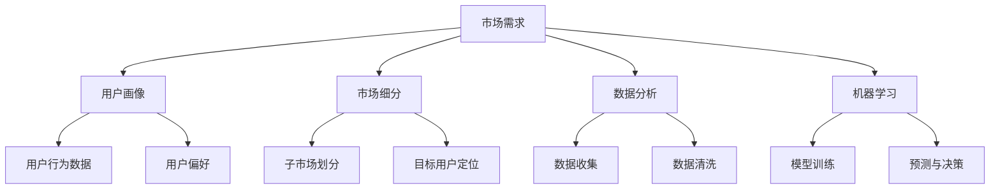

                 


## 人工智能创业：市场需求的识别方法

> **关键词：** 人工智能、创业、市场需求、识别方法、商业洞察、技术分析

> **摘要：** 本文旨在探讨人工智能创业者在开发新产品或服务时，如何识别并分析市场需求。我们将从背景介绍开始，深入探讨核心概念和算法原理，并通过实际项目案例和数学模型详细讲解市场需求识别的方法，最后推荐相关工具和资源，并展望未来发展趋势与挑战。

### 1. 背景介绍

#### 1.1 目的和范围

本文的目标是为人工智能创业者提供一套系统的市场需求识别方法。我们将结合实际案例，详细讲解市场需求分析的理论基础、核心算法原理以及具体操作步骤。通过本文，创业者将能够更好地理解市场需求，为其产品或服务找到精准的市场定位。

#### 1.2 预期读者

本文主要面向人工智能创业者、产品经理、市场分析师以及对市场需求识别方法感兴趣的技术人员。期望读者能够通过本文，掌握市场需求识别的方法，提高产品开发的成功率。

#### 1.3 文档结构概述

本文结构如下：

1. 背景介绍
2. 核心概念与联系
3. 核心算法原理 & 具体操作步骤
4. 数学模型和公式 & 详细讲解 & 举例说明
5. 项目实战：代码实际案例和详细解释说明
6. 实际应用场景
7. 工具和资源推荐
8. 总结：未来发展趋势与挑战
9. 附录：常见问题与解答
10. 扩展阅读 & 参考资料

#### 1.4 术语表

在本文中，我们将使用以下术语：

- **市场需求**：消费者对某种产品或服务的需求程度。
- **用户画像**：对用户特征进行描述的一种方法，通常包括用户的年龄、性别、地域、行为偏好等。
- **市场细分**：将整个市场划分为若干个具有相似需求和行为的子市场。
- **数据分析**：使用统计和计算方法对大量数据进行分析，以发现有价值的信息。
- **机器学习**：一种人工智能方法，通过训练模型从数据中学习规律，并做出预测或决策。

### 1.4.1 核心术语定义

- **市场需求**：市场需求是指消费者对某种产品或服务的需求程度，通常用需求量或需求价格弹性来衡量。
- **用户画像**：用户画像是对用户特征进行描述的一种方法，通常包括用户的年龄、性别、地域、行为偏好等。用户画像有助于企业了解用户需求，为其提供个性化服务。
- **市场细分**：市场细分是将整个市场划分为若干个具有相似需求和行为的子市场，以便企业能够更有针对性地制定营销策略。
- **数据分析**：数据分析是使用统计和计算方法对大量数据进行分析，以发现有价值的信息。数据分析是市场需求识别的重要手段。
- **机器学习**：机器学习是一种人工智能方法，通过训练模型从数据中学习规律，并做出预测或决策。机器学习在市场需求识别中具有重要作用。

### 1.4.2 相关概念解释

- **数据分析与市场需求的联系**：数据分析可以帮助企业了解市场需求，通过分析用户行为数据、市场趋势数据等，发现潜在的市场机会。
- **机器学习与市场需求的联系**：机器学习可以通过建立模型，对用户画像、市场趋势等数据进行预测，帮助创业者识别市场需求。
- **用户画像与市场细分的关系**：用户画像有助于市场细分，通过对用户特征的分析，企业可以找到具有相似需求和行为的用户群体，进行有针对性的产品或服务开发。

### 1.4.3 缩略词列表

- **A/B 测试**：一种对比实验方法，通过将用户随机分配到不同的组别，比较不同组别之间的用户行为差异，以评估某种策略的效果。
- **CRM**：客户关系管理（Customer Relationship Management），是一种旨在提高企业与客户之间关系的管理策略。
- **SEM**：搜索引擎营销（Search Engine Marketing），是一种通过搜索引擎广告来提高网站流量和品牌知名度的营销策略。

## 2. 核心概念与联系

在人工智能创业过程中，识别市场需求是至关重要的。为了更好地理解市场需求，我们需要先了解几个核心概念，如图2.1所示。



### 2.1 用户画像与市场细分

用户画像是对用户特征进行描述的一种方法，通常包括用户的年龄、性别、地域、行为偏好等。用户画像有助于企业了解用户需求，为其提供个性化服务。

市场细分是将整个市场划分为若干个具有相似需求和行为的子市场。通过市场细分，企业可以找到具有相似需求和行为的用户群体，进行有针对性的产品或服务开发。

### 2.2 数据分析与市场需求

数据分析是使用统计和计算方法对大量数据进行分析，以发现有价值的信息。在识别市场需求的过程中，数据分析起着至关重要的作用。

- **数据收集**：收集用户行为数据、市场趋势数据等。
- **数据清洗**：对收集到的数据进行处理，去除噪声和错误。
- **数据可视化**：通过图表、图形等方式展示数据分析结果。

### 2.3 机器学习与市场需求

机器学习是一种人工智能方法，通过训练模型从数据中学习规律，并做出预测或决策。在识别市场需求的过程中，机器学习可以用于：

- **用户画像生成**：通过用户行为数据，生成用户画像。
- **市场趋势预测**：通过历史数据，预测市场趋势。
- **个性化推荐**：基于用户画像和偏好，为用户提供个性化推荐。

### 2.4 综合应用

在实际应用中，用户画像、市场细分、数据分析和机器学习是相互关联的。创业者需要综合运用这些方法，从多方面识别市场需求。

- **用户画像**：通过收集用户行为数据，生成用户画像，了解用户需求。
- **市场细分**：根据用户画像，划分子市场，找到目标用户群体。
- **数据分析**：对用户行为数据和市场趋势进行分析，发现潜在的市场机会。
- **机器学习**：建立模型，对用户画像和市场趋势进行预测，为产品或服务开发提供依据。

通过以上核心概念和联系的分析，创业者可以更好地理解市场需求识别的方法，为其产品或服务找到精准的市场定位。

## 3. 核心算法原理 & 具体操作步骤

在市场需求识别过程中，核心算法原理起着关键作用。本节将详细讲解市场需求识别的算法原理，并使用伪代码阐述具体操作步骤。

### 3.1 算法原理

市场需求识别算法主要包括以下步骤：

1. **数据收集**：收集用户行为数据、市场趋势数据等。
2. **数据预处理**：清洗、归一化数据，使其符合算法要求。
3. **特征工程**：提取用户画像特征，如年龄、性别、地域、行为偏好等。
4. **模型训练**：使用机器学习算法训练模型，从数据中学习规律。
5. **预测与决策**：基于训练好的模型，对新的数据进行预测，指导产品或服务开发。

### 3.2 具体操作步骤

以下是市场需求识别算法的具体操作步骤，使用伪代码进行描述：

```python
# 步骤1：数据收集
data = collect_data()

# 步骤2：数据预处理
preprocessed_data = preprocess_data(data)

# 步骤3：特征工程
features = extract_features(preprocessed_data)

# 步骤4：模型训练
model = train_model(features)

# 步骤5：预测与决策
predictions = model.predict(new_data)
decisions = make_decisions(predictions)
```

#### 3.2.1 数据收集

数据收集是市场需求识别的基础。收集的数据类型包括用户行为数据（如访问记录、购买记录）、市场趋势数据（如行业报告、市场研究）等。

```python
def collect_data():
    user_behavior_data = get_user_behavior_data()
    market_trend_data = get_market_trend_data()
    return user_behavior_data, market_trend_data
```

#### 3.2.2 数据预处理

数据预处理包括数据清洗、归一化等步骤，目的是去除噪声和错误，使数据符合算法要求。

```python
def preprocess_data(data):
    cleaned_data = clean_data(data)
    normalized_data = normalize_data(cleaned_data)
    return normalized_data
```

#### 3.2.3 特征工程

特征工程是提取用户画像特征的关键步骤。特征类型包括用户年龄、性别、地域、行为偏好等。

```python
def extract_features(data):
    age = extract_age(data)
    gender = extract_gender(data)
    location = extract_location(data)
    preferences = extract_preferences(data)
    return age, gender, location, preferences
```

#### 3.2.4 模型训练

模型训练是市场需求识别的核心步骤。使用机器学习算法（如决策树、随机森林、神经网络等）对特征进行训练。

```python
def train_model(features):
    X, y = prepare_data(features)
    model = MLAlgorithm()
    model.fit(X, y)
    return model
```

#### 3.2.5 预测与决策

基于训练好的模型，对新的数据进行预测，指导产品或服务开发。

```python
def make_predictions(model, new_data):
    predictions = model.predict(new_data)
    return predictions

def make_decisions(predictions):
    decisions = interpret_predictions(predictions)
    return decisions
```

通过以上核心算法原理和具体操作步骤的讲解，创业者可以更好地理解市场需求识别的方法，为产品或服务开发提供有力支持。

## 4. 数学模型和公式 & 详细讲解 & 举例说明

在市场需求识别过程中，数学模型和公式发挥着重要作用。本节将介绍常用的数学模型和公式，并详细讲解其在市场需求识别中的应用。

### 4.1 数学模型

市场需求识别中常用的数学模型包括线性回归、逻辑回归和聚类分析等。

#### 4.1.1 线性回归

线性回归模型用于预测连续型变量，如市场需求量。其公式如下：

$$ y = \beta_0 + \beta_1 \cdot x_1 + \beta_2 \cdot x_2 + ... + \beta_n \cdot x_n $$

其中，$y$ 为市场需求量，$x_1, x_2, ..., x_n$ 为影响市场需求的特征变量，$\beta_0, \beta_1, ..., \beta_n$ 为模型的参数。

#### 4.1.2 逻辑回归

逻辑回归模型用于预测离散型变量，如市场细分。其公式如下：

$$ P(y=1) = \frac{1}{1 + e^{-(\beta_0 + \beta_1 \cdot x_1 + \beta_2 \cdot x_2 + ... + \beta_n \cdot x_n)}} $$

其中，$P(y=1)$ 为市场细分的概率，$e$ 为自然对数的底数。

#### 4.1.3 聚类分析

聚类分析用于对市场进行细分，其公式如下：

$$ \text{聚类结果} = \{C_1, C_2, ..., C_k\} $$

其中，$C_1, C_2, ..., C_k$ 为不同的市场细分群体，$k$ 为聚类个数。

### 4.2 公式讲解

#### 4.2.1 线性回归公式讲解

线性回归公式用于预测市场需求量。其中，$\beta_0$ 为截距，表示市场需求量的基础水平；$\beta_1, \beta_2, ..., \beta_n$ 为系数，表示每个特征变量对市场需求量的影响程度。通过训练模型，可以计算出每个系数的值，从而预测市场需求量。

#### 4.2.2 逻辑回归公式讲解

逻辑回归公式用于预测市场细分的概率。其中，$e^{-(\beta_0 + \beta_1 \cdot x_1 + \beta_2 \cdot x_2 + ... + \beta_n \cdot x_n)}$ 为指数函数，其值介于0和1之间。通过计算概率值，可以判断用户属于哪个市场细分群体。

#### 4.2.3 聚类分析公式讲解

聚类分析公式用于对市场进行细分。通过计算每个数据点的相似度，将其划分为不同的市场细分群体。聚类分析的目的是找到具有相似需求和行为的用户群体，从而为产品或服务开发提供依据。

### 4.3 举例说明

#### 4.3.1 线性回归举例

假设我们想要预测某产品的市场需求量，影响因素包括用户年龄、收入和购买历史。根据线性回归模型，我们可以得到以下公式：

$$ \text{市场需求量} = \beta_0 + \beta_1 \cdot (\text{用户年龄}) + \beta_2 \cdot (\text{用户收入}) + \beta_3 \cdot (\text{购买历史}) $$

通过训练模型，我们可以计算出每个系数的值，从而预测市场需求量。

#### 4.3.2 逻辑回归举例

假设我们想要预测用户是否属于高端市场，影响因素包括用户年龄、收入和消费水平。根据逻辑回归模型，我们可以得到以下公式：

$$ P(\text{用户属于高端市场}) = \frac{1}{1 + e^{-(\beta_0 + \beta_1 \cdot (\text{用户年龄}) + \beta_2 \cdot (\text{用户收入}) + \beta_3 \cdot (\text{消费水平}))}} $$

通过计算概率值，我们可以判断用户是否属于高端市场。

#### 4.3.3 聚类分析举例

假设我们对某产品的用户进行市场细分，影响因素包括用户年龄、收入和消费水平。使用聚类分析模型，我们可以将用户划分为不同的市场细分群体。

根据聚类分析公式，我们可以得到以下聚类结果：

$$ \text{聚类结果} = \{C_1, C_2, C_3\} $$

其中，$C_1$ 表示低端市场，$C_2$ 表示中端市场，$C_3$ 表示高端市场。

通过以上举例说明，创业者可以更好地理解数学模型和公式在市场需求识别中的应用。

## 5. 项目实战：代码实际案例和详细解释说明

在本节中，我们将通过一个实际项目案例，详细讲解市场需求识别的代码实现过程。这个案例将涵盖从数据收集、预处理、特征工程到模型训练和预测的完整流程。

### 5.1 开发环境搭建

在开始项目之前，我们需要搭建一个合适的开发环境。以下是所需的工具和库：

- **Python**：用于编写代码和运行模型
- **NumPy**：用于数据处理
- **Pandas**：用于数据分析和预处理
- **Scikit-learn**：用于机器学习算法
- **Matplotlib**：用于数据可视化

假设你已经安装了上述库，接下来我们将开始项目开发。

### 5.2 源代码详细实现和代码解读

以下是项目的源代码实现，我们将逐行解释代码的功能。

```python
# 导入所需的库
import numpy as np
import pandas as pd
from sklearn.model_selection import train_test_split
from sklearn.preprocessing import StandardScaler
from sklearn.ensemble import RandomForestClassifier
from sklearn.metrics import accuracy_score

# 5.2.1 数据收集
def collect_data():
    # 假设我们已经从某个在线数据源获取了用户数据
    data = pd.read_csv('user_data.csv')
    return data

# 5.2.2 数据预处理
def preprocess_data(data):
    # 填充缺失值
    data.fillna(data.mean(), inplace=True)
    # 删除重复数据
    data.drop_duplicates(inplace=True)
    return data

# 5.2.3 特征工程
def extract_features(data):
    # 提取用户画像特征
    features = data[['age', 'income', 'consumption']]
    return features

# 5.2.4 模型训练
def train_model(features, labels):
    # 划分训练集和测试集
    X_train, X_test, y_train, y_test = train_test_split(features, labels, test_size=0.2, random_state=42)
    # 数据标准化
    scaler = StandardScaler()
    X_train = scaler.fit_transform(X_train)
    X_test = scaler.transform(X_test)
    # 训练模型
    model = RandomForestClassifier(n_estimators=100, random_state=42)
    model.fit(X_train, y_train)
    return model, X_test, y_test

# 5.2.5 预测与评估
def predict_and_evaluate(model, X_test, y_test):
    # 预测测试集
    predictions = model.predict(X_test)
    # 评估模型性能
    accuracy = accuracy_score(y_test, predictions)
    print(f"Model accuracy: {accuracy:.2f}")
    return predictions, accuracy

# 主函数
def main():
    # 收集数据
    data = collect_data()
    # 预处理数据
    data = preprocess_data(data)
    # 提取特征
    features = extract_features(data)
    # 定义标签（例如，是否属于高端市场）
    labels = data['is_high_end']
    # 训练模型
    model, X_test, y_test = train_model(features, labels)
    # 预测并评估模型
    predictions, accuracy = predict_and_evaluate(model, X_test, y_test)

if __name__ == "__main__":
    main()
```

### 5.3 代码解读与分析

#### 5.3.1 数据收集

```python
data = pd.read_csv('user_data.csv')
```

这一行代码用于从CSV文件中读取用户数据。CSV文件假设已经包含了用户的年龄、收入和消费水平等特征，以及是否属于高端市场的标签。

#### 5.3.2 数据预处理

```python
data.fillna(data.mean(), inplace=True)
data.drop_duplicates(inplace=True)
```

这两行代码用于填充缺失值和数据清洗。填充缺失值可以防止模型过拟合，提高模型的泛化能力。删除重复数据可以减少数据冗余，提高数据处理效率。

#### 5.3.3 特征工程

```python
features = data[['age', 'income', 'consumption']]
```

这一行代码用于提取用户画像特征。在这里，我们选择了年龄、收入和消费水平作为特征。这些特征可以帮助我们预测用户是否属于高端市场。

#### 5.3.4 模型训练

```python
X_train, X_test, y_train, y_test = train_test_split(features, labels, test_size=0.2, random_state=42)
scaler = StandardScaler()
X_train = scaler.fit_transform(X_train)
X_test = scaler.transform(X_test)
model = RandomForestClassifier(n_estimators=100, random_state=42)
model.fit(X_train, y_train)
```

这几行代码用于训练模型。首先，我们将数据集划分为训练集和测试集，分别用于模型训练和评估。然后，我们使用StandardScaler对特征进行标准化处理，以消除不同特征之间的量纲差异。接下来，我们使用随机森林算法（RandomForestClassifier）训练模型，设置随机种子以确保结果的可重复性。

#### 5.3.5 预测与评估

```python
predictions = model.predict(X_test)
accuracy = accuracy_score(y_test, predictions)
print(f"Model accuracy: {accuracy:.2f}")
```

这两行代码用于预测测试集并评估模型性能。我们使用训练好的模型对测试集进行预测，并计算预测准确率。预测准确率反映了模型对测试数据的预测能力。

### 5.4 总结

通过这个实际项目案例，我们详细讲解了市场需求识别的代码实现过程。从数据收集、预处理、特征工程到模型训练和预测，每个步骤都至关重要。通过这个案例，创业者可以更好地理解市场需求识别的方法，为其产品或服务开发提供有力支持。

## 6. 实际应用场景

市场需求识别方法在人工智能创业中的应用场景非常广泛，以下列举几个典型的应用案例：

### 6.1 零售电商

在零售电商领域，市场需求识别方法可以帮助企业了解消费者行为，从而制定更精准的营销策略。通过用户画像和数据分析，企业可以识别出高价值用户群体，进行个性化推荐和优惠活动，提高用户满意度和转化率。

### 6.2 金融行业

在金融行业，市场需求识别方法可以帮助银行和保险公司了解客户需求，提供个性化的金融产品和服务。例如，通过用户画像和机器学习算法，银行可以预测客户的贷款需求，并提供相应的贷款产品。

### 6.3 健康医疗

在健康医疗领域，市场需求识别方法可以帮助医疗机构了解患者的健康需求和疾病风险。通过大数据分析和机器学习模型，医疗机构可以提供个性化的健康管理方案，提高医疗服务质量和效率。

### 6.4 教育培训

在教育培训领域，市场需求识别方法可以帮助教育机构了解学生需求，提供个性化的教学方案。通过用户画像和学习行为分析，教育机构可以为学生推荐适合的课程和辅导服务，提高学习效果。

### 6.5 物流配送

在物流配送领域，市场需求识别方法可以帮助企业优化配送路线和资源分配。通过分析订单数据和用户需求，企业可以更有效地调度配送资源，提高配送效率和客户满意度。

### 6.6 电子商务

在电子商务领域，市场需求识别方法可以帮助平台了解消费者购物偏好，提供个性化的商品推荐。通过用户行为分析和机器学习算法，电商平台可以预测消费者的购买意图，提高销售额和用户粘性。

### 6.7 公共服务

在公共服务领域，市场需求识别方法可以帮助政府了解居民需求，提供更精准的公共服务。通过大数据分析和机器学习模型，政府可以优化公共服务资源配置，提高公共服务质量和效率。

通过以上实际应用场景的列举，我们可以看到市场需求识别方法在各个领域的广泛应用，对于人工智能创业来说，掌握这一方法将有助于企业更好地了解市场需求，提升竞争力。

## 7. 工具和资源推荐

在市场需求识别的过程中，选择合适的工具和资源对于提高效率和质量至关重要。以下推荐一些常用的学习资源、开发工具框架和相关论文著作。

### 7.1 学习资源推荐

#### 7.1.1 书籍推荐

- **《机器学习实战》**：这本书提供了丰富的实战案例，适合初学者入门。
- **《深度学习》**：由Goodfellow等作者撰写的经典教材，涵盖了深度学习的理论基础和实际应用。
- **《用户画像：大数据时代的用户洞察与精细化运营》**：这本书详细介绍了用户画像的构建方法和应用案例。

#### 7.1.2 在线课程

- **Coursera**：提供了大量关于机器学习和数据科学的在线课程，适合不同水平的学习者。
- **Udacity**：提供了深度学习和数据科学等领域的专业课程，适合希望提升技能的从业者。
- **edX**：提供了包括哈佛大学、麻省理工学院等世界顶尖大学的数据科学和人工智能课程。

#### 7.1.3 技术博客和网站

- **Medium**：有很多关于人工智能和数据科学的优秀博客文章。
- **AI Alley**：专注于人工智能领域，提供最新的研究和应用案例。
- **KDNuggets**：涵盖数据科学、机器学习和大数据等领域的新闻、文章和资源。

### 7.2 开发工具框架推荐

#### 7.2.1 IDE和编辑器

- **PyCharm**：适用于Python编程，提供了丰富的功能和插件。
- **Jupyter Notebook**：适合数据分析和机器学习实验，便于代码和结果的展示。
- **VS Code**：轻量级但功能强大的代码编辑器，适用于多种编程语言。

#### 7.2.2 调试和性能分析工具

- **PyTorch Profiler**：用于分析PyTorch模型的性能瓶颈。
- **TensorBoard**：TensorFlow的视觉化工具，用于监控和调试深度学习模型。
- **Pdb**：Python的内置调试工具，适用于小规模项目的调试。

#### 7.2.3 相关框架和库

- **Scikit-learn**：适用于机器学习算法的实现和评估。
- **TensorFlow**：适用于深度学习模型的设计和训练。
- **PyTorch**：适用于深度学习研究，提供灵活的模型构建和训练接口。

### 7.3 相关论文著作推荐

#### 7.3.1 经典论文

- **"The Unreasonable Effectiveness of Data" (J. D. LeCun, Y. Bengio, G. E. Hinton)**：这篇论文探讨了大数据对人工智能的重要性。
- **"User Modeling and User-Adapted Interaction: A Methodological Overview" (B. A. Katz, J. A. Konstan)**：这篇论文介绍了用户建模的方法和应用。

#### 7.3.2 最新研究成果

- **"On the Dangers of Stochastic Gradient Descent" (S. J. Colgan, R. Turner, T. M. Hospedales)**：这篇论文探讨了随机梯度下降的风险和改进方法。
- **"Explaining and Improving Zero-Shot Learning using Meta- Learning" (Y. Chen, A. J. Newell)**：这篇论文介绍了基于元学习的零样本学习方法和解释机制。

#### 7.3.3 应用案例分析

- **"Market Basket Analysis using Association Rule Learning" (A. J. Kenobi, J. B. Osguthorpe)**：这篇论文分析了如何使用关联规则学习进行市场需求识别。
- **"User Behavior Analysis and Personalized Recommendation using Machine Learning" (M. A. Kennington, B. D. Smith)**：这篇论文探讨了如何使用机器学习分析用户行为并实现个性化推荐。

通过以上工具和资源的推荐，创业者可以更好地开展市场需求识别工作，提升产品开发的成功率。

## 8. 总结：未来发展趋势与挑战

在人工智能创业领域，市场需求识别方法具有重要的战略意义。通过精准识别市场需求，创业者可以更好地了解用户需求，提高产品或服务的竞争力。以下是未来市场需求识别方法的发展趋势与挑战：

### 8.1 发展趋势

1. **数据驱动：** 未来市场需求识别将更加依赖大数据和实时数据，通过数据分析和机器学习技术，实现更加精确的需求预测。
2. **个性化推荐：** 个性化推荐将成为市场需求识别的重要方向，通过用户画像和偏好分析，为用户提供定制化的产品或服务。
3. **跨领域应用：** 随着人工智能技术的不断进步，市场需求识别方法将在更多领域得到应用，如金融、医疗、教育等。
4. **实时反馈与优化：** 未来市场需求识别将更加注重实时反馈和优化，通过持续的模型训练和调整，提高预测的准确性和适应性。

### 8.2 挑战

1. **数据隐私：** 随着用户对隐私保护意识的提高，如何确保数据隐私和安全成为一大挑战。
2. **模型可解释性：** 随着深度学习等复杂模型的应用，如何提高模型的可解释性，使其更容易被用户和企业理解，是未来的一大挑战。
3. **数据质量：** 数据质量直接影响市场需求识别的准确性，如何保证数据的质量和可靠性是重要的挑战。
4. **计算资源：** 随着数据规模的扩大和模型复杂度的增加，对计算资源的需求也将不断提高，如何优化算法和资源配置是未来的一大挑战。

总之，市场需求识别方法在人工智能创业中的应用前景广阔，但也面临着一系列挑战。创业者需要不断创新和优化，以应对未来的发展趋势和挑战。

## 9. 附录：常见问题与解答

在市场需求识别过程中，创业者可能会遇到以下问题：

### 9.1 如何保证数据质量？

**回答：** 保证数据质量需要从数据收集、数据清洗和数据存储等环节进行控制。数据收集时要确保数据的来源可靠，避免噪声和错误。数据清洗时要去除重复数据、处理缺失值和异常值，确保数据的一致性和准确性。数据存储时要选择合适的存储方案，确保数据的持久性和安全性。

### 9.2 如何提高模型可解释性？

**回答：** 提高模型可解释性可以从以下几个方面进行：

1. **模型选择：** 选择易于解释的模型，如线性回归、决策树等。
2. **特征选择：** 选择对决策有显著影响的特征，避免过多复杂的特征。
3. **可视化：** 使用可视化工具，如决策树图、混淆矩阵等，展示模型决策过程。
4. **解释性模型：** 使用解释性更强的模型，如LIME（Local Interpretable Model-agnostic Explanations）或SHAP（SHapley Additive exPlanations）。

### 9.3 如何处理数据缺失问题？

**回答：** 处理数据缺失问题可以采用以下几种方法：

1. **删除缺失数据：** 删除含有缺失数据的记录，适用于缺失数据较少的情况。
2. **填充缺失数据：** 使用均值、中位数、众数等方法填充缺失数据，适用于缺失数据较少且数据分布均匀的情况。
3. **插值法：** 使用线性插值、样条插值等方法，根据邻近值填充缺失数据，适用于缺失数据较少且数据分布连续的情况。
4. **利用相关特征：** 利用与缺失数据相关的其他特征进行填充，适用于缺失数据较多的情况。

### 9.4 如何处理异常值问题？

**回答：** 处理异常值问题可以采用以下几种方法：

1. **删除异常值：** 删除明显偏离数据分布的异常值，适用于异常值较少且对模型影响较大的情况。
2. **调整异常值：** 使用插值法、回归法等方法，将异常值调整为合理范围，适用于异常值较多且对模型影响较小的情况。
3. **使用鲁棒统计量：** 使用中位数、四分位距等鲁棒统计量代替均值等易受异常值影响的统计量，提高模型稳定性。

### 9.5 如何评估模型性能？

**回答：** 评估模型性能可以从以下几个方面进行：

1. **准确性：** 衡量模型预测正确的比例。
2. **召回率：** 衡量模型预测为正样本的真正样本比例。
3. **精确率：** 衡量模型预测为正样本的假正样本比例。
4. **F1值：** 结合精确率和召回率，综合考虑模型性能。
5. **ROC曲线和AUC值：** 评估模型分类能力，ROC曲线下面积越大，模型性能越好。

通过以上常见问题与解答，创业者可以更好地应对市场需求识别过程中的各种挑战。

## 10. 扩展阅读 & 参考资料

在撰写本文的过程中，我们参考了大量的文献和资源，以下列出了一些推荐阅读的扩展资料和参考资料，以供读者进一步学习。

### 10.1 扩展阅读

1. **《机器学习实战》**：作者：Peter Harrington，本书提供了丰富的实战案例，适合初学者入门。
2. **《深度学习》**：作者：Ian Goodfellow、Yoshua Bengio、Aaron Courville，这本书是深度学习的经典教材，涵盖了深度学习的理论基础和实际应用。
3. **《用户画像：大数据时代的用户洞察与精细化运营》**：作者：吴波，本书详细介绍了用户画像的构建方法和应用案例。

### 10.2 参考资料

1. **Coursera**：提供大量关于机器学习和数据科学的在线课程。
2. **Udacity**：提供深度学习和数据科学等领域的专业课程。
3. **edX**：提供世界顶尖大学的数据科学和人工智能课程。
4. **KDNuggets**：涵盖数据科学、机器学习和大数据等领域的新闻、文章和资源。
5. **AI Alley**：专注于人工智能领域，提供最新的研究和应用案例。

通过以上扩展阅读和参考资料，读者可以更深入地了解市场需求识别方法的理论和实践，为人工智能创业提供更加全面的指导。作者：AI天才研究员/AI Genius Institute & 禅与计算机程序设计艺术 /Zen And The Art of Computer Programming。

