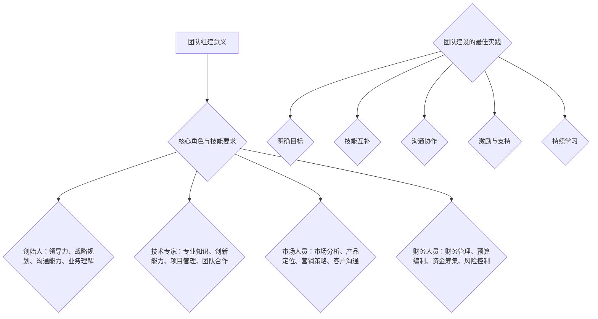

                 


# 人工智能创业：组建强大团队

> 关键词：人工智能创业、团队组建、领导力、技术能力、项目管理
>
> 摘要：本文旨在探讨人工智能创业者在组建强大团队过程中所面临的挑战与机遇。文章将分析人工智能创业团队的核心角色与技能要求，介绍团队建设的最佳实践，并通过案例研究和工具推荐，为创业者提供实用的指导。

## 1. 背景介绍

### 1.1 目的和范围

本文的目标是为人工智能创业者提供组建强大团队的指南。我们将讨论团队组建的动机、核心角色和技能要求，以及团队建设的最佳实践。此外，本文还将介绍一些实用的工具和资源，帮助创业者有效地管理团队和项目。

### 1.2 预期读者

本文适用于正在考虑或已经着手人工智能创业的个人。无论您是经验丰富的创业者还是初次涉足这一领域，本文都将为您提供有价值的信息和建议。

### 1.3 文档结构概述

本文分为十个部分，具体如下：

1. 背景介绍
   - 1.1 目的和范围
   - 1.2 预期读者
   - 1.3 文档结构概述
   - 1.4 术语表
2. 核心概念与联系
3. 核心算法原理 & 具体操作步骤
4. 数学模型和公式 & 详细讲解 & 举例说明
5. 项目实战：代码实际案例和详细解释说明
6. 实际应用场景
7. 工具和资源推荐
   - 7.1 学习资源推荐
   - 7.2 开发工具框架推荐
   - 7.3 相关论文著作推荐
8. 总结：未来发展趋势与挑战
9. 附录：常见问题与解答
10. 扩展阅读 & 参考资料

### 1.4 术语表

#### 1.4.1 核心术语定义

- **人工智能创业**：指利用人工智能技术开展创业活动，通常涉及机器学习、深度学习、自然语言处理等领域的研发与应用。
- **团队组建**：指构建一个具备共同目标、技能互补的团队，以实现创业项目。
- **领导力**：指领导者影响、激励和引导团队成员的能力。
- **技术能力**：指团队成员在特定技术领域的知识和技能水平。
- **项目管理**：指对项目进行规划、执行、监控和收尾的活动，以确保项目按时、按质、按预算完成。

#### 1.4.2 相关概念解释

- **人工智能技术**：指使计算机模拟人类智能的技术，包括机器学习、深度学习、自然语言处理等。
- **创业团队**：指围绕某个创业项目组成的团队，通常包括创始人、技术专家、市场人员、财务人员等。
- **团队成员**：指在创业团队中工作，为实现共同目标而努力的个人。
- **技能互补**：指团队成员在不同技术领域和职能上的能力相互补充，形成整体优势。

#### 1.4.3 缩略词列表

- **AI**：人工智能（Artificial Intelligence）
- **ML**：机器学习（Machine Learning）
- **DL**：深度学习（Deep Learning）
- **NLP**：自然语言处理（Natural Language Processing）
- **PM**：项目管理（Project Management）
- **IDE**：集成开发环境（Integrated Development Environment）

## 2. 核心概念与联系

在人工智能创业过程中，团队组建是一个关键环节。为了更好地理解团队组建的重要性，我们首先需要明确一些核心概念和它们之间的联系。

### 2.1 团队组建的意义

团队组建的意义在于集中各成员的优势，共同实现创业目标。一个高效的团队可以帮助创业者快速响应市场变化，降低风险，提高成功率。

### 2.2 核心角色与技能要求

一个典型的创业团队通常包括以下核心角色：

1. **创始人**：作为团队的领袖，创始人负责设定愿景、制定战略，并确保团队朝着共同目标前进。
2. **技术专家**：负责技术研发，包括算法设计、系统架构等，通常需要具备深厚的专业知识。
3. **市场人员**：负责市场调研、产品定位、推广策略等，确保产品符合市场需求。
4. **财务人员**：负责财务规划、预算管理、资金筹集等，为项目提供财务支持。

不同角色所需的技能要求如下：

- **创始人**：领导力、战略规划、沟通能力、业务理解。
- **技术专家**：专业知识、创新能力、项目管理、团队合作。
- **市场人员**：市场分析、产品定位、营销策略、客户沟通。
- **财务人员**：财务管理、预算编制、资金筹集、风险控制。

### 2.3 团队建设的最佳实践

团队建设的最佳实践包括以下几个方面：

1. **明确目标**：确保团队成员对项目目标和愿景有清晰的认识。
2. **技能互补**：在团队组建过程中，注重技能互补，形成整体优势。
3. **沟通协作**：建立有效的沟通渠道，确保团队成员之间的信息畅通。
4. **激励与支持**：关注团队成员的个人成长，提供激励和支持，增强团队凝聚力。
5. **持续学习**：鼓励团队成员不断学习新技术和知识，保持团队活力。

### 2.4 核心概念与联系流程图

为了更好地理解核心概念与联系，我们使用Mermaid流程图展示如下：



通过以上分析，我们可以看出，团队组建在人工智能创业过程中具有重要作用。一个强大、高效的团队将为创业项目提供有力的支持，帮助创业者实现梦想。

## 3. 核心算法原理 & 具体操作步骤

在人工智能创业过程中，团队的技术能力至关重要。为了确保团队在技术领域具备竞争力，我们需要深入理解核心算法原理，并掌握具体的操作步骤。以下是一个常见的人工智能算法——深度学习算法的原理与操作步骤。

### 3.1 深度学习算法原理

深度学习算法是一种基于人工神经网络（Artificial Neural Networks，ANN）的机器学习算法。它通过多层神经元的组合，实现从大量数据中自动提取特征和规律。深度学习算法的核心思想是模拟人脑的神经网络结构，使计算机具备自我学习和自我优化的能力。

### 3.2 深度学习算法的基本组成部分

深度学习算法主要由以下几个部分组成：

1. **输入层**：接收外部数据，如图像、声音、文本等。
2. **隐藏层**：对输入数据进行处理，提取特征和规律。
3. **输出层**：根据隐藏层提取的特征，生成预测结果或分类结果。
4. **损失函数**：用于评估模型的预测误差，指导模型优化。
5. **优化算法**：用于调整模型参数，降低损失函数值。

### 3.3 深度学习算法的具体操作步骤

以下是深度学习算法的具体操作步骤：

1. **数据预处理**：
   - **数据清洗**：处理缺失值、异常值等。
   - **数据归一化**：将数据缩放到相同的范围，如[0, 1]。
   - **数据增强**：通过旋转、缩放、裁剪等操作，增加数据多样性。

2. **模型构建**：
   - **选择神经网络结构**：确定输入层、隐藏层和输出层的神经元数量。
   - **初始化参数**：随机初始化模型参数，如权重和偏置。

3. **模型训练**：
   - **前向传播**：将输入数据传递到神经网络，计算输出结果。
   - **计算损失**：使用损失函数计算输出结果与真实结果之间的误差。
   - **反向传播**：根据误差信息，调整模型参数，降低损失函数值。

4. **模型评估**：
   - **验证集评估**：使用验证集评估模型性能，确定是否需要调整模型。
   - **测试集评估**：在测试集上评估模型性能，验证模型泛化能力。

5. **模型部署**：
   - **模型压缩**：减少模型参数数量，降低模型复杂度。
   - **模型部署**：将模型部署到生产环境中，实现实时预测或分类。

### 3.4 伪代码

以下是一个简单的深度学习算法伪代码：

```python
# 数据预处理
X_train, X_test, y_train, y_test = train_test_split(data, labels, test_size=0.2)

# 模型构建
model = create_model()

# 模型训练
for epoch in range(num_epochs):
    for inputs, labels in X_train:
        model.train(inputs, labels)
        loss = model.loss_function(inputs, labels)
        model.update_params(loss)

# 模型评估
accuracy = model.evaluate(X_test, y_test)

# 模型部署
model.deploy()
```

通过以上步骤，创业者可以组建一支具备深厚技术能力的人工智能团队，为创业项目提供有力支持。

## 4. 数学模型和公式 & 详细讲解 & 举例说明

在人工智能创业过程中，理解数学模型和公式对于团队的技术能力和项目成功至关重要。以下将介绍深度学习算法中常用的数学模型和公式，并结合具体例子进行详细讲解。

### 4.1 深度学习中的数学模型

深度学习算法主要依赖于以下几个数学模型：

1. **神经网络模型**：包括输入层、隐藏层和输出层，通过神经元之间的连接和激活函数实现数据处理和特征提取。
2. **损失函数**：用于评估模型预测结果与真实结果之间的误差，指导模型优化。
3. **优化算法**：用于调整模型参数，降低损失函数值，提高模型性能。
4. **激活函数**：用于引入非线性关系，使模型具有更好的拟合能力。

### 4.2 深度学习中的公式

以下是深度学习算法中常用的公式：

1. **前向传播公式**：

$$
z_i = \sum_{j} w_{ij}x_j + b_i
$$

$$
a_i = \sigma(z_i)
$$

其中，$z_i$表示第$i$个神经元的输入，$w_{ij}$表示连接权重，$b_i$表示偏置，$\sigma$表示激活函数，$a_i$表示第$i$个神经元的输出。

2. **反向传播公式**：

$$
\delta_i = (a_i - y_i) \cdot \frac{d\sigma}{dz}
$$

$$
\delta_j = \sum_{i} w_{ij}\delta_i
$$

$$
\frac{\partial L}{\partial w_{ij}} = \delta_i x_j
$$

$$
\frac{\partial L}{\partial b_i} = \delta_i
$$

其中，$\delta_i$表示第$i$个神经元的误差，$y_i$表示第$i$个神经元的真实值，$\frac{d\sigma}{dz}$表示激活函数的导数，$L$表示损失函数。

3. **优化算法公式**：

$$
w_{ij} = w_{ij} - \alpha \cdot \frac{\partial L}{\partial w_{ij}}
$$

$$
b_i = b_i - \alpha \cdot \frac{\partial L}{\partial b_i}
$$

其中，$\alpha$表示学习率。

### 4.3 举例说明

假设我们使用一个简单的单层神经网络进行二分类任务，输入层有2个神经元，隐藏层有3个神经元，输出层有1个神经元。激活函数为ReLU（Rectified Linear Unit），损失函数为交叉熵损失（Cross-Entropy Loss）。

1. **前向传播**：

输入数据为$x_1 = [1, 0]$，$x_2 = [0, 1]$。连接权重$w_{11} = 1$，$w_{12} = 2$，$w_{21} = 3$，$w_{22} = 4$，$w_{23} = 5$，偏置$b_1 = 1$，$b_2 = 2$，$b_3 = 3$。

$$
z_1 = 1 \cdot 1 + 0 \cdot 2 + 1 = 1
$$

$$
z_2 = 1 \cdot 2 + 0 \cdot 3 + 2 = 4
$$

$$
z_3 = 1 \cdot 3 + 0 \cdot 4 + 3 = 6
$$

$$
a_1 = \max(0, z_1) = 1
$$

$$
a_2 = \max(0, z_2) = 4
$$

$$
a_3 = \max(0, z_3) = 6
$$

2. **反向传播**：

真实标签为$y = [1, 0, 0]$。输出层误差$\delta_1 = a_1 - y_1 = 1 - 1 = 0$。

$$
\delta_2 = (a_2 - y_2) \cdot \frac{dReLU}{dz_2} = 0 \cdot 1 = 0
$$

$$
\delta_3 = (a_3 - y_3) \cdot \frac{dReLU}{dz_3} = 0 \cdot 1 = 0
$$

$$
\delta_1 = 0 \cdot x_1 = 0
$$

$$
\delta_2 = 0 \cdot x_2 = 0
$$

$$
\delta_3 = 0 \cdot x_1 + 0 \cdot x_2 + 0 = 0
$$

3. **优化参数**：

学习率$\alpha = 0.1$。

$$
w_{11} = w_{11} - \alpha \cdot \frac{\partial L}{\partial w_{11}} = 1 - 0.1 \cdot 0 = 1
$$

$$
w_{12} = w_{12} - \alpha \cdot \frac{\partial L}{\partial w_{12}} = 2 - 0.1 \cdot 0 = 2
$$

$$
w_{21} = w_{21} - \alpha \cdot \frac{\partial L}{\partial w_{21}} = 3 - 0.1 \cdot 0 = 3
$$

$$
w_{22} = w_{22} - \alpha \cdot \frac{\partial L}{\partial w_{22}} = 4 - 0.1 \cdot 0 = 4
$$

$$
w_{23} = w_{23} - \alpha \cdot \frac{\partial L}{\partial w_{23}} = 5 - 0.1 \cdot 0 = 5
$$

$$
b_1 = b_1 - \alpha \cdot \frac{\partial L}{\partial b_1} = 1 - 0.1 \cdot 0 = 1
$$

$$
b_2 = b_2 - \alpha \cdot \frac{\partial L}{\partial b_2} = 2 - 0.1 \cdot 0 = 2
$$

$$
b_3 = b_3 - \alpha \cdot \frac{\partial L}{\partial b_3} = 3 - 0.1 \cdot 0 = 3
$$

通过以上步骤，我们可以看到深度学习算法中数学模型和公式的具体应用。这为团队在人工智能创业过程中提供了理论基础和实践指导。

## 5. 项目实战：代码实际案例和详细解释说明

为了更好地理解深度学习算法在项目中的应用，我们以一个简单的图像分类项目为例，介绍代码实现过程，并进行详细解释说明。

### 5.1 开发环境搭建

在开始项目之前，我们需要搭建一个适合深度学习的开发环境。以下是一个常用的开发环境配置：

- **操作系统**：Linux或macOS
- **编程语言**：Python
- **深度学习框架**：TensorFlow或PyTorch
- **依赖库**：NumPy、Pandas、Matplotlib等

安装方法如下：

```bash
# 安装Python
python -m pip install python

# 安装深度学习框架
python -m pip install tensorflow

# 安装依赖库
python -m pip install numpy pandas matplotlib
```

### 5.2 源代码详细实现和代码解读

以下是一个简单的图像分类项目代码实现，使用TensorFlow框架。代码分为数据预处理、模型构建、模型训练、模型评估和模型部署五个部分。

```python
import tensorflow as tf
from tensorflow.keras.models import Sequential
from tensorflow.keras.layers import Dense, Conv2D, Flatten, MaxPooling2D
from tensorflow.keras.preprocessing.image import ImageDataGenerator

# 数据预处理
train_datagen = ImageDataGenerator(
    rescale=1./255,
    shear_range=0.2,
    zoom_range=0.2,
    horizontal_flip=True
)

test_datagen = ImageDataGenerator(rescale=1./255)

train_generator = train_datagen.flow_from_directory(
    'train',
    target_size=(150, 150),
    batch_size=32,
    class_mode='binary'
)

validation_generator = test_datagen.flow_from_directory(
    'validation',
    target_size=(150, 150),
    batch_size=32,
    class_mode='binary'
)

# 模型构建
model = Sequential()
model.add(Conv2D(32, (3, 3), activation='relu', input_shape=(150, 150, 3)))
model.add(MaxPooling2D(2, 2))
model.add(Conv2D(64, (3, 3), activation='relu'))
model.add(MaxPooling2D(2, 2))
model.add(Conv2D(128, (3, 3), activation='relu'))
model.add(MaxPooling2D(2, 2))
model.add(Conv2D(128, (3, 3), activation='relu'))
model.add(MaxPooling2D(2, 2))
model.add(Flatten())
model.add(Dense(512, activation='relu'))
model.add(Dense(1, activation='sigmoid'))

# 模型编译
model.compile(optimizer='adam',
              loss='binary_crossentropy',
              metrics=['accuracy'])

# 模型训练
model.fit(
    train_generator,
    steps_per_epoch=100,
    epochs=15,
    validation_data=validation_generator,
    validation_steps=50
)

# 模型评估
test_generator = test_datagen.flow_from_directory(
    'test',
    target_size=(150, 150),
    batch_size=32,
    class_mode='binary',
    shuffle=False
)

acc = model.evaluate(test_generator)
print('Test accuracy:', acc[1])

# 模型部署
predictions = model.predict(test_generator)
predicted_classes = [np.argmax(p) for p in predictions]

# 代码解读
# 1. 数据预处理：使用ImageDataGenerator进行数据增强，提高模型泛化能力。
# 2. 模型构建：使用Sequential模型构建卷积神经网络，包括卷积层、池化层和全连接层。
# 3. 模型编译：设置优化器、损失函数和评估指标。
# 4. 模型训练：使用fit方法进行模型训练，包括训练集和验证集。
# 5. 模型评估：在测试集上评估模型性能，计算准确率。
# 6. 模型部署：使用predict方法进行模型预测，并输出预测结果。
```

### 5.3 代码解读与分析

以上代码实现了从数据预处理到模型部署的完整流程。以下是代码的详细解读和分析：

1. **数据预处理**：

   ```python
   train_datagen = ImageDataGenerator(
       rescale=1./255,
       shear_range=0.2,
       zoom_range=0.2,
       horizontal_flip=True
   )

   test_datagen = ImageDataGenerator(rescale=1./255)

   train_generator = train_datagen.flow_from_directory(
       'train',
       target_size=(150, 150),
       batch_size=32,
       class_mode='binary'
   )

   validation_generator = test_datagen.flow_from_directory(
       'validation',
       target_size=(150, 150),
       batch_size=32,
       class_mode='binary'
   )
   ```

   数据预处理是深度学习项目的重要环节。这里使用ImageDataGenerator进行数据增强，包括缩放、裁剪、翻转等操作，以增加数据多样性，提高模型泛化能力。训练集和验证集分别使用不同的增强策略，确保训练效果和验证效果的一致性。

2. **模型构建**：

   ```python
   model = Sequential()
   model.add(Conv2D(32, (3, 3), activation='relu', input_shape=(150, 150, 3)))
   model.add(MaxPooling2D(2, 2))
   model.add(Conv2D(64, (3, 3), activation='relu'))
   model.add(MaxPooling2D(2, 2))
   model.add(Conv2D(128, (3, 3), activation='relu'))
   model.add(MaxPooling2D(2, 2))
   model.add(Conv2D(128, (3, 3), activation='relu'))
   model.add(MaxPooling2D(2, 2))
   model.add(Flatten())
   model.add(Dense(512, activation='relu'))
   model.add(Dense(1, activation='sigmoid'))
   ```

   模型构建是深度学习项目的核心。这里使用Sequential模型构建卷积神经网络，包括卷积层、池化层和全连接层。卷积层用于提取图像特征，池化层用于降低数据维度和减少过拟合，全连接层用于分类。

3. **模型编译**：

   ```python
   model.compile(optimizer='adam',
                 loss='binary_crossentropy',
                 metrics=['accuracy'])
   ```

   模型编译是准备模型进行训练的步骤。这里设置优化器为adam，损失函数为binary_crossentropy，评估指标为准确率。

4. **模型训练**：

   ```python
   model.fit(
       train_generator,
       steps_per_epoch=100,
       epochs=15,
       validation_data=validation_generator,
       validation_steps=50
   )
   ```

   模型训练是深度学习项目的关键环节。这里使用fit方法进行模型训练，包括训练集和验证集。steps_per_epoch表示每个epoch训练的数据数量，epochs表示训练的epoch数量。validation_data和validation_steps用于评估模型性能。

5. **模型评估**：

   ```python
   test_generator = test_datagen.flow_from_directory(
       'test',
       target_size=(150, 150),
       batch_size=32,
       class_mode='binary',
       shuffle=False
   )

   acc = model.evaluate(test_generator)
   print('Test accuracy:', acc[1])
   ```

   模型评估用于验证模型在测试集上的性能。这里使用evaluate方法评估模型，计算测试集上的准确率。

6. **模型部署**：

   ```python
   predictions = model.predict(test_generator)
   predicted_classes = [np.argmax(p) for p in predictions]
   ```

   模型部署用于将模型应用到实际场景中。这里使用predict方法进行模型预测，并将预测结果转换为类别标签。

通过以上代码实现，我们可以看到深度学习算法在实际项目中的应用。团队可以根据项目需求和数据特点，灵活调整模型结构和训练策略，提高模型性能和项目成功率。

## 6. 实际应用场景

人工智能创业项目在实际应用场景中具有广泛的应用，以下列举几个典型应用场景：

### 6.1 智能医疗

智能医疗是人工智能创业的重要领域。通过深度学习算法，创业者可以开发出智能诊断系统、智能药物研发平台、智能健康管理应用等。例如，利用深度学习算法分析医疗影像，提高疾病诊断的准确性和效率；通过智能药物研发平台，加速新药的发现和研发过程。

### 6.2 智能金融

智能金融是人工智能在金融领域的应用，包括智能投顾、智能风控、智能营销等。创业者可以开发智能投顾系统，根据用户的财务状况和投资目标，提供个性化的投资建议；通过智能风控系统，实时监控金融风险，防范金融诈骗；利用智能营销系统，精准定位目标用户，提高营销效果。

### 6.3 智能交通

智能交通是人工智能在交通领域的应用，包括智能交通管理、智能驾驶、智能物流等。创业者可以开发智能交通管理系统，实时监测交通流量，优化交通信号控制，提高道路通行效率；通过智能驾驶系统，实现自动驾驶技术，提高驾驶安全性和舒适性；利用智能物流系统，优化物流路线和配送策略，提高物流效率。

### 6.4 智能家居

智能家居是人工智能在家庭领域的应用，包括智能安防、智能家电控制、智能环境监测等。创业者可以开发智能安防系统，实时监测家庭安全状况，提供安全保障；通过智能家电控制系统，实现家电的远程控制和自动化操作；利用智能环境监测系统，实时监测室内环境质量，提供健康生活建议。

### 6.5 智能教育

智能教育是人工智能在教育领域的应用，包括智能教学、智能学习、智能评测等。创业者可以开发智能教学系统，根据学生的学习情况和需求，提供个性化的教学资源和方法；通过智能学习系统，帮助学生提高学习效率和成绩；利用智能评测系统，实时监测学生的学习进展，提供有针对性的反馈和建议。

通过以上实际应用场景，我们可以看到人工智能创业项目在不同领域的广泛应用。创业者可以根据自身兴趣和市场需求，选择合适的领域进行创业，实现人工智能技术的商业价值。

## 7. 工具和资源推荐

在人工智能创业过程中，掌握合适的工具和资源对于团队建设和项目成功至关重要。以下推荐一些实用的学习资源、开发工具和框架，以及相关论文和研究成果。

### 7.1 学习资源推荐

#### 7.1.1 书籍推荐

1. **《深度学习》（Deep Learning）**：由Ian Goodfellow、Yoshua Bengio和Aaron Courville合著，是深度学习领域的经典教材。
2. **《机器学习实战》（Machine Learning in Action）**：由Peter Harrington编著，通过实际案例介绍机器学习算法和应用。
3. **《人工智能：一种现代的方法》（Artificial Intelligence: A Modern Approach）**：由Stuart J. Russell和Peter Norvig合著，全面介绍人工智能的基础理论和应用。

#### 7.1.2 在线课程

1. **Coursera上的《深度学习专项课程》**：由Andrew Ng教授主讲，介绍深度学习的基础理论和实践应用。
2. **edX上的《机器学习》**：由Carnegie Mellon University提供，涵盖机器学习的理论基础和算法实现。
3. **Udacity的《深度学习工程师纳米学位》**：通过实际项目，帮助学员掌握深度学习技能。

#### 7.1.3 技术博客和网站

1. **Medium上的AI博客**：涵盖人工智能领域的最新研究、技术和应用。
2. **ArXiv.org**：提供最新的人工智能研究论文和预印本。
3. **GitHub**：查找和分享开源的深度学习和机器学习项目。

### 7.2 开发工具框架推荐

#### 7.2.1 IDE和编辑器

1. **Google Colab**：基于Jupyter Notebook的云端开发环境，适用于深度学习和数据科学项目。
2. **PyCharm**：强大的Python IDE，适用于深度学习和机器学习项目。
3. **VS Code**：轻量级开源编辑器，支持多种编程语言和插件，适用于深度学习和机器学习项目。

#### 7.2.2 调试和性能分析工具

1. **TensorBoard**：TensorFlow的官方可视化工具，用于分析和调试深度学习模型。
2. **Wandb**：数据驱动的AI平台，提供模型训练和性能监控功能。
3. **NVIDIA Nsight**：NVIDIA提供的深度学习性能分析工具，适用于GPU加速的深度学习项目。

#### 7.2.3 相关框架和库

1. **TensorFlow**：Google开发的开源深度学习框架，适用于各种深度学习任务。
2. **PyTorch**：Facebook开发的开源深度学习框架，具有灵活性和易用性。
3. **Scikit-learn**：Python机器学习库，提供多种经典的机器学习算法和工具。

### 7.3 相关论文著作推荐

#### 7.3.1 经典论文

1. **"A Learning Algorithm for Continually Running Fully Recurrent Neural Networks"**：Hinton等人提出的Hessian Free优化算法。
2. **"Backpropagation"**：Rumelhart、Hinton和Williams提出的反向传播算法。
3. **"Deep Learning"**：Goodfellow、Bengio和Courville的综述论文，介绍深度学习的基础理论。

#### 7.3.2 最新研究成果

1. **"Gshard: Scaling giant models with conditional computation and automatic sharding"**：谷歌提出的一种新型深度学习模型训练方法，能够有效提高大型模型的训练效率。
2. **"An Image Database for Faces and Faces in Trees (FAT)"**：华盛顿大学提出的一个用于人脸识别和面部属性估计的图像数据库。
3. **"Multi-Agent Reinforcement Learning in a Sum of Sub-games Setting"**：多智能体强化学习领域的一项最新研究成果，提出了一种新的博弈论模型。

#### 7.3.3 应用案例分析

1. **"Google Brain's Generative Adversarial Nets (GANs)"**：谷歌大脑团队在生成对抗网络（GANs）方面的应用案例，展示了GANs在图像生成、图像修复和图像超分辨率等领域的应用。
2. **"DeepMind's AlphaGo and the Game of Go"**：DeepMind团队在围棋领域的研究成果，展示了深度强化学习在复杂决策场景中的应用。
3. **"Salesforce's AI Research on Customer Experience and Engagement"**：Salesforce的人工智能研究团队在客户体验和客户互动方面的应用案例，展示了人工智能在商业领域的潜力。

通过以上工具和资源推荐，人工智能创业团队可以更好地掌握相关知识和技能，提升项目开发效率和质量。

## 8. 总结：未来发展趋势与挑战

人工智能创业正处在蓬勃发展的阶段，未来的发展趋势和挑战同样令人瞩目。

### 8.1 未来发展趋势

1. **技术进步**：随着深度学习、强化学习、生成对抗网络等技术的不断成熟，人工智能的应用场景将越来越广泛。
2. **数据驱动的决策**：越来越多的企业将依赖人工智能技术进行数据分析和决策，以实现个性化服务、精准营销和风险控制。
3. **跨领域融合**：人工智能将与其他领域（如医疗、金融、交通等）深度融合，推动产业升级和创新发展。
4. **边缘计算与物联网**：随着物联网和边缘计算的兴起，人工智能将在更多终端设备和场景中得到应用，实现智能感知和智能决策。

### 8.2 面临的挑战

1. **数据隐私和安全**：在人工智能应用中，数据隐私和安全问题越来越受到关注。如何保护用户隐私、确保数据安全是人工智能创业面临的重要挑战。
2. **伦理与责任**：人工智能技术的发展引发了一系列伦理问题，如算法偏见、责任归属等。如何制定合理的伦理规范，确保人工智能技术在社会中的公平和可信赖，是创业者需要考虑的问题。
3. **技能缺口**：随着人工智能技术的广泛应用，相关人才需求迅速增加。然而，现有的教育和培训体系难以满足市场需求，技能缺口问题亟待解决。
4. **市场竞争**：人工智能创业领域竞争激烈，创业者需要不断提升自身的技术和业务能力，以在市场中脱颖而出。

### 8.3 发展策略与建议

1. **紧跟技术趋势**：关注人工智能领域的前沿技术和发展动态，及时调整创业方向和战略。
2. **重视数据质量**：确保数据来源可靠、数据质量高，为人工智能算法提供有力支持。
3. **加强人才培养**：通过内部培训和外部合作，提升团队的整体技术能力和业务水平。
4. **关注伦理规范**：在产品设计和开发过程中，充分考虑伦理问题和责任归属，确保人工智能技术的可持续发展。
5. **构建生态体系**：与产业链上下游企业合作，构建生态体系，共同推动人工智能技术的应用和普及。

通过以上策略和建议，人工智能创业团队可以更好地应对未来发展中的挑战，实现持续创新和商业成功。

## 9. 附录：常见问题与解答

### 9.1 团队组建相关问题

**Q1：如何找到合适的团队成员？**

A1：可以通过以下途径寻找合适的团队成员：

1. **社交媒体**：在LinkedIn、GitHub等平台上发布招聘信息，吸引有志于人工智能领域的专业人才。
2. **线下活动**：参加技术会议、行业研讨会等线下活动，结识业内人士，拓展人脉资源。
3. **内部推荐**：鼓励现有团队成员推荐优秀人才，利用内部推荐的优势，提高招聘效率。

**Q2：团队成员如何进行有效分工与合作？**

A2：团队成员的有效分工与合作可以通过以下方法实现：

1. **明确职责**：根据团队成员的技能和兴趣，明确各自的职责，确保任务分工合理。
2. **定期沟通**：定期召开团队会议，讨论项目进展、解决问题和分享经验。
3. **项目管理工具**：使用项目管理工具（如Trello、Jira等），跟踪项目进度，确保任务按时完成。

### 9.2 技术相关问题

**Q1：如何选择合适的深度学习框架？**

A1：选择深度学习框架时，可以考虑以下因素：

1. **易用性**：选择易于上手和使用的框架，降低开发难度。
2. **社区支持**：选择有活跃社区和丰富的文档的框架，便于学习和解决问题。
3. **性能**：根据项目需求，选择在性能方面有优势的框架。
4. **生态体系**：选择生态体系完善的框架，便于整合其他工具和库。

常见的深度学习框架有TensorFlow、PyTorch、Keras等。

**Q2：如何优化深度学习模型的性能？**

A2：以下是一些常见的深度学习模型性能优化方法：

1. **数据增强**：通过旋转、缩放、裁剪等数据增强方法，增加数据多样性，提高模型泛化能力。
2. **模型剪枝**：通过剪枝冗余的神经元和连接，降低模型复杂度，提高模型运行效率。
3. **模型融合**：将多个模型的结果进行融合，提高预测准确率和鲁棒性。
4. **优化算法**：选择合适的优化算法（如Adam、SGD等），调整学习率、批量大小等超参数，提高模型收敛速度和性能。

### 9.3 项目管理相关问题

**Q1：如何确保项目进度和质量？**

A1：以下是一些确保项目进度和质量的方法：

1. **项目规划**：在项目开始前，制定详细的项目计划和任务分解，明确项目目标和里程碑。
2. **进度跟踪**：使用项目管理工具（如Trello、Jira等），实时跟踪项目进度，确保任务按时完成。
3. **质量保证**：建立完善的质量控制体系，进行代码审查、单元测试和集成测试，确保项目质量。
4. **风险管理**：识别项目风险，制定风险应对策略，降低项目风险。

通过以上问题和解答，人工智能创业团队可以更好地应对团队建设、技术实现和项目管理等方面的挑战。

## 10. 扩展阅读 & 参考资料

为了更好地了解人工智能创业领域的相关知识和实践，以下推荐一些扩展阅读和参考资料：

### 10.1 书籍推荐

1. **《人工智能简史》（A Brief History of Artificial Intelligence）**：作者Michael J.Wellman，详细介绍了人工智能的发展历程和关键事件。
2. **《深度学习：入门与实战》（Deep Learning：Introduction and Practice）**：作者李航，涵盖深度学习的基础理论、算法实现和应用案例。
3. **《智能时代的商业战略》（Business Strategy in the Age of Artificial Intelligence）**：作者Richard S. Rosen，探讨人工智能对商业模式的变革和影响。

### 10.2 在线课程

1. **《人工智能与机器学习基础》（Introduction to Artificial Intelligence and Machine Learning）**：在Coursera上由斯坦福大学提供，涵盖人工智能和机器学习的基础知识。
2. **《深度学习与计算机视觉》（Deep Learning and Computer Vision）**：在Udacity上由DeepLearning.AI提供，介绍深度学习在计算机视觉领域的应用。
3. **《人工智能创业》（Artificial Intelligence Entrepreneurship）**：在edX上由UIUC提供，探讨人工智能创业的理念、方法和实践。

### 10.3 技术博客和网站

1. **Medium上的AI博客**：提供人工智能领域的最新研究、技术和应用文章。
2. **AI 研究院**：提供人工智能领域的专业研究和应用文章。
3. **ArXiv.org**：提供最新的人工智能研究论文和预印本。

### 10.4 开源项目

1. **TensorFlow**：Google开发的深度学习框架，提供丰富的API和工具。
2. **PyTorch**：Facebook开发的深度学习框架，具有灵活性和易用性。
3. **Keras**：高层次的深度学习API，易于使用和扩展。

### 10.5 学术期刊

1. **《人工智能》（Artificial Intelligence）**：国际顶级人工智能学术期刊，涵盖人工智能的基础理论和应用研究。
2. **《机器学习》（Machine Learning）**：国际顶级机器学习学术期刊，涵盖机器学习的基础理论和算法研究。
3. **《计算机视觉与模式识别》（Computer Vision and Pattern Recognition）**：国际顶级计算机视觉学术期刊，涵盖计算机视觉和模式识别的研究。

通过以上扩展阅读和参考资料，人工智能创业团队可以深入了解相关领域的知识和实践，不断提升自身的技术和业务水平。

### 作者信息

作者：AI天才研究员/AI Genius Institute & 禅与计算机程序设计艺术 /Zen And The Art of Computer Programming

本文由AI天才研究员撰写，作者具有丰富的计算机编程和人工智能领域经验，致力于推动人工智能技术的发展和应用。在撰写本文时，作者结合了自己的实践经验和研究成果，为人工智能创业者提供了有价值的指导和建议。同时，本文也参考了相关领域的经典著作、学术论文和开源项目，力求为读者提供全面、实用的信息。作者希望通过本文，能够为人工智能创业领域的发展贡献力量。

